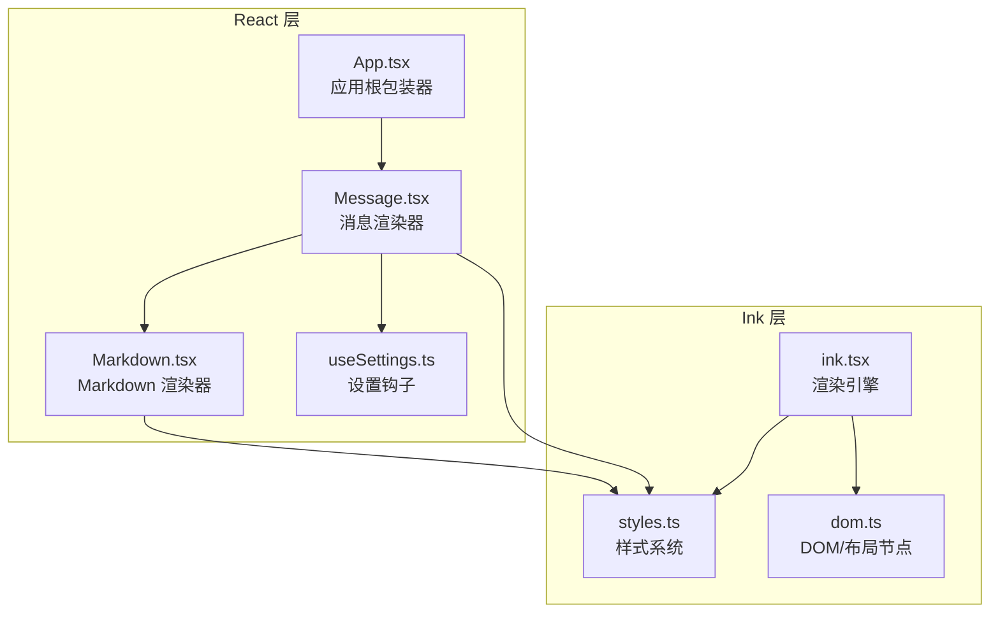
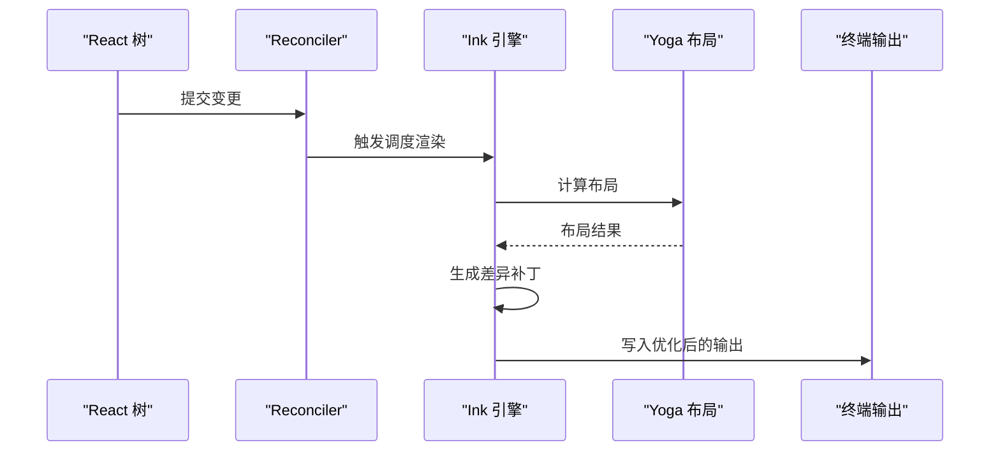
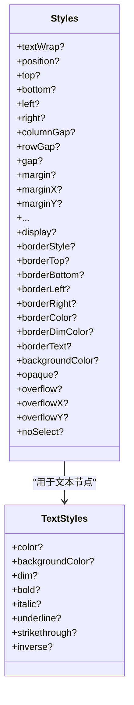
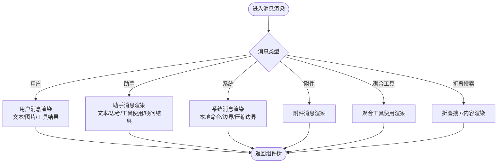
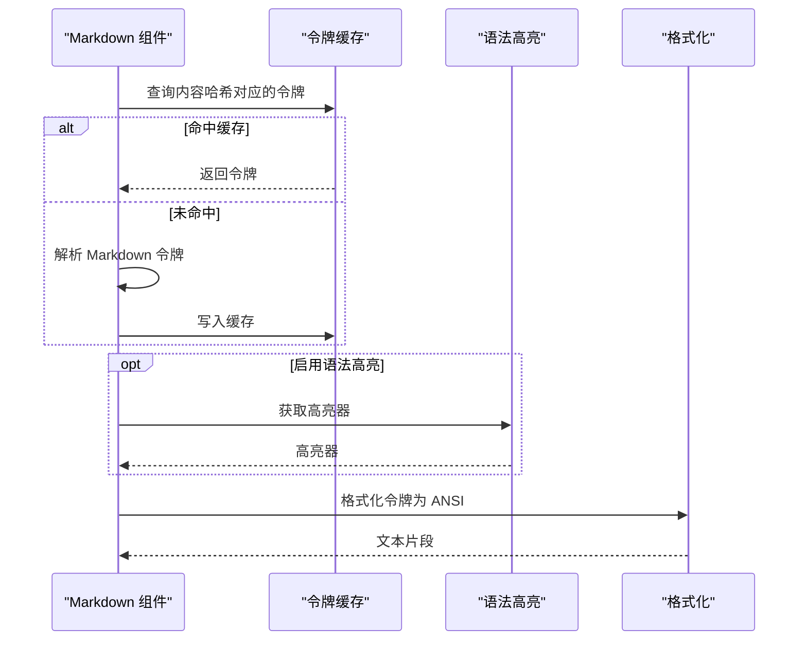
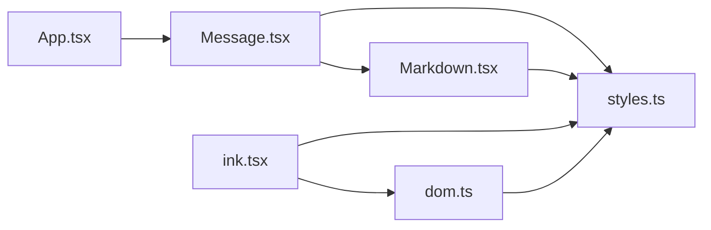

# UI 组件系统

<cite>
**本文档引用的文件**
- [App.tsx](file://src/components/App.tsx)
- [ink.tsx](file://src/ink/ink.tsx)
- [styles.ts](file://src/ink/styles.ts)
- [dom.ts](file://src/ink/dom.ts)
- [Markdown.tsx](file://src/components/Markdown.tsx)
- [Message.tsx](file://src/components/Message.tsx)
- [useSettings.ts](file://src/hooks/useSettings.ts)
</cite>

## 目录
1. [简介](#简介)
2. [项目结构](#项目结构)
3. [核心组件](#核心组件)
4. [架构总览](#架构总览)
5. [详细组件分析](#详细组件分析)
6. [依赖关系分析](#依赖关系分析)
7. [性能考量](#性能考量)
8. [故障排除指南](#故障排除指南)
9. [结论](#结论)
10. [附录](#附录)

## 简介
本文件面向 Claude Code 的 UI 组件系统，重点阐述基于 React/Ink 的终端 UI 架构设计与实现。内容涵盖：
- 设计系统与样式体系（颜色、字体、间距、布局）
- 消息渲染组件（文本、工具使用、系统消息等）
- 输入与交互组件（提示输入、历史搜索、快捷键）
- 对话框与通知系统（权限、设置、通知）
- 主题与样式机制（动态主题切换、响应式设计）
- 无障碍与跨平台兼容性
- 组件间通信与状态管理
- 使用示例与定制指南

## 项目结构
UI 组件系统由两层构成：
- React 层：负责业务逻辑与组件组合，如消息渲染、输入框、对话框等。
- Ink 层：负责终端渲染与布局计算，将 React 树转换为 ANSI 终端输出。

**图表来源**
- [App.tsx:1-56](file://src/components/App.tsx#L1-L56)
- [Message.tsx:1-627](file://src/components/Message.tsx#L1-L627)
- [Markdown.tsx:1-236](file://src/components/Markdown.tsx#L1-L236)
- [ink.tsx:1-800](file://src/ink/ink.tsx#L1-L800)
- [styles.ts:1-772](file://src/ink/styles.ts#L1-L772)
- [dom.ts:1-485](file://src/ink/dom.ts#L1-L485)

**章节来源**
- [App.tsx:1-56](file://src/components/App.tsx#L1-L56)
- [ink.tsx:1-800](file://src/ink/ink.tsx#L1-L800)

## 核心组件
- 应用根包装器：提供 FPS 指标、统计上下文与应用状态，作为所有交互会话的顶层容器。
- 消息渲染器：根据消息类型（用户、助手、系统、附件、工具使用等）选择对应子组件进行渲染，并处理思考内容、紧凑边界、转录模式等特殊场景。
- Markdown 渲染器：采用混合策略，表格使用 React 组件与 Flex 布局，其他内容通过 ANSI 字符串格式化；支持语法高亮缓存与流式增量渲染。
- 样式系统：统一的颜色、边距、内边距、尺寸、Flex、溢出、边框、不透明度等样式属性，映射到 Yoga 布局与终端渲染。
- DOM/布局节点：封装 Ink 节点，支持插入、删除、样式更新、脏标记与测量函数注册。

**章节来源**
- [Message.tsx:1-627](file://src/components/Message.tsx#L1-L627)
- [Markdown.tsx:1-236](file://src/components/Markdown.tsx#L1-L236)
- [styles.ts:1-772](file://src/ink/styles.ts#L1-L772)
- [dom.ts:1-485](file://src/ink/dom.ts#L1-L485)

## 架构总览
Ink 渲染引擎在每帧中：
- 计算布局（Yoga）
- 生成屏幕缓冲区差异
- 应用优化与光标定位
- 写入终端输出

**图表来源**
- [ink.tsx:236-279](file://src/ink/ink.tsx#L236-L279)
- [ink.tsx:420-789](file://src/ink/ink.tsx#L420-L789)

**章节来源**
- [ink.tsx:1-800](file://src/ink/ink.tsx#L1-L800)

## 详细组件分析

### 设计系统与样式体系
- 颜色系统：支持 RGB、十六进制、ANSI 256、ANSI 颜色常量，文本与背景色可独立配置。
- 文本样式：粗体、斜体、下划线、删除线、反色等。
- 布局样式：位置（绝对/相对）、尺寸（宽高/百分比/自动）、内外边距、行/列间距、Flex 方向/收缩/增长、对齐与分布、溢出（可见/隐藏/滚动）。
- 边框与不透明：边框样式与四边可见性、边框颜色与淡化、顶部/底部文本装饰、不透明填充。
- 样式应用：按属性分组应用到 Yoga 节点，支持差量更新与脏标记。

**图表来源**
- [styles.ts:44-53](file://src/ink/styles.ts#L44-L53)
- [styles.ts:55-404](file://src/ink/styles.ts#L55-L404)

**章节来源**
- [styles.ts:1-772](file://src/ink/styles.ts#L1-L772)

### 消息渲染组件
- 类型分发：根据消息类型选择对应渲染组件（用户文本/图片/工具结果、助手文本/思考/工具使用、系统文本/本地命令、附件、压缩边界、工具使用聚合、折叠搜索等）。
- 特殊处理：
  - 思考内容：在转录模式或详细模式下显示，支持仅显示最新思考块。
  - 紧凑边界：全屏环境下过滤显示。
  - 工具使用聚合：将多个工具调用合并展示。
  - 折叠搜索：离屏冻结以提升滚动性能。
- 性能优化：使用 React.memo 与属性相等性检查，避免无关重渲染；对具有思考内容的消息，仅在最后思考块变化时触发重渲染。

**图表来源**
- [Message.tsx:82-354](file://src/components/Message.tsx#L82-L354)

**章节来源**
- [Message.tsx:1-627](file://src/components/Message.tsx#L1-L627)

### Markdown 渲染组件
- 混合渲染策略：表格使用 React 组件与 Flex 布局，其余内容通过 ANSI 字符串格式化。
- 语法高亮：支持延迟加载与缓存，避免重复解析；可禁用语法高亮以提升性能。
- 缓存机制：模块级令牌缓存（LRU），基于内容哈希键控，避免保留完整字符串。
- 流式增量：在流式渲染时，仅重新解析最后一个非稳定块，其余部分复用已解析结果。

**图表来源**
- [Markdown.tsx:17-71](file://src/components/Markdown.tsx#L17-L71)
- [Markdown.tsx:123-171](file://src/components/Markdown.tsx#L123-L171)
- [Markdown.tsx:186-235](file://src/components/Markdown.tsx#L186-L235)

**章节来源**
- [Markdown.tsx:1-236](file://src/components/Markdown.tsx#L1-L236)

### 输入与交互组件
- 输入组件：基于 Ink 的文本输入与虚拟滚动，结合终端尺寸钩子实现自适应宽度。
- 历史搜索：通过历史钩子与搜索输入组件，支持上下箭头浏览历史与快速搜索。
- 快捷键：全局与命令级快捷键系统，支持解析、匹配与显示快捷键提示。

注：本节为概念性说明，具体实现细节请参考相关源码文件与钩子模块。

### 对话框与通知系统
- 权限对话框：用于请求与管理权限，支持回调与状态同步。
- 设置面板：通过设置钩子读取与更新用户偏好，支持动态主题切换与响应式布局。
- 通知系统：基于通知上下文与错误边界，提供统一的通知与错误展示。

**章节来源**
- [useSettings.ts:1-18](file://src/hooks/useSettings.ts#L1-L18)

### 主题与样式机制
- 动态主题切换：通过设置钩子与主题提供者，在渲染前更新样式与颜色方案。
- 响应式设计：基于终端尺寸与布局属性，实现自适应布局与溢出滚动。
- 样式应用链路：从 React 组件样式对象到 Ink 样式系统再到 Yoga 布局，最终渲染为 ANSI 输出。

**章节来源**
- [styles.ts:1-772](file://src/ink/styles.ts#L1-L772)
- [dom.ts:1-485](file://src/ink/dom.ts#L1-L485)

## 依赖关系分析
- 组件依赖：Message 依赖 Markdown、各消息子组件与设置钩子；Markdown 依赖样式系统与 CLI 高亮工具。
- 渲染依赖：Ink 引擎依赖 DOM/布局节点、样式系统与终端写入；DOM 节点依赖 Yoga 布局引擎与测量函数。
- 状态依赖：App 根包装器提供应用状态与统计上下文，供子组件订阅与更新。

**图表来源**
- [Message.tsx:1-627](file://src/components/Message.tsx#L1-L627)
- [Markdown.tsx:1-236](file://src/components/Markdown.tsx#L1-L236)
- [ink.tsx:1-800](file://src/ink/ink.tsx#L1-L800)
- [styles.ts:1-772](file://src/ink/styles.ts#L1-L772)
- [dom.ts:1-485](file://src/ink/dom.ts#L1-L485)
- [App.tsx:1-56](file://src/components/App.tsx#L1-L56)

**章节来源**
- [App.tsx:1-56](file://src/components/App.tsx#L1-L56)
- [Message.tsx:1-627](file://src/components/Message.tsx#L1-L627)
- [Markdown.tsx:1-236](file://src/components/Markdown.tsx#L1-L236)
- [ink.tsx:1-800](file://src/ink/ink.tsx#L1-L800)
- [styles.ts:1-772](file://src/ink/styles.ts#L1-L772)
- [dom.ts:1-485](file://src/ink/dom.ts#L1-L485)

## 性能考量
- 布局与渲染：
  - 使用 Yoga 进行一次性布局计算，减少重复测量。
  - 差异化输出（LogUpdate）仅写入变化区域，避免整屏重绘。
  - 光标定位与锚定（Alt 屏幕）减少相对移动误差，提升滚动一致性。
- 文本与 Markdown：
  - 令牌缓存（LRU）避免重复解析长文本。
  - 流式增量渲染仅重算不稳定块，降低 CPU 开销。
- 选择与高亮：
  - 选择覆盖与扫描高亮写入屏幕缓冲，配合全屏损伤回退确保正确性。
- 资源池：
  - 字符与超链接池定期重置，防止长时间会话内存膨胀。

**章节来源**
- [ink.tsx:420-789](file://src/ink/ink.tsx#L420-L789)
- [Markdown.tsx:17-71](file://src/components/Markdown.tsx#L17-L71)

## 故障排除指南
- 全屏重绘闪烁：
  - 检查是否触发了全屏损伤回退（full reset），可通过调试日志定位触发组件链。
  - 确认光标锚定与物理光标移动顺序，避免相对移动漂移。
- 选择与复制异常：
  - 确保选择区域在滚动框内容范围内，避免静态区域误选。
  - 检查拖拽与跟随滚动的同步逻辑，确保端点正确迁移。
- 布局错位：
  - 检查 Flex 属性与溢出设置，确认滚动模式与 scrollTop 更新。
  - 验证百分比尺寸与最小/最大尺寸约束是否合理。
- 性能问题：
  - 关闭语法高亮或启用令牌缓存，减少解析开销。
  - 减少频繁的样式对象创建，避免不必要的脏标记与重测量。

**章节来源**
- [ink.tsx:420-789](file://src/ink/ink.tsx#L420-L789)
- [dom.ts:455-484](file://src/ink/dom.ts#L455-L484)

## 结论
Claude Code 的 UI 组件系统通过 React/Ink 的深度集成，实现了高性能、可定制且跨平台的终端界面。设计系统与样式体系提供了统一的视觉语言，消息渲染器与 Markdown 渲染器兼顾可读性与性能，输入与交互组件支持丰富的用户操作，对话框与通知系统完善了用户体验。通过严格的布局与渲染优化策略，系统在复杂场景下仍能保持流畅与稳定。

## 附录
- 使用示例与定制指南：
  - 在组件中使用设置钩子读取用户偏好，动态调整渲染行为。
  - 通过样式对象配置布局与外观，利用 Flex 与溢出控制实现响应式布局。
  - 自定义消息渲染：扩展消息类型分支，添加新的消息子组件并接入渲染流程。
  - 定制主题：通过设置项切换主题，结合样式系统实现颜色与字体的统一管理。