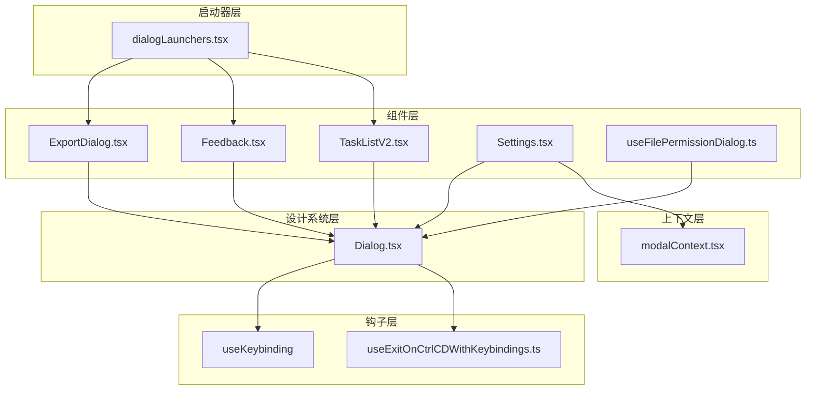
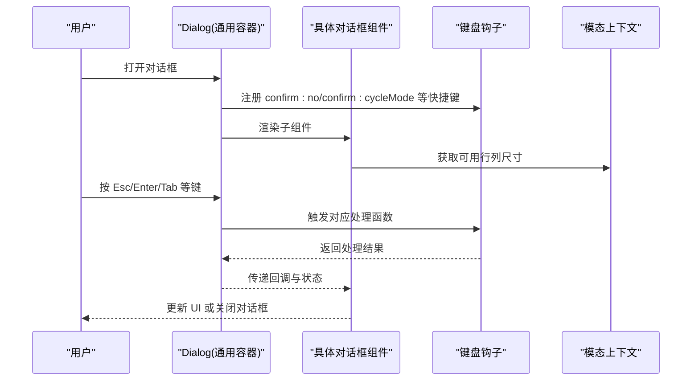
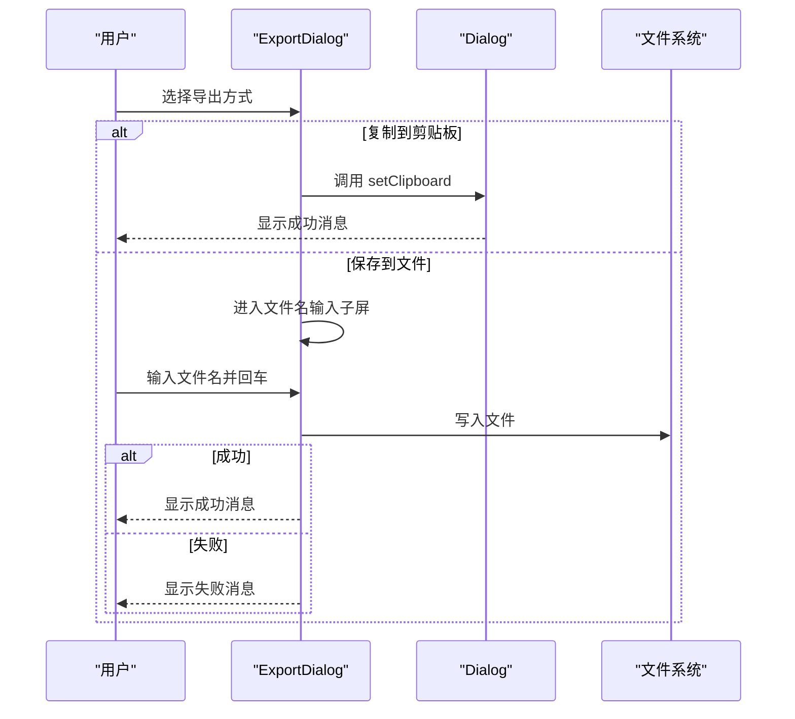
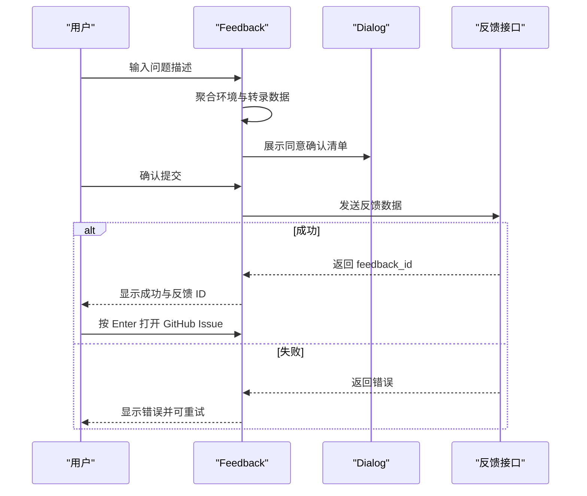
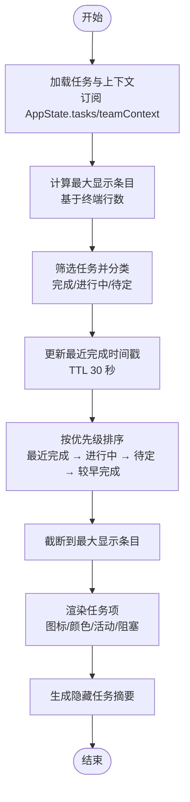
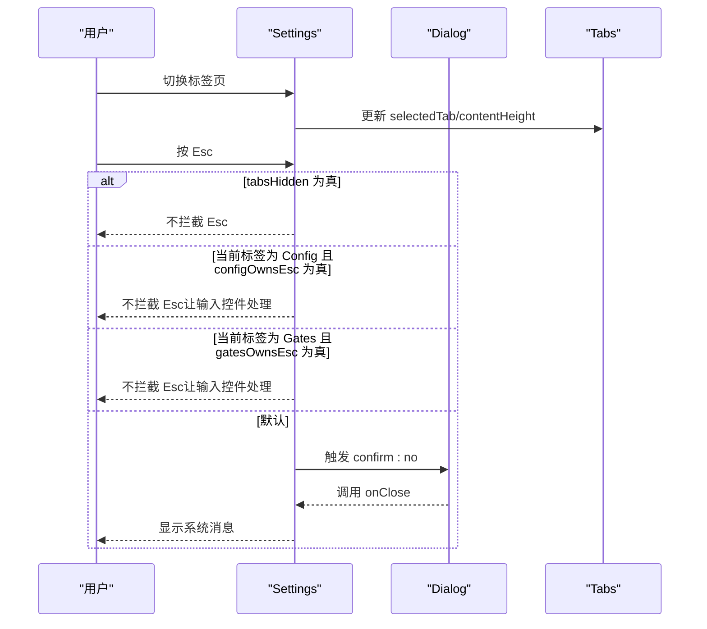
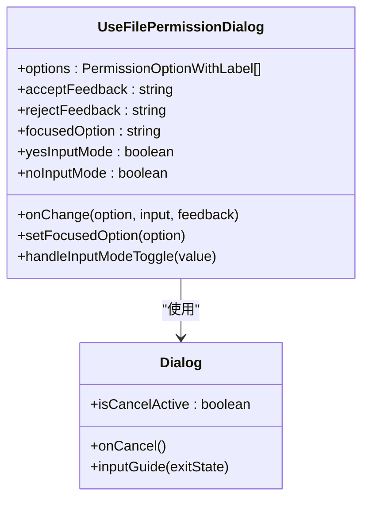
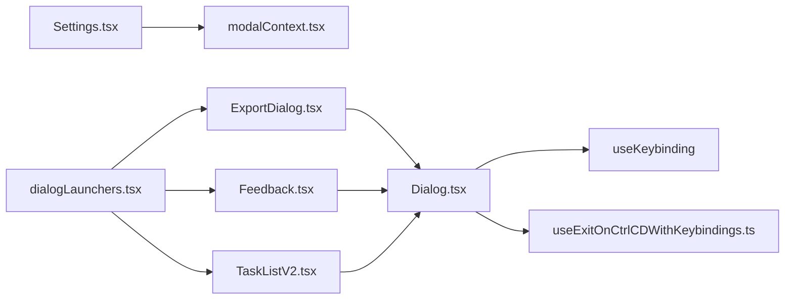

# 对话框组件

<cite>
**本文档引用的文件**
- [ExportDialog.tsx](file://src/components/ExportDialog.tsx)
- [Feedback.tsx](file://src/components/Feedback.tsx)
- [TaskListV2.tsx](file://src/components/TaskListV2.tsx)
- [Settings.tsx](file://src/components/Settings/Settings.tsx)
- [useFilePermissionDialog.ts](file://src/components/permissions/FilePermissionDialog/useFilePermissionDialog.ts)
- [Dialog.tsx](file://src/components/design-system/Dialog.tsx)
- [modalContext.tsx](file://src/context/modalContext.tsx)
- [useExitOnCtrlCDWithKeybindings.ts](file://src/hooks/useExitOnCtrlCDWithKeybindings.ts)
- [dialogLaunchers.tsx](file://src/dialogLaunchers.tsx)
</cite>

## 目录
1. [简介](#简介)
2. [项目结构](#项目结构)
3. [核心组件](#核心组件)
4. [架构总览](#架构总览)
5. [详细组件分析](#详细组件分析)
6. [依赖关系分析](#依赖关系分析)
7. [性能考虑](#性能考虑)
8. [故障排除指南](#故障排除指南)
9. [结论](#结论)
10. [附录](#附录)

## 简介
本文件为 Claude Code 的对话框组件技术文档，重点覆盖以下方面：
- 权限对话框系统的实现：权限请求、用户确认与决策处理机制
- 设置对话框（Settings）的架构：配置项管理与实时更新机制
- 导出对话框（ExportDialog）与反馈对话框（Feedback）的实现逻辑
- 任务列表对话框（TaskListV2）的状态管理与交互设计
- 对话框的模态管理与焦点控制机制
- 对话框的动画效果与过渡动画实现
- 对话框组件的使用示例与自定义扩展方法
- 对话框的可访问性支持与键盘导航功能
- 对话框与应用状态的集成方式与数据流管理

## 项目结构
对话框相关代码主要分布在以下模块：
- 组件层：各具体对话框组件（如 ExportDialog、Feedback、TaskListV2、Settings）
- 设计系统层：通用对话框容器 Dialog 及其配套组件（Byline、KeyboardShortcutHint 等）
- 上下文层：模态上下文 modalContext，用于在 FullscreenLayout 的 modal 插槽中渲染对话框时提供尺寸与滚动控制
- 钩子层：键盘绑定与退出处理钩子（useKeybinding、useExitOnCtrlCDWithKeybindings）
- 启动器层：dialogLaunchers 提供统一的动态导入与回调封装

**图表来源**
- [ExportDialog.tsx:1-128](file://src/components/ExportDialog.tsx#L1-L128)
- [Feedback.tsx:1-592](file://src/components/Feedback.tsx#L1-L592)
- [TaskListV2.tsx:1-378](file://src/components/TaskListV2.tsx#L1-L378)
- [Settings.tsx:1-137](file://src/components/Settings/Settings.tsx#L1-L137)
- [useFilePermissionDialog.ts:1-213](file://src/components/permissions/FilePermissionDialog/useFilePermissionDialog.ts#L1-L213)
- [Dialog.tsx:1-138](file://src/components/design-system/Dialog.tsx#L1-L138)
- [modalContext.tsx:1-58](file://src/context/modalContext.tsx#L1-L58)
- [useExitOnCtrlCDWithKeybindings.ts:1-25](file://src/hooks/useExitOnCtrlCDWithKeybindings.ts#L1-L25)
- [dialogLaunchers.tsx:1-133](file://src/dialogLaunchers.tsx#L1-L133)

**章节来源**
- [ExportDialog.tsx:1-128](file://src/components/ExportDialog.tsx#L1-L128)
- [Feedback.tsx:1-592](file://src/components/Feedback.tsx#L1-L592)
- [TaskListV2.tsx:1-378](file://src/components/TaskListV2.tsx#L1-L378)
- [Settings.tsx:1-137](file://src/components/Settings/Settings.tsx#L1-L137)
- [useFilePermissionDialog.ts:1-213](file://src/components/permissions/FilePermissionDialog/useFilePermissionDialog.ts#L1-L213)
- [Dialog.tsx:1-138](file://src/components/design-system/Dialog.tsx#L1-L138)
- [modalContext.tsx:1-58](file://src/context/modalContext.tsx#L1-L58)
- [useExitOnCtrlCDWithKeybindings.ts:1-25](file://src/hooks/useExitOnCtrlCDWithKeybindings.ts#L1-L25)
- [dialogLaunchers.tsx:1-133](file://src/dialogLaunchers.tsx#L1-L133)

## 核心组件
本节概述四个关键对话框组件的功能职责与交互要点。

- 导出对话框（ExportDialog）
  - 功能：支持将会话内容复制到剪贴板或保存到当前目录下的文件
  - 关键点：双屏流程（选项选择 → 文件名输入），Esc 行为区分；键盘提示与输入引导
  - 数据流：接收 content 与默认文件名，调用 onDone 回调返回结果与消息

- 反馈对话框（Feedback）
  - 功能：收集用户对问题或错误的反馈，包含敏感信息脱敏与组织信息采集
  - 关键点：三阶段流程（输入描述 → 同意确认 → 提交中 → 完成），支持打开 GitHub Issue
  - 数据流：构建包含环境信息、会话转录、子代理转录与错误日志的数据包并提交

- 任务列表对话框（TaskListV2）
  - 功能：展示任务列表，按状态优先级截断显示，并提供最近完成任务的短暂高亮
  - 关键点：基于终端尺寸的动态高度计算、活跃代理活动摘要、阻塞关系可视化
  - 数据流：从 AppState 订阅任务状态，内部维护最近完成时间戳以触发重渲染

- 设置对话框（Settings）
  - 功能：集中管理状态、配置与用量等多标签页界面
  - 关键点：Tabs 容器、内容高度自适应、Esc 处理策略（根据当前标签与输入模式决定是否拦截）
  - 数据流：通过 onClose 回调与外部命令上下文交互

**章节来源**
- [ExportDialog.tsx:1-128](file://src/components/ExportDialog.tsx#L1-L128)
- [Feedback.tsx:1-592](file://src/components/Feedback.tsx#L1-L592)
- [TaskListV2.tsx:1-378](file://src/components/TaskListV2.tsx#L1-L378)
- [Settings.tsx:1-137](file://src/components/Settings/Settings.tsx#L1-L137)

## 架构总览
对话框系统采用“通用容器 + 具体实现”的分层设计：
- 通用容器：Dialog 提供标题、副标题、输入引导、Esc 键绑定与边框包装
- 具体实现：各对话框组件负责业务逻辑与状态管理
- 模态上下文：modalContext 在 FullscreenLayout 的 modal 插槽中提供更小的可用区域与滚动控制
- 键盘与退出：useExitOnCtrlCDWithKeybindings 将 Ctrl+C/D 的退出/中断行为与组件解耦

**图表来源**
- [Dialog.tsx:1-138](file://src/components/design-system/Dialog.tsx#L1-L138)
- [useExitOnCtrlCDWithKeybindings.ts:1-25](file://src/hooks/useExitOnCtrlCDWithKeybindings.ts#L1-L25)
- [modalContext.tsx:1-58](file://src/context/modalContext.tsx#L1-L58)

## 详细组件分析

### 导出对话框（ExportDialog）
- 状态与流程
  - 初始状态：选项选择（复制到剪贴板/保存到文件）
  - 文件名输入子屏：进入 TextInput，支持光标偏移与回车提交
  - Esc 行为：在文件名输入子屏时返回选项列表，否则直接取消
- 键盘与输入引导
  - 使用 Dialog.inputGuide 动态显示快捷键提示
  - 在文件名输入场景下，将 confirm:no 的上下文切换到 Settings，避免误触取消
- 数据与文件操作
  - 剪贴板写入：setClipboard(content)，成功后输出 raw
  - 文件写入：writeFileSync_DEPRECATED(filepath, content, { encoding: 'utf-8', flush: true })
- 错误处理
  - 文件写入异常时通过 onDone 返回失败消息

**图表来源**
- [ExportDialog.tsx:1-128](file://src/components/ExportDialog.tsx#L1-L128)
- [Dialog.tsx:1-138](file://src/components/design-system/Dialog.tsx#L1-L138)

**章节来源**
- [ExportDialog.tsx:1-128](file://src/components/ExportDialog.tsx#L1-L128)

### 反馈对话框（Feedback）
- 三阶段流程
  - 用户输入描述：支持编辑与重试
  - 同意确认：展示将要上报的信息清单（环境、Git 状态、会话转录、子代理转录、错误日志）
  - 提交中与完成：支持打开 GitHub Issue 并显示反馈 ID
- 敏感信息脱敏
  - redactSensitiveInfo：统一脱敏 API Key、Token、AWS/GCP 凭据与环境变量
  - 错误日志与转录 JSONL 的安全处理
- 数据聚合与提交
  - 收集最新助手消息 ID、消息数量、时间戳、平台、Git 状态、版本、转录、错误、最后 API 请求等
  - 生成标题：queryHaiku + fallback 机制
  - 提交至 https://api.anthropic.com/api/claude_cli_feedback，支持超时与权限检查
- 键盘与输入引导
  - Settings 上下文中的 confirm:no 仅在用户输入时生效，允许输入 'n'
  - 完成后 Enter 打开 GitHub Issue，其他键关闭

**图表来源**
- [Feedback.tsx:1-592](file://src/components/Feedback.tsx#L1-L592)
- [Dialog.tsx:1-138](file://src/components/design-system/Dialog.tsx#L1-L138)

**章节来源**
- [Feedback.tsx:1-592](file://src/components/Feedback.tsx#L1-L592)

### 任务列表对话框（TaskListV2）
- 状态管理
  - 订阅 AppState.tasks 与 teamContext，跟踪已完成任务的时间戳并在 TTL 后自动清理
  - 使用 useEffect 在最近完成任务到期时触发重渲染
- 截断与优先级
  - 根据终端行数计算最大显示条目，优先显示：最近完成（30 秒内）、进行中、待定、较早完成
  - 未显示的任务统计汇总为 "+X in progress, Y pending, Z completed"
- 可视化与交互
  - 任务图标与颜色：完成（勾选）、进行中（实心方块）、待定（空心方块）
  - 代理活动摘要：当启用代理 Swarm 时，显示最近活动或最后活动描述
  - 阻塞关系：进行中且被阻塞时显示 "blocked by #id,#id..."
  - 主题颜色：根据代理配色映射到主题色
- 模态适配
  - insideModal 时跳过 Tabs 容器高度限制，直接使用可用行数

**图表来源**
- [TaskListV2.tsx:1-378](file://src/components/TaskListV2.tsx#L1-L378)

**章节来源**
- [TaskListV2.tsx:1-378](file://src/components/TaskListV2.tsx#L1-L378)

### 设置对话框（Settings）
- 标签页与内容
  - Status、Config、Usage、Gates（条件渲染）四个标签页
  - Config 与 Gates 支持“拥有 Esc”模式，防止在搜索/输入时误关对话框
- 高度与布局
  - contentHeight 自适应：模态内使用 innerRows + 1，非模态使用 15~30 的范围
  - Tabs 的初始头部聚焦与内容高度传递
- Esc 处理策略
  - 当 tabsHidden 为真时不拦截 Esc
  - 当当前标签为 Config 且 configOwnsEsc 为真，或当前标签为 Gates 且 gatesOwnsEsc 为真时，Esc 不关闭对话框
  - 否则调用 onClose 并显示系统消息

**图表来源**
- [Settings.tsx:1-137](file://src/components/Settings/Settings.tsx#L1-L137)
- [Dialog.tsx:1-138](file://src/components/design-system/Dialog.tsx#L1-L138)

**章节来源**
- [Settings.tsx:1-137](file://src/components/Settings/Settings.tsx#L1-L137)

### 权限对话框（useFilePermissionDialog）
- 通用逻辑
  - 基于工具权限上下文生成选项（接受一次、接受会话、拒绝等）
  - 统一处理权限决策：记录反馈、持久化输入模式、处理作用域
  - 支持 confirm:cycleMode 快捷键快速切换到“接受会话”
- 输入模式与反馈
  - Yes/No 选项支持输入模式切换（Tab），分别记录进入/折叠事件
  - 保持用户输入不因导航而丢失
- 与工具确认集成
  - 重写 toolUseConfirm.onAllow，注入解析后的输入参数，确保提交时携带正确参数

**图表来源**
- [useFilePermissionDialog.ts:1-213](file://src/components/permissions/FilePermissionDialog/useFilePermissionDialog.ts#L1-L213)
- [Dialog.tsx:1-138](file://src/components/design-system/Dialog.tsx#L1-L138)

**章节来源**
- [useFilePermissionDialog.ts:1-213](file://src/components/permissions/FilePermissionDialog/useFilePermissionDialog.ts#L1-L213)

## 依赖关系分析
- 组件间依赖
  - ExportDialog、Feedback、TaskListV2、Settings 均依赖 Dialog 作为通用容器
  - Settings 依赖 modalContext 以适配 FullscreenLayout 的 modal 插槽
  - 各对话框均依赖 useExitOnCtrlCDWithKeybindings 实现 Ctrl+C/D 的退出/中断处理
- 钩子与上下文
  - useKeybinding 提供全局快捷键注册
  - modalContext 提供模态内的行列尺寸与滚动引用
- 启动器与生命周期
  - dialogLaunchers 提供统一的动态导入与回调封装，保证与原内联调用一致的行为

**图表来源**
- [Dialog.tsx:1-138](file://src/components/design-system/Dialog.tsx#L1-L138)
- [Settings.tsx:1-137](file://src/components/Settings/Settings.tsx#L1-L137)
- [modalContext.tsx:1-58](file://src/context/modalContext.tsx#L1-L58)
- [useExitOnCtrlCDWithKeybindings.ts:1-25](file://src/hooks/useExitOnCtrlCDWithKeybindings.ts#L1-L25)
- [dialogLaunchers.tsx:1-133](file://src/dialogLaunchers.tsx#L1-L133)

**章节来源**
- [Dialog.tsx:1-138](file://src/components/design-system/Dialog.tsx#L1-L138)
- [Settings.tsx:1-137](file://src/components/Settings/Settings.tsx#L1-L137)
- [modalContext.tsx:1-58](file://src/context/modalContext.tsx#L1-L58)
- [useExitOnCtrlCDWithKeybindings.ts:1-25](file://src/hooks/useExitOnCtrlCDWithKeybindings.ts#L1-L25)
- [dialogLaunchers.tsx:1-133](file://src/dialogLaunchers.tsx#L1-L133)

## 性能考虑
- 任务列表（TaskListV2）
  - 使用 useRef 缓存最近完成时间戳与上一次完成集合，避免每次渲染都重建 Map/Set
  - 仅在任务列表变化时重置定时器，减少不必要的重渲染
  - 截断与排序在可见范围内进行，避免对大量任务的全量处理
- 设置对话框（Settings）
  - contentHeight 基于模态内可用行数计算，避免溢出导致的额外滚动与重排
  - Tabs 的 ScrollBox 通过 selectedTabIndex 重挂载，避免复杂滚动控制逻辑
- 反馈对话框（Feedback）
  - 转录与错误日志大小限制与截断，避免 URL 过长导致浏览器限制
  - 异步提交与超时控制，防止长时间阻塞 UI

[本节为通用指导，无需特定文件引用]

## 故障排除指南
- 导出失败
  - 症状：保存到文件时报错
  - 排查：检查当前目录写权限、文件名合法性（自动补全 .txt）、磁盘空间
  - 参考路径：[ExportDialog.tsx:57-75](file://src/components/ExportDialog.tsx#L57-L75)
- 反馈提交失败
  - 症状：提交后显示错误或无法打开 GitHub Issue
  - 排查：检查网络连接、OAuth 令牌有效性、隐私设置（自定义数据保留策略）
  - 参考路径：[Feedback.tsx:518-591](file://src/components/Feedback.tsx#L518-L591)
- 任务列表不刷新
  - 症状：任务完成后未及时消失或不按优先级显示
  - 排查：确认 AppState 任务状态更新、模态内行数计算、定时器是否被重置
  - 参考路径：[TaskListV2.tsx:68-85](file://src/components/TaskListV2.tsx#L68-L85)
- 设置对话框 Esc 误关
  - 症状：在 Config/Gates 输入时按 Esc 误关闭
  - 排查：确认 configOwnsEsc/gatesOwnsEsc 状态与当前标签页
  - 参考路径：[Settings.tsx:57-69](file://src/components/Settings/Settings.tsx#L57-L69)

**章节来源**
- [ExportDialog.tsx:57-75](file://src/components/ExportDialog.tsx#L57-L75)
- [Feedback.tsx:518-591](file://src/components/Feedback.tsx#L518-L591)
- [TaskListV2.tsx:68-85](file://src/components/TaskListV2.tsx#L68-L85)
- [Settings.tsx:57-69](file://src/components/Settings/Settings.tsx#L57-L69)

## 结论
本对话框系统通过通用容器 Dialog 与上下文/钩子层的解耦设计，实现了：
- 一致的键盘与退出行为
- 模态环境下的尺寸与滚动适配
- 各类业务对话框的清晰职责划分
- 面向未来的可扩展性（启动器统一、权限钩子复用）

建议在新增对话框时遵循现有模式：以 Dialog 为容器、通过钩子处理键盘与退出、在 modalContext 下适配布局、通过 dialogLaunchers 统一接入。

[本节为总结性内容，无需特定文件引用]

## 附录

### 使用示例与自定义扩展
- 动态启动对话框
  - 使用 dialogLaunchers 中的 launchXXX 函数，传入 root 与属性对象，返回 Promise
  - 示例参考：[dialogLaunchers.tsx:29-51](file://src/dialogLaunchers.tsx#L29-L51)
- 自定义权限对话框
  - 复用 useFilePermissionDialog，传入 filePath、toolUseConfirm、parseInput 等参数
  - 示例参考：[useFilePermissionDialog.ts:53-136](file://src/components/permissions/FilePermissionDialog/useFilePermissionDialog.ts#L53-L136)
- 扩展设置对话框
  - 在 Settings 中添加新标签页，注意 contentHeight 与 Tabs 的初始聚焦
  - 示例参考：[Settings.tsx:79-103](file://src/components/Settings/Settings.tsx#L79-L103)

**章节来源**
- [dialogLaunchers.tsx:29-51](file://src/dialogLaunchers.tsx#L29-L51)
- [useFilePermissionDialog.ts:53-136](file://src/components/permissions/FilePermissionDialog/useFilePermissionDialog.ts#L53-L136)
- [Settings.tsx:79-103](file://src/components/Settings/Settings.tsx#L79-L103)

### 可访问性与键盘导航
- 键盘快捷键
  - Esc：默认关闭对话框；在输入模式下可由组件自行处理
  - Enter：确认/继续；在 Feedback 中用于打开 GitHub Issue
  - Tab：在权限对话框中切换输入模式
- 输入引导
  - Dialog.inputGuide 动态显示快捷键提示，结合 useExitOnCtrlCDWithKeybindings 的 pending 状态
- 模态适配
  - modalContext 提供更小的可用区域，避免内容溢出

**章节来源**
- [Dialog.tsx:1-138](file://src/components/design-system/Dialog.tsx#L1-L138)
- [useExitOnCtrlCDWithKeybindings.ts:1-25](file://src/hooks/useExitOnCtrlCDWithKeybindings.ts#L1-L25)
- [modalContext.tsx:1-58](file://src/context/modalContext.tsx#L1-L58)