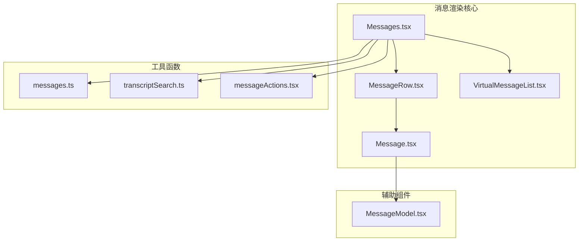
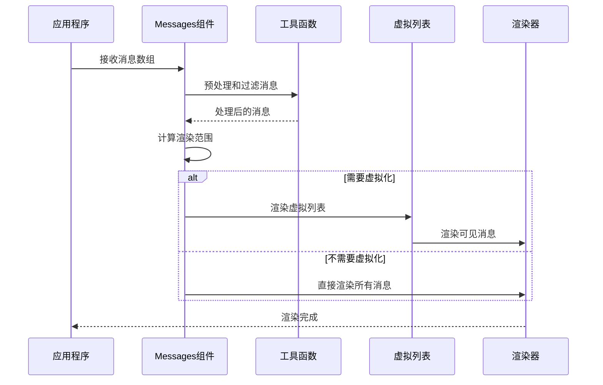
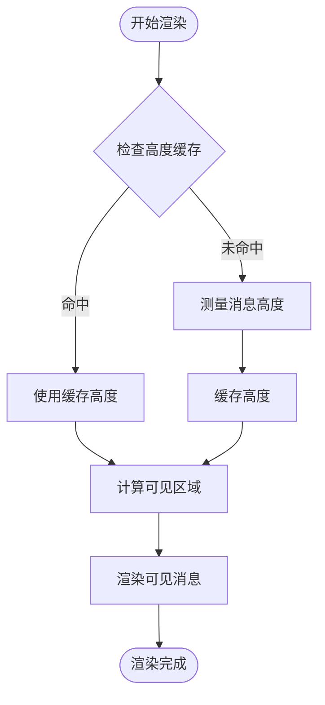
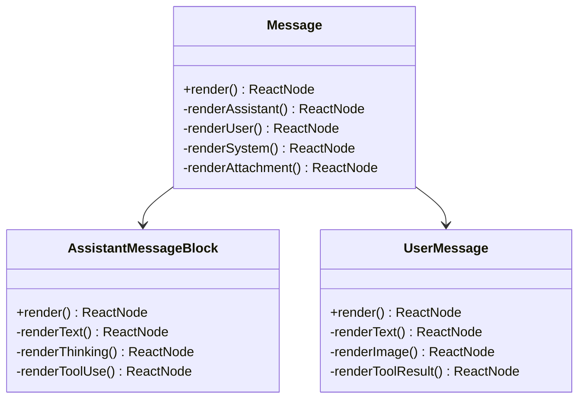
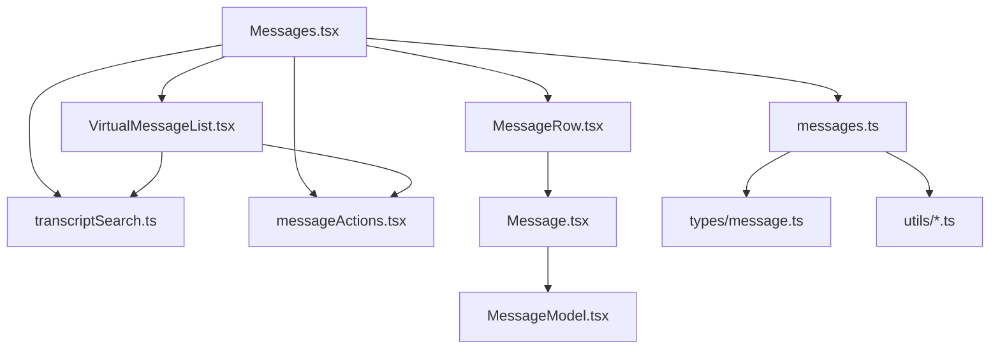

# 消息渲染组件

<cite>
**本文档引用的文件**
- [Messages.tsx](file://src/components/Messages.tsx)
- [VirtualMessageList.tsx](file://src/components/VirtualMessageList.tsx)
- [Message.tsx](file://src/components/Message.tsx)
- [MessageRow.tsx](file://src/components/MessageRow.tsx)
- [messages.ts](file://src/utils/messages.ts)
- [transcriptSearch.ts](file://src/utils/transcriptSearch.ts)
- [messageActions.tsx](file://src/components/messageActions.tsx)
- [MessageModel.tsx](file://src/components/MessageModel.tsx)
</cite>

## 目录
1. [简介](#简介)
2. [项目结构](#项目结构)
3. [核心组件](#核心组件)
4. [架构概览](#架构概览)
5. [详细组件分析](#详细组件分析)
6. [依赖关系分析](#依赖关系分析)
7. [性能考虑](#性能考虑)
8. [故障排除指南](#故障排除指南)
9. [结论](#结论)

## 简介

Claude Code 的消息渲染组件是终端聊天界面的核心模块，负责将 AI 助手、用户、系统消息以及工具使用结果等不同类型的消息进行高效渲染。该系统采用虚拟化技术确保在大量消息场景下的流畅性能，并提供了丰富的消息类型支持和灵活的渲染策略。

## 项目结构

消息渲染系统主要由以下核心文件组成：

**图表来源**
- [Messages.tsx:1-834](file://src/components/Messages.tsx#L1-L834)
- [VirtualMessageList.tsx:1-1082](file://src/components/VirtualMessageList.tsx#L1-L1082)
- [Message.tsx:1-627](file://src/components/Message.tsx#L1-L627)

**章节来源**
- [Messages.tsx:1-834](file://src/components/Messages.tsx#L1-L834)
- [VirtualMessageList.tsx:1-1082](file://src/components/VirtualMessageList.tsx#L1-L1082)

## 核心组件

### 主要组件架构

消息渲染系统采用分层架构设计，每个层级都有明确的职责分工：

1. **Messages 组件** - 主容器组件，负责消息的预处理、过滤和渲染调度
2. **VirtualMessageList 组件** - 虚拟化列表，处理大量消息的高性能渲染
3. **MessageRow 组件** - 单条消息行的渲染包装器
4. **Message 组件** - 具体消息类型的渲染器
5. **工具函数模块** - 提供消息处理、搜索、动作等功能

### 消息类型分类

系统支持多种消息类型，每种类型都有专门的渲染组件：

| 消息类型 | 描述 | 渲染组件 |
|---------|------|----------|
| assistant | 助手消息 | AssistantTextMessage, AssistantThinkingMessage |
| user | 用户消息 | UserTextMessage, UserImageMessage, UserToolResultMessage |
| system | 系统消息 | SystemTextMessage, CompactBoundaryMessage |
| attachment | 附件消息 | AttachmentMessage |
| progress | 进度消息 | 内置支持 |
| grouped_tool_use | 分组工具使用 | GroupedToolUseContent |
| collapsed_read_search | 折叠的读取/搜索 | CollapsedReadSearchContent |

**章节来源**
- [Messages.tsx:207-275](file://src/components/Messages.tsx#L207-L275)
- [Message.tsx:82-354](file://src/components/Message.tsx#L82-L354)

## 架构概览

消息渲染系统采用响应式架构，通过状态管理和虚拟化技术实现高效的渲染性能。

**图表来源**
- [Messages.tsx:475-543](file://src/components/Messages.tsx#L475-L543)
- [VirtualMessageList.tsx:289-336](file://src/components/VirtualMessageList.tsx#L289-L336)

## 详细组件分析

### Messages 主组件

Messages 组件是整个消息渲染系统的核心，负责消息的预处理、过滤和渲染决策。

#### 核心功能特性

1. **消息预处理** - 使用 `normalizeMessages` 函数将多内容块消息拆分为独立消息
2. **智能过滤** - 支持简报模式、转录模式等不同显示策略
3. **虚拟化集成** - 自动选择虚拟化或非虚拟化渲染路径
4. **性能优化** - 使用 `useMemo` 和 `React.memo` 避免不必要的重渲染

#### 关键配置选项

| 属性 | 类型 | 描述 |
|------|------|------|
| messages | MessageType[] | 原始消息数组 |
| tools | Tools | 工具集合 |
| verbose | boolean | 详细模式开关 |
| isBriefOnly | boolean | 简报模式 |
| hidePastThinking | boolean | 隐藏历史思考 |
| streamingToolUses | StreamingToolUse[] | 流式工具使用数据 |
| screen | Screen | 当前屏幕模式 |

**章节来源**
- [Messages.tsx:341-374](file://src/components/Messages.tsx#L341-L374)
- [Messages.tsx:741-778](file://src/components/Messages.tsx#L741-L778)

### VirtualMessageList 虚拟化列表

VirtualMessageList 组件实现了高性能的虚拟化消息列表渲染。

#### 虚拟化策略

1. **增量键管理** - 使用增量字符串数组避免每次渲染都重建键数组
2. **高度缓存** - 缓存消息高度以提高滚动性能
3. **可见区域计算** - 智能计算当前可视区域内的消息
4. **搜索索引** - 支持消息搜索功能

#### 性能优化技术

**图表来源**
- [VirtualMessageList.tsx:308-336](file://src/components/VirtualMessageList.tsx#L308-L336)

**章节来源**
- [VirtualMessageList.tsx:289-336](file://src/components/VirtualMessageList.tsx#L289-L336)
- [VirtualMessageList.tsx:308-324](file://src/components/VirtualMessageList.tsx#L308-L324)

### MessageRow 消息行组件

MessageRow 组件为单条消息提供统一的渲染包装，处理消息的展开/折叠状态和交互行为。

#### 消息状态管理

1. **展开状态** - 基于 `tool_use_id` 或 `uuid` 的展开/折叠逻辑
2. **点击处理** - 支持消息点击展开详细信息
3. **可点击检测** - 智能检测哪些消息应该响应点击事件
4. **静态渲染** - 对于已完成的消息使用静态渲染避免重渲染

#### 性能优化策略

- 使用 `areMessageRowPropsEqual` 比较器避免不必要的重渲染
- 智能检测消息状态变化，只在必要时更新
- 支持消息内容的增量更新

**章节来源**
- [MessageRow.tsx:342-382](file://src/components/MessageRow.tsx#L342-L382)
- [MessageRow.tsx:93-167](file://src/components/MessageRow.tsx#L93-L167)

### Message 消息渲染器

Message 组件根据消息类型选择相应的渲染组件，并处理消息的特殊属性。

#### 消息类型渲染策略

**图表来源**
- [Message.tsx](file://src/components/Message.tsx#L58-D590)

**章节来源**
- [Message.tsx:58-354](file://src/components/Message.tsx#L58-L354)

### 附件消息处理

附件消息具有特殊的处理逻辑，需要根据附件类型和状态进行不同的渲染。

#### 附件类型支持

| 附件类型 | 描述 | 渲染方式 |
|---------|------|----------|
| queued_command | 队列命令 | 作为用户提示渲染 |
| 文件上传 | 文件上传 | 文件预览渲染 |
| 图片附件 | 图片文件 | 图片显示渲染 |
| 系统通知 | 系统消息 | 特殊样式渲染 |

**章节来源**
- [Message.tsx:82-96](file://src/components/Message.tsx#L82-L96)

### 工具使用消息处理

工具使用消息包含复杂的交互逻辑，需要特殊的状态管理和渲染策略。

#### 工具使用状态管理

1. **进行中状态** - 使用 `inProgressToolUseIDs` 跟踪进行中的工具调用
2. **流式更新** - 支持 `streamingToolUses` 的实时更新
3. **进度跟踪** - 使用 `progressMessagesForMessage` 显示工具执行进度
4. **结果处理** - 正确处理工具调用的成功、失败和取消状态

**章节来源**
- [MessageRow.tsx:153-167](file://src/components/MessageRow.tsx#L153-L167)
- [Message.tsx:483-589](file://src/components/Message.tsx#L483-L589)

## 依赖关系分析

消息渲染系统具有清晰的依赖层次结构，各组件之间的耦合度较低，便于维护和扩展。

**图表来源**
- [Messages.tsx:1-50](file://src/components/Messages.tsx#L1-L50)
- [MessageRow.tsx:1-15](file://src/components/MessageRow.tsx#L1-L15)

**章节来源**
- [Messages.tsx:1-50](file://src/components/Messages.tsx#L1-L50)
- [MessageRow.tsx:1-15](file://src/components/MessageRow.tsx#L1-L15)

## 性能考虑

消息渲染系统采用了多项性能优化策略，确保在大量消息场景下的流畅体验。

### 内存管理策略

1. **虚拟化渲染** - 只渲染可视区域内的消息，避免一次性渲染所有消息
2. **增量更新** - 使用增量键数组避免每次渲染都重建键列表
3. **高度缓存** - 缓存消息高度减少布局计算开销
4. **弱映射缓存** - 使用 WeakMap 缓存搜索文本，自动垃圾回收

### 渲染优化技术

1. **React.memo 优化** - 对多个组件使用 `React.memo` 避免不必要的重渲染
2. **useMemo 缓存** - 使用 `useMemo` 缓存昂贵的计算结果
3. **静态渲染** - 对已完成的消息使用静态渲染
4. **增量字符串数组** - 避免每次渲染都重建完整的键数组

### 性能监控指标

| 指标 | 阈值 | 优化策略 |
|------|------|----------|
| 消息数量 | >2000 | 启用虚拟化渲染 |
| 渲染时间 | >50ms | 使用 React.memo 优化 |
| 内存使用 | >500MB | 实施高度缓存 |
| 滚动性能 | >60fps | 虚拟化列表优化 |

**章节来源**
- [Messages.tsx:278-340](file://src/components/Messages.tsx#L278-L340)
- [VirtualMessageList.tsx:308-324](file://src/components/VirtualMessageList.tsx#L308-L324)

## 故障排除指南

### 常见问题及解决方案

#### 消息渲染异常

**问题**：消息无法正确渲染或显示空白
**原因**：消息格式不正确或缺少必要的字段
**解决方案**：
1. 检查消息对象的完整性
2. 确保 `uuid` 字段存在且唯一
3. 验证 `message.content` 数组格式

#### 性能问题

**问题**：大量消息导致界面卡顿
**原因**：未启用虚拟化或缓存策略不当
**解决方案**：
1. 确认 `scrollRef` 参数正确传递
2. 检查 `disableRenderCap` 设置
3. 验证高度缓存是否正常工作

#### 搜索功能异常

**问题**：消息搜索无法匹配预期内容
**原因**：搜索文本缓存或提取逻辑问题
**解决方案**：
1. 检查 `extractSearchText` 函数实现
2. 验证搜索文本缓存机制
3. 确认消息内容的可搜索性

**章节来源**
- [Messages.tsx:649-676](file://src/components/Messages.tsx#L649-L676)
- [VirtualMessageList.tsx:797-800](file://src/components/VirtualMessageList.tsx#L797-L800)

## 结论

Claude Code 的消息渲染组件展现了优秀的架构设计和性能优化策略。通过虚拟化技术、智能缓存和增量更新等技术手段，系统能够在处理大量消息时保持流畅的用户体验。同时，清晰的组件分离和灵活的扩展机制为未来的功能增强奠定了良好的基础。

该系统的主要优势包括：
- 高性能的虚拟化渲染
- 完善的消息类型支持
- 灵活的渲染策略
- 优秀的内存管理
- 可扩展的架构设计

这些特性使得消息渲染组件能够适应各种使用场景，从简单的对话到复杂的专业开发环境都能提供优质的用户体验。