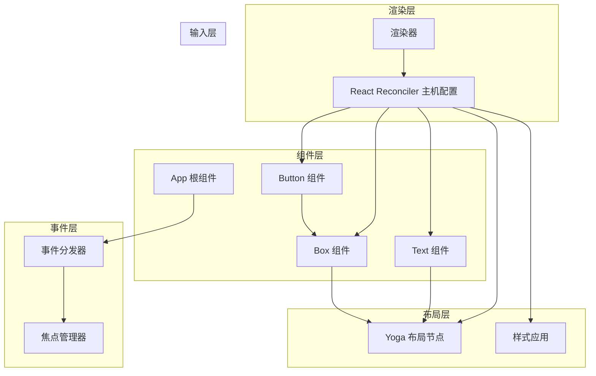
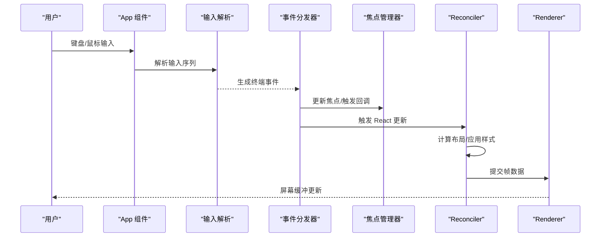
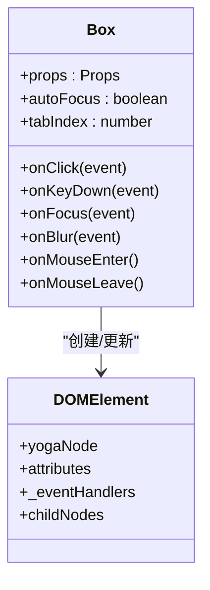
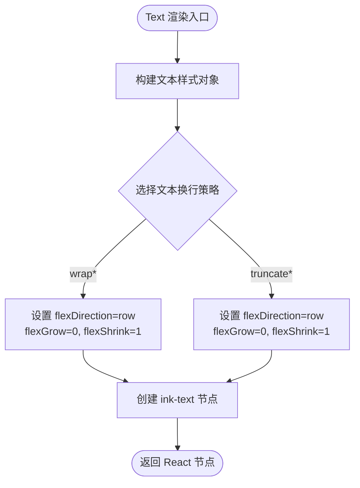
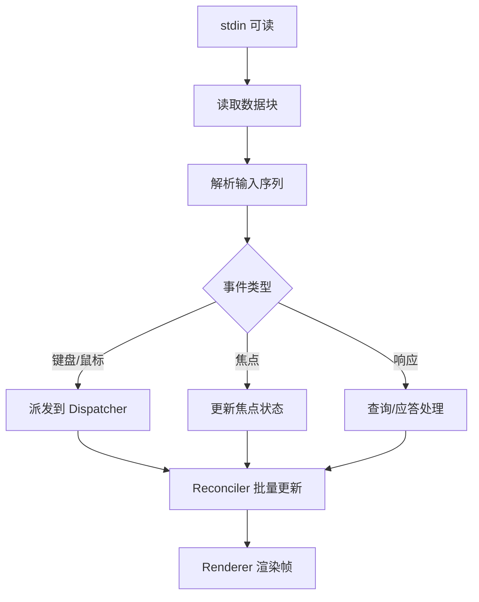
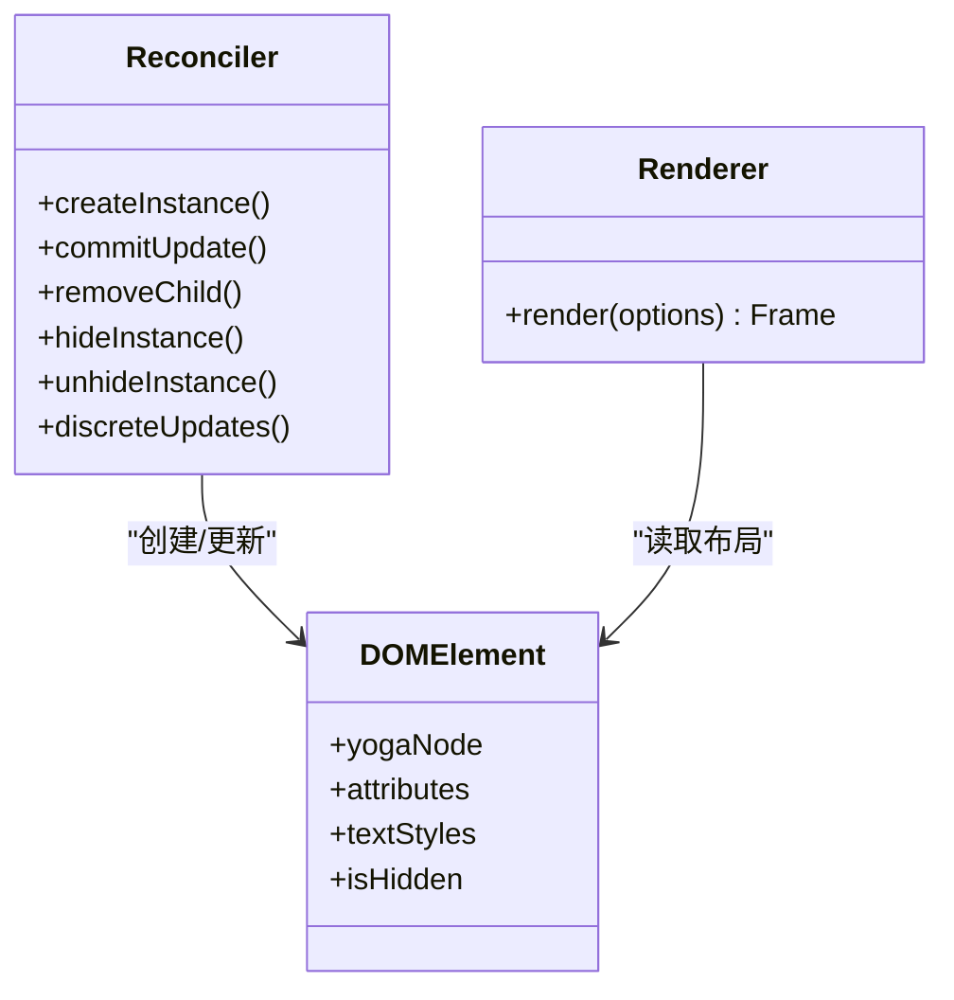
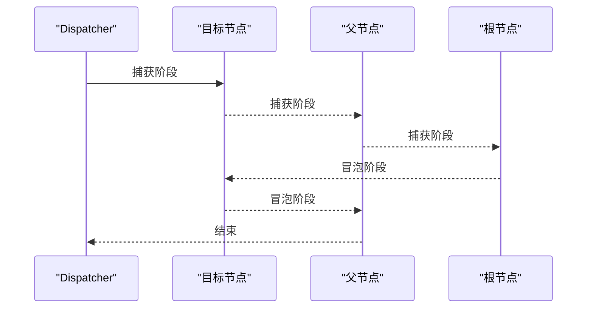
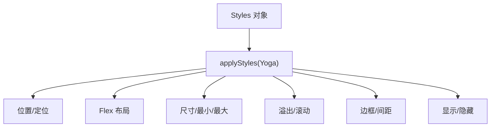
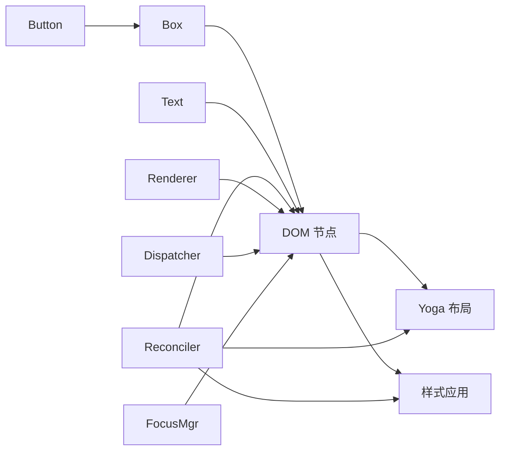

# 终端 Ink 组件

<cite>
**本文档引用的文件**
- [src/ink/components/Box.tsx](file://src/ink/components/Box.tsx)
- [src/ink/components/Button.tsx](file://src/ink/components/Button.tsx)
- [src/ink/components/App.tsx](file://src/ink/components/App.tsx)
- [src/ink/components/Text.tsx](file://src/ink/components/Text.tsx)
- [src/ink/renderer.ts](file://src/ink/renderer.ts)
- [src/ink/reconciler.ts](file://src/ink/reconciler.ts)
- [src/ink/events/dispatcher.ts](file://src/ink/events/dispatcher.ts)
- [src/ink/focus.ts](file://src/ink/focus.ts)
- [src/ink/layout/node.ts](file://src/ink/layout/node.ts)
- [src/ink/styles.ts](file://src/ink/styles.ts)
</cite>

## 目录
1. [引言](#引言)
2. [项目结构](#项目结构)
3. [核心组件](#核心组件)
4. [架构总览](#架构总览)
5. [详细组件分析](#详细组件分析)
6. [依赖关系分析](#依赖关系分析)
7. [性能考虑](#性能考虑)
8. [故障排除指南](#故障排除指南)
9. [结论](#结论)
10. [附录](#附录)

## 引言
本文件面向 Claude Code 的终端 Ink 组件，系统化梳理其架构设计、组件实现原理与运行机制。重点覆盖以下方面：
- 核心组件：Box、Text、Button 的布局计算与样式应用
- 渲染引擎与组件树管理：React Reconciler 集成、DOM 节点与 Yoga 布局
- 事件系统：键盘、点击、悬停与焦点管理
- 性能优化：虚拟滚动、增量渲染、布局缓存与批处理
- 可访问性与跨平台兼容性
- 使用示例与自定义组件开发指南

## 项目结构
Ink 将 React 的渲染管线与终端 I/O、输入解析、焦点管理、屏幕缓冲等能力整合，形成一套完整的终端 UI 框架。关键模块如下：
- 组件层：Box、Text、Button 等 UI 组件
- 事件层：Dispatcher、FocusManager、事件映射与调度
- 渲染层：Reconciler（React Host Config）、Renderer（输出到屏幕缓冲）
- 布局层：Yoga 布局节点与样式应用
- 输入层：App 组件负责解析终端输入、鼠标事件、焦点切换与模式管理



**图表来源**
- [src/ink/components/Box.tsx](file://src/ink/components/Box.tsx)
- [src/ink/components/Text.tsx](file://src/ink/components/Text.tsx)
- [src/ink/components/Button.tsx](file://src/ink/components/Button.tsx)
- [src/ink/components/App.tsx](file://src/ink/components/App.tsx)
- [src/ink/events/dispatcher.ts](file://src/ink/events/dispatcher.ts)
- [src/ink/focus.ts](file://src/ink/focus.ts)
- [src/ink/reconciler.ts](file://src/ink/reconciler.ts)
- [src/ink/renderer.ts](file://src/ink/renderer.ts)
- [src/ink/layout/node.ts](file://src/ink/layout/node.ts)
- [src/ink/styles.ts](file://src/ink/styles.ts)

**章节来源**
- [src/ink/components/Box.tsx](file://src/ink/components/Box.tsx)
- [src/ink/components/Text.tsx](file://src/ink/components/Text.tsx)
- [src/ink/components/Button.tsx](file://src/ink/components/Button.tsx)
- [src/ink/components/App.tsx](file://src/ink/components/App.tsx)
- [src/ink/events/dispatcher.ts](file://src/ink/events/dispatcher.ts)
- [src/ink/focus.ts](file://src/ink/focus.ts)
- [src/ink/reconciler.ts](file://src/ink/reconciler.ts)
- [src/ink/renderer.ts](file://src/ink/renderer.ts)
- [src/ink/layout/node.ts](file://src/ink/layout/node.ts)
- [src/ink/styles.ts](file://src/ink/styles.ts)

## 核心组件
- Box：终端布局容器，提供 Flex 布局、尺寸、边距、内边距、溢出、定位等能力，并支持点击、键盘、焦点、悬停等事件。
- Text：文本组件，支持颜色、背景色、粗体、斜体、下划线、删除线、反色、截断策略等文本样式。
- Button：交互按钮，内部维护聚焦、悬停、激活状态，暴露 onAction 回调并支持 Tab 焦点顺序。

这些组件通过 React Reconciler 注入 Ink 的主机配置，最终由 Renderer 输出到终端屏幕缓冲。

**章节来源**
- [src/ink/components/Box.tsx](file://src/ink/components/Box.tsx)
- [src/ink/components/Text.tsx](file://src/ink/components/Text.tsx)
- [src/ink/components/Button.tsx](file://src/ink/components/Button.tsx)

## 架构总览
Ink 的运行时由以下关键路径构成：
- 输入解析与事件：App 组件监听 stdin，解析键盘、鼠标、焦点事件，派发到 Dispatcher。
- 事件分发：Dispatcher 收集捕获/冒泡阶段监听器，按顺序执行，支持阻止传播与默认行为。
- 焦点管理：FocusManager 维护活动元素与焦点栈，处理 Tab 导航、自动聚焦、节点移除后的焦点恢复。
- React Reconciler：将 React 组件树转换为 Ink DOM 节点，应用样式与属性，标记脏节点。
- 渲染器：根据 Yoga 计算的布局，将 DOM 节点绘制到屏幕缓冲，进行增量刷新与虚拟滚动。



**图表来源**
- [src/ink/components/App.tsx](file://src/ink/components/App.tsx)
- [src/ink/events/dispatcher.ts](file://src/ink/events/dispatcher.ts)
- [src/ink/focus.ts](file://src/ink/focus.ts)
- [src/ink/reconciler.ts](file://src/ink/reconciler.ts)
- [src/ink/renderer.ts](file://src/ink/renderer.ts)

## 详细组件分析

### Box 组件
- 功能要点
  - 接受 style 与事件属性（onClick、onKeyDown、onFocus、onBlur、onMouseEnter、onMouseLeave），并将其映射到 DOM 节点事件处理器。
  - 内部将样式合并为最终对象，确保 margin/padding/gap 等数值为整数，避免浮点导致的布局偏差。
  - 支持 autoFocus，在挂载时通过 FocusManager 自动聚焦。
- 布局与样式
  - 通过 setStyle 与 applyStyles 将样式同步到 Yoga 节点，包括 flex、尺寸、溢出、定位、边框、间距等。
  - overflowX/overflowY 与 overflow 合并，决定布局是否允许扩展以及渲染时是否启用滚动。
- 事件与焦点
  - 与 FocusManager 协作，支持 tabIndex 参与 Tab 循环；onClick 在 <AlternateScreen> 中启用鼠标跟踪时生效。
- 性能
  - 使用记忆化减少重复创建节点与样式对象，提升渲染效率。



**图表来源**
- [src/ink/components/Box.tsx](file://src/ink/components/Box.tsx)
- [src/ink/styles.ts](file://src/ink/styles.ts)

**章节来源**
- [src/ink/components/Box.tsx](file://src/ink/components/Box.tsx)
- [src/ink/styles.ts](file://src/ink/styles.ts)

### Text 组件
- 文本样式
  - 支持 color、backgroundColor、bold、dim、italic、underline、strikethrough、inverse 等文本样式。
  - 提供多种 textWrap 策略：wrap、truncate、truncate-middle、truncate-start、end、middle 等，内部以 memoizedStylesForWrap 缓存对应 Flex 行为。
- 渲染路径
  - 将文本包装为 ink-text 节点，传递 textStyles 与样式对象，交由 Renderer 渲染。
- 限制
  - 文本必须在 <Text> 组件内部渲染，否则抛出错误；<Box> 不可嵌套在 <Text> 内。



**图表来源**
- [src/ink/components/Text.tsx](file://src/ink/components/Text.tsx)

**章节来源**
- [src/ink/components/Text.tsx](file://src/ink/components/Text.tsx)

### Button 组件
- 状态管理
  - 内部维护 focused、hovered、active 三态，通过 useState 与定时器控制激活态持续时间。
- 事件绑定
  - 支持 Enter/Space 键触发 onAction；点击事件同样触发；聚焦/失焦与悬停/离开分别更新状态。
- 渲染
  - 基于 Box 实现，支持 tabIndex 与 autoFocus；children 可为函数，接收当前交互状态以实现条件样式。

```mermaid
sequenceDiagram
participant User as "用户"
participant Btn as "Button"
participant Box as "Box"
participant FM as "焦点管理器"
participant RC as "Reconciler"
User->>Btn : 按键/点击
Btn->>Btn : 更新状态(focused/hovered/active)
Btn->>Btn : 调用 onAction()
Btn->>Box : 渲染内容(含状态)
Box->>RC : 提交 DOM 更新
FM-->>Btn : 焦点事件(可选)
```

**图表来源**
- [src/ink/components/Button.tsx](file://src/ink/components/Button.tsx)
- [src/ink/components/Box.tsx](file://src/ink/components/Box.tsx)
- [src/ink/focus.ts](file://src/ink/focus.ts)

**章节来源**
- [src/ink/components/Button.tsx](file://src/ink/components/Button.tsx)
- [src/ink/components/Box.tsx](file://src/ink/components/Box.tsx)
- [src/ink/focus.ts](file://src/ink/focus.ts)

### App 根组件（输入与上下文）
- 上下文提供
  - 提供 TerminalSize、Stdin、TerminalFocus、Clock、CursorDeclaration 等上下文，供子组件使用。
- 输入处理
  - 监听 stdin，解析键盘、鼠标、焦点事件；支持粘贴模式、扩展键报告、焦点报告、鼠标跟踪等终端模式。
  - 处理 Ctrl+C 退出、SIGCONT 恢复、长间隔恢复（tmux/ssh 重连）等场景。
- 文本选择与超链接
  - 支持双击/三击选择、拖拽扩展、悬停检测、超链接打开延迟与去重。
- 多点击检测
  - 基于时间与位置阈值判断多击，支持单词/行选择策略。



**图表来源**
- [src/ink/components/App.tsx](file://src/ink/components/App.tsx)

**章节来源**
- [src/ink/components/App.tsx](file://src/ink/components/App.tsx)

### 渲染引擎与组件树管理
- Reconciler 主机配置
  - 定义 createInstance、commitUpdate、removeChild 等主机方法，将 React 元素映射为 Ink DOM 节点。
  - 应用样式到 Yoga 节点，隐藏/显示节点时同步 Yoga 显示状态并标记脏节点。
  - 支持离散更新（discreteUpdates）以保证用户交互的同步性。
- Renderer
  - 从 DOM 节点与 Yoga 布局信息生成屏幕缓冲，支持增量刷新、光标位置与可见性控制。
  - 在 alt-screen 模式下，强制 viewport 高度为 rows+1，避免滚动回溯误判。
  - 对绝对定位移除的节点进行“污染”标记，防止后续帧错误地从旧屏幕复制像素。



**图表来源**
- [src/ink/reconciler.ts](file://src/ink/reconciler.ts)
- [src/ink/renderer.ts](file://src/ink/renderer.ts)

**章节来源**
- [src/ink/reconciler.ts](file://src/ink/reconciler.ts)
- [src/ink/renderer.ts](file://src/ink/renderer.ts)

### 事件系统与焦点管理
- 事件分发
  - Dispatcher 收集捕获/冒泡阶段监听器，按 Ink 约定顺序执行；支持阻止传播与默认行为。
  - 根据事件类型推断 React 调度优先级（离散/连续/默认）。
- 焦点管理
  - FocusManager 维护 activeElement 与焦点栈，支持 Tab 导航、自动聚焦、点击聚焦、节点移除后的焦点恢复。
  - 提供 moveFocus、handleNodeRemoved 等接口，保障可访问性与一致性。



**图表来源**
- [src/ink/events/dispatcher.ts](file://src/ink/events/dispatcher.ts)
- [src/ink/focus.ts](file://src/ink/focus.ts)

**章节来源**
- [src/ink/events/dispatcher.ts](file://src/ink/events/dispatcher.ts)
- [src/ink/focus.ts](file://src/ink/focus.ts)

### 布局系统与样式应用
- Yoga 布局
  - 通过 LayoutNode 接口设置尺寸、方向、对齐、溢出、定位、边距、内边距、间距等。
- 样式应用
  - styles.ts 将 Styles 映射到 Yoga 节点，支持百分比、数字、auto 等多种单位。
  - 支持 borderStyle 与单边 border 属性，以及 noSelect 区域排除选择。



**图表来源**
- [src/ink/styles.ts](file://src/ink/styles.ts)
- [src/ink/layout/node.ts](file://src/ink/layout/node.ts)

**章节来源**
- [src/ink/styles.ts](file://src/ink/styles.ts)
- [src/ink/layout/node.ts](file://src/ink/layout/node.ts)

## 依赖关系分析
- 组件依赖
  - Box/Text/Button 依赖 DOM 节点与样式系统；Button 依赖 Box 与 FocusManager。
- 渲染依赖
  - Reconciler 依赖 Yoga 布局与样式应用；Renderer 依赖 DOM 节点与屏幕缓冲。
- 事件依赖
  - Dispatcher 依赖事件映射表；FocusManager 依赖 DOM 节点树遍历。



**图表来源**
- [src/ink/components/Box.tsx](file://src/ink/components/Box.tsx)
- [src/ink/components/Text.tsx](file://src/ink/components/Text.tsx)
- [src/ink/components/Button.tsx](file://src/ink/components/Button.tsx)
- [src/ink/reconciler.ts](file://src/ink/reconciler.ts)
- [src/ink/renderer.ts](file://src/ink/renderer.ts)
- [src/ink/styles.ts](file://src/ink/styles.ts)
- [src/ink/layout/node.ts](file://src/ink/layout/node.ts)
- [src/ink/events/dispatcher.ts](file://src/ink/events/dispatcher.ts)
- [src/ink/focus.ts](file://src/ink/focus.ts)

**章节来源**
- [src/ink/components/Box.tsx](file://src/ink/components/Box.tsx)
- [src/ink/components/Text.tsx](file://src/ink/components/Text.tsx)
- [src/ink/components/Button.tsx](file://src/ink/components/Button.tsx)
- [src/ink/reconciler.ts](file://src/ink/reconciler.ts)
- [src/ink/renderer.ts](file://src/ink/renderer.ts)
- [src/ink/styles.ts](file://src/ink/styles.ts)
- [src/ink/layout/node.ts](file://src/ink/layout/node.ts)
- [src/ink/events/dispatcher.ts](file://src/ink/events/dispatcher.ts)
- [src/ink/focus.ts](file://src/ink/focus.ts)

## 性能考虑
- 增量渲染与脏标记
  - Reconciler 在 commitUpdate 中仅比较变更属性，减少不必要的布局与绘制。
  - markDirty 标记脏节点，Renderer 仅重绘受影响区域。
- 布局缓存与批处理
  - Output 复用字符缓存与字形聚类结果，避免每帧重建。
  - App 使用 discreteUpdates 将多个按键/鼠标事件批处理，降低抖动。
- 虚拟滚动
  - overflow='scroll' 时，Renderer 采用 scrollTop 平移，仅渲染可视区域，避免全量重绘。
- 性能监控
  - 提供记录 Yoga 与提交耗时的工具函数，便于基准测试与性能分析。

[本节为通用指导，不直接分析具体文件]

## 故障排除指南
- 文本必须在 <Text> 内渲染
  - 抛错提示：文本字符串必须在 <Text> 组件内渲染；<Box> 不可嵌套在 <Text> 内。
- 无效 Yoga 尺寸
  - 当 Yoga 计算高度/宽度为 NaN 或负值时，Renderer 返回空帧并记录调试日志。
- 鼠标点击无响应
  - 确认处于 <AlternateScreen> 模式且已启用鼠标跟踪；非全屏模式下 onClick 无效果。
- 焦点异常
  - 检查 tabIndex 设置与节点移除后焦点恢复逻辑；必要时手动调用 FocusManager 的 focus/blur 方法。
- 长连接/重连问题
  - App 会检测 stdin 静默间隔并触发模式重置；若出现闪烁或状态不同步，确认 SIGCONT 恢复流程正常。

**章节来源**
- [src/ink/components/Text.tsx](file://src/ink/components/Text.tsx)
- [src/ink/renderer.ts](file://src/ink/renderer.ts)
- [src/ink/components/App.tsx](file://src/ink/components/App.tsx)
- [src/ink/focus.ts](file://src/ink/focus.ts)

## 结论
Ink 将 React 的声明式 UI 与终端特有的输入、渲染、布局与事件系统深度融合，提供了高性能、可访问、可扩展的终端 UI 框架。通过 Box/Text/Button 等核心组件、Reconciler 与 Renderer 的协同、以及完善的事件与焦点管理，开发者可以在终端中构建复杂的交互界面，并借助虚拟滚动与增量渲染获得流畅体验。

[本节为总结性内容，不直接分析具体文件]

## 附录

### 使用示例与最佳实践
- 基础布局
  - 使用 Box 组合 Text 与 Button，设置 flexDirection、flexGrow、margin/padding 实现复杂布局。
- 交互按钮
  - 为 Button 提供 onAction 回调与 children 渲染函数，基于状态切换样式。
- 文本样式
  - 使用 Text 的 textWrap 策略控制长文本显示；结合 backgroundColor 与 inverse 实现高对比度。
- 无障碍与可访问性
  - 正确设置 tabIndex，确保 Tab 键顺序合理；在需要时禁用自动聚焦，避免干扰屏幕阅读器。
- 性能优化
  - 合理使用 overflow='scroll' 实现虚拟滚动；避免频繁创建临时样式对象；利用离散更新处理高频事件。

[本节为通用指导，不直接分析具体文件]

### 自定义组件开发指南
- 组件命名与节点类型
  - 使用 ink-* 前缀的节点类型，确保与 Ink DOM 节点一致。
- 事件处理
  - 通过 _eventHandlers 存储事件处理器；遵循 Ink 的捕获/冒泡阶段约定。
- 样式应用
  - 通过 setStyle 与 applyStyles 同步到 Yoga；注意百分比与数字单位的转换。
- 焦点与可访问性
  - 为可交互元素设置 tabIndex；在组件卸载时清理焦点与事件监听。

**章节来源**
- [src/ink/reconciler.ts](file://src/ink/reconciler.ts)
- [src/ink/styles.ts](file://src/ink/styles.ts)
- [src/ink/focus.ts](file://src/ink/focus.ts)