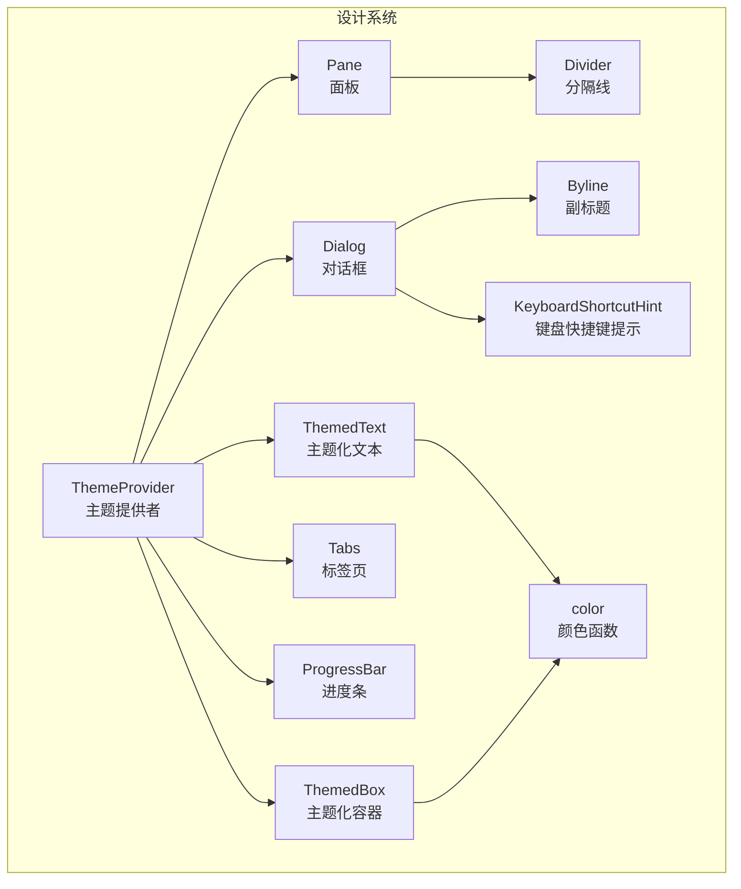
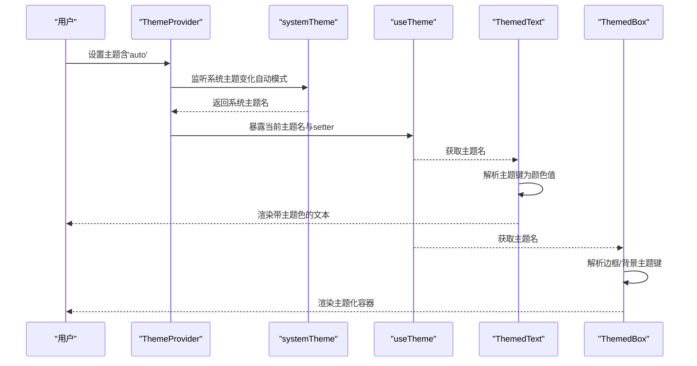
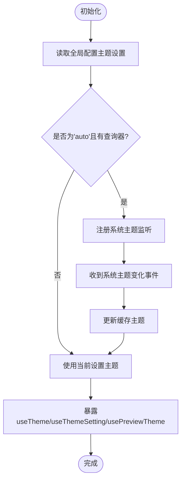
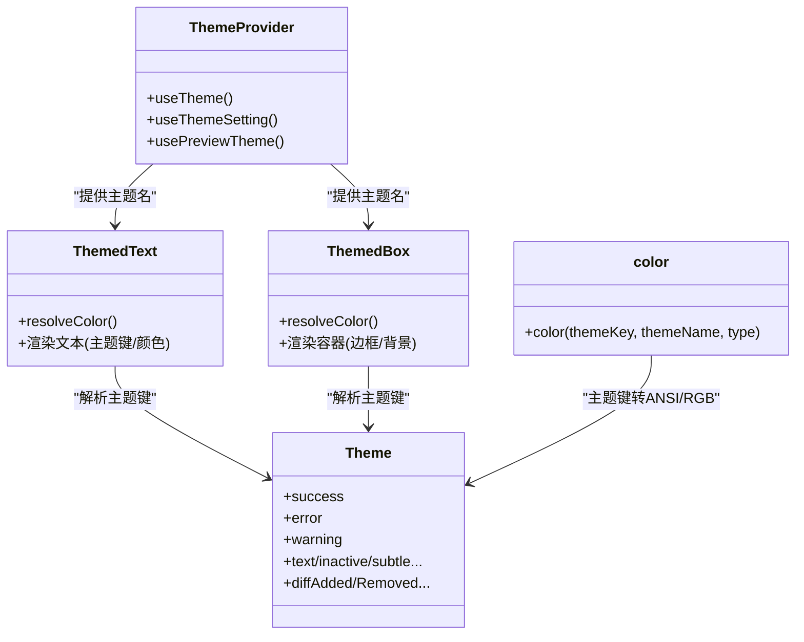
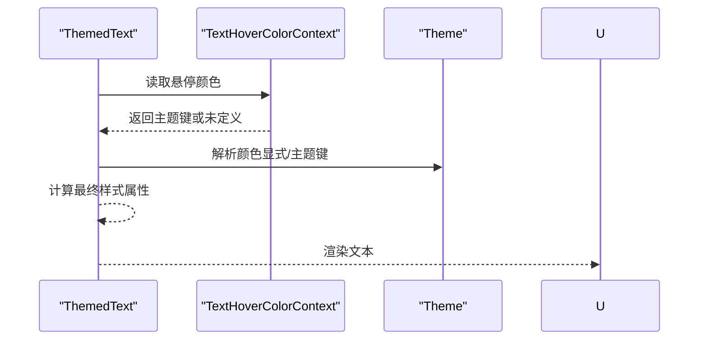
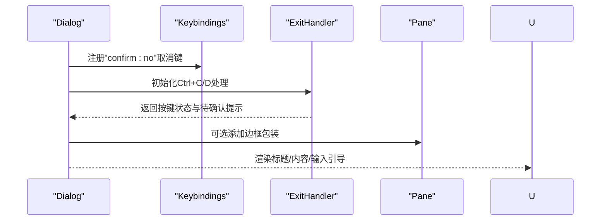
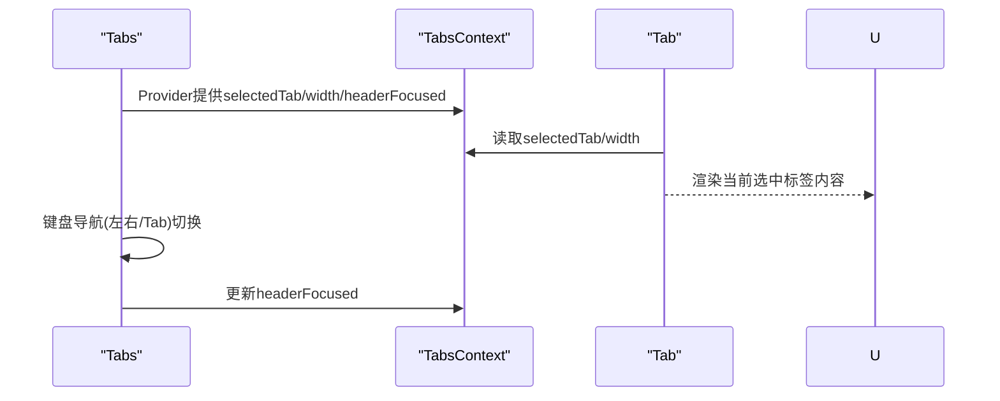
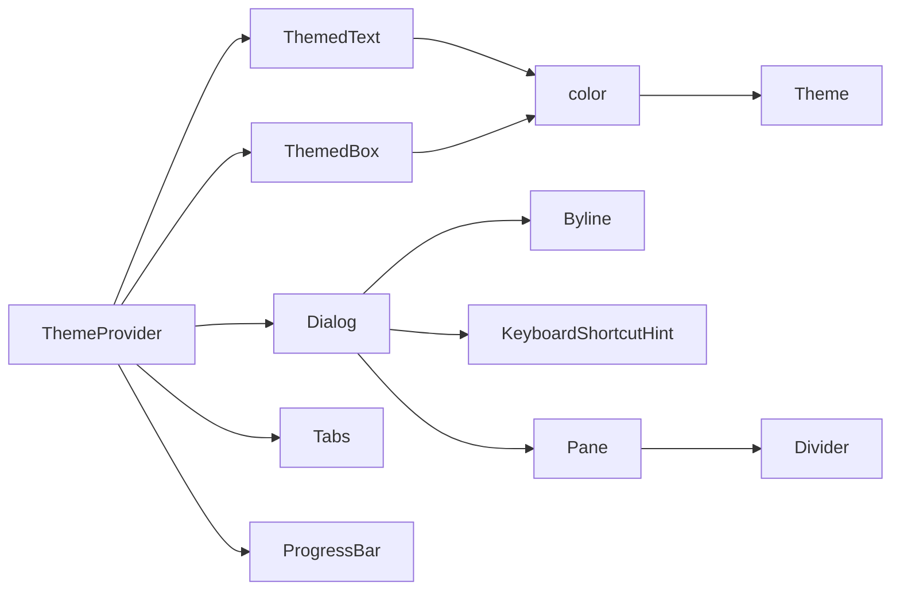

# 设计系统组件

<cite>
**本文档引用的文件**
- [ThemeProvider.tsx](file://src/components/design-system/ThemeProvider.tsx)
- [ThemedText.tsx](file://src/components/design-system/ThemedText.tsx)
- [ThemedBox.tsx](file://src/components/design-system/ThemedBox.tsx)
- [color.ts](file://src/components/design-system/color.ts)
- [Dialog.tsx](file://src/components/design-system/Dialog.tsx)
- [Tabs.tsx](file://src/components/design-system/Tabs.tsx)
- [ProgressBar.tsx](file://src/components/design-system/ProgressBar.tsx)
- [Pane.tsx](file://src/components/design-system/Pane.tsx)
- [Divider.tsx](file://src/components/design-system/Divider.tsx)
- [Byline.tsx](file://src/components/design-system/Byline.tsx)
- [KeyboardShortcutHint.tsx](file://src/components/design-system/KeyboardShortcutHint.tsx)
- [theme.ts](file://src/utils/theme.ts)
- [systemTheme.ts](file://src/utils/systemTheme.ts)
</cite>

## 目录
1. [简介](#简介)
2. [项目结构](#项目结构)
3. [核心组件](#核心组件)
4. [架构总览](#架构总览)
5. [详细组件分析](#详细组件分析)
6. [依赖关系分析](#依赖关系分析)
7. [性能考虑](#性能考虑)
8. [故障排除指南](#故障排除指南)
9. [结论](#结论)
10. [附录](#附录)

## 简介
本文件为 Claude Code 的设计系统组件技术文档，聚焦于主题系统、文本与容器组件、复合组件（对话框、标签页、进度条）以及响应式与无障碍支持。文档从架构设计、数据流、样式适配机制到最佳实践与性能优化进行全面阐述，帮助开发者快速理解并正确使用设计系统。

## 项目结构
设计系统位于 `src/components/design-system` 目录下，围绕主题提供者（ThemeProvider）为核心，向下扩展出文本（ThemedText）、容器（ThemedBox）、对话框（Dialog）、标签页（Tabs）、进度条（ProgressBar）等组件，并通过工具模块（color.ts、Divider.tsx、Pane.tsx、Byline.tsx、KeyboardShortcutHint.tsx）支撑主题解析、分隔线渲染、面板布局、快捷键提示与组合显示。

**图表来源**
- [ThemeProvider.tsx:43-116](file://src/components/design-system/ThemeProvider.tsx#L43-L116)
- [ThemedText.tsx:80-123](file://src/components/design-system/ThemedText.tsx#L80-L123)
- [ThemedBox.tsx:56-154](file://src/components/design-system/ThemedBox.tsx#L56-L154)
- [Dialog.tsx:30-137](file://src/components/design-system/Dialog.tsx#L30-L137)
- [Tabs.tsx:66-242](file://src/components/design-system/Tabs.tsx#L66-L242)
- [ProgressBar.tsx:27-85](file://src/components/design-system/ProgressBar.tsx#L27-L85)
- [Pane.tsx:33-76](file://src/components/design-system/Pane.tsx#L33-L76)
- [Divider.tsx:66-148](file://src/components/design-system/Divider.tsx#L66-L148)
- [Byline.tsx:37-76](file://src/components/design-system/Byline.tsx#L37-L76)
- [KeyboardShortcutHint.tsx:38-80](file://src/components/design-system/KeyboardShortcutHint.tsx#L38-L80)
- [color.ts:9-30](file://src/components/design-system/color.ts#L9-L30)

**章节来源**
- [ThemeProvider.tsx:1-170](file://src/components/design-system/ThemeProvider.tsx#L1-L170)
- [ThemedText.tsx:1-124](file://src/components/design-system/ThemedText.tsx#L1-L124)
- [ThemedBox.tsx:1-156](file://src/components/design-system/ThemedBox.tsx#L1-L156)
- [Dialog.tsx:1-138](file://src/components/design-system/Dialog.tsx#L1-L138)
- [Tabs.tsx:1-340](file://src/components/design-system/Tabs.tsx#L1-L340)
- [ProgressBar.tsx:1-86](file://src/components/design-system/ProgressBar.tsx#L1-L86)
- [Pane.tsx:1-77](file://src/components/design-system/Pane.tsx#L1-L77)
- [Divider.tsx:1-149](file://src/components/design-system/Divider.tsx#L1-L149)
- [Byline.tsx:1-77](file://src/components/design-system/Byline.tsx#L1-L77)
- [KeyboardShortcutHint.tsx:1-81](file://src/components/design-system/KeyboardShortcutHint.tsx#L1-L81)
- [color.ts:1-31](file://src/components/design-system/color.ts#L1-L31)

## 核心组件
- 主题提供者（ThemeProvider）
  - 负责管理用户主题设置（含 'auto' 自动模式），在 'auto' 模式下监听系统主题变化并缓存当前主题名称，向下游组件暴露 `useTheme()` 和 `useThemeSetting()` 等钩子。
  - 支持预览主题（preview）与保存预览，确保实时交互体验。
- 文本组件（ThemedText）
  - 将主题键映射为具体颜色值，支持前景色、背景色、粗体、斜体、下划线、删除线、反色、文本换行策略等。
  - 提供文本悬停颜色上下文（TextHoverColorContext），允许在子树中覆盖默认颜色优先级。
- 容器组件（ThemedBox）
  - 对边框颜色与背景色进行主题解析，其余样式透传给底层 Box 组件，保证容器边框与背景的一致性。
- 复合组件
  - 对话框（Dialog）：提供标题、副标题、输入引导、取消绑定、边框包装等能力，支持 'auto' 主题下的权限色。
  - 标签页（Tabs）：提供多标签页导航、内容区域固定高度、键盘导航、模态滚动、头部焦点控制等。
  - 进度条（ProgressBar）：基于块字符绘制，支持填充色与空闲色的主题化。

**章节来源**
- [ThemeProvider.tsx:43-116](file://src/components/design-system/ThemeProvider.tsx#L43-L116)
- [ThemedText.tsx:80-123](file://src/components/design-system/ThemedText.tsx#L80-L123)
- [ThemedBox.tsx:56-154](file://src/components/design-system/ThemedBox.tsx#L56-L154)
- [Dialog.tsx:30-137](file://src/components/design-system/Dialog.tsx#L30-L137)
- [Tabs.tsx:66-242](file://src/components/design-system/Tabs.tsx#L66-L242)
- [ProgressBar.tsx:27-85](file://src/components/design-system/ProgressBar.tsx#L27-L85)

## 架构总览
设计系统的运行时架构以 ThemeProvider 为中心，向上提供主题状态，向下通过 ThemedText/ThemedBox 等组件消费主题键，最终渲染到终端 UI。颜色解析贯穿文本与容器组件，支持直接颜色值与主题键两种形式；复合组件在自身逻辑中按需使用主题键或显式颜色。

**图表来源**
- [ThemeProvider.tsx:64-80](file://src/components/design-system/ThemeProvider.tsx#L64-L80)
- [systemTheme.ts:24-47](file://src/utils/systemTheme.ts#L24-L47)
- [ThemedText.tsx:100-105](file://src/components/design-system/ThemedText.tsx#L100-L105)
- [ThemedBox.tsx:100-136](file://src/components/design-system/ThemedBox.tsx#L100-L136)

## 详细组件分析

### 主题提供者（ThemeProvider）
- 功能要点
  - 初始化主题设置（默认 'dark' 非 'auto' 以便测试/工具链可用）
  - 'auto' 模式下通过系统主题检测与 OSC 查询更新主题，同时缓存以避免闪烁
  - 提供预览主题与保存预览，便于主题选择器即时反馈
  - 暴露 `useTheme()`（返回 [主题名, 设置器]）、`useThemeSetting()`（原始设置）、`usePreviewTheme()`（预览控制）
- 关键流程
  - 初始状态读取全局配置
  - 当 activeSetting 为 'auto' 且存在终端查询器时，注册系统主题监听
  - 切换到 'auto' 时，使用缓存系统主题作为种子，减少首次轮询闪烁
  - 预览主题变更时，临时覆盖当前主题，保存后写入持久化配置

**图表来源**
- [ThemeProvider.tsx:43-116](file://src/components/design-system/ThemeProvider.tsx#L43-L116)
- [systemTheme.ts:24-47](file://src/utils/systemTheme.ts#L24-L47)

**章节来源**
- [ThemeProvider.tsx:43-116](file://src/components/design-system/ThemeProvider.tsx#L43-L116)
- [systemTheme.ts:1-120](file://src/utils/systemTheme.ts#L1-L120)

### 颜色系统与主题键解析
- 主题键到颜色值的映射
  - ThemedText/ThemedBox 在渲染前将主题键解析为具体颜色值（如 rgb(...) 或 ANSI 值）
  - 支持显式颜色字符串绕过主题解析（如 rgb(...)、#...、ansi256(...)、ansi:...）
  - color 工具函数提供对任意文本进行主题化颜色包裹的能力
- 主题类型与名称
  - 支持 light/dark 及其 daltonized（色盲友好）与 ansi 变体
  - getTheme 返回对应主题对象，包含语义化颜色键（success/error/warning 等）

**图表来源**
- [ThemedText.tsx:66-105](file://src/components/design-system/ThemedText.tsx#L66-L105)
- [ThemedBox.tsx:42-136](file://src/components/design-system/ThemedBox.tsx#L42-L136)
- [color.ts:9-30](file://src/components/design-system/color.ts#L9-L30)
- [theme.ts:4-89](file://src/utils/theme.ts#L4-L89)

**章节来源**
- [ThemedText.tsx:66-105](file://src/components/design-system/ThemedText.tsx#L66-L105)
- [ThemedBox.tsx:42-136](file://src/components/design-system/ThemedBox.tsx#L42-L136)
- [color.ts:9-30](file://src/components/design-system/color.ts#L9-L30)
- [theme.ts:598-613](file://src/utils/theme.ts#L598-L613)

### 文本组件（ThemedText）
- 属性与行为
  - color/backgroundColor：支持主题键或显式颜色
  - dimColor：使用主题 inactive 颜色弱化文本，兼容粗体
  - bold/italic/underline/strikethrough/inverse：基础样式
  - wrap：文本换行策略（wrap/truncate-*）
  - TextHoverColorContext：在子树中覆盖颜色优先级
- 性能优化
  - 使用记忆化缓存（react/compiler-runtime 生成的 $ 缓存）避免重复渲染
  - 仅在关键属性变化时重建节点

**图表来源**
- [ThemedText.tsx:80-123](file://src/components/design-system/ThemedText.tsx#L80-L123)

**章节来源**
- [ThemedText.tsx:1-124](file://src/components/design-system/ThemedText.tsx#L1-L124)

### 容器组件（ThemedBox）
- 属性与行为
  - 支持边框四向颜色与背景色的主题键解析
  - 其余样式透传至底层 Box，保持与 Ink 组件生态一致
- 性能优化
  - 同样采用记忆化缓存，仅在颜色或主题变化时重建节点

**章节来源**
- [ThemedBox.tsx:1-156](file://src/components/design-system/ThemedBox.tsx#L1-L156)

### 对话框（Dialog）
- 功能特性
  - 标题/副标题/内容区
  - 输入引导（默认与自定义），支持 'auto' 主题下的权限色
  - 取消绑定（Esc/n）与退出绑定（Ctrl+C/D），支持禁用与条件激活
  - 可选边框包装（Pane），支持隐藏边框
- 键盘交互
  - 使用 keybindings 注册确认/取消与退出快捷键
  - 通过 useExitOnCtrlCDWithKeybindings 提供二次确认提示

**图表来源**
- [Dialog.tsx:30-137](file://src/components/design-system/Dialog.tsx#L30-L137)

**章节来源**
- [Dialog.tsx:1-138](file://src/components/design-system/Dialog.tsx#L1-L138)

### 标签页（Tabs）
- 功能特性
  - 多标签页切换、标题栏高亮、内容区域固定高度与溢出隐藏
  - 键盘导航（左右/Tab），支持从内容区切换并自动聚焦标题栏
  - 头部焦点控制（useTabHeaderFocus），用于与子组件（如 Select）协作
  - 模态场景下的滚动容器集成
- 状态管理
  - 支持受控与非受控模式，内部维护当前选中标签索引
  - 通过 TabsContext 向 Tab 子组件提供宽度与选中状态

**图表来源**
- [Tabs.tsx:234-242](file://src/components/design-system/Tabs.tsx#L234-L242)

**章节来源**
- [Tabs.tsx:1-340](file://src/components/design-system/Tabs.tsx#L1-L340)

### 进度条（ProgressBar）
- 功能特性
  - 基于块字符绘制，支持填充色与空闲色的主题键
  - 宽度与比例参数化，自动计算整数段、中间段与剩余空格
- 渲染策略
  - 将各段连接为单一文本节点，再应用颜色属性

**章节来源**
- [ProgressBar.tsx:1-86](file://src/components/design-system/ProgressBar.tsx#L1-L86)

### 辅助组件
- 分隔线（Divider）
  - 支持全宽、固定宽度、带标题居中、带标题左右对称等模式
  - 可指定字符与颜色，支持 ANSI 样式标题
- 面板（Pane）
  - 在模态场景下简化为内边距容器；否则添加顶部彩色分隔线与横向内边距
- 副标题（Byline）
  - 将多个子项用“·”连接，自动过滤无效子元素
- 快捷键提示（KeyboardShortcutHint）
  - 渲染“快捷键 to 行为”，支持加粗与括号包裹

**章节来源**
- [Divider.tsx:1-149](file://src/components/design-system/Divider.tsx#L1-L149)
- [Pane.tsx:1-77](file://src/components/design-system/Pane.tsx#L1-L77)
- [Byline.tsx:1-77](file://src/components/design-system/Byline.tsx#L1-L77)
- [KeyboardShortcutHint.tsx:1-81](file://src/components/design-system/KeyboardShortcutHint.tsx#L1-L81)

## 依赖关系分析
- 组件间依赖
  - ThemedText/ThemedBox 依赖 ThemeProvider 提供的主题名与 getTheme 解析
  - Dialog 依赖 Pane、Byline、KeyboardShortcutHint 等辅助组件
  - Tabs 通过 TabsContext 向 Tab 子组件提供上下文信息
- 工具依赖
  - color 工具函数封装主题键到 ANSI/RGB 的转换
  - systemTheme 提供系统主题检测与缓存

**图表来源**
- [ThemeProvider.tsx:100-116](file://src/components/design-system/ThemeProvider.tsx#L100-L116)
- [ThemedText.tsx:100-105](file://src/components/design-system/ThemedText.tsx#L100-L105)
- [ThemedBox.tsx:100-136](file://src/components/design-system/ThemedBox.tsx#L100-L136)
- [Dialog.tsx:30-137](file://src/components/design-system/Dialog.tsx#L30-L137)
- [Tabs.tsx:234-242](file://src/components/design-system/Tabs.tsx#L234-L242)
- [Pane.tsx:33-76](file://src/components/design-system/Pane.tsx#L33-L76)
- [Divider.tsx:66-148](file://src/components/design-system/Divider.tsx#L66-L148)
- [Byline.tsx:37-76](file://src/components/design-system/Byline.tsx#L37-L76)
- [KeyboardShortcutHint.tsx:38-80](file://src/components/design-system/KeyboardShortcutHint.tsx#L38-L80)
- [color.ts:9-30](file://src/components/design-system/color.ts#L9-L30)
- [theme.ts:598-613](file://src/utils/theme.ts#L598-L613)

**章节来源**
- [theme.ts:1-640](file://src/utils/theme.ts#L1-L640)
- [systemTheme.ts:1-120](file://src/utils/systemTheme.ts#L1-L120)

## 性能考虑
- 记忆化渲染
  - ThemedText/ThemedBox/Dialog/Tabs/ProgressBar 等均采用 react/compiler-runtime 的 $ 缓存策略，仅在关键属性变化时重建节点，显著降低重渲染成本
- 主题解析缓存
  - ThemeProvider 在 'auto' 模式下缓存系统主题，避免每次渲染都触发异步查询
- 最小化 DOM/节点数量
  - ProgressBar 将多段合并为单个文本节点后再应用颜色，减少层级
  - Divider 在无标题时直接复用字符重复，避免多余节点
- 按需加载
  - 系统主题监听仅在外部构建启用 AUTO_THEME 特性时引入，避免生产环境冗余代码

[本节为通用指导，无需特定文件引用]

## 故障排除指南
- 主题不生效或闪烁
  - 检查是否处于 'auto' 模式且系统主题监听已注册
  - 确认 COLORFGBG 环境变量是否可提供初始猜测值
- 颜色解析异常
  - 确认传入的颜色是否为合法显式颜色（rgb/十六进制/ansi256/ansi:）
  - 若使用主题键，请确认该键存在于当前主题对象中
- 键盘快捷键冲突
  - Dialog 的取消/退出绑定可能与嵌套输入组件冲突，可通过 isCancelActive 控制
  - Tabs 的导航绑定可在内容区切换时通过 navFromContent 选项启用
- 模态场景布局问题
  - Pane 在模态场景下会移除自定义分隔线，确保内容正确填充

**章节来源**
- [systemTheme.ts:24-47](file://src/utils/systemTheme.ts#L24-L47)
- [ThemeProvider.tsx:64-80](file://src/components/design-system/ThemeProvider.tsx#L64-L80)
- [Dialog.tsx:45-57](file://src/components/design-system/Dialog.tsx#L45-L57)
- [Tabs.tsx:147-191](file://src/components/design-system/Tabs.tsx#L147-L191)
- [Pane.tsx:39-49](file://src/components/design-system/Pane.tsx#L39-L49)

## 结论
设计系统以 ThemeProvider 为核心，通过统一的主题键解析与颜色工具，实现了跨组件的一致视觉语言。文本与容器组件在保持 Ink 生态兼容的同时，提供了主题化的样式能力；复合组件则在交互与布局层面进一步完善了终端 UI 的可用性与一致性。配合响应式与无障碍支持，设计系统能够满足多样化的终端界面需求。

[本节为总结性内容，无需特定文件引用]

## 附录

### 组件使用示例与最佳实践
- 使用主题键而非硬编码颜色，确保在不同主题下保持一致的语义表达
- 文本组件优先使用主题键，必要时通过 TextHoverColorContext 实现局部覆盖
- 容器组件统一使用主题键配置边框与背景，避免样式碎片化
- 复合组件（Dialog/Tabs）应根据场景合理启用键盘绑定与边框包装
- 自定义主题时，建议遵循现有语义键命名，保证与系统主题一致的语义映射

[本节为通用指导，无需特定文件引用]

### 响应式布局与无障碍支持
- 响应式布局
  - Tabs 支持 contentHeight 固定高度与溢出隐藏，避免切换标签导致布局抖动
  - Divider 支持根据终端宽度动态调整，标题居中与左右对称
- 无障碍支持
  - 通过 dimColor 与 inverse 等语义化颜色提升对比度
  - 键盘快捷键提示组件与 Byline 组合，提供清晰的交互指引

**章节来源**
- [Tabs.tsx:192-220](file://src/components/design-system/Tabs.tsx#L192-L220)
- [Divider.tsx:77-80](file://src/components/design-system/Divider.tsx#L77-L80)
- [Byline.tsx:37-76](file://src/components/design-system/Byline.tsx#L37-L76)
- [KeyboardShortcutHint.tsx:38-80](file://src/components/design-system/KeyboardShortcutHint.tsx#L38-L80)