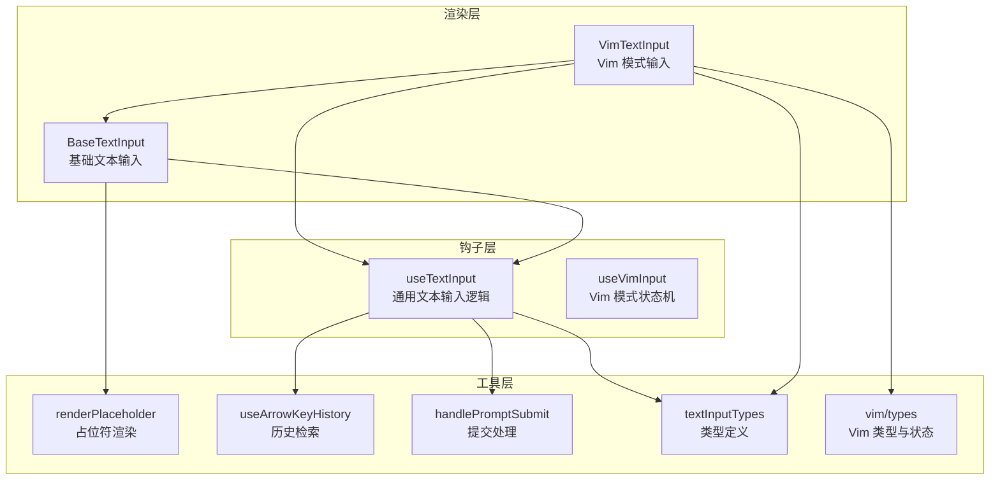
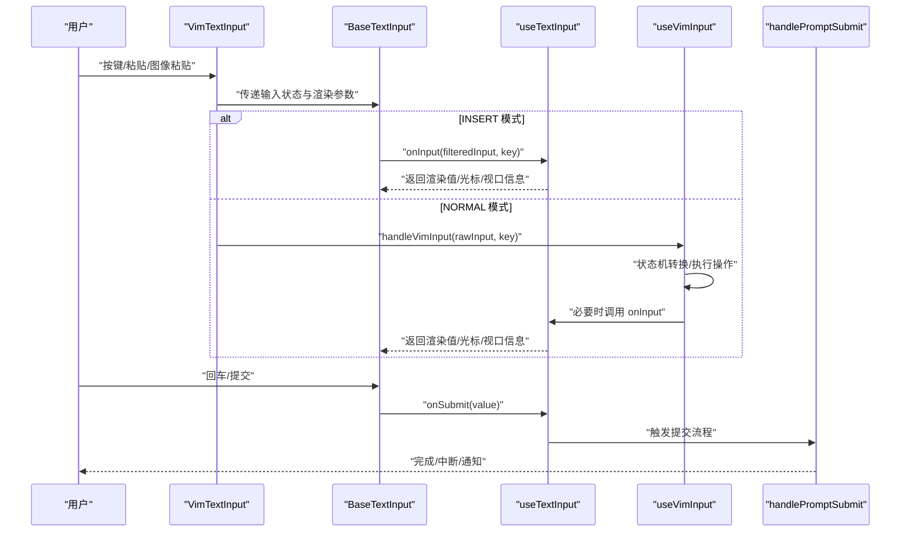
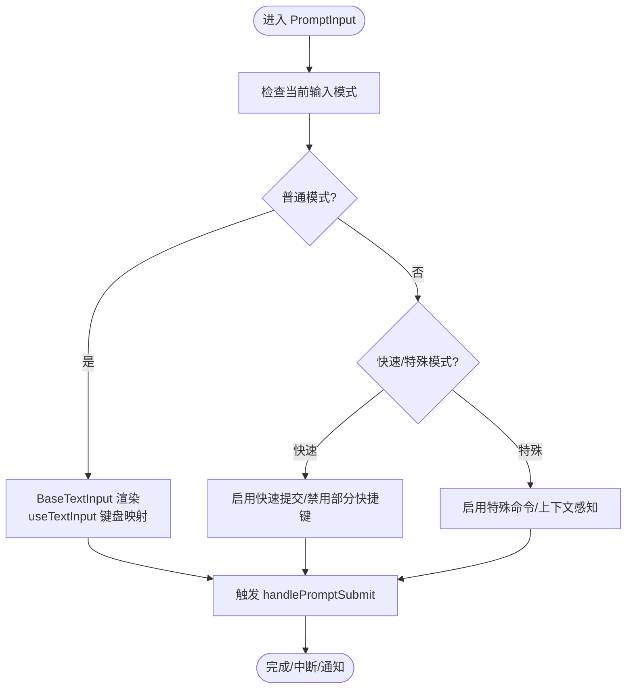
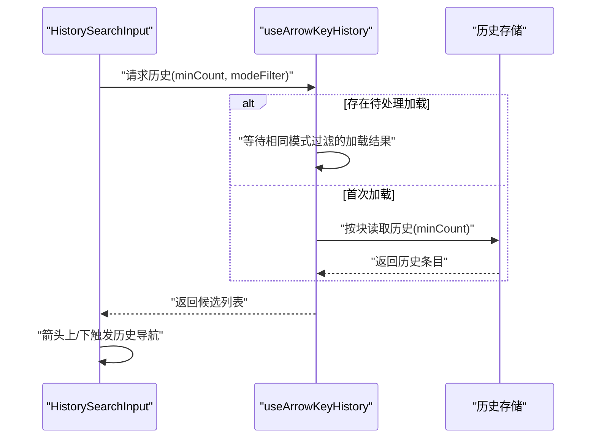
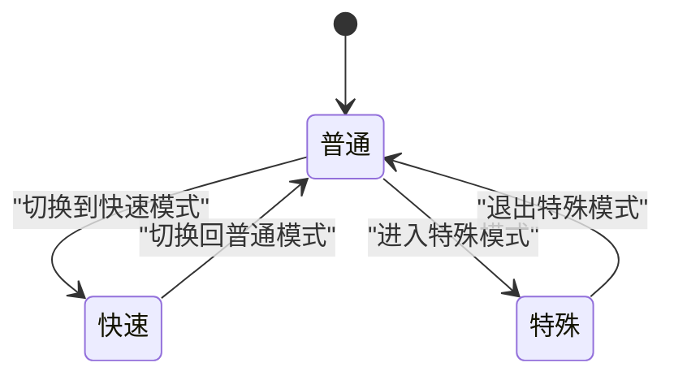
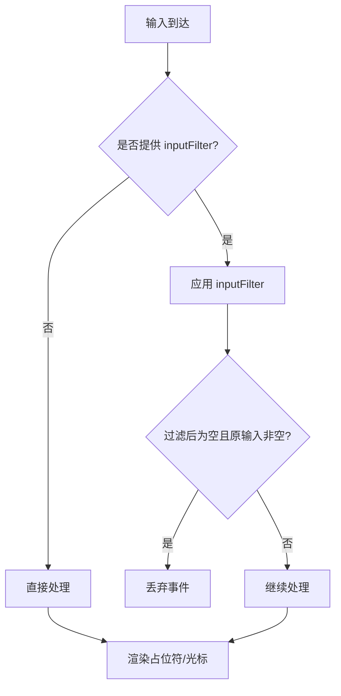
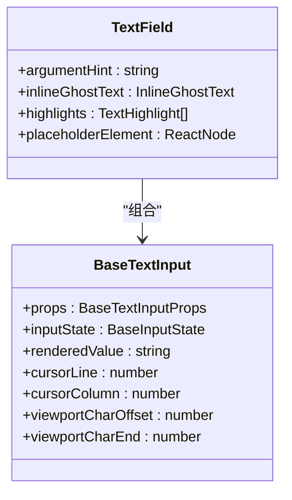
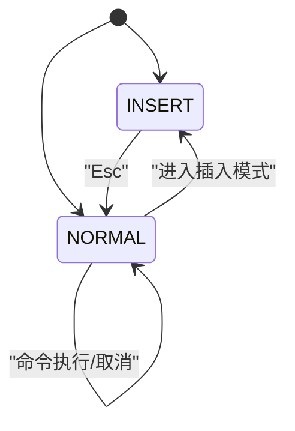
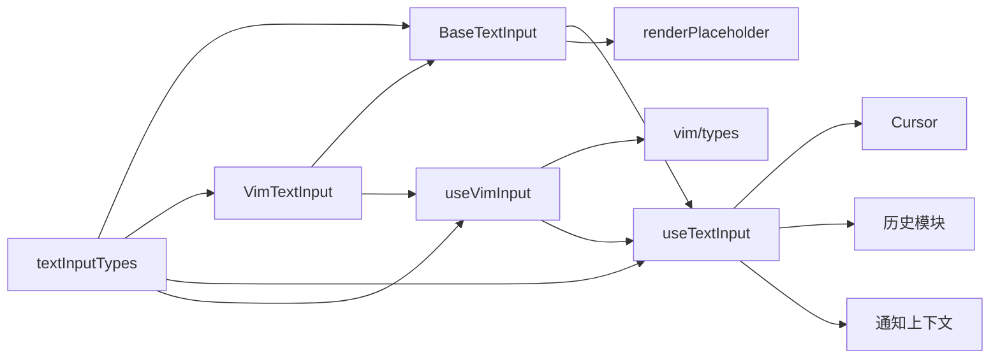

# 输入组件系统

<cite>
**本文引用的文件**
- [src/components/BaseTextInput.tsx](file://src/components/BaseTextInput.tsx)
- [src/components/VimTextInput.tsx](file://src/components/VimTextInput.tsx)
- [src/hooks/useTextInput.ts](file://src/hooks/useTextInput.ts)
- [src/hooks/useVimInput.ts](file://src/hooks/useVimInput.ts)
- [src/hooks/renderPlaceholder.ts](file://src/hooks/renderPlaceholder.ts)
- [src/hooks/useArrowKeyHistory.tsx](file://src/hooks/useArrowKeyHistory.tsx)
- [src/utils/handlePromptSubmit.ts](file://src/utils/handlePromptSubmit.ts)
- [src/types/textInputTypes.ts](file://src/types/textInputTypes.ts)
- [src/vim/types.ts](file://src/vim/types.ts)
</cite>

## 目录
1. [简介](#简介)
2. [项目结构](#项目结构)
3. [核心组件](#核心组件)
4. [架构总览](#架构总览)
5. [详细组件分析](#详细组件分析)
6. [依赖关系分析](#依赖关系分析)
7. [性能考量](#性能考量)
8. [故障排查指南](#故障排查指南)
9. [结论](#结论)
10. [附录](#附录)

## 简介
本文件面向 Claude Code 的输入组件系统，聚焦以下目标：
- PromptInput 组件的设计架构：输入模式管理与状态维护
- 历史搜索输入（HistorySearchInput）的实现：历史记录检索与自动完成功能
- 输入模式系统（inputModes）：普通模式、快速模式、特殊模式的切换机制
- 占位符逻辑（usePromptInputPlaceholder）与输入验证机制
- 基础文本输入（BaseTextInput）与增强文本输入（TextField）的实现差异
- Vim 模式输入（VimTextInput）的键盘快捷键支持与编辑模式
- 输入组件的使用示例与自定义配置方法
- 可访问性支持与跨平台兼容性考虑

## 项目结构
输入组件体系由“渲染层 + 钩子层 + 工具层”构成：
- 渲染层：BaseTextInput（基础输入）、VimTextInput（Vim 编辑器模式）
- 钩子层：useTextInput（通用文本输入逻辑）、useVimInput（Vim 模式状态机）
- 工具层：占位符渲染、历史检索、提交处理、类型定义等

**图表来源**
- [src/components/BaseTextInput.tsx:1-136](file://src/components/BaseTextInput.tsx#L1-L136)
- [src/components/VimTextInput.tsx:1-140](file://src/components/VimTextInput.tsx#L1-L140)
- [src/hooks/useTextInput.ts:1-530](file://src/hooks/useTextInput.ts#L1-L530)
- [src/hooks/useVimInput.ts:1-317](file://src/hooks/useVimInput.ts#L1-L317)
- [src/hooks/renderPlaceholder.ts:1-51](file://src/hooks/renderPlaceholder.ts#L1-L51)
- [src/hooks/useArrowKeyHistory.tsx:1-24](file://src/hooks/useArrowKeyHistory.tsx#L1-L24)
- [src/utils/handlePromptSubmit.ts:94-145](file://src/utils/handlePromptSubmit.ts#L94-L145)
- [src/types/textInputTypes.ts:186-235](file://src/types/textInputTypes.ts#L186-L235)
- [src/vim/types.ts:1-20](file://src/vim/types.ts#L1-L20)

**章节来源**
- [src/components/BaseTextInput.tsx:1-136](file://src/components/BaseTextInput.tsx#L1-L136)
- [src/components/VimTextInput.tsx:1-140](file://src/components/VimTextInput.tsx#L1-L140)
- [src/hooks/useTextInput.ts:1-530](file://src/hooks/useTextInput.ts#L1-L530)
- [src/hooks/useVimInput.ts:1-317](file://src/hooks/useVimInput.ts#L1-L317)
- [src/hooks/renderPlaceholder.ts:1-51](file://src/hooks/renderPlaceholder.ts#L1-L51)
- [src/hooks/useArrowKeyHistory.tsx:1-24](file://src/hooks/useArrowKeyHistory.tsx#L1-L24)
- [src/utils/handlePromptSubmit.ts:94-145](file://src/utils/handlePromptSubmit.ts#L94-L145)
- [src/types/textInputTypes.ts:186-235](file://src/types/textInputTypes.ts#L186-L235)
- [src/vim/types.ts:1-20](file://src/vim/types.ts#L1-L20)

## 核心组件
- BaseTextInput：负责占位符渲染、粘贴处理、高亮显示、光标定位与输入事件绑定，是所有输入组件的渲染基座。
- VimTextInput：在 BaseTextInput 之上封装 useVimInput，提供 Vim 编辑器模式（INSERT/NORMAL），并暴露初始模式、模式变更回调等扩展属性。
- useTextInput：统一处理键盘映射、多行换行、剪贴板操作、历史导航、ESC/Ctrl+C/Ctrl+D 等行为，输出标准化的输入状态（文本、光标位置、视口范围等）。
- useVimInput：基于状态机的 Vim 模式解析器，将按键映射到命令序列（如移动、删除、替换、重复上次更改等），并与 useTextInput 的输入管线集成。

**章节来源**
- [src/components/BaseTextInput.tsx:1-136](file://src/components/BaseTextInput.tsx#L1-L136)
- [src/components/VimTextInput.tsx:1-140](file://src/components/VimTextInput.tsx#L1-L140)
- [src/hooks/useTextInput.ts:73-530](file://src/hooks/useTextInput.ts#L73-L530)
- [src/hooks/useVimInput.ts:34-317](file://src/hooks/useVimInput.ts#L34-L317)

## 架构总览
输入组件的运行时流程如下：
- 用户输入通过 Ink 的 useInput 注册到 BaseTextInput，再由 useTextInput 进行键码映射与行为分发。
- VimTextInput 在 INSERT 模式下将输入直接交给 useTextInput；在 NORMAL 模式下通过状态机转换为具体操作。
- 提交阶段由 handlePromptSubmit 负责，支持外部加载、中断、通知、消息更新等。

**图表来源**
- [src/components/VimTextInput.tsx:101-135](file://src/components/VimTextInput.tsx#L101-L135)
- [src/components/BaseTextInput.tsx:88-90](file://src/components/BaseTextInput.tsx#L88-L90)
- [src/hooks/useTextInput.ts:431-501](file://src/hooks/useTextInput.ts#L431-L501)
- [src/hooks/useVimInput.ts:175-295](file://src/hooks/useVimInput.ts#L175-L295)
- [src/utils/handlePromptSubmit.ts:120-144](file://src/utils/handlePromptSubmit.ts#L120-L144)

## 详细组件分析

### PromptInput 设计与输入模式管理
- 模式管理：通过 inputModes 定义不同输入模式（普通/快速/特殊），并在渲染层根据当前模式调整行为（例如是否启用某些快捷键或历史导航策略）。
- 状态维护：useTextInput 维护光标偏移、渲染值、视口字符范围等；VimTextInput 在 NORMAL/INSERT 之间切换时同步更新模式与光标位置。
- 提交流程：handlePromptSubmit 接收输入、模式、粘贴内容等上下文，进行外部加载、中断、通知、消息更新等处理。

**图表来源**
- [src/hooks/useTextInput.ts:224-430](file://src/hooks/useTextInput.ts#L224-L430)
- [src/utils/handlePromptSubmit.ts:120-144](file://src/utils/handlePromptSubmit.ts#L120-L144)

**章节来源**
- [src/hooks/useTextInput.ts:73-530](file://src/hooks/useTextInput.ts#L73-L530)
- [src/utils/handlePromptSubmit.ts:94-145](file://src/utils/handlePromptSubmit.ts#L94-L145)

### 历史搜索输入（HistorySearchInput）实现
- 历史检索：useArrowKeyHistory 封装历史条目加载与缓存，按需分块读取，避免频繁磁盘 IO；支持模式过滤以隔离不同模式下的历史。
- 自动完成：结合输入值与历史记录，提供候选列表；在多行输入中支持按物理行/逻辑行移动与历史导航。
- 交互体验：双击 ESC 清空输入并写入历史；Ctrl+C/Ctrl+D 提供快速退出与清空能力。

**图表来源**
- [src/hooks/useArrowKeyHistory.tsx:20-24](file://src/hooks/useArrowKeyHistory.tsx#L20-L24)

**章节来源**
- [src/hooks/useArrowKeyHistory.tsx:1-24](file://src/hooks/useArrowKeyHistory.tsx#L1-L24)

### 输入模式系统（inputModes）设计
- 普通模式：标准的文本输入与编辑行为，支持多行、粘贴、历史导航、快捷键组合。
- 快速模式：精简输入路径，减少不必要的快捷键与历史交互，提升输入效率。
- 特殊模式：针对特定场景（如命令行、脚本）启用特殊命令或上下文感知行为。

[此图为概念性示意，不直接映射具体源码文件]

### 占位符逻辑（usePromptInputPlaceholder）与输入验证
- 占位符渲染：renderPlaceholder 根据终端焦点、光标状态、占位符文本决定是否显示占位符及反色光标；支持隐藏占位符文本（如语音录制场景）。
- 输入验证：inputFilter 可在顶层对原始输入进行过滤或转换，返回空字符串可丢弃该事件；在 Vim 模式下，过滤器仅在 INSERT 模式应用，确保 NORMAL 模式命令查找不受干扰。

**图表来源**
- [src/hooks/renderPlaceholder.ts:13-51](file://src/hooks/renderPlaceholder.ts#L13-L51)
- [src/hooks/useTextInput.ts:431-440](file://src/hooks/useTextInput.ts#L431-L440)
- [src/hooks/useVimInput.ts:175-181](file://src/hooks/useVimInput.ts#L175-L181)

**章节来源**
- [src/hooks/renderPlaceholder.ts:1-51](file://src/hooks/renderPlaceholder.ts#L1-L51)
- [src/hooks/useTextInput.ts:431-440](file://src/hooks/useTextInput.ts#L431-L440)
- [src/hooks/useVimInput.ts:175-181](file://src/hooks/useVimInput.ts#L175-L181)

### 基础文本输入（BaseTextInput）与增强文本输入（TextField）差异
- BaseTextInput：专注渲染与基础输入处理，负责占位符、粘贴、高亮、光标声明、参数提示等；适合作为其他输入组件的基础。
- TextField：在 BaseTextInput 基础上增加参数提示、内联幽灵文本、高亮过滤与视口裁剪等增强能力，适用于复杂输入场景（如命令补全、参数提示）。

**图表来源**
- [src/components/BaseTextInput.tsx:10-17](file://src/components/BaseTextInput.tsx#L10-L17)
- [src/types/textInputTypes.ts:186-202](file://src/types/textInputTypes.ts#L186-L202)

**章节来源**
- [src/components/BaseTextInput.tsx:1-136](file://src/components/BaseTextInput.tsx#L1-L136)
- [src/types/textInputTypes.ts:186-202](file://src/types/textInputTypes.ts#L186-L202)

### Vim 模式输入（VimTextInput）的键盘快捷键与编辑模式
- 模式切换：Esc 在 INSERT 模式切换到 NORMAL；在 NORMAL 模式下 Esc 清除待处理命令。
- 键盘映射：方向键在 NORMAL 模式映射为 h/j/k/l；Backspace/Delete 在期望运动的状态下映射为 h/x；Enter 始终交给基础处理器。
- 状态机：useVimInput 维护 VimState（INSERT/NORMAL）与 Command（idle/operator/count/find 等），通过 transition 执行具体操作，并支持“.”重放上次更改。
- 外部控制：支持设置初始模式、监听模式变化、外部切换模式。

**图表来源**
- [src/hooks/useVimInput.ts:34-80](file://src/hooks/useVimInput.ts#L34-L80)
- [src/vim/types.ts:1-20](file://src/vim/types.ts#L1-L20)

**章节来源**
- [src/components/VimTextInput.tsx:1-140](file://src/components/VimTextInput.tsx#L1-L140)
- [src/hooks/useVimInput.ts:175-295](file://src/hooks/useVimInput.ts#L175-L295)
- [src/vim/types.ts:1-20](file://src/vim/types.ts#L1-L20)

### 使用示例与自定义配置
- 基础用法：传入 value、onChange、onSubmit、focus、multiline、columns 等基础属性，即可获得标准文本输入行为。
- 增强用法：开启 argumentHint、inlineGhostText、placeholderElement、highlights 等，实现参数提示与内联补全。
- Vim 模式：设置 initialMode 初始为 INSERT 或 NORMAL；监听 onModeChange 获取模式变化；通过 inputFilter 实现自定义输入过滤。
- 历史与提交：结合 useArrowKeyHistory 与 handlePromptSubmit，实现历史导航与提交流程。

**章节来源**
- [src/components/BaseTextInput.tsx:1-136](file://src/components/BaseTextInput.tsx#L1-L136)
- [src/components/VimTextInput.tsx:1-140](file://src/components/VimTextInput.tsx#L1-L140)
- [src/hooks/useTextInput.ts:38-71](file://src/hooks/useTextInput.ts#L38-L71)
- [src/hooks/useVimInput.ts:28-32](file://src/hooks/useVimInput.ts#L28-L32)
- [src/hooks/useArrowKeyHistory.tsx:1-24](file://src/hooks/useArrowKeyHistory.tsx#L1-L24)
- [src/utils/handlePromptSubmit.ts:120-144](file://src/utils/handlePromptSubmit.ts#L120-L144)

## 依赖关系分析
- 组件依赖：VimTextInput 依赖 BaseTextInput 与 useVimInput；BaseTextInput 依赖 useTextInput 与 renderPlaceholder。
- 钩子依赖：useTextInput 依赖 Cursor、历史模块、通知上下文、修饰键检测等；useVimInput 依赖 useTextInput 与 Vim 状态机。
- 类型依赖：textInputTypes 定义了输入组件的公共接口与扩展属性。

**图表来源**
- [src/components/VimTextInput.tsx:1-140](file://src/components/VimTextInput.tsx#L1-L140)
- [src/components/BaseTextInput.tsx:1-136](file://src/components/BaseTextInput.tsx#L1-L136)
- [src/hooks/useTextInput.ts:1-530](file://src/hooks/useTextInput.ts#L1-L530)
- [src/hooks/useVimInput.ts:1-317](file://src/hooks/useVimInput.ts#L1-L317)
- [src/hooks/renderPlaceholder.ts:1-51](file://src/hooks/renderPlaceholder.ts#L1-L51)
- [src/types/textInputTypes.ts:186-235](file://src/types/textInputTypes.ts#L186-L235)
- [src/vim/types.ts:1-20](file://src/vim/types.ts#L1-L20)

**章节来源**
- [src/components/VimTextInput.tsx:1-140](file://src/components/VimTextInput.tsx#L1-L140)
- [src/components/BaseTextInput.tsx:1-136](file://src/components/BaseTextInput.tsx#L1-L136)
- [src/hooks/useTextInput.ts:1-530](file://src/hooks/useTextInput.ts#L1-L530)
- [src/hooks/useVimInput.ts:1-317](file://src/hooks/useVimInput.ts#L1-L317)
- [src/hooks/renderPlaceholder.ts:1-51](file://src/hooks/renderPlaceholder.ts#L1-L51)
- [src/types/textInputTypes.ts:186-235](file://src/types/textInputTypes.ts#L186-L235)
- [src/vim/types.ts:1-20](file://src/vim/types.ts#L1-L20)

## 性能考量
- 历史加载批处理：useArrowKeyHistory 对历史读取进行分块与去重，避免频繁磁盘 IO 与重复加载。
- 渲染优化：BaseTextInput 使用局部状态缓存与条件渲染，减少不必要的重绘；高亮过滤与视口裁剪降低渲染开销。
- 输入过滤：inputFilter 在顶层一次性应用，避免在状态机内部重复计算；Vim 模式下仅在 INSERT 应用过滤器，保持 NORMAL 命令查找的纯净性。
- 光标与视口：useTextInput 计算视口字符偏移与结束位置，避免全量重渲染；Vim 模式下通过状态机减少无效操作。

[本节为通用性能建议，不直接分析具体文件]

## 故障排查指南
- 输入被过滤：若 inputFilter 返回空字符串，输入会被丢弃。检查过滤器逻辑与键码匹配。
- ESC 行为异常：双击 ESC 清空输入并写入历史；若 disableEscapeDoublePress 为真，将跳过双击机制。
- Ctrl+D 行为：空输入时触发退出；非空输入时删除至行尾。检查 multiline 与环境（Apple_Terminal）对 Shift+Enter 的处理。
- Vim 模式卡住：在 NORMAL 模式下，Esc 清除待处理命令；Enter 始终交给基础处理器。确认状态机转换是否正确执行。
- 提交未触发：确认 onSubmit 是否被调用；handlePromptSubmit 中的外部加载、中断、通知等流程是否正常。

**章节来源**
- [src/hooks/useTextInput.ts:108-178](file://src/hooks/useTextInput.ts#L108-L178)
- [src/hooks/useTextInput.ts:318-430](file://src/hooks/useTextInput.ts#L318-L430)
- [src/hooks/useVimInput.ts:189-207](file://src/hooks/useVimInput.ts#L189-L207)
- [src/utils/handlePromptSubmit.ts:120-144](file://src/utils/handlePromptSubmit.ts#L120-L144)

## 结论
输入组件系统通过“渲染层 + 钩子层 + 工具层”的清晰分层，实现了从基础文本输入到 Vim 编辑器模式的完整覆盖。useTextInput 提供统一的键盘映射与编辑行为，VimTextInput 在其基础上引入状态机与模式切换，renderPlaceholder 与 useArrowKeyHistory 等工具进一步增强了可用性与可访问性。整体设计兼顾了跨平台兼容性与性能优化，适合在 CLI 与终端环境中稳定运行。

[本节为总结性内容，不直接分析具体文件]

## 附录
- 可访问性支持：占位符反色光标、终端焦点检测、高亮过滤与视口裁剪，帮助屏幕阅读器与放大镜等工具更好地识别输入状态。
- 跨平台兼容性：针对 Apple_Terminal 的修饰键预热、SSH/tmux 环境下的 DEL 字符处理、鼠标滚轮事件的忽略等，确保在不同终端与环境中的稳定性。

[本节为通用指导，不直接分析具体文件]