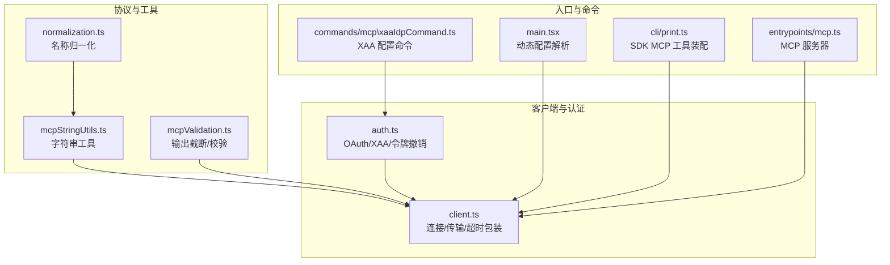
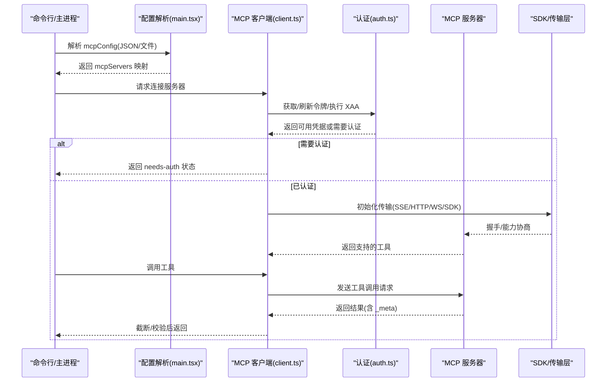
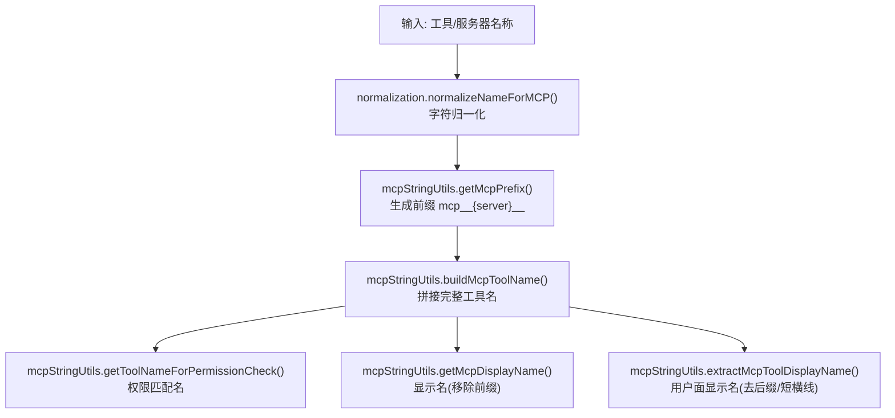
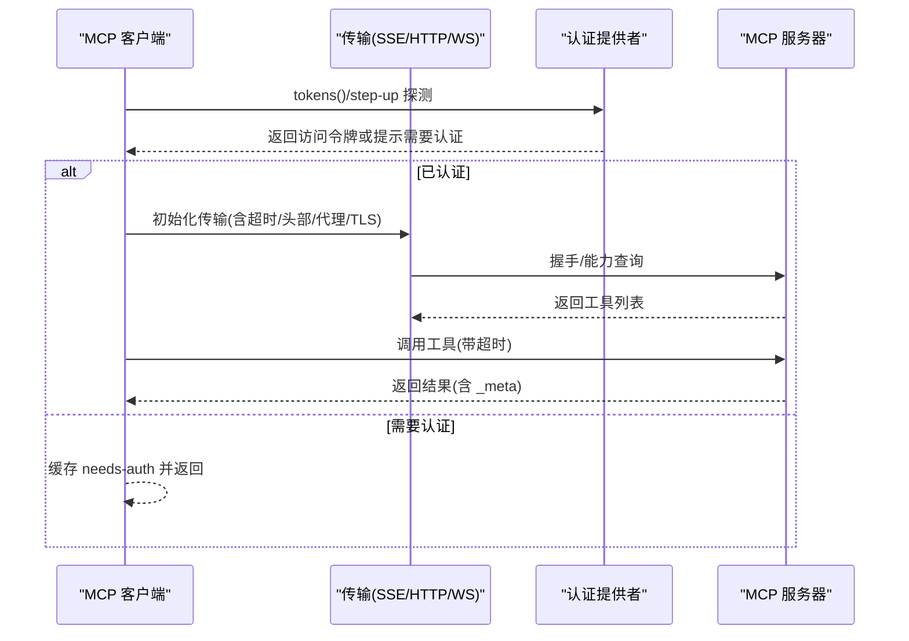
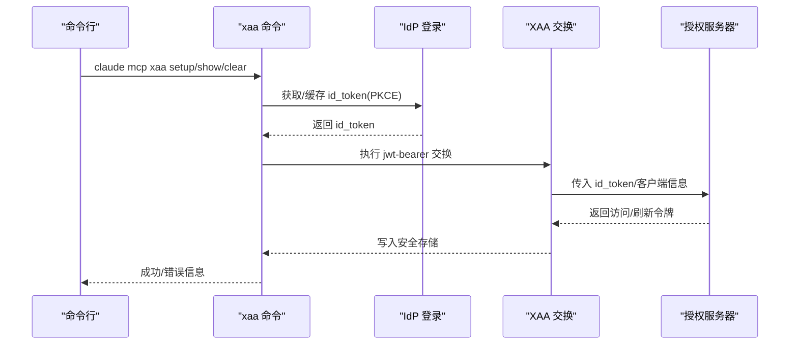
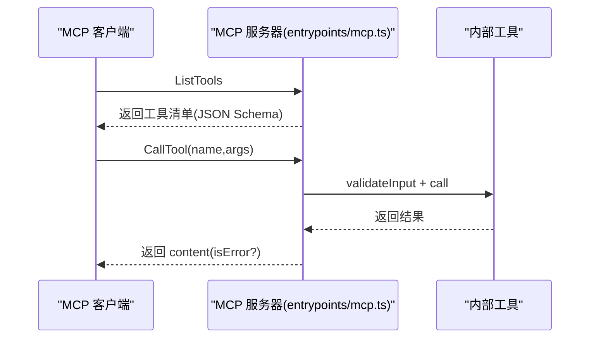
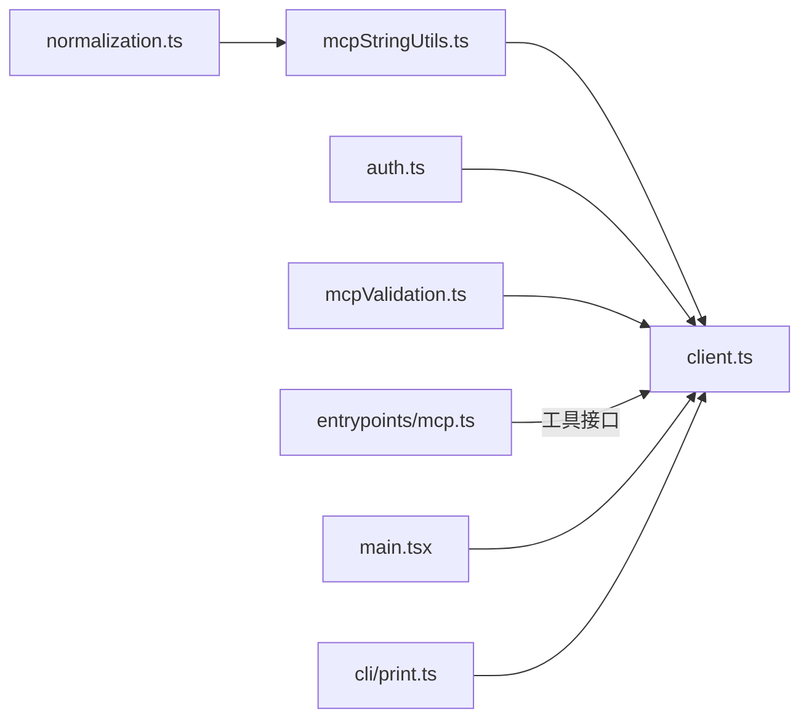

# MCP 协议规范

<cite>
**本文引用的文件**
- [src/services/mcp/mcpStringUtils.ts](file://src/services/mcp/mcpStringUtils.ts)
- [src/services/mcp/normalization.ts](file://src/services/mcp/normalization.ts)
- [src/services/mcp/client.ts](file://src/services/mcp/client.ts)
- [src/services/mcp/auth.ts](file://src/services/mcp/auth.ts)
- [src/entrypoints/mcp.ts](file://src/entrypoints/mcp.ts)
- [src/commands/mcp\xaaIdpCommand.ts](file://src/commands/mcp\xaaIdpCommand.ts)
- [src/utils/mcpValidation.ts](file://src/utils/mcpValidation.ts)
- [src/main.tsx](file://src/main.tsx)
- [src/cli/print.ts](file://src/cli/print.ts)
- [src/utils/errorLogSink.ts](file://src/utils/errorLogSink.ts)
</cite>

## 目录
1. [引言](#引言)
2. [项目结构](#项目结构)
3. [核心组件](#核心组件)
4. [架构总览](#架构总览)
5. [详细组件分析](#详细组件分析)
6. [依赖关系分析](#依赖关系分析)
7. [性能考量](#性能考量)
8. [故障排查指南](#故障排查指南)
9. [结论](#结论)
10. [附录](#附录)

## 引言
本文件面向 Claude Code 的 MCP（Model Context Protocol）实现，系统化梳理协议规范、消息格式、数据类型与通信约定；阐述协议规范化处理（名称归一化、前缀与显示名解析、权限匹配）、字符串处理工具（编码/解码与格式化）、XAA（跨应用访问）身份认证适配器的实现与集成；并提供协议版本管理、向后兼容性与扩展性设计建议。文档同时给出关键流程的时序与类图，帮助读者快速理解代码结构与交互。

## 项目结构
围绕 MCP 的关键模块分布如下：
- 协议规范化与字符串工具：mcpStringUtils.ts、normalization.ts
- 客户端连接与传输：client.ts（含 SSE/HTTP/WebSocket/SDK 控制等）
- 身份认证与授权：auth.ts（含 OAuth 流程、XAA、令牌撤销、发现）
- 入口与服务器：entrypoints/mcp.ts（作为 MCP 服务器）
- 命令行与配置：commands/mcp\xaaIdpCommand.ts、main.tsx、cli/print.ts
- 输出截断与内容校验：utils/mcpValidation.ts
- 错误日志与诊断：utils/errorLogSink.ts

图表来源
- [src/services/mcp/normalization.ts:1-24](file://src/services/mcp/normalization.ts#L1-L24)
- [src/services/mcp/mcpStringUtils.ts:1-107](file://src/services/mcp/mcpStringUtils.ts#L1-L107)
- [src/services/mcp/client.ts:1-800](file://src/services/mcp/client.ts#L1-L800)
- [src/services/mcp/auth.ts:1-800](file://src/services/mcp/auth.ts#L1-L800)
- [src/entrypoints/mcp.ts:1-197](file://src/entrypoints/mcp.ts#L1-L197)
- [src/commands/mcp\xaaIdpCommand.ts:1-266](file://src/commands/mcp\xaaIdpCommand.ts#L1-L266)
- [src/utils/mcpValidation.ts:1-208](file://src/utils/mcpValidation.ts#L1-L208)
- [src/main.tsx:1415-1452](file://src/main.tsx#L1415-L1452)
- [src/cli/print.ts:1432-1471](file://src/cli/print.ts#L1432-L1471)

章节来源
- [src/services/mcp/normalization.ts:1-24](file://src/services/mcp/normalization.ts#L1-L24)
- [src/services/mcp/mcpStringUtils.ts:1-107](file://src/services/mcp/mcpStringUtils.ts#L1-L107)
- [src/services/mcp/client.ts:1-800](file://src/services/mcp/client.ts#L1-L800)
- [src/services/mcp/auth.ts:1-800](file://src/services/mcp/auth.ts#L1-L800)
- [src/entrypoints/mcp.ts:1-197](file://src/entrypoints/mcp.ts#L1-L197)
- [src/commands/mcp\xaaIdpCommand.ts:1-266](file://src/commands/mcp\xaaIdpCommand.ts#L1-L266)
- [src/utils/mcpValidation.ts:1-208](file://src/utils/mcpValidation.ts#L1-L208)
- [src/main.tsx:1415-1452](file://src/main.tsx#L1415-L1452)
- [src/cli/print.ts:1432-1471](file://src/cli/print.ts#L1432-L1471)

## 核心组件
- 名称归一化与字符串工具
  - 归一化：将服务器/工具名映射到 ^[a-zA-Z0-9_-]{1,64} 兼容形式，并对 claude.ai 前缀做特殊处理。
  - 字符串工具：解析 mcp__server__tool 命名、生成前缀、构建全名、提取显示名、权限匹配名。
- 客户端连接与传输
  - 支持 SSE、HTTP、WebSocket、IDE 特殊通道、SDK 控制通道；统一超时包装、Accept 头标准化、代理与 mTLS 配置。
  - 认证失败缓存、会话过期检测、工具调用超时、描述长度限制、输出截断。
- 身份认证与授权
  - OAuth 发现与刷新、令牌撤销、敏感参数脱敏、跨应用访问（XAA）：IdP 统一登录、RFC 8693+jwt-bearer 交换、按 IdP 与 AS 分离密钥存储。
- MCP 服务器入口
  - 暴露工具清单与调用，输入/输出模式转换为 JSON Schema，错误统一返回 isError 标记。
- 动态配置与 SDK 工具装配
  - 命令行 JSON 或文件路径解析 MCP 配置；动态注入/更新 SDK MCP 工具集合。

章节来源
- [src/services/mcp/normalization.ts:1-24](file://src/services/mcp/normalization.ts#L1-L24)
- [src/services/mcp/mcpStringUtils.ts:1-107](file://src/services/mcp/mcpStringUtils.ts#L1-L107)
- [src/services/mcp/client.ts:1-800](file://src/services/mcp/client.ts#L1-L800)
- [src/services/mcp/auth.ts:1-800](file://src/services/mcp/auth.ts#L1-L800)
- [src/entrypoints/mcp.ts:1-197](file://src/entrypoints/mcp.ts#L1-L197)
- [src/main.tsx:1415-1452](file://src/main.tsx#L1415-L1452)
- [src/cli/print.ts:1432-1471](file://src/cli/print.ts#L1432-L1471)

## 架构总览
下图展示 MCP 客户端在不同传输与认证场景下的连接路径与关键处理点。

图表来源
- [src/main.tsx:1415-1452](file://src/main.tsx#L1415-L1452)
- [src/services/mcp/client.ts:1-800](file://src/services/mcp/client.ts#L1-L800)
- [src/services/mcp/auth.ts:1-800](file://src/services/mcp/auth.ts#L1-L800)
- [src/utils/mcpValidation.ts:1-208](file://src/utils/mcpValidation.ts#L1-L208)

## 详细组件分析

### 名称归一化与字符串工具
- 归一化策略
  - 移除非允许字符，替换为下划线；对 claude.ai 前缀服务器，折叠连续下划线并去除首尾下划线，避免与工具命名分隔符冲突。
- 字符串工具能力
  - 解析 mcp__server__tool 命名，提取 serverName 与可选 toolName。
  - 生成 mcp__{server}__ 前缀，构建完整工具名。
  - 权限检查使用“完全限定名”以区分内置与 MCP 替换工具。
  - 提取显示名：移除前缀与“(MCP)”后缀，保留“ - ”后的部分。

图表来源
- [src/services/mcp/normalization.ts:1-24](file://src/services/mcp/normalization.ts#L1-L24)
- [src/services/mcp/mcpStringUtils.ts:1-107](file://src/services/mcp/mcpStringUtils.ts#L1-L107)

章节来源
- [src/services/mcp/normalization.ts:1-24](file://src/services/mcp/normalization.ts#L1-L24)
- [src/services/mcp/mcpStringUtils.ts:1-107](file://src/services/mcp/mcpStringUtils.ts#L1-L107)

### 客户端连接与传输
- 传输类型
  - SSE、HTTP、WebSocket、IDE SSE/WS、SDK 控制通道；分别设置 User-Agent、代理、TLS、会话入口 JWT 等。
- 超时与头部
  - 包装 fetch：每请求独立超时（非单次信号复用），保证长连接 SSE 与短请求 POST 的分离；强制 Streamable HTTP 规范的 Accept 头。
- 连接批处理与缓存键
  - 批量连接大小可配置；连接缓存键包含名称与序列化配置，避免误复用。
- 工具调用与描述限制
  - 工具描述最大长度限制，防止过长文档影响模型输入。
- 会话过期与认证错误
  - 识别“会话不存在”错误；捕获认证错误并标记 needs-auth，写入本地缓存。

图表来源
- [src/services/mcp/client.ts:1-800](file://src/services/mcp/client.ts#L1-L800)
- [src/services/mcp/auth.ts:1-800](file://src/services/mcp/auth.ts#L1-L800)

章节来源
- [src/services/mcp/client.ts:1-800](file://src/services/mcp/client.ts#L1-L800)

### 身份认证与授权（含 XAA）
- OAuth 发现与刷新
  - 支持配置元数据 URL 或 RFC 9728/RFC 8414 自动发现；POST 响应体错误标准化，确保 invalid_grant 正确映射。
  - 为每个请求创建独立超时信号，避免信号过期导致后续请求立即超时。
- 令牌撤销
  - 优先 RFC 7009 方式撤销，若 401 则回退 Bearer 方式；先撤销刷新令牌再撤销访问令牌。
- XAA（跨应用访问）
  - IdP 一次性登录（浏览器弹窗），按 IdP 与 AS 分离密钥存储；通过 RFC 8693+jwt-bearer 在无浏览器情况下完成 AS 令牌交换。
  - XAA 服务器仅走 XAA 路径，不降级至普通 OAuth。
- 敏感参数脱敏
  - 日志中对 state、nonce、code_challenge、code_verifier、code 等参数进行脱敏。

图表来源
- [src/commands/mcp\xaaIdpCommand.ts:1-266](file://src/commands/mcp\xaaIdpCommand.ts#L1-L266)
- [src/services/mcp/auth.ts:1-800](file://src/services/mcp/auth.ts#L1-L800)

章节来源
- [src/commands/mcp\xaaIdpCommand.ts:1-266](file://src/commands/mcp\xaaIdpCommand.ts#L1-L266)
- [src/services/mcp/auth.ts:1-800](file://src/services/mcp/auth.ts#L1-L800)

### MCP 服务器入口（SDK 侧）
- 工具暴露
  - 将内部工具转换为 MCP 工具：输入/输出模式转 JSON Schema，过滤根级别 anyOf/oneOf；生成描述。
- 工具调用
  - 严格校验输入，执行工具并返回文本内容；错误统一包装为 isError 结果，保留 _meta 可见字段。

图表来源
- [src/entrypoints/mcp.ts:1-197](file://src/entrypoints/mcp.ts#L1-L197)

章节来源
- [src/entrypoints/mcp.ts:1-197](file://src/entrypoints/mcp.ts#L1-L197)

### 动态配置与 SDK 工具装配
- 配置解析
  - 支持命令行 JSON 字符串或文件路径；解析为 mcpServers 映射，错误收集与报告。
- SDK MCP 工具装配
  - 动态合并/清理旧 SDK 工具，注入到全局状态；支持特殊内部 VSCode MCP 服务器。
- 动态 MCP 服务器
  - 通过控制消息添加的服务器支持多种传输类型，与 SDK 服务器并行管理。

章节来源
- [src/main.tsx:1415-1452](file://src/main.tsx#L1415-L1452)
- [src/cli/print.ts:1432-1471](file://src/cli/print.ts#L1432-L1471)

## 依赖关系分析
- 组件耦合
  - mcpStringUtils 与 normalization 低耦合，仅通过函数调用；client.ts 依赖 auth.ts 与 utils 子模块。
  - entrypoints/mcp.ts 与工具系统解耦，通过工具接口暴露能力。
- 外部依赖
  - 使用 @modelcontextprotocol/sdk 的客户端/服务器、传输层与类型定义；依赖 axios、ws、zod 等生态库。
- 循环依赖
  - 通过模块拆分与延迟导入避免循环；工具与客户端通过接口契约解耦。

图表来源
- [src/services/mcp/mcpStringUtils.ts:1-107](file://src/services/mcp/mcpStringUtils.ts#L1-L107)
- [src/services/mcp/normalization.ts:1-24](file://src/services/mcp/normalization.ts#L1-L24)
- [src/services/mcp/client.ts:1-800](file://src/services/mcp/client.ts#L1-L800)
- [src/services/mcp/auth.ts:1-800](file://src/services/mcp/auth.ts#L1-L800)
- [src/utils/mcpValidation.ts:1-208](file://src/utils/mcpValidation.ts#L1-L208)
- [src/entrypoints/mcp.ts:1-197](file://src/entrypoints/mcp.ts#L1-L197)
- [src/main.tsx:1415-1452](file://src/main.tsx#L1415-L1452)
- [src/cli/print.ts:1432-1471](file://src/cli/print.ts#L1432-L1471)

## 性能考量
- 连接批处理
  - 本地/远程服务器连接批大小可配置，默认值分别为 3/20，平衡并发与资源占用。
- 超时策略
  - 请求独立超时，避免单次 AbortSignal.timeout 导致后续请求立即超时；GET（SSE）不加超时，POST 加固定超时。
- 输出截断
  - 基于令牌估算与阈值启发式判断是否需要精确计数；超过阈值才调用计数 API，减少不必要的开销。
- 缓存与复用
  - 认证失败缓存（15 分钟 TTL）、连接缓存键、文件状态缓存（MCP 服务器端）降低重复工作。
- 图像压缩
  - 对超预算图像尝试压缩以尽量容纳，失败则跳过，避免整体失败。

章节来源
- [src/services/mcp/client.ts:1-800](file://src/services/mcp/client.ts#L1-L800)
- [src/utils/mcpValidation.ts:1-208](file://src/utils/mcpValidation.ts#L1-L208)

## 故障排查指南
- 认证相关
  - 需要认证：检查 needs-auth 缓存与服务器配置；确认 OAuth 元数据 URL、客户端信息与密钥正确。
  - 令牌撤销失败：关注服务器是否支持 RFC 7009，必要时回退 Bearer 方式；查看日志中的敏感参数脱敏记录。
  - XAA 失败：IdP 登录失败、发现失败、交换失败、jwt-bearer 失败；根据阶段定位问题并清理缓存。
- 连接与传输
  - SSE/WS/HTTP 连接失败：检查代理、TLS、User-Agent、Accept 头；观察日志中脱敏后的请求头。
  - 会话过期：识别 HTTP 404 + JSON-RPC -32001；重新获取客户端并重试。
- 工具调用
  - 输入校验失败：核对 JSON Schema 与工具输入；注意根级别 anyOf/oneOf 的限制。
  - 输出过大：启用截断并检查环境变量 MAX_MCP_OUTPUT_TOKENS；确认图像压缩策略。
- 日志与诊断
  - MCP 错误日志：统一写入调试日志与文件，包含 URL、状态码与服务端消息；提取错误上下文辅助定位。

章节来源
- [src/services/mcp/auth.ts:1-800](file://src/services/mcp/auth.ts#L1-L800)
- [src/services/mcp/client.ts:1-800](file://src/services/mcp/client.ts#L1-L800)
- [src/utils/mcpValidation.ts:1-208](file://src/utils/mcpValidation.ts#L1-L208)
- [src/utils/errorLogSink.ts:133-178](file://src/utils/errorLogSink.ts#L133-L178)

## 结论
Claude Code 的 MCP 实现遵循 MCP 规范，结合 Claude 生态的传输与认证需求，提供了稳健的连接、认证与工具调用机制。通过名称归一化、字符串工具与输出截断，保障了跨服务器工具的一致性与安全性。XAA 适配器实现了 IdP 统一登录与无浏览器的令牌交换，提升了用户体验与可运维性。建议在扩展新服务器类型或传输时，严格遵循现有超时、头部与日志脱敏约定，确保一致的可观测性与安全性。

## 附录
- 协议版本与兼容性
  - 传输层遵循 Streamable HTTP 规范的 Accept 头要求；对严格服务器进行兼容处理。
  - 工具输出模式转换时过滤不兼容的根级别联合类型，保持 MCP SDK 兼容性。
- 扩展性设计
  - 新传输类型：在 client.ts 中新增分支并遵循统一超时与头部策略。
  - 新认证方式：在 auth.ts 中扩展 Provider 并保持与 SDK 的接口一致性。
  - 配置扩展：在 main.tsx 中扩展解析逻辑，确保错误收集与作用域隔离。