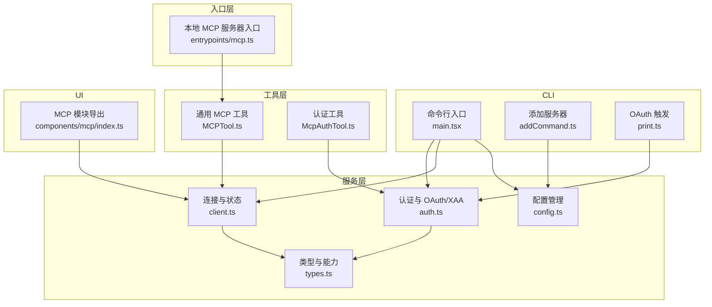
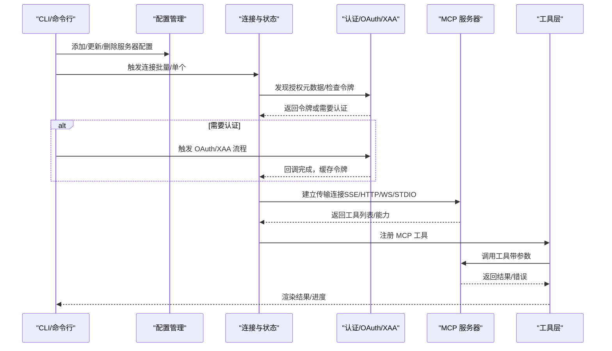
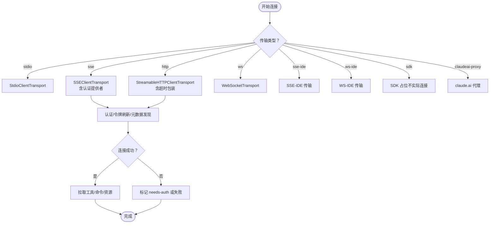
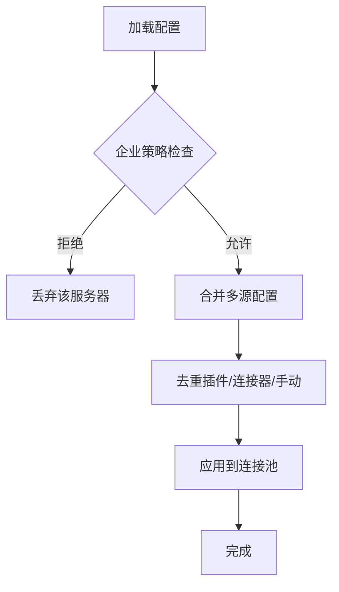
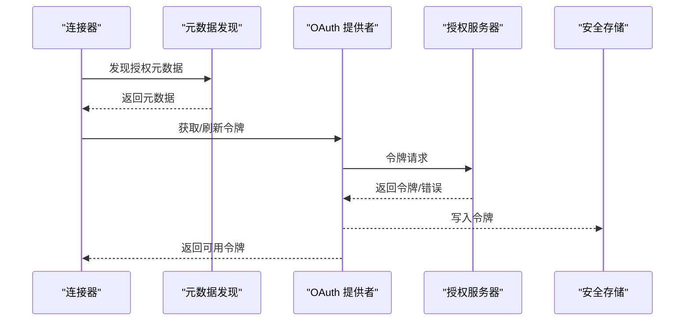
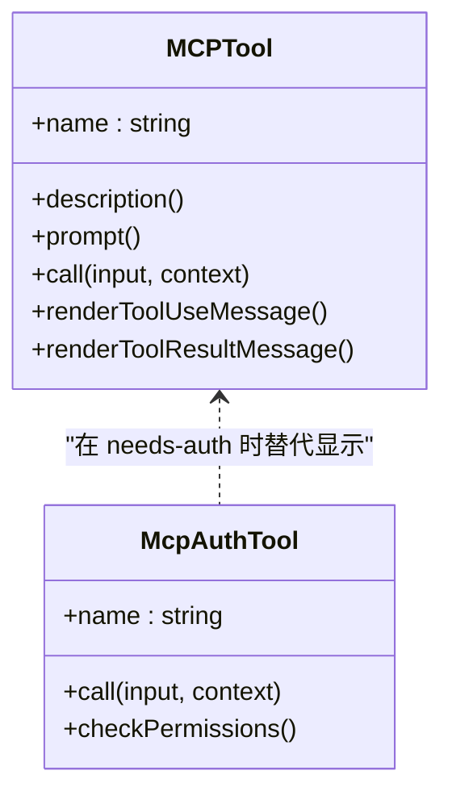
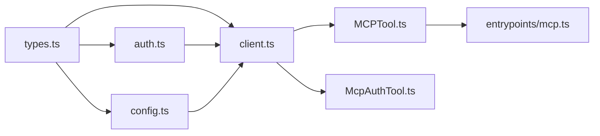

# MCP 协议集成

<cite>
**本文引用的文件**
- [src/services/mcp/client.ts](file://src/services/mcp/client.ts)
- [src/services/mcp/config.ts](file://src/services/mcp/config.ts)
- [src/services/mcp/auth.ts](file://src/services/mcp/auth.ts)
- [src/services/mcp/types.ts](file://src/services/mcp/types.ts)
- [src/tools/MCPTool/MCPTool.ts](file://src/tools/MCPTool/MCPTool.ts)
- [src/tools/McpAuthTool/McpAuthTool.ts](file://src/tools/McpAuthTool/McpAuthTool.ts)
- [src/entrypoints/mcp.ts](file://src/entrypoints/mcp.ts)
- [src/main.tsx](file://src/main.tsx)
- [src/cli/print.ts](file://src/cli/print.ts)
- [src/commands/mcp/addCommand.ts](file://src/commands/mcp/addCommand.ts)
- [src/commands/mcp\xaaIdpCommand.ts](file://src/commands/mcp\xaaIdpCommand.ts)
- [src/constants/oauth.ts](file://src/constants/oauth.ts)
- [src/components/mcp/index.ts](file://src/components/mcp/index.ts)
</cite>

## 目录
1. [简介](#简介)
2. [项目结构](#项目结构)
3. [核心组件](#核心组件)
4. [架构总览](#架构总览)
5. [详细组件分析](#详细组件分析)
6. [依赖关系分析](#依赖关系分析)
7. [性能考量](#性能考量)
8. [故障排查指南](#故障排查指南)
9. [结论](#结论)
10. [附录](#附录)

## 简介
本文件系统性阐述 Claude Code 中 MCP（Model Context Protocol）协议的集成实现，覆盖客户端库、服务器发现与连接管理、配置与认证、工具发现与调用、OAuth 与跨应用访问（XAA）集成、以及与 Claude Code 生态系统的协同方式。文档以代码级事实为基础，辅以可视化图表帮助读者理解端到端流程。

## 项目结构
围绕 MCP 的核心代码分布在以下模块：
- 服务层：连接、认证、配置、类型与工具桥接
- 工具层：通用 MCP 工具封装与认证工具
- 入口层：本地 MCP 服务器入口
- CLI 层：服务器注册、列表、获取与 OAuth 流程触发
- UI 组件：MCP 列表、设置、重连等交互

**图表来源**
- [src/main.tsx](file://src/main.tsx)
- [src/cli/print.ts](file://src/cli/print.ts)
- [src/commands/mcp/addCommand.ts](file://src/commands/mcp/addCommand.ts)
- [src/services/mcp/config.ts](file://src/services/mcp/config.ts)
- [src/services/mcp/client.ts](file://src/services/mcp/client.ts)
- [src/services/mcp/auth.ts](file://src/services/mcp/auth.ts)
- [src/services/mcp/types.ts](file://src/services/mcp/types.ts)
- [src/tools/MCPTool/MCPTool.ts](file://src/tools/MCPTool/MCPTool.ts)
- [src/tools/McpAuthTool/McpAuthTool.ts](file://src/tools/McpAuthTool/McpAuthTool.ts)
- [src/entrypoints/mcp.ts](file://src/entrypoints/mcp.ts)
- [src/components/mcp/index.ts](file://src/components/mcp/index.ts)

**章节来源**
- [src/main.tsx](file://src/main.tsx)
- [src/cli/print.ts](file://src/cli/print.ts)
- [src/commands/mcp/addCommand.ts](file://src/commands/mcp/addCommand.ts)
- [src/services/mcp/config.ts](file://src/services/mcp/config.ts)
- [src/services/mcp/client.ts](file://src/services/mcp/client.ts)
- [src/services/mcp/auth.ts](file://src/services/mcp/auth.ts)
- [src/services/mcp/types.ts](file://src/services/mcp/types.ts)
- [src/tools/MCPTool/MCPTool.ts](file://src/tools/MCPTool/MCPTool.ts)
- [src/tools/McpAuthTool/McpAuthTool.ts](file://src/tools/McpAuthTool/McpAuthTool.ts)
- [src/entrypoints/mcp.ts](file://src/entrypoints/mcp.ts)
- [src/components/mcp/index.ts](file://src/components/mcp/index.ts)

## 核心组件
- 连接与状态管理：负责服务器连接、批量连接、状态转换（连接中/已连接/失败/需要认证/禁用）、会话过期检测与清理、超时与代理支持。
- 配置与策略：解析与写入 .mcp.json、企业策略（允许/拒绝清单）、环境变量展开、去重策略（插件/claude.ai 连接器与手动配置冲突）。
- 认证与 OAuth：标准化 OAuth 请求超时、元数据发现、令牌刷新与失效处理、RFC 7009 令牌撤销、XAA（跨应用访问）集成。
- 工具桥接：将 MCP 工具暴露为 Claude Code 工具，统一输入输出模式；认证工具用于触发 OAuth 或提示用户通过 /mcp 手动授权。
- 本地 MCP 服务器：作为 MCP 服务器侧运行，列举并执行 Claude Code 内置工具。

**章节来源**
- [src/services/mcp/client.ts](file://src/services/mcp/client.ts)
- [src/services/mcp/config.ts](file://src/services/mcp/config.ts)
- [src/services/mcp/auth.ts](file://src/services/mcp/auth.ts)
- [src/tools/MCPTool/MCPTool.ts](file://src/tools/MCPTool/MCPTool.ts)
- [src/tools/McpAuthTool/McpAuthTool.ts](file://src/tools/McpAuthTool/McpAuthTool.ts)
- [src/entrypoints/mcp.ts](file://src/entrypoints/mcp.ts)

## 架构总览
下图展示 MCP 客户端在 Claude Code 中的端到端架构：从 CLI 添加服务器，到连接建立、工具发现、权限校验、调用执行与结果回传，再到认证与 OAuth/XAA 流程。

**图表来源**
- [src/services/mcp/client.ts](file://src/services/mcp/client.ts)
- [src/services/mcp/auth.ts](file://src/services/mcp/auth.ts)
- [src/services/mcp/config.ts](file://src/services/mcp/config.ts)
- [src/tools/MCPTool/MCPTool.ts](file://src/tools/MCPTool/MCPTool.ts)
- [src/cli/print.ts](file://src/cli/print.ts)

## 详细组件分析

### 客户端库与连接管理
- 连接类型与传输：支持 stdio、sse、http、ws、ws-ide、sse-ide、sdk、claudeai-proxy 等多种传输；根据配置选择对应传输层。
- 连接批处理与并发：通过批量大小与序列化调用避免竞态；对 SSE/HTTP/WS 分别构造传输选项，注入用户代理、代理、TLS、头部等。
- 超时与请求包装：为非 GET 请求注入超时信号，确保每次请求独立超时；保证 MCP Streamable HTTP 的 Accept 头。
- 会话与状态：维护连接状态（pending/connected/failed/needs-auth/disabled），支持会话过期检测与清理，支持动态服务器变更。
- 工具与资源：连接成功后拉取工具、命令与资源，按前缀替换旧工具，保持 UI 与查询循环一致。

**图表来源**
- [src/services/mcp/client.ts](file://src/services/mcp/client.ts)
- [src/services/mcp/types.ts](file://src/services/mcp/types.ts)

**章节来源**
- [src/services/mcp/client.ts](file://src/services/mcp/client.ts)
- [src/services/mcp/types.ts](file://src/services/mcp/types.ts)

### 服务器发现与配置管理
- 配置来源与合并：支持项目级 .mcp.json、用户级与本地级配置；企业策略优先，允许/拒绝清单生效；插件与 claude.ai 连接器与手动配置去重。
- 策略与去重：基于命令数组、URL 模式与签名进行去重，确保同一底层进程或 URL 不被重复连接。
- 动态服务器：支持通过控制消息动态增删服务器，序列化变更以避免竞态。

**图表来源**
- [src/services/mcp/config.ts](file://src/services/mcp/config.ts)

**章节来源**
- [src/services/mcp/config.ts](file://src/services/mcp/config.ts)

### 认证机制与 OAuth/XAA
- OAuth 请求超时与标准化：为每个 OAuth 请求附加独立超时信号；对非标准 2xx 错误体进行规范化，统一映射为 InvalidGrant 等错误类型。
- 元数据发现：优先使用配置的 authServerMetadataUrl，否则按 RFC 9728 → RFC 8414 探测；保留路径感知回退兼容。
- 令牌撤销：先撤销刷新令牌，再撤销访问令牌；支持 RFC 7009 两种认证方式回退。
- XAA（跨应用访问）：一次 IdP 登录复用到所有 XAA 服务器；IdP 与 AS 密钥分离；严格错误归类与可操作提示。
- 需要认证缓存：对 401 场景写入缓存并在 15 分钟内抑制重复触发。

**图表来源**
- [src/services/mcp/auth.ts](file://src/services/mcp/auth.ts)
- [src/constants/oauth.ts](file://src/constants/oauth.ts)

**章节来源**
- [src/services/mcp/auth.ts](file://src/services/mcp/auth.ts)
- [src/constants/oauth.ts](file://src/constants/oauth.ts)

### MCP 工具实现与调用
- 通用工具封装：MCPTool 将 MCP 工具统一为 Claude Code 工具，屏蔽输入输出差异，支持截断检测与 UI 渲染。
- 认证工具：当服务器处于 needs-auth 状态时，提供一个“认证”伪工具，触发 OAuth 流程并自动替换为真实工具集合。
- 工具调用：在本地 MCP 服务器入口中，将 Claude Code 工具暴露给 MCP 客户端，按名称路由到具体工具，执行并返回结果。

**图表来源**
- [src/tools/MCPTool/MCPTool.ts](file://src/tools/MCPTool/MCPTool.ts)
- [src/tools/McpAuthTool/McpAuthTool.ts](file://src/tools/McpAuthTool/McpAuthTool.ts)

**章节来源**
- [src/tools/MCPTool/MCPTool.ts](file://src/tools/MCPTool/MCPTool.ts)
- [src/tools/McpAuthTool/McpAuthTool.ts](file://src/tools/McpAuthTool/McpAuthTool.ts)

### 本地 MCP 服务器入口
- 作为 MCP 服务器运行，列举 Claude Code 工具并将其转换为 MCP 工具描述；接收工具调用请求，执行并返回文本内容。
- 输出 Schema 转换：将 Zod Schema 转为 JSON Schema，并过滤根级别为 union 的输出模式。

**章节来源**
- [src/entrypoints/mcp.ts](file://src/entrypoints/mcp.ts)

### CLI 与 UI 集成
- CLI 命令：注册 add/list/get/remove 命令，支持 HTTP/SSE/WS 服务器配置与 OAuth 参数；支持 XAA IdP 设置。
- 控制消息：通过 mcp_authenticate 触发 OAuth 流程，捕获授权 URL 并在回调完成后自动重连与替换工具。
- UI 组件：导出 MCP 列表、设置、重连、菜单等组件，配合状态管理与权限控制。

**章节来源**
- [src/main.tsx](file://src/main.tsx)
- [src/cli/print.ts](file://src/cli/print.ts)
- [src/commands/mcp/addCommand.ts](file://src/commands/mcp/addCommand.ts)
- [src/commands/mcp\xaaIdpCommand.ts](file://src/commands/mcp\xaaIdpCommand.ts)
- [src/components/mcp/index.ts](file://src/components/mcp/index.ts)

## 依赖关系分析
- 类型与能力：MCP 类型定义集中于 types.ts，涵盖配置、连接状态、资源与 CLI 序列化状态。
- 运行时耦合：client.ts 依赖 auth.ts（认证）、config.ts（策略与去重）、types.ts（类型）、工具层（MCPTool/McpAuthTool）。
- 工具层依赖：MCPTool 与 McpAuthTool 依赖 client.ts 的连接状态与工具注册机制。
- 入口依赖：entrypoints/mcp.ts 依赖工具层与工具查找逻辑。

**图表来源**
- [src/services/mcp/types.ts](file://src/services/mcp/types.ts)
- [src/services/mcp/client.ts](file://src/services/mcp/client.ts)
- [src/services/mcp/config.ts](file://src/services/mcp/config.ts)
- [src/services/mcp/auth.ts](file://src/services/mcp/auth.ts)
- [src/tools/MCPTool/MCPTool.ts](file://src/tools/MCPTool/MCPTool.ts)
- [src/tools/McpAuthTool/McpAuthTool.ts](file://src/tools/McpAuthTool/McpAuthTool.ts)
- [src/entrypoints/mcp.ts](file://src/entrypoints/mcp.ts)

**章节来源**
- [src/services/mcp/types.ts](file://src/services/mcp/types.ts)
- [src/services/mcp/client.ts](file://src/services/mcp/client.ts)
- [src/services/mcp/config.ts](file://src/services/mcp/config.ts)
- [src/services/mcp/auth.ts](file://src/services/mcp/auth.ts)
- [src/tools/MCPTool/MCPTool.ts](file://src/tools/MCPTool/MCPTool.ts)
- [src/tools/McpAuthTool/McpAuthTool.ts](file://src/tools/McpAuthTool/McpAuthTool.ts)
- [src/entrypoints/mcp.ts](file://src/entrypoints/mcp.ts)

## 性能考量
- 连接批处理：默认批量大小与远程批量大小可由环境变量调整，减少握手开销。
- 超时与内存：为每次请求注入独立超时信号，避免单次超时信号导致后续请求立即失败；LRU 缓存限制文件状态缓存大小。
- 代理与 TLS：统一注入代理与 TLS 选项，减少网络往返时间。
- 工具描述长度：限制工具描述最大长度，避免长描述影响模型上下文。

[本节为通用指导，无需特定文件来源]

## 故障排查指南
- 401/需要认证：检查 OAuth 配置与令牌是否有效；查看 needs-auth 缓存与认证工具触发；必要时清除缓存并重新授权。
- 会话过期：检测 404 + 特定 JSON-RPC 错误码，清理连接缓存并重新获取客户端。
- 代理/网络问题：确认代理配置与 TLS 选项；检查事件源/WS 连接日志。
- 工具调用失败：查看工具输入验证与输出截断；检查工具权限与 UI 渲染错误。

**章节来源**
- [src/services/mcp/client.ts](file://src/services/mcp/client.ts)
- [src/services/mcp/auth.ts](file://src/services/mcp/auth.ts)

## 结论
Claude Code 对 MCP 的集成以类型安全、策略可控、认证完备为核心设计原则。通过统一的连接与状态管理、严格的策略与去重、完善的 OAuth/XAA 支持，以及与 Claude Code 工具生态的无缝衔接，实现了可扩展、可观测且易维护的 MCP 客户端方案。

[本节为总结，无需特定文件来源]

## 附录

### MCP 服务器开发指南（面向集成方）
- 协议实现要点
  - 传输选择：优先支持 SSE/HTTP（Streamable HTTP）与 WS；确保 Accept 头正确。
  - 工具暴露：实现 ListTools 与 CallTool；输出 Schema 必须为对象根。
  - 能力声明：根据实际能力声明 tools/prompts/resources。
- 错误处理
  - 使用标准 JSON-RPC 错误码；对非标准错误体进行规范化。
  - 对 401/403 明确区分认证失败与权限不足。
- 性能优化
  - 合理设置超时与批处理；启用代理与 TLS；限制工具描述长度。
  - 在本地服务器入口中，避免在工具调用外额外读取消息。

**章节来源**
- [src/entrypoints/mcp.ts](file://src/entrypoints/mcp.ts)
- [src/services/mcp/client.ts](file://src/services/mcp/client.ts)
- [src/services/mcp/auth.ts](file://src/services/mcp/auth.ts)

### MCP 工具使用示例与最佳实践
- 使用场景
  - 通过 /mcp 触发认证工具，自动完成 OAuth/XAA 授权后工具可用。
  - 在对话中直接调用 MCP 工具，注意输入参数与输出截断。
- 最佳实践
  - 为工具提供清晰描述与最小输入模式；避免在工具描述中注入冗长文档。
  - 在需要认证的服务器上，优先使用认证工具而非手动授权。
  - 对于 IDE/远程服务器，确保传输类型与头部配置正确。

**章节来源**
- [src/tools/McpAuthTool/McpAuthTool.ts](file://src/tools/McpAuthTool/McpAuthTool.ts)
- [src/tools/MCPTool/MCPTool.ts](file://src/tools/MCPTool/MCPTool.ts)
- [src/cli/print.ts](file://src/cli/print.ts)

### 与 Claude Code 生态协同
- 与工具系统：MCP 工具经统一封装后可与内置工具共享权限与 UI 渲染。
- 与设置与策略：企业策略与去重逻辑确保多源配置的一致性与安全性。
- 与 UI：MCP 列表、设置、重连等组件与状态管理联动，提供一致用户体验。

**章节来源**
- [src/services/mcp/config.ts](file://src/services/mcp/config.ts)
- [src/components/mcp/index.ts](file://src/components/mcp/index.ts)