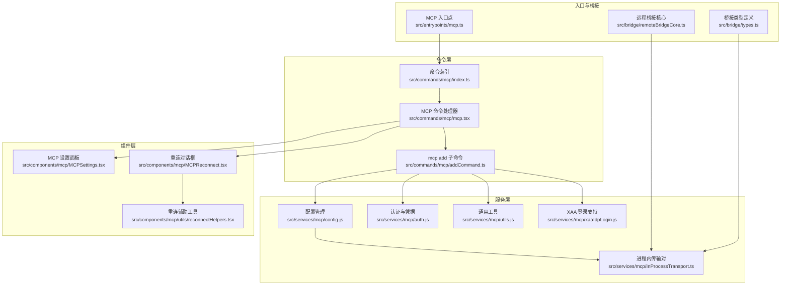
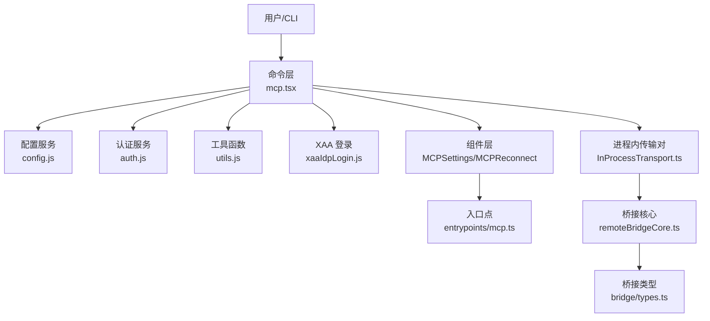
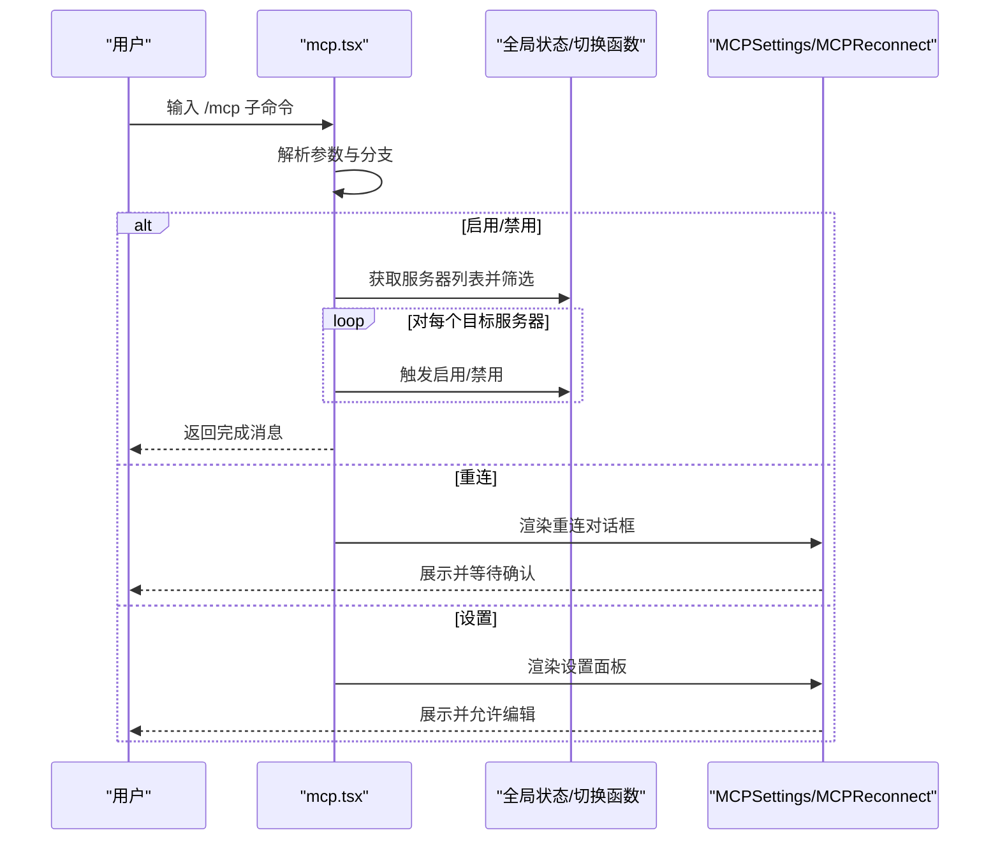
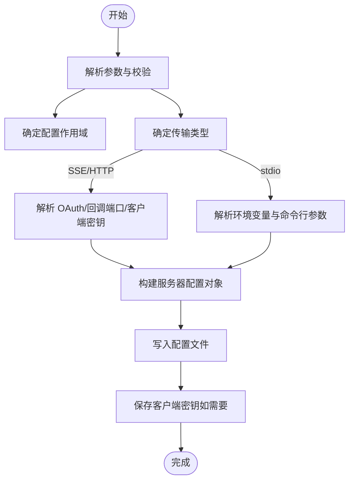
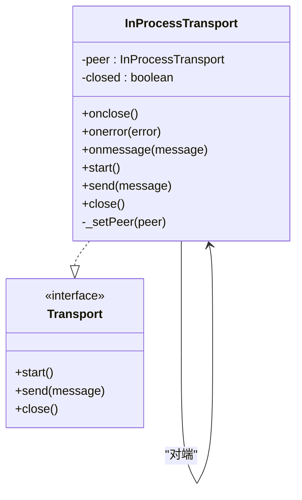
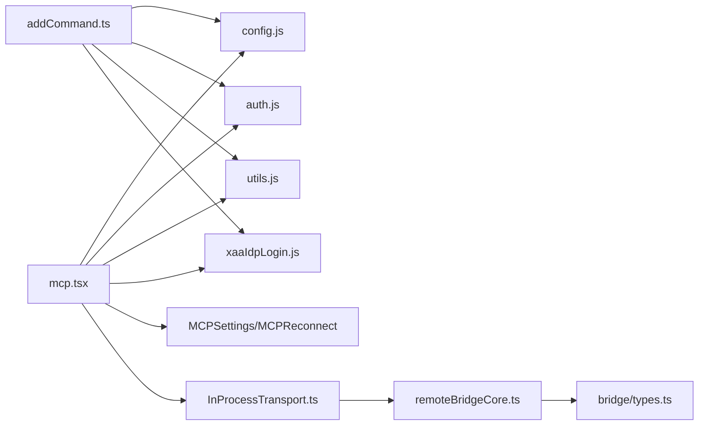

# MCP 客户端实现

<cite>
**本文引用的文件**
- [src/commands/mcp/index.ts](file://src/commands/mcp/index.ts)
- [src/commands/mcp/mcp.tsx](file://src/commands/mcp/mcp.tsx)
- [src/commands/mcp/addCommand.ts](file://src/commands/mcp/addCommand.ts)
- [src/services/mcp/InProcessTransport.ts](file://src/services/mcp/InProcessTransport.ts)
- [src/components/mcp/MCPSettings.tsx](file://src/components/mcp/MCPSettings.tsx)
- [src/components/mcp/MCPReconnect.tsx](file://src/components/mcp/MCPReconnect.tsx)
- [src/components/mcp/utils/reconnectHelpers.tsx](file://src/components/mcp/utils/reconnectHelpers.tsx)
- [src/entrypoints/mcp.ts](file://src/entrypoints/mcp.ts)
- [src/cli/handlers/mcp.tsx](file://src/cli/handlers/mcp.tsx)
- [src/services/mcp/config.js](file://src/services/mcp/config.js)
- [src/services/mcp/auth.js](file://src/services/mcp/auth.js)
- [src/services/mcp/utils.js](file://src/services/mcp/utils.js)
- [src/services/mcp/xaaIdpLogin.js](file://src/services/mcp/xaaIdpLogin.js)
- [src/bridge/remoteBridgeCore.ts](file://src/bridge/remoteBridgeCore.ts)
- [src/bridge/types.ts](file://src/bridge/types.ts)
- [src/QueryEngine.ts](file://src/QueryEngine.ts)
- [src/Tool.ts](file://src/Tool.ts)
</cite>

## 目录
1. [简介](#简介)
2. [项目结构](#项目结构)
3. [核心组件](#核心组件)
4. [架构总览](#架构总览)
5. [详细组件分析](#详细组件分析)
6. [依赖关系分析](#依赖关系分析)
7. [性能考虑](#性能考虑)
8. [故障排除指南](#故障排除指南)
9. [结论](#结论)
10. [附录](#附录)

## 简介
本技术文档面向 Claude Code 的 MCP（Model Context Protocol）客户端实现，系统性阐述其架构设计、连接建立、消息传输与协议处理机制，以及认证流程（含 OAuth、凭据存储与令牌刷新）。文档还覆盖客户端配置项（服务器地址、传输方式、超时与重连策略）、与 MCP 服务器的通信协议（请求/响应、错误处理、状态管理）、使用示例与最佳实践，以及性能优化与故障排除建议。

## 项目结构
MCP 客户端相关代码主要分布在以下模块：
- 命令层：CLI 子命令注册与执行，负责添加/启用/禁用/重连 MCP 服务器等操作
- 服务层：MCP 配置、认证、工具函数与传输抽象
- 组件层：UI 面板与对话框，用于展示与交互
- 入口层：MCP 命令入口点
- 桥接层：与远程桥接核心集成，确保传输生命周期与会话一致

图表来源
- [src/commands/mcp/index.ts:1-13](file://src/commands/mcp/index.ts#L1-L13)
- [src/commands/mcp/mcp.tsx:1-85](file://src/commands/mcp/mcp.tsx#L1-L85)
- [src/commands/mcp/addCommand.ts:1-281](file://src/commands/mcp/addCommand.ts#L1-L281)
- [src/services/mcp/InProcessTransport.ts:1-64](file://src/services/mcp/InProcessTransport.ts#L1-L64)
- [src/components/mcp/MCPSettings.tsx](file://src/components/mcp/MCPSettings.tsx)
- [src/components/mcp/MCPReconnect.tsx](file://src/components/mcp/MCPReconnect.tsx)
- [src/components/mcp/utils/reconnectHelpers.tsx](file://src/components/mcp/utils/reconnectHelpers.tsx)
- [src/entrypoints/mcp.ts](file://src/entrypoints/mcp.ts)
- [src/bridge/remoteBridgeCore.ts:229](file://src/bridge/remoteBridgeCore.ts#L229)
- [src/bridge/types.ts:42](file://src/bridge/types.ts#L42)

章节来源
- [src/commands/mcp/index.ts:1-13](file://src/commands/mcp/index.ts#L1-L13)
- [src/commands/mcp/mcp.tsx:1-85](file://src/commands/mcp/mcp.tsx#L1-L85)
- [src/commands/mcp/addCommand.ts:1-281](file://src/commands/mcp/addCommand.ts#L1-L281)
- [src/services/mcp/InProcessTransport.ts:1-64](file://src/services/mcp/InProcessTransport.ts#L1-L64)

## 核心组件
- 命令入口与路由
  - 命令索引定义了本地 JSX 命令“mcp”，并延迟加载实际处理器
  - 主命令处理器根据参数分派到设置面板、重连对话框或批量启用/禁用
- 配置与认证
  - 支持三种传输：stdio、HTTP、SSE；可设置环境变量、请求头、OAuth 客户端信息、回调端口、XAA（SEP-990）
  - 提供客户端密钥读取与保存、配置作用域（local/user/project）与路径描述
- 进程内传输
  - 提供双向链路的内存传输对，避免子进程开销，便于测试与内联运行
- UI 面板与重连
  - 设置面板用于查看/编辑服务器列表与状态
  - 重连对话框与辅助工具用于触发特定服务器的重连逻辑
- 入口与桥接
  - 入口点集中注册命令
  - 桥接核心与类型定义确保传输生命周期与会话一致性

章节来源
- [src/commands/mcp/index.ts:1-13](file://src/commands/mcp/index.ts#L1-L13)
- [src/commands/mcp/mcp.tsx:1-85](file://src/commands/mcp/mcp.tsx#L1-L85)
- [src/commands/mcp/addCommand.ts:33-281](file://src/commands/mcp/addCommand.ts#L33-L281)
- [src/services/mcp/InProcessTransport.ts:11-64](file://src/services/mcp/InProcessTransport.ts#L11-L64)
- [src/entrypoints/mcp.ts](file://src/entrypoints/mcp.ts)
- [src/bridge/remoteBridgeCore.ts:229](file://src/bridge/remoteBridgeCore.ts#L229)
- [src/bridge/types.ts:42](file://src/bridge/types.ts#L42)

## 架构总览
MCP 客户端采用“命令层-服务层-组件层-入口与桥接”的分层设计。命令层负责用户输入解析与路由；服务层封装配置、认证与传输细节；组件层提供 UI 交互；入口与桥接保证在不同运行场景下的一致性与稳定性。

图表来源
- [src/commands/mcp/mcp.tsx:63-85](file://src/commands/mcp/mcp.tsx#L63-L85)
- [src/commands/mcp/addCommand.ts:81-281](file://src/commands/mcp/addCommand.ts#L81-L281)
- [src/services/mcp/config.js](file://src/services/mcp/config.js)
- [src/services/mcp/auth.js](file://src/services/mcp/auth.js)
- [src/services/mcp/utils.js](file://src/services/mcp/utils.js)
- [src/services/mcp/xaaIdpLogin.js](file://src/services/mcp/xaaIdpLogin.js)
- [src/services/mcp/InProcessTransport.ts:11-64](file://src/services/mcp/InProcessTransport.ts#L11-L64)
- [src/entrypoints/mcp.ts](file://src/entrypoints/mcp.ts)
- [src/bridge/remoteBridgeCore.ts:229](file://src/bridge/remoteBridgeCore.ts#L229)
- [src/bridge/types.ts:42](file://src/bridge/types.ts#L42)

## 详细组件分析

### 命令层：mcp.tsx
- 功能要点
  - 解析参数，支持“no-redirect”“reconnect”“enable/disable”等子命令
  - 将“/mcp”重定向至插件设置界面（特定场景）
  - 批量启用/禁用服务器，按名称过滤
- 控制流
  - 参数校验与分支
  - 调用全局状态与切换函数，批量触发服务器启停
  - 返回对应 UI 组件以渲染设置面板或重连对话框

图表来源
- [src/commands/mcp/mcp.tsx:63-85](file://src/commands/mcp/mcp.tsx#L63-L85)
- [src/commands/mcp/mcp.tsx:12-56](file://src/commands/mcp/mcp.tsx#L12-L56)

章节来源
- [src/commands/mcp/mcp.tsx:1-85](file://src/commands/mcp/mcp.tsx#L1-L85)

### 命令层：addCommand.ts（mcp add）
- 功能要点
  - 注册“mcp add”子命令，支持三种传输：stdio、HTTP、SSE
  - 可配置作用域（local/user/project）、环境变量、请求头、OAuth 客户端信息、回调端口、XAA（SEP-990）
  - 在添加时进行 XAA 必备条件校验，失败即刻返回
  - 自动识别疑似 URL 的 stdio 场景并给出警告与正确用法提示
- 处理流程
  - 参数解析与校验
  - 选择传输类型与构建配置对象
  - 写入配置文件，必要时保存客户端密钥
  - 输出成功信息与配置文件路径

图表来源
- [src/commands/mcp/addCommand.ts:81-281](file://src/commands/mcp/addCommand.ts#L81-L281)

章节来源
- [src/commands/mcp/addCommand.ts:1-281](file://src/commands/mcp/addCommand.ts#L1-L281)

### 服务层：InProcessTransport.ts（进程内传输）
- 设计目标
  - 在同一进程中模拟 MCP 客户端与服务器之间的传输，无需子进程
  - 通过微任务异步投递消息，避免同步请求/响应导致的栈过深
  - 提供对称的关闭语义，任一侧关闭都会通知另一侧
- 关键接口
  - start：空实现（就绪）
  - send：异步投递消息至对端
  - close：标记关闭并调用双方 onclose

图表来源
- [src/services/mcp/InProcessTransport.ts:11-64](file://src/services/mcp/InProcessTransport.ts#L11-L64)

章节来源
- [src/services/mcp/InProcessTransport.ts:1-64](file://src/services/mcp/InProcessTransport.ts#L1-L64)

### 组件层：MCP 设置与重连
- MCPSettings
  - 展示服务器列表、状态与操作入口
- MCPReconnect
  - 针对单个服务器触发重连流程
- reconnectHelpers
  - 提供重连相关的辅助逻辑（如状态管理、重试策略）

章节来源
- [src/components/mcp/MCPSettings.tsx](file://src/components/mcp/MCPSettings.tsx)
- [src/components/mcp/MCPReconnect.tsx](file://src/components/mcp/MCPReconnect.tsx)
- [src/components/mcp/utils/reconnectHelpers.tsx](file://src/components/mcp/utils/reconnectHelpers.tsx)

### 入口与桥接
- 入口点
  - 集中注册 MCP 命令，确保 CLI 与 UI 路由一致
- 桥接核心与类型
  - 确保传输在桥接生命周期内保持一致，避免在连接建立过程中被冻结
  - 类型定义约束 mcp_config 字段，保证配置结构化

章节来源
- [src/entrypoints/mcp.ts](file://src/entrypoints/mcp.ts)
- [src/bridge/remoteBridgeCore.ts:229](file://src/bridge/remoteBridgeCore.ts#L229)
- [src/bridge/types.ts:42](file://src/bridge/types.ts#L42)

## 依赖关系分析
- 命令层依赖服务层与组件层
  - mcp.tsx 依赖全局状态与切换函数，并渲染设置/重连 UI
  - addCommand.ts 依赖配置、认证、工具与 XAA 登录服务
- 服务层内部耦合
  - 配置与传输对紧密关联，认证与工具函数为通用支撑
- 桥接层与入口层
  - 入口点统一注册命令
  - 桥接核心与类型确保传输生命周期与会话一致性

图表来源
- [src/commands/mcp/mcp.tsx:1-85](file://src/commands/mcp/mcp.tsx#L1-L85)
- [src/commands/mcp/addCommand.ts:1-281](file://src/commands/mcp/addCommand.ts#L1-L281)
- [src/services/mcp/config.js](file://src/services/mcp/config.js)
- [src/services/mcp/auth.js](file://src/services/mcp/auth.js)
- [src/services/mcp/utils.js](file://src/services/mcp/utils.js)
- [src/services/mcp/xaaIdpLogin.js](file://src/services/mcp/xaaIdpLogin.js)
- [src/services/mcp/InProcessTransport.ts:11-64](file://src/services/mcp/InProcessTransport.ts#L11-L64)
- [src/bridge/remoteBridgeCore.ts:229](file://src/bridge/remoteBridgeCore.ts#L229)
- [src/bridge/types.ts:42](file://src/bridge/types.ts#L42)

章节来源
- [src/commands/mcp/mcp.tsx:1-85](file://src/commands/mcp/mcp.tsx#L1-L85)
- [src/commands/mcp/addCommand.ts:1-281](file://src/commands/mcp/addCommand.ts#L1-L281)
- [src/services/mcp/InProcessTransport.ts:1-64](file://src/services/mcp/InProcessTransport.ts#L1-L64)

## 性能考虑
- 使用进程内传输对减少子进程开销，适合测试与内联场景
- 异步消息投递避免同步循环导致的栈深度问题
- 批量启用/禁用服务器时，应避免重复连接与不必要的 UI 刷新
- 在 CLI 中尽早触发用户设置下载，使后续 MCP 与工具初始化阶段重叠，缩短整体启动时间

## 故障排除指南
- “mcp add”常见问题
  - 误将 URL 当作 stdio 命令：工具会发出警告并提供正确的 --transport 用法
  - SSE/HTTP 仅支持 OAuth/回调端口/XAA：stdio 不支持这些选项，会被忽略并给出警告
  - XAA 条件不满足：需先启用相关环境变量并完成 IDP 设置
- 重连问题
  - 使用“/mcp reconnect <server-name>”触发指定服务器重连
  - 检查服务器状态与网络连通性
- 认证问题
  - 确认客户端 ID/密钥与回调端口配置正确
  - 若服务器要求预注册回调 URI，需使用固定回调端口

章节来源
- [src/commands/mcp/addCommand.ts:127-281](file://src/commands/mcp/addCommand.ts#L127-L281)
- [src/components/mcp/MCPReconnect.tsx](file://src/components/mcp/MCPReconnect.tsx)
- [src/components/mcp/utils/reconnectHelpers.tsx](file://src/components/mcp/utils/reconnectHelpers.tsx)

## 结论
该 MCP 客户端实现以清晰的分层架构与完善的命令/服务/组件体系，提供了从配置、认证到传输与 UI 的完整能力。通过进程内传输对与桥接核心的配合，既满足了开发与测试需求，也保证了生产环境下的稳定性。建议在实际使用中遵循最佳实践，合理配置传输与认证参数，并利用重连与诊断工具提升可靠性。

## 附录

### 客户端配置选项与示例
- 服务器地址与传输
  - stdio：通过命令与参数启动本地进程
  - HTTP/SSE：通过 URL 与可选请求头连接
- 超时与重连
  - 重连可通过 UI 或命令触发；具体重试策略由重连辅助工具决定
- 认证与凭据
  - 支持 OAuth 客户端 ID/密钥、回调端口、XAA（SEP-990）
  - 客户端密钥可安全保存于配置中

章节来源
- [src/commands/mcp/addCommand.ts:48-80](file://src/commands/mcp/addCommand.ts#L48-L80)
- [src/commands/mcp/addCommand.ts:147-274](file://src/commands/mcp/addCommand.ts#L147-L274)
- [src/services/mcp/auth.js](file://src/services/mcp/auth.js)

### 与 MCP 服务器的通信协议与状态管理
- 请求/响应模式
  - 基于 JSON-RPC 消息格式，通过传输层发送与接收
  - 进程内传输对提供异步消息投递与对称关闭语义
- 错误处理
  - 传输层提供 onerror 回调；UI 层负责展示与引导重连
- 状态管理
  - UI 面板维护服务器状态；重连对话框与辅助工具协调重连流程

章节来源
- [src/services/mcp/InProcessTransport.ts:11-64](file://src/services/mcp/InProcessTransport.ts#L11-L64)
- [src/components/mcp/MCPSettings.tsx](file://src/components/mcp/MCPSettings.tsx)
- [src/components/mcp/MCPReconnect.tsx](file://src/components/mcp/MCPReconnect.tsx)
- [src/components/mcp/utils/reconnectHelpers.tsx](file://src/components/mcp/utils/reconnectHelpers.tsx)

### 与 QueryEngine/Tool 的集成
- QueryEngine 与 Tool 维护 MCPServerConnection 列表与资源映射，确保工具发现与调用时的上下文一致性
- 桥接核心注释强调传输应在构造时冻结，避免在连接建立过程中被修改

章节来源
- [src/QueryEngine.ts:36](file://src/QueryEngine.ts#L36)
- [src/QueryEngine.ts:112](file://src/QueryEngine.ts#L112)
- [src/QueryEngine.ts:133](file://src/QueryEngine.ts#L133)
- [src/Tool.ts:24](file://src/Tool.ts#L24)
- [src/Tool.ts:165](file://src/Tool.ts#L165)
- [src/Tool.ts:331](file://src/Tool.ts#L331)
- [src/Tool.ts:451](file://src/Tool.ts#L451)
- [src/bridge/remoteBridgeCore.ts:229](file://src/bridge/remoteBridgeCore.ts#L229)