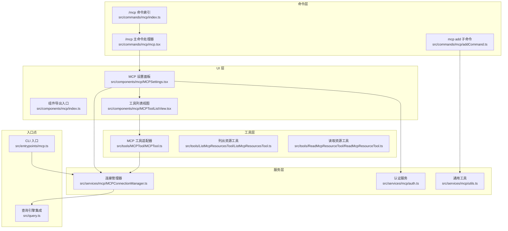
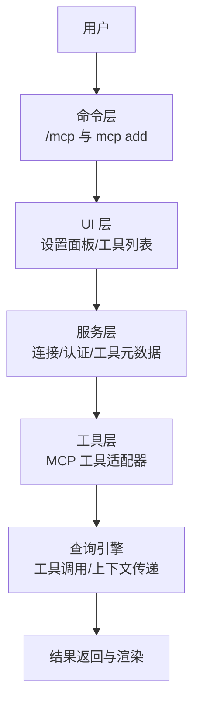
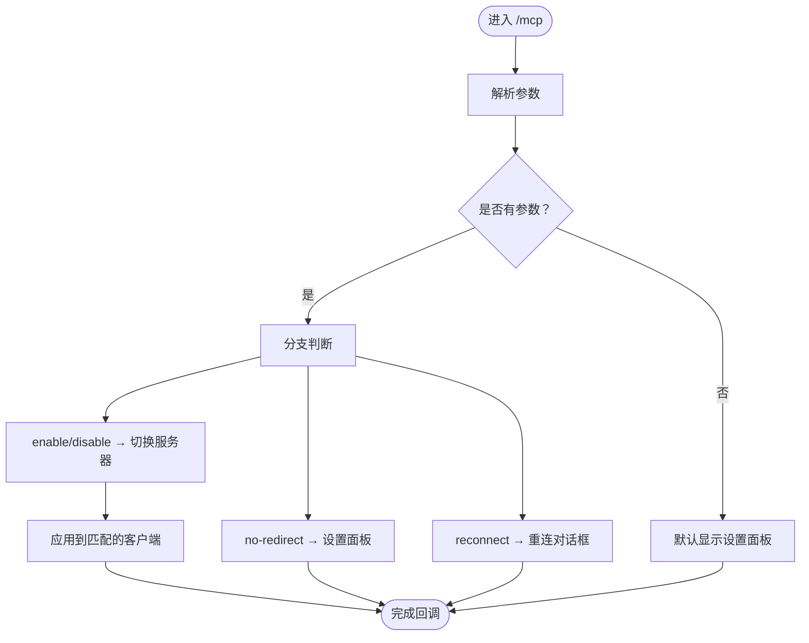
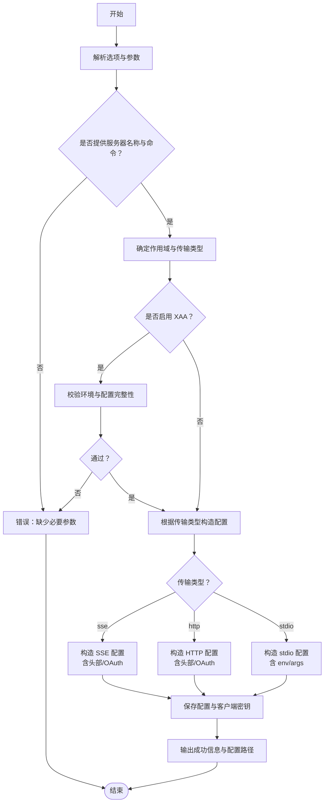
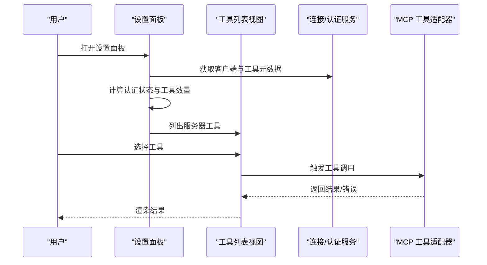
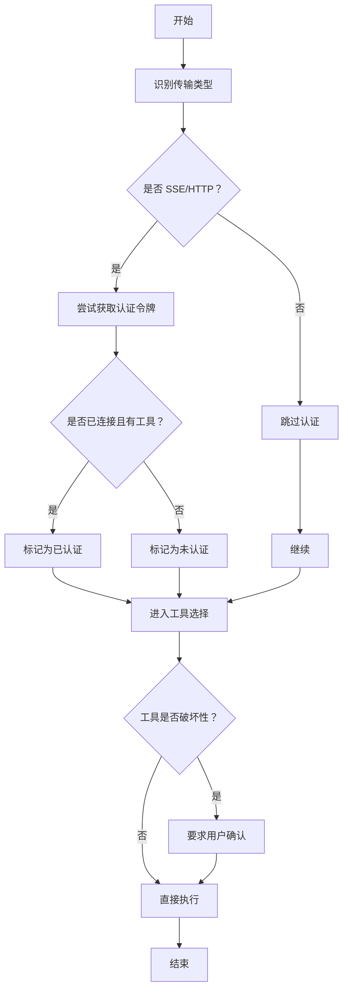
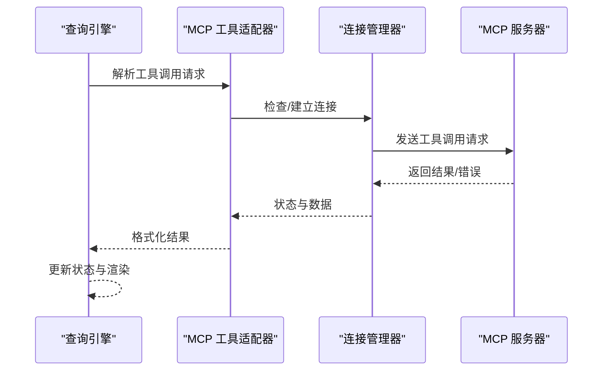
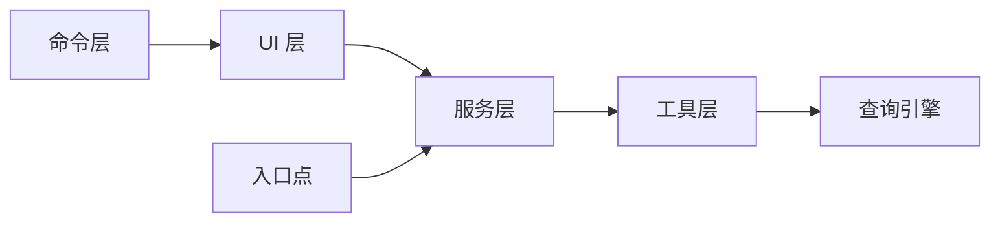

# MCP 工具集成

<cite>
**本文引用的文件**
- [src/commands/mcp/index.ts](file://src/commands/mcp/index.ts)
- [src/commands/mcp/mcp.tsx](file://src/commands/mcp/mcp.tsx)
- [src/commands/mcp/addCommand.ts](file://src/commands/mcp/addCommand.ts)
- [src/components/mcp/index.ts](file://src/components/mcp/index.ts)
- [src/components/mcp/MCPSettings.tsx](file://src/components/mcp/MCPSettings.tsx)
- [src/components/mcp/MCPToolListView.tsx](file://src/components/mcp/MCPToolListView.tsx)
- [src/services/mcp/MCPConnectionManager.ts](file://src/services/mcp/MCPConnectionManager.ts)
- [src/services/mcp/auth.ts](file://src/services/mcp/auth.ts)
- [src/services/mcp/utils.ts](file://src/services/mcp/utils.ts)
- [src/hooks/useCanUseTool.tsx](file://src/hooks/useCanUseTool.tsx)
- [src/tools/MCPTool/MCPTool.ts](file://src/tools/MCPTool/MCPTool.ts)
- [src/tools/ListMcpResourcesTool/ListMcpResourcesTool.ts](file://src/tools/ListMcpResourcesTool/ListMcpResourcesTool.ts)
- [src/tools/ReadMcpResourceTool/ReadMcpResourceTool.ts](file://src/tools/ReadMcpResourceTool/ReadMcpResourceTool.ts)
- [src/query.ts](file://src/query.ts)
- [src/entrypoints/mcp.ts](file://src/entrypoints/mcp.ts)
</cite>

## 目录
1. [引言](#引言)
2. [项目结构](#项目结构)
3. [核心组件](#核心组件)
4. [架构总览](#架构总览)
5. [详细组件分析](#详细组件分析)
6. [依赖关系分析](#依赖关系分析)
7. [性能考虑](#性能考虑)
8. [故障排查指南](#故障排查指南)
9. [结论](#结论)
10. [附录](#附录)

## 引言
本文件面向 Claude Code 的 MCP（Model Context Protocol）工具集成功能，系统性阐述 MCP 工具的工作原理、UI 集成、权限控制、与查询引擎的协作方式，并提供使用示例、配置指南、性能优化与错误处理策略。目标读者既包括需要快速上手的使用者，也包括希望深入理解实现细节的开发者。

## 项目结构
MCP 功能由“命令层”“UI 层”“服务层”“工具层”“入口点”等模块协同构成：
- 命令层：提供 /mcp 等命令入口，负责解析参数并调度 UI 或服务。
- UI 层：以 React 组件形式展示服务器列表、菜单、工具列表与详情。
- 服务层：管理连接、认证、配置与工具元数据，封装与 MCP 服务器的交互。
- 工具层：将 MCP 工具暴露为 Claude Code 可用的工具，支持参数映射与结果处理。
- 入口点：CLI 与 IDE 插件入口，承载 MCP 的初始化与生命周期管理。

图表来源
- [src/commands/mcp/index.ts:1-13](file://src/commands/mcp/index.ts#L1-L13)
- [src/commands/mcp/mcp.tsx:1-85](file://src/commands/mcp/mcp.tsx#L1-L85)
- [src/commands/mcp/addCommand.ts:1-281](file://src/commands/mcp/addCommand.ts#L1-L281)
- [src/components/mcp/index.ts:1-10](file://src/components/mcp/index.ts#L1-L10)
- [src/components/mcp/MCPSettings.tsx:1-398](file://src/components/mcp/MCPSettings.tsx#L1-L398)
- [src/components/mcp/MCPToolListView.tsx:1-141](file://src/components/mcp/MCPToolListView.tsx#L1-L141)
- [src/services/mcp/MCPConnectionManager.ts](file://src/services/mcp/MCPConnectionManager.ts)
- [src/services/mcp/auth.ts](file://src/services/mcp/auth.ts)
- [src/services/mcp/utils.ts](file://src/services/mcp/utils.ts)
- [src/tools/MCPTool/MCPTool.ts](file://src/tools/MCPTool/MCPTool.ts)
- [src/tools/ListMcpResourcesTool/ListMcpResourcesTool.ts](file://src/tools/ListMcpResourcesTool/ListMcpResourcesTool.ts)
- [src/tools/ReadMcpResourceTool/ReadMcpResourceTool.ts](file://src/tools/ReadMcpResourceTool/ReadMcpResourceTool.ts)
- [src/entrypoints/mcp.ts](file://src/entrypoints/mcp.ts)
- [src/query.ts](file://src/query.ts)

章节来源
- [src/commands/mcp/index.ts:1-13](file://src/commands/mcp/index.ts#L1-L13)
- [src/commands/mcp/mcp.tsx:1-85](file://src/commands/mcp/mcp.tsx#L1-L85)
- [src/commands/mcp/addCommand.ts:1-281](file://src/commands/mcp/addCommand.ts#L1-L281)
- [src/components/mcp/index.ts:1-10](file://src/components/mcp/index.ts#L1-L10)
- [src/components/mcp/MCPSettings.tsx:1-398](file://src/components/mcp/MCPSettings.tsx#L1-L398)
- [src/components/mcp/MCPToolListView.tsx:1-141](file://src/components/mcp/MCPToolListView.tsx#L1-L141)
- [src/services/mcp/MCPConnectionManager.ts](file://src/services/mcp/MCPConnectionManager.ts)
- [src/services/mcp/auth.ts](file://src/services/mcp/auth.ts)
- [src/services/mcp/utils.ts](file://src/services/mcp/utils.ts)
- [src/tools/MCPTool/MCPTool.ts](file://src/tools/MCPTool/MCPTool.ts)
- [src/tools/ListMcpResourcesTool/ListMcpResourcesTool.ts](file://src/tools/ListMcpResourcesTool/ListMcpResourcesTool.ts)
- [src/tools/ReadMcpResourceTool/ReadMcpResourceTool.ts](file://src/tools/ReadMcpResourceTool/ReadMcpResourceTool.ts)
- [src/entrypoints/mcp.ts](file://src/entrypoints/mcp.ts)
- [src/query.ts](file://src/query.ts)

## 核心组件
- 命令入口与路由
  - /mcp 命令注册与加载：定义本地 JSX 命令，延迟加载实现，便于按需渲染。
  - /mcp 主命令处理器：根据参数分支到设置面板、重连对话框或启用/禁用服务器。
  - mcp add 子命令：解析传输类型、环境变量、头部、OAuth 客户端信息，写入配置并记录分析事件。
- UI 面板
  - MCP 设置面板：聚合客户端、提取代理服务器、计算认证状态与工具数量，驱动多级视图切换（列表/菜单/工具列表/详情）。
  - 工具列表视图：基于服务器过滤工具，生成可选列表，标注只读/破坏性/开放世界等特性，支持键盘导航与确认。
- 服务与工具
  - 连接管理器：统一管理 MCP 服务器连接生命周期、重连策略与状态同步。
  - 认证服务：封装 HTTP/SSE 服务器的会话令牌与 OAuth 流程。
  - MCP 工具适配器：将 MCP 工具转换为 Claude Code 工具，负责参数映射、结果处理与错误回传。
  - 资源工具：列举与读取 MCP 资源，作为工具调用的前置步骤。
- 入口点与查询引擎
  - CLI 入口：初始化 MCP 子系统，挂载命令与服务。
  - 查询引擎：在对话中触发工具调用，传递上下文与状态，接收并渲染结果。

章节来源
- [src/commands/mcp/index.ts:1-13](file://src/commands/mcp/index.ts#L1-L13)
- [src/commands/mcp/mcp.tsx:1-85](file://src/commands/mcp/mcp.tsx#L1-L85)
- [src/commands/mcp/addCommand.ts:1-281](file://src/commands/mcp/addCommand.ts#L1-L281)
- [src/components/mcp/MCPSettings.tsx:1-398](file://src/components/mcp/MCPSettings.tsx#L1-L398)
- [src/components/mcp/MCPToolListView.tsx:1-141](file://src/components/mcp/MCPToolListView.tsx#L1-L141)
- [src/services/mcp/MCPConnectionManager.ts](file://src/services/mcp/MCPConnectionManager.ts)
- [src/services/mcp/auth.ts](file://src/services/mcp/auth.ts)
- [src/tools/MCPTool/MCPTool.ts](file://src/tools/MCPTool/MCPTool.ts)
- [src/tools/ListMcpResourcesTool/ListMcpResourcesTool.ts](file://src/tools/ListMcpResourcesTool/ListMcpResourcesTool.ts)
- [src/tools/ReadMcpResourceTool/ReadMcpResourceTool.ts](file://src/tools/ReadMcpResourceTool/ReadMcpResourceTool.ts)
- [src/entrypoints/mcp.ts](file://src/entrypoints/mcp.ts)
- [src/query.ts](file://src/query.ts)

## 架构总览
MCP 集成采用分层解耦设计：命令层负责用户交互入口，UI 层负责可视化与选择，服务层负责连接与认证，工具层负责能力暴露，查询引擎负责执行与状态同步。

图表来源
- [src/commands/mcp/mcp.tsx:1-85](file://src/commands/mcp/mcp.tsx#L1-L85)
- [src/components/mcp/MCPSettings.tsx:1-398](file://src/components/mcp/MCPSettings.tsx#L1-L398)
- [src/components/mcp/MCPToolListView.tsx:1-141](file://src/components/mcp/MCPToolListView.tsx#L1-L141)
- [src/services/mcp/MCPConnectionManager.ts](file://src/services/mcp/MCPConnectionManager.ts)
- [src/services/mcp/auth.ts](file://src/services/mcp/auth.ts)
- [src/tools/MCPTool/MCPTool.ts](file://src/tools/MCPTool/MCPTool.ts)
- [src/query.ts](file://src/query.ts)

## 详细组件分析

### 命令与参数解析
- /mcp 命令注册：声明本地 JSX 命令，延迟加载实现，避免启动时全量加载。
- 参数分支：
  - no-redirect：直接进入设置面板（用于测试）。
  - reconnect <名称>：打开重连对话框。
  - enable/disable [目标]：批量或单个切换服务器状态。
  - 默认：重定向到插件设置页（兼容旧版）或直接显示设置面板。

图表来源
- [src/commands/mcp/mcp.tsx:63-84](file://src/commands/mcp/mcp.tsx#L63-L84)

章节来源
- [src/commands/mcp/index.ts:1-13](file://src/commands/mcp/index.ts#L1-L13)
- [src/commands/mcp/mcp.tsx:1-85](file://src/commands/mcp/mcp.tsx#L1-L85)

### mcp add 子命令
- 支持传输类型：stdio、sse、http，默认 stdio。
- 支持环境变量注入、WebSocket 头部、OAuth 客户端信息与回调端口。
- 对 XAA（SEP-990）进行运行时校验，确保环境开启且配置完整。
- 写入配置文件并输出修改路径，记录分析事件。

图表来源
- [src/commands/mcp/addCommand.ts:81-281](file://src/commands/mcp/addCommand.ts#L81-L281)

章节来源
- [src/commands/mcp/addCommand.ts:1-281](file://src/commands/mcp/addCommand.ts#L1-L281)

### UI 集成：设置面板与工具列表
- 设置面板：
  - 提取代理服务器与普通客户端，计算认证状态与工具数量。
  - 多级视图：列表 → 服务器菜单 → 工具列表 → 工具详情。
  - 不同传输类型（stdio/http/sse/claudeai-proxy）对应不同菜单与工具视图。
- 工具列表：
  - 基于服务器过滤工具，生成可选项并标注只读/破坏性/开放世界。
  - 支持键盘导航与确认，返回所选工具与索引。

图表来源
- [src/components/mcp/MCPSettings.tsx:1-398](file://src/components/mcp/MCPSettings.tsx#L1-L398)
- [src/components/mcp/MCPToolListView.tsx:1-141](file://src/components/mcp/MCPToolListView.tsx#L1-L141)
- [src/services/mcp/MCPConnectionManager.ts](file://src/services/mcp/MCPConnectionManager.ts)
- [src/services/mcp/auth.ts](file://src/services/mcp/auth.ts)
- [src/tools/MCPTool/MCPTool.ts](file://src/tools/MCPTool/MCPTool.ts)

章节来源
- [src/components/mcp/MCPSettings.tsx:1-398](file://src/components/mcp/MCPSettings.tsx#L1-L398)
- [src/components/mcp/MCPToolListView.tsx:1-141](file://src/components/mcp/MCPToolListView.tsx#L1-L141)

### 权限控制与安全检查
- 访问验证：
  - SSE/HTTP 服务器通过认证提供者获取令牌；若已连接且存在工具，则视为已认证。
  - 仅对远程传输类型进行认证状态判定，stdio 无认证状态。
- 用户确认流程：
  - 工具列表视图对破坏性工具进行高亮提示，用户需明确确认后方可执行。
  - 通过快捷键与确认提示引导用户进行二次确认。
- 安全检查：
  - mcp add 对 XAA 进行运行时校验，缺失环境或配置时拒绝添加。
  - 仅在支持的传输类型上允许 OAuth/回调端口/XAA 参数，避免误用。

图表来源
- [src/components/mcp/MCPSettings.tsx:76-120](file://src/components/mcp/MCPSettings.tsx#L76-L120)
- [src/components/mcp/MCPToolListView.tsx:64-79](file://src/components/mcp/MCPToolListView.tsx#L64-L79)
- [src/commands/mcp/addCommand.ts:104-122](file://src/commands/mcp/addCommand.ts#L104-L122)

章节来源
- [src/components/mcp/MCPSettings.tsx:76-120](file://src/components/mcp/MCPSettings.tsx#L76-L120)
- [src/components/mcp/MCPToolListView.tsx:64-79](file://src/components/mcp/MCPToolListView.tsx#L64-L79)
- [src/commands/mcp/addCommand.ts:104-122](file://src/commands/mcp/addCommand.ts#L104-L122)

### 与查询引擎的集成
- 工具调用：MCP 工具适配器将 MCP 工具转换为 Claude Code 工具，查询引擎在对话中触发调用。
- 上下文传递：查询引擎负责将当前会话上下文、用户输入与工具参数传递给 MCP 服务器。
- 状态同步：连接管理器维护服务器状态，UI 与工具层据此更新视图与可用性。

图表来源
- [src/tools/MCPTool/MCPTool.ts](file://src/tools/MCPTool/MCPTool.ts)
- [src/services/mcp/MCPConnectionManager.ts](file://src/services/mcp/MCPConnectionManager.ts)
- [src/query.ts](file://src/query.ts)

章节来源
- [src/tools/MCPTool/MCPTool.ts](file://src/tools/MCPTool/MCPTool.ts)
- [src/services/mcp/MCPConnectionManager.ts](file://src/services/mcp/MCPConnectionManager.ts)
- [src/query.ts](file://src/query.ts)

### 参数映射与结果处理
- 参数映射：
  - 工具列表视图从服务器过滤工具，生成选项并标注特性。
  - 选择工具后，适配器根据工具元数据与用户输入构建参数对象。
- 结果处理：
  - 适配器将服务器响应转换为 Claude Code 友好的消息格式，包含文本、代码块、表格等。
  - 错误处理：捕获网络异常、认证失败、工具不可用等情况并反馈给用户。

章节来源
- [src/components/mcp/MCPToolListView.tsx:57-80](file://src/components/mcp/MCPToolListView.tsx#L57-L80)
- [src/tools/MCPTool/MCPTool.ts](file://src/tools/MCPTool/MCPTool.ts)

## 依赖关系分析
- 组件耦合
  - 命令层与 UI 层通过 React 组件解耦，命令仅负责参数解析与视图切换。
  - UI 层依赖服务层提供的状态与工具元数据，降低对底层实现的感知。
  - 工具层通过适配器模式隔离 MCP 协议差异，统一对外接口。
- 外部依赖
  - CLI 入口与命令行库对接，提供 mcp add 等子命令。
  - 查询引擎作为工具执行中枢，串联 UI、服务与工具层。

图表来源
- [src/commands/mcp/mcp.tsx:1-85](file://src/commands/mcp/mcp.tsx#L1-L85)
- [src/components/mcp/MCPSettings.tsx:1-398](file://src/components/mcp/MCPSettings.tsx#L1-L398)
- [src/services/mcp/MCPConnectionManager.ts](file://src/services/mcp/MCPConnectionManager.ts)
- [src/tools/MCPTool/MCPTool.ts](file://src/tools/MCPTool/MCPTool.ts)
- [src/entrypoints/mcp.ts](file://src/entrypoints/mcp.ts)
- [src/query.ts](file://src/query.ts)

章节来源
- [src/commands/mcp/mcp.tsx:1-85](file://src/commands/mcp/mcp.tsx#L1-L85)
- [src/components/mcp/MCPSettings.tsx:1-398](file://src/components/mcp/MCPSettings.tsx#L1-L398)
- [src/services/mcp/MCPConnectionManager.ts](file://src/services/mcp/MCPConnectionManager.ts)
- [src/tools/MCPTool/MCPTool.ts](file://src/tools/MCPTool/MCPTool.ts)
- [src/entrypoints/mcp.ts](file://src/entrypoints/mcp.ts)
- [src/query.ts](file://src/query.ts)

## 性能考虑
- 按需加载：命令延迟加载，减少初始启动时间。
- 并行准备：设置面板异步准备服务器信息，避免阻塞 UI。
- 缓存与去抖：对工具列表与认证状态进行记忆化，减少重复计算。
- 传输优化：stdio 传输避免不必要的认证检查；HTTP/SSE 传输复用连接与令牌。
- 渲染优化：使用轻量级选择器与条件渲染，仅在必要时更新视图。

## 故障排查指南
- 无服务器配置
  - 现象：设置面板提示“未配置任何 MCP 服务器”。
  - 排查：运行诊断命令检查配置文件路径与内容，确认 mcp add 是否正确写入。
- 认证失败
  - 现象：HTTP/SSE 服务器显示未认证。
  - 排查：检查 OAuth 客户端配置、回调端口与会话令牌；确认服务器端授权流程。
- 工具不可用
  - 现象：工具列表为空或工具不可选。
  - 排查：确认服务器已连接且工具元数据拉取成功；检查工具过滤逻辑与服务器能力。
- XAA 校验失败
  - 现象：添加服务器时报错要求开启 XAA 或补齐配置。
  - 排查：检查环境变量与 IDP 设置，确保满足 XAA 要求。

章节来源
- [src/components/mcp/MCPSettings.tsx:146-151](file://src/components/mcp/MCPSettings.tsx#L146-L151)
- [src/commands/mcp/addCommand.ts:104-122](file://src/commands/mcp/addCommand.ts#L104-L122)

## 结论
MCP 工具集成功能通过清晰的分层架构实现了从命令入口到 UI 展示、从连接认证到工具调用的完整闭环。其参数映射与结果处理机制保证了跨服务器的工具一致性，权限控制与安全检查提升了系统的安全性与可控性。结合查询引擎的状态同步与上下文传递，MCP 工具能够在 Claude Code 中稳定、高效地为用户提供扩展能力。

## 附录

### 使用示例与配置指南
- 添加 HTTP 服务器
  - 示例：添加带头部的 HTTP 服务器。
  - 步骤：使用 mcp add 子命令指定传输类型、URL 与头部，写入配置。
- 添加 SSE 服务器
  - 示例：添加带 OAuth 的 SSE 服务器。
  - 步骤：提供客户端 ID、回调端口或启用 XAA，写入配置。
- 添加 stdio 服务器
  - 示例：通过环境变量与参数启动本地进程。
  - 步骤：指定命令与参数，写入配置。
- 启用/禁用服务器
  - 示例：批量启用所有非 ide 服务器或针对特定服务器切换。
  - 步骤：使用 /mcp enable/disable 命令，配合目标名称或 all。

章节来源
- [src/commands/mcp/addCommand.ts:33-47](file://src/commands/mcp/addCommand.ts#L33-L47)
- [src/commands/mcp/mcp.tsx:74-76](file://src/commands/mcp/mcp.tsx#L74-L76)