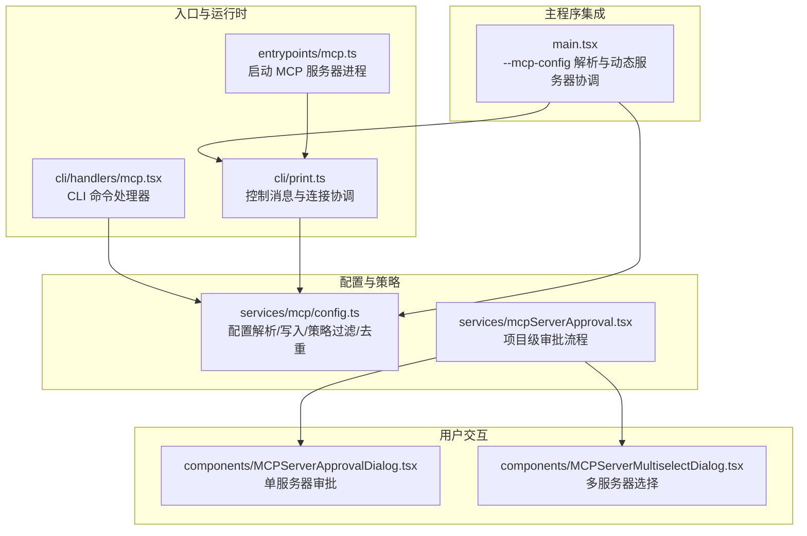
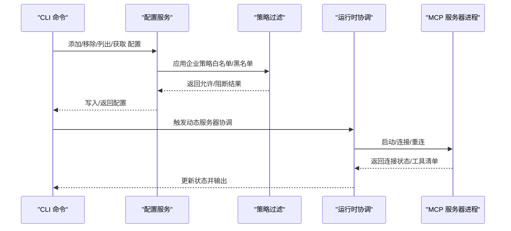
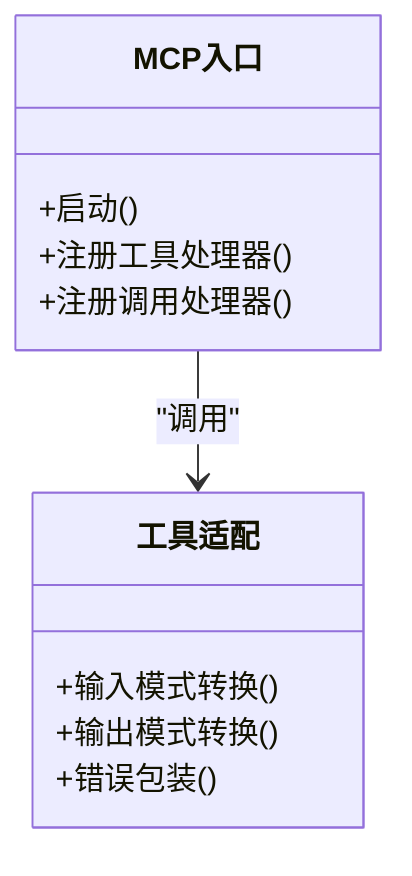
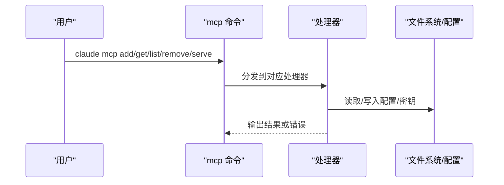
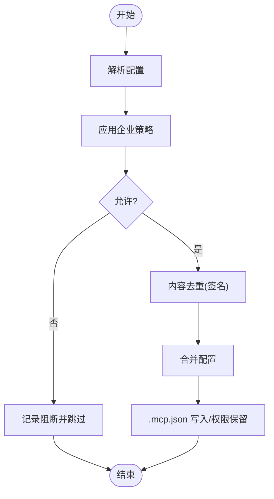
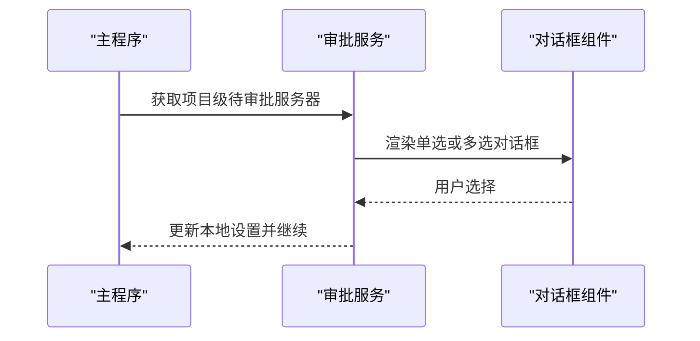
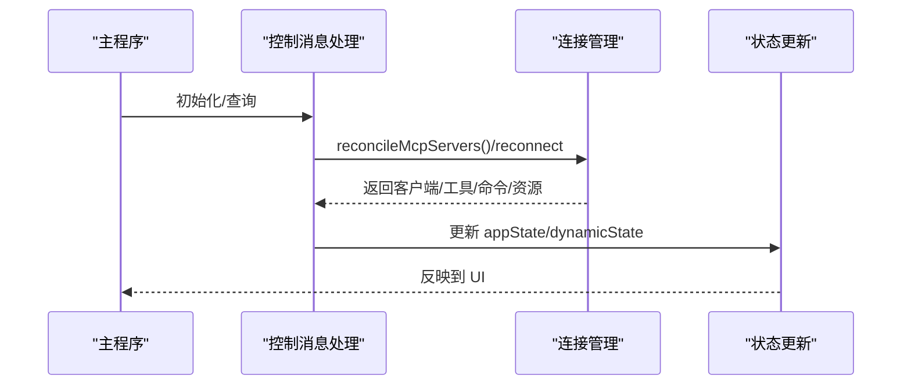
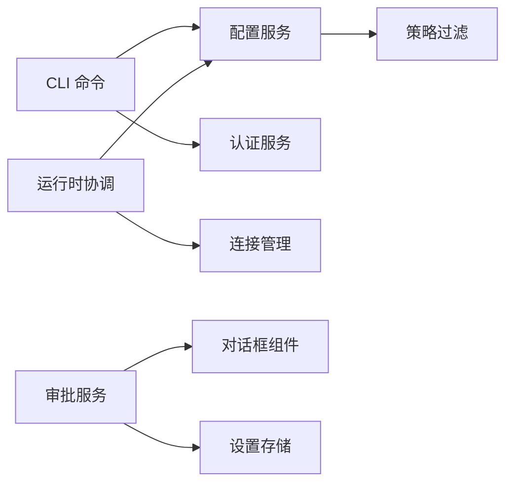

# MCP 服务器管理

<cite>
**本文档引用的文件**
- [src/entrypoints/mcp.ts](file://src/entrypoints/mcp.ts)
- [src/cli/print.ts](file://src/cli/print.ts)
- [src/cli/handlers/mcp.tsx](file://src/cli/handlers/mcp.tsx)
- [src/commands/mcp/mcp.tsx](file://src/commands/mcp/mcp.tsx)
- [src/services/mcp/config.ts](file://src/services/mcp/config.ts)
- [src/services/mcpServerApproval.tsx](file://src/services/mcpServerApproval.tsx)
- [src/components/MCPServerApprovalDialog.tsx](file://src/components/MCPServerApprovalDialog.tsx)
- [src/components/MCPServerMultiselectDialog.tsx](file://src/components/MCPServerMultiselectDialog.tsx)
- [src/main.tsx](file://src/main.tsx)
</cite>

## 目录
1. [简介](#简介)
2. [项目结构](#项目结构)
3. [核心组件](#核心组件)
4. [架构总览](#架构总览)
5. [详细组件分析](#详细组件分析)
6. [依赖关系分析](#依赖关系分析)
7. [性能考虑](#性能考虑)
8. [故障排查指南](#故障排查指南)
9. [结论](#结论)
10. [附录](#附录)

## 简介
本文件面向 Claude Code 的 MCP（Model Context Protocol）服务器管理能力，系统性阐述以下主题：
- MCP 服务器的发现与注册机制：自动发现、手动添加、配置合并与去重策略
- 连接管理：连接状态监控、重连机制、动态服务器协调
- 通道权限控制：企业策略白名单/黑名单、名称/命令/URL 匹配规则
- 配置面板与交互：服务器列表展示、状态显示、操作界面
- 使用示例与配置指南：CLI 命令、桌面导入、项目级配置
- 故障处理与性能监控：健康检查、错误日志、批量连接策略

## 项目结构
围绕 MCP 服务器管理的关键模块分布如下：
- 入口与运行时
  - 服务端入口：启动 MCP 服务器进程，暴露工具清单与调用接口
  - CLI 控制台：提供 add/list/get/remove/reconnect 等命令
- 配置与策略
  - 配置解析、写入、去重、策略过滤
  - 企业策略：允许/拒绝列表，名称/命令/URL 匹配
- 用户交互
  - 项目级 MCP 配置审批对话框（首次发现）
  - 设置面板与重连组件
- 主程序集成
  - 启动阶段解析 --mcp-config，合并动态/SDK/进程型服务器
  - 懒加载与延迟初始化

**图表来源**
- [src/entrypoints/mcp.ts:35-196](file://src/entrypoints/mcp.ts#L35-L196)
- [src/cli/handlers/mcp.tsx:1-362](file://src/cli/handlers/mcp.tsx#L1-L362)
- [src/cli/print.ts:3134-3296](file://src/cli/print.ts#L3134-L3296)
- [src/services/mcp/config.ts:1-800](file://src/services/mcp/config.ts#L1-L800)
- [src/services/mcpServerApproval.tsx:1-41](file://src/services/mcpServerApproval.tsx#L1-L41)
- [src/components/MCPServerApprovalDialog.tsx:1-115](file://src/components/MCPServerApprovalDialog.tsx#L1-L115)
- [src/components/MCPServerMultiselectDialog.tsx:65-111](file://src/components/MCPServerMultiselectDialog.tsx#L65-L111)
- [src/main.tsx:1414-1595](file://src/main.tsx#L1414-L1595)

**章节来源**
- [src/entrypoints/mcp.ts:35-196](file://src/entrypoints/mcp.ts#L35-L196)
- [src/cli/handlers/mcp.tsx:1-362](file://src/cli/handlers/mcp.tsx#L1-L362)
- [src/cli/print.ts:3134-3296](file://src/cli/print.ts#L3134-L3296)
- [src/services/mcp/config.ts:1-800](file://src/services/mcp/config.ts#L1-L800)
- [src/services/mcpServerApproval.tsx:1-41](file://src/services/mcpServerApproval.tsx#L1-L41)
- [src/components/MCPServerApprovalDialog.tsx:1-115](file://src/components/MCPServerApprovalDialog.tsx#L1-L115)
- [src/components/MCPServerMultiselectDialog.tsx:65-111](file://src/components/MCPServerMultiselectDialog.tsx#L65-L111)
- [src/main.tsx:1414-1595](file://src/main.tsx#L1414-L1595)

## 核心组件
- MCP 服务器入口（服务端）
  - 负责创建 MCP Server 实例，注册 ListTools/Calls 工具请求处理器，将本地工具暴露给 MCP 客户端
  - 提供 STDIO 传输以与父进程通信
- CLI 命令处理器
  - 提供 add/remove/list/get/reconnect 等命令，支持从 JSON、桌面配置导入，并进行健康检查
- 配置与策略服务
  - 解析/写入 .mcp.json；合并用户/项目/全局配置；执行企业策略白名单/黑名单过滤；命令/URL 去重
- 审批与交互
  - 首次发现项目级 MCP 服务器时弹出审批对话框，支持“仅本次”“全部未来”“不使用”
- 动态服务器协调
  - 在启动阶段解析 --mcp-config，合并 SDK/进程型服务器，支持动态增删改

**章节来源**
- [src/entrypoints/mcp.ts:35-196](file://src/entrypoints/mcp.ts#L35-L196)
- [src/cli/handlers/mcp.tsx:1-362](file://src/cli/handlers/mcp.tsx#L1-L362)
- [src/services/mcp/config.ts:1-800](file://src/services/mcp/config.ts#L1-L800)
- [src/services/mcpServerApproval.tsx:1-41](file://src/services/mcpServerApproval.tsx#L1-L41)
- [src/components/MCPServerApprovalDialog.tsx:1-115](file://src/components/MCPServerApprovalDialog.tsx#L1-L115)
- [src/main.tsx:1414-1595](file://src/main.tsx#L1414-L1595)

## 架构总览
MCP 服务器管理由“配置层—策略层—运行时层—交互层”构成，贯穿 CLI、主程序与服务端。

**图表来源**
- [src/cli/handlers/mcp.tsx:144-190](file://src/cli/handlers/mcp.tsx#L144-L190)
- [src/services/mcp/config.ts:536-551](file://src/services/mcp/config.ts#L536-L551)
- [src/cli/print.ts:3134-3296](file://src/cli/print.ts#L3134-L3296)
- [src/entrypoints/mcp.ts:35-196](file://src/entrypoints/mcp.ts#L35-L196)

**章节来源**
- [src/cli/handlers/mcp.tsx:144-190](file://src/cli/handlers/mcp.tsx#L144-L190)
- [src/services/mcp/config.ts:536-551](file://src/services/mcp/config.ts#L536-L551)
- [src/cli/print.ts:3134-3296](file://src/cli/print.ts#L3134-L3296)
- [src/entrypoints/mcp.ts:35-196](file://src/entrypoints/mcp.ts#L35-L196)

## 详细组件分析

### 组件 A：MCP 服务器入口（服务端）
- 职责
  - 创建 MCP Server，声明工具能力
  - 注册 ListTools/Calls 请求处理器，将本地工具转换为 MCP 工具
  - 通过 STDIO 传输与父进程交互
- 关键点
  - 工具输入/输出模式转换（Zod Schema → MCP Schema）
  - 错误捕获与标准化输出
  - 缓存与工作目录设置

**图表来源**
- [src/entrypoints/mcp.ts:35-196](file://src/entrypoints/mcp.ts#L35-L196)

**章节来源**
- [src/entrypoints/mcp.ts:35-196](file://src/entrypoints/mcp.ts#L35-L196)

### 组件 B：CLI 命令处理器
- 职责
  - add：从 JSON 或桌面导入添加服务器，支持客户端密钥保存
  - remove：按作用域删除，清理安全存储
  - list：并发健康检查并输出状态
  - get：输出服务器详情与健康状态
  - serve：启动 MCP 服务器进程
- 关键点
  - 并发连接批次大小控制
  - 健康检查封装
  - 优雅退出以清理子进程

**图表来源**
- [src/cli/handlers/mcp.tsx:1-362](file://src/cli/handlers/mcp.tsx#L1-L362)

**章节来源**
- [src/cli/handlers/mcp.tsx:1-362](file://src/cli/handlers/mcp.tsx#L1-L362)

### 组件 C：配置与策略服务
- 职责
  - 解析/写入 .mcp.json，保留文件权限
  - 合并用户/项目/本地配置，去重插件与 claude.ai 连接器
  - 企业策略：名称/命令/URL 三类匹配，白名单优先于黑名单
  - 签名计算用于内容去重（stdio 命令数组、URL 解包代理路径）
- 关键点
  - 策略过滤函数 filterMcpServersByPolicy
  - 命令/URL 模式匹配（通配符）
  - 环境变量展开

**图表来源**
- [src/services/mcp/config.ts:536-551](file://src/services/mcp/config.ts#L536-L551)
- [src/services/mcp/config.ts:196-212](file://src/services/mcp/config.ts#L196-L212)
- [src/services/mcp/config.ts:223-310](file://src/services/mcp/config.ts#L223-L310)

**章节来源**
- [src/services/mcp/config.ts:196-212](file://src/services/mcp/config.ts#L196-L212)
- [src/services/mcp/config.ts:223-310](file://src/services/mcp/config.ts#L223-L310)
- [src/services/mcp/config.ts:536-551](file://src/services/mcp/config.ts#L536-L551)

### 组件 D：项目级服务器审批与交互
- 职责
  - 首次发现项目级 MCP 服务器时弹出审批对话框
  - 支持“仅本次”“全部未来”“不使用”三种选择
  - 多服务器场景弹出多选对话框
- 关键点
  - 通过 Ink 渲染对话框，复用主程序根实例
  - 记录用户选择到本地设置

**图表来源**
- [src/services/mcpServerApproval.tsx:15-40](file://src/services/mcpServerApproval.tsx#L15-L40)
- [src/components/MCPServerApprovalDialog.tsx:1-115](file://src/components/MCPServerApprovalDialog.tsx#L1-L115)
- [src/components/MCPServerMultiselectDialog.tsx:65-111](file://src/components/MCPServerMultiselectDialog.tsx#L65-L111)

**章节来源**
- [src/services/mcpServerApproval.tsx:15-40](file://src/services/mcpServerApproval.tsx#L15-L40)
- [src/components/MCPServerApprovalDialog.tsx:1-115](file://src/components/MCPServerApprovalDialog.tsx#L1-L115)
- [src/components/MCPServerMultiselectDialog.tsx:65-111](file://src/components/MCPServerMultiselectDialog.tsx#L65-L111)

### 组件 E：动态服务器协调与重连
- 职责
  - 启动阶段解析 --mcp-config，合并 SDK/进程型服务器
  - 支持动态增删改：新增标记为 pending，等待下次查询更新为 connected
  - 重连逻辑：根据 serverName 查找配置，重建连接并更新状态
- 关键点
  - 多源客户端聚合（mcp/sdk/dynamic/appState）
  - 连接成功后注册回调与资源缓存
  - 失败时返回错误信息

**图表来源**
- [src/cli/print.ts:3134-3296](file://src/cli/print.ts#L3134-L3296)
- [src/cli/print.ts:5450-5444](file://src/cli/print.ts#L5450-L5444)

**章节来源**
- [src/cli/print.ts:3134-3296](file://src/cli/print.ts#L3134-L3296)
- [src/cli/print.ts:5450-5444](file://src/cli/print.ts#L5450-L5444)

## 依赖关系分析
- 模块耦合
  - CLI 依赖配置服务与认证服务，间接依赖策略过滤
  - 运行时协调依赖配置服务与连接管理
  - 审批服务依赖 UI 组件与设置存储
- 外部依赖
  - @modelcontextprotocol/sdk 用于服务端传输与协议
  - Ink 用于 CLI 对话框渲染
  - Lodash-es 用于去重与映射
- 循环依赖
  - 未见直接循环依赖；交互通过服务层中转

**图表来源**
- [src/cli/handlers/mcp.tsx:1-362](file://src/cli/handlers/mcp.tsx#L1-L362)
- [src/services/mcp/config.ts:536-551](file://src/services/mcp/config.ts#L536-L551)
- [src/services/mcpServerApproval.tsx:1-41](file://src/services/mcpServerApproval.tsx#L1-L41)

**章节来源**
- [src/cli/handlers/mcp.tsx:1-362](file://src/cli/handlers/mcp.tsx#L1-L362)
- [src/services/mcp/config.ts:536-551](file://src/services/mcp/config.ts#L536-L551)
- [src/services/mcpServerApproval.tsx:1-41](file://src/services/mcpServerApproval.tsx#L1-L41)

## 性能考虑
- 并发健康检查
  - CLI list 使用 p-map 并发连接，batch size 可配置，避免阻塞
- 连接缓存与懒加载
  - MCP 服务器入口使用 LRU 缓存限制文件状态读取内存占用
- 批量写入
  - .mcp.json 采用临时文件 + 原子 rename，保证一致性并减少碎片
- 去重策略
  - 基于签名的内容去重，避免重复连接与资源浪费

**章节来源**
- [src/cli/handlers/mcp.tsx:156-164](file://src/cli/handlers/mcp.tsx#L156-L164)
- [src/entrypoints/mcp.ts:40-46](file://src/entrypoints/mcp.ts#L40-L46)
- [src/services/mcp/config.ts:88-131](file://src/services/mcp/config.ts#L88-L131)

## 故障排查指南
- 常见问题
  - 服务器不存在：检查 serverName 是否正确，确认配置作用域
  - 连接失败：查看健康检查输出，确认网络/鉴权/URL 正确
  - 企业策略阻断：检查 allowedMcpServers/deniedMcpServers 设置
  - 权限不足：确保 .mcp.json 权限正确，必要时使用 sudo
- 排查步骤
  - 使用 claude mcp get <name> 查看详细配置与状态
  - 使用 claude mcp list 并发检查所有服务器健康状况
  - 使用 claude mcp remove <name> -s <scope> 清理无效配置
  - 使用 claude mcp reconnect <name> 触发重连
- 日志与诊断
  - CLI 命令在异常时输出错误信息
  - 服务端入口捕获工具调用错误并标准化输出
  - 主程序在动态服务器协调时记录变更与错误

**章节来源**
- [src/cli/handlers/mcp.tsx:192-283](file://src/cli/handlers/mcp.tsx#L192-L283)
- [src/cli/handlers/mcp.tsx:144-190](file://src/cli/handlers/mcp.tsx#L144-L190)
- [src/entrypoints/mcp.ts:170-186](file://src/entrypoints/mcp.ts#L170-L186)
- [src/cli/print.ts:3290-3295](file://src/cli/print.ts#L3290-L3295)

## 结论
本方案通过清晰的分层设计实现了 MCP 服务器的全生命周期管理：从自动发现与手动添加，到策略过滤与去重，再到连接管理与重连，以及用户交互与配置面板。CLI 与主程序协同，既满足开发者灵活配置的需求，又通过企业策略保障安全可控。建议在生产环境中结合健康检查与重连策略，配合日志与告警，持续优化连接稳定性与性能。

## 附录

### 使用示例与配置指南
- 添加服务器
  - 从 JSON 添加：claude mcp add-json "<name>" '<JSON>' [-s scope] [--client-secret]
  - 从桌面导入：claude mcp add-from-claude-desktop [-s scope]
- 列表与详情
  - 列表：claude mcp list
  - 详情：claude mcp get "<name>"
- 移除与重连
  - 移除：claude mcp remove "<name>" [-s scope]
  - 重连：claude mcp reconnect "<name>"
- 项目级审批
  - 首次发现项目级服务器时，按提示选择“仅本次/全部未来/不使用”

**章节来源**
- [src/cli/handlers/mcp.tsx:285-314](file://src/cli/handlers/mcp.tsx#L285-L314)
- [src/cli/handlers/mcp.tsx:316-349](file://src/cli/handlers/mcp.tsx#L316-L349)
- [src/cli/handlers/mcp.tsx:144-190](file://src/cli/handlers/mcp.tsx#L144-L190)
- [src/cli/handlers/mcp.tsx:192-283](file://src/cli/handlers/mcp.tsx#L192-L283)
- [src/services/mcpServerApproval.tsx:15-40](file://src/services/mcpServerApproval.tsx#L15-L40)