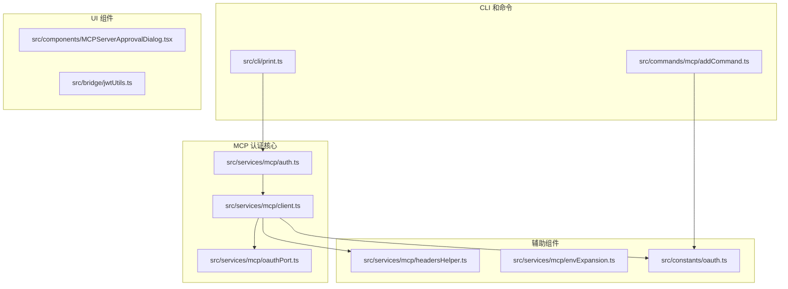
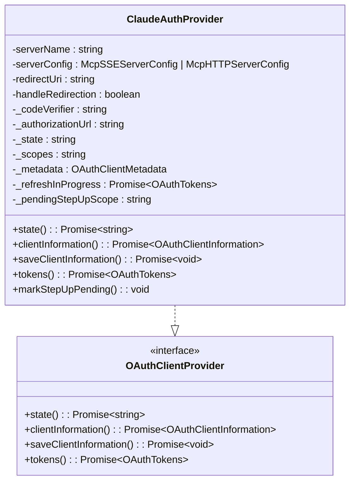
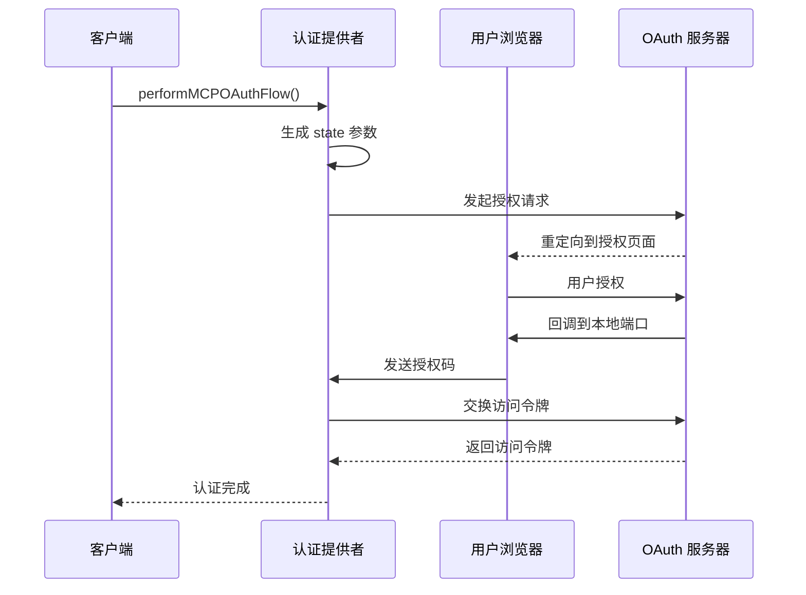
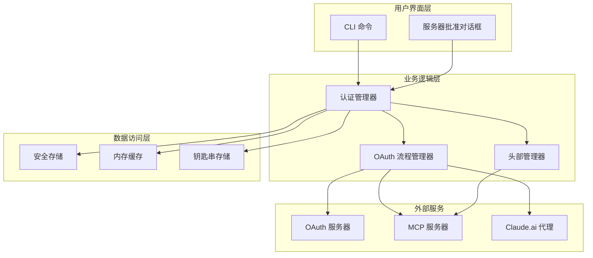
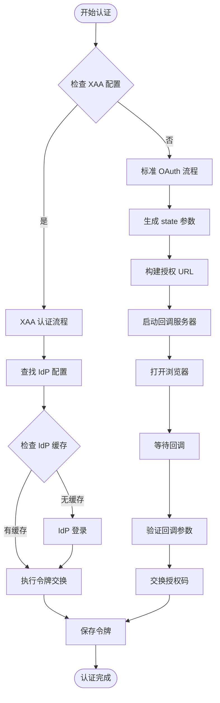
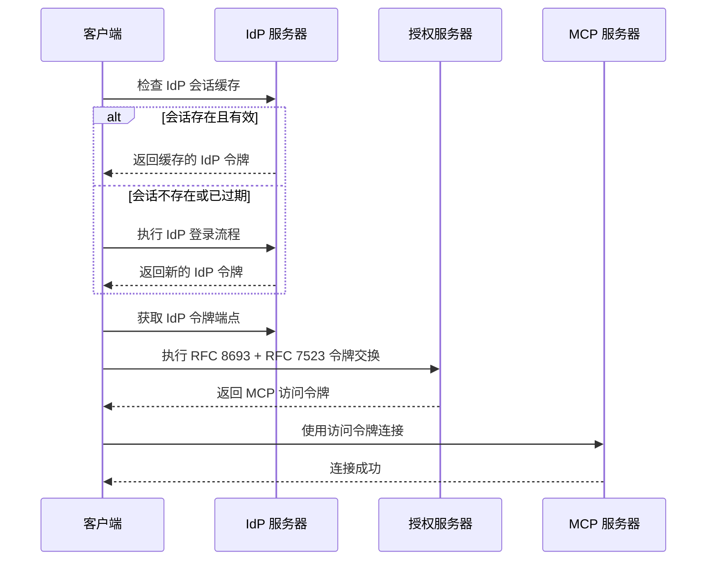
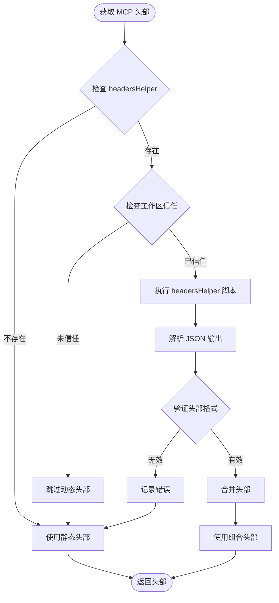
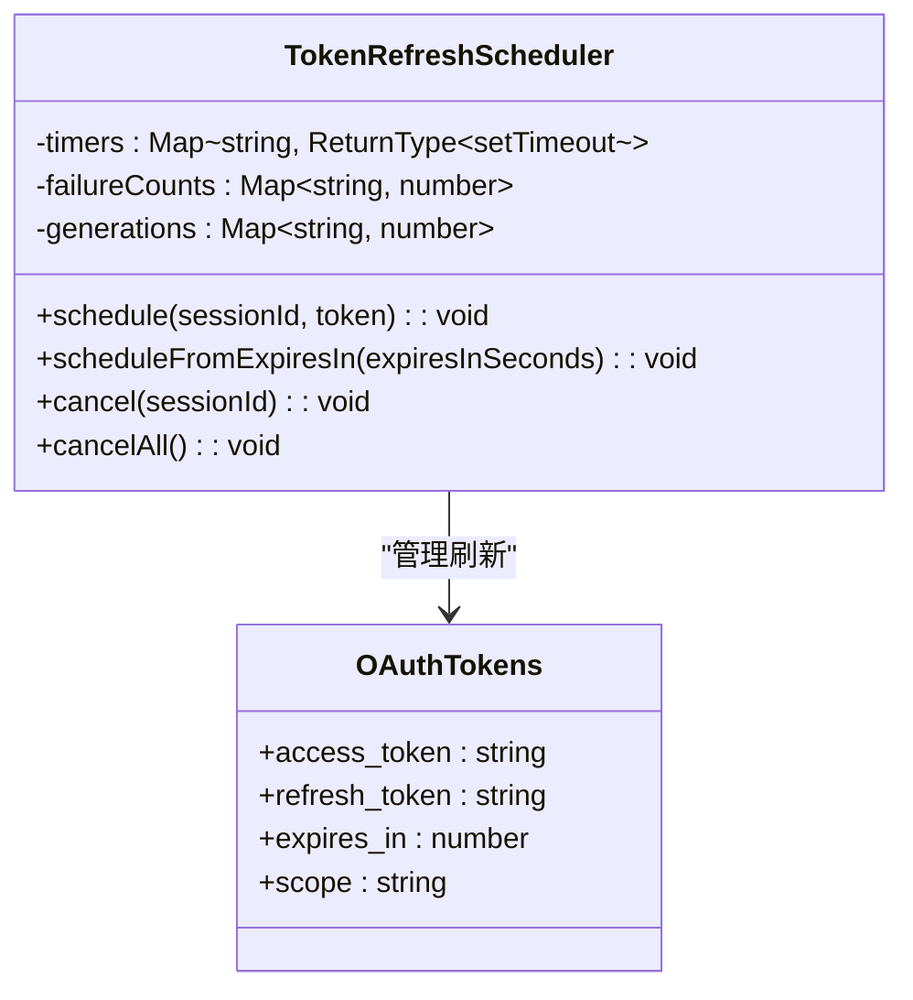
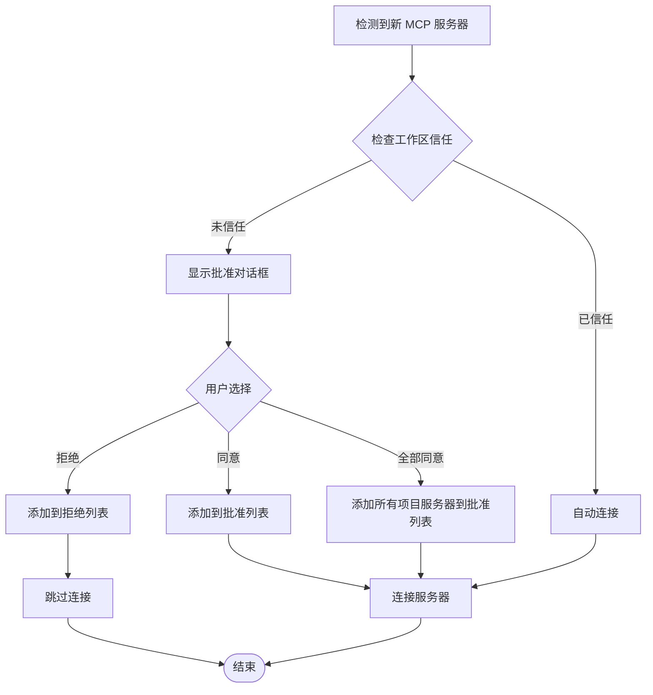

# MCP 认证系统

<cite>
**本文档引用的文件**
- [auth.ts](file://src/services/mcp/auth.ts)
- [client.ts](file://src/services/mcp/client.ts)
- [oauth.ts](file://src/services/mcp/oauthPort.ts)
- [headersHelper.ts](file://src/services/mcp/headersHelper.ts)
- [envExpansion.ts](file://src/services/mcp/envExpansion.ts)
- [oauth.ts](file://src/constants/oauth.ts)
- [auth.ts](file://src/utils/auth.ts)
- [print.ts](file://src/cli/print.ts)
- [addCommand.ts](file://src/commands/mcp/addCommand.ts)
- [MCPServerApprovalDialog.tsx](file://src/components/MCPServerApprovalDialog.tsx)
- [jwtUtils.ts](file://src/bridge/jwtUtils.ts)
</cite>

## 目录
1. [简介](#简介)
2. [项目结构](#项目结构)
3. [核心组件](#核心组件)
4. [架构概览](#架构概览)
5. [详细组件分析](#详细组件分析)
6. [依赖关系分析](#依赖关系分析)
7. [性能考虑](#性能考虑)
8. [故障排除指南](#故障排除指南)
9. [结论](#结论)

## 简介

Claude Code 的 MCP（Model Context Protocol）认证系统是一个完整的 OAuth 2.0 和 OpenID Connect 集成解决方案，专为 MCP 服务器提供安全的身份验证和授权机制。该系统支持多种认证方式，包括标准 OAuth 2.0 授权码流程、跨应用访问（XAA）和 Claude.ai 代理认证。

系统的核心特性包括：
- 支持多种 MCP 传输协议（HTTP、SSE、WebSocket）
- 动态环境变量扩展和头部管理
- 安全的令牌存储和刷新机制
- 项目级服务器信任管理
- 统一的认证错误处理和重试逻辑

## 项目结构

MCP 认证系统主要分布在以下目录中：



**图表来源**
- [auth.ts:1-200](file://src/services/mcp/auth.ts#L1-L200)
- [client.ts:1-200](file://src/services/mcp/client.ts#L1-L200)
- [oauth.ts:1-80](file://src/services/mcp/oauthPort.ts#L1-L80)

**章节来源**
- [auth.ts:1-200](file://src/services/mcp/auth.ts#L1-L200)
- [client.ts:1-200](file://src/services/mcp/client.ts#L1-L200)

## 核心组件

### 认证提供者 (ClaudeAuthProvider)

ClaudeAuthProvider 是 MCP 认证系统的核心类，实现了 OAuthClientProvider 接口，负责处理所有 OAuth 相关的操作。



**图表来源**
- [auth.ts:1376-1599](file://src/services/mcp/auth.ts#L1376-L1599)

### OAuth 流程管理器

OAuth 流程管理器负责协调整个认证流程，包括授权请求、回调处理和令牌交换。



**图表来源**
- [auth.ts:847-1342](file://src/services/mcp/auth.ts#L847-L1342)

**章节来源**
- [auth.ts:1376-1599](file://src/services/mcp/auth.ts#L1376-L1599)
- [auth.ts:847-1342](file://src/services/mcp/auth.ts#L847-L1342)

## 架构概览

MCP 认证系统采用分层架构设计，确保了模块间的清晰分离和高内聚低耦合。



**图表来源**
- [client.ts:1-200](file://src/services/mcp/client.ts#L1-L200)
- [auth.ts:1-200](file://src/services/mcp/auth.ts#L1-L200)

## 详细组件分析

### OAuth 认证流程

OAuth 认证流程是 MCP 系统的核心，支持多种认证场景和错误处理机制。

#### 授权码流程

标准的 OAuth 2.0 授权码流程通过 ClaudeAuthProvider 实现：



**图表来源**
- [auth.ts:847-1342](file://src/services/mcp/auth.ts#L847-L1342)

#### 跨应用访问 (XAA) 流程

XAA 提供了一种更高效的认证方式，允许在多个 MCP 服务器间共享单个 IdP 会话。



**图表来源**
- [auth.ts:664-845](file://src/services/mcp/auth.ts#L664-L845)

**章节来源**
- [auth.ts:847-1342](file://src/services/mcp/auth.ts#L847-L1342)
- [auth.ts:664-845](file://src/services/mcp/auth.ts#L664-L845)

### HTTP 头部处理机制

MCP 系统提供了灵活的 HTTP 头部处理机制，支持静态头部和动态头部的组合。

#### 头部获取流程



**图表来源**
- [headersHelper.ts:32-117](file://src/services/mcp/headersHelper.ts#L32-L117)

#### 环境变量扩展功能

系统支持在 MCP 配置中使用环境变量扩展语法：

| 语法 | 描述 | 示例 |
|------|------|------|
| `${VAR}` | 基本环境变量替换 | `${API_KEY}` |
| `${VAR:-default}` | 带默认值的环境变量 | `${DEBUG:-false}` |
| `${VAR:-${DEFAULT_VAR}}` | 嵌套变量替换 | `${PORT:-${DEFAULT_PORT}}` |

**章节来源**
- [headersHelper.ts:32-117](file://src/services/mcp/headersHelper.ts#L32-L117)
- [envExpansion.ts:10-38](file://src/services/mcp/envExpansion.ts#L10-L38)

### 令牌管理和刷新

MCP 系统实现了智能的令牌管理机制，确保认证令牌的安全性和有效性。

#### 令牌刷新调度器



**图表来源**
- [jwtUtils.ts:71-105](file://src/bridge/jwtUtils.ts#L71-L105)

#### 令牌撤销机制

系统支持安全的令牌撤销，确保用户注销时所有令牌都被正确清理。

**章节来源**
- [jwtUtils.ts:71-105](file://src/bridge/jwtUtils.ts#L71-L105)

### 服务器批准和信任管理

MCP 系统实现了严格的服务器信任管理机制，确保只有经过用户批准的服务器才能被连接。

#### 服务器批准流程



**图表来源**
- [MCPServerApprovalDialog.tsx:12-115](file://src/components/MCPServerApprovalDialog.tsx#L12-L115)

**章节来源**
- [MCPServerApprovalDialog.tsx:12-115](file://src/components/MCPServerApprovalDialog.tsx#L12-L115)

## 依赖关系分析

MCP 认证系统具有清晰的依赖层次结构，确保了模块间的松耦合。

```mermaid
graph TB
subgraph "外部依赖"
SDK[@modelcontextprotocol/sdk]
Axios[axios]
Crypto[crypto]
FS[fs/promises]
URL[url]
end
subgraph "内部模块"
Auth[auth.ts]
Client[client.ts]
OAuthPort[oauthPort.ts]
Headers[headersHelper.ts]
Env[envExpansion.ts]
Constants[constants/oauth.ts]
UtilsAuth[utils/auth.ts]
end
subgraph "UI 组件"
Print[cli/print.ts]
AddCmd[commands/mcp/addCommand.ts]
Dialog[MCPServerApprovalDialog.tsx]
end
Auth --> SDK
Auth --> Axios
Auth --> Crypto
Client --> Auth
Client --> OAuthPort
Client --> Headers
Client --> Constants
Client --> UtilsAuth
Print --> Auth
AddCmd --> Constants
Dialog --> Client
```

**图表来源**
- [auth.ts:1-50](file://src/services/mcp/auth.ts#L1-L50)
- [client.ts:1-100](file://src/services/mcp/client.ts#L1-L100)

**章节来源**
- [auth.ts:1-50](file://src/services/mcp/auth.ts#L1-L50)
- [client.ts:1-100](file://src/services/mcp/client.ts#L1-L100)

## 性能考虑

MCP 认证系统在设计时充分考虑了性能优化，采用了多种策略来提升用户体验。

### 缓存策略

系统实现了多层次的缓存机制：

1. **令牌缓存**：使用内存缓存存储 OAuth 令牌，减少频繁的磁盘访问
2. **认证状态缓存**：缓存认证失败状态，避免重复尝试
3. **头部缓存**：缓存动态头部结果，减少脚本执行开销
4. **连接缓存**：缓存成功的服务器连接，支持快速重连

### 并发控制

系统通过以下机制控制并发访问：

- 使用 `AbortController` 管理异步操作的生命周期
- 实现请求去重机制，避免重复的认证请求
- 采用信号量模式限制同时进行的认证操作数量

### 内存管理

- 及时清理事件监听器和定时器
- 使用弱引用避免内存泄漏
- 实现优雅的资源释放机制

## 故障排除指南

### 常见认证问题

#### OAuth 回调端口问题

**症状**：认证流程卡在 "等待回调" 状态

**解决方案**：
1. 检查端口是否被其他进程占用
2. 手动指定回调端口：`MCP_OAUTH_CALLBACK_PORT=3118`
3. 确保防火墙允许本地端口通信

#### 令牌过期问题

**症状**：MCP 请求返回 401 未授权错误

**解决方案**：
1. 检查系统时间是否正确同步
2. 清除过期令牌并重新认证
3. 验证 OAuth 作用域是否正确

#### 服务器信任问题

**症状**：无法连接项目级 MCP 服务器

**解决方案**：
1. 通过对话框批准服务器连接
2. 检查工作区信任状态
3. 验证服务器配置的有效性

### 调试技巧

#### 启用详细日志

设置以下环境变量获取详细的调试信息：
- `DEBUG=MCP:*` - 启用 MCP 相关的所有调试输出
- `DEBUG=oauth:*` - 启用 OAuth 相关的调试输出
- `DEBUG=headers:*` - 启用头部处理的调试输出

#### 分析认证流程

使用以下方法获取认证过程的详细信息：
1. 检查 `~/.claude/mcp-needs-auth-cache.json` 文件
2. 查看安全存储中的认证数据
3. 监控网络请求和响应

**章节来源**
- [auth.ts:1000-1342](file://src/services/mcp/auth.ts#L1000-L1342)
- [client.ts:257-316](file://src/services/mcp/client.ts#L257-L316)

## 结论

Claude Code 的 MCP 认证系统是一个设计精良、功能完整的身份验证解决方案。它通过以下关键特性确保了系统的安全性、可靠性和易用性：

### 安全性保障

- 多层认证机制，支持 OAuth 2.0、OpenID Connect 和 XAA
- 严格的服务器信任管理，防止恶意服务器连接
- 安全的令牌存储和传输机制
- 完善的错误处理和攻击防护

### 可靠性保证

- 智能的令牌刷新和撤销机制
- 容错的连接管理和重连策略
- 全面的错误监控和诊断工具
- 优雅的降级和恢复机制

### 开发体验优化

- 灵活的配置选项和环境适配
- 清晰的 API 设计和文档
- 丰富的调试工具和日志支持
- 易于扩展和定制的架构

该系统为 Claude Code 的 MCP 功能提供了坚实的基础，确保了用户能够安全、可靠地连接和使用各种 MCP 服务器。