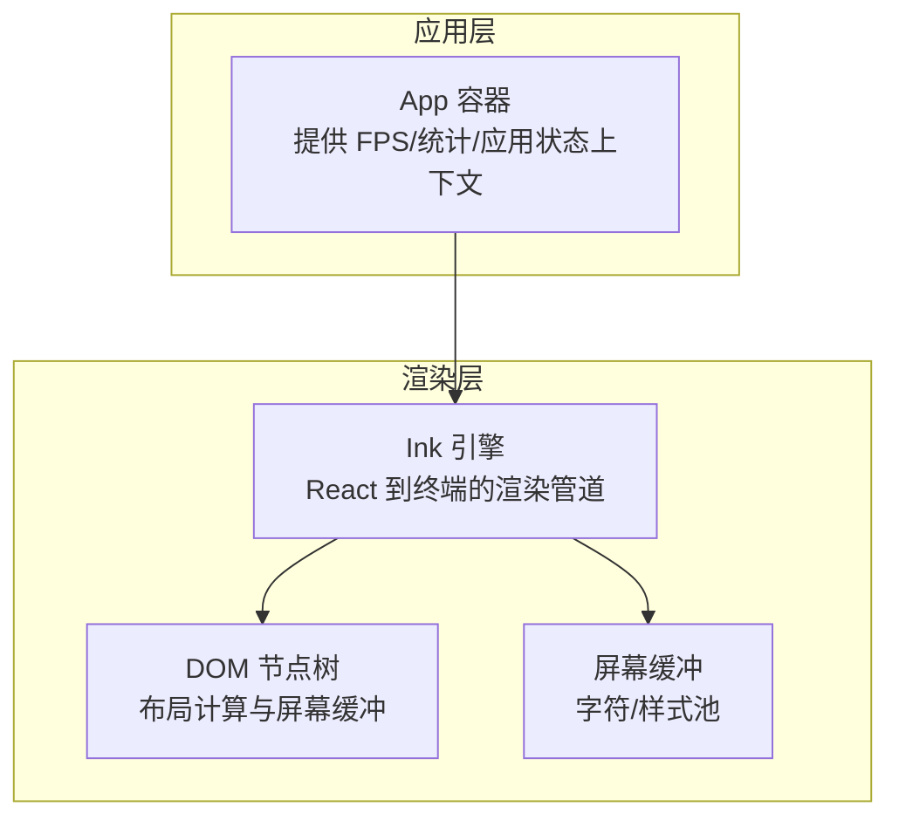
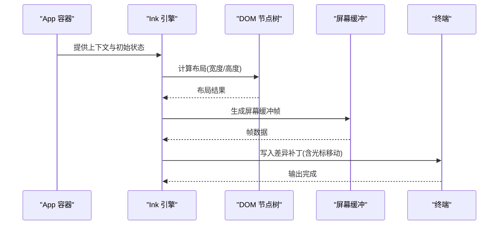
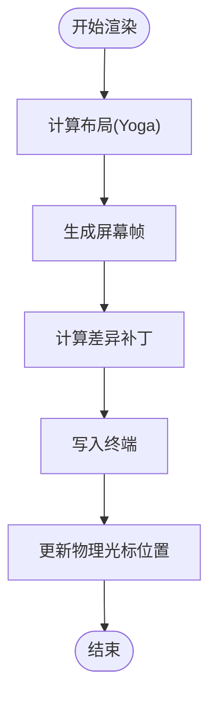
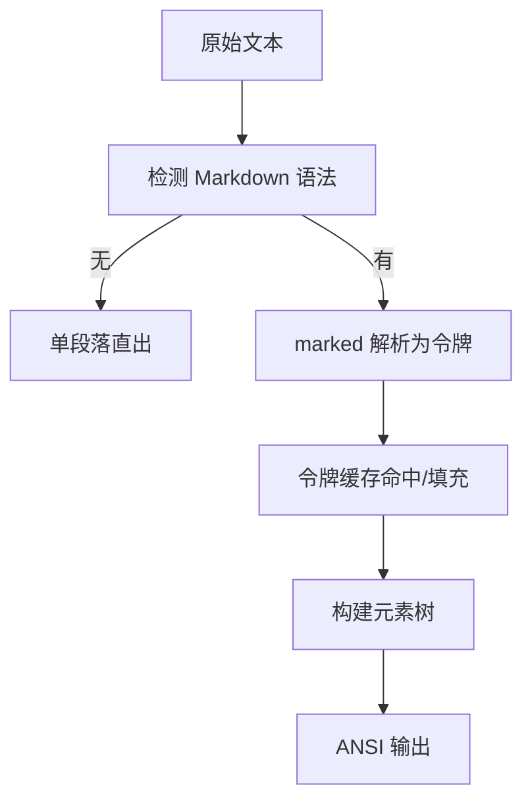
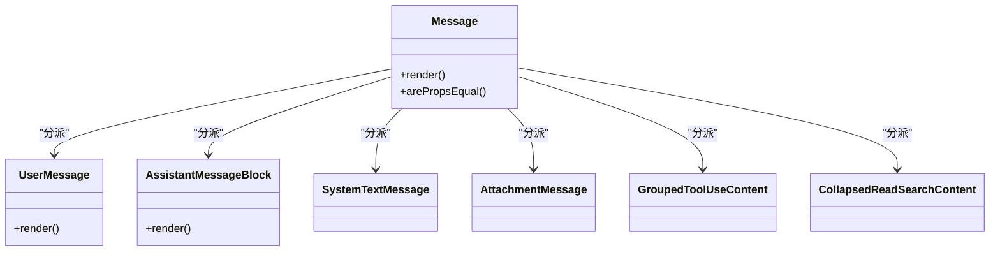
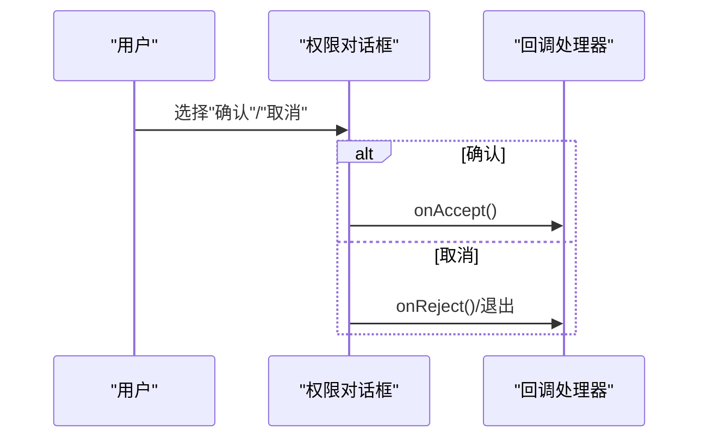
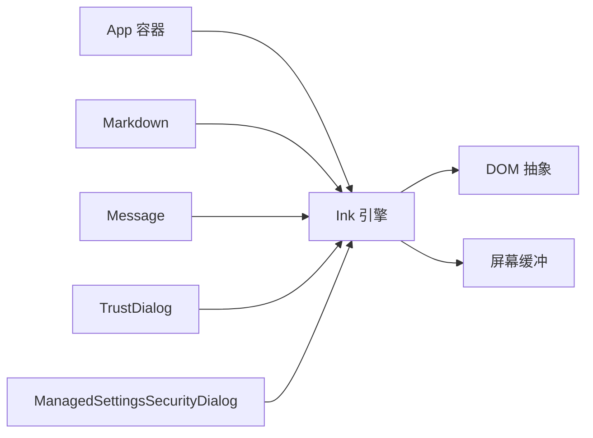

# UI 组件系统

<cite>
**本文档引用的文件**
- [App.tsx](file://src/components/App.tsx)
- [ink.tsx](file://src/ink/ink.tsx)
- [Markdown.tsx](file://src/components/Markdown.tsx)
- [Message.tsx](file://src/components/Message.tsx)
- [TrustDialog.tsx](file://src/components/TrustDialog/TrustDialog.tsx)
- [ManagedSettingsSecurityDialog.tsx](file://src/components/ManagedSettingsSecurityDialog/ManagedSettingsSecurityDialog.tsx)
</cite>

## 目录
1. [简介](#简介)
2. [项目结构](#项目结构)
3. [核心组件](#核心组件)
4. [架构总览](#架构总览)
5. [详细组件分析](#详细组件分析)
6. [依赖关系分析](#依赖关系分析)
7. [性能考虑](#性能考虑)
8. [故障排除指南](#故障排除指南)
9. [结论](#结论)

## 简介
本文件面向 Claude Code 的 UI 组件系统，重点解析基于 React/Ink 的终端交互界面架构。内容涵盖组件层次结构、状态管理、事件处理、消息渲染、权限对话框、主题样式与可访问性等。目标是帮助开发者快速理解并高效扩展该 UI 系统。

## 项目结构
UI 组件系统由两层构成：
- 应用层：顶层容器与上下文提供者，负责全局状态注入（FPS 指标、统计信息、应用状态）。
- 渲染层：基于 Ink 的终端渲染引擎，负责将 React 树转换为 ANSI 屏幕缓冲并输出到终端。

**图表来源**
- [App.tsx:19-55](file://src/components/App.tsx#L19-L55)
- [ink.tsx:180-279](file://src/ink/ink.tsx#L180-L279)

**章节来源**
- [App.tsx:1-56](file://src/components/App.tsx#L1-L56)
- [ink.tsx:1-800](file://src/ink/ink.tsx#L1-L800)

## 核心组件
- App 容器：为整个会话树提供 FPS 指标、统计信息与应用状态上下文，确保渲染与交互组件可直接消费这些数据。
- Ink 引擎：负责 React 树的布局计算、屏幕缓冲生成、差异写入与光标管理，支持 Alt 屏幕模式、选择高亮、搜索高亮等终端特性。
- Markdown 渲染：对消息内容进行语法解析与 ANSI 输出，支持缓存以提升滚动性能，并在流式渲染时仅重算增量部分。
- Message 组件：根据消息类型分派到具体的消息块渲染器，支持用户文本/图片、助手思考/工具调用、系统消息、附件等。
- 权限对话框：信任工作区对话框与受管设置安全对话框，统一采用选择器与键盘绑定，提供清晰的确认/取消路径与可访问提示。

**章节来源**
- [App.tsx:19-55](file://src/components/App.tsx#L19-L55)
- [ink.tsx:420-790](file://src/ink/ink.tsx#L420-L790)
- [Markdown.tsx:78-171](file://src/components/Markdown.tsx#L78-L171)
- [Message.tsx:58-355](file://src/components/Message.tsx#L58-L355)
- [TrustDialog.tsx:23-265](file://src/components/TrustDialog/TrustDialog.tsx#L23-L265)
- [ManagedSettingsSecurityDialog.tsx:15-145](file://src/components/ManagedSettingsSecurityDialog/ManagedSettingsSecurityDialog.tsx#L15-L145)

## 架构总览
下图展示了从应用启动到终端输出的关键流程：应用容器注入上下文 → Ink 引擎调度渲染 → 布局计算与屏幕缓冲 → 差异化写入终端。

**图表来源**
- [App.tsx:19-55](file://src/components/App.tsx#L19-L55)
- [ink.tsx:420-790](file://src/ink/ink.tsx#L420-L790)

## 详细组件分析

### App 容器与上下文
- 功能：为子树提供 FPS 指标、统计存储与应用状态，避免重复渲染与状态分散。
- 关键点：使用 React 编译器运行时优化，按需重建子树，减少不必要的包裹 Box。

**章节来源**
- [App.tsx:19-55](file://src/components/App.tsx#L19-L55)

### Ink 渲染引擎
- 布局与调度：在提交阶段计算 Yoga 布局，支持并发根节点与节流渲染，避免阻塞主线程。
- 屏幕缓冲：维护前后帧缓冲，通过差异算法最小化输出；支持全屏损坏回退与选择/高亮覆盖。
- 光标与 Alt 屏幕：在 Alt 屏幕锚定物理光标位置，保证 iTerm2 等终端的光标跟随体验；支持鼠标跟踪与恢复。
- 事件与输入：键盘事件、焦点管理、选择与搜索高亮、滚动与自动跟随。

**图表来源**
- [ink.tsx:236-279](file://src/ink/ink.tsx#L236-L279)
- [ink.tsx:420-790](file://src/ink/ink.tsx#L420-L790)

**章节来源**
- [ink.tsx:180-279](file://src/ink/ink.tsx#L180-L279)
- [ink.tsx:420-790](file://src/ink/ink.tsx#L420-L790)

### Markdown 渲染组件
- 解析与缓存：使用模块级令牌缓存，避免重复解析；对纯文本路径进行短路优化。
- 流式渲染：在流式增量中仅重算最后一个非空块，其余前缀复用已解析结果。
- 输出策略：表格使用 Flex 布局组件，其他内容转为 ANSI 字符串，支持主题与语法高亮。

**图表来源**
- [Markdown.tsx:37-71](file://src/components/Markdown.tsx#L37-L71)
- [Markdown.tsx:123-171](file://src/components/Markdown.tsx#L123-L171)

**章节来源**
- [Markdown.tsx:78-171](file://src/components/Markdown.tsx#L78-L171)
- [Markdown.tsx:186-235](file://src/components/Markdown.tsx#L186-L235)

### Message 消息渲染
- 分派逻辑：根据消息类型与子类型分派到具体渲染器（用户文本/图片/工具结果、助手文本/思考/工具调用、系统消息、附件、折叠组等）。
- 性能优化：使用 memo 包装与浅比较，仅在必要属性变化时重渲染；对思考内容的可见性变更进行细粒度控制。
- 交互支持：在用户最新 Bash 输出消息上启用展开上下文，支持终端尺寸感知与宽度计算。

**图表来源**
- [Message.tsx:58-355](file://src/components/Message.tsx#L58-L355)

**章节来源**
- [Message.tsx:58-355](file://src/components/Message.tsx#L58-L355)

### 权限对话框组件
- TrustDialog（信任工作区）
  - 功能：在进入可能执行 Bash 或访问敏感资源的工作区前，弹出确认对话框，记录分析事件，支持 Ctrl+C 退出与 ESC 取消。
  - 数据源：聚合 MCP 服务器、钩子、API Key Helper、AWS/GCP 命令、危险环境变量与 Bash 执行来源。
  - 行为：根据是否位于家目录决定持久化策略；支持快捷键绑定与可访问提示。
- ManagedSettingsSecurityDialog（受管设置安全）
  - 功能：当存在潜在高危受管设置时，列出需要批准的配置项，要求用户确认或退出。
  - 行为：提取危险设置并格式化列表，提供确认/取消路径与可访问提示。

**图表来源**
- [TrustDialog.tsx:23-265](file://src/components/TrustDialog/TrustDialog.tsx#L23-L265)
- [ManagedSettingsSecurityDialog.tsx:15-145](file://src/components/ManagedSettingsSecurityDialog/ManagedSettingsSecurityDialog.tsx#L15-L145)

**章节来源**
- [TrustDialog.tsx:23-265](file://src/components/TrustDialog/TrustDialog.tsx#L23-L265)
- [ManagedSettingsSecurityDialog.tsx:15-145](file://src/components/ManagedSettingsSecurityDialog/ManagedSettingsSecurityDialog.tsx#L15-L145)

## 依赖关系分析
- App 容器依赖上下文提供者与状态存储，向上游组件暴露共享状态。
- Ink 引擎依赖 DOM 抽象、屏幕缓冲与终端写入，向下输出到终端。
- Markdown 与 Message 组件依赖 Ink 的基础组件（Box、Text、Link 等）与主题系统。
- 权限对话框依赖自定义选择器与键盘绑定钩子，提供一致的交互体验。

**图表来源**
- [App.tsx:19-55](file://src/components/App.tsx#L19-L55)
- [ink.tsx:180-279](file://src/ink/ink.tsx#L180-L279)
- [Markdown.tsx:78-171](file://src/components/Markdown.tsx#L78-L171)
- [Message.tsx:58-355](file://src/components/Message.tsx#L58-L355)
- [TrustDialog.tsx:23-265](file://src/components/TrustDialog/TrustDialog.tsx#L23-L265)
- [ManagedSettingsSecurityDialog.tsx:15-145](file://src/components/ManagedSettingsSecurityDialog/ManagedSettingsSecurityDialog.tsx#L15-L145)

**章节来源**
- [App.tsx:19-55](file://src/components/App.tsx#L19-L55)
- [ink.tsx:180-279](file://src/ink/ink.tsx#L180-L279)

## 性能考虑
- 布局与渲染
  - 使用节流渲染与并发根节点，避免频繁重排导致卡顿。
  - 布局变化检测与全屏损坏回退，确保边界变化时的正确性。
- 文本与 Markdown
  - 模块级令牌缓存与 LRU 驱逐策略，避免重复解析长消息。
  - 流式渲染仅重算最后一个非空块，显著降低增量解析成本。
- 选择与高亮
  - 选择覆盖与搜索高亮通过屏幕缓冲写入，配合全屏损坏回退保证一致性。
- 组件渲染
  - Message 使用 memo 与浅比较，仅在关键属性变化时重渲染，减少不必要的开销。

**章节来源**
- [ink.tsx:203-279](file://src/ink/ink.tsx#L203-L279)
- [Markdown.tsx:22-71](file://src/components/Markdown.tsx#L22-L71)
- [Markdown.tsx:186-235](file://src/components/Markdown.tsx#L186-L235)
- [Message.tsx:604-626](file://src/components/Message.tsx#L604-L626)

## 故障排除指南
- 终端输出异常
  - 现象：清屏闪烁或内容错位。
  - 排查：检查 Alt 屏幕锚定与全屏损坏回退逻辑；确认写入顺序与同步输出标志。
  - 参考：[ink.tsx:568-651](file://src/ink/ink.tsx#L568-L651)
- 光标跟随问题
  - 现象：光标跳动或不跟随输入。
  - 排查：确认物理光标锚定与声明光标位置；检查相对移动与绝对移动的时机。
  - 参考：[ink.tsx:652-734](file://src/ink/ink.tsx#L652-L734)
- 滚动与选择异常
  - 现象：选择区域不随内容滚动或高亮消失。
  - 排查：验证选择滚动偏移与粘性跟随逻辑；确认全屏损坏回退触发条件。
  - 参考：[ink.tsx:451-513](file://src/ink/ink.tsx#L451-L513)
- 权限对话框无响应
  - 现象：无法确认/取消或快捷键无效。
  - 排查：检查键盘绑定注册与 ESC/Enter 处理；确认回调链路与退出策略。
  - 参考：[TrustDialog.tsx:188-198](file://src/components/TrustDialog/TrustDialog.tsx#L188-L198)，[ManagedSettingsSecurityDialog.tsx:34](file://src/components/ManagedSettingsSecurityDialog/ManagedSettingsSecurityDialog.tsx#L34)

**章节来源**
- [ink.tsx:451-734](file://src/ink/ink.tsx#L451-L734)
- [TrustDialog.tsx:188-198](file://src/components/TrustDialog/TrustDialog.tsx#L188-L198)
- [ManagedSettingsSecurityDialog.tsx:34](file://src/components/ManagedSettingsSecurityDialog/ManagedSettingsSecurityDialog.tsx#L34)

## 结论
该 UI 组件系统通过 App 容器与 Ink 引擎实现了高性能、可扩展的终端交互界面。Markdown 与 Message 组件提供了强大的内容渲染能力，权限对话框确保了安全与可访问性。建议在扩展新功能时遵循现有模式：优先使用缓存与节流、保持组件浅比较、统一键盘与可访问性处理，并在关键路径加入性能指标与错误日志以便持续优化。