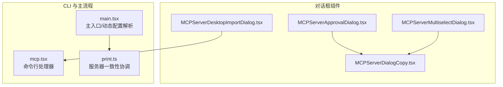
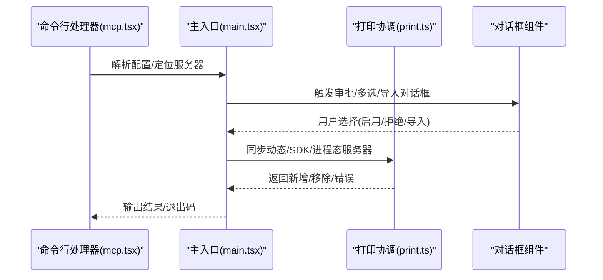
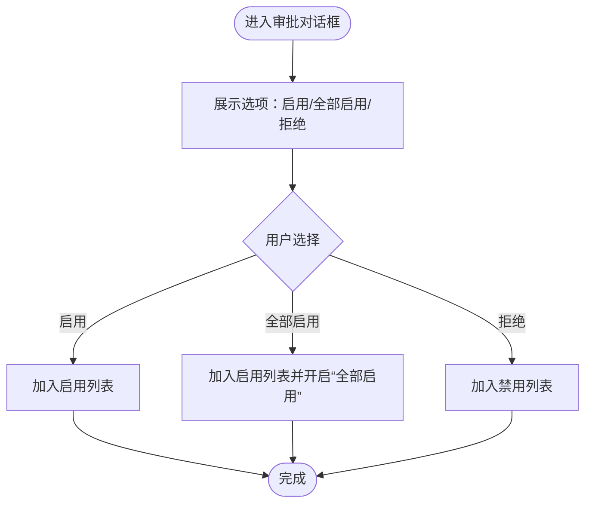
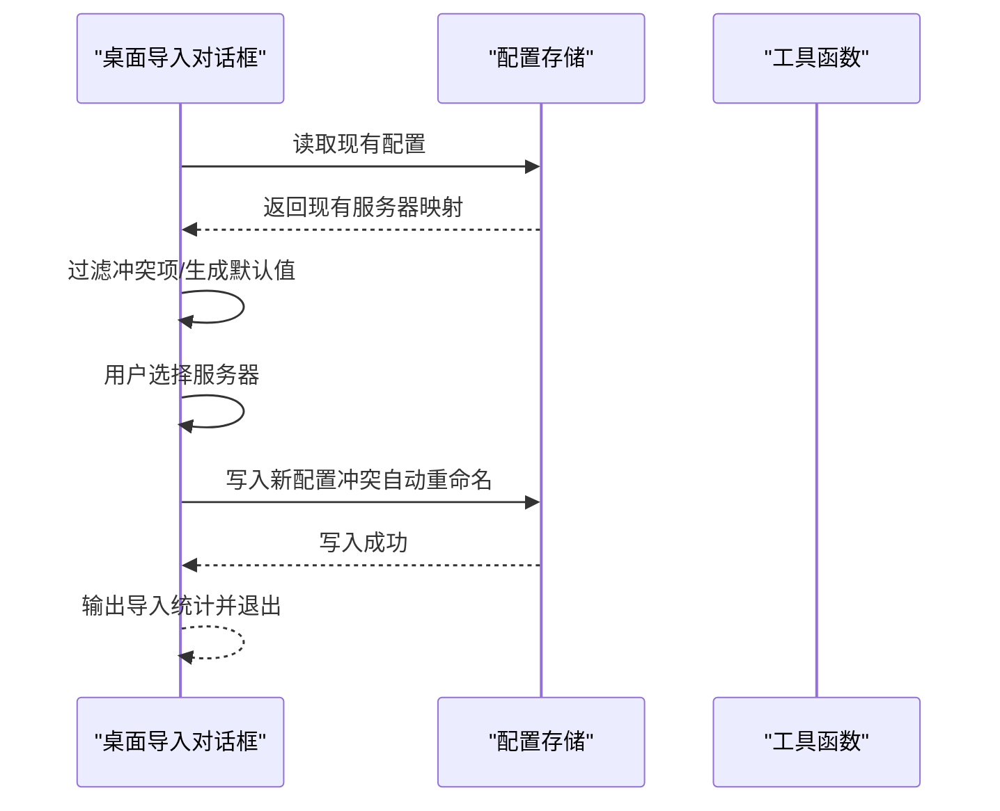
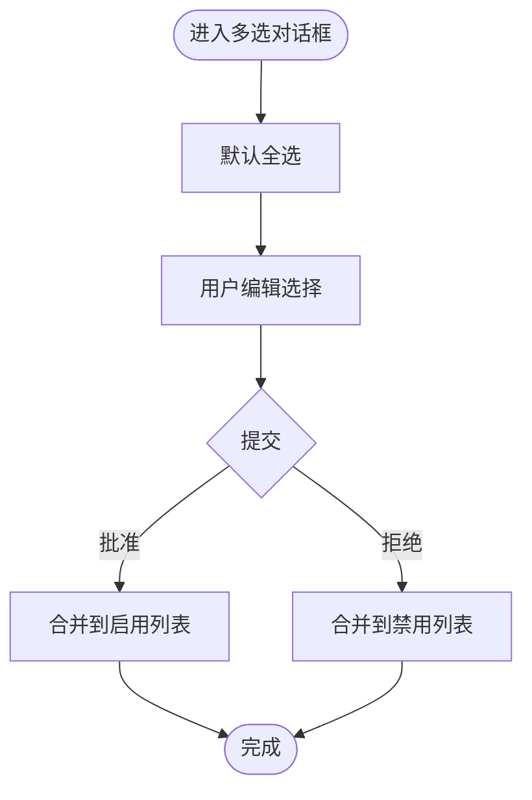
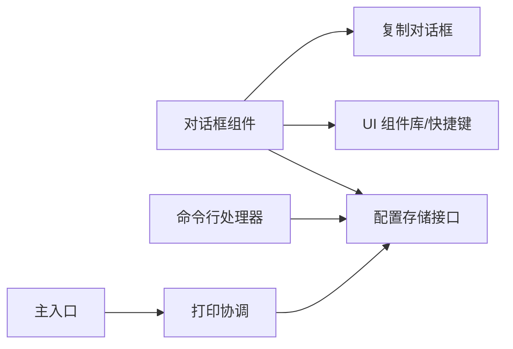

# MCP 对话框

<cite>
**本文引用的文件**
- [MCPServerApprovalDialog.tsx](file://src/components/MCPServerApprovalDialog.tsx)
- [MCPServerDesktopImportDialog.tsx](file://src/components/MCPServerDesktopImportDialog.tsx)
- [MCPServerDialogCopy.tsx](file://src/components/MCPServerDialogCopy.tsx)
- [MCPServerMultiselectDialog.tsx](file://src/components/MCPServerMultiselectDialog.tsx)
- [mcp.tsx](file://src/cli/handlers/mcp.tsx)
- [main.tsx](file://src/main.tsx)
- [print.ts](file://src/cli/print.ts)
</cite>

## 目录
1. [简介](#简介)
2. [项目结构](#项目结构)
3. [核心组件](#核心组件)
4. [架构总览](#架构总览)
5. [详细组件分析](#详细组件分析)
6. [依赖关系分析](#依赖关系分析)
7. [性能考量](#性能考量)
8. [故障排查指南](#故障排查指南)
9. [结论](#结论)
10. [附录](#附录)

## 简介
本文件面向 Claude Code 的 MCP（Model Context Protocol）对话框系统，聚焦以下能力：
- MCP 服务器列表面板：服务器发现、状态管理、连接配置
- MCP 服务器复制对话框：配置导入与导出
- 多选对话框：批量操作与选择管理
- 桌面导入对话框：本地服务器发现与配置流程
- 安全认证与权限验证机制
- 错误处理与重连策略
- 用户友好的配置向导

目标是帮助开发者与使用者理解 MCP 对话框在不同场景下的职责边界、数据流与交互逻辑。

## 项目结构
MCP 对话框相关代码主要位于 src/components 下的四个对话框组件，配合 CLI 层与主流程进行配置解析、导入与状态同步。

**图表来源**
- [MCPServerApprovalDialog.tsx:1-115](file://src/components/MCPServerApprovalDialog.tsx#L1-L115)
- [MCPServerDesktopImportDialog.tsx:1-203](file://src/components/MCPServerDesktopImportDialog.tsx#L1-L203)
- [MCPServerDialogCopy.tsx:1-15](file://src/components/MCPServerDialogCopy.tsx#L1-L15)
- [MCPServerMultiselectDialog.tsx:1-133](file://src/components/MCPServerMultiselectDialog.tsx#L1-L133)
- [mcp.tsx:91-123](file://src/cli/handlers/mcp.tsx#L91-L123)
- [main.tsx:1415-1504](file://src/main.tsx#L1415-L1504)
- [print.ts:5446-5463](file://src/cli/print.ts#L5446-L5463)

**章节来源**
- [MCPServerApprovalDialog.tsx:1-115](file://src/components/MCPServerApprovalDialog.tsx#L1-L115)
- [MCPServerDesktopImportDialog.tsx:1-203](file://src/components/MCPServerDesktopImportDialog.tsx#L1-L203)
- [MCPServerDialogCopy.tsx:1-15](file://src/components/MCPServerDialogCopy.tsx#L1-L15)
- [MCPServerMultiselectDialog.tsx:1-133](file://src/components/MCPServerMultiselectDialog.tsx#L1-L133)
- [mcp.tsx:91-123](file://src/cli/handlers/mcp.tsx#L91-L123)
- [main.tsx:1415-1504](file://src/main.tsx#L1415-L1504)
- [print.ts:5446-5463](file://src/cli/print.ts#L5446-L5463)

## 核心组件
- 服务器审批对话框：用于首次发现或变更时的用户确认与策略设置（启用/全部启用/拒绝）
- 桌面导入对话框：从 Claude Desktop 发现并批量导入 MCP 服务器配置
- 复制对话框：展示安全提示与文档链接
- 多选对话框：批量启用/拒绝多个服务器，并更新本地设置

这些组件通过统一的 UI 组件库与快捷键提示，提供一致的交互体验。

**章节来源**
- [MCPServerApprovalDialog.tsx:1-115](file://src/components/MCPServerApprovalDialog.tsx#L1-L115)
- [MCPServerDesktopImportDialog.tsx:1-203](file://src/components/MCPServerDesktopImportDialog.tsx#L1-L203)
- [MCPServerDialogCopy.tsx:1-15](file://src/components/MCPServerDialogCopy.tsx#L1-L15)
- [MCPServerMultiselectDialog.tsx:1-133](file://src/components/MCPServerMultiselectDialog.tsx#L1-L133)

## 架构总览
MCP 对话框系统贯穿“发现—审批—导入—配置—协调”链路：
- 发现：CLI 或主流程解析配置源（命令行、文件路径、动态注入），识别服务器集合
- 审批：弹出审批/多选对话框，收集用户决策并写入本地设置
- 导入：桌面导入对话框扫描现有配置，避免命名冲突，批量写入新配置
- 协调：打印层对动态/SDK/进程态服务器进行一致性比对与增删

**图表来源**
- [mcp.tsx:91-123](file://src/cli/handlers/mcp.tsx#L91-L123)
- [main.tsx:1415-1504](file://src/main.tsx#L1415-L1504)
- [print.ts:5446-5463](file://src/cli/print.ts#L5446-L5463)
- [MCPServerApprovalDialog.tsx:1-115](file://src/components/MCPServerApprovalDialog.tsx#L1-L115)
- [MCPServerMultiselectDialog.tsx:1-133](file://src/components/MCPServerMultiselectDialog.tsx#L1-L133)
- [MCPServerDesktopImportDialog.tsx:1-203](file://src/components/MCPServerDesktopImportDialog.tsx#L1-L203)

## 详细组件分析

### 服务器审批对话框（MCPServerApprovalDialog）
- 职责：当检测到新的或变更的 MCP 服务器时，弹窗询问用户是否启用、全部启用或拒绝；同时记录分析事件
- 关键行为：
  - 记录用户选择（yes/yes_all/no）
  - 更新本地设置中的启用/禁用服务器列表
  - 可选地开启“在本项目中使用所有未来 MCP 服务器”
- 交互：下拉选择 + 取消即视为拒绝

**图表来源**
- [MCPServerApprovalDialog.tsx:1-115](file://src/components/MCPServerApprovalDialog.tsx#L1-L115)

**章节来源**
- [MCPServerApprovalDialog.tsx:1-115](file://src/components/MCPServerApprovalDialog.tsx#L1-L115)

### 桌面导入对话框（MCPServerDesktopImportDialog）
- 职责：从 Claude Desktop 发现可用服务器，检查与当前配置的命名冲突，支持批量导入
- 关键行为：
  - 获取现有配置，计算冲突项
  - 提供默认全选非冲突项，允许用户取消
  - 冲突项自动追加数字后缀以避免覆盖
  - 成功导入后输出统计信息并优雅退出
- 交互：多选 + 快捷键提示（空格选择、回车确认、Esc 取消）

**图表来源**
- [MCPServerDesktopImportDialog.tsx:1-203](file://src/components/MCPServerDesktopImportDialog.tsx#L1-L203)

**章节来源**
- [MCPServerDesktopImportDialog.tsx:1-203](file://src/components/MCPServerDesktopImportDialog.tsx#L1-L203)

### 复制对话框（MCPServerDialogCopy）
- 职责：展示 MCP 服务器的安全提示与文档链接，作为其他对话框的复用片段
- 内容：强调服务器可能执行代码或访问系统资源，所有工具调用需经批准，并提供官方文档链接

**章节来源**
- [MCPServerDialogCopy.tsx:1-15](file://src/components/MCPServerDialogCopy.tsx#L1-L15)

### 多选对话框（MCPServerMultiselectDialog）
- 职责：批量启用/拒绝多个服务器，更新本地设置
- 关键行为：
  - 将用户选择分为“已批准”和“已拒绝”两组
  - 分别合并到启用/禁用列表并去重
  - 记录分析事件（批准数量、拒绝数量）
  - Esc 行为：一键拒绝全部

**图表来源**
- [MCPServerMultiselectDialog.tsx:1-133](file://src/components/MCPServerMultiselectDialog.tsx#L1-L133)

**章节来源**
- [MCPServerMultiselectDialog.tsx:1-133](file://src/components/MCPServerMultiselectDialog.tsx#L1-L133)

## 依赖关系分析
- 组件依赖：
  - 审批/多选对话框依赖复制对话框以显示安全提示
  - 桌面导入对话框依赖配置存储接口以读取/写入服务器配置
  - 所有对话框依赖快捷键与 UI 组件库以提供一致的交互体验
- 主流程依赖：
  - CLI 处理器负责删除/定位服务器
  - 主入口负责解析动态配置并注入 scope
  - 打印层负责动态/SDK/进程态服务器的一致性协调

**图表来源**
- [MCPServerApprovalDialog.tsx:1-115](file://src/components/MCPServerApprovalDialog.tsx#L1-L115)
- [MCPServerDesktopImportDialog.tsx:1-203](file://src/components/MCPServerDesktopImportDialog.tsx#L1-L203)
- [MCPServerMultiselectDialog.tsx:1-133](file://src/components/MCPServerMultiselectDialog.tsx#L1-L133)
- [mcp.tsx:91-123](file://src/cli/handlers/mcp.tsx#L91-L123)
- [main.tsx:1415-1504](file://src/main.tsx#L1415-L1504)
- [print.ts:5446-5463](file://src/cli/print.ts#L5446-L5463)

**章节来源**
- [MCPServerApprovalDialog.tsx:1-115](file://src/components/MCPServerApprovalDialog.tsx#L1-L115)
- [MCPServerDesktopImportDialog.tsx:1-203](file://src/components/MCPServerDesktopImportDialog.tsx#L1-L203)
- [MCPServerMultiselectDialog.tsx:1-133](file://src/components/MCPServerMultiselectDialog.tsx#L1-L133)
- [mcp.tsx:91-123](file://src/cli/handlers/mcp.tsx#L91-L123)
- [main.tsx:1415-1504](file://src/main.tsx#L1415-L1504)
- [print.ts:5446-5463](file://src/cli/print.ts#L5446-L5463)

## 性能考量
- 列表渲染与选择：
  - 使用默认全选与预过滤冲突项，减少不必要的写入与 UI 重排
- 配置写入：
  - 合并数组并去重，降低重复写入成本
- 动态配置解析：
  - 在主入口对动态配置进行统一扩展变量与注入 scope，避免后续重复处理

[本节为通用指导，不直接分析具体文件]

## 故障排查指南
- 命令行删除失败：
  - 若服务器存在于多个作用域，需要明确指定作用域；否则会报“未找到该名称的 MCP 服务器”
- 导入冲突：
  - 当目标名称已存在时，自动追加数字后缀；若仍冲突，需手动调整名称
- 安全提示：
  - 所有 MCP 服务器均需用户批准方可执行工具调用；请确保理解风险并参考官方文档
- 退出与日志：
  - 成功导入后会输出统计信息；如无输出，检查是否选择了服务器或是否发生错误

**章节来源**
- [mcp.tsx:91-123](file://src/cli/handlers/mcp.tsx#L91-L123)
- [MCPServerDesktopImportDialog.tsx:1-203](file://src/components/MCPServerDesktopImportDialog.tsx#L1-L203)
- [MCPServerDialogCopy.tsx:1-15](file://src/components/MCPServerDialogCopy.tsx#L1-L15)

## 结论
MCP 对话框系统通过“审批—导入—多选—协调”的闭环设计，实现了对 MCP 服务器的可审计、可批量、可降级的配置管理。组件间职责清晰、交互一致，结合 CLI 与主流程的解析与协调，确保了在不同场景下的稳定性与安全性。

[本节为总结性内容，不直接分析具体文件]

## 附录
- 官方文档链接：见复制对话框中的文档链接
- 快捷键提示：
  - 空格：选择
  - 回车：确认
  - Esc：取消/拒绝全部

[本节为补充信息，不直接分析具体文件]