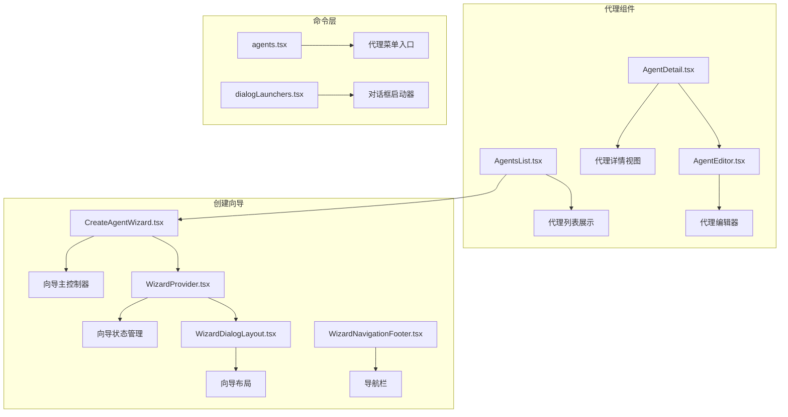
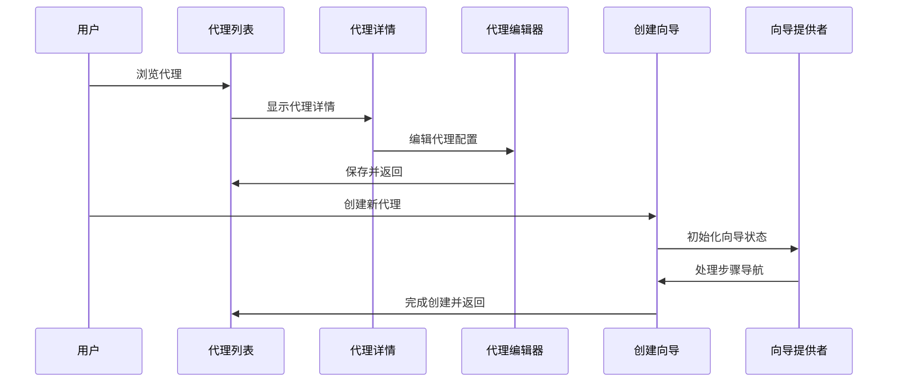
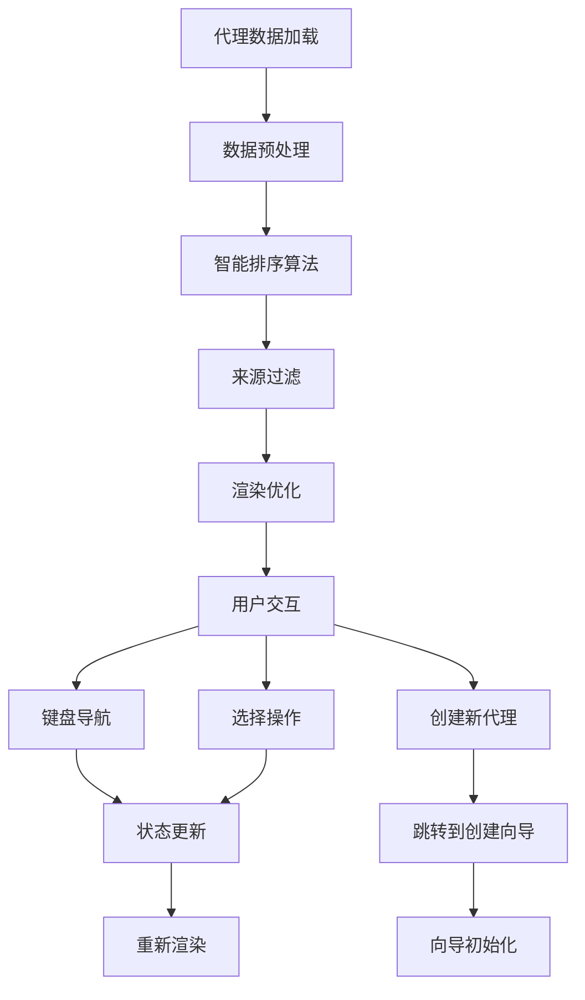
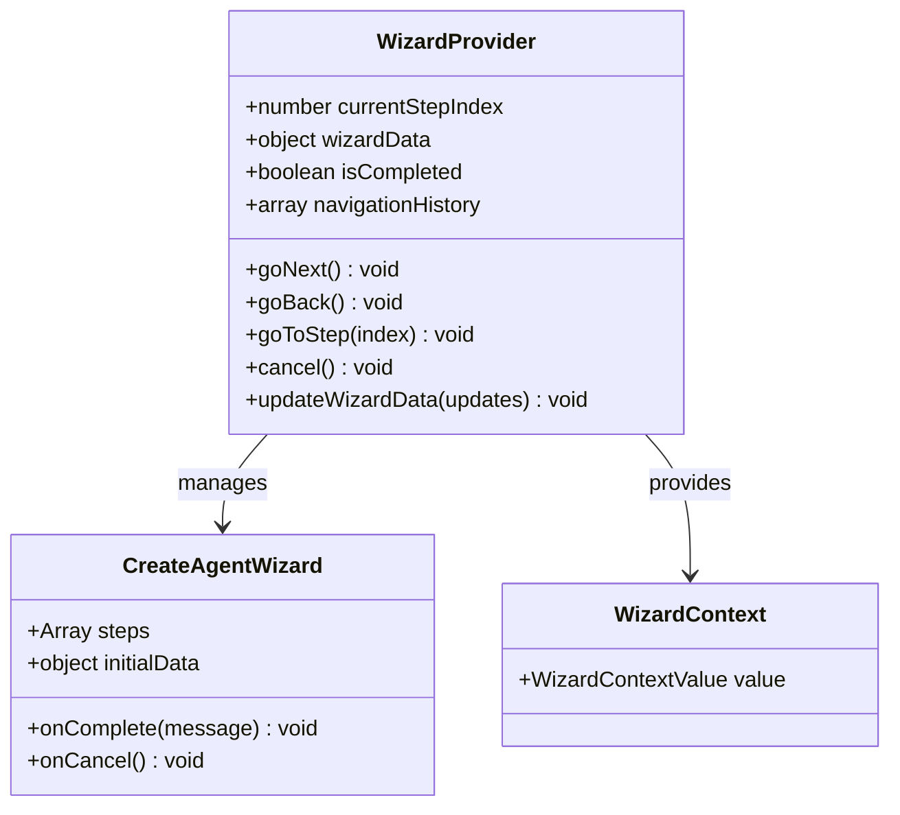
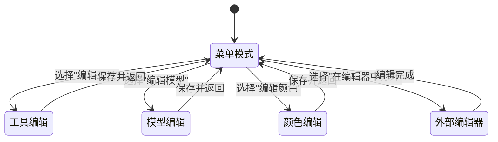
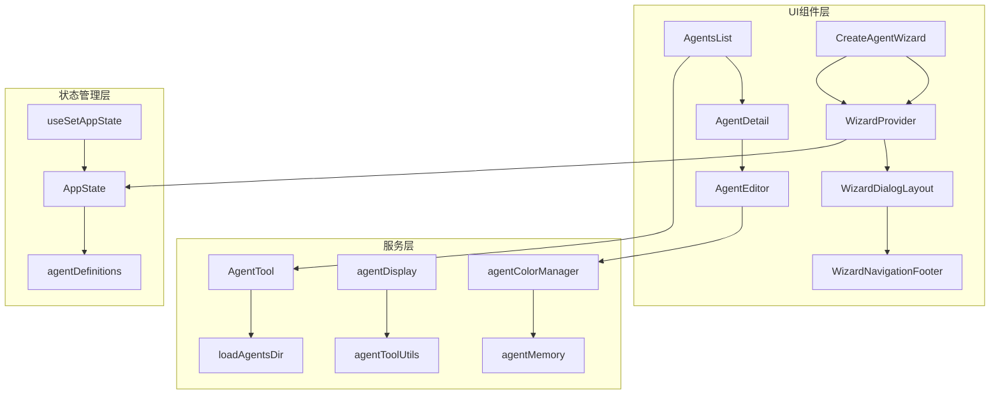

# 代理对话框

<cite>
**本文档引用的文件**
- [AgentsList.tsx](file://src/components/agents/AgentsList.tsx)
- [AgentDetail.tsx](file://src/components/agents/AgentDetail.tsx)
- [AgentEditor.tsx](file://src/components/agents/AgentEditor.tsx)
- [CreateAgentWizard.tsx](file://src/components/agents/new-agent-creation/CreateAgentWizard.tsx)
- [WizardProvider.tsx](file://src/components/wizard/WizardProvider.tsx)
- [WizardDialogLayout.tsx](file://src/components/wizard/WizardDialogLayout.tsx)
- [WizardNavigationFooter.tsx](file://src/components/wizard/WizardNavigationFooter.tsx)
- [dialogLaunchers.tsx](file://src/dialogLaunchers.tsx)
- [agents.tsx](file://src/commands/agents/agents.tsx)
</cite>

## 目录
1. [简介](#简介)
2. [项目结构](#项目结构)
3. [核心组件](#核心组件)
4. [架构概览](#架构概览)
5. [详细组件分析](#详细组件分析)
6. [依赖关系分析](#依赖关系分析)
7. [性能考虑](#性能考虑)
8. [故障排除指南](#故障排除指南)
9. [结论](#结论)

## 简介

本文档深入分析 Claude Code 中的代理对话框系统，这是一个完整的代理生命周期管理系统，涵盖代理的发现、选择、详情查看、编辑和创建。该系统提供了丰富的用户交互体验，包括键盘导航、实时预览、状态管理和错误处理。

系统的核心特性包括：
- **代理列表管理**：支持按来源分类、排序和筛选代理
- **多步骤创建向导**：引导用户完成代理创建的完整流程
- **详情展示**：提供代理的完整信息视图
- **编辑功能**：支持代理配置的实时修改
- **状态同步**：确保所有界面间的状态一致性

## 项目结构

代理对话框系统主要分布在以下目录结构中：

**图表来源**
- [AgentsList.tsx:1-440](file://src/components/agents/AgentsList.tsx#L1-L440)
- [CreateAgentWizard.tsx:1-97](file://src/components/agents/new-agent-creation/CreateAgentWizard.tsx#L1-L97)
- [WizardProvider.tsx:1-213](file://src/components/wizard/WizardProvider.tsx#L1-L213)

**章节来源**
- [AgentsList.tsx:1-440](file://src/components/agents/AgentsList.tsx#L1-L440)
- [AgentDetail.tsx:1-220](file://src/components/agents/AgentDetail.tsx#L1-L220)
- [AgentEditor.tsx:1-178](file://src/components/agents/AgentEditor.tsx#L1-L178)
- [CreateAgentWizard.tsx:1-97](file://src/components/agents/new-agent-creation/CreateAgentWizard.tsx#L1-L97)

## 核心组件

### 代理列表组件 (AgentsList)

代理列表组件是整个代理系统的入口点，提供了完整的代理浏览和选择功能：

**主要功能特性：**
- **智能排序**：按名称字母顺序自动排序代理
- **来源分组**：支持内置、插件和全部来源的分类显示
- **键盘导航**：完整的上下键导航支持
- **创建选项**：提供"创建新代理"的快捷选项
- **状态指示**：显示代理的内存使用和覆盖状态

**关键实现细节：**
- 使用 `compareAgentsByName` 函数进行智能排序
- 支持多种代理来源的动态过滤
- 实现了完整的键盘事件处理系统
- 提供了详细的代理信息展示

**章节来源**
- [AgentsList.tsx:32-440](file://src/components/agents/AgentsList.tsx#L32-L440)

### 代理详情组件 (AgentDetail)

代理详情组件提供了代理的完整信息展示，包括技术规格和配置详情：

**展示内容：**
- **基础信息**：代理类型、文件路径、描述
- **技术配置**：模型设置、权限模式、内存配置
- **工具集成**：可用工具列表和状态
- **技能系统**：代理拥有的技能列表
- **颜色标识**：基于代理类型的彩色标记

**交互特性：**
- 键盘快捷键支持（ESC 返回）
- Markdown 格式化的内容展示
- 完整的系统提示文本显示

**章节来源**
- [AgentDetail.tsx:21-220](file://src/components/agents/AgentDetail.tsx#L21-L220)

### 代理编辑器 (AgentEditor)

代理编辑器提供了代理配置的实时编辑功能：

**编辑模式：**
- **工具编辑**：选择和配置代理可用工具
- **模型编辑**：更改代理使用的AI模型
- **颜色编辑**：自定义代理的颜色标识
- **外部编辑器**：支持在外部编辑器中修改代理文件

**状态管理：**
- 实时保存机制
- 错误状态处理
- 状态同步到应用全局状态
- 颜色变更的即时生效

**章节来源**
- [AgentEditor.tsx:30-178](file://src/components/agents/AgentEditor.tsx#L30-L178)

## 架构概览

代理对话框系统采用模块化的架构设计，通过清晰的组件层次和状态管理实现：

**图表来源**
- [AgentsList.tsx:123-173](file://src/components/agents/AgentsList.tsx#L123-L173)
- [CreateAgentWizard.tsx:26-97](file://src/components/agents/new-agent-creation/CreateAgentWizard.tsx#L26-L97)
- [WizardProvider.tsx:9-203](file://src/components/wizard/WizardProvider.tsx#L9-L203)

系统架构的关键特点：
- **组件解耦**：每个组件都有明确的职责边界
- **状态集中管理**：通过全局状态管理确保数据一致性
- **事件驱动**：基于键盘事件的响应式交互
- **可扩展性**：模块化设计支持功能扩展

## 详细组件分析

### 代理列表对话框详细分析

#### 数据流和处理逻辑

**图表来源**
- [AgentsList.tsx:34-42](file://src/components/agents/AgentsList.tsx#L34-L42)
- [AgentsList.tsx:123-173](file://src/components/agents/AgentsList.tsx#L123-L173)

#### 排序和筛选算法

代理列表实现了高效的排序和筛选机制：

**排序算法：**
- 使用 `compareAgentsByName` 进行稳定排序
- 支持大小写不敏感的比较
- 按代理类型和来源进行二次排序

**筛选机制：**
- 动态来源过滤（all/built-in/plugin）
- 内置代理优先显示
- 覆盖代理的状态标记

**章节来源**
- [AgentsList.tsx:34-42](file://src/components/agents/AgentsList.tsx#L34-L42)
- [AgentsList.tsx:76-96](file://src/components/agents/AgentsList.tsx#L76-L96)

### 代理创建向导详细分析

#### 向导状态管理

**图表来源**
- [WizardProvider.tsx:9-203](file://src/components/wizard/WizardProvider.tsx#L9-L203)
- [CreateAgentWizard.tsx:26-97](file://src/components/agents/new-agent-creation/CreateAgentWizard.tsx#L26-L97)

#### 步骤导航和数据验证

向导系统支持复杂的步骤导航和数据验证：

**步骤序列：**
1. 类型选择 (TypeStep)
2. 工具配置 (ToolsStep)
3. 内存设置 (MemoryStep) - 可选
4. 最终确认 (ConfirmStepWrapper)

**数据验证：**
- 实时数据更新和验证
- 步骤间数据传递
- 完整性检查和错误处理

**章节来源**
- [CreateAgentWizard.tsx:68-76](file://src/components/agents/new-agent-creation/CreateAgentWizard.tsx#L68-L76)
- [WizardProvider.tsx:140-150](file://src/components/wizard/WizardProvider.tsx#L140-L150)

### 代理详情对话框详细分析

#### 数据展示和交互功能

代理详情组件实现了丰富的数据展示功能：

**信息层次结构：**
- **元数据**：文件路径、代理类型
- **描述信息**：whenToUse 描述文本
- **技术配置**：模型、权限模式、内存
- **工具集成**：工具列表和状态
- **系统提示**：完整的系统提示文本

**交互特性：**
- 键盘快捷键支持
- Markdown 格式化渲染
- 实时状态更新

**章节来源**
- [AgentDetail.tsx:71-198](file://src/components/agents/AgentDetail.tsx#L71-L198)

### 代理编辑对话框详细分析

#### 表单处理和实时预览

**图表来源**
- [AgentEditor.tsx:96-108](file://src/components/agents/AgentEditor.tsx#L96-L108)
- [AgentEditor.tsx:149-177](file://src/components/agents/AgentEditor.tsx#L149-L177)

#### 实时预览和状态同步

编辑器实现了完整的实时预览和状态同步机制：

**实时更新：**
- 颜色变更即时生效
- 工具配置的实时反映
- 状态变化的自动同步

**数据持久化：**
- 异步文件更新
- 应用状态同步
- 错误处理和回滚

**章节来源**
- [AgentEditor.tsx:50-95](file://src/components/agents/AgentEditor.tsx#L50-L95)

## 依赖关系分析

### 组件间依赖关系

**图表来源**
- [AgentsList.tsx:1-14](file://src/components/agents/AgentsList.tsx#L1-L14)
- [AgentEditor.tsx:10-17](file://src/components/agents/AgentEditor.tsx#L10-L17)
- [WizardProvider.tsx:1-8](file://src/components/wizard/WizardProvider.tsx#L1-L8)

### 数据流转和状态同步机制

系统实现了复杂的数据流转和状态同步机制：

**状态同步流程：**
1. 用户操作触发状态变更
2. 状态变更通过回调函数传播
3. 全局状态更新确保各组件同步
4. UI 自动重新渲染反映最新状态

**数据一致性保证：**
- 单向数据流设计
- 状态变更的原子性
- 错误状态的隔离和恢复

**章节来源**
- [AgentEditor.tsx:73-88](file://src/components/agents/AgentEditor.tsx#L73-L88)
- [WizardProvider.tsx:140-150](file://src/components/wizard/WizardProvider.tsx#L140-L150)

## 性能考虑

### 渲染优化策略

系统采用了多种渲染优化策略来确保流畅的用户体验：

**记忆化优化：**
- 使用 `_c` 缓存系统减少不必要的重渲染
- 条件渲染避免空状态的重复计算
- memoization 优化昂贵的计算操作

**虚拟化支持：**
- 大列表的虚拟滚动支持
- 按需渲染减少 DOM 节点数量
- 懒加载机制优化初始加载时间

### 内存管理

**垃圾回收优化：**
- 及时清理不再使用的组件引用
- 避免内存泄漏的事件监听器管理
- 大对象的延迟初始化

## 故障排除指南

### 常见问题和解决方案

**代理列表无响应：**
- 检查代理数据加载状态
- 验证键盘事件绑定是否正常
- 确认状态更新回调是否正确执行

**编辑器保存失败：**
- 检查文件权限和路径有效性
- 验证代理配置的完整性
- 查看错误日志获取具体原因

**向导步骤卡住：**
- 确认向导状态管理正常工作
- 检查步骤数据的传递和验证
- 验证导航历史记录的正确性

**状态不同步问题：**
- 检查全局状态更新的原子性
- 验证状态订阅和通知机制
- 确认组件间的通信通道

**章节来源**
- [AgentEditor.tsx:91-94](file://src/components/agents/AgentEditor.tsx#L91-L94)
- [WizardProvider.tsx:44-61](file://src/components/wizard/WizardProvider.tsx#L44-L61)

## 结论

Claude Code 的代理对话框系统展现了现代前端架构的最佳实践，通过模块化设计、状态管理和用户友好的交互实现了完整的代理生命周期管理。系统的主要优势包括：

**架构优势：**
- 清晰的组件分离和职责划分
- 强大的状态管理机制
- 灵活的扩展性和可维护性

**用户体验优势：**
- 流畅的键盘导航体验
- 实时的状态反馈和预览
- 完善的错误处理和恢复机制

**技术实现亮点：**
- 高效的数据处理和渲染优化
- 健壮的状态同步和数据一致性保证
- 可扩展的向导系统支持复杂的工作流程

该系统为开发者提供了强大的代理管理能力，同时保持了良好的性能表现和用户体验。通过持续的优化和扩展，这个代理对话框系统能够满足各种复杂的代理管理需求。