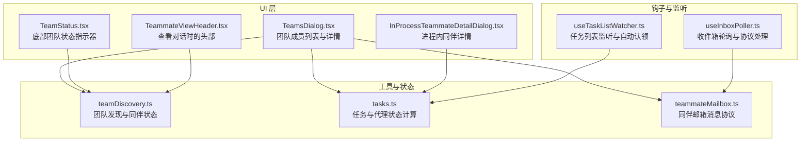
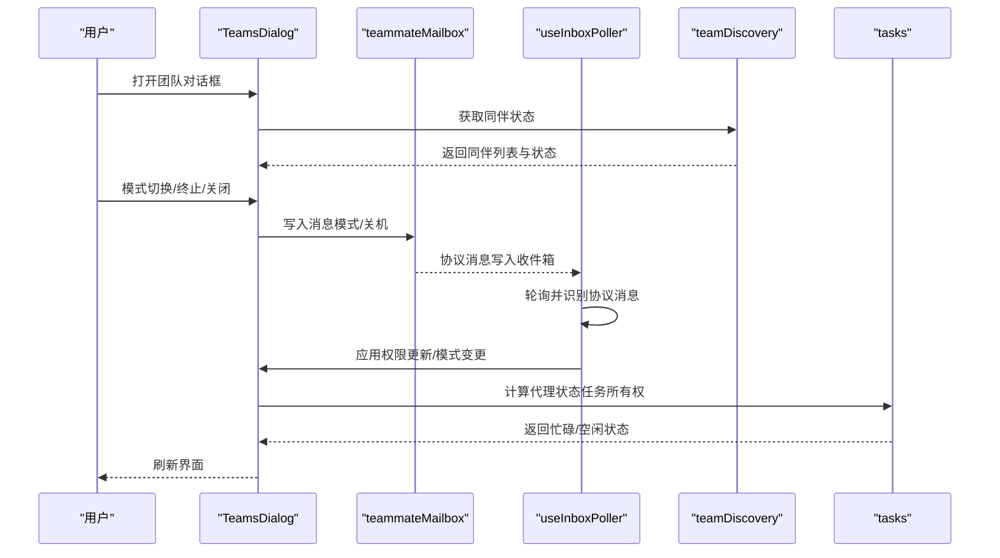
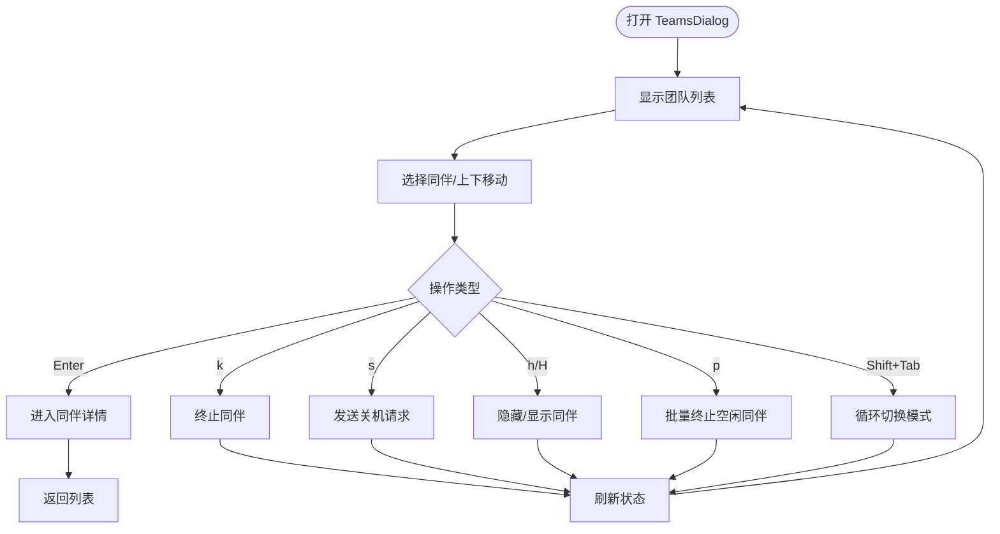
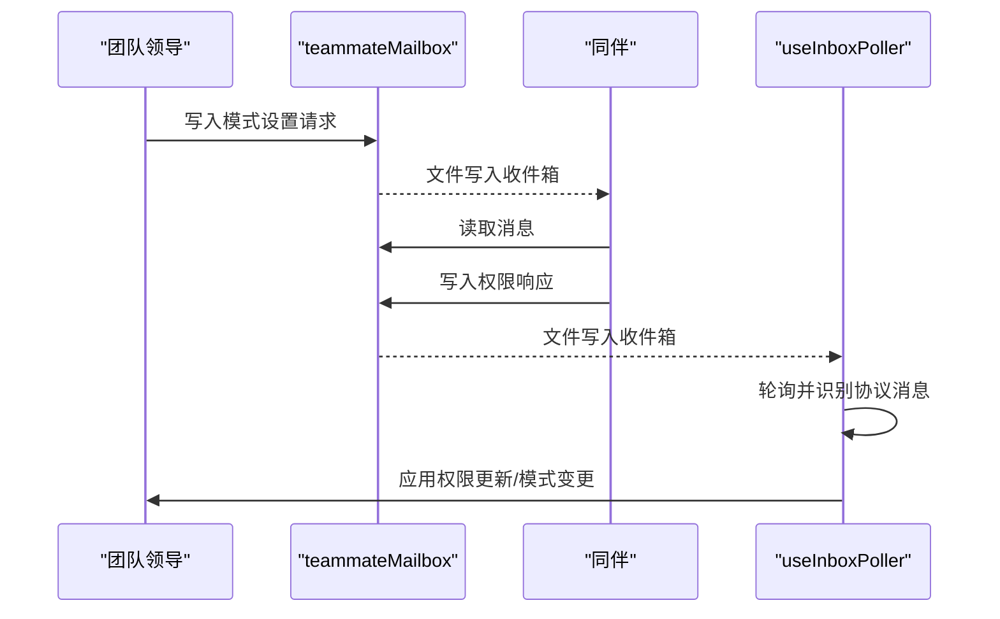
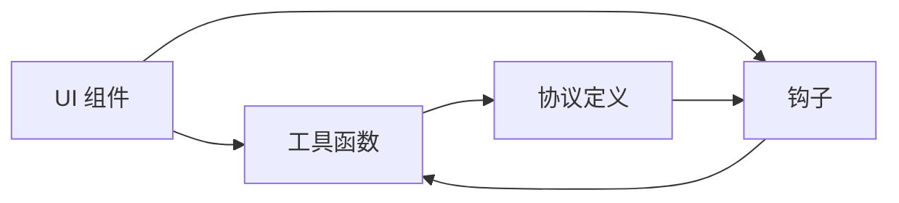

# 团队对话框

<cite>
**本文档引用的文件**
- [TeamsDialog.tsx](file://src/components/teams/TeamsDialog.tsx)
- [TeamStatus.tsx](file://src/components/teams/TeamStatus.tsx)
- [TeammateViewHeader.tsx](file://src/components/TeammateViewHeader.tsx)
- [InProcessTeammateDetailDialog.tsx](file://src/components/tasks/InProcessTeammateDetailDialog.tsx)
- [teamDiscovery.ts](file://src/utils/teamDiscovery.ts)
- [tasks.ts](file://src/utils/tasks.ts)
- [teammateMailbox.ts](file://src/utils/teammateMailbox.ts)
- [useInboxPoller.ts](file://src/hooks/useInboxPoller.ts)
- [useTaskListWatcher.ts](file://src/hooks/useTaskListWatcher.ts)
</cite>

## 目录
1. [简介](#简介)
2. [项目结构](#项目结构)
3. [核心组件](#核心组件)
4. [架构总览](#架构总览)
5. [详细组件分析](#详细组件分析)
6. [依赖关系分析](#依赖关系分析)
7. [性能考虑](#性能考虑)
8. [故障排除指南](#故障排除指南)
9. [结论](#结论)

## 简介
本技术文档围绕 Claude Code 的团队对话框系统进行深入解析，涵盖团队成员管理、角色分配与权限控制、状态显示与实时更新、后台任务对话框与进度监控、协作功能（任务分配、进度同步、通知提醒）以及与任务系统、权限系统、通知系统的集成方式，并提供性能优化与大数据量处理策略。

## 项目结构
团队对话框系统由 UI 组件、状态与数据工具、消息传递与权限协议、任务监听与状态计算等模块组成。UI 层通过对话框与状态组件展示团队与任务状态；工具层负责从文件系统与配置中读取团队信息、计算代理状态、管理消息收发；钩子层负责轮询与监听，确保 UI 实时更新。

**图表来源**
- [TeamsDialog.tsx:1-715](file://src/components/teams/TeamsDialog.tsx#L1-L715)
- [TeamStatus.tsx:1-80](file://src/components/teams/TeamStatus.tsx#L1-L80)
- [TeammateViewHeader.tsx:1-82](file://src/components/TeammateViewHeader.tsx#L1-L82)
- [InProcessTeammateDetailDialog.tsx:1-266](file://src/components/tasks/InProcessTeammateDetailDialog.tsx#L1-L266)
- [teamDiscovery.ts:1-82](file://src/utils/teamDiscovery.ts#L1-L82)
- [tasks.ts:700-863](file://src/utils/tasks.ts#L700-L863)
- [teammateMailbox.ts:1-1184](file://src/utils/teammateMailbox.ts#L1-L1184)
- [useInboxPoller.ts:296-551](file://src/hooks/useInboxPoller.ts#L296-L551)
- [useTaskListWatcher.ts:1-222](file://src/hooks/useTaskListWatcher.ts#L1-L222)

**章节来源**
- [TeamsDialog.tsx:1-715](file://src/components/teams/TeamsDialog.tsx#L1-L715)
- [teamDiscovery.ts:1-82](file://src/utils/teamDiscovery.ts#L1-L82)
- [tasks.ts:700-863](file://src/utils/tasks.ts#L700-L863)
- [teammateMailbox.ts:1-1184](file://src/utils/teammateMailbox.ts#L1-L1184)
- [useInboxPoller.ts:296-551](file://src/hooks/useInboxPoller.ts#L296-L551)
- [useTaskListWatcher.ts:1-222](file://src/hooks/useTaskListWatcher.ts#L1-L222)

## 核心组件
- 团队对话框 TeamsDialog：提供团队成员列表与详情视图，支持模式切换、面板可见性控制、终止与优雅关闭、批量清理空闲同伴等操作；内部使用定时刷新与键盘快捷键驱动交互。
- 团队状态 TeamStatus：底部状态指示器，显示当前选中的团队同伴数量及提示。
- 同伴视图头部 TeammateViewHeader：在查看特定同伴对话时显示同伴名称、颜色、提示与退出提示。
- 进程内同伴详情 InProcessTeammateDetailDialog：展示进程内同伴的活动描述、运行时长、令牌数、工具调用次数、进度与错误信息，支持快捷键控制。
- 团队发现与状态 teamDiscovery：从团队配置中读取同伴状态（运行/空闲/未知）、工作目录、工作树路径、后端类型、权限模式等。
- 任务与代理状态 tasks：根据任务所有权计算代理的忙碌/空闲状态，提供未完成任务的统计与通知消息构建。
- 邮箱消息协议 teammateMailbox：定义并处理权限请求/响应、沙箱权限请求/响应、关机请求/批准/拒绝、计划审批请求/响应、任务分配、团队权限更新、模式设置请求等协议消息。
- 收件箱轮询 useInboxPoller：扫描收件箱，识别并路由结构化协议消息到相应队列（权限、沙箱权限、关机、计划审批、团队权限更新、模式设置），并应用权限更新。
- 任务列表监听 useTaskListWatcher：监听任务目录变化，自动认领可用任务并提交给代理执行。

**章节来源**
- [TeamsDialog.tsx:1-715](file://src/components/teams/TeamsDialog.tsx#L1-L715)
- [TeamStatus.tsx:1-80](file://src/components/teams/TeamStatus.tsx#L1-L80)
- [TeammateViewHeader.tsx:1-82](file://src/components/TeammateViewHeader.tsx#L1-L82)
- [InProcessTeammateDetailDialog.tsx:1-266](file://src/components/tasks/InProcessTeammateDetailDialog.tsx#L1-L266)
- [teamDiscovery.ts:1-82](file://src/utils/teamDiscovery.ts#L1-L82)
- [tasks.ts:700-863](file://src/utils/tasks.ts#L700-L863)
- [teammateMailbox.ts:1-1184](file://src/utils/teammateMailbox.ts#L1-L1184)
- [useInboxPoller.ts:296-551](file://src/hooks/useInboxPoller.ts#L296-L551)
- [useTaskListWatcher.ts:1-222](file://src/hooks/useTaskListWatcher.ts#L1-L222)

## 架构总览
团队对话框系统采用“UI 组件 + 工具函数 + 钩子监听”的分层设计。UI 组件负责用户交互与展示；工具函数负责数据读取与状态计算；钩子负责事件驱动与异步更新，确保 UI 实时反映团队与任务状态。

**图表来源**
- [TeamsDialog.tsx:1-715](file://src/components/teams/TeamsDialog.tsx#L1-L715)
- [teammateMailbox.ts:1-1184](file://src/utils/teammateMailbox.ts#L1-L1184)
- [useInboxPoller.ts:296-551](file://src/hooks/useInboxPoller.ts#L296-L551)
- [teamDiscovery.ts:1-82](file://src/utils/teamDiscovery.ts#L1-L82)
- [tasks.ts:700-863](file://src/utils/tasks.ts#L700-L863)

## 详细组件分析

### TeamsDialog 组件
- 功能要点
  - 列表与详情双视图：支持进入同伴详情查看任务与提示；支持返回列表。
  - 模式管理：支持单个或全部同伴模式循环切换，通过消息协议下发至同伴并本地即时更新。
  - 面板控制：支持隐藏/显示同伴面板（受后端能力限制）。
  - 生命周期管理：支持终止同伴、优雅关闭、批量清理空闲同伴。
  - 实时刷新：每秒定时刷新以捕获同伴模式变更。
- 数据绑定与交互
  - 使用 AppState 提供的状态上下文与快捷键绑定，实现键盘导航与确认动作。
  - 通过 teammateMailbox 发送模式设置与关机请求，通过 teamDiscovery 获取同伴状态。
- 错误处理
  - 对面板销毁失败、旧配置无后端类型等情况进行日志记录与降级处理。

**图表来源**
- [TeamsDialog.tsx:1-715](file://src/components/teams/TeamsDialog.tsx#L1-L715)

**章节来源**
- [TeamsDialog.tsx:1-715](file://src/components/teams/TeamsDialog.tsx#L1-L715)

### TeamStatus 组件
- 功能要点
  - 基于 AppState 中的 teamContext 计算同伴数量，过滤团队领导，仅统计非领导同伴。
  - 在团队被选中且需要提示时显示“回车查看”提示。
- 数据绑定
  - 使用 useAppState 订阅 teamContext 变更，避免不必要的重渲染。

**章节来源**
- [TeamStatus.tsx:1-80](file://src/components/teams/TeamStatus.tsx#L1-L80)

### TeammateViewHeader 组件
- 功能要点
  - 显示当前查看的同伴名称（带颜色）、提示文本与退出提示。
  - 使用 OffscreenFreeze 保证在冻结状态下仍可正确渲染。
- 数据绑定
  - 通过 AppState 的选择器获取当前查看的同伴任务信息。

**章节来源**
- [TeammateViewHeader.tsx:1-82](file://src/components/TeammateViewHeader.tsx#L1-L82)

### InProcessTeammateDetailDialog 组件
- 功能要点
  - 展示进程内同伴的活动描述、运行时长、令牌数、工具调用次数、最近活动列表、提示与错误信息。
  - 支持快捷键：空格关闭、左箭头返回、x 停止、f 前台聚焦。
  - 使用 useElapsedTime 计算运行时长，结合主题与工具集渲染活动。
- 数据绑定
  - 通过 props 接收同伴状态，内部使用 useMemo 缓存工具列表与格式化结果。

**章节来源**
- [InProcessTeammateDetailDialog.tsx:1-266](file://src/components/tasks/InProcessTeammateDetailDialog.tsx#L1-L266)

### 团队发现与状态（teamDiscovery）
- 功能要点
  - 从团队配置文件读取同伴信息，排除团队领导，计算运行/空闲状态。
  - 提取工作目录、工作树路径、后端类型、权限模式等元数据。
- 复杂度分析
  - 时间复杂度：O(n)，n 为团队成员数量；空间复杂度：O(n)。

**章节来源**
- [teamDiscovery.ts:1-82](file://src/utils/teamDiscovery.ts#L1-L82)

### 任务与代理状态（tasks）
- 功能要点
  - 基于任务所有权计算代理的忙碌/空闲状态：未完成任务数为 0 判定为空闲，否则为忙碌。
  - 提供未分配任务的统计与通知消息构建，便于在同伴终止或关闭时进行任务再分配。
- 复杂度分析
  - 时间复杂度：O(t + n)，t 为任务总数，n 为成员数；空间复杂度：O(n)。

**章节来源**
- [tasks.ts:700-863](file://src/utils/tasks.ts#L700-L863)

### 邮箱消息协议（teammateMailbox）
- 功能要点
  - 定义并处理多种协议消息：权限请求/响应、沙箱权限请求/响应、关机请求/批准/拒绝、计划审批请求/响应、任务分配、团队权限更新、模式设置请求。
  - 提供消息写入、标记已读、清空收件箱、格式化附件等工具方法。
  - 使用锁文件确保并发安全。
- 协议处理流程
  - isStructuredProtocolMessage 识别结构化协议消息类型。
  - create*/is* 系列函数用于构造与解析消息体。

**图表来源**
- [teammateMailbox.ts:1-1184](file://src/utils/teammateMailbox.ts#L1-L1184)
- [useInboxPoller.ts:296-551](file://src/hooks/useInboxPoller.ts#L296-L551)

**章节来源**
- [teammateMailbox.ts:1-1184](file://src/utils/teammateMailbox.ts#L1-L1184)
- [useInboxPoller.ts:296-551](file://src/hooks/useInboxPoller.ts#L296-L551)

### 收件箱轮询（useInboxPoller）
- 功能要点
  - 扫描收件箱，识别权限请求/响应、沙箱权限请求/响应、关机请求/批准/拒绝、团队权限更新、模式设置请求等协议消息。
  - 对团队权限更新应用到本地权限上下文，对模式设置请求在同伴侧生效。
- 错误处理
  - 对缺失必要字段的消息进行日志记录并跳过处理。

**章节来源**
- [useInboxPoller.ts:296-551](file://src/hooks/useInboxPoller.ts#L296-L551)

### 任务列表监听（useTaskListWatcher）
- 功能要点
  - 监听任务目录变化，自动发现可用任务（未完成、无拥有者、无阻塞）并进行认领。
  - 使用防抖机制减少频繁文件系统事件的影响，避免死锁问题。
  - 在代理空闲时触发检查，确保任务连续处理。
- 性能特性
  - 使用 useRef 稳定回调与状态引用，避免每次渲染产生新函数导致的监听器重建。

**章节来源**
- [useTaskListWatcher.ts:1-222](file://src/hooks/useTaskListWatcher.ts#L1-L222)

## 依赖关系分析
- UI 组件依赖工具函数与钩子：TeamsDialog 依赖 teamDiscovery 与 teammateMailbox；TeamStatus 依赖 AppState；TeammateViewHeader 依赖 AppState 选择器；InProcessTeammateDetailDialog 依赖 tasks 与工具格式化。
- 钩子依赖工具函数：useInboxPoller 依赖 teammateMailbox；useTaskListWatcher 依赖 tasks。
- 协议一致性：teammateMailbox 的 isStructuredProtocolMessage 与 useInboxPoller 的消息识别保持一致，确保协议消息不被误当作文本附件消费。

**图表来源**
- [TeamsDialog.tsx:1-715](file://src/components/teams/TeamsDialog.tsx#L1-L715)
- [teamDiscovery.ts:1-82](file://src/utils/teamDiscovery.ts#L1-L82)
- [tasks.ts:700-863](file://src/utils/tasks.ts#L700-L863)
- [teammateMailbox.ts:1-1184](file://src/utils/teammateMailbox.ts#L1-L1184)
- [useInboxPoller.ts:296-551](file://src/hooks/useInboxPoller.ts#L296-L551)
- [useTaskListWatcher.ts:1-222](file://src/hooks/useTaskListWatcher.ts#L1-L222)

**章节来源**
- [TeamsDialog.tsx:1-715](file://src/components/teams/TeamsDialog.tsx#L1-L715)
- [teamDiscovery.ts:1-82](file://src/utils/teamDiscovery.ts#L1-L82)
- [tasks.ts:700-863](file://src/utils/tasks.ts#L700-L863)
- [teammateMailbox.ts:1-1184](file://src/utils/teammateMailbox.ts#L1-L1184)
- [useInboxPoller.ts:296-551](file://src/hooks/useInboxPoller.ts#L296-L551)
- [useTaskListWatcher.ts:1-222](file://src/hooks/useTaskListWatcher.ts#L1-L222)

## 性能考虑
- UI 渲染优化
  - 使用 useMemo 与浅比较减少不必要的渲染（如 TeamsDialog 的同伴列表、InProcessTeammateDetailDialog 的工具列表与格式化结果）。
  - 使用 React 编译器缓存提升渲染性能。
- 实时更新策略
  - TeamsDialog 使用定时器每秒刷新，平衡实时性与性能；可根据团队规模调整刷新频率。
  - useTaskListWatcher 使用防抖（1 秒）合并频繁的文件系统事件，降低监听开销。
- 并发与锁
  - teammateMailbox 使用锁文件确保并发写入安全，避免竞态条件。
- 大数据量处理
  - 任务状态计算按任务所有权分组，时间复杂度 O(t+n)，可通过分页或增量更新进一步优化。
  - 对于大量同伴的场景，建议限制默认可见数量或提供搜索/筛选功能。

[本节为通用指导，无需列出具体文件来源]

## 故障排除指南
- 面板销毁失败
  - 现象：尝试销毁同伴面板失败并记录日志。
  - 处理：检查后端类型与面板标识是否匹配；若后端类型缺失，按无面板处理。
- 收件箱读取异常
  - 现象：读取收件箱出现 ENOENT 或其他错误。
  - 处理：确认收件箱目录存在；检查锁文件状态；重试或重启进程。
- 权限更新未生效
  - 现象：团队权限更新消息到达但 UI 未反映。
  - 处理：检查 useInboxPoller 是否识别到团队权限更新消息；确认消息字段完整；查看日志输出。
- 任务认领失败
  - 现象：自动认领任务失败并释放占位。
  - 处理：检查任务状态与拥有者字段；确认代理提交成功；必要时手动释放占位。

**章节来源**
- [TeamsDialog.tsx:547-604](file://src/components/teams/TeamsDialog.tsx#L547-L604)
- [teammateMailbox.ts:84-108](file://src/utils/teammateMailbox.ts#L84-L108)
- [useInboxPoller.ts:514-546](file://src/hooks/useInboxPoller.ts#L514-L546)
- [useTaskListWatcher.ts:116-124](file://src/hooks/useTaskListWatcher.ts#L116-L124)

## 结论
团队对话框系统通过清晰的分层设计与协议化的消息传递，实现了团队成员管理、权限控制、任务协作与状态实时更新。UI 组件与工具函数、钩子之间职责明确、耦合度低，具备良好的扩展性与可维护性。针对性能与大数据量场景，建议结合防抖、缓存与增量更新策略，持续优化用户体验。