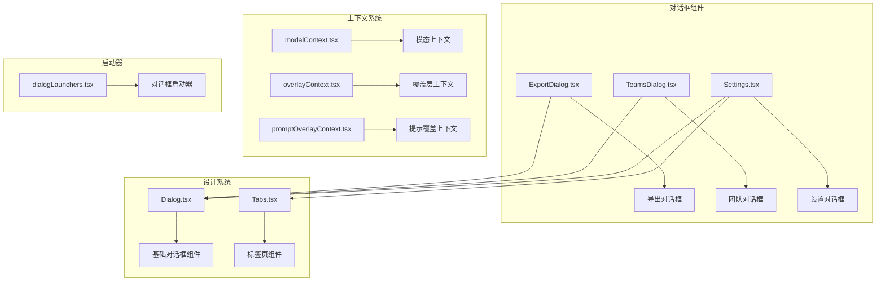
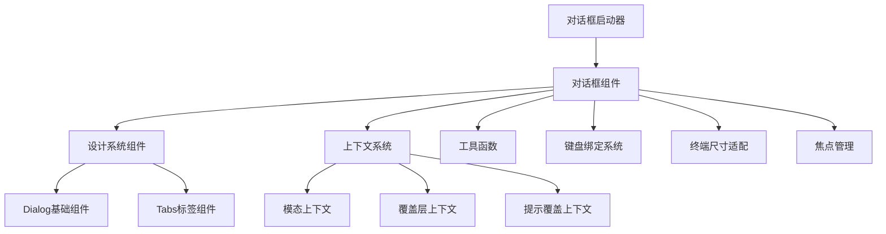
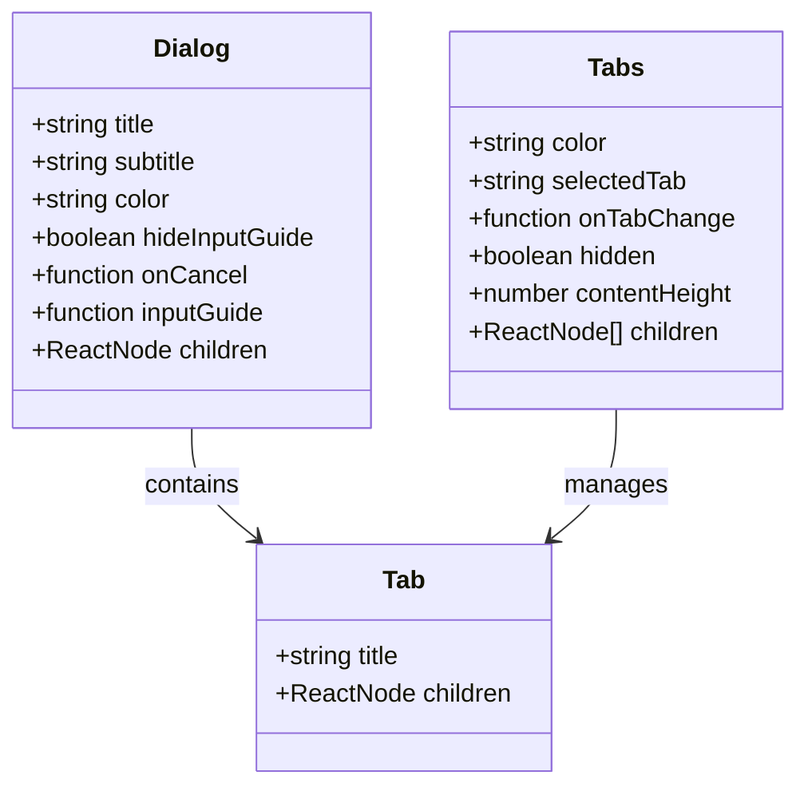
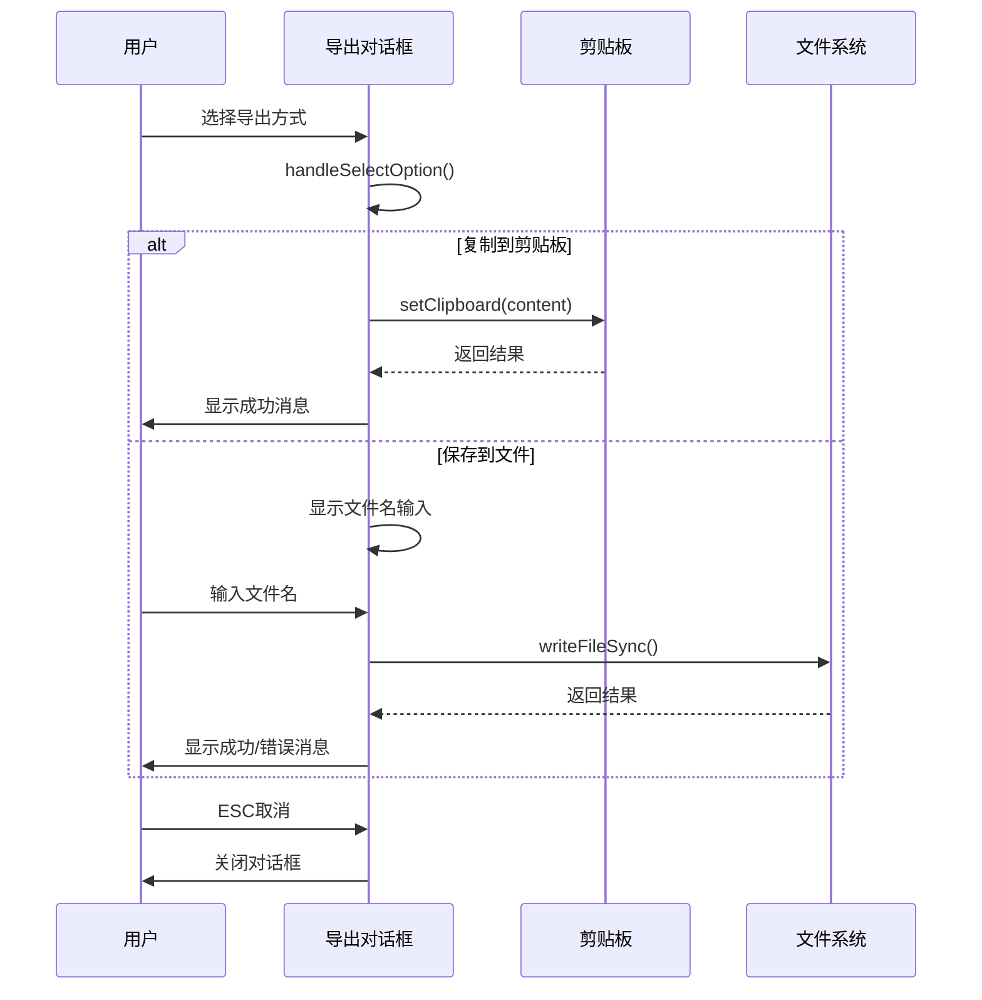
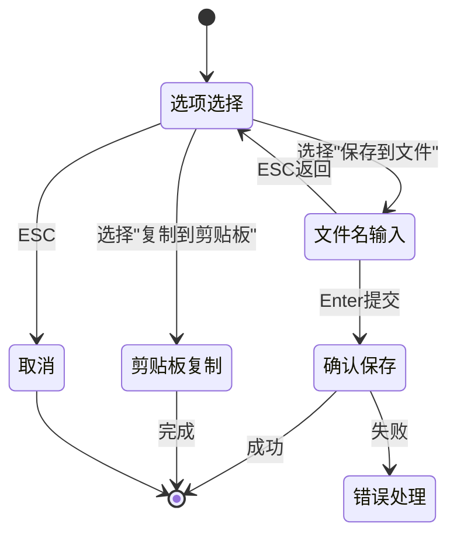
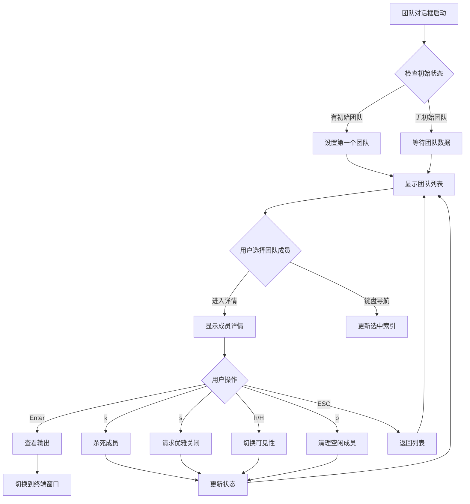
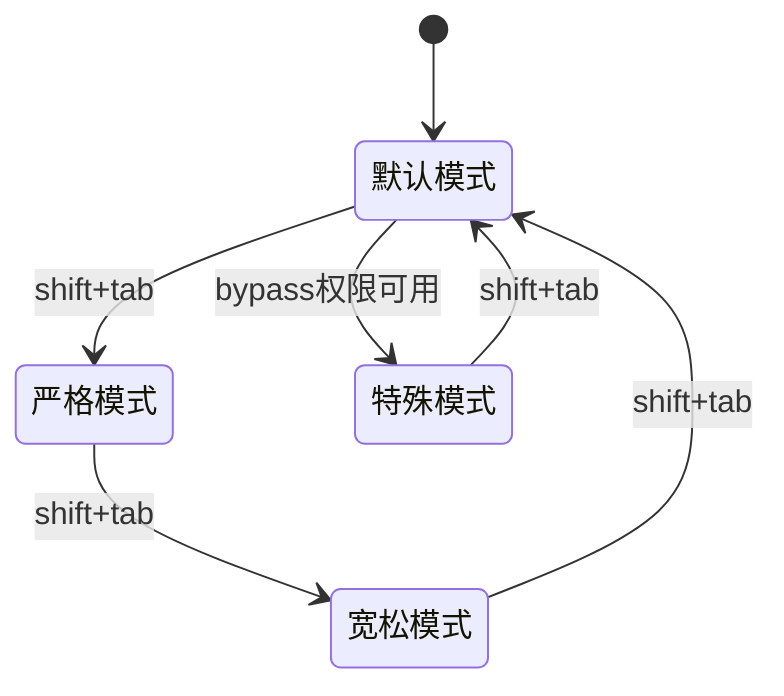
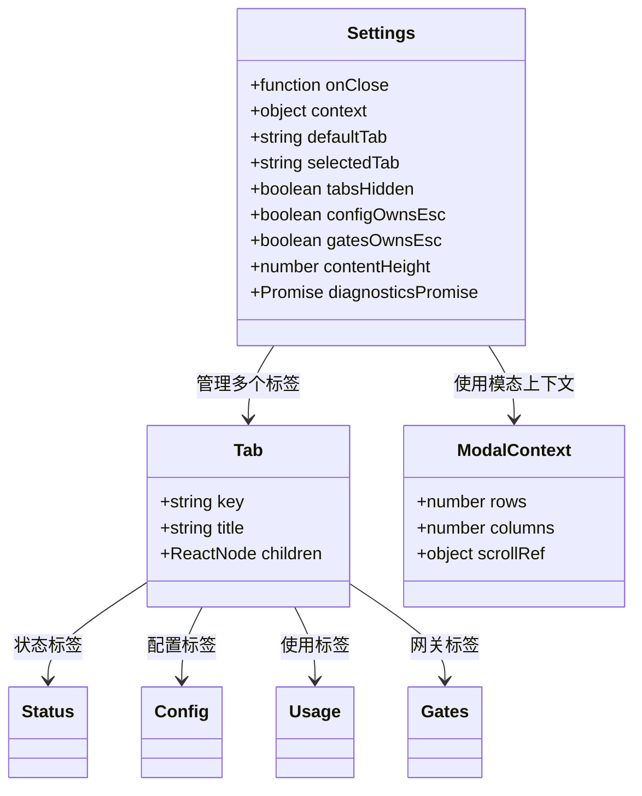
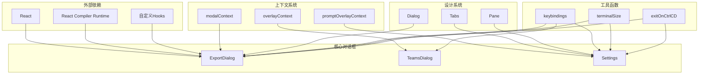
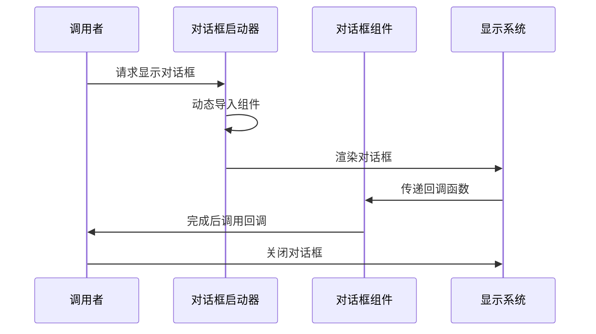

# 对话框系统

<cite>
**本文档引用的文件**
- [ExportDialog.tsx](file://src/components/ExportDialog.tsx)
- [modalContext.tsx](file://src/context/modalContext.tsx)
- [TeamsDialog.tsx](file://src/components/teams/TeamsDialog.tsx)
- [Settings.tsx](file://src/components/Settings/Settings.tsx)
- [dialogLaunchers.tsx](file://src/dialogLaunchers.tsx)
- [Dialog.tsx](file://src/components/design-system/Dialog.tsx)
- [Tabs.tsx](file://src/components/design-system/Tabs.tsx)
</cite>

## 目录
1. [简介](#简介)
2. [项目结构](#项目结构)
3. [核心组件](#核心组件)
4. [架构概览](#架构概览)
5. [详细组件分析](#详细组件分析)
6. [依赖关系分析](#依赖关系分析)
7. [性能考虑](#性能考虑)
8. [故障排除指南](#故障排除指南)
9. [结论](#结论)

## 简介

Claude Code 的对话框系统是一个高度模块化和可扩展的组件架构，专门用于在终端环境中提供丰富的交互体验。该系统支持多种类型的对话框，从简单的确认对话框到复杂的多步骤向导，涵盖了从设置管理到团队协作的各种场景。

系统的核心设计理念是提供一致的用户体验，同时保持组件的独立性和可重用性。所有对话框都遵循统一的接口规范，支持模态显示、键盘导航、响应式布局等通用功能。

## 项目结构

对话框系统主要分布在以下目录中：

**图表来源**
- [ExportDialog.tsx:1-128](file://src/components/ExportDialog.tsx#L1-L128)
- [TeamsDialog.tsx:1-715](file://src/components/teams/TeamsDialog.tsx#L1-L715)
- [Settings.tsx:1-137](file://src/components/Settings/Settings.tsx#L1-L137)

**章节来源**
- [ExportDialog.tsx:1-128](file://src/components/ExportDialog.tsx#L1-L128)
- [TeamsDialog.tsx:1-715](file://src/components/teams/TeamsDialog.tsx#L1-L715)
- [Settings.tsx:1-137](file://src/components/Settings/Settings.tsx#L1-L137)

## 核心组件

### 导出对话框 (ExportDialog)

导出对话框提供了两种导出选项：复制到剪贴板和保存到文件。它展示了完整的对话框生命周期管理，包括状态管理、数据验证和用户反馈。

**主要特性：**
- 支持两种导出方式的选择
- 实时文件名输入和验证
- 剪贴板集成
- 文件系统操作
- 错误处理和用户反馈

### 团队对话框 (TeamsDialog)

团队对话框是一个复杂的多层级界面，用于管理团队成员和权限模式。它实现了深度导航、实时状态更新和键盘快捷键支持。

**主要特性：**
- 多层级导航（团队列表 → 成员详情）
- 实时团队状态刷新
- 权限模式循环切换
- 终端集成（tmux/iTerm2）
- 批量操作支持

### 设置对话框 (Settings)

设置对话框提供了完整的应用配置管理界面，支持标签页导航和响应式布局。

**主要特性：**
- 标签页式组织
- 响应式内容高度调整
- 搜索模式集成
- 配置项编辑
- 诊断信息展示

**章节来源**
- [ExportDialog.tsx:16-29](file://src/components/ExportDialog.tsx#L16-L29)
- [TeamsDialog.tsx:32-35](file://src/components/teams/TeamsDialog.tsx#L32-L35)
- [Settings.tsx:15-21](file://src/components/Settings/Settings.tsx#L15-L21)

## 架构概览

对话框系统采用分层架构设计，确保了良好的可维护性和扩展性：

**图表来源**
- [dialogLaunchers.tsx:1-133](file://src/dialogLaunchers.tsx#L1-L133)
- [modalContext.tsx:22-27](file://src/context/modalContext.tsx#L22-L27)

### 设计系统组件

设计系统提供了对话框的基础构建块：

**图表来源**
- [Dialog.tsx](file://src/components/design-system/Dialog.tsx)
- [Tabs.tsx](file://src/components/design-system/Tabs.tsx)

## 详细组件分析

### 导出对话框组件分析

导出对话框展示了完整的对话框实现模式：

**图表来源**
- [ExportDialog.tsx:43-88](file://src/components/ExportDialog.tsx#L43-L88)

#### 状态管理机制

导出对话框使用React状态管理来跟踪对话框的不同阶段：

**图表来源**
- [ExportDialog.tsx:30-88](file://src/components/ExportDialog.tsx#L30-L88)

**章节来源**
- [ExportDialog.tsx:1-128](file://src/components/ExportDialog.tsx#L1-L128)

### 团队对话框组件分析

团队对话框是最复杂的对话框组件，实现了完整的多层级导航和实时状态管理：

**图表来源**
- [TeamsDialog.tsx:58-220](file://src/components/teams/TeamsDialog.tsx#L58-L220)

#### 权限模式管理系统

团队对话框实现了复杂的权限模式循环机制：

**图表来源**
- [TeamsDialog.tsx:665-674](file://src/components/teams/TeamsDialog.tsx#L665-L674)

**章节来源**
- [TeamsDialog.tsx:1-715](file://src/components/teams/TeamsDialog.tsx#L1-L715)

### 设置对话框组件分析

设置对话框展示了如何实现复杂的标签页管理和响应式布局：

**图表来源**
- [Settings.tsx:15-31](file://src/components/Settings/Settings.tsx#L15-L31)
- [modalContext.tsx:22-27](file://src/context/modalContext.tsx#L22-L27)

**章节来源**
- [Settings.tsx:1-137](file://src/components/Settings/Settings.tsx#L1-L137)

## 依赖关系分析

对话框系统展现了清晰的依赖层次结构：

**图表来源**
- [ExportDialog.tsx:1-16](file://src/components/ExportDialog.tsx#L1-L16)
- [TeamsDialog.tsx:1-31](file://src/components/teams/TeamsDialog.tsx#L1-L31)
- [Settings.tsx:1-14](file://src/components/Settings/Settings.tsx#L1-L14)

### 启动器模式

对话框系统采用了统一的启动器模式，确保所有对话框具有一致的行为：

**图表来源**
- [dialogLaunchers.tsx:29-38](file://src/dialogLaunchers.tsx#L29-L38)

**章节来源**
- [dialogLaunchers.tsx:1-133](file://src/dialogLaunchers.tsx#L1-L133)

## 性能考虑

对话框系统在性能方面采用了多项优化策略：

### 内存优化
- 使用React.memo缓存计算结果
- 条件渲染减少不必要的组件更新
- 上下文系统避免重复计算

### 渲染优化
- 模态上下文提供精确的尺寸信息
- 延迟加载非关键组件
- 防抖和节流处理高频操作

### 状态管理
- 最小化状态更新范围
- 使用不可变数据结构
- 合理的状态拆分和组合

## 故障排除指南

### 常见问题及解决方案

**问题1：对话框无法关闭**
- 检查onCancel回调是否正确传递
- 验证键盘绑定是否被其他组件拦截
- 确认覆盖层注册状态

**问题2：模态显示异常**
- 检查模态上下文提供者是否正确配置
- 验证终端尺寸检测逻辑
- 确认CSS样式冲突

**问题3：键盘导航失效**
- 检查keybindings配置
- 验证useExitOnCtrlCDWithKeybindings钩子
- 确认焦点管理逻辑

**章节来源**
- [modalContext.tsx:1-58](file://src/context/modalContext.tsx#L1-L58)
- [dialogLaunchers.tsx:29-52](file://src/dialogLaunchers.tsx#L29-L52)

## 结论

Claude Code 的对话框系统展现了现代前端架构的最佳实践。通过模块化设计、清晰的依赖关系和完善的上下文系统，该系统为复杂的终端应用提供了强大而灵活的交互能力。

系统的主要优势包括：
- **一致性**：统一的接口和行为模式
- **可扩展性**：模块化的组件架构
- **可维护性**：清晰的代码组织和文档
- **用户体验**：丰富的交互特性和无障碍支持

未来可以考虑的改进方向：
- 更完善的类型安全
- 增强的测试覆盖率
- 性能监控和分析
- 更丰富的主题和样式定制选项