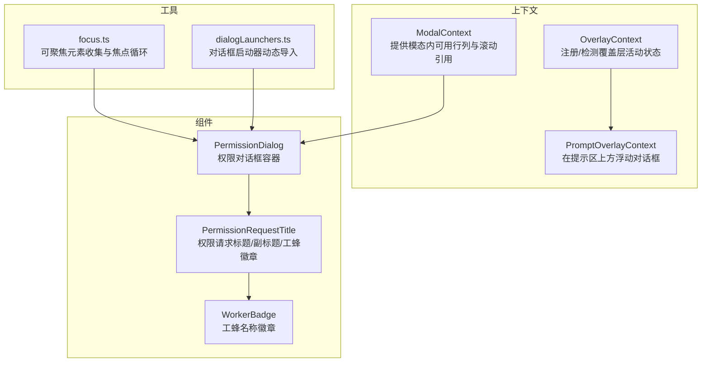
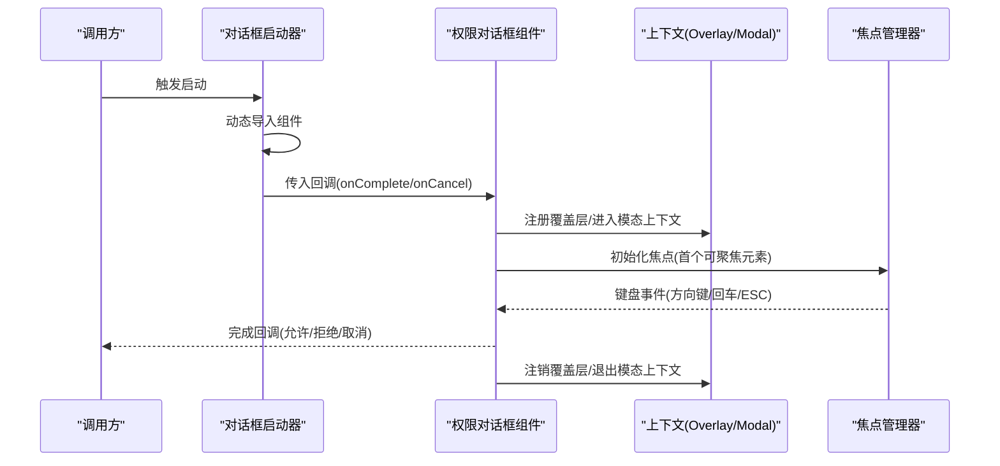
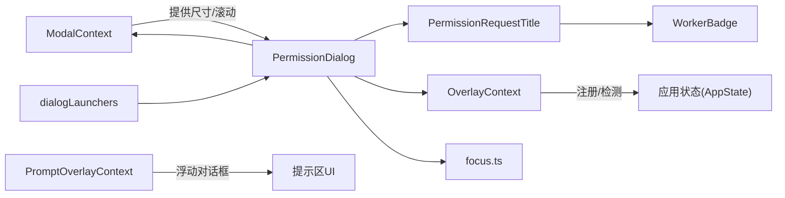
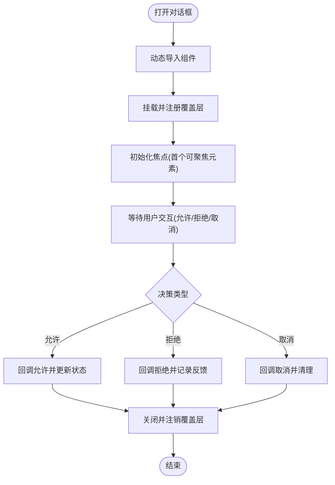

# 模态对话框

<cite>
**本文引用的文件**
- [modalContext.tsx](file://src/context/modalContext.tsx)
- [overlayContext.tsx](file://src/context/overlayContext.tsx)
- [PermissionDialog.tsx](file://src/components/permissions/PermissionDialog.tsx)
- [PermissionRequestTitle.tsx](file://src/components/permissions/PermissionRequestTitle.tsx)
- [WorkerBadge.tsx](file://src/components/permissions/WorkerBadge.tsx)
- [dialogLaunchers.tsx](file://src/dialogLaunchers.tsx)
- [focus.ts](file://src/ink/focus.ts)
- [promptOverlayContext.tsx](file://src/context/promptOverlayContext.tsx)
</cite>

## 目录
1. [简介](#简介)
2. [项目结构](#项目结构)
3. [核心组件](#核心组件)
4. [架构总览](#架构总览)
5. [组件详解](#组件详解)
6. [依赖关系分析](#依赖关系分析)
7. [性能考量](#性能考量)
8. [故障排查指南](#故障排查指南)
9. [结论](#结论)
10. [附录](#附录)

## 简介
本文件面向 Claude Code 的模态对话框体系，系统化梳理其架构与实现要点，覆盖以下主题：
- 背景遮罩与层级管理：通过上下文与覆盖层机制协调多层弹窗与输入焦点。
- 焦点管理与键盘交互：基于可聚焦元素收集与循环遍历，确保键盘可达性。
- 生命周期与状态同步：打开/关闭流程、状态持久化与跨组件同步。
- 权限对话框的特殊实现：权限请求、用户确认与决策处理链路。
- 通用配置选项：标题、内容区、按钮配置与尺寸设置建议。
- 可访问性：ARIA 标签、焦点循环与键盘导航策略。
- 样式定制与响应式设计：基于终端尺寸与上下文的适配方案。

## 项目结构
模态对话框相关能力由“上下文 + 组件 + 工具”三层构成：
- 上下文层：负责状态共享与尺寸/滚动等上下文信息传递（如 ModalContext、OverlayContext）。
- 组件层：提供通用对话框容器与权限对话框等具体实现。
- 工具层：提供焦点管理、覆盖层注册与对话框启动器等基础设施。

图表来源
- [modalContext.tsx:1-58](file://src/context/modalContext.tsx#L1-L58)
- [overlayContext.tsx:1-150](file://src/context/overlayContext.tsx#L1-L150)
- [promptOverlayContext.tsx:70-124](file://src/context/promptOverlayContext.tsx#L70-L124)
- [PermissionDialog.tsx:1-72](file://src/components/permissions/PermissionDialog.tsx#L1-L72)
- [PermissionRequestTitle.tsx:1-66](file://src/components/permissions/PermissionRequestTitle.tsx#L1-L66)
- [WorkerBadge.tsx:1-49](file://src/components/permissions/WorkerBadge.tsx#L1-L49)
- [focus.ts:74-181](file://src/ink/focus.ts#L74-L181)
- [dialogLaunchers.tsx:1-133](file://src/dialogLaunchers.tsx#L1-L133)

章节来源
- [modalContext.tsx:1-58](file://src/context/modalContext.tsx#L1-L58)
- [overlayContext.tsx:1-150](file://src/context/overlayContext.tsx#L1-L150)
- [PermissionDialog.tsx:1-72](file://src/components/permissions/PermissionDialog.tsx#L1-L72)
- [PermissionRequestTitle.tsx:1-66](file://src/components/permissions/PermissionRequestTitle.tsx#L1-L66)
- [WorkerBadge.tsx:1-49](file://src/components/permissions/WorkerBadge.tsx#L1-L49)
- [dialogLaunchers.tsx:1-133](file://src/dialogLaunchers.tsx#L1-L133)
- [focus.ts:74-181](file://src/ink/focus.ts#L74-L181)
- [promptOverlayContext.tsx:70-124](file://src/context/promptOverlayContext.tsx#L70-L124)

## 核心组件
- 模态上下文（ModalContext）
  - 提供模态内部可用的行/列数与滚动引用，用于组件在模态内正确计算高度与重置滚动。
- 覆盖层上下文（OverlayContext）
  - 注册/检测覆盖层活动状态，区分模态与非模态覆盖层，影响输入焦点行为。
- 权限对话框（PermissionDialog）
  - 权限请求的容器组件，支持标题、副标题、颜色、内边距、右侧装饰与子内容。
- 权限请求标题（PermissionRequestTitle）
  - 渲染权限请求标题与副标题，并可选显示工蜂徽章。
- 工蜂徽章（WorkerBadge）
  - 显示工蜂名称与颜色徽章，标识发起权限请求的执行方。
- 对话框启动器（dialogLaunchers.tsx）
  - 动态导入并统一挂载对话框，标准化完成回调与取消回调的约定。

章节来源
- [modalContext.tsx:1-58](file://src/context/modalContext.tsx#L1-L58)
- [overlayContext.tsx:1-150](file://src/context/overlayContext.tsx#L1-L150)
- [PermissionDialog.tsx:1-72](file://src/components/permissions/PermissionDialog.tsx#L1-L72)
- [PermissionRequestTitle.tsx:1-66](file://src/components/permissions/PermissionRequestTitle.tsx#L1-L66)
- [WorkerBadge.tsx:1-49](file://src/components/permissions/WorkerBadge.tsx#L1-L49)
- [dialogLaunchers.tsx:1-133](file://src/dialogLaunchers.tsx#L1-L133)

## 架构总览
模态对话框的运行时交互涉及“启动 -> 渲染 -> 焦点管理 -> 决策处理 -> 关闭”的闭环：

图表来源
- [dialogLaunchers.tsx:1-133](file://src/dialogLaunchers.tsx#L1-L133)
- [overlayContext.tsx:38-104](file://src/context/overlayContext.tsx#L38-L104)
- [modalContext.tsx:22-27](file://src/context/modalContext.tsx#L22-L27)
- [focus.ts:110-131](file://src/ink/focus.ts#L110-L131)

## 组件详解

### 模态上下文（ModalContext）
- 作用
  - 在 FullscreenLayout 的 modal 插槽中提供模态内部可用的行列数，避免组件误用全局终端尺寸导致溢出。
  - 提供滚动引用，便于切换标签页时重置滚动位置。
- 关键接口
  - useIsInsideModal：判断是否处于模态内部。
  - useModalOrTerminalSize：优先使用模态内可用尺寸，否则回退到传入的终端尺寸。
  - useModalScrollRef：获取模态内的滚动引用。

章节来源
- [modalContext.tsx:1-58](file://src/context/modalContext.tsx#L1-L58)

### 覆盖层上下文（OverlayContext）
- 作用
  - 统一追踪当前活跃的覆盖层，用于 ESC 键处理与输入焦点协调。
  - 区分模态覆盖层与非模态覆盖层（如自动完成），后者不阻断输入焦点。
- 关键接口
  - useRegisterOverlay：在挂载时注册覆盖层，在卸载时注销。
  - useIsOverlayActive：任意覆盖层是否激活。
  - useIsModalOverlayActive：是否存在模态覆盖层。

章节来源
- [overlayContext.tsx:1-150](file://src/context/overlayContext.tsx#L1-L150)

### 权限对话框（PermissionDialog）
- 作用
  - 权限请求的容器，统一标题、副标题、颜色、内边距与右侧装饰布局。
- 配置项
  - 标题：title（必填）
  - 副标题：subtitle（可选）
  - 颜色：color（主题键，默认“permission”）
  - 标题颜色：titleColor（可选）
  - 内边距 X：innerPaddingX（默认 1）
  - 工蜂徽章：workerBadge（可选）
  - 标题右侧装饰：titleRight（可选）
  - 子内容：children（必填）

章节来源
- [PermissionDialog.tsx:1-72](file://src/components/permissions/PermissionDialog.tsx#L1-L72)

### 权限请求标题（PermissionRequestTitle）
- 作用
  - 渲染主标题与副标题；当存在工蜂徽章时显示“· @工蜂名”。
- 行为
  - 主标题加粗并按 color 应用主题色。
  - 副标题支持字符串截断或自定义节点。
  - 工蜂徽章通过 WorkerBadge 渲染彩色圆点与名称。

章节来源
- [PermissionRequestTitle.tsx:1-66](file://src/components/permissions/PermissionRequestTitle.tsx#L1-L66)

### 工蜂徽章（WorkerBadge）
- 作用
  - 将颜色映射为终端可用的颜色值，渲染“● @名称”的徽章。
- 注意
  - 名称前缀为固定符号，颜色通过工具函数转换为 Ink 可用颜色。

章节来源
- [WorkerBadge.tsx:1-49](file://src/components/permissions/WorkerBadge.tsx#L1-L49)

### 对话框启动器（dialogLaunchers.tsx）
- 作用
  - 统一对话框的动态导入与挂载，标准化完成/取消回调。
- 典型模式
  - onComplete/onCancel 回调统一命名为 done。
  - 保持与原内联调用一致的回调语义，零行为变更。

章节来源
- [dialogLaunchers.tsx:1-133](file://src/dialogLaunchers.tsx#L1-L133)

### 焦点管理与键盘交互（focus.ts）
- 作用
  - 收集可聚焦元素（tabIndex>=0），在根节点内进行循环焦点移动。
- 关键逻辑
  - focusNext/focusPrevious：根据方向计算下一个焦点元素并聚焦。
  - moveFocus：若当前无焦点则从头或尾开始，否则按模运算循环。
  - isInTree/getRootNode/getFocusManager：辅助定位焦点根节点与管理器。

章节来源
- [focus.ts:74-181](file://src/ink/focus.ts#L74-L181)

### 提示区覆盖层（promptOverlayContext.tsx）
- 作用
  - 在提示输入区上方浮动展示对话框节点，挂载后在卸载时自动清理。
- 接口
  - useSetPromptOverlay/useSetPromptOverlayDialog：注册/清理提示区覆盖层。

章节来源
- [promptOverlayContext.tsx:70-124](file://src/context/promptOverlayContext.tsx#L70-L124)

## 依赖关系分析

图表来源
- [overlayContext.tsx:38-104](file://src/context/overlayContext.tsx#L38-L104)
- [modalContext.tsx:22-57](file://src/context/modalContext.tsx#L22-L57)
- [PermissionDialog.tsx:17-71](file://src/components/permissions/PermissionDialog.tsx#L17-L71)
- [PermissionRequestTitle.tsx:12-65](file://src/components/permissions/PermissionRequestTitle.tsx#L12-L65)
- [WorkerBadge.tsx:15-48](file://src/components/permissions/WorkerBadge.tsx#L15-L48)
- [dialogLaunchers.tsx:29-51](file://src/dialogLaunchers.tsx#L29-L51)
- [focus.ts:110-131](file://src/ink/focus.ts#L110-L131)
- [promptOverlayContext.tsx:101-124](file://src/context/promptOverlayContext.tsx#L101-L124)

章节来源
- [overlayContext.tsx:1-150](file://src/context/overlayContext.tsx#L1-L150)
- [modalContext.tsx:1-58](file://src/context/modalContext.tsx#L1-L58)
- [PermissionDialog.tsx:1-72](file://src/components/permissions/PermissionDialog.tsx#L1-L72)
- [PermissionRequestTitle.tsx:1-66](file://src/components/permissions/PermissionRequestTitle.tsx#L1-L66)
- [WorkerBadge.tsx:1-49](file://src/components/permissions/WorkerBadge.tsx#L1-L49)
- [dialogLaunchers.tsx:1-133](file://src/dialogLaunchers.tsx#L1-L133)
- [focus.ts:74-181](file://src/ink/focus.ts#L74-L181)
- [promptOverlayContext.tsx:70-124](file://src/context/promptOverlayContext.tsx#L70-L124)

## 性能考量
- 动态导入与懒加载
  - 启动器采用动态导入，仅在需要时加载对话框组件，降低初始包体与首帧压力。
- 渲染优化
  - 使用 React 编译器缓存与局部变量复用，减少不必要的重渲染（例如 PermissionDialog/PermissionRequestTitle 中对 props 的缓存）。
- 焦点计算
  - 可聚焦元素收集与遍历在根节点范围内进行，避免全树扫描；在无可聚焦元素时快速返回。

[本节为通用指导，无需特定文件引用]

## 故障排查指南
- ESC 键冲突
  - 症状：按下 ESC 时同时触发对话框关闭与任务取消。
  - 处理：确认覆盖层已通过 OverlayContext 注册，使用 useIsOverlayActive 判断是否应拦截 ESC。
- 输入焦点异常
  - 症状：模态内无法通过 Tab 键循环聚焦，或焦点未回到首个元素。
  - 处理：检查焦点管理器是否启用，确认根节点内存在 tabIndex>=0 的元素；必要时手动初始化焦点。
- 模态内溢出
  - 症状：列表或选择器在模态内溢出。
  - 处理：使用 useModalOrTerminalSize 获取模态内可用行列，避免直接使用全局终端尺寸。
- 工蜂徽章颜色不生效
  - 症状：徽章颜色显示异常。
  - 处理：确认颜色值可通过颜色转换工具映射为 Ink 可用颜色。

章节来源
- [overlayContext.tsx:38-104](file://src/context/overlayContext.tsx#L38-L104)
- [focus.ts:110-131](file://src/ink/focus.ts#L110-L131)
- [modalContext.tsx:38-54](file://src/context/modalContext.tsx#L38-L54)
- [WorkerBadge.tsx:21-29](file://src/components/permissions/WorkerBadge.tsx#L21-L29)

## 结论
Claude Code 的模态对话框体系以“上下文 + 组件 + 工具”协同工作：
- ModalContext 与 OverlayContext 提供稳定的上下文与覆盖层管理；
- PermissionDialog 及其子组件形成清晰的权限对话框组合；
- focus.ts 提供可靠的键盘可达性保障；
- dialogLaunchers.tsx 统一启动流程，保证一致性与可维护性。

该架构在可访问性、可扩展性与性能之间取得平衡，适合在终端 UI 场景中复用与演进。

[本节为总结，无需特定文件引用]

## 附录

### 生命周期与状态同步（概念流程）

[本图为概念流程，不对应具体源码文件]