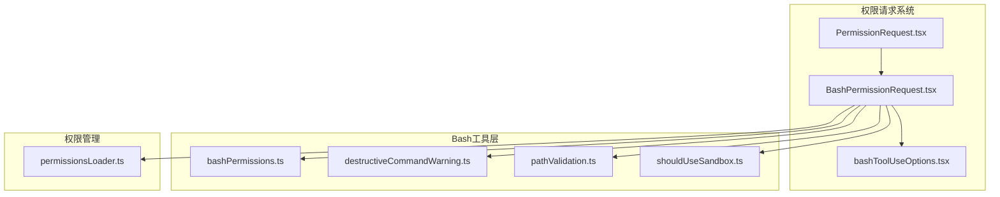
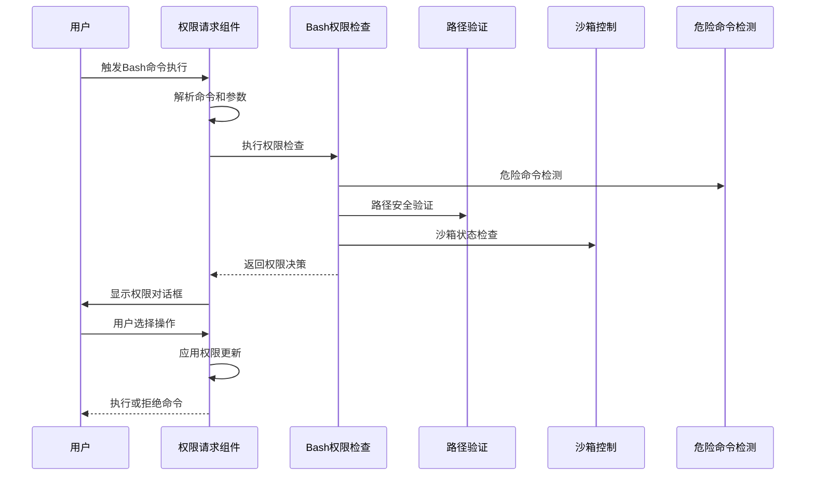
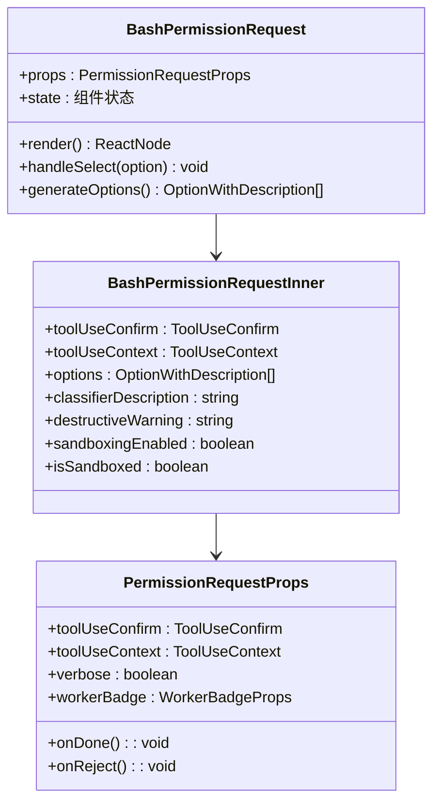
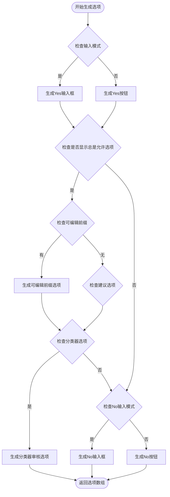
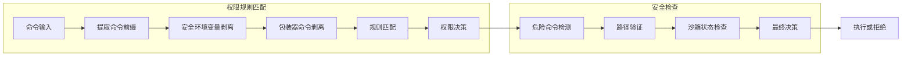
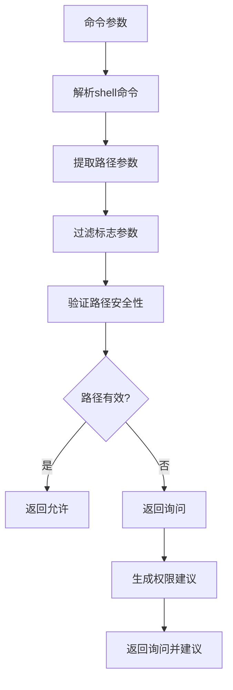
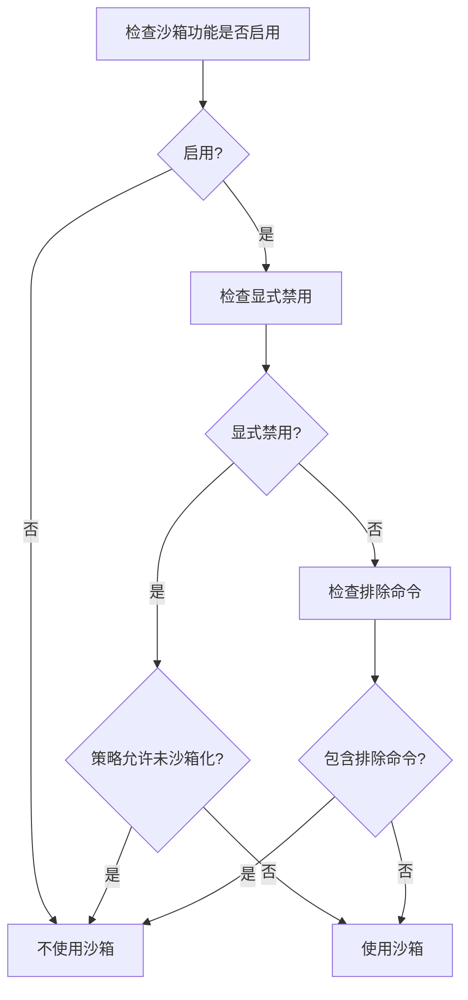
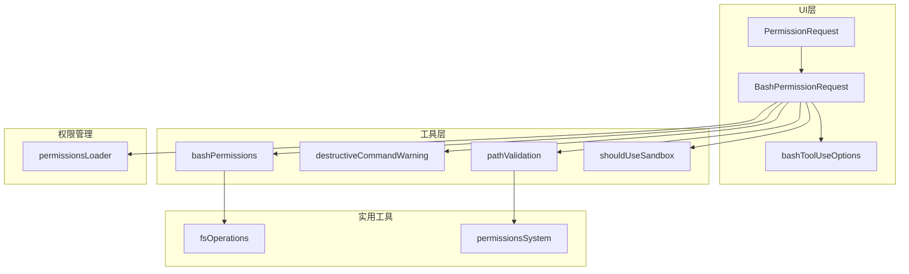

# Bash权限请求对话框

<cite>
**本文档引用的文件**
- [BashPermissionRequest.tsx](file://src/components/permissions/BashPermissionRequest/BashPermissionRequest.tsx)
- [bashToolUseOptions.tsx](file://src/components/permissions/BashPermissionRequest/bashToolUseOptions.tsx)
- [PermissionRequest.tsx](file://src/components/permissions/PermissionRequest.tsx)
- [bashPermissions.ts](file://src/tools/BashTool/bashPermissions.ts)
- [destructiveCommandWarning.ts](file://src/tools/BashTool/destructiveCommandWarning.ts)
- [pathValidation.ts](file://src/tools/BashTool/pathValidation.ts)
- [shouldUseSandbox.ts](file://src/tools/BashTool/shouldUseSandbox.ts)
- [permissionsLoader.ts](file://src/utils/permissions/permissionsLoader.ts)
</cite>

## 目录
1. [简介](#简介)
2. [项目结构](#项目结构)
3. [核心组件](#核心组件)
4. [架构概览](#架构概览)
5. [详细组件分析](#详细组件分析)
6. [依赖关系分析](#依赖关系分析)
7. [性能考虑](#性能考虑)
8. [故障排除指南](#故障排除指南)
9. [结论](#结论)

## 简介

Bash权限请求对话框是Claude Code中用于处理Bash命令执行权限申请和确认的核心组件。该系统通过多层安全检查和智能建议机制，确保用户在执行潜在危险的Bash命令时能够做出知情决策。

该组件提供了完整的权限管理流程，包括命令解析、参数验证、危险命令检测、路径验证、沙箱控制等功能。系统采用渐进式权限控制策略，既保证了安全性，又提供了良好的用户体验。

## 项目结构

Bash权限请求对话框位于项目的权限管理系统中，主要由以下层次组成：

**图表来源**
- [PermissionRequest.tsx:47-82](file://src/components/permissions/PermissionRequest.tsx#L47-L82)
- [BashPermissionRequest.tsx:71-133](file://src/components/permissions/BashPermissionRequest/BashPermissionRequest.tsx#L71-L133)

**章节来源**
- [PermissionRequest.tsx:1-217](file://src/components/permissions/PermissionRequest.tsx#L1-L217)
- [BashPermissionRequest.tsx:1-482](file://src/components/permissions/BashPermissionRequest/BashPermissionRequest.tsx#L1-L482)

## 核心组件

### Bash权限请求主组件

BashPermissionRequest组件是整个权限系统的入口点，负责协调所有权限检查和用户交互逻辑。

**主要功能特性：**
- 命令解析和预处理
- 智能权限建议生成
- 危险命令检测
- 路径安全验证
- 沙箱控制集成
- 用户反馈收集

### 工具使用选项生成器

bashToolUseOptions组件专门负责生成用户可选择的操作选项，包括：

- **直接批准**：立即执行命令
- **应用建议**：使用系统推荐的权限规则
- **编辑前缀**：允许用户自定义权限规则
- **分类器审核**：基于AI分类器的智能审批

**章节来源**
- [BashPermissionRequest.tsx:135-482](file://src/components/permissions/BashPermissionRequest/BashPermissionRequest.tsx#L135-L482)
- [bashToolUseOptions.tsx:31-147](file://src/components/permissions/BashPermissionRequest/bashToolUseOptions.tsx#L31-L147)

## 架构概览

Bash权限请求对话框采用分层架构设计，确保各组件职责清晰且相互独立：

**图表来源**
- [BashPermissionRequest.tsx:183-193](file://src/components/permissions/BashPermissionRequest/BashPermissionRequest.tsx#L183-L193)
- [bashPermissions.ts:778-800](file://src/tools/BashTool/bashPermissions.ts#L778-L800)

## 详细组件分析

### Bash权限请求组件深度分析

#### 组件结构和生命周期

**图表来源**
- [BashPermissionRequest.tsx:71-133](file://src/components/permissions/BashPermissionRequest/BashPermissionRequest.tsx#L71-L133)
- [BashPermissionRequest.tsx:135-482](file://src/components/permissions/BashPermissionRequest/BashPermissionRequest.tsx#L135-L482)

#### 权限检查流程

组件采用异步权限检查机制，支持以下检查类型：

1. **命令解析检查**：验证命令语法和参数有效性
2. **危险命令检测**：识别潜在破坏性操作
3. **路径安全验证**：确保文件操作在允许范围内
4. **沙箱状态检查**：确定执行环境的安全级别

**章节来源**
- [BashPermissionRequest.tsx:263-282](file://src/components/permissions/BashPermissionRequest/BashPermissionRequest.tsx#L263-L282)
- [BashPermissionRequest.tsx:320-426](file://src/components/permissions/BashPermissionRequest/BashPermissionRequest.tsx#L320-L426)

### 工具使用选项生成器

#### 选项生成策略

**图表来源**
- [bashToolUseOptions.tsx:61-146](file://src/components/permissions/BashPermissionRequest/bashToolUseOptions.tsx#L61-L146)

#### 选项类型详解

| 选项类型 | 描述 | 使用场景 |
|---------|------|----------|
| `yes` | 直接批准命令执行 | 简单命令或已知安全命令 |
| `yes-apply-suggestions` | 应用系统推荐的权限规则 | 复杂命令但有明确权限需求 |
| `yes-prefix-edited` | 允许用户自定义权限规则 | 需要特定权限范围的命令 |
| `yes-classifier-reviewed` | 基于AI分类器的智能审批 | 需要上下文理解的复杂命令 |
| `no` | 拒绝命令执行 | 不安全或不合适的命令 |

**章节来源**
- [bashToolUseOptions.tsx:31-147](file://src/components/permissions/BashPermissionRequest/bashToolUseOptions.tsx#L31-L147)

### Bash权限检查系统

#### 权限规则匹配机制

**图表来源**
- [bashPermissions.ts:524-615](file://src/tools/BashTool/bashPermissions.ts#L524-L615)
- [bashPermissions.ts:778-800](file://src/tools/BashTool/bashPermissions.ts#L778-L800)

#### 安全环境变量处理

系统实现了多层次的安全环境变量处理机制：

1. **白名单环境变量**：仅允许预定义的安全变量
2. **ANT专用变量**：内部用户可用的额外变量
3. **动态剥离**：运行时自动移除不安全的环境变量

**章节来源**
- [bashPermissions.ts:378-497](file://src/tools/BashTool/bashPermissions.ts#L378-L497)
- [bashPermissions.ts:524-615](file://src/tools/BashTool/bashPermissions.ts#L524-L615)

### 路径验证系统

#### 路径提取和验证流程

**图表来源**
- [pathValidation.ts:190-509](file://src/tools/BashTool/pathValidation.ts#L190-L509)

#### 支持的命令类型

系统支持对以下命令进行路径验证：

| 命令类别 | 支持的命令 | 操作类型 |
|---------|-----------|----------|
| 文件操作 | `rm`, `rmdir`, `mv`, `cp` | 写入/删除 |
| 目录操作 | `mkdir`, `ls`, `find` | 创建/读取 |
| 文本处理 | `cat`, `head`, `tail`, `grep` | 读取 |
| 系统信息 | `stat`, `file`, `diff` | 读取 |
| 特殊工具 | `sed`, `jq`, `git` | 读取/写入 |

**章节来源**
- [pathValidation.ts:27-64](file://src/tools/BashTool/pathValidation.ts#L27-L64)
- [pathValidation.ts:596-601](file://src/tools/BashTool/pathValidation.ts#L596-L601)

### 沙箱控制系统

#### 沙箱决策流程

**图表来源**
- [shouldUseSandbox.ts:130-153](file://src/tools/BashTool/shouldUseSandbox.ts#L130-L153)

#### 排除命令匹配机制

系统支持多种排除命令匹配方式：

1. **用户配置排除**：从设置中读取排除列表
2. **动态配置排除**：根据用户类型动态调整
3. **复合命令分解**：将复杂命令分解为子命令逐一检查

**章节来源**
- [shouldUseSandbox.ts:21-128](file://src/tools/BashTool/shouldUseSandbox.ts#L21-L128)

## 依赖关系分析

### 组件间依赖关系

**图表来源**
- [PermissionRequest.tsx:47-82](file://src/components/permissions/PermissionRequest.tsx#L47-L82)
- [BashPermissionRequest.tsx:10-33](file://src/components/permissions/BashPermissionRequest/BashPermissionRequest.tsx#L10-L33)

### 关键依赖项

| 依赖项 | 用途 | 版本要求 |
|-------|------|----------|
| react/compiler-runtime | React编译优化 | 最新版本 |
| bun:bundle | 功能特性检测 | 最新版本 |
| figures | 图标字符渲染 | 最新版本 |
| @anthropic-ai/sdk | API通信 | 兼容版本 |
| zod/v4 | 类型验证 | v4.x |

**章节来源**
- [BashPermissionRequest.tsx:1-33](file://src/components/permissions/BashPermissionRequest/BashPermissionRequest.tsx#L1-L33)
- [PermissionRequest.tsx:1-46](file://src/components/permissions/PermissionRequest.tsx#L1-L46)

## 性能考虑

### 渲染性能优化

系统采用了多项性能优化措施：

1. **组件分离**：将复杂的权限检查逻辑分离到独立组件中
2. **记忆化缓存**：使用useMemo避免不必要的重新计算
3. **异步加载**：分类器检查异步执行，不影响主界面响应
4. **条件渲染**：根据用户输入动态决定渲染内容

### 内存管理

- **状态清理**：及时清理不再使用的状态和事件监听器
- **资源释放**：在组件卸载时释放定时器和网络连接
- **缓存策略**：合理使用缓存避免重复计算

## 故障排除指南

### 常见问题诊断

#### 权限请求不显示

**可能原因：**
- Bash工具未正确注册
- 权限系统初始化失败
- 命令格式不正确

**解决步骤：**
1. 检查Bash工具是否在权限组件映射中
2. 验证工具使用上下文的有效性
3. 确认命令输入格式符合预期

#### 权限建议不准确

**可能原因：**
- 分类器功能未启用
- 命令解析错误
- 规则匹配算法问题

**解决步骤：**
1. 检查分类器功能配置
2. 验证命令解析结果
3. 查看权限规则匹配日志

#### 沙箱功能异常

**可能原因：**
- 沙箱管理器未正确初始化
- 排除命令配置错误
- 环境变量剥离失败

**解决步骤：**
1. 检查沙箱功能启用状态
2. 验证排除命令配置
3. 确认环境变量处理逻辑

**章节来源**
- [BashPermissionRequest.tsx:305-320](file://src/components/permissions/BashPermissionRequest/BashPermissionRequest.tsx#L305-L320)
- [shouldUseSandbox.ts:130-153](file://src/tools/BashTool/shouldUseSandbox.ts#L130-L153)

### 调试和监控

系统提供了完善的调试和监控功能：

1. **权限决策日志**：记录每次权限决策的原因
2. **分类器结果跟踪**：监控AI分类器的表现
3. **性能指标收集**：监控组件渲染性能
4. **错误报告机制**：自动捕获和报告异常

## 结论

Bash权限请求对话框是一个高度模块化的安全系统，通过以下关键特性确保命令执行的安全性：

**安全性保障：**
- 多层权限检查机制
- 智能危险命令检测
- 严格的路径验证
- 可配置的沙箱控制

**用户体验优化：**
- 直观的权限对话框设计
- 智能权限建议生成
- 灵活的用户反馈机制
- 渐进式权限控制策略

**技术架构优势：**
- 清晰的组件分离
- 完善的错误处理
- 良好的性能表现
- 可扩展的设计模式

该系统为开发者提供了一个强大而灵活的Bash命令权限管理解决方案，在保证安全性的同时最大化了用户的操作便利性。