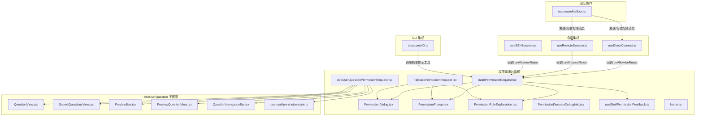
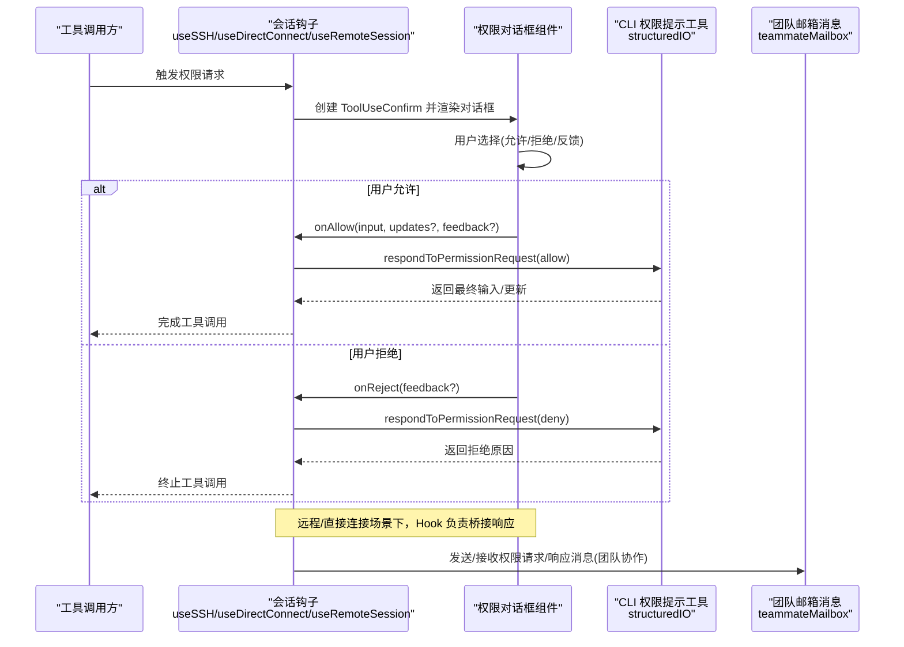
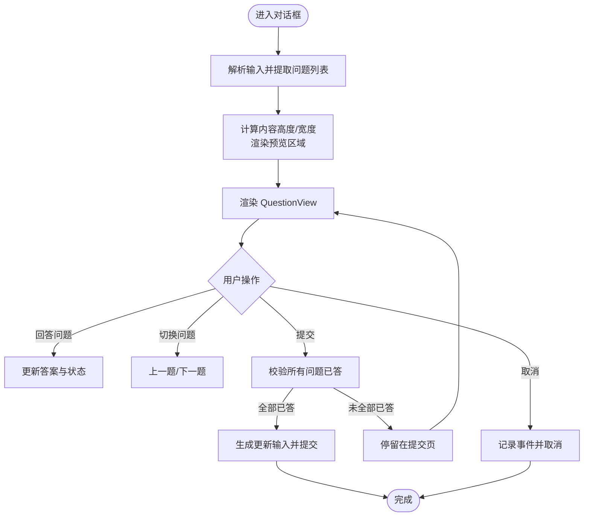
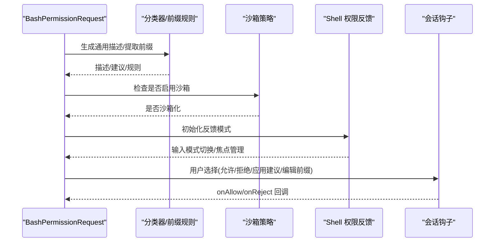
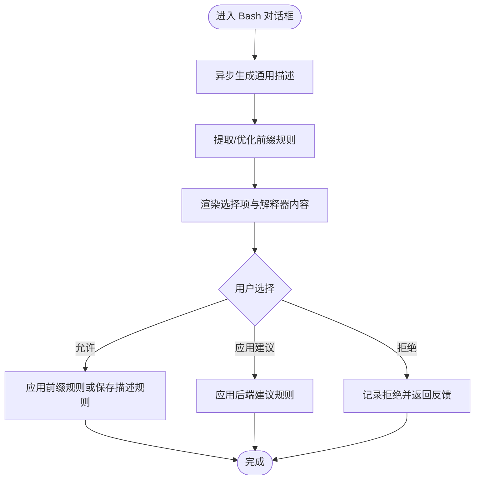
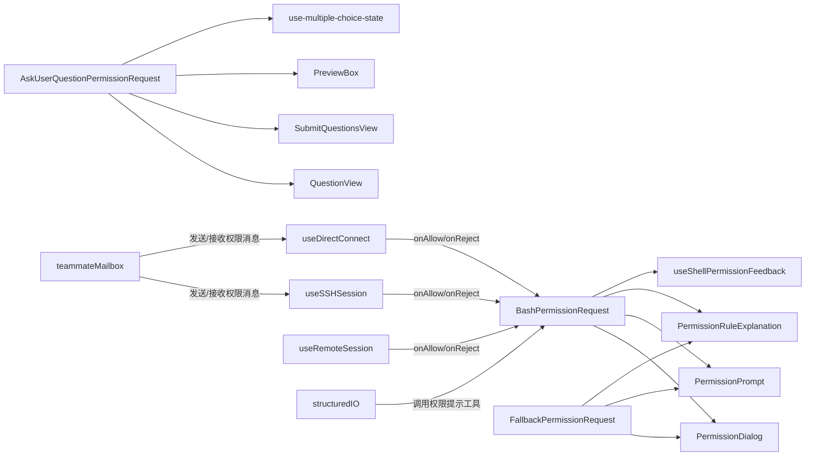

# 其他权限请求对话框

<cite>
**本文档引用的文件**
- [AskUserQuestionPermissionRequest.tsx](file://src/components/permissions/AskUserQuestionPermissionRequest/AskUserQuestionPermissionRequest.tsx)
- [BashPermissionRequest.tsx](file://src/components/permissions/BashPermissionRequest/BashPermissionRequest.tsx)
- [FallbackPermissionRequest.tsx](file://src/components/permissions/FallbackPermissionRequest.tsx)
- [PermissionDialog.tsx](file://src/components/permissions/PermissionDialog.tsx)
- [PermissionRequest.tsx](file://src/components/permissions/PermissionRequest.tsx)
- [PermissionPrompt.tsx](file://src/components/permissions/PermissionPrompt.tsx)
- [PermissionRuleExplanation.tsx](file://src/components/permissions/PermissionRuleExplanation.tsx)
- [PermissionDecisionDebugInfo.tsx](file://src/components/permissions/PermissionDecisionDebugInfo.tsx)
- [useShellPermissionFeedback.ts](file://src/components/permissions/useShellPermissionFeedback.ts)
- [hooks.ts](file://src/components/permissions/hooks.ts)
- [use-multiple-choice-state.ts](file://src/components/permissions/AskUserQuestionPermissionRequest/use-multiple-choice-state.ts)
- [QuestionView.tsx](file://src/components/permissions/AskUserQuestionPermissionRequest/QuestionView.tsx)
- [SubmitQuestionsView.tsx](file://src/components/permissions/AskUserQuestionPermissionRequest/SubmitQuestionsView.tsx)
- [PreviewBox.tsx](file://src/components/permissions/AskUserQuestionPermissionRequest/PreviewBox.tsx)
- [PreviewQuestionView.tsx](file://src/components/permissions/AskUserQuestionPermissionRequest/PreviewQuestionView.tsx)
- [QuestionNavigationBar.tsx](file://src/components/permissions/AskUserQuestionPermissionRequest/QuestionNavigationBar.tsx)
- [useDirectConnect.ts](file://src/hooks/useDirectConnect.ts)
- [useRemoteSession.ts](file://src/hooks/useRemoteSession.ts)
- [useSSHSession.ts](file://src/hooks/useSSHSession.ts)
- [structuredIO.ts](file://src/cli/structuredIO.ts)
- [teammateMailbox.ts](file://src/utils/teammateMailbox.ts)
</cite>

## 目录
1. [简介](#简介)
2. [项目结构](#项目结构)
3. [核心组件](#核心组件)
4. [架构总览](#架构总览)
5. [详细组件分析](#详细组件分析)
6. [依赖关系分析](#依赖关系分析)
7. [性能考虑](#性能考虑)
8. [故障排除指南](#故障排除指南)
9. [结论](#结论)

## 简介
本文件面向“其他权限请求对话框”组件体系，系统化梳理并解释以下三类特殊权限请求的实现与交互流程：
- AskUserQuestionPermissionRequest：用于向用户提问以获取上下文或澄清信息，支持多选题、文本输入、图片粘贴等。
- BashPermissionRequest：用于 Shell 命令执行的权限审批，包含自动分类器、前缀规则、破坏性命令警告、沙箱策略等。
- FallbackPermissionRequest：通用工具调用的回退权限请求对话框，支持“不再询问”等选项。

同时，文档阐述权限请求的通用处理机制（权限模板、验证规则、用户反馈）、扩展性设计（新增权限类型与自定义配置）、统一架构（共享组件、状态管理、事件处理），以及错误处理与用户体验优化策略。

## 项目结构
权限请求对话框位于 `src/components/permissions/` 目录下，采用按功能域分层的组织方式：
- 核心对话框组件：AskUserQuestionPermissionRequest、BashPermissionRequest、FallbackPermissionRequest
- 通用对话框与提示：PermissionDialog、PermissionPrompt、PermissionRuleExplanation、PermissionDecisionDebugInfo
- 状态与反馈：useShellPermissionFeedback、hooks
- 特定场景视图：AskUserQuestionPermissionRequest 下的 QuestionView、SubmitQuestionsView、PreviewBox 等
- 会话集成：useDirectConnect、useRemoteSession、useSSHSession
- CLI 集成：structuredIO 中的权限提示工具调用与结果映射
- 团队协作消息：teammateMailbox 中的权限请求/响应消息格式



**图表来源**
- [AskUserQuestionPermissionRequest.tsx:1-645](file://src/components/permissions/AskUserQuestionPermissionRequest/AskUserQuestionPermissionRequest.tsx#L1-L645)
- [BashPermissionRequest.tsx:1-482](file://src/components/permissions/BashPermissionRequest/BashPermissionRequest.tsx#L1-L482)
- [FallbackPermissionRequest.tsx:1-333](file://src/components/permissions/FallbackPermissionRequest.tsx#L1-L333)
- [PermissionDialog.tsx](file://src/components/permissions/PermissionDialog.tsx)
- [PermissionPrompt.tsx](file://src/components/permissions/PermissionPrompt.tsx)
- [PermissionRuleExplanation.tsx](file://src/components/permissions/PermissionRuleExplanation.tsx)
- [PermissionDecisionDebugInfo.tsx](file://src/components/permissions/PermissionDecisionDebugInfo.tsx)
- [useShellPermissionFeedback.ts](file://src/components/permissions/useShellPermissionFeedback.ts)
- [hooks.ts](file://src/components/permissions/hooks.ts)
- [use-multiple-choice-state.ts](file://src/components/permissions/AskUserQuestionPermissionRequest/use-multiple-choice-state.ts)
- [QuestionView.tsx](file://src/components/permissions/AskUserQuestionPermissionRequest/QuestionView.tsx)
- [SubmitQuestionsView.tsx](file://src/components/permissions/AskUserQuestionPermissionRequest/SubmitQuestionsView.tsx)
- [PreviewBox.tsx](file://src/components/permissions/AskUserQuestionPermissionRequest/PreviewBox.tsx)
- [PreviewQuestionView.tsx](file://src/components/permissions/AskUserQuestionPermissionRequest/PreviewQuestionView.tsx)
- [QuestionNavigationBar.tsx](file://src/components/permissions/AskUserQuestionPermissionRequest/QuestionNavigationBar.tsx)
- [useDirectConnect.ts:114-148](file://src/hooks/useDirectConnect.ts#L114-L148)
- [useRemoteSession.ts:350-384](file://src/hooks/useRemoteSession.ts#L350-L384)
- [useSSHSession.ts:109-146](file://src/hooks/useSSHSession.ts#L109-L146)
- [structuredIO.ts:611-650](file://src/cli/structuredIO.ts#L611-L650)
- [teammateMailbox.ts:475-527](file://src/utils/teammateMailbox.ts#L475-L527)

**章节来源**
- [AskUserQuestionPermissionRequest.tsx:1-645](file://src/components/permissions/AskUserQuestionPermissionRequest/AskUserQuestionPermissionRequest.tsx#L1-L645)
- [BashPermissionRequest.tsx:1-482](file://src/components/permissions/BashPermissionRequest/BashPermissionRequest.tsx#L1-L482)
- [FallbackPermissionRequest.tsx:1-333](file://src/components/permissions/FallbackPermissionRequest.tsx#L1-L333)

## 核心组件
本节概述三类权限请求组件的职责与通用能力：

- AskUserQuestionPermissionRequest
  - 用途：通过多轮问答收集用户输入，支持单选/多选、文本输入、图片粘贴、预览渲染、计划模式集成。
  - 关键特性：动态布局计算、图片转消息块、计划模式上下文注入、多选状态管理、提交校验与反馈。
  - 适用场景：需要澄清问题、收集上下文、引导用户完成复杂任务的场景。

- BashPermissionRequest
  - 用途：对 Shell 命令进行权限审批，支持自动分类器、前缀规则、破坏性命令警告、沙箱策略、解释器内容展示。
  - 关键特性：异步生成通用描述、复合命令前缀优化、分类器自动批准/检查中状态、可选调试信息显示。
  - 适用场景：本地/远程 Shell 执行、脚本运行、文件编辑等高风险操作。

- FallbackPermissionRequest
  - 用途：通用工具调用的回退权限请求，支持“不再询问”选项、工作线程徽章、规则持久化。
  - 关键特性：标准化选项值、反馈配置、工具名称与路径上下文、日志记录与分析。
  - 适用场景：未覆盖到专用对话框的工具调用。

**章节来源**
- [AskUserQuestionPermissionRequest.tsx:75-611](file://src/components/permissions/AskUserQuestionPermissionRequest/AskUserQuestionPermissionRequest.tsx#L75-L611)
- [BashPermissionRequest.tsx:71-133](file://src/components/permissions/BashPermissionRequest/BashPermissionRequest.tsx#L71-L133)
- [FallbackPermissionRequest.tsx:16-333](file://src/components/permissions/FallbackPermissionRequest.tsx#L16-L333)

## 架构总览
权限请求对话框遵循统一的“请求-对话-响应”架构，结合会话钩子与 CLI 工具链实现跨环境一致的权限控制体验。



**图表来源**
- [useSSHSession.ts:109-146](file://src/hooks/useSSHSession.ts#L109-L146)
- [useDirectConnect.ts:114-148](file://src/hooks/useDirectConnect.ts#L114-L148)
- [useRemoteSession.ts:350-384](file://src/hooks/useRemoteSession.ts#L350-L384)
- [structuredIO.ts:611-650](file://src/cli/structuredIO.ts#L611-L650)
- [teammateMailbox.ts:475-527](file://src/utils/teammateMailbox.ts#L475-L527)

## 详细组件分析

### AskUserQuestionPermissionRequest 分析
该组件负责“用户问题询问”场景，提供多轮问答、选项预览、图片附件、计划模式集成等功能。

```mermaid
classDiagram
class AskUserQuestionPermissionRequest {
+props : PermissionRequestProps
+render() : ReactNode
-validateInput() : boolean
-convertImagesToBlocks() : Promise
-handleSubmit() : void
-handleCancel() : void
-handleRespondToClaude() : void
-handleFinishPlanInterview() : void
}
class QuestionView {
+props : {question, questions, currentQuestionIndex, answers, ...}
+render() : ReactNode
}
class SubmitQuestionsView {
+props : {questions, currentQuestionIndex, answers, allQuestionsAnswered, ...}
+render() : ReactNode
}
class PreviewBox {
+props : {preview, theme, highlight}
+render() : ReactNode
}
class useMultipleChoiceState {
+currentQuestionIndex : number
+answers : Record
+questionStates : Record
+isInTextInput : boolean
+nextQuestion() : void
+prevQuestion() : void
+setAnswer() : void
+updateQuestionState() : void
+setTextInputMode() : void
}
AskUserQuestionPermissionRequest --> QuestionView : "渲染当前问题"
AskUserQuestionPermissionRequest --> SubmitQuestionsView : "提交汇总"
AskUserQuestionPermissionRequest --> PreviewBox : "预览渲染"
AskUserQuestionPermissionRequest --> useMultipleChoiceState : "状态管理"
```

**图表来源**
- [AskUserQuestionPermissionRequest.tsx:75-611](file://src/components/permissions/AskUserQuestionPermissionRequest/AskUserQuestionPermissionRequest.tsx#L75-L611)
- [QuestionView.tsx](file://src/components/permissions/AskUserQuestionPermissionRequest/QuestionView.tsx)
- [SubmitQuestionsView.tsx](file://src/components/permissions/AskUserQuestionPermissionRequest/SubmitQuestionsView.tsx)
- [PreviewBox.tsx](file://src/components/permissions/AskUserQuestionPermissionRequest/PreviewBox.tsx)
- [use-multiple-choice-state.ts](file://src/components/permissions/AskUserQuestionPermissionRequest/use-multiple-choice-state.ts)



**图表来源**
- [AskUserQuestionPermissionRequest.tsx:292-420](file://src/components/permissions/AskUserQuestionPermissionRequest/AskUserQuestionPermissionRequest.tsx#L292-L420)

**章节来源**
- [AskUserQuestionPermissionRequest.tsx:75-611](file://src/components/permissions/AskUserQuestionPermissionRequest/AskUserQuestionPermissionRequest.tsx#L75-L611)
- [QuestionView.tsx](file://src/components/permissions/AskUserQuestionPermissionRequest/QuestionView.tsx)
- [SubmitQuestionsView.tsx](file://src/components/permissions/AskUserQuestionPermissionRequest/SubmitQuestionsView.tsx)
- [PreviewBox.tsx](file://src/components/permissions/AskUserQuestionPermissionRequest/PreviewBox.tsx)
- [use-multiple-choice-state.ts](file://src/components/permissions/AskUserQuestionPermissionRequest/use-multiple-choice-state.ts)

### BashPermissionRequest 分析
该组件负责 Shell 命令的权限审批，具备自动分类器、前缀规则、破坏性命令警告、沙箱策略与解释器内容展示。



**图表来源**
- [BashPermissionRequest.tsx:136-481](file://src/components/permissions/BashPermissionRequest/BashPermissionRequest.tsx#L136-L481)
- [useShellPermissionFeedback.ts](file://src/components/permissions/useShellPermissionFeedback.ts)
- [hooks.ts](file://src/components/permissions/hooks.ts)



**图表来源**
- [BashPermissionRequest.tsx:320-426](file://src/components/permissions/BashPermissionRequest/BashPermissionRequest.tsx#L320-L426)

**章节来源**
- [BashPermissionRequest.tsx:136-481](file://src/components/permissions/BashPermissionRequest/BashPermissionRequest.tsx#L136-L481)
- [useShellPermissionFeedback.ts](file://src/components/permissions/useShellPermissionFeedback.ts)
- [hooks.ts](file://src/components/permissions/hooks.ts)

### FallbackPermissionRequest 分析
该组件作为通用回退对话框，适用于未覆盖到专用对话框的工具调用。

```mermaid
classDiagram
class FallbackPermissionRequest {
+props : PermissionRequestProps
+render() : ReactNode
-handleSelect(value, feedback) : void
-handleCancel() : void
}
class PermissionPrompt {
+props : {options, onSelect, onCancel, toolAnalyticsContext}
+render() : ReactNode
}
class PermissionDialog {
+props : {title, workerBadge, children}
+render() : ReactNode
}
FallbackPermissionRequest --> PermissionPrompt : "渲染选项"
FallbackPermissionRequest --> PermissionDialog : "包裹对话框"
```

**图表来源**
- [FallbackPermissionRequest.tsx:16-333](file://src/components/permissions/FallbackPermissionRequest.tsx#L16-L333)
- [PermissionPrompt.tsx](file://src/components/permissions/PermissionPrompt.tsx)
- [PermissionDialog.tsx](file://src/components/permissions/PermissionDialog.tsx)

**章节来源**
- [FallbackPermissionRequest.tsx:16-333](file://src/components/permissions/FallbackPermissionRequest.tsx#L16-L333)
- [PermissionPrompt.tsx](file://src/components/permissions/PermissionPrompt.tsx)
- [PermissionDialog.tsx](file://src/components/permissions/PermissionDialog.tsx)

## 依赖关系分析
- 组件间依赖
  - AskUserQuestionPermissionRequest 依赖 QuestionView、SubmitQuestionsView、PreviewBox、use-multiple-choice-state 等子组件与状态模块。
  - BashPermissionRequest 依赖 PermissionDialog、PermissionPrompt、PermissionRuleExplanation、useShellPermissionFeedback 等通用组件与反馈模块。
  - FallbackPermissionRequest 依赖 PermissionDialog、PermissionPrompt、PermissionRuleExplanation 等通用组件。
- 会话钩子依赖
  - useSSHSession、useDirectConnect、useRemoteSession 提供 onAllow/onReject 回调，桥接对话框与会话管理器。
- CLI 集成依赖
  - structuredIO 中的权限提示工具调用与结果映射，确保对话框与 CLI 的一致性。
- 团队协作依赖
  - teammateMailbox 提供权限请求/响应的消息格式，支持远程/团队协作场景。



**图表来源**
- [AskUserQuestionPermissionRequest.tsx:75-611](file://src/components/permissions/AskUserQuestionPermissionRequest/AskUserQuestionPermissionRequest.tsx#L75-L611)
- [BashPermissionRequest.tsx:136-481](file://src/components/permissions/BashPermissionRequest/BashPermissionRequest.tsx#L136-L481)
- [FallbackPermissionRequest.tsx:16-333](file://src/components/permissions/FallbackPermissionRequest.tsx#L16-L333)
- [useSSHSession.ts:109-146](file://src/hooks/useSSHSession.ts#L109-L146)
- [useDirectConnect.ts:114-148](file://src/hooks/useDirectConnect.ts#L114-L148)
- [useRemoteSession.ts:350-384](file://src/hooks/useRemoteSession.ts#L350-L384)
- [structuredIO.ts:611-650](file://src/cli/structuredIO.ts#L611-L650)
- [teammateMailbox.ts:475-527](file://src/utils/teammateMailbox.ts#L475-L527)

**章节来源**
- [AskUserQuestionPermissionRequest.tsx:75-611](file://src/components/permissions/AskUserQuestionPermissionRequest/AskUserQuestionPermissionRequest.tsx#L75-L611)
- [BashPermissionRequest.tsx:136-481](file://src/components/permissions/BashPermissionRequest/BashPermissionRequest.tsx#L136-L481)
- [FallbackPermissionRequest.tsx:16-333](file://src/components/permissions/FallbackPermissionRequest.tsx#L16-L333)
- [useSSHSession.ts:109-146](file://src/hooks/useSSHSession.ts#L109-L146)
- [useDirectConnect.ts:114-148](file://src/hooks/useDirectConnect.ts#L114-L148)
- [useRemoteSession.ts:350-384](file://src/hooks/useRemoteSession.ts#L350-L384)
- [structuredIO.ts:611-650](file://src/cli/structuredIO.ts#L611-L650)
- [teammateMailbox.ts:475-527](file://src/utils/teammateMailbox.ts#L475-L527)

## 性能考虑
- 渲染性能
  - BashPermissionRequest 将闪烁时钟抽取到独立组件，避免分类器检查期间的全量重渲染。
  - 使用 useMemo 包裹派生数据（如破坏性警告、沙箱状态、规则解释），减少不必要的重渲染。
- 计算开销
  - 图片粘贴转换为消息块时进行尺寸调整与降采样，避免大图带来的渲染压力。
  - 动态布局计算仅在关键参数变化时触发，限制循环渲染范围。
- 异步优化
  - Bash 自动描述生成与树状前缀优化均采用异步策略，并在组件卸载时取消请求，防止内存泄漏。

[本节为通用指导，不直接分析具体文件]

## 故障排除指南
- 分类器自动批准后仍可取消
  - 场景：分类器自动批准后，Esc 可取消勾选状态。
  - 处理：确认 feature 标记与 onDismissCheckmark 回调生效。
- 拒绝权限时的反馈
  - 场景：拒绝时记录反馈长度与是否进入反馈模式，便于审计。
  - 处理：检查 onReject 回调与日志事件字段。
- 远程/直接连接响应
  - 场景：远程会话中分类器在容器侧运行，UI 无交互。
  - 处理：确认 onUserInteraction 为空实现，响应由 manager 桥接。
- CLI 权限提示工具异常
  - 场景：权限提示工具返回非预期格式。
  - 处理：检查映射逻辑与错误抛出点，确保行为与消息正确传递。

**章节来源**
- [BashPermissionRequest.tsx:312-320](file://src/components/permissions/BashPermissionRequest/BashPermissionRequest.tsx#L312-L320)
- [BashPermissionRequest.tsx:427-434](file://src/components/permissions/BashPermissionRequest/BashPermissionRequest.tsx#L427-L434)
- [useSSHSession.ts:124-146](file://src/hooks/useSSHSession.ts#L124-L146)
- [useDirectConnect.ts:122-148](file://src/hooks/useDirectConnect.ts#L122-L148)
- [useRemoteSession.ts:363-384](file://src/hooks/useRemoteSession.ts#L363-L384)
- [structuredIO.ts:4207-4249](file://src/cli/structuredIO.ts#L4207-L4249)

## 结论
“其他权限请求对话框”体系通过统一的对话框组件、状态管理与事件处理机制，实现了对不同场景（问答澄清、Shell 执行、通用工具调用）的一致化权限控制。其扩展性设计允许快速添加新的权限类型与自定义配置，同时通过分类器、规则与反馈机制提升用户体验与安全性。结合会话钩子与 CLI 工具链，该体系在本地、远程与团队协作场景下均能稳定运行。