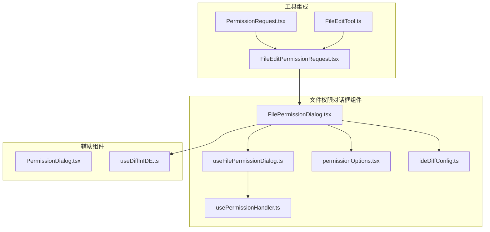
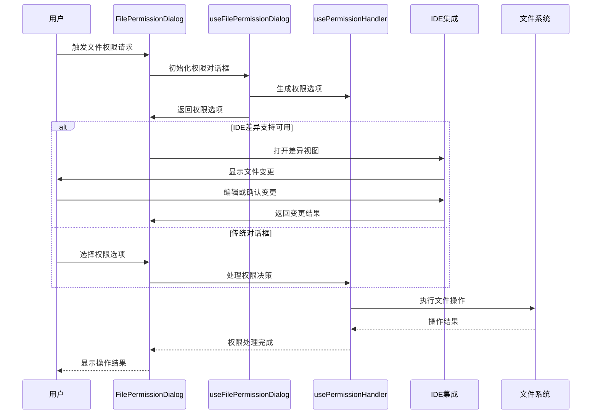
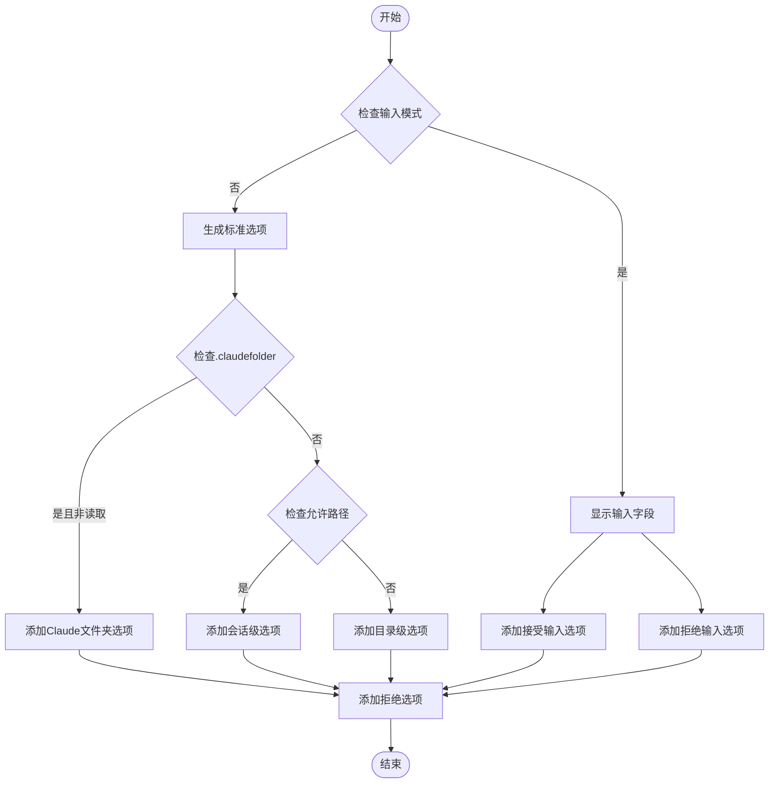
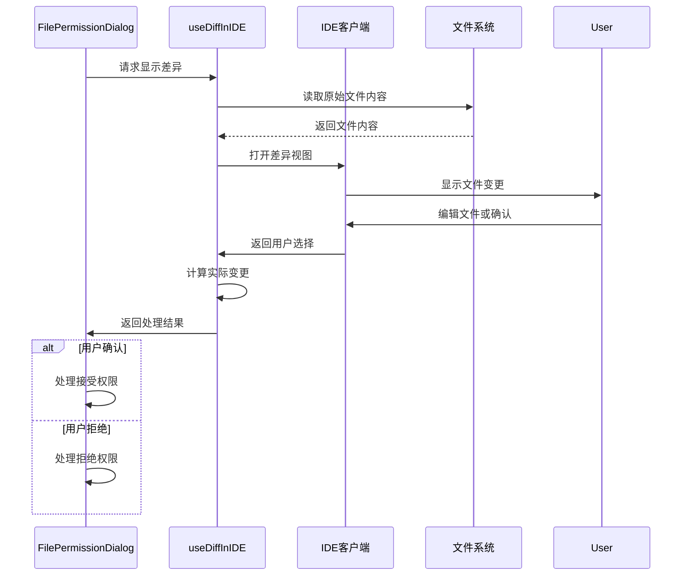
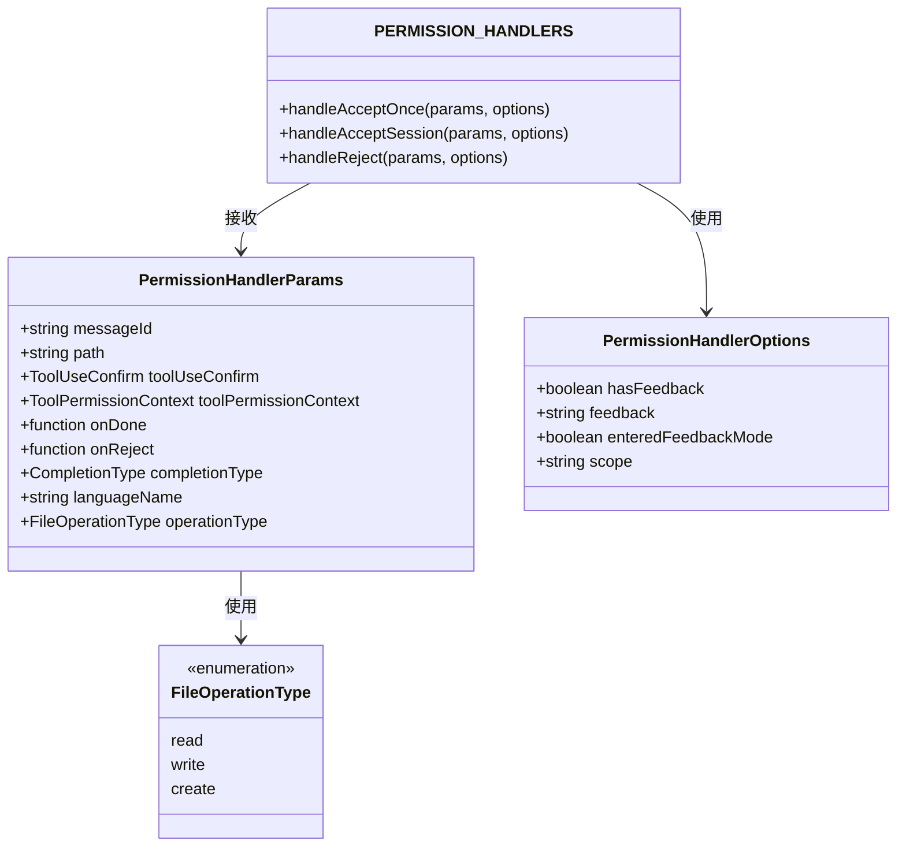
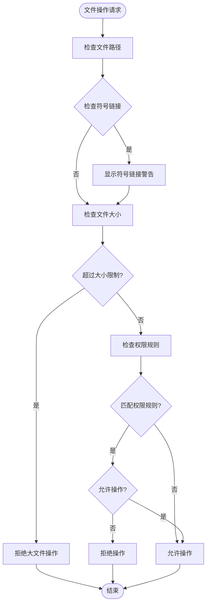
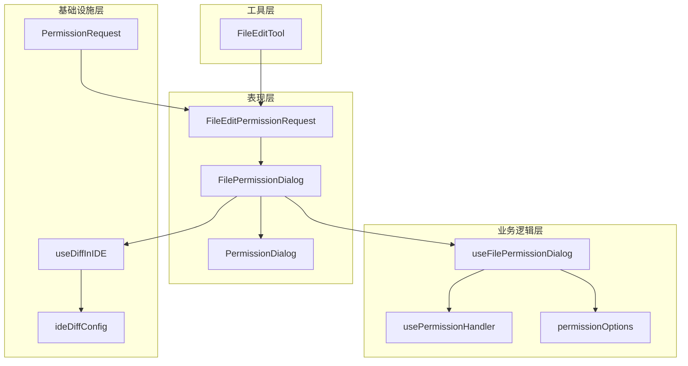

# 文件权限对话框

<cite>
**本文档引用的文件**
- [FilePermissionDialog.tsx](file://src/components/permissions/FilePermissionDialog/FilePermissionDialog.tsx)
- [useFilePermissionDialog.ts](file://src/components/permissions/FilePermissionDialog/useFilePermissionDialog.ts)
- [ideDiffConfig.ts](file://src/components/permissions/FilePermissionDialog/ideDiffConfig.ts)
- [permissionOptions.tsx](file://src/components/permissions/FilePermissionDialog/permissionOptions.tsx)
- [usePermissionHandler.ts](file://src/components/permissions/FilePermissionDialog/usePermissionHandler.ts)
- [PermissionDialog.tsx](file://src/components/permissions/PermissionDialog.tsx)
- [useDiffInIDE.ts](file://src/hooks/useDiffInIDE.ts)
- [FileEditPermissionRequest.tsx](file://src/components/permissions/FileEditPermissionRequest/FileEditPermissionRequest.tsx)
- [PermissionRequest.tsx](file://src/components/permissions/PermissionRequest.tsx)
- [FileEditTool.ts](file://src/tools/FileEditTool/FileEditTool.ts)
</cite>

## 目录
1. [简介](#简介)
2. [项目结构](#项目结构)
3. [核心组件](#核心组件)
4. [架构概览](#架构概览)
5. [详细组件分析](#详细组件分析)
6. [依赖关系分析](#依赖关系分析)
7. [性能考虑](#性能考虑)
8. [故障排除指南](#故障排除指南)
9. [结论](#结论)

## 简介

文件权限对话框组件是 Claude Code 智能体权限管理系统的核心组成部分，负责处理文件系统权限请求，包括文件读取、写入和编辑权限的申请流程。该组件提供了安全、直观的用户界面，支持 IDE 差异配置、文件变更预览和差异高亮显示，并实现了完善的权限验证逻辑。

该系统通过统一的权限管理框架，为不同的文件操作类型（读取、写入、编辑）提供一致的用户体验，同时确保对敏感文件操作的安全控制。

## 项目结构

文件权限对话框组件位于 `src/components/permissions/FilePermissionDialog/` 目录下，采用模块化设计，包含以下核心文件：

**图表来源**
- [FilePermissionDialog.tsx:1-204](file://src/components/permissions/FilePermissionDialog/FilePermissionDialog.tsx#L1-L204)
- [useFilePermissionDialog.ts:1-213](file://src/components/permissions/FilePermissionDialog/useFilePermissionDialog.ts#L1-L213)

**章节来源**
- [FilePermissionDialog.tsx:1-204](file://src/components/permissions/FilePermissionDialog/FilePermissionDialog.tsx#L1-L204)
- [useFilePermissionDialog.ts:1-213](file://src/components/permissions/FilePermissionDialog/useFilePermissionDialog.ts#L1-L213)

## 核心组件

### FilePermissionDialog 主组件

FilePermissionDialog 是权限对话框的核心组件，负责协调整个权限请求流程。它集成了文件路径解析、权限选项生成、IDE 集成和用户交互处理等功能。

主要特性：
- **路径安全检查**：自动检测符号链接并提供警告
- **IDE 差异集成**：支持在 IDE 中直接查看和编辑变更
- **动态权限选项**：根据操作类型和上下文生成合适的权限选项
- **反馈收集**：支持用户输入反馈信息

### useFilePermissionDialog 钩子

useFilePermissionDialog 提供了权限对话框的业务逻辑处理，包括：

- **权限选项管理**：动态生成接受、拒绝和会话级权限选项
- **输入模式切换**：支持用户输入反馈的输入模式
- **键盘快捷键支持**：集成确认循环模式等快捷键
- **状态管理**：维护权限对话框的内部状态

### 权限选项系统

permissionOptions.tsx 实现了智能的权限选项生成逻辑：

- **.claude 文件夹特殊处理**：为 Claude 自身配置文件提供专门的权限选项
- **工作目录感知**：根据文件是否在工作目录内调整权限描述
- **输入模式支持**：在用户需要时显示输入字段收集反馈
- **操作类型适配**：根据不同文件操作类型（读取、写入、创建）提供相应的权限选项

**章节来源**
- [FilePermissionDialog.tsx:48-204](file://src/components/permissions/FilePermissionDialog/FilePermissionDialog.tsx#L48-L204)
- [useFilePermissionDialog.ts:53-213](file://src/components/permissions/FilePermissionDialog/useFilePermissionDialog.ts#L53-L213)
- [permissionOptions.tsx:53-177](file://src/components/permissions/FilePermissionDialog/permissionOptions.tsx#L53-L177)

## 架构概览

文件权限对话框系统采用分层架构设计，确保了良好的可维护性和扩展性：

**图表来源**
- [FilePermissionDialog.tsx:90-159](file://src/components/permissions/FilePermissionDialog/FilePermissionDialog.tsx#L90-L159)
- [useDiffInIDE.ts:77-138](file://src/hooks/useDiffInIDE.ts#L77-L138)

系统架构的关键特点：
- **模块化设计**：每个组件职责单一，便于测试和维护
- **异步处理**：支持 IDE 集成和文件系统操作的异步执行
- **错误处理**：完善的错误捕获和用户反馈机制
- **可扩展性**：支持新的文件操作类型和 IDE 集成功能

## 详细组件分析

### 权限选项生成机制

权限选项生成是系统的核心功能之一，根据不同的条件动态生成合适的权限选项：

**图表来源**
- [permissionOptions.tsx:74-175](file://src/components/permissions/FilePermissionDialog/permissionOptions.tsx#L74-L175)

### IDE 差异集成流程

IDE 差异集成为用户提供了直观的文件变更预览和编辑能力：

**图表来源**
- [useDiffInIDE.ts:216-327](file://src/hooks/useDiffInIDE.ts#L216-L327)
- [FileEditPermissionRequest.tsx:13-27](file://src/components/permissions/FileEditPermissionRequest/FileEditPermissionRequest.tsx#L13-L27)

### 权限处理器架构

权限处理器实现了统一的权限决策逻辑，支持不同类型的操作：

**图表来源**
- [usePermissionHandler.ts:44-185](file://src/components/permissions/FilePermissionDialog/usePermissionHandler.ts#L44-L185)

**章节来源**
- [permissionOptions.tsx:15-40](file://src/components/permissions/FilePermissionDialog/permissionOptions.tsx#L15-L40)
- [useDiffInIDE.ts:46-164](file://src/hooks/useDiffInIDE.ts#L46-L164)
- [usePermissionHandler.ts:178-185](file://src/components/permissions/FilePermissionDialog/usePermissionHandler.ts#L178-L185)

### 文件权限验证逻辑

系统实现了多层次的文件权限验证机制：

1. **路径安全性检查**：检测符号链接并提供适当的警告
2. **工作目录验证**：确保文件操作在允许的工作目录范围内
3. **权限规则匹配**：基于配置的权限规则进行匹配
4. **大小限制检查**：防止对超大文件的操作

**图表来源**
- [FileEditTool.ts:158-200](file://src/tools/FileEditTool/FileEditTool.ts#L158-L200)

**章节来源**
- [FileEditTool.ts:125-200](file://src/tools/FileEditTool/FileEditTool.ts#L125-L200)

## 依赖关系分析

文件权限对话框组件之间的依赖关系体现了清晰的分层架构：

**图表来源**
- [PermissionRequest.tsx:47-82](file://src/components/permissions/PermissionRequest.tsx#L47-L82)
- [FileEditPermissionRequest.tsx:28-178](file://src/components/permissions/FileEditPermissionRequest/FileEditPermissionRequest.tsx#L28-L178)

**章节来源**
- [PermissionRequest.tsx:1-200](file://src/components/permissions/PermissionRequest.tsx#L1-L200)
- [FileEditPermissionRequest.tsx:1-182](file://src/components/permissions/FileEditPermissionRequest/FileEditPermissionRequest.tsx#L1-L182)

## 性能考虑

文件权限对话框系统在设计时充分考虑了性能优化：

### 异步处理策略
- **延迟加载**：IDE 差异配置仅在需要时加载
- **缓存机制**：使用 useMemo 避免不必要的重新计算
- **异步文件操作**：文件读取和 IDE 通信采用异步方式

### 内存管理
- **状态最小化**：只存储必要的状态信息
- **清理机制**：组件卸载时自动清理资源
- **错误边界**：防止单个操作影响整个系统稳定性

### 用户体验优化
- **即时反馈**：快速响应用户操作
- **进度指示**：长时间操作显示进度
- **取消支持**：允许用户随时取消操作

## 故障排除指南

### 常见问题及解决方案

**IDE 差异功能不可用**
- 检查 IDE 扩展是否正确安装
- 验证 IDE 连接状态
- 确认 diffTool 配置设置

**权限请求不显示**
- 检查工具权限配置
- 验证文件路径有效性
- 确认用户权限设置

**符号链接警告**
- 理解符号链接的风险
- 考虑使用绝对路径
- 在必要时手动确认操作

**性能问题**
- 检查文件大小限制
- 优化 IDE 配置
- 减少同时进行的权限请求

### 错误日志和诊断

系统提供了完善的错误记录机制，包括：
- 详细的错误堆栈跟踪
- 用户操作日志
- 系统状态监控
- 性能指标收集

**章节来源**
- [useDiffInIDE.ts:134-138](file://src/hooks/useDiffInIDE.ts#L134-L138)
- [usePermissionHandler.ts:25-42](file://src/components/permissions/FilePermissionDialog/usePermissionHandler.ts#L25-L42)

## 结论

文件权限对话框组件展现了现代权限管理系统的设计理念，通过模块化架构、智能权限选项生成、IDE 集成和完善的错误处理，为用户提供了安全、便捷的文件操作体验。

该系统的主要优势包括：
- **安全性**：多层权限验证和符号链接检测
- **易用性**：直观的用户界面和 IDE 集成
- **可扩展性**：模块化设计支持新功能添加
- **可靠性**：完善的错误处理和性能优化

通过持续的改进和优化，文件权限对话框组件将继续为 Claude Code 智能体提供强大而安全的文件操作能力。