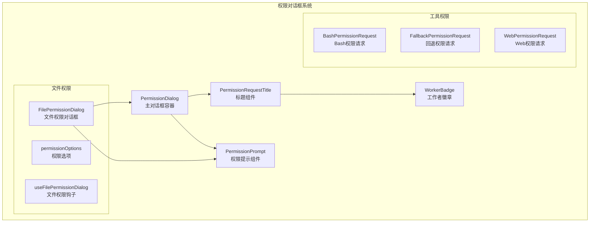
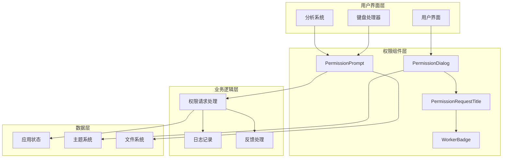
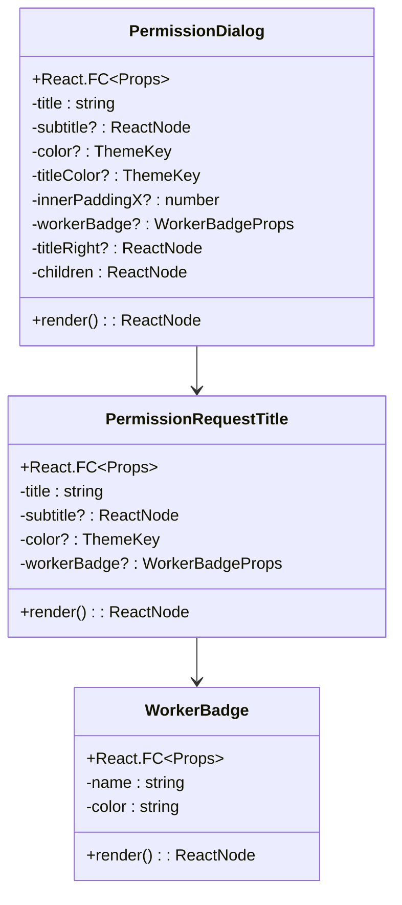
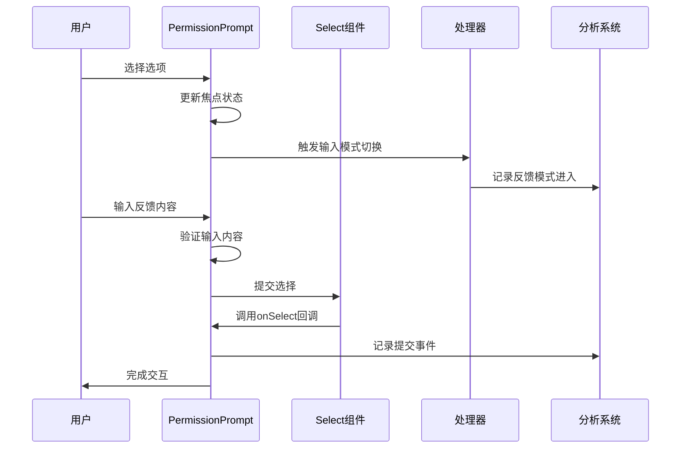
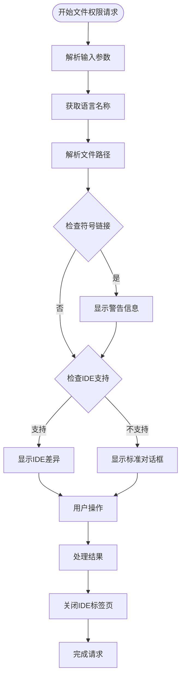
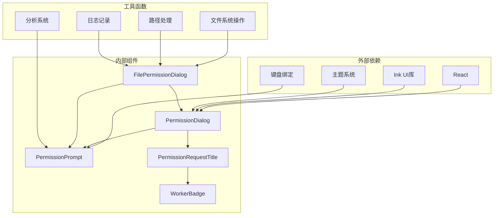

# 权限对话框容器

<cite>
**本文档引用的文件**
- [PermissionDialog.tsx](file://src/components/permissions/PermissionDialog.tsx)
- [PermissionPrompt.tsx](file://src/components/permissions/PermissionPrompt.tsx)
- [PermissionRequestTitle.tsx](file://src/components/permissions/PermissionRequestTitle.tsx)
- [WorkerBadge.tsx](file://src/components/permissions/WorkerBadge.tsx)
- [FilePermissionDialog.tsx](file://src/components/permissions/FilePermissionDialog/FilePermissionDialog.tsx)
</cite>

## 目录
1. [简介](#简介)
2. [项目结构](#项目结构)
3. [核心组件](#核心组件)
4. [架构概览](#架构概览)
5. [详细组件分析](#详细组件分析)
6. [依赖关系分析](#依赖关系分析)
7. [性能考虑](#性能考虑)
8. [故障排除指南](#故障排除指南)
9. [结论](#结论)

## 简介

权限对话框容器组件是 Claude 代码编辑器中用于处理各种权限请求的核心 UI 组件系统。该系统提供了统一的对话框框架，支持不同类型的权限请求，包括文件操作、工具使用、系统访问等场景。

该组件系统采用模块化设计，通过组合不同的子组件来构建完整的权限对话框体验。主要特点包括：

- **统一的对话框框架**：提供一致的视觉样式和交互模式
- **灵活的权限提示**：支持带反馈输入的权限确认流程
- **多样的权限类型**：涵盖文件系统、工具使用、系统资源等各类权限
- **可访问性支持**：内置键盘导航和屏幕阅读器支持
- **主题化设计**：支持自定义颜色和样式

## 项目结构

权限对话框组件系统位于 `src/components/permissions/` 目录下，采用按功能分组的组织方式：

**图表来源**
- [PermissionDialog.tsx:1-72](file://src/components/permissions/PermissionDialog.tsx#L1-L72)
- [PermissionPrompt.tsx:1-336](file://src/components/permissions/PermissionPrompt.tsx#L1-L336)

**章节来源**
- [PermissionDialog.tsx:1-72](file://src/components/permissions/PermissionDialog.tsx#L1-L72)
- [PermissionPrompt.tsx:1-336](file://src/components/permissions/PermissionPrompt.tsx#L1-L336)

## 核心组件

### PermissionDialog - 主对话框容器

PermissionDialog 是整个权限对话框系统的核心容器组件，负责提供统一的对话框框架和布局结构。

**主要功能特性：**
- **响应式布局**：根据内容自动调整尺寸
- **边框装饰**：支持圆角边框和颜色主题
- **内边距控制**：灵活的内边距配置
- **标题集成**：内置标题组件支持
- **工作者标识**：支持显示工作者徽章

**配置参数：**
- `title`: 对话框标题（必需）
- `subtitle`: 副标题内容
- `color`: 对话框边框颜色主题键
- `titleColor`: 标题颜色主题键
- `innerPaddingX`: 内部水平边距
- `workerBadge`: 工作者徽章配置
- `titleRight`: 标题右侧附加内容
- `children`: 对话框内容

**章节来源**
- [PermissionDialog.tsx:7-16](file://src/components/permissions/PermissionDialog.tsx#L7-L16)

### PermissionPrompt - 权限提示组件

PermissionPrompt 提供了通用的权限确认界面，支持带反馈输入的功能。

**核心功能：**
- **选项选择**：基于 Select 组件的选项选择界面
- **反馈输入**：支持接受/拒绝时的可选反馈输入
- **键盘快捷键**：支持键盘快捷键绑定
- **分析事件**：记录用户交互行为
- **动态输入模式**：根据焦点选项动态切换输入模式

**交互特性：**
- **Tab 键切换**：在支持反馈的选项间切换输入模式
- **Esc 键取消**：标准的取消操作
- **键盘导航**：完整的键盘导航支持
- **实时反馈**：输入时的即时反馈

**章节来源**
- [PermissionPrompt.tsx:19-29](file://src/components/permissions/PermissionPrompt.tsx#L19-L29)

## 架构概览

权限对话框系统采用分层架构设计，从底层的通用组件到上层的具体权限类型实现：

**图表来源**
- [PermissionDialog.tsx:1-72](file://src/components/permissions/PermissionDialog.tsx#L1-L72)
- [PermissionPrompt.tsx:1-336](file://src/components/permissions/PermissionPrompt.tsx#L1-L336)

## 详细组件分析

### PermissionDialog 组件分析

PermissionDialog 采用高性能的记忆化优化，确保渲染性能：

**图表来源**
- [PermissionDialog.tsx:6-16](file://src/components/permissions/PermissionDialog.tsx#L6-L16)
- [PermissionRequestTitle.tsx:6-11](file://src/components/permissions/PermissionRequestTitle.tsx#L6-L11)
- [WorkerBadge.tsx:6-9](file://src/components/permissions/WorkerBadge.tsx#L6-L9)

**渲染优化策略：**
- 使用 React 编译器的记忆化缓存
- 条件渲染避免不必要的更新
- 稳定的 prop 比较机制

**章节来源**
- [PermissionDialog.tsx:17-71](file://src/components/permissions/PermissionDialog.tsx#L17-L71)

### PermissionPrompt 组件分析

PermissionPrompt 实现了复杂的交互逻辑和状态管理：

**图表来源**
- [PermissionPrompt.tsx:137-225](file://src/components/permissions/PermissionPrompt.tsx#L137-L225)

**状态管理：**
- 焦点选项跟踪
- 输入模式状态
- 反馈内容管理
- 快捷键处理器注册

**键盘导航支持：**
- Tab 键：切换反馈输入模式
- Esc 键：取消操作
- 方向键：选项导航
- Enter 键：确认选择

**章节来源**
- [PermissionPrompt.tsx:45-326](file://src/components/permissions/PermissionPrompt.tsx#L45-L326)

### FilePermissionDialog 组件分析

FilePermissionDialog 是专门处理文件权限请求的高级组件：

**图表来源**
- [FilePermissionDialog.tsx:64-203](file://src/components/permissions/FilePermissionDialog/FilePermissionDialog.tsx#L64-L203)

**核心功能：**
- 文件路径解析和验证
- 符号链接检测和警告
- IDE 差异显示支持
- 多种权限操作类型
- 输入参数解析

**权限类型支持：**
- 读取操作 (`read`)
- 写入操作 (`write`)
- 单次接受 (`accept-once`)
- 拒绝操作 (`reject`)

**章节来源**
- [FilePermissionDialog.tsx:20-47](file://src/components/permissions/FilePermissionDialog/FilePermissionDialog.tsx#L20-L47)

## 依赖关系分析

权限对话框系统具有清晰的依赖层次结构：

**图表来源**
- [PermissionDialog.tsx:1-72](file://src/components/permissions/PermissionDialog.tsx#L1-L72)
- [PermissionPrompt.tsx:1-336](file://src/components/permissions/PermissionPrompt.tsx#L1-L336)
- [FilePermissionDialog.tsx:1-204](file://src/components/permissions/FilePermissionDialog/FilePermissionDialog.tsx#L1-L204)

**依赖管理：**
- 最小化外部依赖
- 模块化内部组件
- 清晰的导入路径
- 类型安全的接口定义

**章节来源**
- [PermissionDialog.tsx:1-72](file://src/components/permissions/PermissionDialog.tsx#L1-L72)
- [PermissionPrompt.tsx:1-336](file://src/components/permissions/PermissionPrompt.tsx#L1-L336)

## 性能考虑

权限对话框系统在多个层面实现了性能优化：

**渲染性能优化：**
- React 编译器记忆化缓存
- 条件渲染减少不必要的更新
- 稳定的 prop 比较机制
- useMemo 保持计算结果稳定

**内存管理：**
- 合理的组件卸载
- 事件处理器清理
- 异步操作的取消机制

**用户体验优化：**
- 即时反馈的交互响应
- 预加载必要的资源
- 流畅的动画过渡

## 故障排除指南

### 常见问题及解决方案

**对话框不显示**
- 检查父组件是否正确传递 props
- 验证主题配置是否正确
- 确认权限请求状态有效

**键盘导航失效**
- 检查键盘绑定配置
- 验证快捷键处理器注册
- 确认焦点状态正确设置

**反馈输入不工作**
- 检查选项配置中的 feedbackConfig
- 验证输入模式切换逻辑
- 确认分析事件记录正常

**章节来源**
- [PermissionPrompt.tsx:252-264](file://src/components/permissions/PermissionPrompt.tsx#L252-L264)

## 结论

权限对话框容器组件系统展现了优秀的软件架构设计：

**设计优势：**
- 模块化的组件结构
- 清晰的职责分离
- 高度的可扩展性
- 完善的错误处理

**技术特色：**
- 性能优化的渲染机制
- 丰富的交互体验
- 完善的可访问性支持
- 灵活的配置选项

该系统为 Claude 代码编辑器提供了强大而灵活的权限管理能力，能够适应各种复杂的权限请求场景，同时保持良好的用户体验和系统性能。