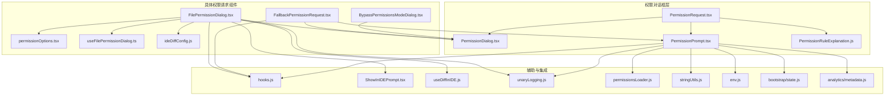
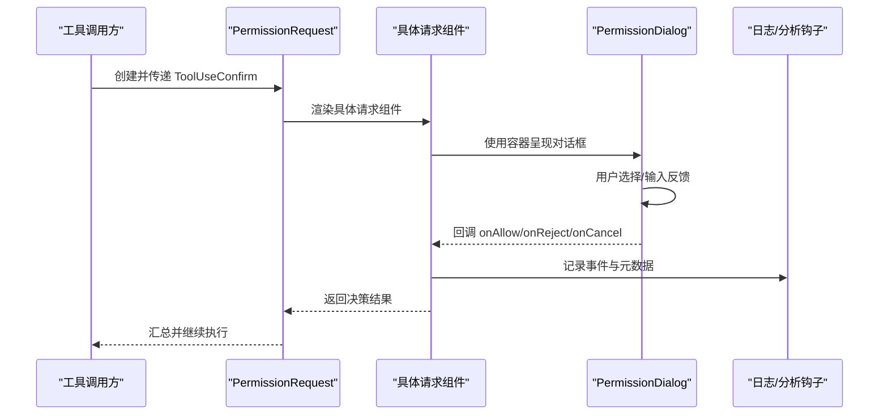
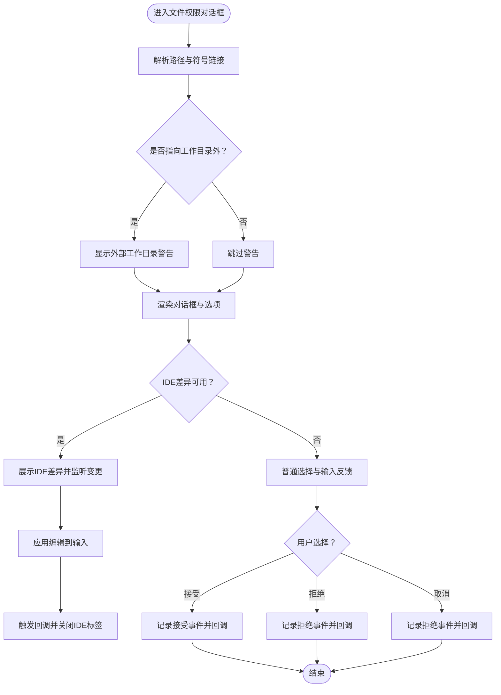
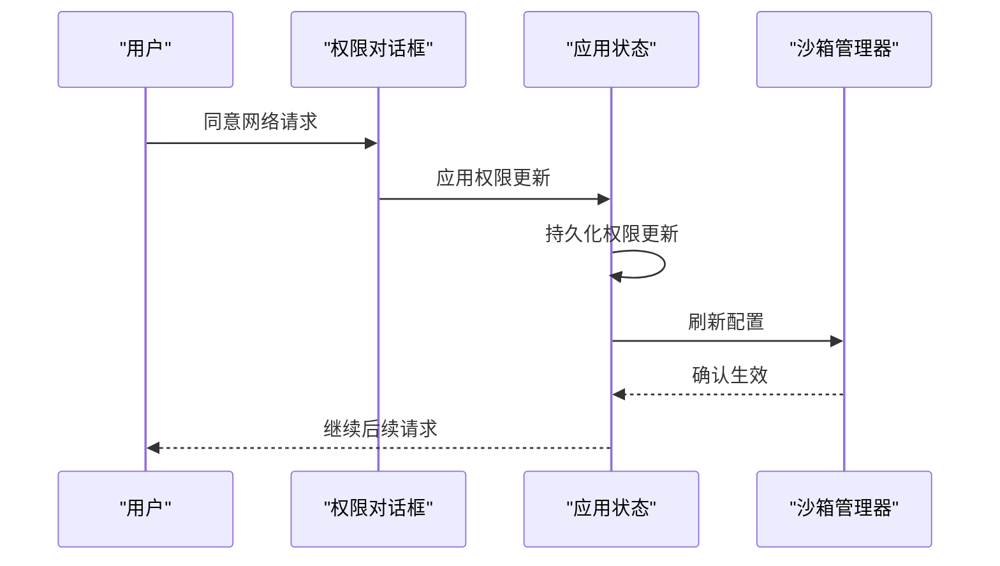
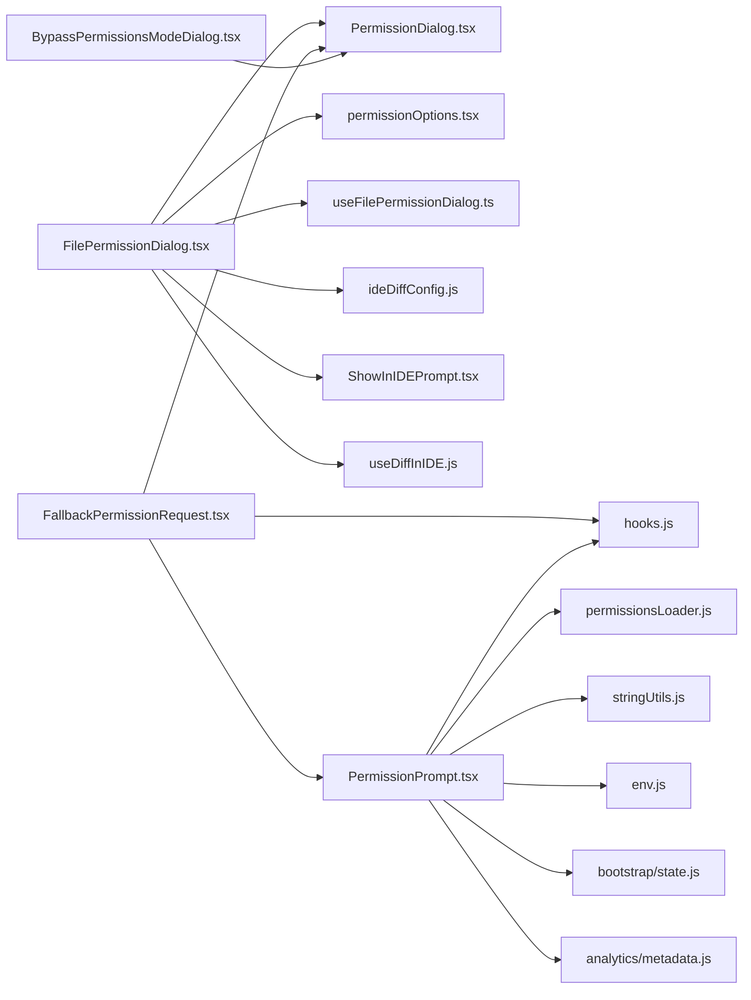
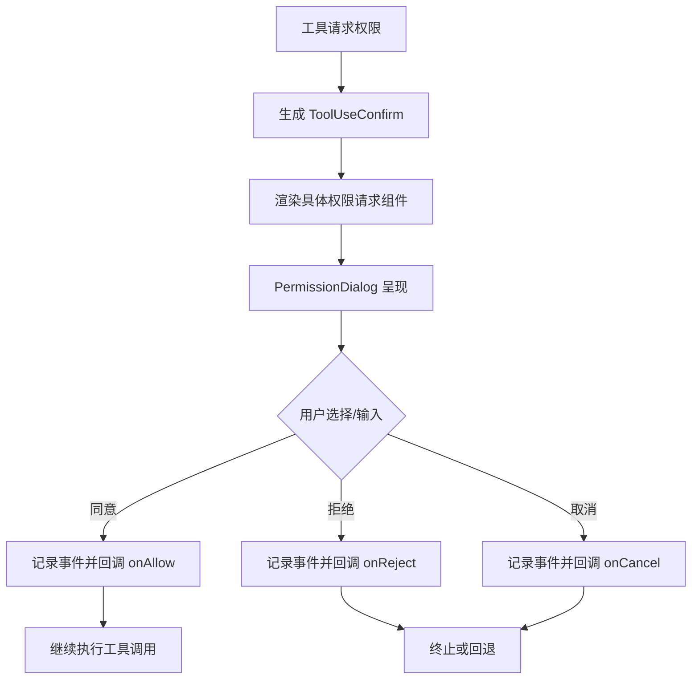

# 权限对话框组件

<cite>
**本文档引用的文件**
- [src/components/permissions/FilePermissionDialog/FilePermissionDialog.tsx](file://src/components/permissions/FilePermissionDialog/FilePermissionDialog.tsx)
- [src/components/permissions/FallbackPermissionRequest.tsx](file://src/components/permissions/FallbackPermissionRequest.tsx)
- [src/components/BypassPermissionsModeDialog.tsx](file://src/components/BypassPermissionsModeDialog.tsx)
- [src/components/permissions/PermissionDialog.tsx](file://src/components/permissions/PermissionDialog.tsx)
- [src/components/permissions/PermissionRequest.tsx](file://src/components/permissions/PermissionRequest.tsx)
- [src/components/permissions/PermissionPrompt.tsx](file://src/components/permissions/PermissionPrompt.tsx)
- [src/components/permissions/FilePermissionDialog/permissionOptions.tsx](file://src/components/permissions/FilePermissionDialog/permissionOptions.tsx)
- [src/components/permissions/FilePermissionDialog/useFilePermissionDialog.ts](file://src/components/permissions/FilePermissionDialog/useFilePermissionDialog.ts)
- [src/components/permissions/FilePermissionDialog/ideDiffConfig.js](file://src/components/permissions/FilePermissionDialog/ideDiffConfig.js)
- [src/components/permissions/hooks.js](file://src/components/permissions/hooks.js)
- [src/components/permissions/PermissionRuleExplanation.js](file://src/components/permissions/PermissionRuleExplanation.js)
- [src/components/ShowInIDEPrompt.tsx](file://src/components/ShowInIDEPrompt.tsx)
- [src/hooks/useDiffInIDE.js](file://src/hooks/useDiffInIDE.js)
- [src/utils/unaryLogging.js](file://src/utils/unaryLogging.js)
- [src/utils/permissions/permissionsLoader.js](file://src/utils/permissions/permissionsLoader.js)
- [src/utils/stringUtils.js](file://src/utils/stringUtils.js)
- [src/utils/env.js](file://src/utils/env.js)
- [src/bootstrap/state.js](file://src/bootstrap/state.js)
- [src/services/analytics/metadata.js](file://src/services/analytics/metadata.js)
- [src/commands/ultraplan.tsx](file://src/commands/ultraplan.tsx)
- [src/screens/REPL.tsx](file://src/screens/REPL.tsx)
- [src/hooks/useDirectConnect.ts](file://src/hooks/useDirectConnect.ts)
- [src/hooks/useSSHSession.ts](file://src/hooks/useSSHSession.ts)
- [src/cli/structuredIO.ts](file://src/cli/structuredIO.ts)
- [src/cli/print.ts](file://src/cli/print.ts)
</cite>

## 目录
1. [简介](#简介)
2. [项目结构](#项目结构)
3. [核心组件](#核心组件)
4. [架构总览](#架构总览)
5. [详细组件分析](#详细组件分析)
6. [依赖关系分析](#依赖关系分析)
7. [性能考量](#性能考量)
8. [故障排除指南](#故障排除指南)
9. [结论](#结论)
10. [附录](#附录)

## 简介
本文件系统化梳理 Claude Code 的权限对话框组件体系，覆盖对话框容器、权限提示与权限请求三大模块，并深入解析文件权限、Bash 权限与网络请求权限等不同类型的权限请求实现。文档还阐述用户交互流程（申请、确认、拒绝）、配置选项、回调函数与状态管理，以及安全与可访问性、国际化支持等关键主题。

## 项目结构
权限相关代码主要集中在 components/permissions 目录下，围绕统一的对话框容器与权限请求协议构建，同时通过工具钩子与日志系统实现跨组件的一致行为与可观测性。

**图表来源**
- [src/components/permissions/PermissionDialog.tsx](file://src/components/permissions/PermissionDialog.tsx)
- [src/components/permissions/PermissionRequest.tsx](file://src/components/permissions/PermissionRequest.tsx)
- [src/components/permissions/PermissionPrompt.tsx](file://src/components/permissions/PermissionPrompt.tsx)
- [src/components/permissions/FilePermissionDialog/FilePermissionDialog.tsx](file://src/components/permissions/FilePermissionDialog/FilePermissionDialog.tsx)
- [src/components/permissions/FallbackPermissionRequest.tsx](file://src/components/permissions/FallbackPermissionRequest.tsx)
- [src/components/permissions/BypassPermissionsModeDialog.tsx](file://src/components/BypassPermissionsModeDialog.tsx)

**章节来源**
- [src/components/permissions/PermissionDialog.tsx](file://src/components/permissions/PermissionDialog.tsx)
- [src/components/permissions/PermissionRequest.tsx](file://src/components/permissions/PermissionRequest.tsx)
- [src/components/permissions/PermissionPrompt.tsx](file://src/components/permissions/PermissionPrompt.tsx)
- [src/components/permissions/FilePermissionDialog/FilePermissionDialog.tsx](file://src/components/permissions/FilePermissionDialog/FilePermissionDialog.tsx)
- [src/components/permissions/FallbackPermissionRequest.tsx](file://src/components/permissions/FallbackPermissionRequest.tsx)
- [src/components/permissions/BypassPermissionsModeDialog.tsx](file://src/components/BypassPermissionsModeDialog.tsx)

## 核心组件
- 对话框容器：统一的 PermissionDialog 提供标题、副标题、内边距、工作线程徽章等通用布局与样式。
- 权限提示：PermissionPrompt 负责渲染选项列表、反馈输入与取消逻辑；PermissionRuleExplanation 展示规则解释。
- 权限请求：抽象接口 PermissionRequest 定义工具使用确认、上下文、回调与完成状态；具体请求组件如 FilePermissionDialog、FallbackPermissionRequest 等实现不同场景。

**章节来源**
- [src/components/permissions/PermissionDialog.tsx](file://src/components/permissions/PermissionDialog.tsx)
- [src/components/permissions/PermissionRequest.tsx](file://src/components/permissions/PermissionRequest.tsx)
- [src/components/permissions/PermissionPrompt.tsx](file://src/components/permissions/PermissionPrompt.tsx)
- [src/components/permissions/PermissionRuleExplanation.js](file://src/components/permissions/PermissionRuleExplanation.js)

## 架构总览
权限对话框整体采用“容器 + 请求协议 + 具体请求实现”的分层设计。所有请求组件通过统一的 PermissionRequest 协议与工具调用上下文交互，最终由 PermissionDialog 呈现给用户。日志与分析钩子贯穿请求生命周期，确保可审计与可观测。

**图表来源**
- [src/components/permissions/PermissionRequest.tsx](file://src/components/permissions/PermissionRequest.tsx)
- [src/components/permissions/PermissionDialog.tsx](file://src/components/permissions/PermissionDialog.tsx)
- [src/components/permissions/hooks.js](file://src/components/permissions/hooks.js)

## 详细组件分析

### 文件权限对话框（FilePermissionDialog）
- 功能概述：针对文件读写、符号链接检测、IDE 差异展示等场景提供一致的权限对话框体验。
- 关键特性：
  - 符号链接目标解析与外部工作目录警告。
  - IDE 差异支持（useDiffInIDE）与变更应用（ideDiffConfig.applyChanges）。
  - 语言名称推断与日志事件绑定。
  - 选项选择与反馈收集（接受/拒绝/一次性接受）。
- 配置项与回调：
  - 标题、副标题、问题文本、内容区域、完成类型、语言名覆盖。
  - 文件路径、输入解析器、操作类型（读/写）、IDE 差异配置。
  - 回调：onDone、onReject、toolUseConfirm。
- 状态管理：
  - useFilePermissionDialog 返回 options、焦点选项、输入模式切换、变更处理器等。
  - 与 ShowInIDEPrompt 协作在 IDE 中展示差异并同步关闭标签页。

**图表来源**
- [src/components/permissions/FilePermissionDialog/FilePermissionDialog.tsx](file://src/components/permissions/FilePermissionDialog/FilePermissionDialog.tsx)
- [src/components/permissions/FilePermissionDialog/permissionOptions.tsx](file://src/components/permissions/FilePermissionDialog/permissionOptions.tsx)
- [src/components/permissions/FilePermissionDialog/useFilePermissionDialog.ts](file://src/components/permissions/FilePermissionDialog/useFilePermissionDialog.ts)
- [src/components/ShowInIDEPrompt.tsx](file://src/components/ShowInIDEPrompt.tsx)
- [src/hooks/useDiffInIDE.js](file://src/hooks/useDiffInIDE.js)

**章节来源**
- [src/components/permissions/FilePermissionDialog/FilePermissionDialog.tsx](file://src/components/permissions/FilePermissionDialog/FilePermissionDialog.tsx)
- [src/components/permissions/FilePermissionDialog/permissionOptions.tsx](file://src/components/permissions/FilePermissionDialog/permissionOptions.tsx)
- [src/components/permissions/FilePermissionDialog/useFilePermissionDialog.ts](file://src/components/permissions/FilePermissionDialog/useFilePermissionDialog.ts)
- [src/components/ShowInIDEPrompt.tsx](file://src/components/ShowInIDEPrompt.tsx)
- [src/hooks/useDiffInIDE.js](file://src/hooks/useDiffInIDE.js)

### Bash 权限请求
- 实现位置：Bash 权限请求组件位于 components/permissions/BashPermissionRequest 目录（参考文件名）。
- 特点：通常涉及命令执行前的确认、可能的危险命令提示、允许/拒绝与一次性允许选项。
- 交互流程：与通用权限请求协议一致，通过 PermissionDialog 呈现，支持反馈输入与规则解释。

**章节来源**
- [src/components/permissions/BashPermissionRequest/BashPermissionRequest.tsx](file://src/components/permissions/BashPermissionRequest/BashPermissionRequest.tsx)
- [src/components/permissions/BashPermissionRequest/bashToolUseOptions.tsx](file://src/components/permissions/BashPermissionRequest/bashToolUseOptions.tsx)

### 网络请求权限（WebFetch/WebSearch 等）
- 实现位置：网络请求权限请求组件位于 components/permissions 相关目录（参考文件名）。
- 特点：针对域名白名单/黑名单策略、并发请求合并、本地设置持久化与沙箱配置刷新。
- 流程要点：用户批准后更新工具权限上下文、持久化规则、刷新沙箱配置以避免竞态。

**图表来源**
- [src/screens/REPL.tsx](file://src/screens/REPL.tsx)

**章节来源**
- [src/screens/REPL.tsx](file://src/screens/REPL.tsx)

### 通用回退权限请求（FallbackPermissionRequest）
- 适用场景：当无法识别具体权限类型时的兜底实现，支持“总是允许”选项与工作目录限制。
- 行为：记录接受/拒绝事件、根据配置添加规则（允许/拒绝）、清理队列并继续执行。
- 选项：Yes、Yes 不再询问（在允许条件下）、No。

**章节来源**
- [src/components/permissions/FallbackPermissionRequest.tsx](file://src/components/permissions/FallbackPermissionRequest.tsx)
- [src/utils/permissions/permissionsLoader.js](file://src/utils/permissions/permissionsLoader.js)
- [src/utils/stringUtils.js](file://src/utils/stringUtils.js)
- [src/utils/env.js](file://src/utils/env.js)
- [src/bootstrap/state.js](file://src/bootstrap/state.js)
- [src/services/analytics/metadata.js](file://src/services/analytics/metadata.js)

### 绕过权限模式对话框（BypassPermissionsModeDialog）
- 场景：在高风险模式下绕过权限提示，仅用于受限沙箱环境。
- 行为：记录对话框展示事件与用户选择；接受则更新设置并继续，拒绝则优雅退出。
- 安全警示：明确风险与责任声明。

**章节来源**
- [src/components/BypassPermissionsModeDialog.tsx](file://src/components/BypassPermissionsModeDialog.tsx)

## 依赖关系分析

**图表来源**
- [src/components/permissions/FilePermissionDialog/FilePermissionDialog.tsx](file://src/components/permissions/FilePermissionDialog/FilePermissionDialog.tsx)
- [src/components/permissions/FallbackPermissionRequest.tsx](file://src/components/permissions/FallbackPermissionRequest.tsx)
- [src/components/BypassPermissionsModeDialog.tsx](file://src/components/BypassPermissionsModeDialog.tsx)
- [src/components/permissions/PermissionPrompt.tsx](file://src/components/permissions/PermissionPrompt.tsx)
- [src/components/permissions/hooks.js](file://src/components/permissions/hooks.js)
- [src/utils/permissions/permissionsLoader.js](file://src/utils/permissions/permissionsLoader.js)
- [src/utils/stringUtils.js](file://src/utils/stringUtils.js)
- [src/utils/env.js](file://src/utils/env.js)
- [src/bootstrap/state.js](file://src/bootstrap/state.js)
- [src/services/analytics/metadata.js](file://src/services/analytics/metadata.js)

**章节来源**
- [src/components/permissions/FilePermissionDialog/FilePermissionDialog.tsx](file://src/components/permissions/FilePermissionDialog/FilePermissionDialog.tsx)
- [src/components/permissions/FallbackPermissionRequest.tsx](file://src/components/permissions/FallbackPermissionRequest.tsx)
- [src/components/BypassPermissionsModeDialog.tsx](file://src/components/BypassPermissionsModeDialog.tsx)
- [src/components/permissions/PermissionPrompt.tsx](file://src/components/permissions/PermissionPrompt.tsx)

## 性能考量
- 渲染优化：大量组件使用 useMemo 缓存派生值（如语言名、IDE 配置），减少不必要的重渲染。
- I/O 优化：IDE 差异配置读取与文件内容读取在 memo 化作用域内进行，避免重复磁盘 I/O。
- 并发与竞态：网络请求权限在本地设置更新后立即刷新沙箱配置，防止请求“漏网”。

**章节来源**
- [src/components/permissions/FilePermissionDialog/FilePermissionDialog.tsx](file://src/components/permissions/FilePermissionDialog/FilePermissionDialog.tsx)
- [src/screens/REPL.tsx](file://src/screens/REPL.tsx)

## 故障排除指南
- 用户中断处理：CLI 层通过组合中止信号与 Promise.race 确保在阻塞等待期间也能及时响应中断。
- 远程/SSH 请求：在 onAbort/onReject/onAllow 分支中正确返回 deny/allow 结果并清理队列。
- SDK 与 Hook 决策竞争：优先采用先返回的结果，抑制另一侧的预期异常，保证一致性。

**章节来源**
- [src/cli/print.ts](file://src/cli/print.ts)
- [src/hooks/useDirectConnect.ts](file://src/hooks/useDirectConnect.ts)
- [src/hooks/useSSHSession.ts](file://src/hooks/useSSHSession.ts)
- [src/cli/structuredIO.ts](file://src/cli/structuredIO.ts)

## 结论
权限对话框组件通过统一容器与请求协议实现了高度一致的用户体验，同时在文件、Bash、网络等多场景下提供差异化能力。借助日志与分析钩子、规则解释与绕过模式警示，系统在安全性、可观测性与可访问性之间取得平衡。建议在新增权限类型时遵循现有协议与容器，确保一致的交互与审计。

## 附录

### 用户交互流程（通用）

**图表来源**
- [src/components/permissions/PermissionRequest.tsx](file://src/components/permissions/PermissionRequest.tsx)
- [src/components/permissions/PermissionDialog.tsx](file://src/components/permissions/PermissionDialog.tsx)

### 安全与合规要点
- 权限验证：通过 PermissionRequest 协议与 PermissionRuleExplanation 明确规则依据。
- 用户同意记录：使用日志钩子记录 accept/reject 事件与元数据。
- 绕过模式警示：BypassPermissionsModeDialog 强调风险与责任。

**章节来源**
- [src/components/permissions/PermissionRuleExplanation.js](file://src/components/permissions/PermissionRuleExplanation.js)
- [src/components/permissions/hooks.js](file://src/components/permissions/hooks.js)
- [src/components/BypassPermissionsModeDialog.tsx](file://src/components/BypassPermissionsModeDialog.tsx)

### 可访问性与国际化
- 可访问性：统一的键盘导航（Tab/Esc）、焦点管理与清晰的选项描述。
- 国际化：字符串截断与主题适配在 PermissionPrompt 中体现，便于多语言扩展。

**章节来源**
- [src/components/permissions/PermissionPrompt.tsx](file://src/components/permissions/PermissionPrompt.tsx)
- [src/utils/stringUtils.js](file://src/utils/stringUtils.js)