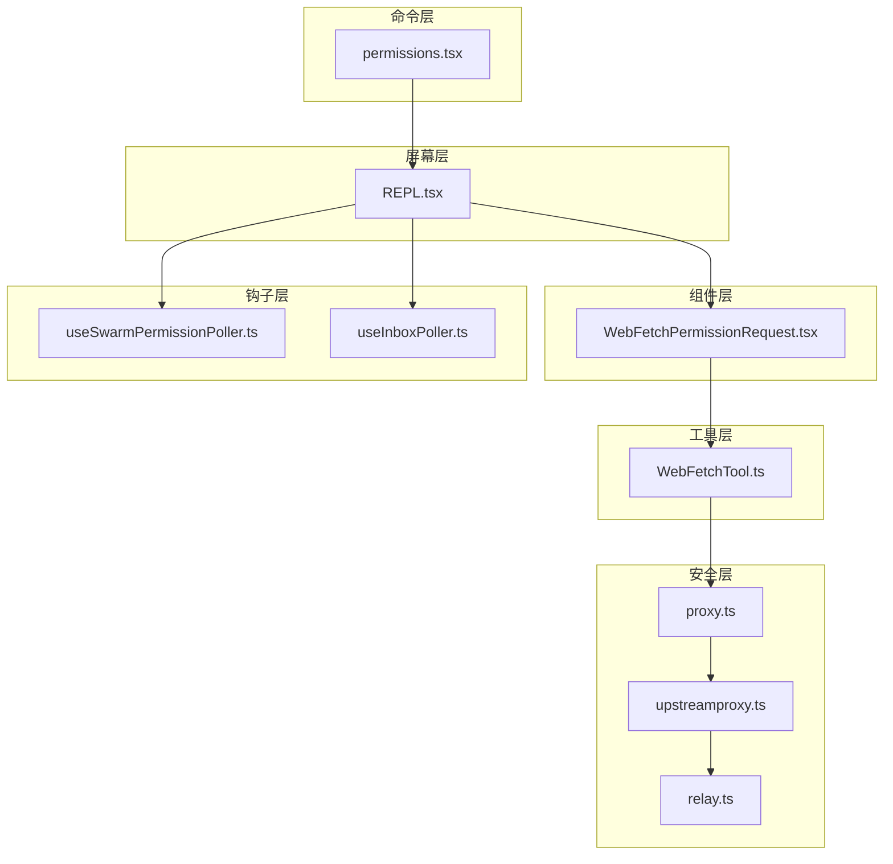
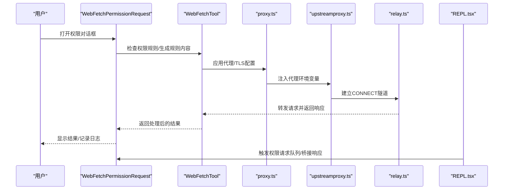
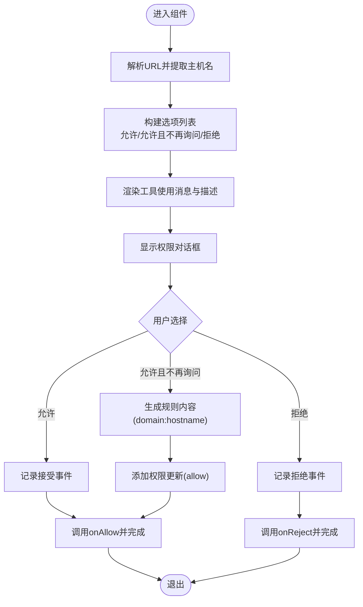
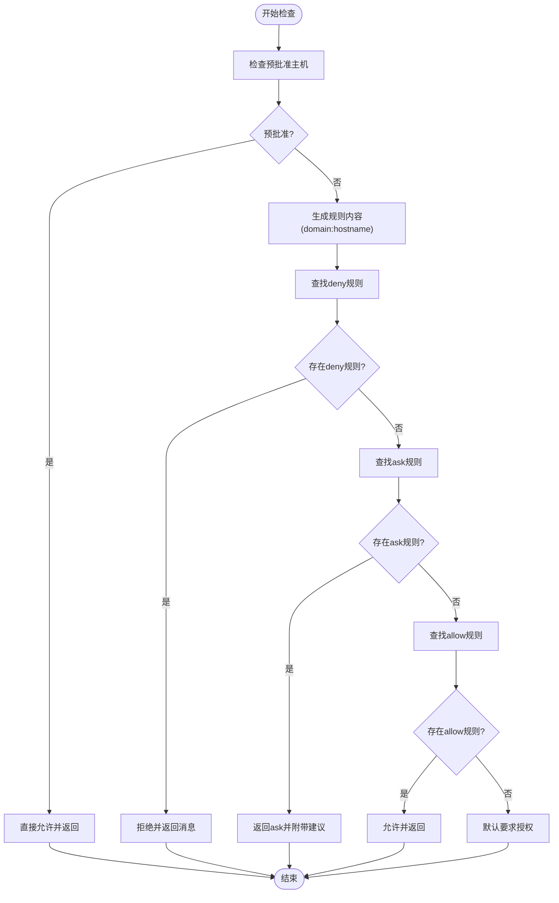
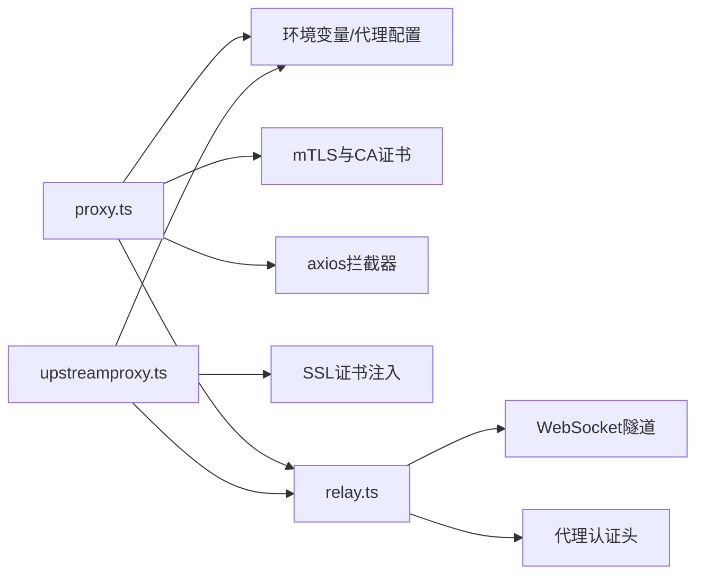
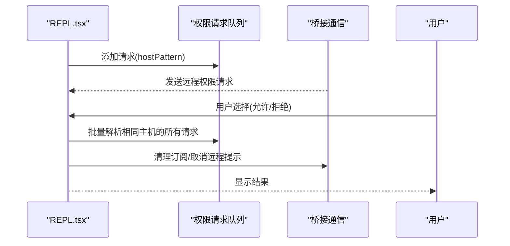
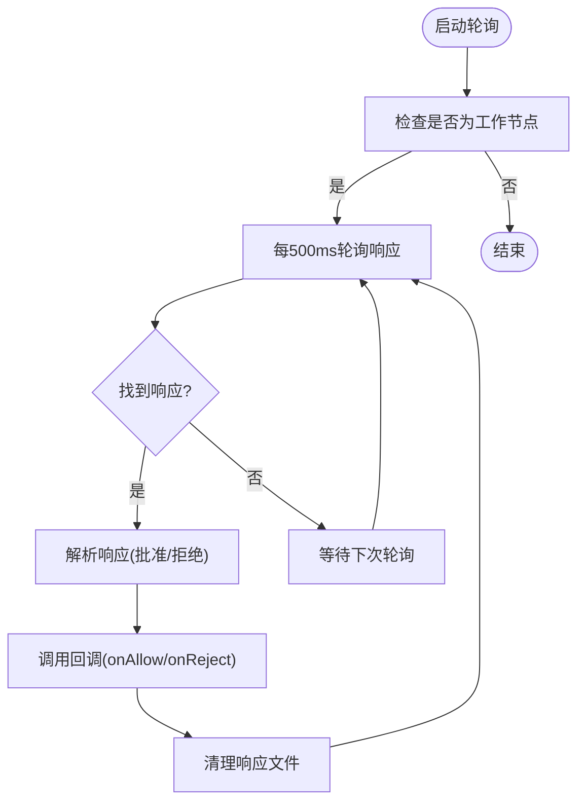
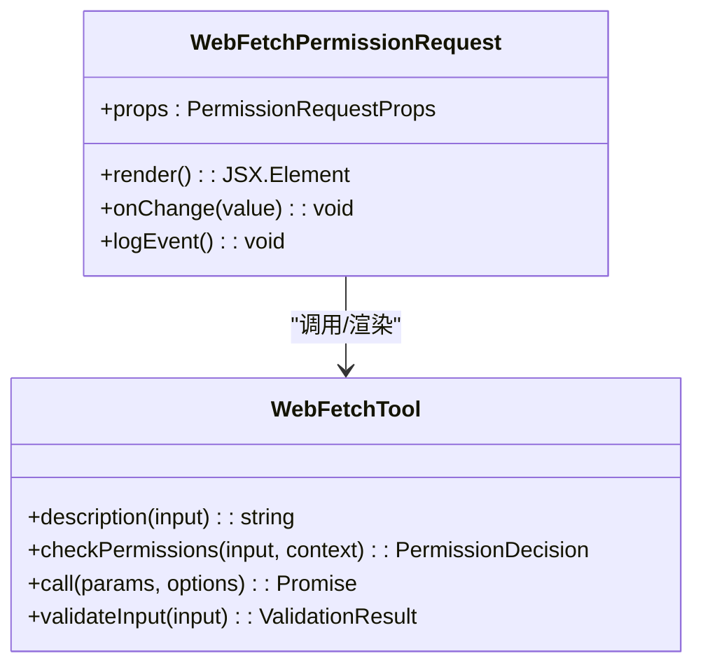
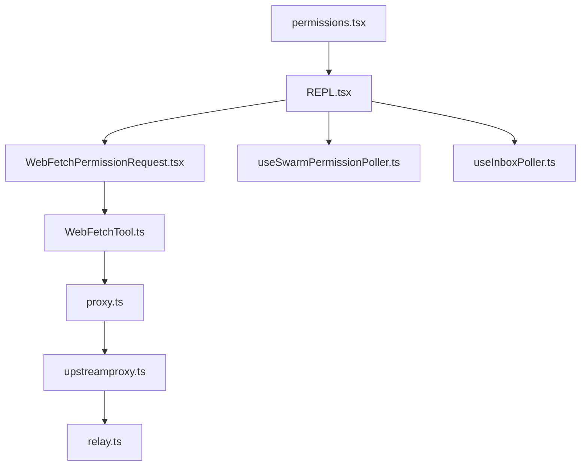

# 网络请求权限对话框

<cite>
**本文档引用的文件**
- [WebFetchPermissionRequest.tsx](file://src/components/permissions/WebFetchPermissionRequest/WebFetchPermissionRequest.tsx)
- [WebFetchTool.ts](file://src/tools/WebFetchTool/WebFetchTool.ts)
- [proxy.ts](file://src/utils/proxy.ts)
- [upstreamproxy.ts](file://src/upstreamproxy/upstreamproxy.ts)
- [relay.ts](file://src/upstreamproxy/relay.ts)
- [browser.ts](file://src/utils/browser.ts)
- [REPL.tsx](file://src/screens/REPL.tsx)
- [useSwarmPermissionPoller.ts](file://src/hooks/useSwarmPermissionPoller.ts)
- [useInboxPoller.ts](file://src/hooks/useInboxPoller.ts)
- [permissions.tsx](file://src/commands/permissions/permissions.tsx)
</cite>

## 目录
1. [简介](#简介)
2. [项目结构](#项目结构)
3. [核心组件](#核心组件)
4. [架构概览](#架构概览)
5. [详细组件分析](#详细组件分析)
6. [依赖关系分析](#依赖关系分析)
7. [性能考虑](#性能考虑)
8. [故障排除指南](#故障排除指南)
9. [结论](#结论)

## 简介
本文件为网络请求权限对话框组件的技术文档，重点阐述WebFetchPermissionRequest组件如何处理HTTP请求权限的申请和验证流程。文档涵盖网络请求权限的检查机制（URL验证、协议安全性、域名白名单）、网络请求对话框的用户界面设计、网络请求的预执行分析（请求头检查、内容类型验证、潜在风险评估）、网络请求权限对话框与安全策略的集成（代理配置和SSL证书验证），以及错误处理和请求历史记录功能。

## 项目结构
网络请求权限对话框相关的核心文件分布如下：
- 组件层：WebFetchPermissionRequest.tsx（权限对话框UI）
- 工具层：WebFetchTool.ts（工具定义、权限检查、调用逻辑）
- 安全层：proxy.ts（代理与TLS配置）、upstreamproxy.ts（上游代理）、relay.ts（代理中继）
- 屏幕层：REPL.tsx（权限请求队列与桥接通信）
- 钩子层：useSwarmPermissionPoller.ts、useInboxPoller.ts（权限轮询与响应）
- 命令层：permissions.tsx（权限规则列表命令）

**图表来源**
- [WebFetchPermissionRequest.tsx:1-258](file://src/components/permissions/WebFetchPermissionRequest/WebFetchPermissionRequest.tsx#L1-L258)
- [WebFetchTool.ts:1-319](file://src/tools/WebFetchTool/WebFetchTool.ts#L1-L319)
- [proxy.ts:107-345](file://src/utils/proxy.ts#L107-L345)
- [upstreamproxy.ts:167-211](file://src/upstreamproxy/upstreamproxy.ts#L167-L211)
- [relay.ts:286-401](file://src/upstreamproxy/relay.ts#L286-L401)
- [REPL.tsx:2257-4728](file://src/screens/REPL.tsx#L2257-L4728)
- [useSwarmPermissionPoller.ts:247-298](file://src/hooks/useSwarmPermissionPoller.ts#L247-L298)
- [useInboxPoller.ts:296-337](file://src/hooks/useInboxPoller.ts#L296-L337)
- [permissions.tsx:1-9](file://src/commands/permissions/permissions.tsx#L1-L9)

**章节来源**
- [WebFetchPermissionRequest.tsx:1-258](file://src/components/permissions/WebFetchPermissionRequest/WebFetchPermissionRequest.tsx#L1-L258)
- [WebFetchTool.ts:1-319](file://src/tools/WebFetchTool/WebFetchTool.ts#L1-L319)
- [proxy.ts:107-345](file://src/utils/proxy.ts#L107-L345)
- [upstreamproxy.ts:167-211](file://src/upstreamproxy/upstreamproxy.ts#L167-L211)
- [relay.ts:286-401](file://src/upstreamproxy/relay.ts#L286-L401)
- [REPL.tsx:2257-4728](file://src/screens/REPL.tsx#L2257-L4728)
- [useSwarmPermissionPoller.ts:247-298](file://src/hooks/useSwarmPermissionPoller.ts#L247-L298)
- [useInboxPoller.ts:296-337](file://src/hooks/useInboxPoller.ts#L296-L337)
- [permissions.tsx:1-9](file://src/commands/permissions/permissions.tsx#L1-L9)

## 核心组件
- WebFetchPermissionRequest：网络请求权限对话框UI组件，负责展示请求详情、生成权限规则、处理用户选择并触发工具调用或拒绝。
- WebFetchTool：网络抓取工具，定义输入输出模式、权限检查逻辑、URL验证、重定向检测、内容处理与结果映射。
- proxy.ts：代理与TLS配置模块，支持全局HTTP代理、mTLS、CA证书注入与代理拦截器。
- upstreamproxy.ts：上游代理环境变量注入与代理端口管理。
- relay.ts：代理中继实现，处理CONNECT隧道握手、代理认证与数据转发。
- REPL.tsx：权限请求队列与桥接通信，协调本地与远程权限决策。
- useSwarmPermissionPoller.ts / useInboxPoller.ts：权限轮询与响应处理钩子。
- permissions.tsx：权限规则列表命令入口。

**章节来源**
- [WebFetchPermissionRequest.tsx:29-258](file://src/components/permissions/WebFetchPermissionRequest/WebFetchPermissionRequest.tsx#L29-L258)
- [WebFetchTool.ts:66-319](file://src/tools/WebFetchTool/WebFetchTool.ts#L66-L319)
- [proxy.ts:307-345](file://src/utils/proxy.ts#L307-L345)
- [upstreamproxy.ts:167-211](file://src/upstreamproxy/upstreamproxy.ts#L167-L211)
- [relay.ts:295-401](file://src/upstreamproxy/relay.ts#L295-L401)
- [REPL.tsx:2257-4728](file://src/screens/REPL.tsx#L2257-L4728)
- [useSwarmPermissionPoller.ts:247-298](file://src/hooks/useSwarmPermissionPoller.ts#L247-L298)
- [useInboxPoller.ts:296-337](file://src/hooks/useInboxPoller.ts#L296-L337)
- [permissions.tsx:1-9](file://src/commands/permissions/permissions.tsx#L1-L9)

## 架构概览
网络请求权限对话框的系统架构围绕WebFetchTool与WebFetchPermissionRequest展开，结合代理与上游代理配置，确保请求在受控环境中执行，并通过REPL.tsx中的权限队列与钩子实现跨进程/跨设备的权限决策。

**图表来源**
- [WebFetchPermissionRequest.tsx:120-154](file://src/components/permissions/WebFetchPermissionRequest/WebFetchPermissionRequest.tsx#L120-L154)
- [WebFetchTool.ts:104-180](file://src/tools/WebFetchTool/WebFetchTool.ts#L104-L180)
- [proxy.ts:307-345](file://src/utils/proxy.ts#L307-L345)
- [upstreamproxy.ts:167-211](file://src/upstreamproxy/upstreamproxy.ts#L167-L211)
- [relay.ts:295-401](file://src/upstreamproxy/relay.ts#L295-L401)
- [REPL.tsx:2257-4728](file://src/screens/REPL.tsx#L2257-L4728)

## 详细组件分析

### WebFetchPermissionRequest 组件分析
WebFetchPermissionRequest是网络请求权限对话框的核心UI组件，负责：
- 解析URL并提取主机名，生成权限规则内容（domain:hostname）。
- 根据是否启用“总是允许”选项生成可选操作（允许、允许且不再询问、拒绝）。
- 记录权限事件日志，调用工具的onAllow/onReject回调。
- 渲染工具使用消息与描述，展示请求详情与安全提示。

**图表来源**
- [WebFetchPermissionRequest.tsx:12-28](file://src/components/permissions/WebFetchPermissionRequest/WebFetchPermissionRequest.tsx#L12-L28)
- [WebFetchPermissionRequest.tsx:84-154](file://src/components/permissions/WebFetchPermissionRequest/WebFetchPermissionRequest.tsx#L84-L154)

**章节来源**
- [WebFetchPermissionRequest.tsx:29-258](file://src/components/permissions/WebFetchPermissionRequest/WebFetchPermissionRequest.tsx#L29-L258)

### WebFetchTool 权限检查与调用流程
WebFetchTool定义了完整的权限检查与调用流程：
- 权限检查：优先检查预批准主机；随后根据规则内容匹配deny/ask/allow；默认要求用户授权。
- 输入验证：严格校验URL格式，失败时返回错误元数据。
- 调用执行：获取URL内容，处理重定向（不同状态码对应不同文本），应用提示到Markdown并限制最大长度，二进制内容持久化路径与大小记录。

**图表来源**
- [WebFetchTool.ts:104-180](file://src/tools/WebFetchTool/WebFetchTool.ts#L104-L180)

**章节来源**
- [WebFetchTool.ts:50-180](file://src/tools/WebFetchTool/WebFetchTool.ts#L50-L180)
- [WebFetchTool.ts:191-204](file://src/tools/WebFetchTool/WebFetchTool.ts#L191-L204)
- [WebFetchTool.ts:208-299](file://src/tools/WebFetchTool/WebFetchTool.ts#L208-L299)

### 代理与SSL证书验证集成
代理与SSL配置通过以下模块协同工作：
- proxy.ts：根据环境变量与配置决定是否使用代理，注入mTLS与CA证书，配置全局HTTP客户端代理拦截器。
- upstreamproxy.ts：设置HTTPS_PROXY、NO_PROXY等环境变量，注入SSL证书路径，确保上游代理正确转发。
- relay.ts：实现CONNECT隧道握手、代理认证头注入、WebSocket连接与数据转发。

**图表来源**
- [proxy.ts:307-345](file://src/utils/proxy.ts#L307-L345)
- [proxy.ts:135-149](file://src/utils/proxy.ts#L135-L149)
- [upstreamproxy.ts:167-211](file://src/upstreamproxy/upstreamproxy.ts#L167-L211)
- [relay.ts:295-401](file://src/upstreamproxy/relay.ts#L295-L401)

**章节来源**
- [proxy.ts:107-149](file://src/utils/proxy.ts#L107-L149)
- [proxy.ts:307-345](file://src/utils/proxy.ts#L307-L345)
- [upstreamproxy.ts:167-211](file://src/upstreamproxy/upstreamproxy.ts#L167-L211)
- [relay.ts:295-401](file://src/upstreamproxy/relay.ts#L295-L401)

### 权限请求队列与桥接通信
REPL.tsx负责管理权限请求队列与桥接通信：
- 将权限请求加入队列，等待用户响应。
- 在桥接模式下，向远程用户发起can_use_tool控制请求，接收响应后统一处理。
- 支持同主机多请求批量处理与清理桥接订阅。

**图表来源**
- [REPL.tsx:2257-4728](file://src/screens/REPL.tsx#L2257-L4728)

**章节来源**
- [REPL.tsx:2257-4728](file://src/screens/REPL.tsx#L2257-L4728)

### 钩子与轮询机制
- useSwarmPermissionPoller.ts：在集群工作节点轮询权限响应，处理批准/拒绝并清理响应文件。
- useInboxPoller.ts：监听邮件盒权限响应，支持允许/拒绝与反馈。

**图表来源**
- [useSwarmPermissionPoller.ts:247-298](file://src/hooks/useSwarmPermissionPoller.ts#L247-L298)
- [useInboxPoller.ts:296-337](file://src/hooks/useInboxPoller.ts#L296-L337)

**章节来源**
- [useSwarmPermissionPoller.ts:247-298](file://src/hooks/useSwarmPermissionPoller.ts#L247-L298)
- [useInboxPoller.ts:296-337](file://src/hooks/useInboxPoller.ts#L296-L337)

### 用户界面设计与交互
- 请求详情展示：通过WebFetchTool.renderToolUseMessage渲染请求摘要与描述。
- 安全警告：在工具描述中强调对私有/认证URL的限制与替代方案建议。
- 用户确认选项：提供“允许”、“允许且不再询问（针对该域名）”、“拒绝并反馈”三种选择。

**图表来源**
- [WebFetchPermissionRequest.tsx:164-171](file://src/components/permissions/WebFetchPermissionRequest/WebFetchPermissionRequest.tsx#L164-L171)
- [WebFetchTool.ts:72-88](file://src/tools/WebFetchTool/WebFetchTool.ts#L72-L88)
- [WebFetchTool.ts:181-190](file://src/tools/WebFetchTool/WebFetchTool.ts#L181-L190)

**章节来源**
- [WebFetchPermissionRequest.tsx:164-171](file://src/components/permissions/WebFetchPermissionRequest/WebFetchPermissionRequest.tsx#L164-L171)
- [WebFetchTool.ts:72-88](file://src/tools/WebFetchTool/WebFetchTool.ts#L72-L88)
- [WebFetchTool.ts:181-190](file://src/tools/WebFetchTool/WebFetchTool.ts#L181-L190)

## 依赖关系分析
- WebFetchPermissionRequest依赖WebFetchTool进行权限规则生成与UI渲染。
- WebFetchTool依赖proxy.ts进行网络请求的代理与TLS配置。
- proxy.ts与upstreamproxy.ts共同决定代理与证书注入策略。
- relay.ts提供底层CONNECT隧道与WebSocket转发能力。
- REPL.tsx协调权限队列与桥接通信，useSwarmPermissionPoller.ts与useInboxPoller.ts提供异步响应处理。

**图表来源**
- [WebFetchPermissionRequest.tsx:1-12](file://src/components/permissions/WebFetchPermissionRequest/WebFetchPermissionRequest.tsx#L1-L12)
- [WebFetchTool.ts:1-23](file://src/tools/WebFetchTool/WebFetchTool.ts#L1-L23)
- [proxy.ts:307-345](file://src/utils/proxy.ts#L307-L345)
- [upstreamproxy.ts:167-211](file://src/upstreamproxy/upstreamproxy.ts#L167-L211)
- [relay.ts:295-401](file://src/upstreamproxy/relay.ts#L295-L401)
- [REPL.tsx:2257-4728](file://src/screens/REPL.tsx#L2257-L4728)
- [useSwarmPermissionPoller.ts:247-298](file://src/hooks/useSwarmPermissionPoller.ts#L247-L298)
- [useInboxPoller.ts:296-337](file://src/hooks/useInboxPoller.ts#L296-L337)
- [permissions.tsx:1-9](file://src/commands/permissions/permissions.tsx#L1-L9)

**章节来源**
- [WebFetchPermissionRequest.tsx:1-12](file://src/components/permissions/WebFetchPermissionRequest/WebFetchPermissionRequest.tsx#L1-L12)
- [WebFetchTool.ts:1-23](file://src/tools/WebFetchTool/WebFetchTool.ts#L1-L23)
- [proxy.ts:307-345](file://src/utils/proxy.ts#L307-L345)
- [upstreamproxy.ts:167-211](file://src/upstreamproxy/upstreamproxy.ts#L167-L211)
- [relay.ts:295-401](file://src/upstreamproxy/relay.ts#L295-L401)
- [REPL.tsx:2257-4728](file://src/screens/REPL.tsx#L2257-L4728)
- [useSwarmPermissionPoller.ts:247-298](file://src/hooks/useSwarmPermissionPoller.ts#L247-L298)
- [useInboxPoller.ts:296-337](file://src/hooks/useInboxPoller.ts#L296-L337)
- [permissions.tsx:1-9](file://src/commands/permissions/permissions.tsx#L1-L9)

## 性能考虑
- 权限检查采用规则匹配与预批准优化，避免不必要的网络请求。
- 代理与TLS配置仅在需要时生效，减少全局开销。
- 重定向检测与内容长度限制防止大体积内容导致的内存压力。
- 钩子轮询间隔固定，避免频繁IO与CPU占用。

## 故障排除指南
- URL验证失败：检查URL格式与协议（仅支持http/https），参考工具的输入验证错误信息。
- 代理配置问题：确认HTTPS_PROXY、NO_PROXY与SSL证书路径设置正确，必要时清理旧的代理拦截器。
- 权限未生效：检查本地设置中的规则更新是否成功持久化，刷新沙箱配置以避免竞态条件。
- 远程权限无响应：确认桥接通信正常，检查轮询钩子状态与响应文件清理。

**章节来源**
- [WebFetchTool.ts:191-204](file://src/tools/WebFetchTool/WebFetchTool.ts#L191-L204)
- [proxy.ts:327-345](file://src/utils/proxy.ts#L327-L345)
- [REPL.tsx:4624-4650](file://src/screens/REPL.tsx#L4624-L4650)
- [useSwarmPermissionPoller.ts:247-298](file://src/hooks/useSwarmPermissionPoller.ts#L247-L298)
- [useInboxPoller.ts:296-337](file://src/hooks/useInboxPoller.ts#L296-L337)

## 结论
WebFetchPermissionRequest与WebFetchTool构成完整的网络请求权限对话框体系，结合代理与上游代理配置，确保请求在受控环境下执行。通过规则匹配、输入验证、重定向处理与内容限制，系统在保证安全性的同时提供了良好的用户体验。REPL.tsx与钩子模块进一步增强了跨进程/跨设备的权限管理能力。