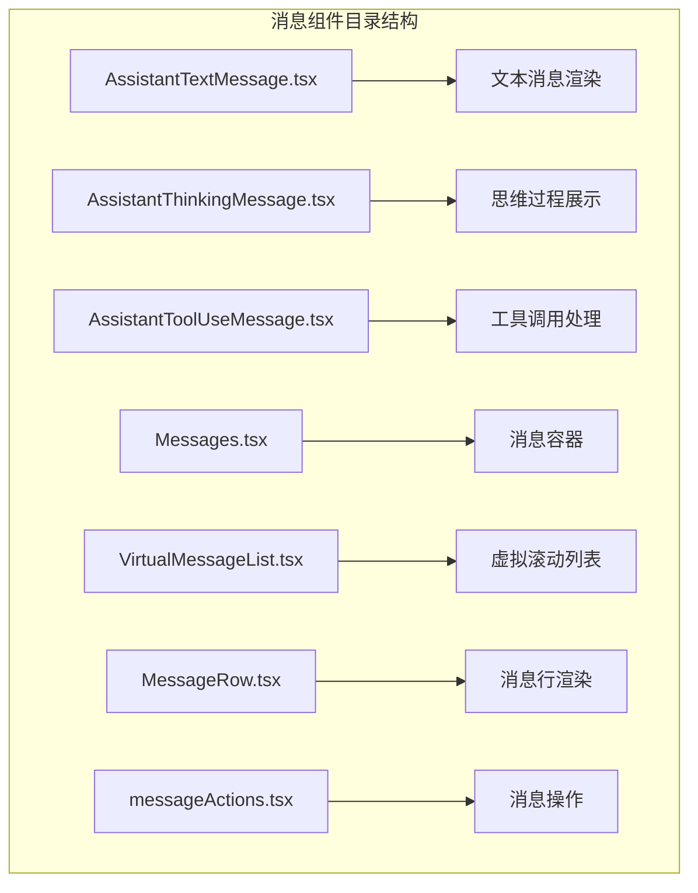
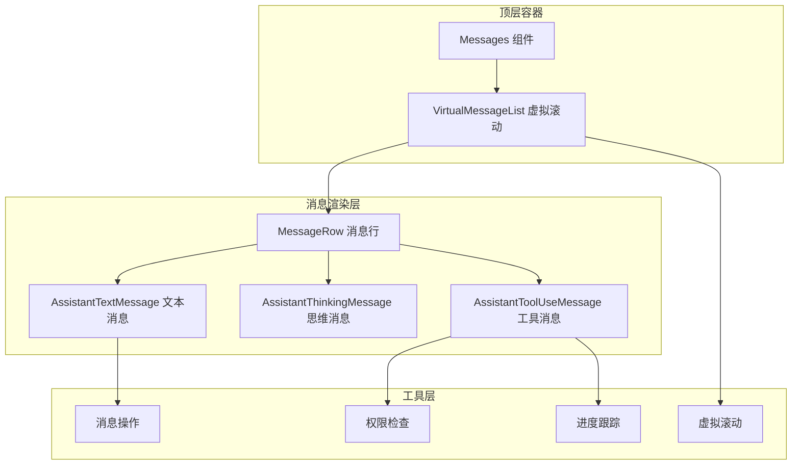
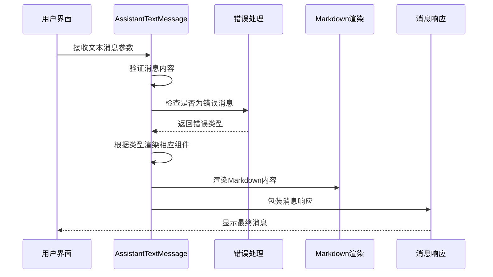
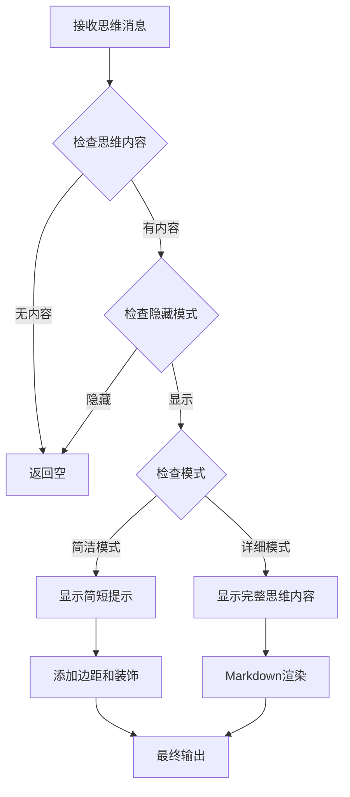
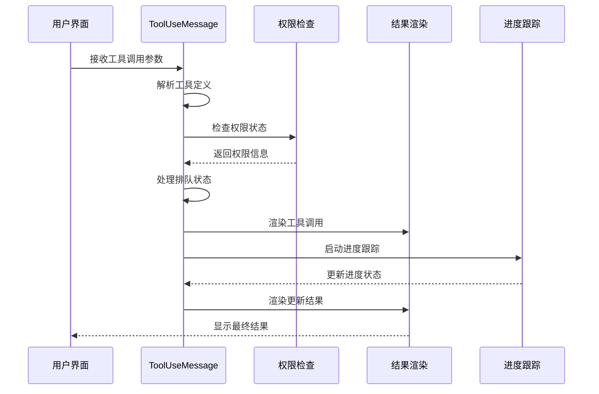
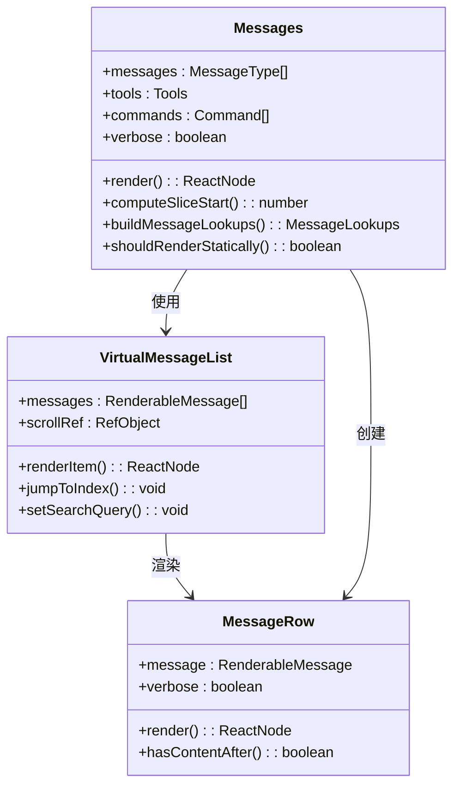
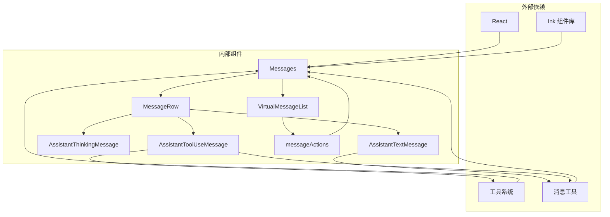

# 助手消息组件

<cite>
**本文档引用的文件**
- [AssistantTextMessage.tsx](file://src/components/messages/AssistantTextMessage.tsx)
- [AssistantThinkingMessage.tsx](file://src/components/messages/AssistantThinkingMessage.tsx)
- [AssistantToolUseMessage.tsx](file://src/components/messages/AssistantToolUseMessage.tsx)
- [Messages.tsx](file://src/components/Messages.tsx)
- [VirtualMessageList.tsx](file://src/components/VirtualMessageList.tsx)
- [MessageRow.tsx](file://src/components/MessageRow.tsx)
- [messageActions.tsx](file://src/components/messageActions.tsx)
</cite>

## 目录
1. [简介](#简介)
2. [项目结构](#项目结构)
3. [核心组件](#核心组件)
4. [架构概览](#架构概览)
5. [详细组件分析](#详细组件分析)
6. [依赖关系分析](#依赖关系分析)
7. [性能考虑](#性能考虑)
8. [故障排除指南](#故障排除指南)
9. [结论](#结论)

## 简介

助手消息组件是 Claude Code 中负责显示 AI 助手回复的核心系统。该组件支持多种消息类型，包括纯文本回复、思维过程展示、工具调用执行以及计划审批流程。系统采用流式渲染机制，支持实时更新和丰富的交互功能。

## 项目结构

助手消息组件位于 `src/components/messages/` 目录下，包含以下关键文件：

**图表来源**
- [AssistantTextMessage.tsx:1-270](file://src/components/messages/AssistantTextMessage.tsx#L1-L270)
- [AssistantThinkingMessage.tsx:1-86](file://src/components/messages/AssistantThinkingMessage.tsx#L1-L86)
- [AssistantToolUseMessage.tsx:1-368](file://src/components/messages/AssistantToolUseMessage.tsx#L1-L368)

**章节来源**
- [AssistantTextMessage.tsx:1-270](file://src/components/messages/AssistantTextMessage.tsx#L1-L270)
- [AssistantThinkingMessage.tsx:1-86](file://src/components/messages/AssistantThinkingMessage.tsx#L1-L86)
- [AssistantToolUseMessage.tsx:1-368](file://src/components/messages/AssistantToolUseMessage.tsx#L1-L368)

## 核心组件

助手消息系统由四个主要组件构成，每个组件负责不同类型的消息处理：

### 文本消息组件 (AssistantTextMessage)
负责渲染 AI 助手的纯文本回复，支持错误消息处理、API 错误显示和用户中断提示。

### 思维消息组件 (AssistantThinkingMessage)
专门处理和展示 AI 的思维过程，支持简洁模式和详细模式切换。

### 工具使用消息组件 (AssistantToolUseMessage)
处理工具调用请求，包括权限检查、进度显示和结果渲染。

### 消息容器 (Messages)
作为顶层容器，管理所有消息的渲染、虚拟滚动和性能优化。

**章节来源**
- [AssistantTextMessage.tsx:47-270](file://src/components/messages/AssistantTextMessage.tsx#L47-L270)
- [AssistantThinkingMessage.tsx:19-86](file://src/components/messages/AssistantThinkingMessage.tsx#L19-L86)
- [AssistantToolUseMessage.tsx:35-294](file://src/components/messages/AssistantToolUseMessage.tsx#L35-L294)
- [Messages.tsx:341-778](file://src/components/Messages.tsx#L341-L778)

## 架构概览

助手消息系统采用分层架构设计，确保高可扩展性和性能优化：

**图表来源**
- [Messages.tsx:341-721](file://src/components/Messages.tsx#L341-L721)
- [VirtualMessageList.tsx:289-415](file://src/components/VirtualMessageList.tsx#L289-L415)
- [MessageRow.tsx:93-200](file://src/components/MessageRow.tsx#L93-L200)

## 详细组件分析

### 文本消息组件深度分析

AssistantTextMessage 组件提供了完整的文本消息渲染功能：

**图表来源**
- [AssistantTextMessage.tsx:47-270](file://src/components/messages/AssistantTextMessage.tsx#L47-L270)

组件特性包括：
- **错误消息处理**：支持 API 错误、速率限制、无效密钥等多种错误场景
- **智能截断**：对长文本进行智能截断，支持展开查看更多
- **条件渲染**：根据消息类型和上下文动态选择渲染方式
- **样式定制**：支持主题切换和自定义样式

**章节来源**
- [AssistantTextMessage.tsx:196-268](file://src/components/messages/AssistantTextMessage.tsx#L196-L268)

### 思维消息组件分析

AssistantThinkingMessage 专门处理 AI 的思维过程展示：

**图表来源**
- [AssistantThinkingMessage.tsx:19-86](file://src/components/messages/AssistantThinkingMessage.tsx#L19-L86)

组件特点：
- **模式切换**：支持简洁模式（仅显示思维指示器）和详细模式（显示完整思维内容）
- **透明处理**：在转录模式下可以完全隐藏思维内容
- **智能显示**：根据当前会话状态决定是否显示思维过程

**章节来源**
- [AssistantThinkingMessage.tsx:36-86](file://src/components/messages/AssistantThinkingMessage.tsx#L36-L86)

### 工具使用消息组件分析

AssistantToolUseMessage 是最复杂的组件，处理工具调用的完整生命周期：

**图表来源**
- [AssistantToolUseMessage.tsx:35-294](file://src/components/messages/AssistantToolUseMessage.tsx#L35-L294)

组件功能：
- **权限管理**：集成工具权限检查和自动分类器
- **进度显示**：实时显示工具执行进度和状态
- **错误处理**：优雅处理工具调用失败和异常情况
- **透明包装**：支持透明工具包装器的特殊处理

**章节来源**
- [AssistantToolUseMessage.tsx:58-294](file://src/components/messages/AssistantToolUseMessage.tsx#L58-L294)

### 消息容器组件分析

Messages 组件作为顶层容器，提供完整的消息管理功能：

**图表来源**
- [Messages.tsx:207-275](file://src/components/Messages.tsx#L207-L275)
- [VirtualMessageList.tsx:69-113](file://src/components/VirtualMessageList.tsx#L69-L113)
- [MessageRow.tsx:15-38](file://src/components/MessageRow.tsx#L15-L38)

**章节来源**
- [Messages.tsx:341-778](file://src/components/Messages.tsx#L341-L778)
- [VirtualMessageList.tsx:289-415](file://src/components/VirtualMessageList.tsx#L289-L415)
- [MessageRow.tsx:93-200](file://src/components/MessageRow.tsx#L93-L200)

## 依赖关系分析

助手消息组件之间的依赖关系如下：

**图表来源**
- [Messages.tsx:1-50](file://src/components/Messages.tsx#L1-L50)
- [AssistantToolUseMessage.tsx:1-25](file://src/components/messages/AssistantToolUseMessage.tsx#L1-L25)

**章节来源**
- [Messages.tsx:1-85](file://src/components/Messages.tsx#L1-L85)
- [AssistantToolUseMessage.tsx:1-25](file://src/components/messages/AssistantToolUseMessage.tsx#L1-L25)

## 性能考虑

助手消息系统采用了多项性能优化策略：

### 虚拟滚动优化
- **增量键数组**：避免每次渲染都重建完整键数组
- **高度缓存**：缓存消息高度以减少重新计算
- **可见区域渲染**：只渲染可视区域内的消息项

### 渲染优化
- **记忆化组件**：使用 React.memo 避免不必要的重渲染
- **稳定回调**：保持回调函数引用稳定以减少依赖变化
- **条件渲染**：根据消息类型和状态选择最优渲染路径

### 内存管理
- **WeakMap 缓存**：使用弱引用缓存避免内存泄漏
- **增量索引构建**：按需构建搜索索引而不是全量重建
- **对象池模式**：复用消息对象减少垃圾回收压力

**章节来源**
- [VirtualMessageList.tsx:308-415](file://src/components/VirtualMessageList.tsx#L308-L415)
- [Messages.tsx:741-778](file://src/components/Messages.tsx#L741-L778)

## 故障排除指南

### 常见问题及解决方案

#### 消息不显示问题
1. **检查消息内容**：确保消息文本不为空且不是系统消息
2. **验证权限**：确认工具权限已正确配置
3. **检查渲染条件**：验证消息类型是否被正确识别

#### 性能问题
1. **启用虚拟滚动**：确保在大量消息时使用虚拟滚动
2. **优化渲染**：检查是否有不必要的重新渲染
3. **清理缓存**：定期清理消息缓存避免内存泄漏

#### 工具调用失败
1. **检查工具定义**：确认工具名称和输入参数正确
2. **验证权限**：确保用户有执行工具的权限
3. **查看错误日志**：检查具体的错误信息和堆栈跟踪

**章节来源**
- [AssistantToolUseMessage.tsx:89-93](file://src/components/messages/AssistantToolUseMessage.tsx#L89-L93)
- [messageActions.tsx:18-64](file://src/components/messageActions.tsx#L18-L64)

## 结论

助手消息组件系统是一个高度模块化、性能优化的复杂系统。通过精心设计的组件架构、完善的错误处理机制和全面的性能优化策略，该系统能够高效地处理各种类型的 AI 助手消息，为用户提供流畅的交互体验。

系统的主要优势包括：
- **模块化设计**：清晰的组件分离便于维护和扩展
- **性能优化**：虚拟滚动、记忆化等技术确保大规模消息的流畅显示
- **功能完整性**：支持文本、思维、工具调用等多种消息类型
- **用户体验**：智能的权限管理和进度反馈提升用户满意度