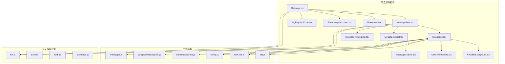
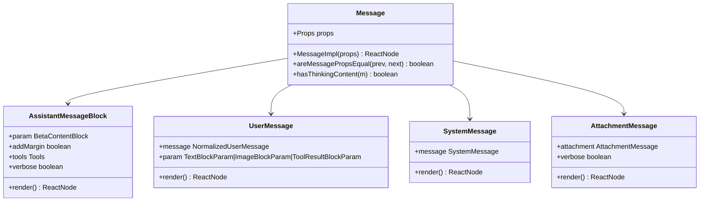
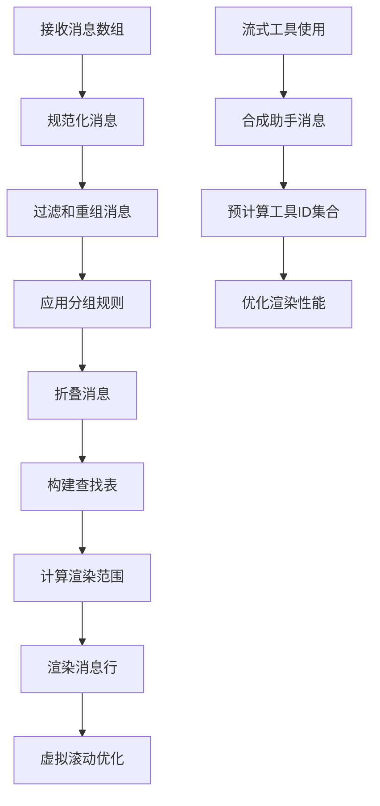
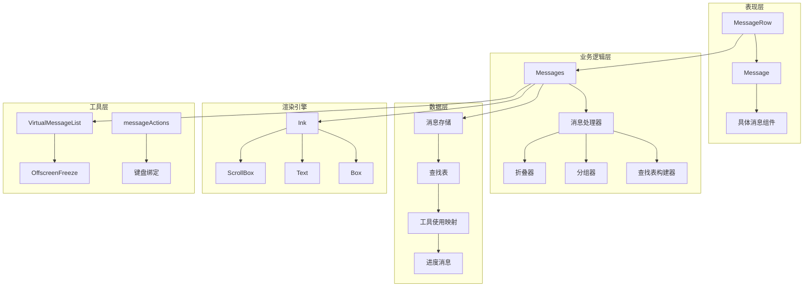
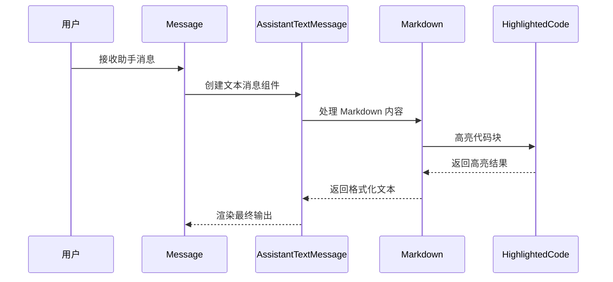
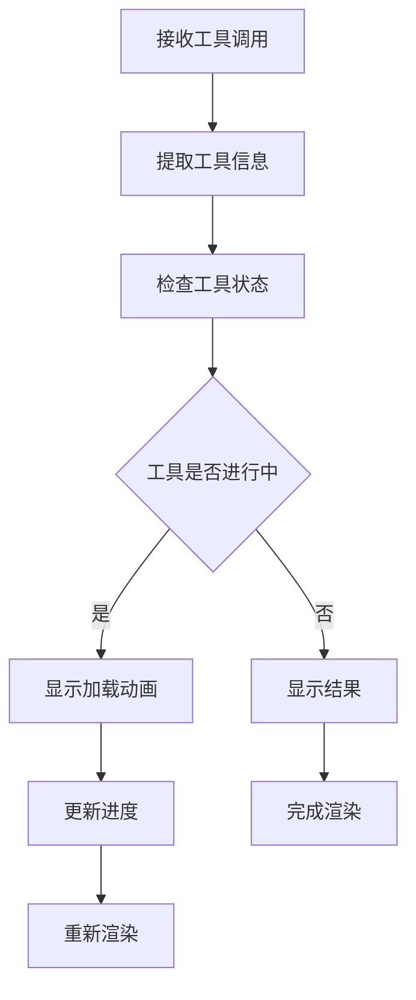
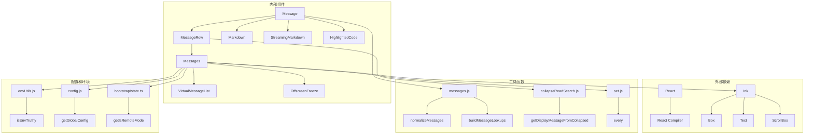

# 消息渲染组件

<cite>
**本文档引用的文件**
- [Message.tsx](file://src/components/Message.tsx)
- [Messages.tsx](file://src/components/Messages.tsx)
- [MessageRow.tsx](file://src/components/MessageRow.tsx)
- [messageActions.tsx](file://src/components/messageActions.tsx)
- [Markdown.tsx](file://src/components/Markdown.tsx)
- [StreamingMarkdown.tsx](file://src/components/StreamingMarkdown.tsx)
- [HighlightedCode.tsx](file://src/components/HighlightedCode.tsx)
- [VirtualMessageList.tsx](file://src/components/VirtualMessageList.tsx)
- [OffscreenFreeze.tsx](file://src/components/OffscreenFreeze.tsx)
- [MessageModel.tsx](file://src/components/MessageModel.tsx)
- [MessageTimestamp.tsx](file://src/components/MessageTimestamp.tsx)
- [messages.js](file://src/utils/messages.js)
- [collapseReadSearch.js](file://src/utils/collapseReadSearch.js)
- [set.js](file://src/utils/set.js)
- [envUtils.js](file://src/utils/envUtils.js)
- [config.js](file://src/utils/config.js)
- [transcriptSearch.js](file://src/utils/transcriptSearch.js)
- [stringUtils.js](file://src/utils/stringUtils.js)
- [bootstrap/state.ts](file://src/bootstrap/state.ts)
- [ink.js](file://src/ink.js)
- [useTerminalSize.js](file://src/hooks/useTerminalSize.js)
- [useTerminalNotification.js](file://src/ink/useTerminalNotification.js)
- [useKeybinding.js](file://src/keybindings/useKeybinding.js)
- [useShortcutDisplay.js](file://src/keybindings/useShortcutDisplay.js)
- [Box.tsx](file://src/ink/components/Box.tsx)
- [Text.tsx](file://src/ink/components/Text.tsx)
- [ScrollBox.js](file://src/ink/components/ScrollBox.js)
- [proactive/index.js](file://src/proactive/index.js)
- [tools/BriefTool/prompt.js](file://src/tools/BriefTool/prompt.js)
- [tools/SendUserFileTool/prompt.js](file://src/tools/SendUserFileTool/prompt.js)
</cite>

## 目录
1. [简介](#简介)
2. [项目结构](#项目结构)
3. [核心组件](#核心组件)
4. [架构概览](#架构概览)
5. [详细组件分析](#详细组件分析)
6. [依赖关系分析](#依赖关系分析)
7. [性能考虑](#性能考虑)
8. [故障排除指南](#故障排除指南)
9. [结论](#结论)

## 简介

消息渲染组件是 Claude Code 中负责显示对话历史的核心模块。该组件系统采用 React + Ink 架构，在终端环境中提供高性能的消息渲染能力。系统支持多种消息类型，包括助手消息、用户消息、系统消息和附件消息，并提供了丰富的交互功能。

该组件系统具有以下关键特性：
- 支持 27k+ 消息的高效渲染
- 提供虚拟滚动以优化内存使用
- 实现智能缓存和记忆化以减少重渲染
- 支持流式内容渲染和实时更新
- 具备完整的可访问性支持
- 提供丰富的交互功能，包括工具调用、附件下载和消息回复

## 项目结构

消息渲染组件位于 `src/components` 目录下，主要文件包括：

**图表来源**
- [Message.tsx:1-627](file://src/components/Message.tsx#L1-L627)
- [Messages.tsx:1-834](file://src/components/Messages.tsx#L1-L834)
- [MessageRow.tsx:1-383](file://src/components/MessageRow.tsx#L1-L383)

**章节来源**
- [Message.tsx:1-627](file://src/components/Message.tsx#L1-L627)
- [Messages.tsx:1-834](file://src/components/Messages.tsx#L1-L834)
- [MessageRow.tsx:1-383](file://src/components/MessageRow.tsx#L1-L383)

## 核心组件

### Message 组件

Message 组件是消息渲染的核心入口，负责根据消息类型选择相应的渲染组件：

**图表来源**
- [Message.tsx:32-627](file://src/components/Message.tsx#L32-L627)

### Messages 组件

Messages 组件负责整个消息列表的渲染，实现了复杂的状态管理和性能优化：

**图表来源**
- [Messages.tsx:341-778](file://src/components/Messages.tsx#L341-L778)

**章节来源**
- [Message.tsx:58-627](file://src/components/Message.tsx#L58-L627)
- [Messages.tsx:341-778](file://src/components/Messages.tsx#L341-L778)

## 架构概览

消息渲染系统采用分层架构设计，确保了良好的可维护性和扩展性：

**图表来源**
- [Messages.tsx:1-834](file://src/components/Messages.tsx#L1-L834)
- [MessageRow.tsx:1-383](file://src/components/MessageRow.tsx#L1-L383)
- [Message.tsx:1-627](file://src/components/Message.tsx#L1-L627)

## 详细组件分析

### 助手消息组件

助手消息组件负责渲染 AI 生成的内容，支持多种内容类型：

#### AssistantTextMessage
渲染纯文本内容，支持富文本格式化和代码高亮：

**图表来源**
- [Message.tsx:454-588](file://src/components/Message.tsx#L454-L588)
- [Markdown.tsx](file://src/components/Markdown.tsx)
- [HighlightedCode.tsx](file://src/components/HighlightedCode.tsx)

#### AssistantToolUseMessage
处理工具调用消息，提供工具执行状态显示：

**图表来源**
- [Message.tsx:484-506](file://src/components/Message.tsx#L484-L506)

#### AssistantThinkingMessage
渲染思考过程，支持透明度控制和条件显示：

**章节来源**
- [Message.tsx:539-559](file://src/components/Message.tsx#L539-L559)

### 用户消息组件

用户消息组件处理用户输入的各种内容类型：

#### UserTextMessage
渲染用户文本输入，支持系统提醒剥离和格式化：

#### UserImageMessage  
处理用户图像输入，支持图像粘贴和显示：

#### UserToolResultMessage
渲染工具执行结果，支持截断检测和展开功能：

**章节来源**
- [Message.tsx:356-432](file://src/components/Message.tsx#L356-L432)

### 系统消息组件

系统消息组件处理系统生成的各种通知和状态信息：

#### SystemTextMessage
渲染系统文本消息，支持本地命令模式：

#### CompactBoundaryMessage
处理紧凑边界消息，在全屏模式下特殊处理：

**章节来源**
- [Message.tsx:231-318](file://src/components/Message.tsx#L231-L318)

### 附件消息组件

附件消息组件处理各种类型的附件内容：

#### AttachmentMessage
通用附件渲染器，支持多种附件类型：

**章节来源**
- [Message.tsx:82-97](file://src/components/Message.tsx#L82-L97)

## 依赖关系分析

消息渲染组件系统具有清晰的依赖层次结构：

**图表来源**
- [Message.tsx:1-15](file://src/components/Message.tsx#L1-L15)
- [Messages.tsx:1-46](file://src/components/Messages.tsx#L1-L46)
- [MessageRow.tsx:1-14](file://src/components/MessageRow.tsx#L1-L14)

**章节来源**
- [Message.tsx:1-31](file://src/components/Message.tsx#L1-L31)
- [Messages.tsx:1-46](file://src/components/Messages.tsx#L1-L46)
- [MessageRow.tsx:1-14](file://src/components/MessageRow.tsx#L1-L14)

## 性能考虑

消息渲染组件系统采用了多项性能优化策略：

### 虚拟滚动优化
- 最大消息数量限制：200 条（带步进 50 条）
- UUID 锚点切片：避免基于计数的切片导致的全屏重置
- 虚拟列表：默认启用，内存使用与挂载项数量成正比

### 记忆化和缓存
- React.memo 优化：自定义比较器避免不必要的重渲染
- WeakMap 缓存：搜索文本缓存，降低内存占用
- React Compiler：自动记忆化和优化

### 流式渲染优化
- 流式工具使用：合成助手消息，避免频繁键变化
- 进度消息：预计算工具使用 ID 集合
- 智能冻结：OffscreenFreeze 减少非可见区域的渲染

### 内存管理策略
- 安全上限：防止超过 2000 条消息时的内存泄漏
- 垃圾回收：退出转录模式时清理缓存
- 弱引用：使用 WeakMap 避免循环引用

**章节来源**
- [Messages.tsx:276-340](file://src/components/Messages.tsx#L276-L340)
- [MessageRow.tsx:336-382](file://src/components/MessageRow.tsx#L336-L382)

## 故障排除指南

### 常见问题和解决方案

#### 消息渲染异常
- **症状**：消息显示不完整或格式错误
- **原因**：消息类型识别失败或内容块解析错误
- **解决**：检查消息规范化流程和内容块类型

#### 性能问题
- **症状**：渲染缓慢或内存使用过高
- **原因**：未启用虚拟滚动或缓存失效
- **解决**：确认 VirtualMessageList 启用和缓存配置

#### 流式内容问题
- **症状**：流式工具使用显示异常
- **原因**：工具使用 ID 集合计算错误
- **解决**：验证 getToolUseIDs 和 streamingToolUsesWithoutInProgress

#### 可访问性问题
- **症状**：屏幕阅读器无法正确读取消息
- **原因**：缺少适当的 ARIA 属性
- **解决**：添加适当的语义标记和描述

**章节来源**
- [Messages.tsx:741-778](file://src/components/Messages.tsx#L741-L778)
- [MessageRow.tsx:342-382](file://src/components/MessageRow.tsx#L342-L382)

## 结论

消息渲染组件系统是一个高度优化的终端消息显示解决方案，具有以下优势：

1. **高性能**：通过虚拟滚动、记忆化和流式渲染实现大规模消息的高效处理
2. **可扩展性**：模块化的组件设计支持新消息类型的轻松集成
3. **用户体验**：丰富的交互功能和可访问性支持提供优秀的用户体验
4. **稳定性**：完善的错误处理和性能监控确保系统的稳定运行

该系统为 Claude Code 提供了强大而灵活的消息渲染能力，能够满足从简单对话到复杂多轮交互的各种场景需求。通过持续的性能优化和功能扩展，该组件系统将继续为用户提供优质的终端交互体验。