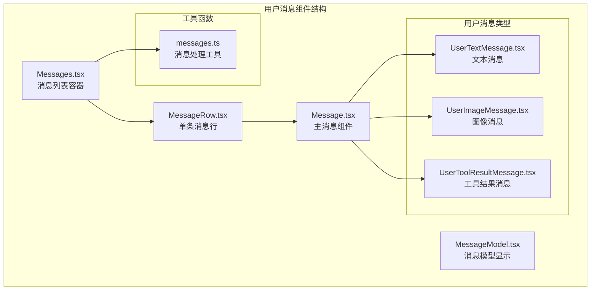
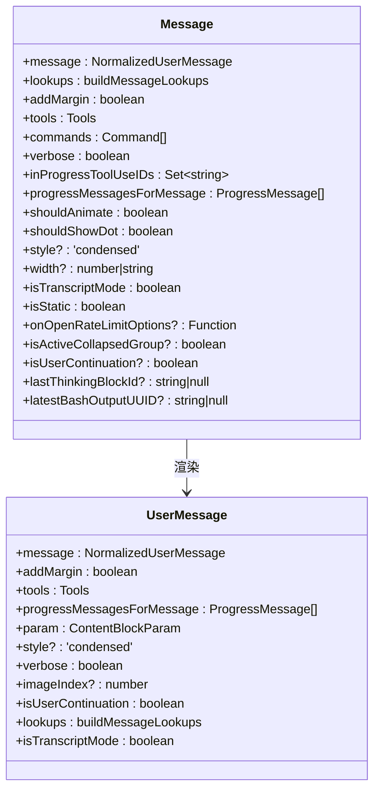
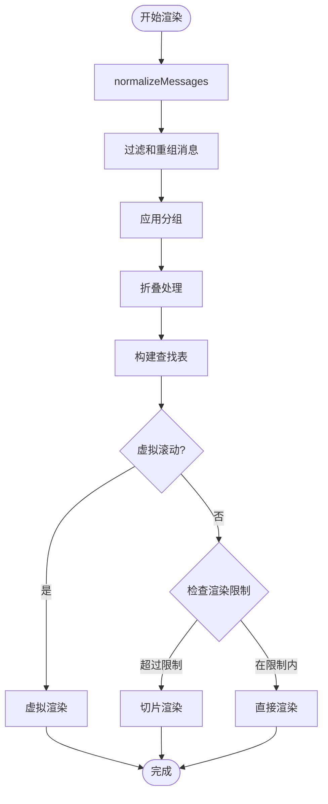
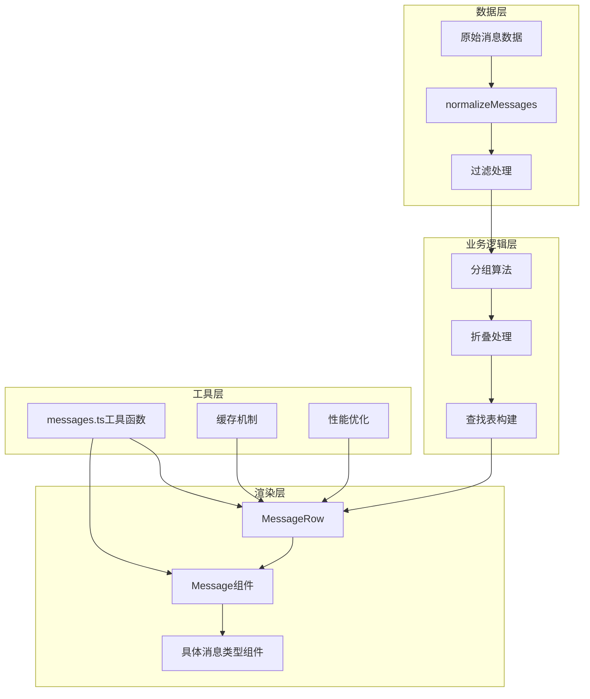
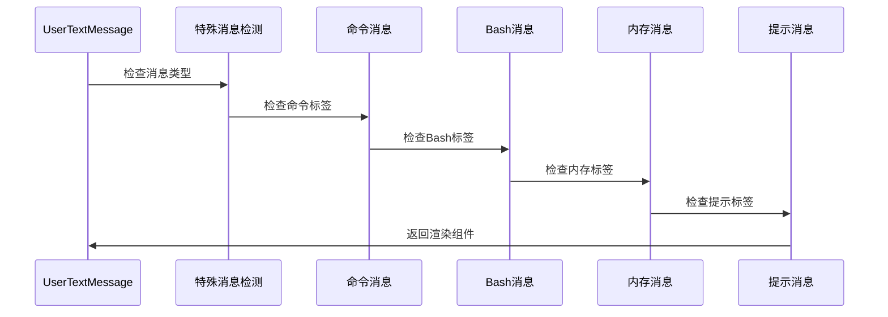
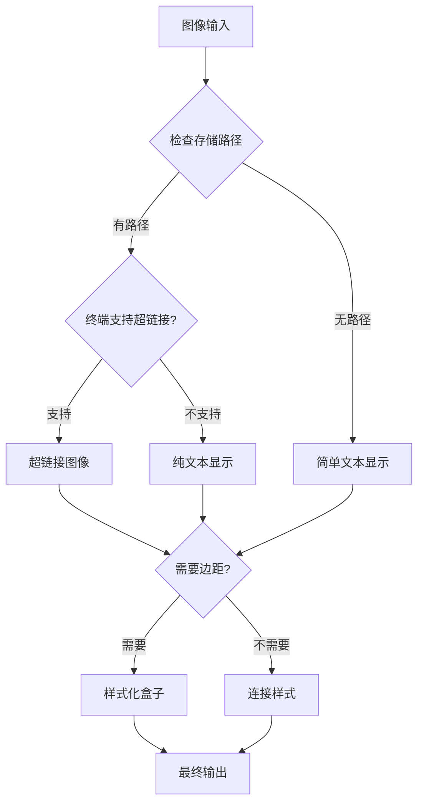
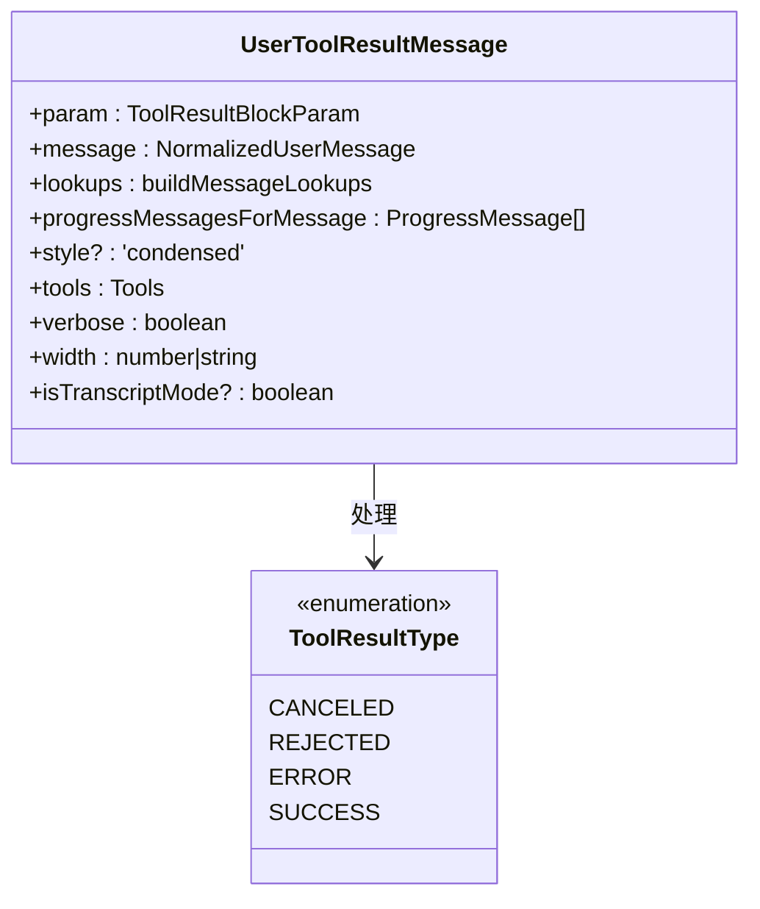
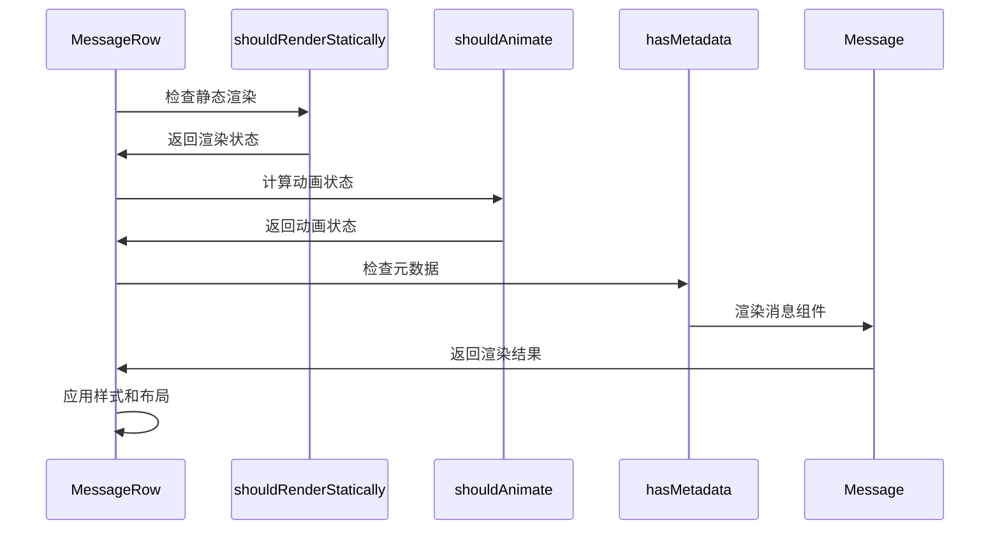
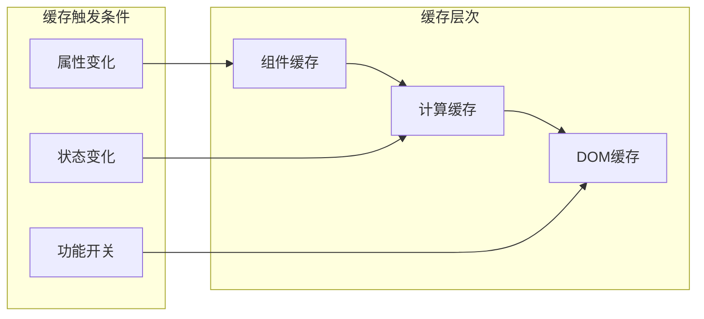

# 用户消息组件

<cite>
**本文档引用的文件**
- [Message.tsx](file://src/components/Message.tsx)
- [Messages.tsx](file://src/components/Messages.tsx)
- [MessageRow.tsx](file://src/components/MessageRow.tsx)
- [MessageModel.tsx](file://src/components/MessageModel.tsx)
- [UserTextMessage.tsx](file://src/components/messages/UserTextMessage.tsx)
- [UserImageMessage.tsx](file://src/components/messages/UserImageMessage.tsx)
- [UserToolResultMessage.tsx](file://src/components/messages/UserToolResultMessage/UserToolResultMessage.tsx)
- [messages.ts](file://src/utils/messages.ts)
</cite>

## 目录
1. [简介](#简介)
2. [项目结构](#项目结构)
3. [核心组件](#核心组件)
4. [架构概览](#架构概览)
5. [详细组件分析](#详细组件分析)
6. [依赖关系分析](#依赖关系分析)
7. [性能考虑](#性能考虑)
8. [故障排除指南](#故障排除指南)
9. [结论](#结论)

## 简介

用户消息组件是 Claude Code 中负责渲染和处理用户输入消息的核心模块。该组件系统支持多种消息类型，包括文本消息、图像消息、工具结果消息等，并提供了丰富的交互功能和可访问性支持。

该组件系统采用 React 架构，通过消息规范化、虚拟滚动和智能缓存机制实现了高性能的消息渲染。系统还集成了终端环境感知、键盘导航支持和输入法兼容性等功能。

## 项目结构

用户消息组件位于 `src/components/` 目录下，主要包含以下关键文件：



**图表来源**
- [Message.tsx:1-627](file://src/components/Message.tsx#L1-L627)
- [Messages.tsx:1-834](file://src/components/Messages.tsx#L1-L834)
- [MessageRow.tsx:1-383](file://src/components/MessageRow.tsx#L1-L383)

**章节来源**
- [Message.tsx:1-627](file://src/components/Message.tsx#L1-L627)
- [Messages.tsx:1-834](file://src/components/Messages.tsx#L1-L834)

## 核心组件

### 主消息组件 (Message)

主消息组件是整个用户消息系统的入口点，负责根据消息类型选择合适的渲染组件：



**图表来源**
- [Message.tsx:32-57](file://src/components/Message.tsx#L32-L57)
- [Message.tsx:356-432](file://src/components/Message.tsx#L356-L432)

### 消息列表组件 (Messages)

消息列表组件负责管理大量消息的渲染和性能优化：



**图表来源**
- [Messages.tsx:475-529](file://src/components/Messages.tsx#L475-L529)

**章节来源**
- [Message.tsx:58-355](file://src/components/Message.tsx#L58-L355)
- [Messages.tsx:341-778](file://src/components/Messages.tsx#L341-L778)

## 架构概览

用户消息组件采用分层架构设计，从底层的数据处理到顶层的渲染组件形成了清晰的职责分离：



**图表来源**
- [Messages.tsx:475-529](file://src/components/Messages.tsx#L475-L529)
- [Message.tsx:58-355](file://src/components/Message.tsx#L58-L355)

## 详细组件分析

### 文本消息组件 (UserTextMessage)

文本消息组件支持多种特殊消息类型的渲染：



**图表来源**
- [UserTextMessage.tsx:29-274](file://src/components/messages/UserTextMessage.tsx#L29-L274)

#### 支持的消息类型

1. **普通文本消息**: 标准的用户输入文本
2. **命令消息**: 以特定标签标识的命令输入
3. **Bash输出消息**: 命令执行结果输出
4. **本地命令输出**: 本地命令执行结果
5. **中断消息**: 用户中断请求
6. **内存输入消息**: 记忆功能输入
7. **计划消息**: 任务规划内容

**章节来源**
- [UserTextMessage.tsx:29-274](file://src/components/messages/UserTextMessage.tsx#L29-L274)

### 图像消息组件 (UserImageMessage)

图像消息组件提供图像附件的渲染和交互功能：



**图表来源**
- [UserImageMessage.tsx:20-58](file://src/components/messages/UserImageMessage.tsx#L20-L58)

#### 图像渲染特性

- **超链接支持**: 在支持的终端中提供可点击的图像链接
- **存储路径**: 使用存储的图像路径进行渲染
- **样式适配**: 根据是否需要边距使用不同的样式
- **可访问性**: 提供适当的替代文本描述

**章节来源**
- [UserImageMessage.tsx:20-58](file://src/components/messages/UserImageMessage.tsx#L20-L58)

### 工具结果消息组件 (UserToolResultMessage)

工具结果消息组件处理各种工具调用的结果：



**图表来源**
- [UserToolResultMessage.tsx:12-22](file://src/components/messages/UserToolResultMessage/UserToolResultMessage.tsx#L12-L22)

#### 工具结果类型

1. **取消结果**: 用户取消了工具操作
2. **拒绝结果**: 工具调用被拒绝
3. **错误结果**: 工具执行过程中发生错误
4. **成功结果**: 工具执行成功

**章节来源**
- [UserToolResultMessage.tsx:23-105](file://src/components/messages/UserToolResultMessage/UserToolResultMessage.tsx#L23-L105)

### 消息行组件 (MessageRow)

消息行组件负责单条消息的完整渲染流程：



**图表来源**
- [MessageRow.tsx:93-287](file://src/components/MessageRow.tsx#L93-L287)

**章节来源**
- [MessageRow.tsx:93-287](file://src/components/MessageRow.tsx#L93-L287)

## 依赖关系分析

用户消息组件之间的依赖关系如下：

```mermaid
graph TB
subgraph "外部依赖"
React[React]
Ink[Ink组件库]
SDK[@anthropic-ai/sdk]
Utils[工具函数]
end
subgraph "内部组件"
Message[Message]
Messages[Messages]
MessageRow[MessageRow]
UserText[UserTextMessage]
UserImage[UserImageMessage]
UserTool[UserToolResultMessage]
MessageModel[MessageModel]
end
subgraph "工具模块"
messagesUtils[messages.ts]
collapseUtils[collapse工具]
formatUtils[格式化工具]
end
React --> Message
Ink --> Message
SDK --> Message
Utils --> Message
Message --> UserText
Message --> UserImage
Message --> UserTool
Messages --> MessageRow
MessageRow --> Message
MessageRow --> MessageModel
messagesUtils --> Message
messagesUtils --> Messages
collapseUtils --> Messages
formatUtils --> UserText
```

**图表来源**
- [Message.tsx:1-15](file://src/components/Message.tsx#L1-L15)
- [Messages.tsx:1-45](file://src/components/Messages.tsx#L1-L45)

**章节来源**
- [Message.tsx:1-15](file://src/components/Message.tsx#L1-L15)
- [Messages.tsx:1-45](file://src/components/Messages.tsx#L1-L45)

## 性能考虑

### 虚拟滚动优化

系统实现了智能的虚拟滚动机制来处理大量消息：

1. **消息切片**: 使用切片技术限制同时渲染的消息数量
2. **稳定键值**: 为消息生成稳定的键值以避免不必要的重渲染
3. **懒加载**: 只在需要时渲染消息内容
4. **内存管理**: 及时清理不再可见的消息组件

### 缓存策略



### 性能监控

系统内置了性能监控机制：

- **渲染时间统计**: 监控消息渲染的耗时
- **内存使用跟踪**: 跟踪消息组件的内存占用
- **帧率监控**: 监控渲染帧率稳定性
- **GC压力检测**: 检测垃圾回收压力

**章节来源**
- [Messages.tsx:278-340](file://src/components/Messages.tsx#L278-L340)
- [MessageRow.tsx:342-382](file://src/components/MessageRow.tsx#L342-L382)

## 故障排除指南

### 常见问题及解决方案

#### 消息渲染异常

**问题**: 消息无法正确渲染或显示为空白

**可能原因**:
1. 消息内容为空或无效
2. 组件属性传递错误
3. 缓存状态不一致

**解决步骤**:
1. 检查消息内容的有效性
2. 验证组件属性的正确性
3. 清除相关缓存并重新渲染

#### 性能问题

**问题**: 消息列表滚动卡顿或渲染缓慢

**可能原因**:
1. 消息数量过多
2. 组件重渲染频繁
3. 虚拟滚动配置不当

**解决步骤**:
1. 启用虚拟滚动功能
2. 检查组件的 memo 化设置
3. 优化消息内容的复杂度

#### 图像显示问题

**问题**: 图像无法正确显示或链接失效

**可能原因**:
1. 图像存储路径不存在
2. 终端不支持超链接
3. 权限问题

**解决步骤**:
1. 验证图像存储路径
2. 检查终端的超链接支持
3. 确认文件权限设置

**章节来源**
- [UserImageMessage.tsx:26-36](file://src/components/messages/UserImageMessage.tsx#L26-L36)
- [messages.ts:689-720](file://src/utils/messages.ts#L689-L720)

## 结论

用户消息组件系统通过精心设计的架构和优化策略，为 Claude Code 提供了强大而高效的消息处理能力。系统支持多种消息类型，具备良好的可扩展性和可维护性。

主要特点包括：

1. **多类型支持**: 完整支持文本、图像、工具结果等多种消息类型
2. **性能优化**: 采用虚拟滚动、缓存和智能渲染等技术确保流畅体验
3. **可访问性**: 提供键盘导航和屏幕阅读器支持
4. **可扩展性**: 模块化的架构设计便于功能扩展和维护
5. **错误处理**: 完善的错误处理和恢复机制

该组件系统为用户提供了一个稳定、高效且功能丰富的消息交互平台，是 Claude Code 核心功能的重要组成部分。