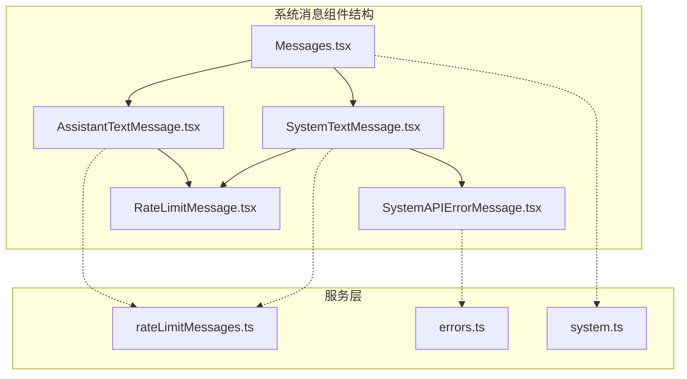
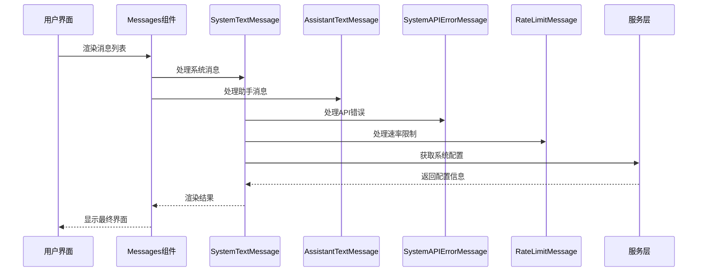
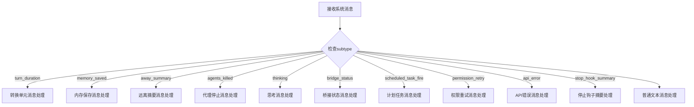
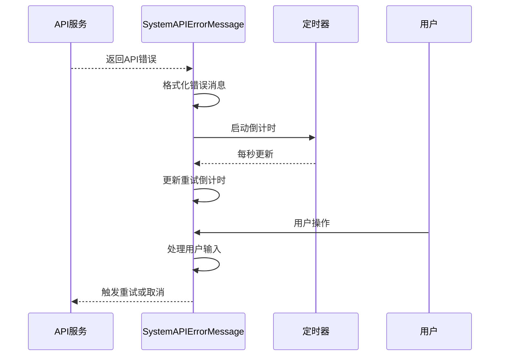
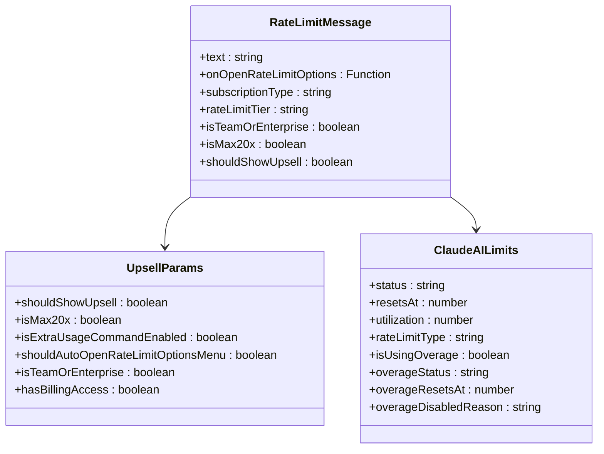
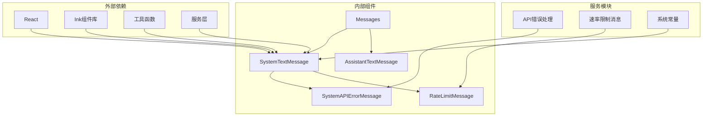

# 系统消息组件

<cite>
**本文档引用的文件**
- [SystemTextMessage.tsx](file://src/components/messages/SystemTextMessage.tsx)
- [SystemAPIErrorMessage.tsx](file://src/components/messages/SystemAPIErrorMessage.tsx)
- [AssistantTextMessage.tsx](file://src/components/messages/AssistantTextMessage.tsx)
- [Messages.tsx](file://src/components/Messages.tsx)
- [RateLimitMessage.tsx](file://src/components/messages/RateLimitMessage.tsx)
- [rateLimitMessages.ts](file://src/services/rateLimitMessages.ts)
- [errors.ts](file://src/services/api/errors.ts)
- [system.ts](file://src/constants/system.ts)
</cite>

## 目录
1. [简介](#简介)
2. [项目结构](#项目结构)
3. [核心组件](#核心组件)
4. [架构概览](#架构概览)
5. [详细组件分析](#详细组件分析)
6. [依赖关系分析](#依赖关系分析)
7. [性能考虑](#性能考虑)
8. [故障排除指南](#故障排除指南)
9. [结论](#结论)

## 简介

系统消息组件是 Claude Code 中负责处理和显示各种系统级消息的核心模块。该组件体系涵盖了系统文本消息、API 错误消息、速率限制消息和关闭消息等多种类型的消息处理逻辑。

系统消息组件的主要职责包括：
- 解析和渲染不同类型的系统消息
- 处理 API 错误和异常情况
- 提供用户友好的错误提示和解决方案
- 支持消息的展开/折叠功能
- 实现消息的状态管理和交互功能

## 项目结构

系统消息组件位于 `src/components/messages/` 目录下，采用模块化设计，每个消息类型都有独立的组件文件：

**图表来源**
- [SystemTextMessage.tsx:1-827](file://src/components/messages/SystemTextMessage.tsx#L1-L827)
- [Messages.tsx:1-834](file://src/components/Messages.tsx#L1-L834)

**章节来源**
- [SystemTextMessage.tsx:1-827](file://src/components/messages/SystemTextMessage.tsx#L1-L827)
- [Messages.tsx:1-834](file://src/components/Messages.tsx#L1-L834)

## 核心组件

系统消息组件体系包含以下核心组件：

### SystemTextMessage 组件
这是系统消息的主组件，负责处理各种系统级别的消息类型：
- 转换时长消息 (`turn_duration`)
- 内存保存消息 (`memory_saved`)
- 远离摘要消息 (`away_summary`)
- 代理停止消息 (`agents_killed`)
- 桥接状态消息 (`bridge_status`)
- 计划任务触发消息 (`scheduled_task_fire`)
- 权限重试消息 (`permission_retry`)

### SystemAPIErrorMessage 组件
专门处理 API 错误消息，包含重试机制和倒计时功能。

### AssistantTextMessage 组件
处理助手返回的文本消息，包括各种错误类型的特殊处理。

### RateLimitMessage 组件
处理速率限制相关的消息，提供自动化的解决方案建议。

**章节来源**
- [SystemTextMessage.tsx:30-250](file://src/components/messages/SystemTextMessage.tsx#L30-L250)
- [SystemAPIErrorMessage.tsx:15-141](file://src/components/messages/SystemAPIErrorMessage.tsx#L15-L141)
- [AssistantTextMessage.tsx:47-270](file://src/components/messages/AssistantTextMessage.tsx#L47-L270)
- [RateLimitMessage.tsx:52-161](file://src/components/messages/RateLimitMessage.tsx#L52-L161)

## 架构概览

系统消息组件采用分层架构设计，从上到下分为展示层、业务逻辑层和服务层：

**图表来源**
- [Messages.tsx:341-721](file://src/components/Messages.tsx#L341-L721)
- [SystemTextMessage.tsx:36-250](file://src/components/messages/SystemTextMessage.tsx#L36-L250)

系统架构的关键特点：
- **组件解耦**：每个消息类型都有独立的处理组件
- **状态管理**：使用 React hooks 进行状态管理
- **性能优化**：采用 memo 和缓存机制减少重新渲染
- **错误处理**：完善的错误捕获和降级机制

**章节来源**
- [Messages.tsx:374-778](file://src/components/Messages.tsx#L374-L778)
- [SystemTextMessage.tsx:1-827](file://src/components/messages/SystemTextMessage.tsx#L1-L827)

## 详细组件分析

### SystemTextMessage 组件深度分析

SystemTextMessage 是系统消息处理的核心组件，采用了多种优化技术和模式：

#### 消息类型路由机制
组件通过 `message.subtype` 字段进行消息类型识别和路由：

**图表来源**
- [SystemTextMessage.tsx:45-229](file://src/components/messages/SystemTextMessage.tsx#L45-L229)

#### 性能优化策略
组件实现了多层次的性能优化：

1. **React 编译器优化**：使用 `_c` 符号进行编译器优化
2. **记忆化缓存**：对频繁使用的计算结果进行缓存
3. **条件渲染**：根据消息类型和级别决定是否渲染
4. **状态最小化**：只在必要时更新组件状态

#### 可访问性实现
系统消息组件提供了多种可访问性支持：
- **视觉标识**：使用不同的符号和颜色区分消息类型
- **屏幕阅读器友好**：正确的语义化标签和描述
- **键盘导航**：支持键盘操作和焦点管理
- **高对比度**：确保在不同主题下的可读性

**章节来源**
- [SystemTextMessage.tsx:36-827](file://src/components/messages/SystemTextMessage.tsx#L36-L827)

### SystemAPIErrorMessage 组件分析

SystemAPIErrorMessage 专门处理 API 错误消息，具有以下特性：

#### 重试机制
组件实现了智能的重试机制：
- **倒计时显示**：显示剩余重试时间
- **条件重试**：根据错误类型和环境变量决定是否重试
- **用户控制**：允许用户手动取消重试

#### 错误格式化
组件提供了强大的错误格式化功能：
- **截断处理**：长错误消息的智能截断
- **环境变量支持**：显示调试信息（如 API 超时设置）
- **多语言支持**：支持不同语言的错误消息

**图表来源**
- [SystemAPIErrorMessage.tsx:15-141](file://src/components/messages/SystemAPIErrorMessage.tsx#L15-L141)

**章节来源**
- [SystemAPIErrorMessage.tsx:15-141](file://src/components/messages/SystemAPIErrorMessage.tsx#L15-L141)

### 速率限制消息处理

速率限制消息处理是系统消息组件的重要组成部分，涉及多个层面的处理逻辑：

#### 速率限制检测
组件能够检测不同类型的速率限制：
- **会话限制** (`five_hour`)
- **周限制** (`seven_day`)
- **Opus 限制** (`seven_day_opus`)
- **Sonnet 限制** (`seven_day_sonnet`)
- **超量使用** (`overage`)

#### 自动化解决方案
系统提供了自动化的解决方案建议：
- **订阅类型判断**：根据用户订阅类型提供相应建议
- **团队/企业支持**：针对团队和企业用户提供特殊处理
- **自动菜单**：在适当情况下自动打开选项菜单

**图表来源**
- [RateLimitMessage.tsx:10-51](file://src/components/messages/RateLimitMessage.tsx#L10-L51)
- [rateLimitMessages.ts:36-104](file://src/services/rateLimitMessages.ts#L36-L104)

**章节来源**
- [RateLimitMessage.tsx:52-161](file://src/components/messages/RateLimitMessage.tsx#L52-L161)
- [rateLimitMessages.ts:45-104](file://src/services/rateLimitMessages.ts#L45-L104)

## 依赖关系分析

系统消息组件之间的依赖关系如下：

**图表来源**
- [SystemTextMessage.tsx:1-30](file://src/components/messages/SystemTextMessage.tsx#L1-L30)
- [Messages.tsx:1-46](file://src/components/Messages.tsx#L1-L46)

主要依赖关系特点：
- **松耦合设计**：组件间通过清晰的接口通信
- **单向数据流**：数据流向从父组件到子组件
- **服务层抽象**：业务逻辑集中在服务层，便于测试和维护
- **类型安全**：使用 TypeScript 确保类型安全

**章节来源**
- [SystemTextMessage.tsx:1-30](file://src/components/messages/SystemTextMessage.tsx#L1-L30)
- [Messages.tsx:1-46](file://src/components/Messages.tsx#L1-L46)

## 性能考虑

系统消息组件在设计时充分考虑了性能优化：

### 渲染优化
- **React.memo 使用**：对不经常变化的组件使用记忆化
- **条件渲染**：避免不必要的组件渲染
- **虚拟滚动**：大量消息时使用虚拟滚动技术
- **懒加载**：非关键路径的功能延迟加载

### 内存管理
- **组件卸载清理**：及时清理定时器和事件监听器
- **状态最小化**：只存储必要的状态信息
- **缓存策略**：合理使用缓存减少重复计算

### 网络优化
- **错误重试**：智能的错误重试机制
- **超时处理**：合理的超时设置和处理
- **连接池**：复用网络连接减少开销

## 故障排除指南

### 常见问题及解决方案

#### 消息不显示问题
**症状**：某些系统消息没有正确显示
**可能原因**：
- 消息级别设置为 `info` 且未启用详细模式
- 消息内容为空或格式不正确
- 组件渲染条件不满足

**解决方法**：
1. 检查消息的 `level` 属性
2. 验证消息内容格式
3. 确认渲染条件逻辑

#### API 错误处理问题
**症状**：API 错误消息显示不正确或重试失败
**可能原因**：
- 错误格式化函数异常
- 重试配置不正确
- 环境变量设置问题

**解决方法**：
1. 检查 `formatAPIError` 函数
2. 验证重试配置参数
3. 确认相关环境变量设置

#### 速率限制处理问题
**症状**：速率限制消息显示不正确
**可能原因**：
- 速率限制状态判断错误
- 解决方案建议不适用
- 用户订阅类型识别错误

**解决方法**：
1. 检查 `getRateLimitMessage` 函数
2. 验证订阅类型检测逻辑
3. 确认解决方案生成算法

**章节来源**
- [SystemAPIErrorMessage.tsx:15-141](file://src/components/messages/SystemAPIErrorMessage.tsx#L15-L141)
- [rateLimitMessages.ts:45-104](file://src/services/rateLimitMessages.ts#L45-L104)

## 结论

系统消息组件是 Claude Code 中重要的基础设施组件，具有以下特点：

### 设计优势
- **模块化设计**：每个消息类型都有独立的处理组件
- **性能优化**：采用多种优化技术确保高效运行
- **可扩展性**：清晰的架构便于添加新的消息类型
- **可维护性**：良好的代码组织和文档

### 技术亮点
- **智能重试机制**：API 错误的自动重试处理
- **多语言支持**：国际化和本地化能力
- **可访问性**：全面的可访问性支持
- **错误处理**：完善的错误捕获和恢复机制

### 未来改进方向
- **性能监控**：添加更详细的性能指标
- **用户体验**：进一步优化用户交互体验
- **扩展性**：支持更多自定义消息类型
- **测试覆盖**：增加自动化测试覆盖率

系统消息组件为 Claude Code 提供了稳定可靠的消息处理能力，是整个应用架构中不可或缺的重要组成部分。