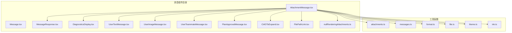
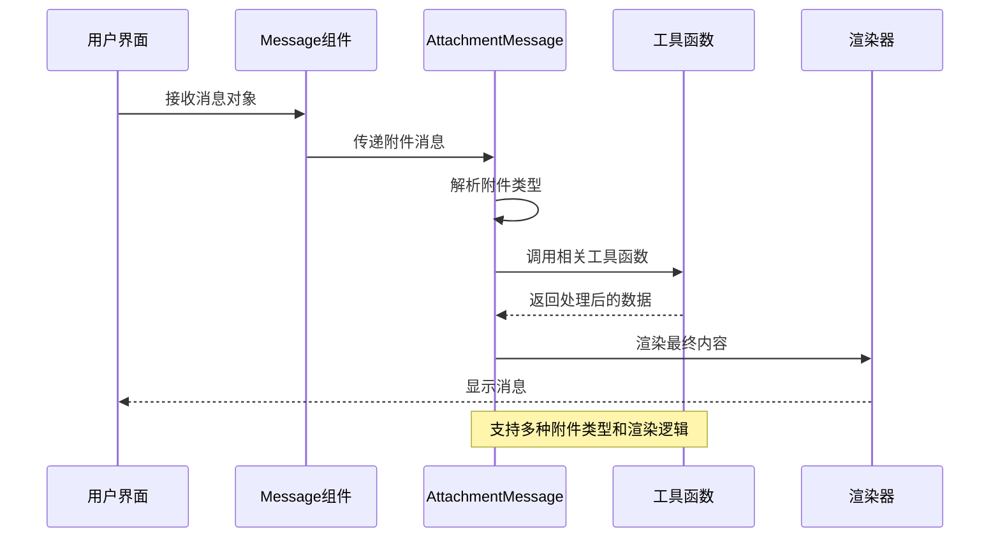
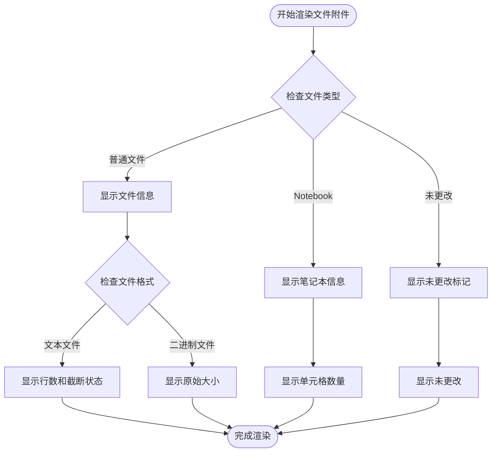
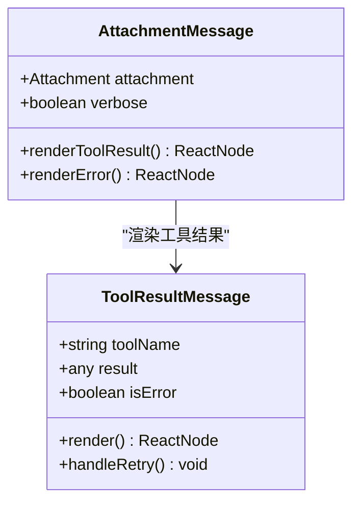
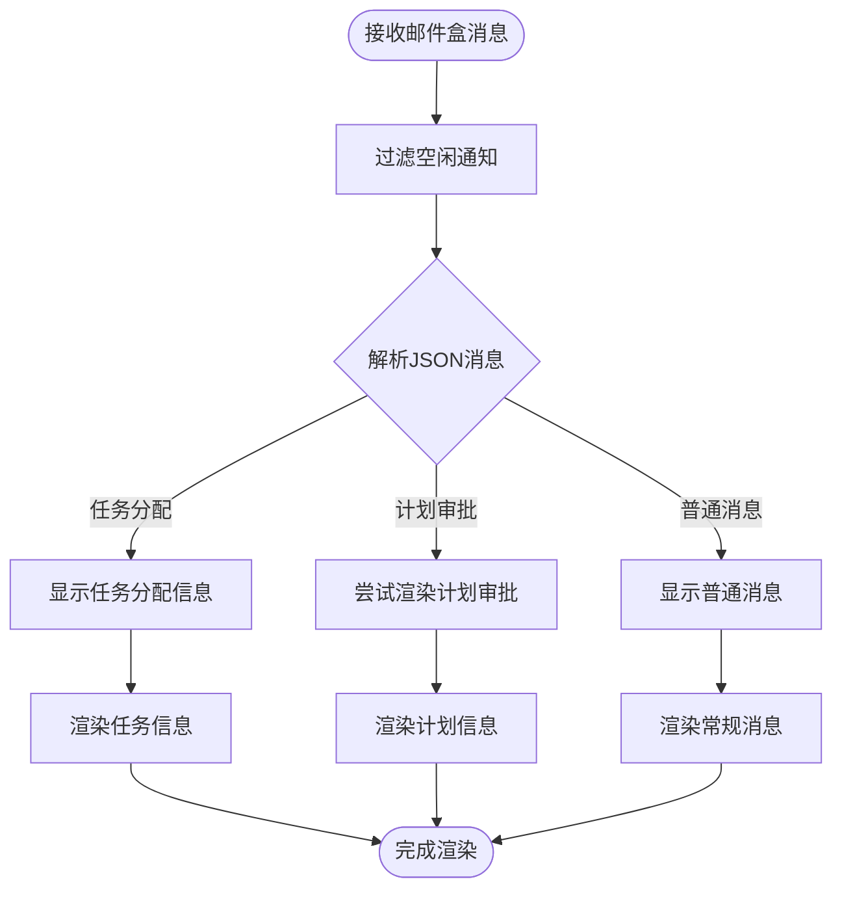
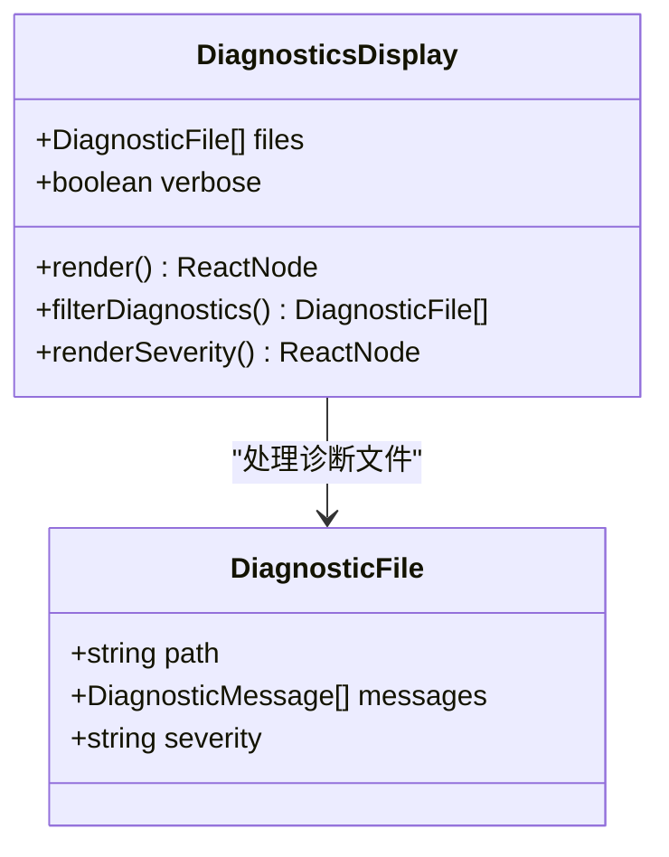
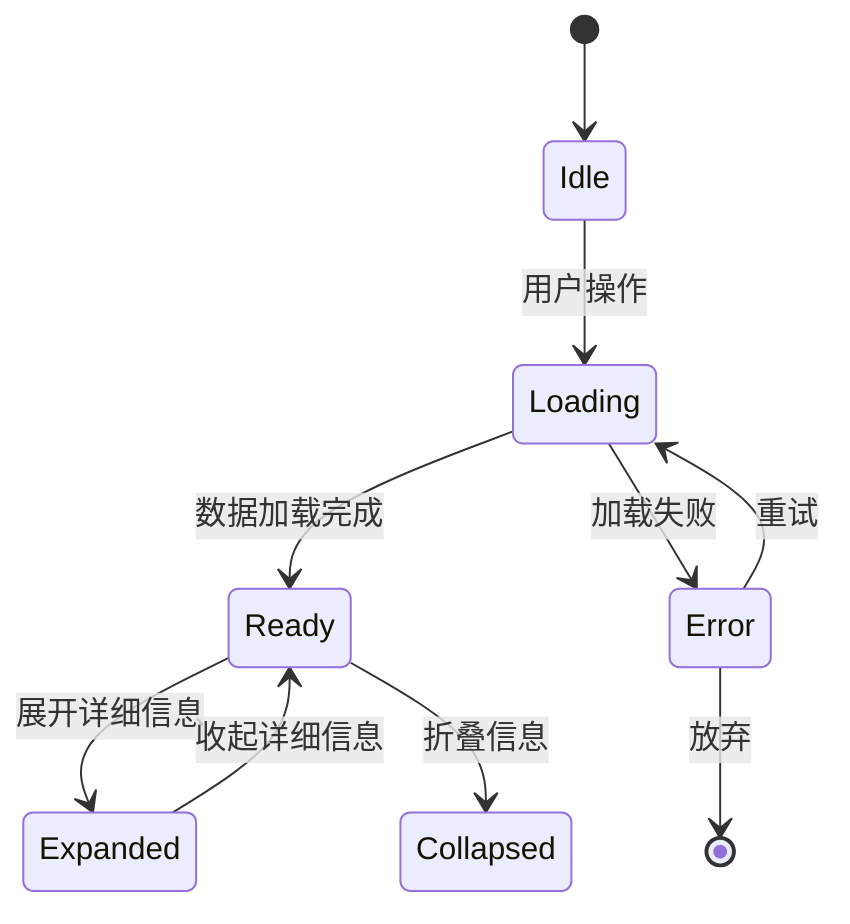
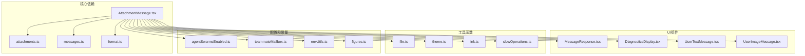

# 附件消息组件

<cite>
**本文档引用的文件**
- [AttachmentMessage.tsx](file://src/components/messages/AttachmentMessage.tsx)
- [Message.tsx](file://src/components/Message.tsx)
- [attachments.ts](file://src/utils/attachments.ts)
- [nullRenderingAttachments.ts](file://src/components/messages/nullRenderingAttachments.ts)
- [MessageResponse.tsx](file://src/components/MessageResponse.tsx)
- [DiagnosticsDisplay.tsx](file://src/components/DiagnosticsDisplay.tsx)
- [UserTextMessage.tsx](file://src/components/messages/UserTextMessage.tsx)
- [UserImageMessage.tsx](file://src/components/messages/UserImageMessage.tsx)
- [UserTeammateMessage.tsx](file://src/components/messages/UserTeammateMessage.tsx)
- [PlanApprovalMessage.tsx](file://src/components/messages/PlanApprovalMessage.tsx)
- [CtrlOToExpand.tsx](file://src/components/CtrlOToExpand.tsx)
- [FilePathLink.tsx](file://src/components/FilePathLink.tsx)
- [messageActions.tsx](file://src/components/messageActions.tsx)
- [ink.ts](file://src/ink.ts)
- [theme.ts](file://src/utils/theme.ts)
- [format.ts](file://src/utils/format.ts)
- [file.ts](file://src/utils/file.ts)
- [messages.ts](file://src/utils/messages.ts)
- [agentSwarmsEnabled.ts](file://src/utils/agentSwarmsEnabled.ts)
- [teammateMailbox.ts](file://src/utils/teammateMailbox.ts)
- [slowOperations.ts](file://src/utils/slowOperations.ts)
- [envUtils.ts](file://src/utils/envUtils.ts)
- [figures.ts](file://src/constants/figures.ts)
</cite>

## 目录
1. [简介](#简介)
2. [项目结构](#项目结构)
3. [核心组件](#核心组件)
4. [架构概览](#架构概览)
5. [详细组件分析](#详细组件分析)
6. [依赖关系分析](#依赖关系分析)
7. [性能考虑](#性能考虑)
8. [故障排除指南](#故障排除指南)
9. [结论](#结论)

## 简介

附件消息组件是 Claude Code 中用于显示各种类型附件消息的核心组件。该组件负责渲染来自不同来源的附件内容，包括文件读取、工具调用结果、诊断信息、团队成员消息等。本文档深入分析了附件消息的实现细节，包括内容渲染机制、交互功能、属性接口、事件处理和状态管理。

## 项目结构

附件消息组件位于 `src/components/messages/` 目录下，主要文件包括：

**图表来源**
- [AttachmentMessage.tsx:1-50](file://src/components/messages/AttachmentMessage.tsx#L1-L50)
- [Message.tsx:1-30](file://src/components/Message.tsx#L1-L30)

**章节来源**
- [AttachmentMessage.tsx:1-50](file://src/components/messages/AttachmentMessage.tsx#L1-L50)
- [Message.tsx:1-30](file://src/components/Message.tsx#L1-L30)

## 核心组件

### AttachmentMessage 组件

AttachmentMessage 是主要的消息渲染组件，负责处理各种类型的附件消息：

#### 主要属性接口

| 属性名 | 类型 | 必需 | 描述 |
|--------|------|------|------|
| addMargin | boolean | 是 | 是否添加外边距 |
| attachment | Attachment | 是 | 附件对象，包含消息内容和元数据 |
| verbose | boolean | 是 | 是否详细模式 |
| isTranscriptMode | boolean | 否 | 是否为转录模式 |

#### 支持的附件类型

组件支持以下附件类型：

1. **文件相关**: file, already_read_file, compact_file_reference, pdf_reference
2. **IDE集成**: selected_lines_in_ide, opened_file_in_ide
3. **内存相关**: nested_memory, relevant_memories
4. **技能相关**: dynamic_skill, skill_listing, skill_discovery
5. **命令相关**: queued_command, plan_file_reference, invoked_skills
6. **诊断信息**: diagnostics
7. **MCP资源**: mcp_resource
8. **钩子系统**: async_hook_response, hook_blocking_error 等
9. **任务状态**: task_status
10. **团队消息**: teammate_mailbox, teammate_shutdown_batch

**章节来源**
- [AttachmentMessage.tsx:30-50](file://src/components/messages/AttachmentMessage.tsx#L30-L50)
- [AttachmentMessage.tsx:126-356](file://src/components/messages/AttachmentMessage.tsx#L126-L356)

## 架构概览

附件消息组件采用分层架构设计，具有清晰的职责分离：

**图表来源**
- [Message.tsx:83-96](file://src/components/Message.tsx#L83-L96)
- [AttachmentMessage.tsx:36-41](file://src/components/messages/AttachmentMessage.tsx#L36-L41)

## 详细组件分析

### 文件附件渲染

文件附件是最常见的附件类型，支持多种文件格式：

#### 文件读取显示

**图表来源**
- [AttachmentMessage.tsx:131-148](file://src/components/messages/AttachmentMessage.tsx#L131-L148)

#### 文件预览和下载

文件附件支持以下功能：

1. **文件预览**: 显示文件的基本信息（路径、大小、行数）
2. **文件下载**: 提供文件下载链接
3. **文件导航**: 通过 FilePathLink 组件进行文件导航

**章节来源**
- [AttachmentMessage.tsx:131-148](file://src/components/messages/AttachmentMessage.tsx#L131-L148)
- [FilePathLink.tsx](file://src/components/FilePathLink.tsx)

### 工具结果消息

工具结果消息用于显示工具执行的结果：

#### 工具调用结果显示

**图表来源**
- [AttachmentMessage.tsx:232-243](file://src/components/messages/AttachmentMessage.tsx#L232-L243)

#### 工具结果查看功能

工具结果消息支持以下交互功能：

1. **详细查看**: 在详细模式下显示完整结果
2. **错误详情**: 显示具体的错误信息
3. **重试机制**: 提供工具重试选项

**章节来源**
- [AttachmentMessage.tsx:232-243](file://src/components/messages/AttachmentMessage.tsx#L232-L243)

### 团队成员消息

团队成员消息用于显示团队协作相关信息：

#### 邮件盒消息处理

**图表来源**
- [AttachmentMessage.tsx:48-103](file://src/components/messages/AttachmentMessage.tsx#L48-L103)

#### 团队协作功能

团队成员消息支持以下功能：

1. **任务分配**: 显示任务分配详情
2. **计划审批**: 处理计划审批请求
3. **消息过滤**: 自动过滤无意义的通知

**章节来源**
- [AttachmentMessage.tsx:48-103](file://src/components/messages/AttachmentMessage.tsx#L48-L103)

### 诊断信息显示

诊断信息组件专门用于显示代码诊断结果：

#### 诊断信息渲染

**图表来源**
- [DiagnosticsDisplay.tsx](file://src/components/DiagnosticsDisplay.tsx)

#### 诊断信息功能

诊断信息显示支持以下特性：

1. **严重程度分类**: 按严重程度排序诊断信息
2. **文件关联**: 将诊断信息与源文件关联
3. **详细视图**: 在详细模式下显示完整诊断信息

**章节来源**
- [DiagnosticsDisplay.tsx](file://src/components/DiagnosticsDisplay.tsx)

### 状态管理和交互

附件消息组件具有完善的状态管理和用户交互功能：

#### 状态管理

**图表来源**
- [AttachmentMessage.tsx:361-503](file://src/components/messages/AttachmentMessage.tsx#L361-L503)

#### 交互功能

附件消息支持以下交互功能：

1. **展开/折叠**: 控制详细信息的显示
2. **复制内容**: 复制消息内容到剪贴板
3. **查看详情**: 查看更详细的信息
4. **状态切换**: 切换显示模式

**章节来源**
- [AttachmentMessage.tsx:361-503](file://src/components/messages/AttachmentMessage.tsx#L361-L503)

## 依赖关系分析

附件消息组件具有复杂的依赖关系，涉及多个模块和工具函数：

**图表来源**
- [AttachmentMessage.tsx:1-30](file://src/components/messages/AttachmentMessage.tsx#L1-L30)

**章节来源**
- [AttachmentMessage.tsx:1-30](file://src/components/messages/AttachmentMessage.tsx#L1-L30)
- [attachments.ts:1-50](file://src/utils/attachments.ts#L1-L50)

## 性能考虑

附件消息组件在设计时充分考虑了性能优化：

### 渲染优化

1. **条件渲染**: 使用 `feature()` 函数进行编译时条件渲染
2. **记忆化**: 使用 React.memo 优化组件渲染
3. **懒加载**: 对于大型附件使用懒加载策略

### 内存管理

1. **附件缓存**: 使用 `cacheKeys` 进行附件状态缓存
2. **文件状态管理**: 通过 `FileStateCache` 管理文件状态
3. **内存限制**: 实现 `MAX_MEMORY_BYTES` 限制防止内存溢出

### 大文件处理

1. **分块传输**: 支持大文件的分块传输和显示
2. **进度指示**: 提供文件处理进度指示
3. **超时控制**: 实现文件读取超时机制

**章节来源**
- [attachments.ts:269-290](file://src/utils/attachments.ts#L269-L290)
- [attachments.ts:112-122](file://src/utils/attachments.ts#L112-L122)

## 故障排除指南

### 常见问题和解决方案

#### 附件无法显示

**问题**: 附件消息不显示或显示为空白

**可能原因**:
1. 附件类型不在支持列表中
2. 附件内容为空或损坏
3. 权限不足无法访问附件

**解决方案**:
1. 检查附件类型是否在 `NULL_RENDERING_TYPES` 中
2. 验证附件内容的完整性
3. 确认用户权限设置

#### 渲染性能问题

**问题**: 附件消息渲染缓慢

**可能原因**:
1. 大量附件同时渲染
2. 复杂的附件内容
3. 缺少适当的缓存

**解决方案**:
1. 实施虚拟滚动
2. 优化附件内容渲染
3. 添加适当的缓存机制

#### 文件访问错误

**问题**: 无法访问附件文件

**可能原因**:
1. 文件路径不存在
2. 文件权限不足
3. 文件被其他进程占用

**解决方案**:
1. 验证文件路径的有效性
2. 检查文件权限设置
3. 确认文件未被锁定

**章节来源**
- [nullRenderingAttachments.ts:4-56](file://src/components/messages/nullRenderingAttachments.ts#L4-L56)

## 结论

附件消息组件是 Claude Code 中功能最丰富的消息组件之一，它提供了对各种类型附件的统一渲染能力。通过模块化的架构设计、完善的错误处理机制和性能优化策略，该组件能够有效处理从简单文件信息到复杂工具结果的各种消息类型。

组件的主要优势包括：

1. **类型安全**: 通过 TypeScript 定义完整的附件类型系统
2. **扩展性**: 支持新类型的附件轻松添加
3. **性能优化**: 实现了多种性能优化策略
4. **用户体验**: 提供丰富的交互功能和状态管理

未来可以进一步改进的方向包括：

1. 更好的大文件处理机制
2. 增强的错误恢复能力
3. 更灵活的自定义渲染选项
4. 改进的性能监控和分析