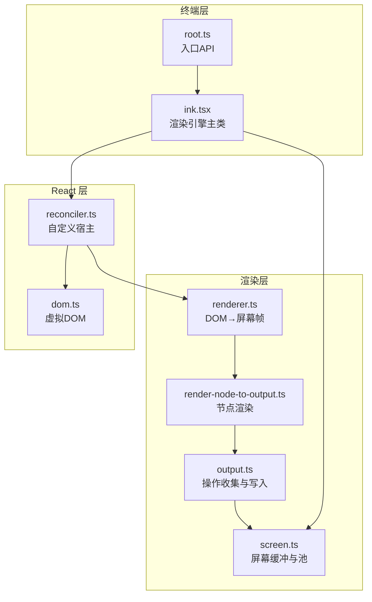
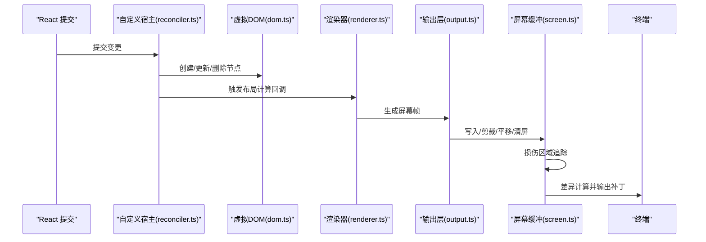
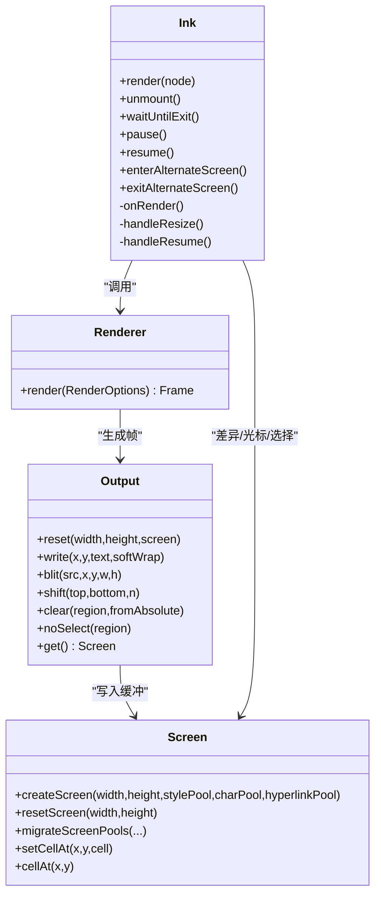
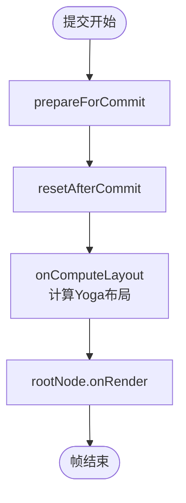
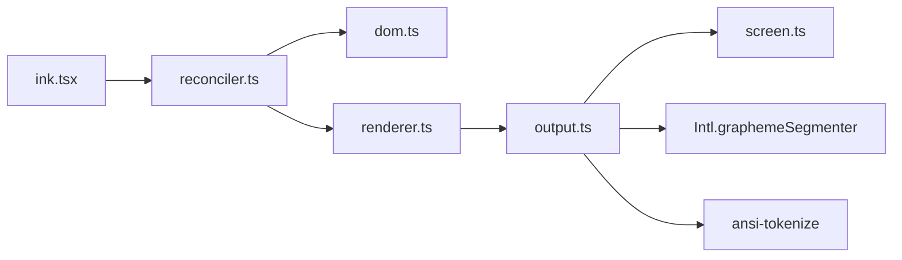

# 终端渲染系统

<cite>
**本文档引用的文件**
- [src/ink.ts](file://src/ink.ts)
- [src/ink/ink.tsx](file://src/ink/ink.tsx)
- [src/ink/root.ts](file://src/ink/root.ts)
- [src/ink/renderer.ts](file://src/ink/renderer.ts)
- [src/ink/reconciler.ts](file://src/ink/reconciler.ts)
- [src/ink/dom.ts](file://src/ink/dom.ts)
- [src/ink/screen.ts](file://src/ink/screen.ts)
- [src/ink/render-node-to-output.ts](file://src/ink/render-node-to-output.ts)
- [src/ink/output.ts](file://src/ink/output.ts)
</cite>

## 目录
1. [简介](#简介)
2. [项目结构](#项目结构)
3. [核心组件](#核心组件)
4. [架构总览](#架构总览)
5. [详细组件分析](#详细组件分析)
6. [依赖关系分析](#依赖关系分析)
7. [性能考虑](#性能考虑)
8. [故障排查指南](#故障排查指南)
9. [结论](#结论)

## 简介
本文件面向 Claude Code 的终端渲染系统，系统基于 Ink 组件库构建，采用 React 19 的并发渲染与自定义宿主（React Reconciler）实现，结合 Yoga 布局引擎与高效的屏幕缓冲区，完成从 React 组件到终端输出的完整管线。该系统支持：
- 虚拟 DOM 与布局计算：通过自定义宿主在 Ink 中创建 DOM 节点并驱动 Yoga 计算布局。
- 屏幕缓冲与增量差异：使用双缓冲与损伤区域（damage region）进行最小化终端写入。
- 文本与样式处理：ANSI 颜色、超链接、软换行、双向文本等终端特性。
- 交互与焦点：键盘输入、鼠标事件、文本选择、搜索高亮等。
- 性能优化：字符缓存、样式池、对象池、滚动快速路径、帧节流等。

## 项目结构
Ink 渲染系统的核心位于 src/ink 目录，主要模块职责如下：
- ink.tsx：渲染引擎主类，协调 React 提交、布局计算、屏幕生成、差异计算与终端输出。
- reconciler.ts：自定义 React Reconciler 宿主，负责节点创建、属性应用、事件分发与布局回调。
- dom.ts：虚拟 DOM 实现，节点类型、属性、样式、脏标记与布局节点绑定。
- renderer.ts：渲染器，将 DOM 树转换为屏幕缓冲区帧。
- render-node-to-output.ts：节点渲染到输出层，处理文本换行、样式映射、裁剪与滚动。
- output.ts：输出层，收集写入、剪裁、平移、清屏等操作，最终写入屏幕缓冲。
- screen.ts：屏幕缓冲与对象池，包含字符池、超链接池、样式池与打包单元格存储。
- root.ts：入口 API，提供 render 与 createRoot，封装实例管理与选项配置。

**图表来源**
- [src/ink/ink.tsx:76-279](file://src/ink/ink.tsx#L76-L279)
- [src/ink/root.ts:1-185](file://src/ink/root.ts#L1-L185)
- [src/ink/reconciler.ts:224-513](file://src/ink/reconciler.ts#L224-L513)
- [src/ink/dom.ts:110-132](file://src/ink/dom.ts#L110-L132)
- [src/ink/renderer.ts:31-179](file://src/ink/renderer.ts#L31-L179)
- [src/ink/render-node-to-output.ts:387-800](file://src/ink/render-node-to-output.ts#L387-L800)
- [src/ink/output.ts:170-532](file://src/ink/output.ts#L170-L532)
- [src/ink/screen.ts:451-544](file://src/ink/screen.ts#L451-L544)

**章节来源**
- [src/ink.ts:1-86](file://src/ink.ts#L1-L86)
- [src/ink/root.ts:1-185](file://src/ink/root.ts#L1-L185)

## 核心组件
- 渲染引擎主类（Ink）
  - 负责 React 提交后的渲染调度、布局计算、屏幕帧生成、差异计算与终端输出。
  - 管理 TTY 事件（resize、SIGCONT）、光标声明、选择与搜索高亮、全屏重绘与池复位。
- 自定义 Reconciler（reconciler.ts）
  - 定义宿主上下文、节点创建/更新/删除、样式应用、事件处理器设置、布局回调。
  - 与 FocusManager 协作，处理自动聚焦与节点移除。
- 虚拟 DOM（dom.ts）
  - 定义节点类型、属性、样式、脏标记、隐藏显示、滚动状态与事件处理器。
  - 提供布局节点绑定与测量函数（文本节点、原始 ANSI 节点）。
- 渲染器（renderer.ts）
  - 将根 DOM 节点的布局结果转换为屏幕帧，决定视口尺寸、游标可见性与滚动提示。
- 节点渲染（render-node-to-output.ts）
  - 处理文本换行与样式映射、溢出裁剪、滚动容器、绝对定位覆盖、软换行标记。
- 输出层（output.ts）
  - 收集写入、剪裁、平移、清屏、无选择标记等操作，执行到屏幕缓冲。
- 屏幕缓冲（screen.ts）
  - 使用打包数组存储单元格，包含字符池、超链接池、样式池与损伤区域。
  - 提供平移、清屏、迁移池、可见单元格访问等操作。

**章节来源**
- [src/ink/ink.tsx:76-279](file://src/ink/ink.tsx#L76-L279)
- [src/ink/reconciler.ts:224-513](file://src/ink/reconciler.ts#L224-L513)
- [src/ink/dom.ts:110-132](file://src/ink/dom.ts#L110-L132)
- [src/ink/renderer.ts:31-179](file://src/ink/renderer.ts#L31-L179)
- [src/ink/render-node-to-output.ts:387-800](file://src/ink/render-node-to-output.ts#L387-L800)
- [src/ink/output.ts:170-532](file://src/ink/output.ts#L170-L532)
- [src/ink/screen.ts:451-544](file://src/ink/screen.ts#L451-L544)

## 架构总览
Ink 的渲染流程从 React 提交开始，经过布局计算、节点渲染、输出层收集与屏幕缓冲，最终由差异引擎计算最小化补丁并写入终端。关键路径如下：

**图表来源**
- [src/ink/reconciler.ts:247-315](file://src/ink/reconciler.ts#L247-L315)
- [src/ink/renderer.ts:38-177](file://src/ink/renderer.ts#L38-L177)
- [src/ink/render-node-to-output.ts:387-800](file://src/ink/render-node-to-output.ts#L387-L800)
- [src/ink/output.ts:268-532](file://src/ink/output.ts#L268-L532)
- [src/ink/screen.ts:451-544](file://src/ink/screen.ts#L451-L544)
- [src/ink/ink.tsx:420-789](file://src/ink/ink.tsx#L420-L789)

## 详细组件分析

### 渲染引擎主类（Ink）
- 关键职责
  - React 提交后触发渲染调度（微任务节流），确保 useLayoutEffect 后的状态被渲染。
  - 管理 TTY 事件：窗口大小变化、SIGCONT 恢复、备用屏幕进入/退出。
  - 光标声明与物理光标移动：根据声明位置进行绝对或相对移动，避免闪烁。
  - 选择与搜索高亮：在屏幕缓冲上叠加样式，保证差异引擎仍可正确比较。
  - 池复位与性能统计：定期复用字符/超链接池，记录 Yoga 与提交耗时。
- 重要机制
  - 双缓冲：front/back 帧交换，便于差异计算。
  - 全损伤回退：当布局偏移、选择/高亮覆盖或帧污染时扩大损伤区域。
  - 帧事件回调：提供每帧耗时与闪烁信息，便于调试与性能监控。

**图表来源**
- [src/ink/ink.tsx:76-279](file://src/ink/ink.tsx#L76-L279)
- [src/ink/renderer.ts:31-179](file://src/ink/renderer.ts#L31-L179)
- [src/ink/output.ts:170-532](file://src/ink/output.ts#L170-L532)
- [src/ink/screen.ts:451-544](file://src/ink/screen.ts#L451-L544)

**章节来源**
- [src/ink/ink.tsx:76-279](file://src/ink/ink.tsx#L76-L279)
- [src/ink/ink.tsx:420-789](file://src/ink/ink.tsx#L420-L789)

### 自定义 Reconciler（reconciler.ts）
- 节点创建与属性应用
  - 根据宿主上下文限制嵌套规则（如文本内禁止 Box）。
  - 应用样式与文本样式，设置事件处理器，避免不必要的脏标记。
- 布局回调与提交阶段
  - 在 resetAfterCommit 中触发 onComputeLayout，计算 Yoga 布局。
  - 记录提交耗时与 Yoga 耗时，用于性能分析。
- 事件与焦点
  - 分发离散更新事件，处理自动聚焦与节点移除。

**图表来源**
- [src/ink/reconciler.ts:247-315](file://src/ink/reconciler.ts#L247-L315)

**章节来源**
- [src/ink/reconciler.ts:224-513](file://src/ink/reconciler.ts#L224-L513)

### 虚拟 DOM（dom.ts）
- 节点类型与属性
  - 定义 ink-root、ink-box、ink-text、ink-virtual-text、ink-link、ink-progress、ink-raw-ansi 等节点。
  - 属性与样式存储于节点对象，事件处理器独立保存以避免脏标记。
- 布局与脏标记
  - 文本节点与原始 ANSI 节点设置测量函数；脏标记向上冒泡，触发布局重算。
  - 隐藏/显示节点时同步 Yoga 显示状态与脏标记。
- 滚动与粘性滚动
  - 提供 scrollTop、pendingScrollDelta、scrollHeight、scrollViewportHeight 等滚动状态字段。

**章节来源**
- [src/ink/dom.ts:110-132](file://src/ink/dom.ts#L110-L132)
- [src/ink/dom.ts:393-423](file://src/ink/dom.ts#L393-L423)

### 渲染器（renderer.ts）
- 输入参数
  - 前一帧屏幕、后一帧屏幕、是否 TTY、终端宽高、备用屏幕标志、前帧污染标志。
- 行为
  - 若 Yoga 尺寸无效则返回空帧；否则创建/重置输出对象，渲染节点树。
  - 根据备用屏幕标志与高度约束，确保内容不溢出。
  - 返回帧对象，包含屏幕、视口、游标可见性与滚动提示。

**章节来源**
- [src/ink/renderer.ts:15-179](file://src/ink/renderer.ts#L15-L179)

### 节点渲染（render-node-to-output.ts）
- 文本渲染
  - 将多个文本节点压缩为样式段，按需换行与应用样式；支持软换行标记。
  - 对多段样式文本，按字符位置映射样式，保持换行后样式一致性。
- 溢出与滚动
  - 处理 overflowX/overflowY 与滚动容器，计算 scrollHeight 与视口高度。
  - 实现粘性滚动与滚动漂移（pendingScrollDelta）的自适应/比例式排空。
- 绝对定位覆盖
  - 记录绝对定位节点的旧边界，防止干净子树回写导致的幽灵残留。

**章节来源**
- [src/ink/render-node-to-output.ts:387-800](file://src/ink/render-node-to-output.ts#L387-L800)

### 输出层（output.ts）
- 操作收集
  - 支持 write、clip、unclip、blit、clear、noSelect、shift 等操作。
  - 通过 charCache 缓存已分词与聚簇化的字符序列，避免重复 tokenization 与 grapheme 聚合。
- 写入与剪裁
  - 对写入行进行水平/垂直剪裁，处理软换行与宽字符截断。
  - 对 blit 区域进行绝对定位清除排除，避免幽灵残留。
- 无选择标记
  - 最后应用 noSelect 标记，确保其覆盖 blit 与写入。

**章节来源**
- [src/ink/output.ts:170-532](file://src/ink/output.ts#L170-L532)

### 屏幕缓冲（screen.ts）
- 数据结构
  - 使用 Int32Array 存储单元格数据，每个单元格占两个整数：字符索引与样式/超链接/宽度打包。
  - 提供 emptyStyleId、noSelect 位图、软换行标记数组。
- 池与迁移
  - 字符池、超链接池与样式池用于去重与跨帧复用。
  - 屏幕池迁移：在长会话中迁移 ID 到新池，避免无限增长。
- 操作
  - setCellAt、blitRegion、shiftRows、resetScreen、cellAt/visibleCellAtIndex 等。

**章节来源**
- [src/ink/screen.ts:451-544](file://src/ink/screen.ts#L451-L544)
- [src/ink/screen.ts:693-800](file://src/ink/screen.ts#L693-L800)

## 依赖关系分析
- 组件耦合
  - Ink 依赖 Reconciler 与 DOM，通过 onComputeLayout 与 onRender 回调驱动渲染。
  - Renderer 依赖 DOM 与 Output，负责帧生成。
  - Output 依赖 Screen 与样式池，负责操作收集与写入。
- 外部依赖
  - Yoga 布局引擎：用于 Flex 布局与尺寸计算。
  - ansi-tokenize：ANSI 解析与样式提取。
  - Intl.graphemeSegmenter：Unicode grapheme 聚合。
- 循环与边界
  - 事件分发通过 Dispatcher 与宿主解耦，避免循环导入。
  - 节点缓存与池复位在 Ink 层统一管理，避免跨模块副作用。

**图表来源**
- [src/ink/ink.tsx:29-31](file://src/ink/ink.tsx#L29-L31)
- [src/ink/output.ts:1-27](file://src/ink/output.ts#L1-L27)
- [src/ink/screen.ts:1-14](file://src/ink/screen.ts#L1-L14)

**章节来源**
- [src/ink/ink.tsx:1-50](file://src/ink/ink.tsx#L1-L50)
- [src/ink/output.ts:1-27](file://src/ink/output.ts#L1-L27)
- [src/ink/screen.ts:1-14](file://src/ink/screen.ts#L1-L14)

## 性能考虑
- 渲染缓存
  - charCache：按行缓存 tokenization 与 grapheme 聚合结果，避免重复计算。
  - nodeCache：缓存节点布局矩形，支持干净节点的区域回写（blit）。
  - 池复用：字符池、超链接池、样式池在长会话中定期迁移，避免无限增长。
- 增量更新
  - 损伤区域（damage）追踪：仅比较实际变化区域，减少 diff 成本。
  - 全损伤回退：布局偏移、选择/高亮覆盖或帧污染时扩大损伤范围。
  - 滚动快速路径：纯滚动场景使用 DECSTBM + SU/SD 快速滚动，避免全屏重绘。
- 内存管理
  - 打包单元格：Int32Array 存储，减少对象分配与 GC 压力。
  - 无选择位图与软换行标记：按行存储，避免额外对象。
- 帧节流与抖动
  - onRender 通过节流与微任务边界，确保布局完成后渲染，避免一帧滞后。
  - 滚动漂移采用自适应/比例式排空，兼顾即时响应与顺滑动画。

**章节来源**
- [src/ink/output.ts:178-205](file://src/ink/output.ts#L178-L205)
- [src/ink/screen.ts:554-587](file://src/ink/screen.ts#L554-L587)
- [src/ink/ink.tsx:420-789](file://src/ink/ink.tsx#L420-L789)

## 故障排查指南
- 全屏重绘与闪烁
  - Ink 会在检测到布局偏移、选择/高亮覆盖或帧污染时触发全损伤回退，并记录闪烁原因与触发行。
  - 可通过调试环境变量启用重绘调试，查看导致重绘的组件链。
- 光标异常与闪烁
  - 备用屏幕模式下，Ink 会在每次差异前锚定物理光标至 (0,0)，并在帧末尾停靠至底部，避免 iTerm2 光标引导闪烁。
  - 主屏幕模式下，若上次停靠位置与当前帧游标不一致，会发出相对移动指令恢复。
- 文本选择与复制
  - 选择覆盖在屏幕缓冲上进行，确保差异引擎仍可正确比较。
  - 无选择区域（<NoSelect>）最后应用，覆盖之前可能的 blit/noSelect。
- 滚动卡顿与跳动
  - 滚动漂移在原生终端与 xterm.js 下采用不同策略：原生按比例、xterm.js 自适应步进。
  - 当滚动量过大时，会进行上限截断以触发硬件滚动快速路径。

**章节来源**
- [src/ink/ink.tsx:604-789](file://src/ink/ink.tsx#L604-L789)
- [src/ink/render-node-to-output.ts:106-177](file://src/ink/render-node-to-output.ts#L106-L177)

## 结论
Claude Code 的终端渲染系统通过 React 19 并发与自定义宿主，结合 Yoga 布局与高效屏幕缓冲，实现了高性能、低开销的终端输出。系统在以下方面表现突出：
- 渲染管线清晰：从 React 提交到终端输出的完整链路，职责分离明确。
- 性能优化到位：缓存、池复用、损伤区域、滚动快速路径等策略有效降低 CPU 与带宽占用。
- 终端特性完备：ANSI 颜色、超链接、软换行、双向文本、选择与搜索高亮等。
- 可维护性与可观测性：调试重绘、性能计时、帧事件回调等工具便于问题定位与优化。