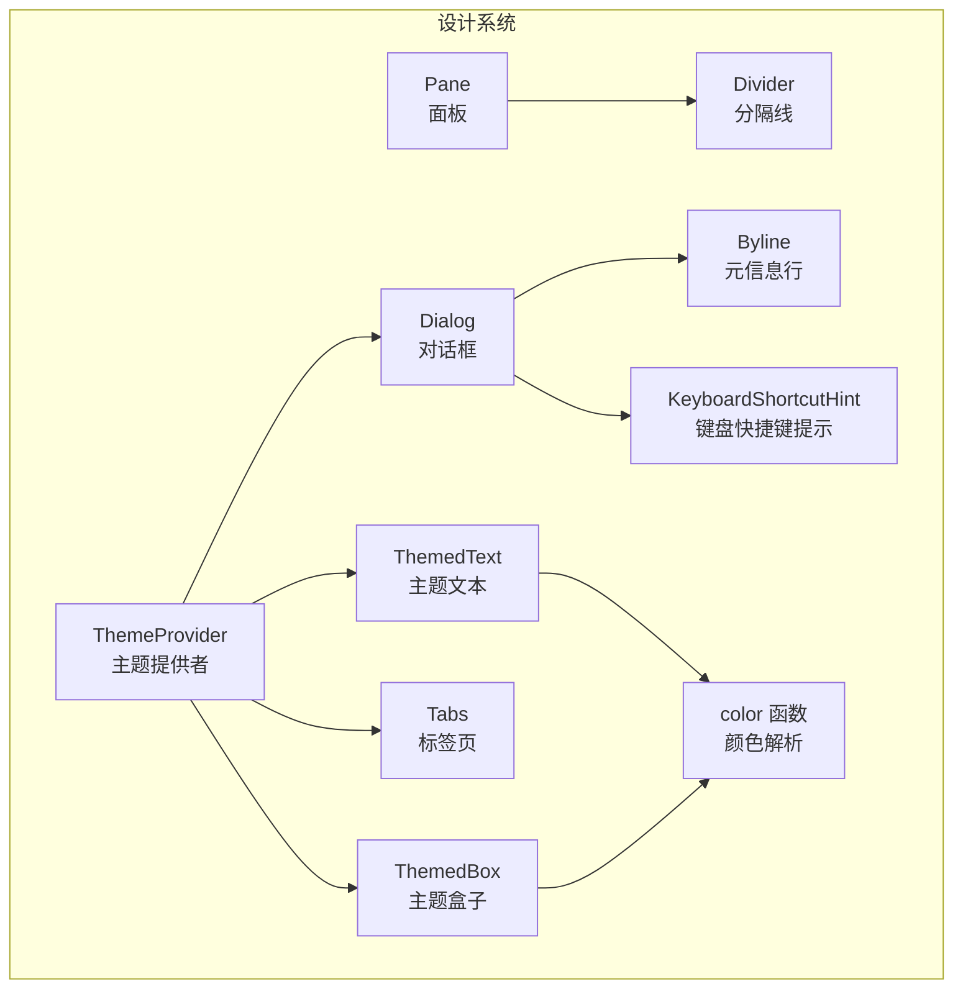
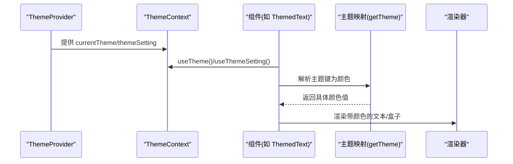
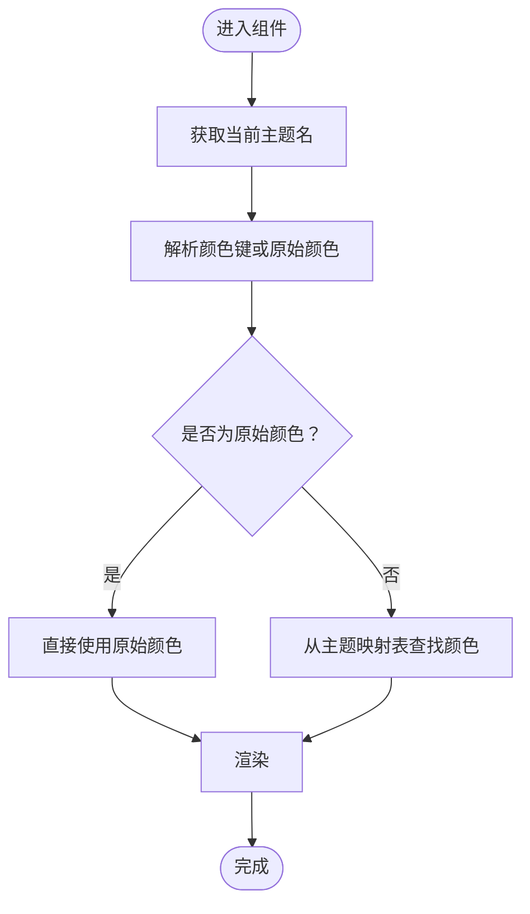
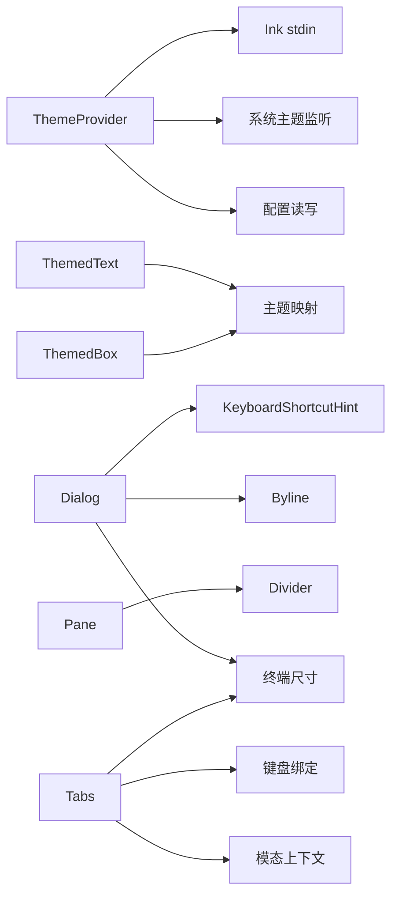

# 设计系统组件

<cite>
**本文档引用的文件**
- [ThemeProvider.tsx](file://src/components/design-system/ThemeProvider.tsx)
- [color.ts](file://src/components/design-system/color.ts)
- [theme.ts](file://src/utils/theme.ts)
- [ThemedText.tsx](file://src/components/design-system/ThemedText.tsx)
- [ThemedBox.tsx](file://src/components/design-system/ThemedBox.tsx)
- [Dialog.tsx](file://src/components/design-system/Dialog.tsx)
- [Tabs.tsx](file://src/components/design-system/Tabs.tsx)
- [Pane.tsx](file://src/components/design-system/Pane.tsx)
- [Divider.tsx](file://src/components/design-system/Divider.tsx)
- [Byline.tsx](file://src/components/design-system/Byline.tsx)
- [KeyboardShortcutHint.tsx](file://src/components/design-system/KeyboardShortcutHint.tsx)
</cite>

## 目录
1. [简介](#简介)
2. [项目结构](#项目结构)
3. [核心组件](#核心组件)
4. [架构总览](#架构总览)
5. [详细组件分析](#详细组件分析)
6. [依赖关系分析](#依赖关系分析)
7. [性能考量](#性能考量)
8. [故障排除指南](#故障排除指南)
9. [结论](#结论)
10. [附录](#附录)

## 简介
本文件面向 Claude Code 的设计系统组件，系统性阐述主题提供者的实现机制（颜色系统、字体规范与布局网格理念）、基础组件（文本、盒子、对话框、标签页）的实现细节、主题适配机制（颜色变量与响应式设计）、属性接口定义、使用示例与最佳实践，并讨论设计系统的可扩展性（自定义主题与样式覆盖）、可访问性支持与跨平台兼容性。

## 项目结构
设计系统位于 `src/components/design-system` 目录，围绕主题提供者与一组主题感知的基础组件构建，辅以工具函数与通用布局组件，形成统一的终端 UI 设计语言。

图表来源
- [ThemeProvider.tsx:43-116](file://src/components/design-system/ThemeProvider.tsx#L43-L116)
- [ThemedText.tsx:80-123](file://src/components/design-system/ThemedText.tsx#L80-L123)
- [ThemedBox.tsx:56-154](file://src/components/design-system/ThemedBox.tsx#L56-L154)
- [Dialog.tsx:30-137](file://src/components/design-system/Dialog.tsx#L30-L137)
- [Tabs.tsx:66-242](file://src/components/design-system/Tabs.tsx#L66-L242)
- [Pane.tsx:33-76](file://src/components/design-system/Pane.tsx#L33-L76)
- [Divider.tsx:66-148](file://src/components/design-system/Divider.tsx#L66-L148)
- [Byline.tsx:37-76](file://src/components/design-system/Byline.tsx#L37-L76)
- [KeyboardShortcutHint.tsx:38-80](file://src/components/design-system/KeyboardShortcutHint.tsx#L38-L80)
- [color.ts:9-30](file://src/components/design-system/color.ts#L9-L30)

章节来源
- [ThemeProvider.tsx:1-170](file://src/components/design-system/ThemeProvider.tsx#L1-L170)
- [ThemedText.tsx:1-124](file://src/components/design-system/ThemedText.tsx#L1-L124)
- [ThemedBox.tsx:1-156](file://src/components/design-system/ThemedBox.tsx#L1-L156)
- [Dialog.tsx:1-138](file://src/components/design-system/Dialog.tsx#L1-L138)
- [Tabs.tsx:1-340](file://src/components/design-system/Tabs.tsx#L1-L340)
- [Pane.tsx:1-77](file://src/components/design-system/Pane.tsx#L1-L77)
- [Divider.tsx:1-149](file://src/components/design-system/Divider.tsx#L1-L149)
- [Byline.tsx:1-77](file://src/components/design-system/Byline.tsx#L1-L77)
- [KeyboardShortcutHint.tsx:1-81](file://src/components/design-system/KeyboardShortcutHint.tsx#L1-L81)
- [color.ts:1-31](file://src/components/design-system/color.ts#L1-L31)

## 核心组件
- 主题提供者：负责主题状态管理、自动主题监听、预览切换与持久化保存。
- 颜色解析器：将主题键或原始颜色值解析为渲染可用的颜色。
- 文本组件：主题感知的文本渲染，支持前景/背景色、强调、斜体、下划线、删除线、反色与换行策略。
- 盒子组件：主题感知的边框与背景色渲染，支持多方向边框与背景色。
- 对话框组件：内置确认/取消与中断键绑定，支持标题、副标题、输入引导与边框控制。
- 标签页组件：多标签页容器，支持键盘导航、内容区域固定高度、模态滚动等。
- 面板与分隔线：用于屏幕区域划分与标题分隔，支持颜色与标题居中。
- 元信息行与快捷键提示：用于组合显示快捷键与说明文本，支持条件渲染与样式组合。

章节来源
- [ThemeProvider.tsx:43-170](file://src/components/design-system/ThemeProvider.tsx#L43-L170)
- [color.ts:9-31](file://src/components/design-system/color.ts#L9-L31)
- [ThemedText.tsx:12-124](file://src/components/design-system/ThemedText.tsx#L12-L124)
- [ThemedBox.tsx:12-156](file://src/components/design-system/ThemedBox.tsx#L12-L156)
- [Dialog.tsx:11-138](file://src/components/design-system/Dialog.tsx#L11-L138)
- [Tabs.tsx:11-340](file://src/components/design-system/Tabs.tsx#L11-L340)
- [Pane.tsx:7-77](file://src/components/design-system/Pane.tsx#L7-L77)
- [Divider.tsx:7-149](file://src/components/design-system/Divider.tsx#L7-L149)
- [Byline.tsx:4-77](file://src/components/design-system/Byline.tsx#L4-L77)
- [KeyboardShortcutHint.tsx:4-81](file://src/components/design-system/KeyboardShortcutHint.tsx#L4-L81)

## 架构总览
设计系统采用“主题提供者 + 主题感知组件”的架构。主题提供者通过上下文暴露当前主题名与设置，组件在渲染前解析主题键到具体颜色值，确保一致的视觉语言与无障碍对比度。

图表来源
- [ThemeProvider.tsx:82-115](file://src/components/design-system/ThemeProvider.tsx#L82-L115)
- [ThemedText.tsx:101-105](file://src/components/design-system/ThemedText.tsx#L101-L105)
- [ThemedBox.tsx:100-136](file://src/components/design-system/ThemedBox.tsx#L100-L136)
- [theme.ts:598-613](file://src/utils/theme.ts#L598-L613)

## 详细组件分析

### 主题提供者与颜色系统
- 主题提供者职责
  - 维护用户偏好（含“自动”模式），并根据系统主题变化实时更新。
  - 支持主题预览与保存，以及取消预览。
  - 将“自动”解析为实际主题名，供子树组件使用。
- 颜色系统
  - 支持主题键与原始颜色值（rgb/十六进制/ANSI/ANSI256）。
  - 在渲染前完成主题键到颜色值的解析，避免重复计算。
- 主题映射
  - 内置多套主题（明/暗、ANSI、色弱友好等），按名称选择对应颜色表。

图表来源
- [color.ts:9-30](file://src/components/design-system/color.ts#L9-L30)
- [ThemedText.tsx:66-74](file://src/components/design-system/ThemedText.tsx#L66-L74)
- [ThemedBox.tsx:42-50](file://src/components/design-system/ThemedBox.tsx#L42-L50)
- [theme.ts:598-613](file://src/utils/theme.ts#L598-L613)

章节来源
- [ThemeProvider.tsx:43-116](file://src/components/design-system/ThemeProvider.tsx#L43-L116)
- [color.ts:9-31](file://src/components/design-system/color.ts#L9-L31)
- [theme.ts:4-89](file://src/utils/theme.ts#L4-L89)

### 文本组件（ThemedText）
- 功能特性
  - 支持主题键或原始颜色的前景/背景色。
  - 强调色（基于 inactive）、粗体、斜体、下划线、删除线、反色。
  - 文本换行策略（wrap/truncate）。
- 设计要点
  - 使用上下文传递当前主题名，避免深层传参。
  - 通过 hover 颜色上下文实现悬停高亮。
- 性能优化
  - 使用记忆化减少不必要的重渲染。

章节来源
- [ThemedText.tsx:12-124](file://src/components/design-system/ThemedText.tsx#L12-L124)

### 盒子组件（ThemedBox）
- 功能特性
  - 支持多方向边框色与背景色，均支持主题键与原始颜色。
  - 透传 Ink Box 的样式与事件能力。
- 设计要点
  - 将主题键解析为颜色后传入底层 Box。
  - 保持与 Ink 的样式体系一致。

章节来源
- [ThemedBox.tsx:12-156](file://src/components/design-system/ThemedBox.tsx#L12-L156)

### 对话框组件（Dialog）
- 功能特性
  - 标题/副标题展示。
  - 输入引导（默认与自定义），支持隐藏输入引导。
  - 取消与中断键绑定（Esc/n 与 Ctrl+C/D），可禁用以让子组件接管焦点。
  - 边框可选（隐藏边框用于嵌套场景）。
- 设计要点
  - 内置快捷键提示与 Byline 组合，提升可发现性。
  - Pane 包裹时提供统一的顶部边框与内边距。

章节来源
- [Dialog.tsx:11-138](file://src/components/design-system/Dialog.tsx#L11-L138)
- [Byline.tsx:37-77](file://src/components/design-system/Byline.tsx#L37-L77)
- [KeyboardShortcutHint.tsx:38-81](file://src/components/design-system/KeyboardShortcutHint.tsx#L38-L81)

### 标签页组件（Tabs）
- 功能特性
  - 多标签页容器，支持标题、颜色、默认标签、隐藏、全宽等。
  - 键盘导航（左右/Tab），支持从内容区切换回标题行。
  - 固定内容高度，避免切换时布局抖动。
  - 横幅区域与 opt-in 注册，用于与子组件协作。
- 设计要点
  - 使用上下文传递选中标签 ID、宽度与头部聚焦状态。
  - 支持模态滚动容器，保证在模态中的滚动行为一致。

章节来源
- [Tabs.tsx:11-340](file://src/components/design-system/Tabs.tsx#L11-L340)

### 面板与分隔线（Pane/Divider）
- Pane
  - 用于 REPL 下方区域，提供顶部彩色分隔线与水平内边距。
  - 在模态中简化为纯内边距，避免重复边框。
- Divider
  - 支持固定宽度、颜色、字符、内边距与标题居中。
  - 自动计算两侧分隔长度，保证标题居中对齐。

章节来源
- [Pane.tsx:7-77](file://src/components/design-system/Pane.tsx#L7-L77)
- [Divider.tsx:7-149](file://src/components/design-system/Divider.tsx#L7-L149)

### 元信息行与快捷键提示（Byline/KeyboardShortcutHint）
- Byline
  - 将多个子元素以“·”连接，自动过滤空值，仅在有效元素之间插入分隔符。
- KeyboardShortcutHint
  - 渲染“按键 到 动作”提示，支持加粗按键与括号包裹。

章节来源
- [Byline.tsx:4-77](file://src/components/design-system/Byline.tsx#L4-L77)
- [KeyboardShortcutHint.tsx:4-81](file://src/components/design-system/KeyboardShortcutHint.tsx#L4-L81)

## 依赖关系分析
- 主题提供者依赖
  - 配置读写：保存/读取用户主题偏好。
  - 系统主题监听：在启用“自动”时动态跟踪系统主题变化。
  - Ink stdin：用于终端查询与 OSC 响应。
- 组件依赖
  - ThemedText/ThemedBox 依赖主题映射与颜色解析。
  - Dialog/Pane/Divider 依赖终端尺寸与字符串宽度计算。
  - Tabs 依赖模态上下文、终端尺寸与键盘绑定。

图表来源
- [ThemeProvider.tsx:43-116](file://src/components/design-system/ThemeProvider.tsx#L43-L116)
- [ThemedText.tsx:101-105](file://src/components/design-system/ThemedText.tsx#L101-L105)
- [ThemedBox.tsx:100-136](file://src/components/design-system/ThemedBox.tsx#L100-L136)
- [Dialog.tsx:45-67](file://src/components/design-system/Dialog.tsx#L45-L67)
- [Pane.tsx:39-49](file://src/components/design-system/Pane.tsx#L39-L49)
- [Divider.tsx:77-80](file://src/components/design-system/Divider.tsx#L77-L80)
- [Tabs.tsx:85-94](file://src/components/design-system/Tabs.tsx#L85-L94)

章节来源
- [ThemeProvider.tsx:1-170](file://src/components/design-system/ThemeProvider.tsx#L1-L170)
- [ThemedText.tsx:1-124](file://src/components/design-system/ThemedText.tsx#L1-L124)
- [ThemedBox.tsx:1-156](file://src/components/design-system/ThemedBox.tsx#L1-L156)
- [Dialog.tsx:1-138](file://src/components/design-system/Dialog.tsx#L1-L138)
- [Tabs.tsx:1-340](file://src/components/design-system/Tabs.tsx#L1-L340)
- [Pane.tsx:1-77](file://src/components/design-system/Pane.tsx#L1-L77)
- [Divider.tsx:1-149](file://src/components/design-system/Divider.tsx#L1-L149)

## 性能考量
- 记忆化渲染
  - 多个组件内部使用记忆化缓存，避免重复计算与无效重渲染。
- 主题解析
  - 将主题键解析为颜色值发生在渲染前，减少运行时开销。
- 终端尺寸与字符串宽度
  - 仅在需要时计算终端宽度与字符串宽度，避免频繁测量。
- 键盘绑定
  - 条件激活与上下文控制，避免无用的事件监听。

## 故障排除指南
- 主题不生效
  - 检查主题提供者是否正确包裹根节点。
  - 确认主题键存在于主题映射表中。
- 自动主题未更新
  - 确认终端查询器可用且具备权限。
  - 检查 feature 标志是否启用自动主题监听。
- 颜色异常
  - 若使用原始颜色，请确认格式正确（rgb/#/ansi256/ansi）。
- 键盘冲突
  - 在嵌入输入框场景，禁用对话框的取消键绑定，交由输入框处理。

章节来源
- [ThemeProvider.tsx:64-80](file://src/components/design-system/ThemeProvider.tsx#L64-L80)
- [ThemedText.tsx:66-74](file://src/components/design-system/ThemedText.tsx#L66-L74)
- [ThemedBox.tsx:42-50](file://src/components/design-system/ThemedBox.tsx#L42-L50)
- [Dialog.tsx:21-28](file://src/components/design-system/Dialog.tsx#L21-L28)

## 结论
该设计系统通过主题提供者与主题感知组件，实现了统一的视觉语言与良好的可扩展性。颜色系统以主题键为核心，结合原始颜色支持，兼顾了灵活性与一致性；组件在渲染前完成颜色解析，提升了性能与可维护性。通过键盘绑定、模态上下文与终端尺寸感知，系统在交互与布局上具备良好的响应性与可访问性。

## 附录

### 属性接口定义与使用示例

- ThemedText
  - 属性：color、backgroundColor、dimColor、bold、italic、underline、strikethrough、inverse、wrap、children
  - 示例路径：[ThemedText 属性与用法:12-61](file://src/components/design-system/ThemedText.tsx#L12-L61)
- ThemedBox
  - 属性：borderColor、borderTopColor、borderBottomColor、borderLeftColor、borderRightColor、backgroundColor、样式透传、事件透传
  - 示例路径：[ThemedBox 属性与用法:24-37](file://src/components/design-system/ThemedBox.tsx#L24-L37)
- Dialog
  - 属性：title、subtitle、children、onCancel、color、hideInputGuide、hideBorder、inputGuide、isCancelActive
  - 示例路径：[Dialog 属性与用法:11-29](file://src/components/design-system/Dialog.tsx#L11-L29)
- Tabs
  - 属性：children、title、color、defaultTab、hidden、useFullWidth、selectedTab、onTabChange、banner、disableNavigation、initialHeaderFocused、contentHeight、navFromContent
  - 示例路径：[Tabs 属性与用法:11-47](file://src/components/design-system/Tabs.tsx#L11-L47)
- Pane
  - 属性：children、color
  - 示例路径：[Pane 属性与用法:7-13](file://src/components/design-system/Pane.tsx#L7-L13)
- Divider
  - 属性：width、color、char、padding、title
  - 示例路径：[Divider 属性与用法:7-41](file://src/components/design-system/Divider.tsx#L7-L41)
- Byline
  - 属性：children
  - 示例路径：[Byline 属性与用法:4-6](file://src/components/design-system/Byline.tsx#L4-L6)
- KeyboardShortcutHint
  - 属性：shortcut、action、parens、bold
  - 示例路径：[KeyboardShortcutHint 属性与用法:4-13](file://src/components/design-system/KeyboardShortcutHint.tsx#L4-L13)

### 最佳实践
- 使用主题键而非硬编码颜色，确保在不同主题下保持一致语义。
- 在复杂布局中优先使用 Pane 与 Divider 进行区域划分，提升可读性。
- 对话框中使用 Byline 与 KeyboardShortcutHint 组合快捷键提示，增强可发现性。
- Tabs 中合理使用 contentHeight 与 navFromContent，避免布局抖动与键盘冲突。
- 在模态场景中，优先使用 Pane 的模态简化模式，避免重复边框。

### 可扩展性与跨平台兼容性
- 自定义主题
  - 在主题映射表中新增颜色键，或扩展主题类型，即可在组件中直接使用新键。
  - 示例路径：[主题映射与类型定义:4-89](file://src/utils/theme.ts#L4-L89)
- 样式覆盖
  - 通过 ThemedText/ThemedBox 的颜色属性直接覆盖主题键，实现局部定制。
- 色弱友好与 ANSI 兼容
  - 提供色弱友好与 ANSI 主题，满足不同终端与可访问性需求。
  - 示例路径：[主题名称与 ANSI/色弱主题:91-98](file://src/utils/theme.ts#L91-L98)