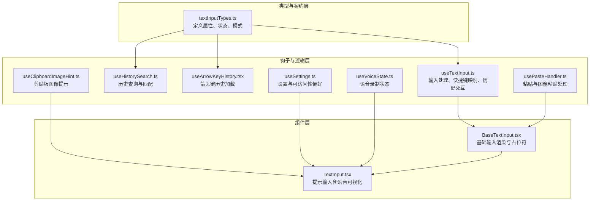
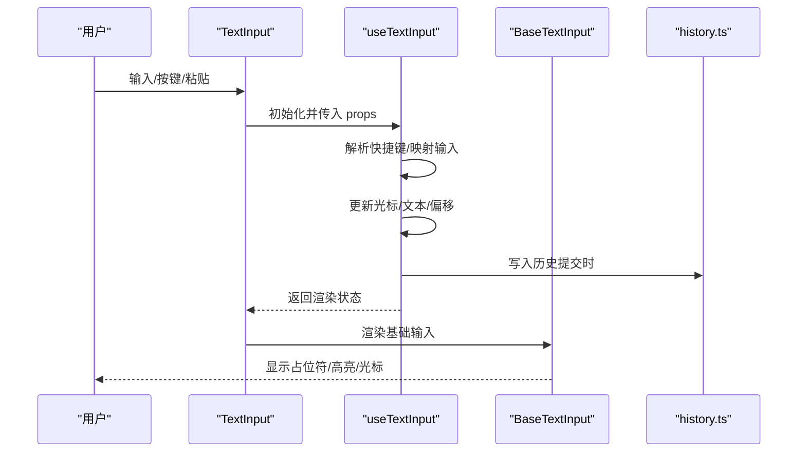
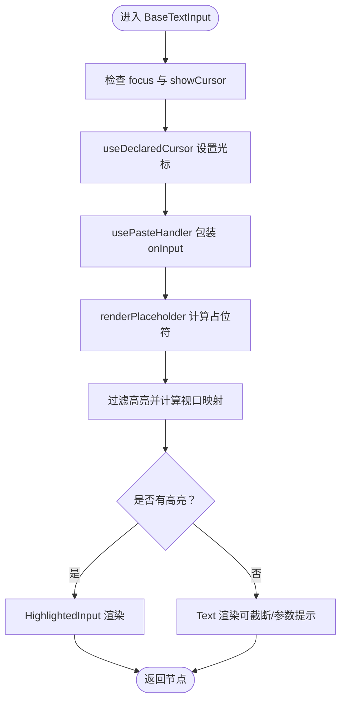
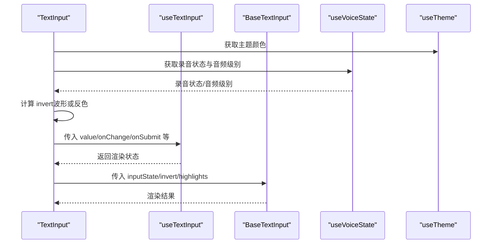
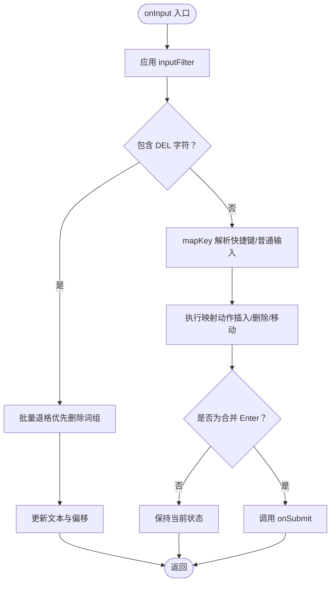
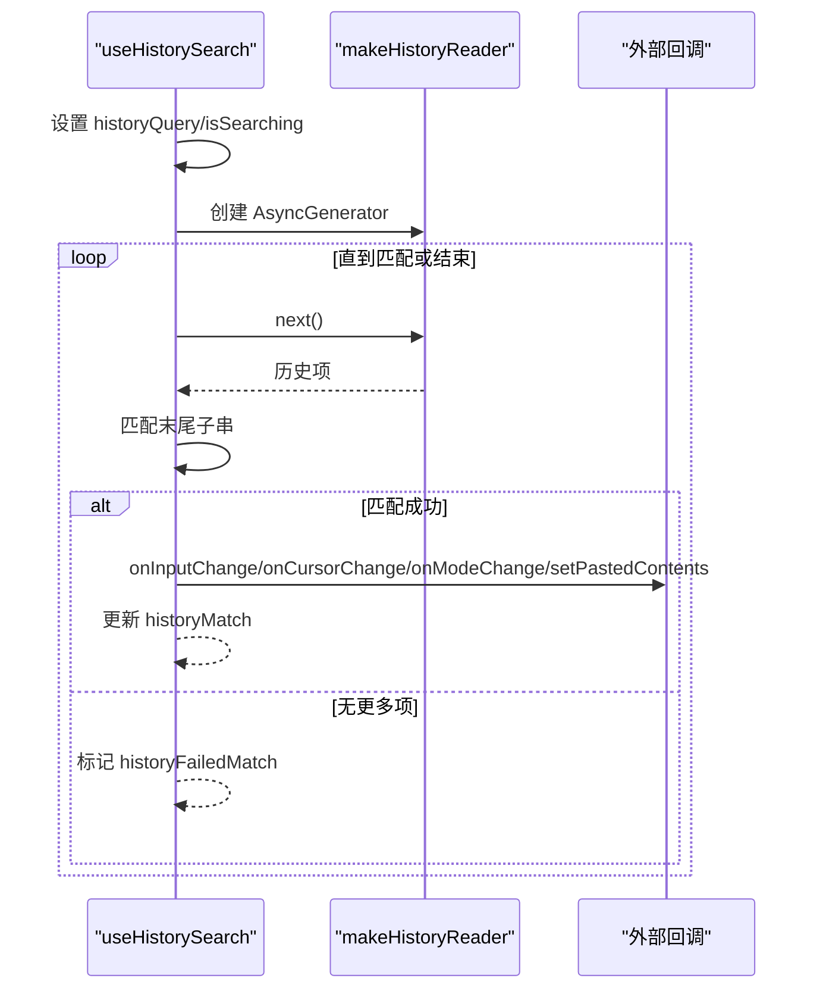
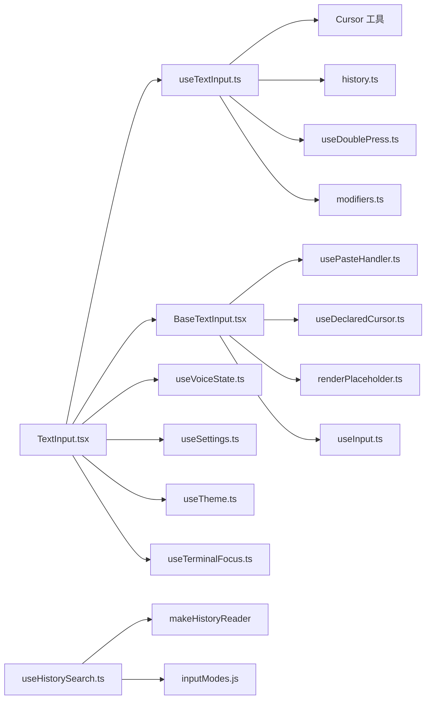

# 输入组件系统

<cite>
**本文档引用的文件**
- [BaseTextInput.tsx](file://src/components/BaseTextInput.tsx)
- [TextInput.tsx](file://src/components/TextInput.tsx)
- [textInputTypes.ts](file://src/types/textInputTypes.ts)
- [useTextInput.ts](file://src/hooks/useTextInput.ts)
- [useHistorySearch.ts](file://src/hooks/useHistorySearch.ts)
- [useArrowKeyHistory.tsx](file://src/hooks/useArrowKeyHistory.tsx)
- [history.ts](file://src/history.ts)
- [inputModes.js](file://src/components/PromptInput/inputModes.js)
- [PromptInput/Notifications.js](file://src/components/PromptInput/Notifications.js)
- [useCommandKeybindings.tsx](file://src/hooks/useCommandKeybindings.tsx)
- [useKeybinding.ts](file://src/hooks/useKeybinding.ts)
- [usePasteHandler.ts](file://src/hooks/usePasteHandler.ts)
- [useClipboardImageHint.ts](file://src/hooks/useClipboardImageHint.ts)
- [useSettings.ts](file://src/hooks/useSettings.ts)
- [useVoiceState.ts](file://src/context/voice.ts)
- [useTerminalFocus.ts](file://src/ink.js)
- [useTheme.ts](file://src/ink.js)
- [useAnimationFrame.ts](file://src/ink.js)
- [useTextInput.ts](file://src/hooks/useTextInput.ts)
</cite>

## 目录
1. [简介](#简介)
2. [项目结构](#项目结构)
3. [核心组件](#核心组件)
4. [架构总览](#架构总览)
5. [详细组件分析](#详细组件分析)
6. [依赖关系分析](#依赖关系分析)
7. [性能考虑](#性能考虑)
8. [故障排除指南](#故障排除指南)
9. [结论](#结论)

## 简介
本文件面向 Claude Code 的输入组件系统，系统性梳理了基础文本输入、提示输入与历史搜索输入的设计理念、功能特性与实现细节。重点覆盖以下方面：
- 自动完成与内联幽灵文本（Inline Ghost Text）
- 历史记录检索与上下文切换
- 快捷键与多模式编辑（含 Vim 模式扩展）
- 多行输入与换行处理
- 状态管理（输入值、光标位置、视口窗口化渲染）
- 事件回调与验证机制
- 可访问性（屏幕阅读器支持、键盘导航、语音录制可视化）
- 性能优化与用户体验改进策略

## 项目结构
输入组件体系由三层构成：
- 类型与契约层：定义输入组件的属性、状态与模式类型
- 钩子与逻辑层：封装输入处理、快捷键映射、历史交互、粘贴处理等核心逻辑
- 组件层：基础输入组件与具体输入组件（如提示输入），负责渲染与可访问性

**图表来源**
- [textInputTypes.ts:27-202](file://src/types/textInputTypes.ts#L27-L202)
- [useTextInput.ts:73-97](file://src/hooks/useTextInput.ts#L73-L97)
- [useHistorySearch.ts:15-33](file://src/hooks/useHistorySearch.ts#L15-L33)
- [useArrowKeyHistory.tsx:12-19](file://src/hooks/useArrowKeyHistory.tsx#L12-L19)
- [usePasteHandler.ts](file://src/hooks/usePasteHandler.ts)
- [useClipboardImageHint.ts](file://src/hooks/useClipboardImageHint.ts)
- [useSettings.ts](file://src/hooks/useSettings.ts)
- [useVoiceState.ts](file://src/context/voice.ts)
- [BaseTextInput.tsx:22-135](file://src/components/BaseTextInput.tsx#L22-L135)
- [TextInput.tsx:37-123](file://src/components/TextInput.tsx#L37-L123)

**章节来源**
- [BaseTextInput.tsx:19-135](file://src/components/BaseTextInput.tsx#L19-L135)
- [TextInput.tsx:34-123](file://src/components/TextInput.tsx#L34-L123)
- [textInputTypes.ts:27-202](file://src/types/textInputTypes.ts#L27-L202)

## 核心组件
- 基础文本输入组件（BaseTextInput）
  - 负责占位符渲染、光标声明、高亮显示、参数提示等通用能力
  - 支持可选的参数提示与文本高亮过滤
- 提示输入组件（TextInput）
  - 在基础输入之上集成语音录制可视化、剪贴板图像提示、主题与可访问性偏好
  - 将 useTextInput 返回的状态注入到基础输入组件进行渲染

**章节来源**
- [BaseTextInput.tsx:19-135](file://src/components/BaseTextInput.tsx#L19-L135)
- [TextInput.tsx:34-123](file://src/components/TextInput.tsx#L34-L123)

## 架构总览
输入组件系统采用“类型契约 + 钩子逻辑 + 组件渲染”的分层设计，通过 useTextInput 统一处理键盘事件、历史交互与状态更新，并将渲染职责下沉至 BaseTextInput，确保可复用与可测试。

**图表来源**
- [TextInput.tsx:92-119](file://src/components/TextInput.tsx#L92-L119)
- [useTextInput.ts:431-501](file://src/hooks/useTextInput.ts#L431-L501)
- [BaseTextInput.tsx:88-90](file://src/components/BaseTextInput.tsx#L88-L90)
- [history.ts](file://src/history.ts)

## 详细组件分析

### 基础文本输入组件（BaseTextInput）
- 设计要点
  - 使用 useDeclaredCursor 声明终端光标位置，确保可访问性工具正确跟踪
  - 通过 usePasteHandler 统一处理粘贴与图像粘贴，避免 Enter 触发提交
  - 占位符渲染与参数提示在聚焦且满足条件时显示
  - 文本高亮过滤与视口窗口化渲染，仅对可见范围内的高亮进行映射
- 关键行为
  - 当 showCursor 且存在高亮时，使用 HighlightedInput 渲染高亮文本
  - 否则使用 Text 渲染，支持截断与参数提示
  - 通过 useInput 注册输入监听，仅在 focus 为真时激活

**图表来源**
- [BaseTextInput.tsx:38-134](file://src/components/BaseTextInput.tsx#L38-L134)

**章节来源**
- [BaseTextInput.tsx:19-135](file://src/components/BaseTextInput.tsx#L19-L135)

### 提示输入组件（TextInput）
- 设计要点
  - 集成语音录制可视化：根据音频级别绘制波形条，支持降速动画与色彩变化
  - 剪贴板图像提示：当终端获得焦点且存在图像时显示提示
  - 可访问性：通过环境变量与设置控制是否禁用自定义光标反转
  - 将 useTextInput 返回的状态注入到基础输入组件
- 关键行为
  - 在语音录制时以波形光标替代标准反色光标
  - 通过 useTextInput 传递 mask、multiline、columns、maxVisibleLines 等渲染参数
  - 通过 invert 函数动态生成光标样式

**图表来源**
- [TextInput.tsx:37-123](file://src/components/TextInput.tsx#L37-L123)
- [useVoiceState.ts](file://src/context/voice.ts)
- [useTheme.ts](file://src/ink.js)

**章节来源**
- [TextInput.tsx:34-123](file://src/components/TextInput.tsx#L34-L123)

### 输入处理钩子（useTextInput）
- 功能概览
  - 键盘事件映射：支持 Ctrl、Meta、方向键、Home/End/PageUp/PageDown、滚轮等
  - 快捷键组合：如 Ctrl+A/E/F/B/W/Y/K/U/D 等
  - 历史交互：上/下箭头触发历史导航或光标移动；Esc 双击清空并保存历史
  - 多行输入：支持以反斜杠结尾的续行与 Shift/Meta+Enter 插入换行
  - 粘贴处理：统一处理大段文本与图像粘贴，避免 Enter 触发提交
  - 光标与视口：计算光标行列、视口字符偏移，支持窗口化渲染
- 关键流程
  - onInput 接收原始输入与键信息，先应用 inputFilter，再进行 DEL 字符修复与快捷键映射
  - 对于 SSH/tmux 环境下的 DEL 干扰，批量执行退格操作
  - 判断是否为“合并的 Enter”（单个尾随 \r），若是则触发提交
  - 将最终文本与偏移回传给父组件

**图表来源**
- [useTextInput.ts:431-501](file://src/hooks/useTextInput.ts#L431-L501)

**章节来源**
- [useTextInput.ts:73-530](file://src/hooks/useTextInput.ts#L73-L530)

### 历史搜索与箭头键历史（useHistorySearch、useArrowKeyHistory）
- 功能概览
  - useHistorySearch：在搜索模式下实时匹配历史记录，支持查询字符串增量匹配，自动调整光标与模式
  - useArrowKeyHistory：按需批量加载历史，避免频繁磁盘读取；支持模式过滤缓存
- 关键流程
  - 搜索开始时创建 AsyncGenerator 读取历史，逐条匹配末尾子串
  - 匹配成功时更新输入值、光标偏移、模式与粘贴内容，并标记失败状态用于 UI 反馈
  - 重置时恢复原始输入、光标与模式

**图表来源**
- [useHistorySearch.ts:73-148](file://src/hooks/useHistorySearch.ts#L73-L148)
- [history.ts](file://src/history.ts)

**章节来源**
- [useHistorySearch.ts:15-149](file://src/hooks/useHistorySearch.ts#L15-L149)
- [useArrowKeyHistory.tsx:12-24](file://src/hooks/useArrowKeyHistory.tsx#L12-L24)

### 类型与契约（textInputTypes）
- 关键类型
  - BaseTextInputProps：定义输入组件的属性集合，包括回调、光标、多行、遮罩、粘贴、过滤器等
  - BaseInputState：定义输入钩子返回的状态，包括渲染后的文本、光标行列、视口偏移等
  - PromptInputMode：输入模式（如 bash、prompt、权限通知等）
  - InlineGhostText：内联幽灵文本，用于命令补全提示
- 设计意义
  - 通过明确的类型约束保证组件间契约清晰
  - 为扩展（如 Vim 模式）提供良好接口

**章节来源**
- [textInputTypes.ts:27-202](file://src/types/textInputTypes.ts#L27-L202)
- [textInputTypes.ts:227-247](file://src/types/textInputTypes.ts#L227-L247)
- [textInputTypes.ts:265-274](file://src/types/textInputTypes.ts#L265-L274)
- [textInputTypes.ts:15-22](file://src/types/textInputTypes.ts#L15-L22)

## 依赖关系分析
- 组件依赖
  - TextInput 依赖 useTextInput、BaseTextInput、useVoiceState、useSettings、useTheme、useTerminalFocus
  - BaseTextInput 依赖 usePasteHandler、useDeclaredCursor、renderPlaceholder、useInput
- 钩子依赖
  - useTextInput 依赖 Cursor 工具、历史写入、双击检测、环境与修饰键处理
  - useHistorySearch 依赖 makeHistoryReader、inputModes.js、KeyboardEvent
- 可访问性与主题
  - 通过 useTheme/useTerminalFocus 控制光标可见性与样式
  - 通过 useSettings 控制降速动画与可访问性偏好

**图表来源**
- [TextInput.tsx:7-12](file://src/components/TextInput.tsx#L7-L12)
- [BaseTextInput.tsx:3-9](file://src/components/BaseTextInput.tsx#L3-L9)
- [useTextInput.ts:1-25](file://src/hooks/useTextInput.ts#L1-L25)
- [useHistorySearch.ts:3-12](file://src/hooks/useHistorySearch.ts#L3-L12)

**章节来源**
- [TextInput.tsx:7-12](file://src/components/TextInput.tsx#L7-L12)
- [BaseTextInput.tsx:3-9](file://src/components/BaseTextInput.tsx#L3-L9)
- [useTextInput.ts:1-25](file://src/hooks/useTextInput.ts#L1-L25)
- [useHistorySearch.ts:3-12](file://src/hooks/useHistorySearch.ts#L3-L12)

## 性能考虑
- 批量磁盘读取与缓存
  - 箭头键历史加载采用分块策略与共享待决加载，避免频繁小读取
- 视口窗口化渲染
  - 仅对可见范围内的高亮进行映射，减少渲染开销
- 动画与降速
  - 语音录制波形动画采用平滑因子与降速选项，避免不必要的重绘
- 输入过滤与 DEL 修复
  - 在一次事件中批量处理 DEL，减少多次状态更新带来的抖动

**章节来源**
- [useArrowKeyHistory.tsx:12-24](file://src/hooks/useArrowKeyHistory.tsx#L12-L24)
- [BaseTextInput.tsx:98-102](file://src/components/BaseTextInput.tsx#L98-L102)
- [TextInput.tsx:21-28](file://src/components/TextInput.tsx#L21-L28)
- [useTextInput.ts:444-465](file://src/hooks/useTextInput.ts#L444-L465)

## 故障排除指南
- 提交未触发
  - 检查是否为“合并的 Enter”（单个尾随 \r），该场景会自动触发提交
  - 确认 inputFilter 是否返回空字符串导致事件被丢弃
- 历史搜索无效
  - 确认 isSearching 与 historyQuery 是否正确设置
  - 检查历史读取器是否已创建且未被提前关闭
- 粘贴触发意外提交
  - 确保粘贴处理逻辑在 Enter 期间被阻止（pasteHandler 已内置保护）
- 光标不可见
  - 检查可访问性设置与终端焦点状态，确认 invert 函数是否被禁用
- 多行输入异常
  - 确认 multiline 开关与反斜杠续行规则，以及 Shift/Meta+Enter 的组合

**章节来源**
- [useTextInput.ts:490-499](file://src/hooks/useTextInput.ts#L490-L499)
- [useTextInput.ts:435-440](file://src/hooks/useTextInput.ts#L435-L440)
- [useHistorySearch.ts:51-58](file://src/hooks/useHistorySearch.ts#L51-L58)
- [usePasteHandler.ts](file://src/hooks/usePasteHandler.ts)
- [TextInput.tsx:65-91](file://src/components/TextInput.tsx#L65-L91)

## 结论
输入组件系统通过清晰的类型契约、强大的钩子逻辑与可复用的基础组件，实现了从基础文本输入到提示输入的完整能力闭环。其在历史交互、快捷键映射、多行输入、可访问性与性能优化等方面均提供了稳健的实现方案，适合在复杂终端环境中提供一致且高效的人机交互体验。