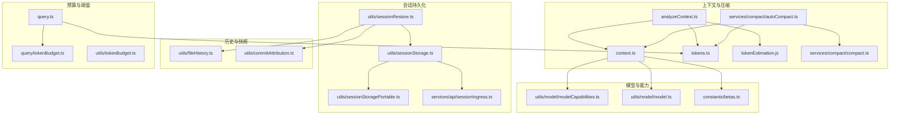
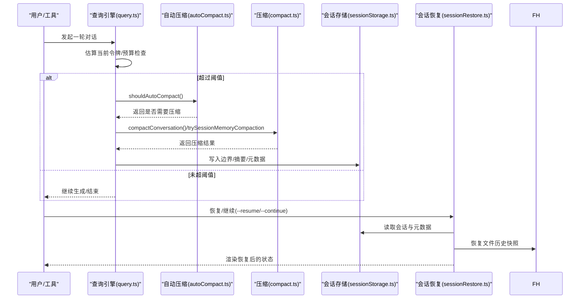
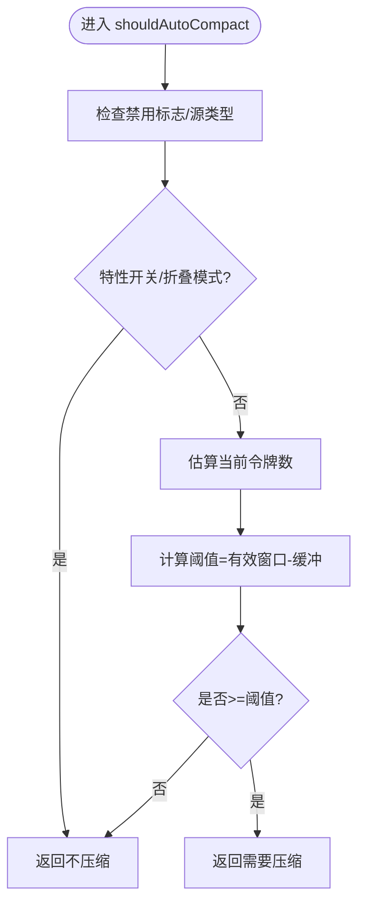
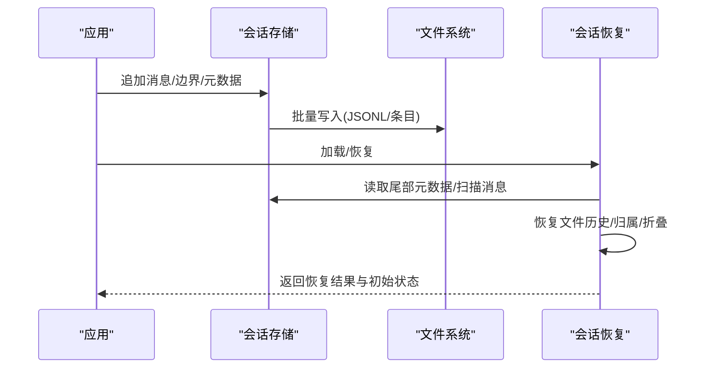
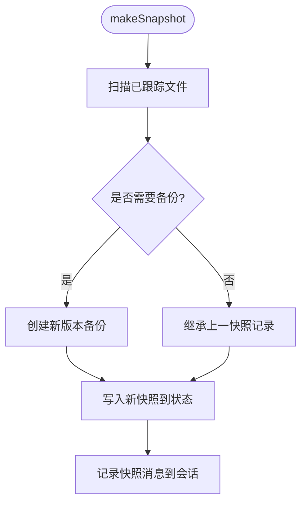
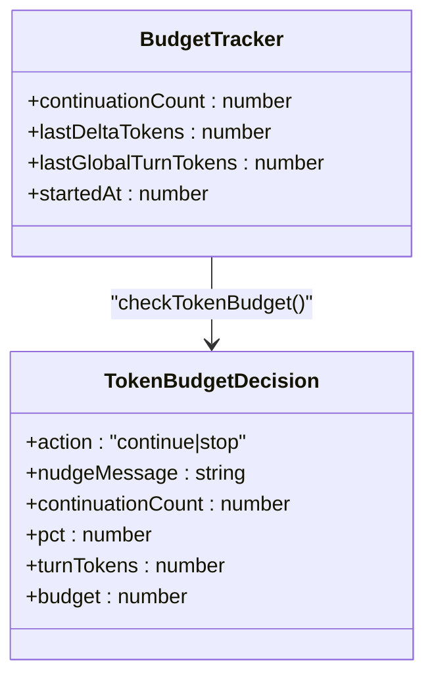
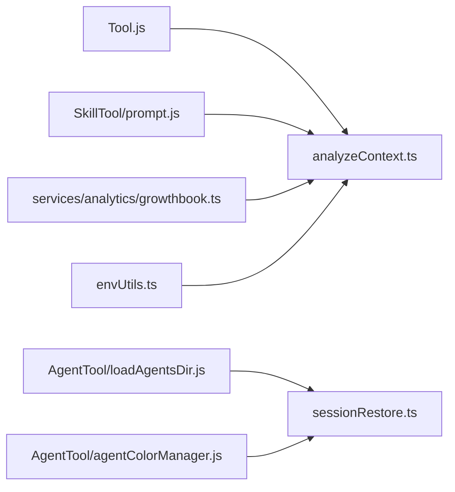
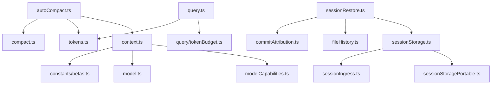

# 上下文管理

<cite>
**本文引用的文件**
- [analyzeContext.ts](file://src/utils/analyzeContext.ts)
- [autoCompact.ts](file://src/services/compact/autoCompact.ts)
- [sessionStorage.ts](file://src/utils/sessionStorage.ts)
- [fileHistory.ts](file://src/utils/fileHistory.ts)
- [sessionRestore.ts](file://src/utils/sessionRestore.ts)
- [tokenBudget.ts（查询层）](file://src/query/tokenBudget.ts)
- [tokenBudget.ts（解析工具）](file://src/utils/tokenBudget.ts)
- [tokens.ts](file://src/utils/tokens.ts)
- [context.ts](file://src/utils/context.ts)
- [query.ts](file://src/query.ts)
- [replBridge.ts](file://src/bridge/replBridge.ts)
- [context.ts（上下文常量）](file://src/context.ts)
- [sessionStoragePortable.ts](file://src/utils/sessionStoragePortable.ts)
- [sessionIngress.ts](file://src/services/api/sessionIngress.ts)
- [sessionMemory.ts](file://src/services/SessionMemory/sessionMemory.ts)
- [sessionMemoryUtils.ts](file://src/services/SessionMemory/sessionMemoryUtils.ts)
- [compact.ts](file://src/services/compact/compact.ts)
- [postCompactCleanup.ts](file://src/services/compact/postCompactCleanup.ts)
- [contextCollapse/index.js](file://src/services/contextCollapse/index.js)
- [contextCollapse/persist.js](file://src/services/contextCollapse/persist.js)
- [commitAttribution.ts](file://src/utils/commitAttribution.ts)
- [worktree.ts](file://src/utils/worktree.ts)
- [tasks.ts](file://src/utils/tasks.ts)
- [todo/types.ts](file://src/utils/todo/types.ts)
- [loadAgentsDir.js](file://src/tools/AgentTool/loadAgentsDir.js)
- [agentColorManager.js](file://src/tools/AgentTool/agentColorManager.js)
- [model/modelCapabilities.ts](file://src/utils/model/modelCapabilities.ts)
- [model/model.ts](file://src/utils/model/model.ts)
- [constants/betas.ts](file://src/constants/betas.ts)
- [constants/systemPromptSections.ts](file://src/constants/systemPromptSections.ts)
- [analytics/growthbook.ts](file://src/services/analytics/growthbook.ts)
- [analytics/index.ts](file://src/services/analytics/index.js)
- [prompts.ts](file://src/constants/prompts.ts)
- [messages.ts](file://src/utils/messages.ts)
- [tokenEstimation.ts](file://src/services/tokenEstimation.js)
- [SkillTool/prompt.js](file://src/tools/SkillTool/prompt.js)
- [Tool.js](file://src/Tool.js)
- [types/message.js](file://src/types/message.js)
- [types/logs.js](file://src/types/logs.js)
- [types/ids.js](file://src/types/ids.js)
- [constants/xml.js](file://src/constants/xml.js)
- [config.ts](file://src/utils/config.js)
- [envUtils.ts](file://src/utils/envUtils.ts)
- [log.ts](file://src/utils/log.js)
- [debug.ts](file://src/utils/debug.js)
- [json.ts](file://src/utils/json.js)
- [array.ts](file://src/utils/array.js)
- [uuid.ts](file://src/utils/uuid.js)
- [path.ts](file://src/utils/path.js)
- [format.ts](file://src/utils/format.js)
- [cleanupRegistry.ts](file://src/utils/cleanupRegistry.ts)
- [concurrentSessions.ts](file://src/utils/concurrentSessions.ts)
- [shell.ts](file://src/utils/Shell.js)
- [plans.ts](file://src/utils/plans.js)
- [toolResultStorage.ts](file://src/utils/toolResultStorage.js)
- [cost-tracker.ts](file://src/cost-tracker.js)
- [bootstrap/state.ts](file://src/bootstrap/state.js)
- [commands.ts](file://src/commands.ts)
- [assistant/sessionHistory.ts](file://src/assistant/sessionHistory.ts)
- [screens/REPL.tsx](file://src/screens/REPL.tsx)
- [coordinatorMode.ts](file://src/coordinator/coordinatorMode.ts)
- [contextWindowUpgradeCheck.ts](file://src/utils/model/contextWindowUpgradeCheck.ts)
</cite>

## 目录
1. [简介](#简介)
2. [项目结构](#项目结构)
3. [核心组件](#核心组件)
4. [架构总览](#架构总览)
5. [详细组件分析](#详细组件分析)
6. [依赖关系分析](#依赖关系分析)
7. [性能考量](#性能考量)
8. [故障排查指南](#故障排查指南)
9. [结论](#结论)
10. [附录：配置与调优](#附录配置与调优)

## 简介
本文件系统性梳理 Claude Code 的上下文管理系统，覆盖智能压缩算法、会话持久化与恢复、历史快照与增量更新、上下文窗口优化与预算控制、以及与工具系统、权限与模式切换等模块的集成关系。文档以代码为依据，通过多类可视化图表展示关键流程，并提供可操作的配置与调优建议。

## 项目结构
围绕“上下文管理”的关键目录与文件：
- 智能压缩与上下文估算：src/services/compact/*、src/utils/analyzeContext.ts、src/utils/context.ts、src/utils/tokens.ts、src/utils/tokenEstimation.js
- 会话持久化与恢复：src/utils/sessionStorage.ts、src/utils/sessionRestore.ts、src/utils/sessionStoragePortable.ts、src/services/api/sessionIngress.ts
- 历史快照与文件回溯：src/utils/fileHistory.ts、src/utils/commitAttribution.ts
- 预算与阈值控制：src/query/tokenBudget.ts、src/utils/tokenBudget.ts、src/query.ts
- 模型能力与窗口：src/utils/context.ts、src/utils/model/modelCapabilities.ts、src/utils/model/model.ts、src/constants/betas.ts
- 集成点：工具系统、代理定义、工作树、任务系统、权限与特性开关等

**图表来源**
- [analyzeContext.ts:1-200](file://src/utils/analyzeContext.ts#L1-L200)
- [autoCompact.ts:1-120](file://src/services/compact/autoCompact.ts#L1-L120)
- [sessionStorage.ts:1-120](file://src/utils/sessionStorage.ts#L1-L120)
- [fileHistory.ts:1-120](file://src/utils/fileHistory.ts#L1-L120)
- [tokenBudget.ts（查询层）:1-50](file://src/query/tokenBudget.ts#L1-L50)
- [tokenBudget.ts（解析工具）:1-40](file://src/utils/tokenBudget.ts#L1-L40)
- [context.ts:1-120](file://src/utils/context.ts#L1-L120)
- [query.ts:260-320](file://src/query.ts#L260-L320)

**章节来源**
- [analyzeContext.ts:1-200](file://src/utils/analyzeContext.ts#L1-L200)
- [autoCompact.ts:1-120](file://src/services/compact/autoCompact.ts#L1-L120)
- [sessionStorage.ts:1-120](file://src/utils/sessionStorage.ts#L1-L120)
- [fileHistory.ts:1-120](file://src/utils/fileHistory.ts#L1-L120)
- [tokenBudget.ts（查询层）:1-50](file://src/query/tokenBudget.ts#L1-L50)
- [tokenBudget.ts（解析工具）:1-40](file://src/utils/tokenBudget.ts#L1-L40)
- [context.ts:1-120](file://src/utils/context.ts#L1-L120)
- [query.ts:260-320](file://src/query.ts#L260-L320)

## 核心组件
- 智能压缩与阈值控制：基于有效上下文窗口与输出预留，动态触发自动压缩；支持会话内存压缩与传统摘要压缩两条路径。
- 会话持久化：统一的 JSONL 记录与元数据缓存，支持尾部轻量读取、批量写入与外部写入器桥接。
- 历史快照与文件回溯：按消息粒度记录文件备份，支持增量快照、差异统计与精确回滚。
- 预算与阈值：全局回合预算跟踪，结合“边际收益递减”启发式决定是否继续生成。
- 上下文窗口与模型能力：根据模型能力、特性开关与环境变量综合确定上下文窗口与最大输出。

**章节来源**
- [autoCompact.ts:60-160](file://src/services/compact/autoCompact.ts#L60-L160)
- [sessionStorage.ts:530-720](file://src/utils/sessionStorage.ts#L530-L720)
- [fileHistory.ts:195-342](file://src/utils/fileHistory.ts#L195-L342)
- [tokenBudget.ts（查询层）:45-94](file://src/query/tokenBudget.ts#L45-L94)
- [context.ts:50-98](file://src/utils/context.ts#L50-L98)

## 架构总览
上下文管理贯穿“估算—决策—压缩—持久化—恢复—渲染”的闭环。查询循环中持续评估令牌预算与上下文占用，必要时触发自动压缩；会话状态通过持久化模块落盘并支持后续恢复；文件历史与归属信息作为额外快照链参与恢复。

**图表来源**
- [query.ts:260-320](file://src/query.ts#L260-L320)
- [autoCompact.ts:160-240](file://src/services/compact/autoCompact.ts#L160-L240)
- [compact.ts:1-120](file://src/services/compact/compact.ts#L1-L120)
- [sessionStorage.ts:530-720](file://src/utils/sessionStorage.ts#L530-L720)
- [sessionRestore.ts:99-150](file://src/utils/sessionRestore.ts#L99-L150)
- [fileHistory.ts:195-342](file://src/utils/fileHistory.ts#L195-L342)

## 详细组件分析

### 智能压缩与阈值控制
- 有效上下文窗口：从模型能力与特性开关推导，再扣除最大输出预留，得到用于阈值计算的有效窗口。
- 自动压缩阈值：在有效窗口基础上保留缓冲区，超过阈值触发压缩；支持环境变量百分比覆盖与阻断阈值覆盖。
- 抑制条件：在“反应式仅模式”或“上下文折叠模式”下抑制主动压缩，避免与替代机制冲突。
- 失败熔断：连续失败达到上限后停止尝试，降低无效 API 调用。

**图表来源**
- [autoCompact.ts:160-240](file://src/services/compact/autoCompact.ts#L160-L240)

**章节来源**
- [autoCompact.ts:60-160](file://src/services/compact/autoCompact.ts#L60-L160)
- [autoCompact.ts:240-352](file://src/services/compact/autoCompact.ts#L240-L352)

### 会话持久化与恢复
- 存储格式：每个会话一个 JSONL 文件，行内为事件条目；元数据（标题、标签、代理名/色、模式、PR 信息等）以尾部条目形式重追加，确保快速读取。
- 写入队列：批量写入、分块与去重，支持内部事件写入器与子代理事件读取器，便于远端/内部桥接。
- 恢复流程：按消息链重建，恢复文件历史、归属、上下文折叠提交日志、代理设置、工作树状态、成本状态等；支持模式匹配与刷新代理定义。

**图表来源**
- [sessionStorage.ts:530-720](file://src/utils/sessionStorage.ts#L530-L720)
- [sessionRestore.ts:99-150](file://src/utils/sessionRestore.ts#L99-L150)
- [sessionStoragePortable.ts:256-283](file://src/utils/sessionStoragePortable.ts#L256-L283)

**章节来源**
- [sessionStorage.ts:530-720](file://src/utils/sessionStorage.ts#L530-L720)
- [sessionRestore.ts:99-150](file://src/utils/sessionRestore.ts#L99-L150)
- [sessionStoragePortable.ts:256-283](file://src/utils/sessionStoragePortable.ts#L256-L283)

### 历史快照与文件回溯
- 快照策略：按消息粒度记录已跟踪文件的备份版本，支持增量更新与最大快照数量限制。
- 回滚逻辑：比较原文件与目标备份的 stat 与内容，必要时执行删除/恢复；提供“变更检测”与“差异统计”两类接口。
- 与会话集成：快照消息写入会话日志，恢复时重建状态。

**图表来源**
- [fileHistory.ts:195-342](file://src/utils/fileHistory.ts#L195-L342)

**章节来源**
- [fileHistory.ts:195-342](file://src/utils/fileHistory.ts#L195-L342)
- [fileHistory.ts:344-591](file://src/utils/fileHistory.ts#L344-L591)

### 上下文窗口优化与预算控制
- 上下文窗口：综合模型能力、特性开关、环境变量与实验参数，确定窗口大小；同时提供默认与上限输出令牌配置。
- 预算跟踪：查询层维护回合预算跟踪器，结合“边际收益递减”启发式判断是否继续；支持“继续提示语”与事件上报。
- 令牌估算：提供多种估算路径（API 计数、回退计数、近似估算），并在分析视图中拆解各类内容的令牌构成。

**图表来源**
- [tokenBudget.ts（查询层）:6-44](file://src/query/tokenBudget.ts#L6-L44)

**章节来源**
- [context.ts:50-98](file://src/utils/context.ts#L50-L98)
- [tokenBudget.ts（查询层）:45-94](file://src/query/tokenBudget.ts#L45-L94)
- [tokenBudget.ts（解析工具）:21-74](file://src/utils/tokenBudget.ts#L21-L74)
- [tokens.ts:39-103](file://src/utils/tokens.ts#L39-L103)
- [analyzeContext.ts:77-109](file://src/utils/analyzeContext.ts#L77-L109)

### 与工具系统、权限与模式的集成
- 工具与技能：工具定义与技能前言的令牌估算纳入上下文分析；延迟加载工具在使用后才计入。
- 代理与颜色：恢复会话时根据代理设置与颜色进行上下文初始化；模式切换时刷新代理定义。
- 权限与特性：通过特性开关与环境变量控制自动压缩、上下文折叠、反应式压缩、文件快照等功能。

**图表来源**
- [Tool.js:1-120](file://src/Tool.js#L1-L120)
- [SkillTool/prompt.js:1-120](file://src/tools/SkillTool/prompt.js#L1-L120)
- [loadAgentsDir.js:1-120](file://src/tools/AgentTool/loadAgentsDir.js#L1-L120)
- [agentColorManager.js:1-120](file://src/tools/AgentTool/agentColorManager.js#L1-L120)
- [growthbook.ts:1-120](file://src/services/analytics/growthbook.ts#L1-L120)
- [envUtils.ts:1-120](file://src/utils/envUtils.ts#L1-L120)

**章节来源**
- [analyzeContext.ts:234-258](file://src/utils/analyzeContext.ts#L234-L258)
- [sessionRestore.ts:200-242](file://src/utils/sessionRestore.ts#L200-L242)
- [sessionRestore.ts:251-271](file://src/utils/sessionRestore.ts#L251-L271)

## 依赖关系分析
- 模块耦合：压缩模块依赖上下文窗口与模型能力；持久化模块依赖会话元数据与内部事件读写器；恢复模块依赖文件历史、归属与折叠状态。
- 外部依赖：文件系统、特性开关、环境变量、模型能力表、beta 标识等。

**图表来源**
- [autoCompact.ts:1-120](file://src/services/compact/autoCompact.ts#L1-L120)
- [sessionStorage.ts:1-120](file://src/utils/sessionStorage.ts#L1-L120)
- [sessionRestore.ts:1-120](file://src/utils/sessionRestore.ts#L1-L120)
- [query.ts:260-320](file://src/query.ts#L260-L320)
- [context.ts:1-120](file://src/utils/context.ts#L1-L120)

**章节来源**
- [autoCompact.ts:1-120](file://src/services/compact/autoCompact.ts#L1-L120)
- [sessionStorage.ts:1-120](file://src/utils/sessionStorage.ts#L1-L120)
- [sessionRestore.ts:1-120](file://src/utils/sessionRestore.ts#L1-L120)
- [query.ts:260-320](file://src/query.ts#L260-L320)
- [context.ts:1-120](file://src/utils/context.ts#L1-L120)

## 性能考量
- 估算与回退：优先使用 API 计数，失败时回退至哈希估算，减少重复计算开销。
- 写入批量化：批量写入与分块，避免频繁 IO；尾部元数据重追加确保快速读取。
- 快照上限：文件历史快照采用固定上限，避免无限增长导致 IO 放大。
- 预算短路：在边际收益递减时提前停止，降低无效生成与 API 调用次数。
- 熔断保护：自动压缩连续失败达到上限后熔断，防止雪崩。

[本节为通用指导，无需特定文件引用]

## 故障排查指南
- 自动压缩失败：检查禁用标志、特性开关、折叠模式与连续失败计数；查看日志与事件上报。
- 会话恢复异常：确认会话文件存在、元数据完整、工作树目录状态；检查内部事件读取器与子代理事件读取器。
- 文件历史回滚失败：检查备份文件是否存在、权限与时间戳；确认变更检测与差异统计结果。
- 预算提前终止：检查回合预算配置、边际收益阈值与持续次数；查看预算事件上报。

**章节来源**
- [autoCompact.ts:250-352](file://src/services/compact/autoCompact.ts#L250-L352)
- [sessionRestore.ts:409-552](file://src/utils/sessionRestore.ts#L409-L552)
- [fileHistory.ts:344-591](file://src/utils/fileHistory.ts#L344-L591)
- [tokenBudget.ts（查询层）:45-94](file://src/query/tokenBudget.ts#L45-L94)

## 结论
该上下文管理系统通过“估算—阈值—压缩—持久化—恢复—渲染”的闭环，实现了对大规模对话历史的高效管理。其关键在于：
- 动态阈值与熔断机制，避免上下文溢出；
- 会话持久化与元数据重追加，兼顾性能与可恢复性；
- 文件历史与归属快照，提供细粒度的回溯能力；
- 预算与边际收益启发式，平衡生成质量与成本；
- 与工具系统、代理与模式的深度集成，满足复杂使用场景。

[本节为总结，无需特定文件引用]

## 附录：配置与调优
- 上下文窗口与输出
  - 窗口来源：模型能力、特性开关、环境变量、实验参数；可通过环境变量覆盖。
  - 输出上限：模型默认与上限输出令牌配置，部分模型存在严格上限。
  - 参考路径：[context.ts:50-222](file://src/utils/context.ts#L50-L222)

- 自动压缩
  - 启用/禁用：用户配置、禁用标志；支持仅禁用自动压缩。
  - 阈值与缓冲：有效窗口-缓冲；支持环境变量百分比覆盖与阻断阈值覆盖。
  - 抑制条件：反应式仅模式、上下文折叠模式。
  - 参考路径：[autoCompact.ts:60-160](file://src/services/compact/autoCompact.ts#L60-L160)

- 会话持久化
  - 写入策略：批量写入、分块、内部事件写入器；尾部元数据重追加。
  - 恢复策略：按消息链重建、恢复文件历史/归属/折叠、代理设置、工作树状态。
  - 参考路径：[sessionStorage.ts:530-720](file://src/utils/sessionStorage.ts#L530-L720)，[sessionRestore.ts:99-150](file://src/utils/sessionRestore.ts#L99-L150)

- 文件历史快照
  - 快照上限：固定数量；增量更新；变更检测与差异统计。
  - 参考路径：[fileHistory.ts:54-71](file://src/utils/fileHistory.ts#L54-L71)，[fileHistory.ts:195-342](file://src/utils/fileHistory.ts#L195-L342)

- 预算与阈值
  - 全局预算：回合预算跟踪器；边际收益递减阈值；继续提示语。
  - 参考路径：[tokenBudget.ts（查询层）:45-94](file://src/query/tokenBudget.ts#L45-L94)，[tokenBudget.ts（解析工具）:21-74](file://src/utils/tokenBudget.ts#L21-L74)

- 与工具系统、权限与模式
  - 工具与技能：延迟加载工具在使用后计入；技能前言估算。
  - 代理与颜色：恢复时应用代理设置与颜色；模式切换刷新代理定义。
  - 特性开关：通过特性开关与环境变量控制功能启用。
  - 参考路径：[analyzeContext.ts:363-515](file://src/utils/analyzeContext.ts#L363-L515)，[sessionRestore.ts:200-271](file://src/utils/sessionRestore.ts#L200-L271)