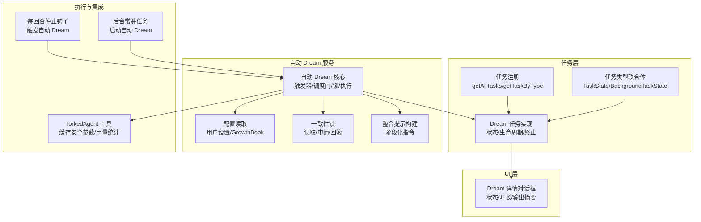
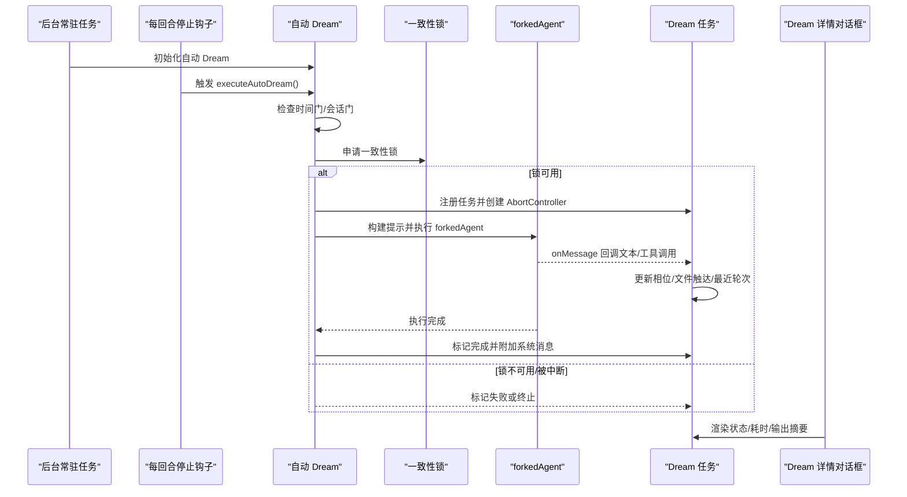
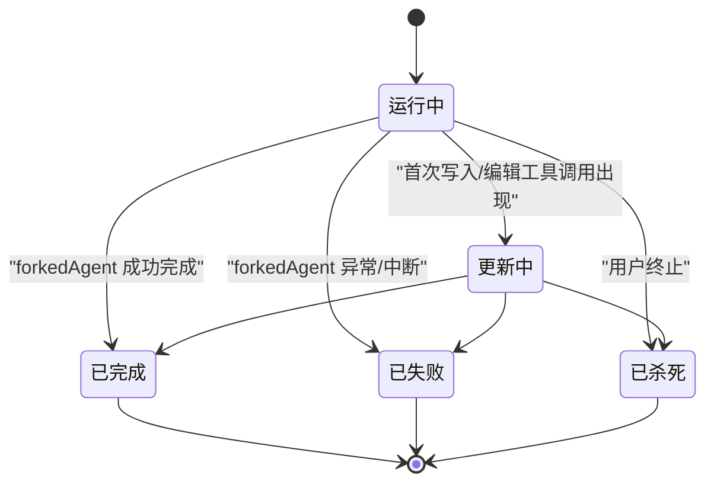
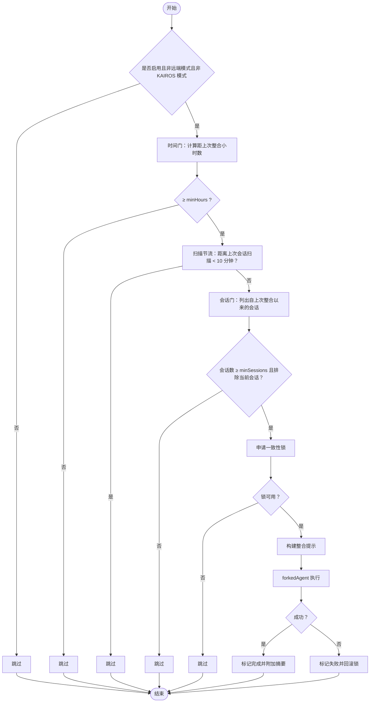
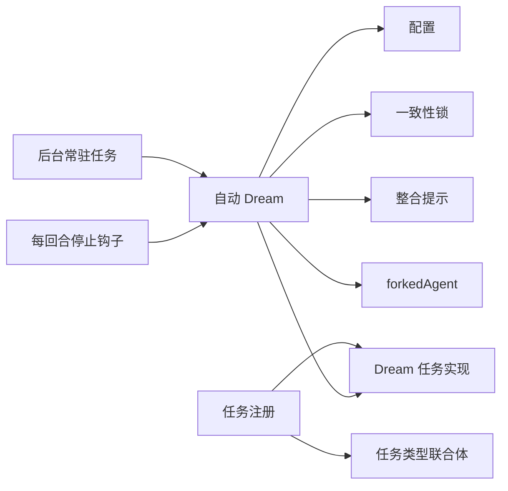

# Dream 任务系统

<cite>
**本文引用的文件**
- [src\tasks.ts](file://src\tasks.ts)
- [src\tasks\types.ts](file://src\tasks\types.ts)
- [src\tasks\DreamTask\DreamTask.ts](file://src\tasks\DreamTask\DreamTask.ts)
- [src\services\autoDream\autoDream.ts](file://src\services\autoDream\autoDream.ts)
- [src\services\autoDream\config.ts](file://src\services\autoDream\config.ts)
- [src\services\autoDream\consolidationLock.ts](file://src\services\autoDream\consolidationLock.ts)
- [src\services\autoDream\consolidationPrompt.ts](file://src\services\autoDream\consolidationPrompt.ts)
- [src\components\tasks\DreamDetailDialog.tsx](file://src\components\tasks\DreamDetailDialog.tsx)
- [src\utils\backgroundHousekeeping.ts](file://src\utils\backgroundHousekeeping.ts)
- [src\query\stopHooks.ts](file://src\query\stopHooks.ts)
- [src\utils\forkedAgent.ts](file://src\utils\forkedAgent.ts)
- [src\tools\FileEditTool\constants.ts](file://src\tools\FileEditTool\constants.ts)
</cite>

## 目录
1. [简介](#简介)
2. [项目结构](#项目结构)
3. [核心组件](#核心组件)
4. [架构总览](#架构总览)
5. [详细组件分析](#详细组件分析)
6. [依赖关系分析](#依赖关系分析)
7. [性能考量](#性能考量)
8. [故障排查指南](#故障排查指南)
9. [结论](#结论)
10. [附录](#附录)

## 简介
本技术文档聚焦 Claude Code 的 Dream 任务系统，系统性阐述其设计理念、自动化触发与执行机制、智能调度算法（时间门、会话门、一致性锁）、与自动 Dream 服务的集成方式、状态转换与生命周期管理、异常处理策略，以及配置选项、使用场景、最佳实践与监控调试方法。Dream 任务以“后台记忆整合”为核心目标，在空闲时段自动聚合近期会话与记忆，生成更有序、可检索的记忆索引，并在必要时对代码进行小范围优化更新。

## 项目结构
Dream 任务系统由以下关键模块构成：
- 任务注册与类型：任务注册入口、任务类型联合体、Dream 任务状态定义与 UI 表面
- 自动 Dream 服务：触发器、调度门、锁机制、提示构建、forked agent 执行
- UI 交互：Dream 详情对话框，展示运行状态、会话回顾数量、触达文件数与最近若干轮输出
- 集成点：后台常驻任务初始化、每回合停止钩子触发

图表来源
- [src\tasks.ts:22-39](file://src\tasks.ts#L22-L39)
- [src\tasks\types.ts:12-29](file://src\tasks\types.ts#L12-L29)
- [src\tasks\DreamTask\DreamTask.ts:132-158](file://src\tasks\DreamTask\DreamTask.ts#L132-L158)
- [src\services\autoDream\autoDream.ts:122-273](file://src\services\autoDream\autoDream.ts#L122-L273)
- [src\services\autoDream\config.ts:13-21](file://src\services\autoDream\config.ts#L13-L21)
- [src\services\autoDream\consolidationLock.ts:29-108](file://src\services\autoDream\consolidationLock.ts#L29-L108)
- [src\services\autoDream\consolidationPrompt.ts:10-65](file://src\services\autoDream\consolidationPrompt.ts#L10-L65)
- [src\utils\forkedAgent.ts:131-141](file://src\utils\forkedAgent.ts#L131-L141)
- [src\query\stopHooks.ts:154-156](file://src\query\stopHooks.ts#L154-L156)
- [src\utils\backgroundHousekeeping.ts:37-37](file://src\utils\backgroundHousekeeping.ts#L37-L37)
- [src\components\tasks\DreamDetailDialog.tsx:104-142](file://src\components\tasks\DreamDetailDialog.tsx#L104-L142)

章节来源
- [src\tasks.ts:22-39](file://src\tasks.ts#L22-L39)
- [src\tasks\types.ts:12-29](file://src\tasks\types.ts#L12-L29)

## 核心组件
- 任务注册与发现：通过统一入口导出所有任务，Dream 任务被纳入任务集合并可按类型检索
- 任务类型系统：定义 TaskState 联合体，包含 DreamTaskState，确保 UI 与框架层对 Dream 任务的统一处理
- Dream 任务状态与生命周期：定义状态字段、相位切换、文件触达集合、最近轮次输出等；提供创建、追加轮次、完成、失败、终止等操作
- 自动 Dream 服务：负责在满足时间门、会话门与一致性锁后，构建整合提示并通过 forked agent 执行，期间收集进度并更新任务状态
- 配置与特性开关：结合用户设置与 GrowthBook 特性标志，决定是否启用自动 Dream 及其调度阈值
- 一致性锁：基于内存目录下的锁文件，记录最后整合时间戳与持有者 PID，避免并发冲突
- 提示构建：面向“记忆整合”的四阶段提示，指导 agent 在记忆目录与会话转录中进行定向检索与整理
- UI 对话框：展示 Dream 任务状态、耗时、回顾会话数、触达文件数与最近若干轮输出摘要

章节来源
- [src\tasks.ts:22-39](file://src\tasks.ts#L22-L39)
- [src\tasks\types.ts:12-29](file://src\tasks\types.ts#L12-L29)
- [src\tasks\DreamTask\DreamTask.ts:25-158](file://src\tasks\DreamTask\DreamTask.ts#L25-L158)
- [src\services\autoDream\autoDream.ts:58-324](file://src\services\autoDream\autoDream.ts#L58-L324)
- [src\services\autoDream\config.ts:13-21](file://src\services\autoDream\config.ts#L13-L21)
- [src\services\autoDream\consolidationLock.ts:29-141](file://src\services\autoDream\consolidationLock.ts#L29-L141)
- [src\services\autoDream\consolidationPrompt.ts:10-65](file://src\services\autoDream\consolidationPrompt.ts#L10-L65)
- [src\components\tasks\DreamDetailDialog.tsx:104-244](file://src\components\tasks\DreamDetailDialog.tsx#L104-L244)

## 架构总览
Dream 任务系统采用“后台触发 + forked agent 执行 + 任务状态驱动 UI”的分层架构。核心流程如下：
- 后台常驻任务初始化自动 Dream
- 每回合停止钩子触发自动 Dream 执行
- 自动 Dream 依次检查时间门、会话门与一致性锁
- 成功则注册 Dream 任务、构建整合提示、通过 forked agent 执行
- 执行过程中持续监听消息，提取文本与工具调用，更新任务状态
- 完成或失败后记录事件并更新 UI

图表来源
- [src\utils\backgroundHousekeeping.ts:37-37](file://src\utils\backgroundHousekeeping.ts#L37-L37)
- [src\query\stopHooks.ts:154-156](file://src\query\stopHooks.ts#L154-L156)
- [src\services\autoDream\autoDream.ts:122-273](file://src\services\autoDream\autoDream.ts#L122-L273)
- [src\services\autoDream\consolidationLock.ts:46-84](file://src\services\autoDream\consolidationLock.ts#L46-L84)
- [src\utils\forkedAgent.ts:131-141](file://src\utils\forkedAgent.ts#L131-L141)
- [src\tasks\DreamTask\DreamTask.ts:132-158](file://src\tasks\DreamTask\DreamTask.ts#L132-L158)
- [src\components\tasks\DreamDetailDialog.tsx:104-142](file://src\components\tasks\DreamDetailDialog.tsx#L104-L142)

## 详细组件分析

### Dream 任务状态与生命周期
- 状态字段：包含类型标识、运行状态、相位、回顾会话数、文件触达集合、最近轮次输出、中止控制器、前置锁时间戳等
- 生命周期操作：
  - 创建：生成任务 ID，填充基础状态，注册到任务框架
  - 追加轮次：折叠工具调用计数，合并新触达文件路径，限制最近轮次数量
  - 完成/失败：设置结束时间、通知标记、清理中止控制器
  - 终止：支持用户主动终止，回滚一致性锁时间戳，保证下次会话重试

图表来源
- [src\tasks\DreamTask\DreamTask.ts:25-158](file://src\tasks\DreamTask\DreamTask.ts#L25-L158)

章节来源
- [src\tasks\DreamTask\DreamTask.ts:25-158](file://src\tasks\DreamTask\DreamTask.ts#L25-L158)

### 自动 Dream 调度算法与执行
- 调度门（顺序检查，代价从低到高）：
  - 时间门：距离上次整合的时间间隔需达到最小阈值
  - 会话门：自上次整合以来的会话数量需达到最小阈值（排除当前会话）
  - 一致性锁：无其他进程正在整合（含死进程回收）
- 扫描节流：时间门通过但会话扫描间隔过短时跳过，避免频繁扫描
- 执行流程：
  - 构建整合提示（包含记忆目录、会话目录与额外上下文）
  - 通过 forked agent 执行，传递缓存安全参数、工具权限、中止信号与进度回调
  - 完成后根据触达文件生成“已改进 N 个文件”的系统消息摘要

图表来源
- [src\services\autoDream\autoDream.ts:95-190](file://src\services\autoDream\autoDream.ts#L95-L190)
- [src\services\autoDream\autoDream.ts:224-272](file://src\services\autoDream\autoDream.ts#L224-L272)
- [src\services\autoDream\consolidationLock.ts:46-84](file://src\services\autoDream\consolidationLock.ts#L46-L84)

章节来源
- [src\services\autoDream\autoDream.ts:58-324](file://src\services\autoDream\autoDream.ts#L58-L324)
- [src\services\autoDream\consolidationLock.ts:29-141](file://src\services\autoDream\consolidationLock.ts#L29-L141)

### 一致性锁与合并提示处理
- 一致性锁：
  - 锁文件位于记忆目录，文件内容为持有者 PID，mtime 代表上次整合时间
  - 支持活 PID 检测与死 PID 回收，超过一定时间视为过期
  - 申请成功返回前置 mtime，失败或回滚时可将 mtime 回退到前置值
- 合并提示：
  - 四阶段结构：定位/收集/整合/修剪与索引
  - 指令明确要求仅窄范围检索会话转录，避免全量读取
  - 强调删除矛盾事实、转换相对日期为绝对日期、维护索引简洁性

章节来源
- [src\services\autoDream\consolidationLock.ts:29-141](file://src\services\autoDream\consolidationLock.ts#L29-L141)
- [src\services\autoDream\consolidationPrompt.ts:10-65](file://src\services\autoDream\consolidationPrompt.ts#L10-L65)

### 与自动 Dream 服务的集成关系
- 后台常驻任务：启动时初始化自动 Dream，确保每回合钩子可触发
- 每回合停止钩子：在非裸模式下，每回合结束时触发自动 Dream 执行
- forked agent 集成：共享父查询的缓存安全参数，确保提示缓存命中；记录完整用量指标并上报事件
- 任务框架集成：通过任务注册与状态更新接口，将 Dream 任务纳入统一的任务管理与 UI 呈现

章节来源
- [src\utils\backgroundHousekeeping.ts:37-37](file://src\utils\backgroundHousekeeping.ts#L37-L37)
- [src\query\stopHooks.ts:154-156](file://src\query\stopHooks.ts#L154-L156)
- [src\utils\forkedAgent.ts:131-141](file://src\utils\forkedAgent.ts#L131-L141)
- [src\tasks.ts:22-39](file://src\tasks.ts#L22-L39)

### UI 与交互
- Dream 详情对话框展示：
  - 标题与副标题：显示“记忆整合”与运行时长、回顾会话数、触达文件数
  - 状态颜色：运行中/已完成/已失败
  - 输出摘要：最近若干轮文本与工具调用计数，早期轮次折叠为计数
  - 快捷键：空格/回车/ESC 关闭；左方向键返回；运行中可按 X 停止

章节来源
- [src\components\tasks\DreamDetailDialog.tsx:104-244](file://src\components\tasks\DreamDetailDialog.tsx#L104-L244)

## 依赖关系分析
- 任务层依赖：
  - 任务注册依赖任务类型联合体，Dream 任务状态纳入 TaskState
  - Dream 任务实现依赖任务框架的注册与状态更新函数
- 自动 Dream 服务依赖：
  - 配置模块：读取用户设置与 GrowthBook 特性标志
  - 一致性锁模块：读取/申请/回滚锁
  - 提示构建模块：生成整合提示
  - forked agent 工具：执行 forked 查询循环并共享缓存安全参数
- 集成点：
  - 后台常驻任务初始化自动 Dream
  - 每回合停止钩子触发自动 Dream

图表来源
- [src\tasks.ts:22-39](file://src\tasks.ts#L22-L39)
- [src\tasks\types.ts:12-29](file://src\tasks\types.ts#L12-L29)
- [src\tasks\DreamTask\DreamTask.ts:132-158](file://src\tasks\DreamTask\DreamTask.ts#L132-L158)
- [src\services\autoDream\autoDream.ts:122-273](file://src\services\autoDream\autoDream.ts#L122-L273)
- [src\services\autoDream\config.ts:13-21](file://src\services\autoDream\config.ts#L13-L21)
- [src\services\autoDream\consolidationLock.ts:29-108](file://src\services\autoDream\consolidationLock.ts#L29-L108)
- [src\services\autoDream\consolidationPrompt.ts:10-65](file://src\services\autoDream\consolidationPrompt.ts#L10-L65)
- [src\utils\backgroundHousekeeping.ts:37-37](file://src\utils\backgroundHousekeeping.ts#L37-L37)
- [src\query\stopHooks.ts:154-156](file://src\query\stopHooks.ts#L154-L156)
- [src\utils\forkedAgent.ts:131-141](file://src\utils\forkedAgent.ts#L131-L141)

章节来源
- [src\tasks.ts:22-39](file://src\tasks.ts#L22-L39)
- [src\tasks\types.ts:12-29](file://src\tasks\types.ts#L12-L29)
- [src\services\autoDream\autoDream.ts:122-273](file://src\services\autoDream\autoDream.ts#L122-L273)

## 性能考量
- 缓存安全参数：forked agent 共享父查询的缓存安全参数，最大化提示缓存命中率，降低重复计算与 API 调用成本
- 扫描节流：时间门通过但会话扫描间隔过短时跳过，避免频繁 IO 与 stat 开销
- 用量追踪：forked agent 记录完整用量指标并在完成后上报事件，便于成本分析
- 会话检索优化：提示明确建议窄范围检索会话转录，避免全量读取大文件
- 并发控制：一致性锁避免多进程同时整合，减少冲突与无效工作

章节来源
- [src\utils\forkedAgent.ts:131-141](file://src\utils\forkedAgent.ts#L131-L141)
- [src\services\autoDream\autoDream.ts:56-56](file://src\services\autoDream\autoDream.ts#L56-L56)
- [src\services\autoDream\autoDream.ts:258-271](file://src\services\autoDream\autoDream.ts#L258-L271)
- [src\services\autoDream\consolidationPrompt.ts:39-42](file://src\services\autoDream\consolidationPrompt.ts#L39-L42)

## 故障排查指南
- 用户终止：
  - 现象：任务状态变为“已杀死”，锁时间戳回滚，下次会话可重试
  - 处理：通过任务终止接口触发，内部回滚一致性锁
- fork 失败：
  - 现象：任务状态变为“已失败”，记录失败事件，回滚一致性锁
  - 处理：检查日志中的错误信息，确认是否为权限、工具限制或外部环境问题
- 锁冲突：
  - 现象：锁被其他进程持有或死进程残留
  - 处理：等待锁释放或确认进程状态；若为死进程，系统会自动回收
- 会话扫描异常：
  - 现象：列出自上次整合以来的会话失败
  - 处理：检查会话存储目录可访问性与权限，确认会话文件存在且可读

章节来源
- [src\tasks\DreamTask\DreamTask.ts:136-156](file://src\tasks\DreamTask\DreamTask.ts#L136-L156)
- [src\services\autoDream\autoDream.ts:258-271](file://src\services\autoDream\autoDream.ts#L258-L271)
- [src\services\autoDream\consolidationLock.ts:60-68](file://src\services\autoDream\consolidationLock.ts#L60-L68)

## 结论
Dream 任务系统通过“后台触发 + forked agent 执行 + 任务状态驱动 UI”的设计，实现了在空闲时段对近期记忆与会话的自动化整合。其调度算法以时间门、会话门与一致性锁为核心，兼顾性能与正确性；通过缓存安全参数与用量追踪，进一步提升效率与可观测性。该系统为 Claude Code 的长期记忆管理提供了稳定、可扩展的基础设施。

## 附录

### 配置选项与使用场景
- 启用开关：
  - 用户设置：settings.json 中的 autoDreamEnabled
  - GrowthBook 特性标志：tengu_onyx_plover.enabled
- 调度阈值（来自特性标志）：
  - minHours：最小小时数
  - minSessions：最小会话数
- 使用场景：
  - 空闲时段自动整合近期学习与工作记忆
  - 在不打断用户当前任务的前提下进行后台处理
  - 与 KAIROS 模式互补：KAIROS 使用磁盘技能，Dream 使用 forked agent

章节来源
- [src\services\autoDream\config.ts:13-21](file://src\services\autoDream\config.ts#L13-L21)
- [src\services\autoDream\autoDream.ts:73-93](file://src\services\autoDream\autoDream.ts#L73-L93)

### 最佳实践
- 合理设置 minHours 与 minSessions，平衡整合频率与成本
- 在需要时手动触发 /dream 以记录一次整合时间戳
- 关注 UI 中的“已改进文件数”摘要，评估整合效果
- 如遇锁冲突，等待一段时间或检查进程状态后再试

章节来源
- [src\services\autoDream\autoDream.ts:173-190](file://src\services\autoDream\autoDream.ts#L173-L190)
- [src\services\autoDream\consolidationPrompt.ts:53-61](file://src\services\autoDream\consolidationPrompt.ts#L53-L61)

### 监控与调试
- 日志与事件：
  - 自动 Dream 触发、完成、失败均记录调试日志与事件
  - forked agent 完成后记录缓存读取与创建用量
- UI 调试：
  - 使用 Dream 详情对话框查看任务状态、耗时、回顾会话数与输出摘要
- 关键路径定位：
  - 后台常驻任务初始化：[src\utils\backgroundHousekeeping.ts:37-37](file://src\utils\backgroundHousekeeping.ts#L37-L37)
  - 每回合触发：[src\query\stopHooks.ts:154-156](file://src\query\stopHooks.ts#L154-L156)
  - forked agent 参数共享：[src\utils\forkedAgent.ts:131-141](file://src\utils\forkedAgent.ts#L131-L141)

章节来源
- [src\services\autoDream\autoDream.ts:192-257](file://src\services\autoDream\autoDream.ts#L192-L257)
- [src\utils\forkedAgent.ts:131-141](file://src\utils\forkedAgent.ts#L131-L141)
- [src\components\tasks\DreamDetailDialog.tsx:104-142](file://src\components\tasks\DreamDetailDialog.tsx#L104-L142)