# 任务生命周期管理

<cite>
**本文档引用的文件**
- [Task.ts](file://src/Task.ts)
- [tasks.ts](file://src/tasks.ts)
- [types.ts](file://src/tasks/types.ts)
- [LocalShellTask.tsx](file://src/tasks/LocalShellTask/LocalShellTask.tsx)
- [LocalAgentTask.tsx](file://src/tasks/LocalAgentTask/LocalAgentTask.tsx)
- [LocalMainSessionTask.ts](file://src/tasks/LocalMainSessionTask.ts)
- [stopTask.ts](file://src/tasks/stopTask.ts)
- [tasks.ts](file://src/utils/tasks.ts)
- [hooks.ts](file://src/utils/hooks.ts)
- [teammate.ts](file://src/utils/teammate.ts)
- [commandLifecycle.ts](file://src/utils/commandLifecycle.ts)
- [workloadContext.ts](file://src/utils/workloadContext.ts)
- [ShellCommand.ts](file://src/utils/ShellCommand.ts)
- [TaskListV2.tsx](file://src/components/TaskListV2.tsx)
</cite>

## 目录
1. [简介](#简介)
2. [项目结构](#项目结构)
3. [核心组件](#核心组件)
4. [架构概览](#架构概览)
5. [详细组件分析](#详细组件分析)
6. [依赖关系分析](#依赖关系分析)
7. [性能考虑](#性能考虑)
8. [故障排除指南](#故障排除指南)
9. [结论](#结论)

## 简介

Claude Code 的任务生命周期管理系统是一个复杂而精密的异步任务管理框架，负责协调各种类型的后台任务执行。该系统支持多种任务类型，包括本地 Shell 命令、本地代理、远程代理、进程内队友、工作流脚本、MCP 监控器和梦境任务。

系统采用统一的任务接口设计，通过状态机模式管理任务的完整生命周期，从创建、初始化、执行到最终的销毁和清理。每个任务都具有明确的状态转换规则和事件触发机制，确保系统的稳定性和可预测性。

## 项目结构

系统采用模块化的架构设计，主要分为以下几个核心层次：

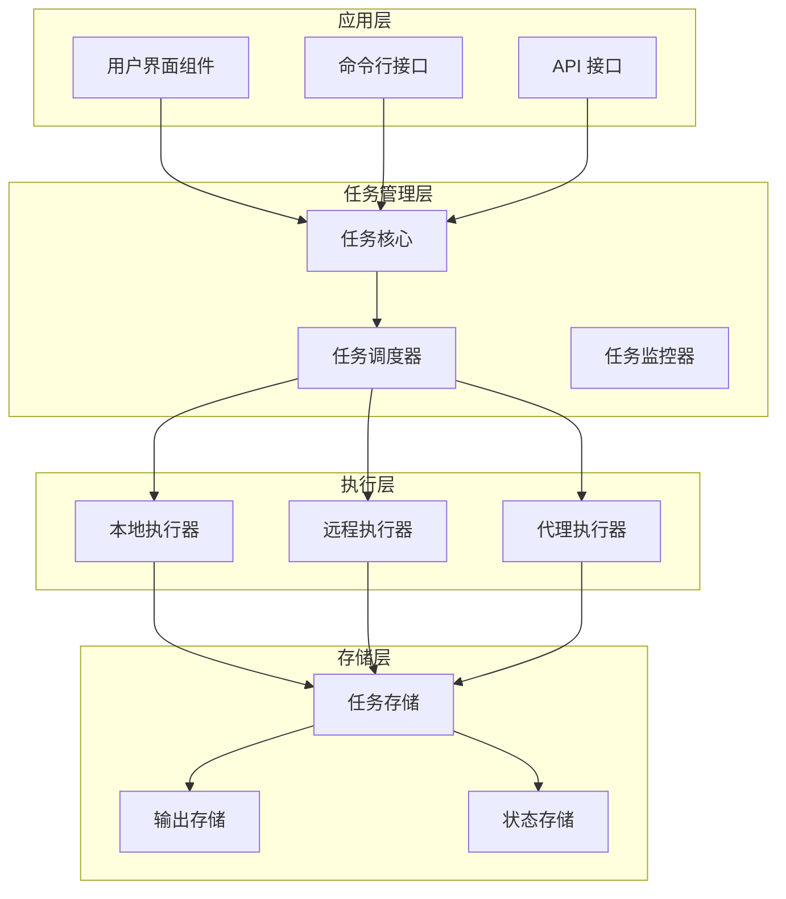

**图表来源**
- [Task.ts:1-126](file://src/Task.ts#L1-L126)
- [tasks.ts:1-40](file://src/tasks.ts#L1-L40)

**章节来源**
- [Task.ts:1-126](file://src/Task.ts#L1-L126)
- [tasks.ts:1-40](file://src/tasks.ts#L1-L40)

## 核心组件

### 任务类型系统

系统定义了七种不同的任务类型，每种类型都有其特定的功能和使用场景：

| 任务类型 | 描述 | 主要用途 |
|---------|------|----------|
| `local_bash` | 本地 Shell 命令执行 | 文件操作、系统命令、构建脚本 |
| `local_agent` | 本地智能代理 | 复杂推理、代码生成、问题解决 |
| `remote_agent` | 远程智能代理 | 分布式计算、跨节点协作 |
| `in_process_teammate` | 进程内队友 | 协作开发、实时代码审查 |
| `local_workflow` | 本地工作流脚本 | 自动化流程、批处理任务 |
| `monitor_mcp` | MCP 监控器 | 系统监控、状态检测 |
| `dream` | 梦境任务 | 创意生成、灵感探索 |

### 任务状态管理

任务状态采用有限状态机设计，支持以下状态转换：

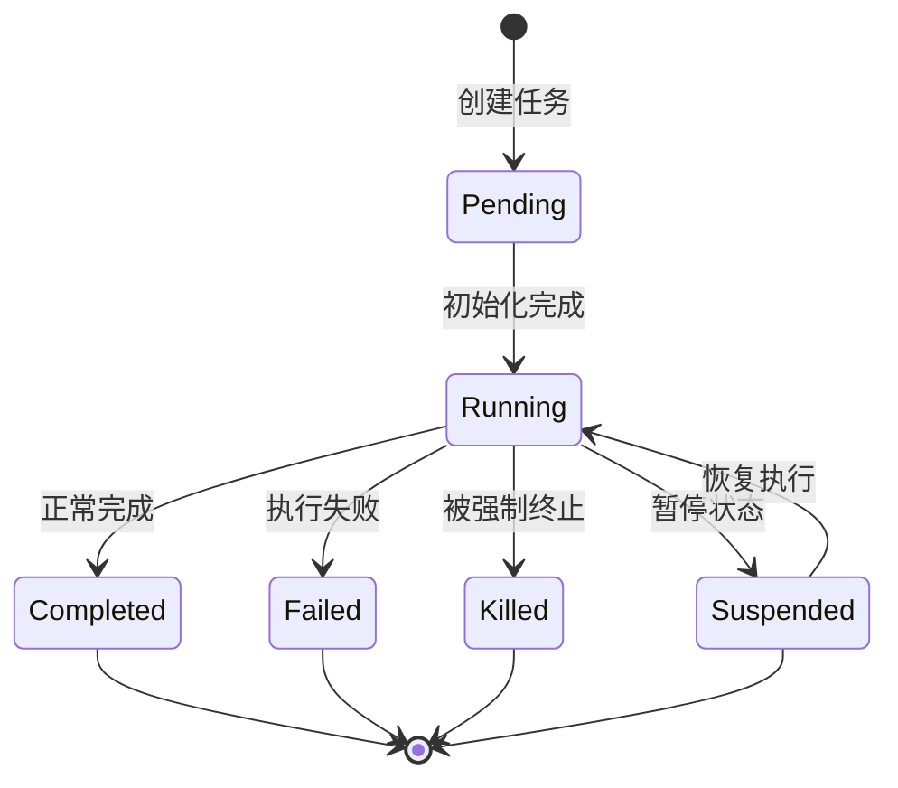

**图表来源**
- [Task.ts:15-29](file://src/Task.ts#L15-L29)

### 统一任务接口

所有任务都实现相同的接口，确保一致的行为和状态管理：

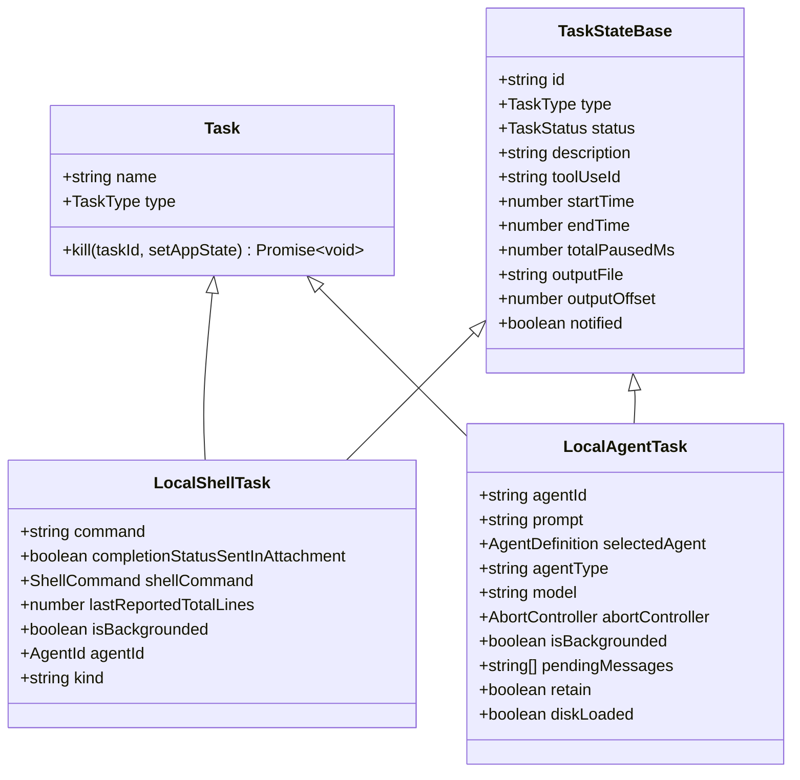

**图表来源**
- [Task.ts:72-76](file://src/Task.ts#L72-L76)
- [Task.ts:44-57](file://src/Task.ts#L44-L57)
- [LocalShellTask.tsx:116-148](file://src/tasks/LocalShellTask/LocalShellTask.tsx#L116-L148)
- [LocalAgentTask.tsx:116-148](file://src/tasks/LocalAgentTask/LocalAgentTask.tsx#L116-L148)

**章节来源**
- [Task.ts:6-126](file://src/Task.ts#L6-L126)
- [LocalShellTask.tsx:116-148](file://src/tasks/LocalShellTask/LocalShellTask.tsx#L116-L148)
- [LocalAgentTask.tsx:116-148](file://src/tasks/LocalAgentTask/LocalAgentTask.tsx#L116-L148)

## 架构概览

系统采用分层架构设计，确保各组件之间的松耦合和高内聚：

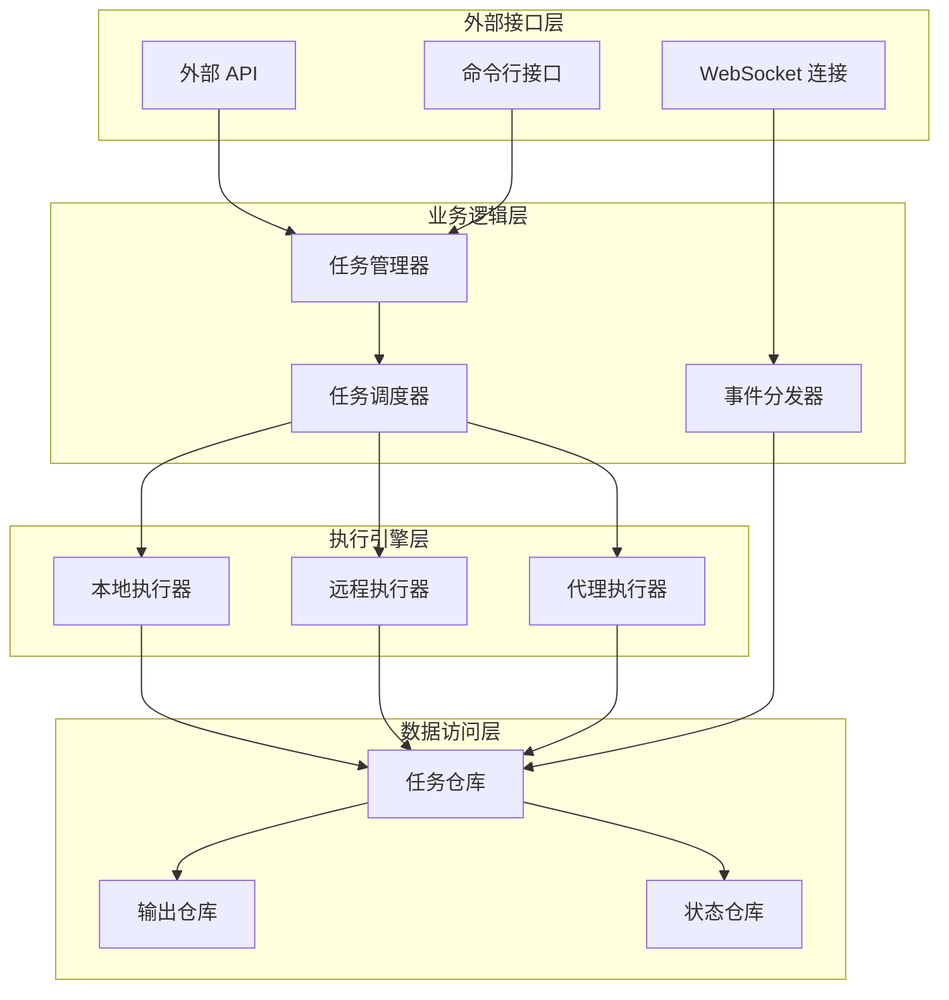

**图表来源**
- [tasks.ts:17-40](file://src/tasks.ts#L17-L40)
- [Task.ts:72-76](file://src/Task.ts#L72-L76)

系统的核心优势在于其统一的任务抽象和灵活的执行模型。每个任务类型都实现了相同的接口，但可以根据需要选择不同的执行策略。

## 详细组件分析

### 本地 Shell 任务管理

本地 Shell 任务是系统中最复杂的任务类型之一，负责处理各种类型的命令执行和输出管理。

#### 任务生命周期流程

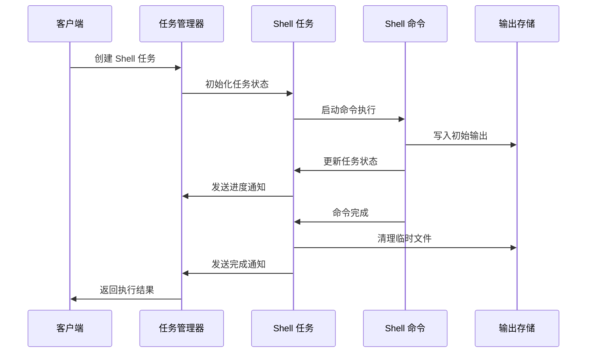

**图表来源**
- [LocalShellTask.tsx:180-252](file://src/tasks/LocalShellTask/LocalShellTask.tsx#L180-L252)
- [LocalShellTask.tsx:222-245](file://src/tasks/LocalShellTask/LocalShellTask.tsx#L222-L245)

#### 背景执行机制

系统支持将前台任务自动背景化，以提高用户体验：

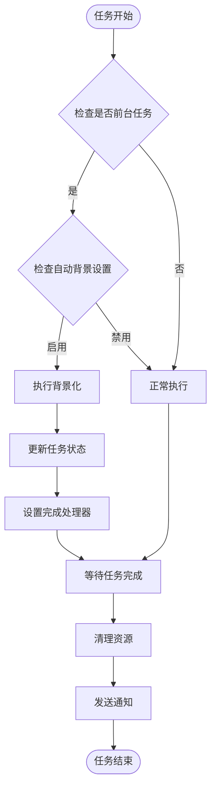

**图表来源**
- [LocalShellTask.tsx:526-614](file://src/tasks/LocalShellTask/LocalShellTask.tsx#L526-L614)
- [LocalShellTask.tsx:620-652](file://src/tasks/LocalShellTask/LocalShellTask.tsx#L620-L652)

**章节来源**
- [LocalShellTask.tsx:180-252](file://src/tasks/LocalShellTask/LocalShellTask.tsx#L180-L252)
- [LocalShellTask.tsx:526-652](file://src/tasks/LocalShellTask/LocalShellTask.tsx#L526-L652)

### 本地代理任务管理

本地代理任务负责处理复杂的智能代理交互，支持多种代理类型和配置选项。

#### 代理任务状态管理

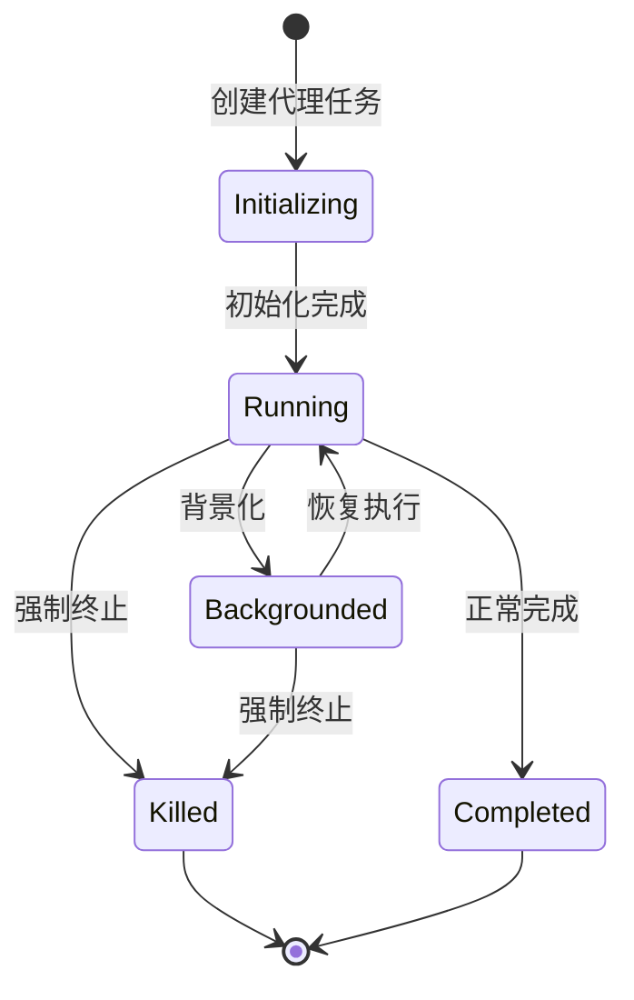

**图表来源**
- [LocalAgentTask.tsx:281-303](file://src/tasks/LocalAgentTask/LocalAgentTask.tsx#L281-L303)

#### 进度跟踪和摘要

系统提供了详细的进度跟踪机制，包括工具使用计数、令牌消耗统计和最近活动记录：

| 进度指标 | 描述 | 更新频率 |
|---------|------|----------|
| 工具使用计数 | 记录代理调用工具的次数 | 实时更新 |
| 令牌消耗 | 统计输入和输出令牌数量 | 实时更新 |
| 最近活动 | 保存最近的工具使用活动 | 实时更新 |
| 进度摘要 | 自动生成的执行摘要 | 定期生成 |

**章节来源**
- [LocalAgentTask.tsx:339-407](file://src/tasks/LocalAgentTask/LocalAgentTask.tsx#L339-L407)

### 主会话任务管理

主会话任务专门处理用户的主要交互会话，支持在后台继续执行的同时保持用户界面的响应性。

#### 会话状态同步

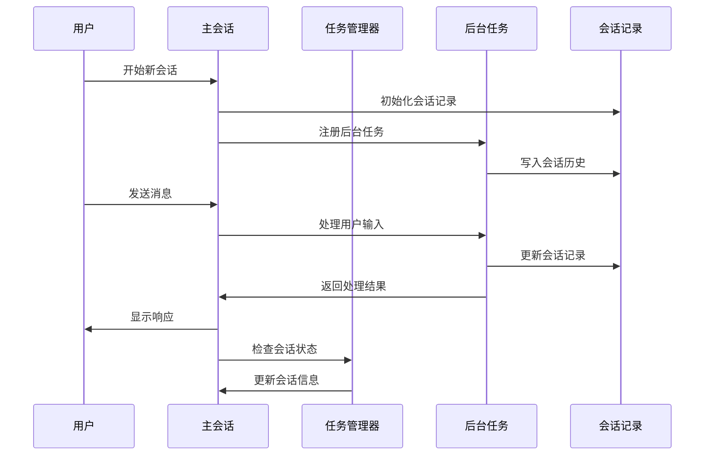

**图表来源**
- [LocalMainSessionTask.ts:94-162](file://src/tasks/LocalMainSessionTask.ts#L94-L162)
- [LocalMainSessionTask.ts:338-479](file://src/tasks/LocalMainSessionTask.ts#L338-L479)

**章节来源**
- [LocalMainSessionTask.ts:94-162](file://src/tasks/LocalMainSessionTask.ts#L94-L162)
- [LocalMainSessionTask.ts:338-479](file://src/tasks/LocalMainSessionTask.ts#L338-L479)

### 任务停止和取消机制

系统提供了多种停止和取消任务的方法，确保用户可以灵活地控制任务执行。

#### 停止任务流程

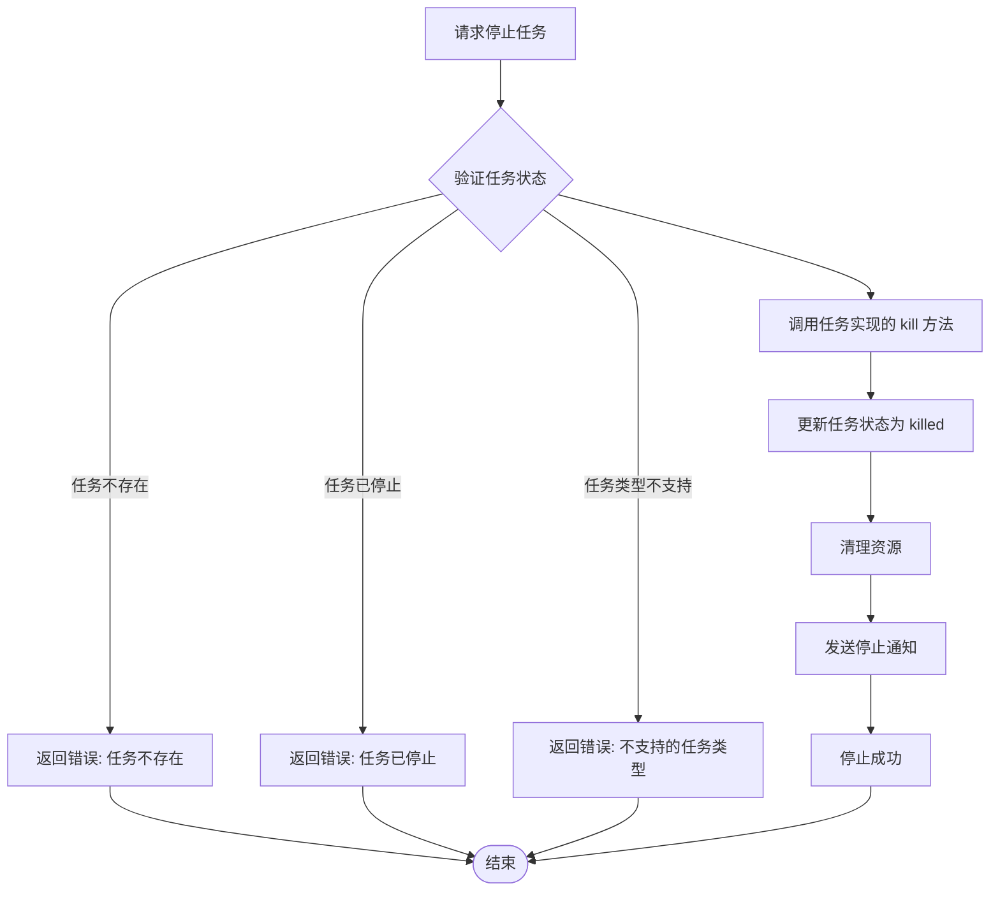

**图表来源**
- [stopTask.ts:38-100](file://src/tasks/stopTask.ts#L38-L100)

**章节来源**
- [stopTask.ts:38-100](file://src/tasks/stopTask.ts#L38-L100)

### 任务监控和通知系统

系统实现了全面的任务监控和通知机制，确保用户能够及时了解任务状态变化。

#### 通知系统架构

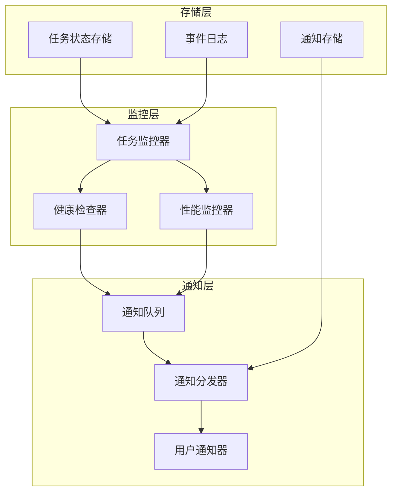

**图表来源**
- [LocalShellTask.tsx:105-172](file://src/tasks/LocalShellTask/LocalShellTask.tsx#L105-L172)
- [LocalAgentTask.tsx:197-262](file://src/tasks/LocalAgentTask/LocalAgentTask.tsx#L197-L262)

**章节来源**
- [LocalShellTask.tsx:105-172](file://src/tasks/LocalShellTask/LocalShellTask.tsx#L105-L172)
- [LocalAgentTask.tsx:197-262](file://src/tasks/LocalAgentTask/LocalAgentTask.tsx#L197-L262)

## 依赖关系分析

系统采用模块化设计，各组件之间通过清晰的接口进行通信：

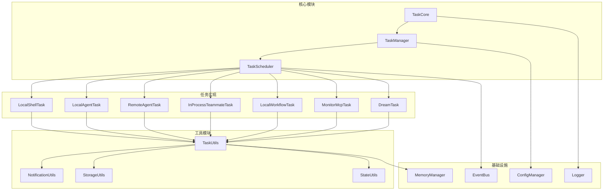

**图表来源**
- [tasks.ts:17-40](file://src/tasks.ts#L17-L40)
- [Task.ts:72-76](file://src/Task.ts#L72-L76)

**章节来源**
- [tasks.ts:17-40](file://src/tasks.ts#L17-L40)
- [Task.ts:72-76](file://src/Task.ts#L72-L76)

## 性能考虑

系统在设计时充分考虑了性能优化，采用了多种策略来确保高效的任务执行：

### 内存管理优化

- **任务状态压缩**: 使用最小化的状态对象，避免不必要的内存占用
- **渐进式输出**: 采用流式输出方式，减少内存峰值
- **资源池管理**: 对常用资源进行池化管理，减少频繁分配

### 并发执行优化

- **任务调度器**: 采用优先级调度算法，确保高优先级任务及时执行
- **异步处理**: 所有 I/O 操作都采用异步方式，避免阻塞主线程
- **背压控制**: 实现背压机制，防止系统过载

### 存储优化

- **增量写入**: 输出数据采用增量写入方式，减少磁盘 I/O
- **缓存策略**: 实现多级缓存，提高数据访问速度
- **垃圾回收**: 定期清理无用数据，释放存储空间

## 故障排除指南

### 常见问题诊断

#### 任务无法启动

**症状**: 任务创建后立即进入失败状态

**可能原因**:
1. 任务类型不支持
2. 缺少必要的权限
3. 配置参数错误

**解决方案**:
1. 检查任务类型是否在支持列表中
2. 验证用户权限设置
3. 校验配置参数格式

#### 任务卡死

**症状**: 任务长时间处于运行状态但无进展

**可能原因**:
1. 死锁或竞态条件
2. 外部依赖不可用
3. 内存泄漏

**解决方案**:
1. 检查任务实现中的并发控制
2. 验证外部服务连接
3. 使用内存分析工具检测泄漏

#### 资源耗尽

**症状**: 系统性能下降或任务失败

**可能原因**:
1. 内存不足
2. 文件描述符耗尽
3. 线程池饱和

**解决方案**:
1. 增加内存限制
2. 优化资源管理
3. 调整线程池大小

### 调试工具和方法

系统提供了多种调试工具来帮助诊断问题：

1. **任务状态监控**: 实时查看所有任务的状态和统计数据
2. **日志分析**: 详细的日志记录和分析工具
3. **性能分析**: CPU 和内存使用情况的可视化分析
4. **事件追踪**: 任务生命周期事件的完整追踪

**章节来源**
- [tasks.ts:818-860](file://src/utils/tasks.ts#L818-L860)
- [teammate.ts:272-292](file://src/utils/teammate.ts#L272-L292)

## 结论

Claude Code 的任务生命周期管理系统是一个设计精良、功能完备的任务管理框架。系统通过统一的接口抽象、灵活的状态管理和完善的监控机制，为各种类型的异步任务提供了可靠的支持。

系统的主要优势包括：

1. **统一抽象**: 所有任务类型共享相同的接口和状态管理机制
2. **灵活执行**: 支持本地、远程和混合执行模式
3. **完善监控**: 提供全面的任务状态监控和通知机制
4. **优雅处理**: 支持任务的优雅关闭、强制终止和资源清理
5. **扩展性强**: 模块化设计便于添加新的任务类型和功能

通过合理的设计和实现，该系统能够有效处理复杂的异步任务场景，为用户提供稳定可靠的任务管理体验。随着功能的不断完善和优化，该系统将继续为 Claude Code 平台提供强大的任务管理能力。