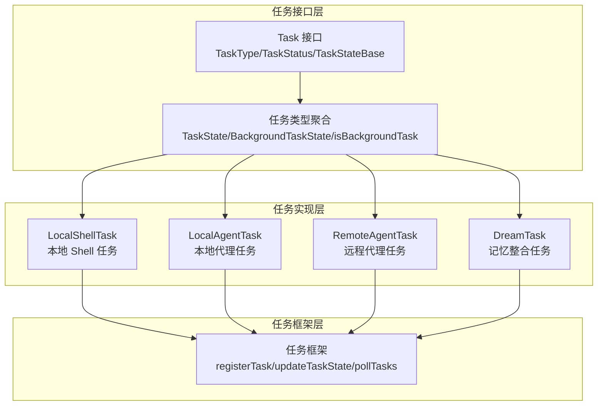
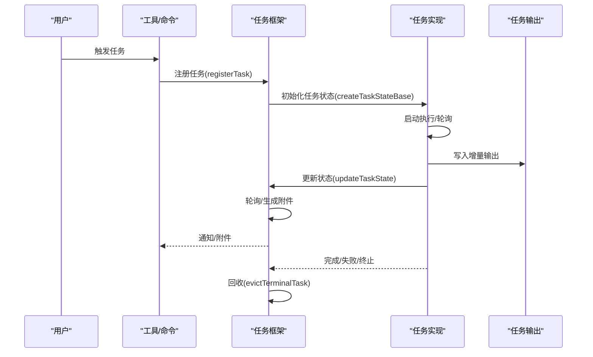
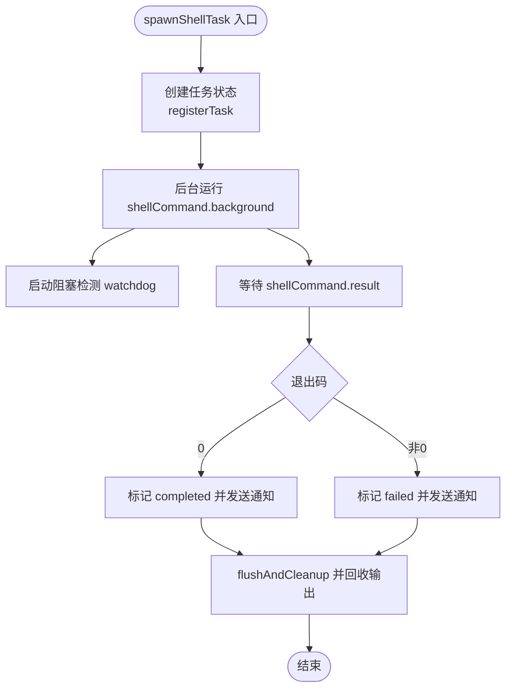
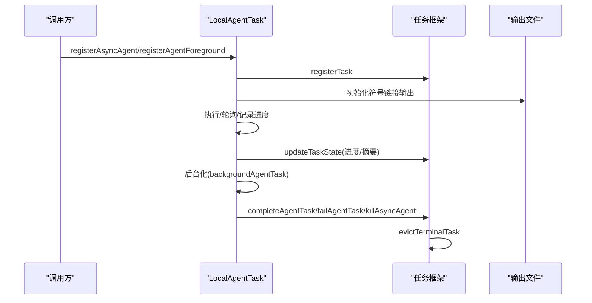
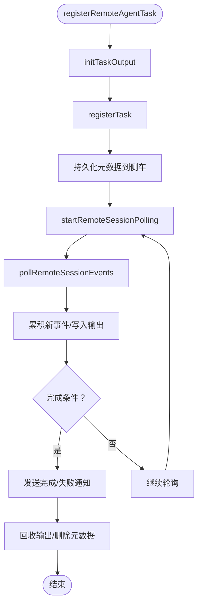
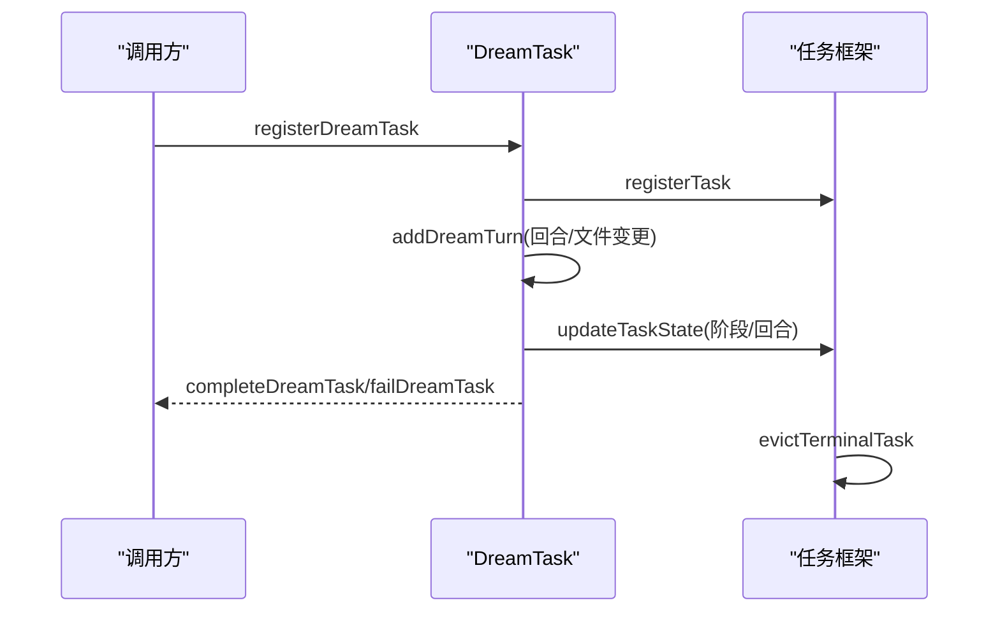
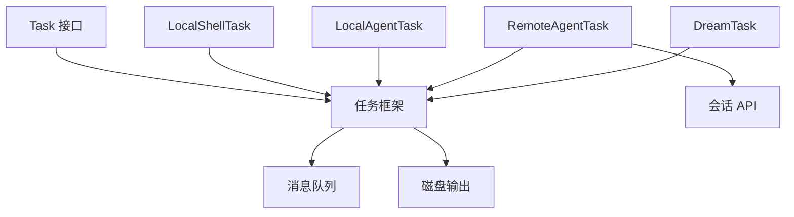

# 任务系统

<cite>
**本文档引用的文件**
- [src/Task.ts](file://src/Task.ts)
- [src/tasks.ts](file://src/tasks.ts)
- [src/tasks/types.ts](file://src/tasks/types.ts)
- [src/tasks/DreamTask/DreamTask.ts](file://src/tasks/DreamTask/DreamTask.ts)
- [src/tasks/LocalShellTask/LocalShellTask.tsx](file://src/tasks/LocalShellTask/LocalShellTask.tsx)
- [src/tasks/LocalAgentTask/LocalAgentTask.tsx](file://src/tasks/LocalAgentTask/LocalAgentTask.tsx)
- [src/tasks/RemoteAgentTask/RemoteAgentTask.tsx](file://src/tasks/RemoteAgentTask/RemoteAgentTask.tsx)
- [src/utils/task/framework.ts](file://src/utils/task/framework.ts)
</cite>

## 目录
1. [引言](#引言)
2. [项目结构](#项目结构)
3. [核心组件](#核心组件)
4. [架构总览](#架构总览)
5. [详细组件分析](#详细组件分析)
6. [依赖分析](#依赖分析)
7. [性能考虑](#性能考虑)
8. [故障排查指南](#故障排查指南)
9. [结论](#结论)
10. [附录](#附录)

## 引言
本文件系统性阐述 Claude Code 的任务系统，覆盖本地任务执行、远程任务管理与子代理协作机制。内容包括任务类型（Shell 任务、代理任务、Dream 任务等）、状态管理与生命周期控制、错误处理、调度与并发控制、资源管理策略，并提供创建、配置与监控示例及扩展点指南。

## 项目结构
任务系统围绕统一的 Task 接口与任务框架展开，核心文件组织如下：
- 任务接口与基础类型：src/Task.ts
- 任务注册与发现：src/tasks.ts
- 任务类型聚合与背景任务判定：src/tasks/types.ts
- 具体任务实现：
  - 本地 Shell 任务：src/tasks/LocalShellTask/LocalShellTask.tsx
  - 本地代理任务：src/tasks/LocalAgentTask/LocalAgentTask.tsx
  - 远程代理任务：src/tasks/RemoteAgentTask/RemoteAgentTask.tsx
  - Dream 任务：src/tasks/DreamTask/DreamTask.ts
- 任务框架与通用能力：src/utils/task/framework.ts

**图表来源**
- [src/Task.ts:1-126](file://src/Task.ts#L1-L126)
- [src/tasks/types.ts:1-47](file://src/tasks/types.ts#L1-L47)
- [src/tasks.ts:1-40](file://src/tasks.ts#L1-L40)
- [src/utils/task/framework.ts:1-309](file://src/utils/task/framework.ts#L1-L309)

**章节来源**
- [src/Task.ts:1-126](file://src/Task.ts#L1-L126)
- [src/tasks.ts:1-40](file://src/tasks.ts#L1-L40)
- [src/tasks/types.ts:1-47](file://src/tasks/types.ts#L1-L47)
- [src/utils/task/framework.ts:1-309](file://src/utils/task/framework.ts#L1-L309)

## 核心组件
- 统一任务接口与状态
  - 任务类型枚举与状态枚举，提供统一的 Task 接口与 TaskStateBase 基础字段（含输出文件路径、偏移量、通知标记等）。
  - 提供任务 ID 生成器与前缀映射，确保跨类型唯一标识。
- 任务注册与发现
  - getAllTasks/getTaskByType 提供任务集合与按类型查找能力，支持特性开关动态加载（如工作流脚本、监控工具）。
- 任务框架
  - registerTask/updateTaskState/pollTasks 等通用能力，负责任务注册、状态更新、轮询与附件生成，以及终端任务的及时回收。

**章节来源**
- [src/Task.ts:6-126](file://src/Task.ts#L6-L126)
- [src/tasks.ts:17-40](file://src/tasks.ts#L17-L40)
- [src/utils/task/framework.ts:48-117](file://src/utils/task/framework.ts#L48-L117)

## 架构总览
任务系统采用“统一接口 + 多任务实现 + 通用框架”的分层设计：
- 统一接口层：定义 Task 接口、任务类型与状态、任务 ID 生成与基础状态字段。
- 实现层：针对不同场景（本地 Shell、本地代理、远程代理、Dream）实现各自的状态机与生命周期。
- 框架层：提供注册、状态更新、轮询、附件生成与回收等通用逻辑，屏蔽各任务实现细节。

**图表来源**
- [src/utils/task/framework.ts:77-117](file://src/utils/task/framework.ts#L77-L117)
- [src/utils/task/framework.ts:255-269](file://src/utils/task/framework.ts#L255-L269)

## 详细组件分析

### 本地 Shell 任务（LocalShellTask）
- 功能要点
  - 支持前台/后台切换：通过 registerForeground/backgroundTask/backgroundAll 等函数实现前台命令自动转后台运行。
  - 阻塞检测：对输出尾部进行交互式提示识别，超时未增长时发出“等待键盘输入”提示，避免长时间无响应。
  - 通知与清理：任务完成/失败/终止时发送统一通知；清理回调在任务生命周期结束时执行。
  - 输出管理：使用 TaskOutput 自动写盘并维护偏移量，支持增量通知与回收。
- 关键流程
  - spawnShellTask：创建任务状态、注册、后台运行、监听结果并发送通知。
  - 后台化：foreground -> background 的状态转换与清理回调绑定。
  - 通知：enqueueShellNotification 统一格式化输出与摘要。

**图表来源**
- [src/tasks/LocalShellTask/LocalShellTask.tsx:180-252](file://src/tasks/LocalShellTask/LocalShellTask.tsx#L180-L252)
- [src/tasks/LocalShellTask/LocalShellTask.tsx:293-368](file://src/tasks/LocalShellTask/LocalShellTask.tsx#L293-L368)

**章节来源**
- [src/tasks/LocalShellTask/LocalShellTask.tsx:1-523](file://src/tasks/LocalShellTask/LocalShellTask.tsx#L1-L523)

### 本地代理任务（LocalAgentTask）
- 功能要点
  - 子代理生命周期：registerAsyncAgent/registerAgentForeground/backgroundAgentTask/unregisterAgentForeground 管理前台/后台与自动后台。
  - 进度追踪：基于消息中的工具使用与令牌用量统计，生成进度摘要并可上报 SDK。
  - 通知与回收：completeAgentTask/failAgentTask/killAsyncAgent 统一发送通知并回收输出。
  - 保留与面板：retain 字段用于 UI 持有，panel grace 控制面板可见时间。
- 关键流程
  - 注册：initTaskOutputAsSymlink + registerTask + 注册清理回调。
  - 后台化：设置 isBackgrounded 并解析 background 信号以中断循环。
  - 进度：updateAgentProgress/updateAgentSummary 保持摘要不被消息更新覆盖。

**图表来源**
- [src/tasks/LocalAgentTask/LocalAgentTask.tsx:466-515](file://src/tasks/LocalAgentTask/LocalAgentTask.tsx#L466-L515)
- [src/tasks/LocalAgentTask/LocalAgentTask.tsx:620-652](file://src/tasks/LocalAgentTask/LocalAgentTask.tsx#L620-L652)
- [src/utils/task/framework.ts:125-144](file://src/utils/task/framework.ts#L125-L144)

**章节来源**
- [src/tasks/LocalAgentTask/LocalAgentTask.tsx:1-683](file://src/tasks/LocalAgentTask/LocalAgentTask.tsx#L1-L683)

### 远程代理任务（RemoteAgentTask）
- 功能要点
  - 会话轮询：pollRemoteSessionEvents 持续拉取事件，累积日志并写入输出文件。
  - 完成条件：支持 completionCheckers（按任务类型注册），或基于会话状态与稳定空闲判断。
  - 远程审查：提取 <remote-review> 或 <remote-review-progress>，支持超时与失败通知。
  - 恢复能力：restoreRemoteAgentTasks 从侧车元数据重建任务并恢复轮询。
- 关键流程
  - 注册：initTaskOutput + registerTask + 持久化元数据 + 启动轮询。
  - 轮询：增量事件合并、进度解析、完成条件判断、通知与回收。
  - 恢复：fetchSession 判断状态，重建任务并重启轮询。

**图表来源**
- [src/tasks/RemoteAgentTask/RemoteAgentTask.tsx:386-466](file://src/tasks/RemoteAgentTask/RemoteAgentTask.tsx#L386-L466)
- [src/tasks/RemoteAgentTask/RemoteAgentTask.tsx:538-799](file://src/tasks/RemoteAgentTask/RemoteAgentTask.tsx#L538-L799)

**章节来源**
- [src/tasks/RemoteAgentTask/RemoteAgentTask.tsx:1-856](file://src/tasks/RemoteAgentTask/RemoteAgentTask.tsx#L1-L856)

### Dream 任务（内存整合任务）
- 功能要点
  - 可见性增强：将“forked agent”在底部任务栏中可见，便于 Shift+Down 查看。
  - 实时追踪：记录 assistant 文本与工具使用计数，限制显示回合数量，避免过度渲染。
  - 终止处理：kill 时回滚锁时间戳，保证下一次会话可重试。
- 关键流程
  - 注册：registerDreamTask 创建 running 状态任务。
  - 更新：addDreamTurn 追加回合与 touched 文件列表，触发阶段切换。
  - 结束：completeDreamTask/failDreamTask 标记完成/失败并发送通知。

**图表来源**
- [src/tasks/DreamTask/DreamTask.ts:52-158](file://src/tasks/DreamTask/DreamTask.ts#L52-L158)

**章节来源**
- [src/tasks/DreamTask/DreamTask.ts:1-158](file://src/tasks/DreamTask/DreamTask.ts#L1-L158)

## 依赖分析
- 组件耦合
  - 任务实现依赖统一接口与任务框架（registerTask/updateTaskState/pollTasks）。
  - 本地任务与远程任务共享输出管理（TaskOutput/磁盘输出）与通知机制。
- 外部依赖
  - 远程任务依赖会话 API（fetchSession/pollRemoteSessionEvents）与侧车元数据存储。
  - 本地任务依赖进程执行、文件系统与消息队列。

**图表来源**
- [src/tasks.ts:22-32](file://src/tasks.ts#L22-L32)
- [src/utils/task/framework.ts:158-206](file://src/utils/task/framework.ts#L158-L206)

**章节来源**
- [src/tasks.ts:1-40](file://src/tasks.ts#L1-L40)
- [src/utils/task/framework.ts:1-309](file://src/utils/task/framework.ts#L1-L309)

## 性能考虑
- 轮询与增量
  - 通用轮询间隔为 1 秒，避免过于频繁的 IO 与网络请求。
  - 增量输出：仅对新增内容生成附件，减少重复传输与渲染。
- 渲染优化
  - updateTaskState 在未变更时返回原引用，避免订阅者不必要的重渲染。
  - 面板任务保留期（PANEL_GRACE_MS）与终端任务回收（evictTerminalTask）降低 UI 压力。
- I/O 与资源
  - 输出文件初始化与回收（flush/cleanup/evict）确保磁盘空间与句柄不泄漏。
  - 远程任务超时与稳定空闲检测（STABLE_IDLE_POLLS）避免无效轮询。

[本节为通用指导，无需特定文件引用]

## 故障排查指南
- 本地 Shell 任务
  - 症状：命令卡住且无输出增长。
  - 排查：检查 watchdog 是否触发“等待键盘输入”提示；确认命令是否需要非交互参数或管道输入。
  - 处置：kill 任务后重试带非交互标志的命令。
- 本地代理任务
  - 症状：任务长时间无进度或 UI 不刷新。
  - 排查：确认 updateAgentProgress/updateAgentSummary 是否被覆盖；检查 isBackgrounded 状态。
  - 处置：手动 killAsyncAgent 并重新注册前台任务观察输出。
- 远程代理任务
  - 症状：远程审查无输出或超时。
  - 排查：检查 <remote-review> 标签是否出现在 hook_progress 或 assistant 中；确认会话是否稳定空闲。
  - 处置：查看会话 URL 并重试；必要时切换到本地审查模式。
- 通用
  - 症状：任务完成后仍占用内存。
  - 排查：确认 notified 与 isTerminalTaskStatus 条件满足；检查面板保留期（retain/evictAfter）。
  - 处置：等待面板宽限期后由 evictTerminalTask 回收。

**章节来源**
- [src/tasks/LocalShellTask/LocalShellTask.tsx:46-104](file://src/tasks/LocalShellTask/LocalShellTask.tsx#L46-L104)
- [src/tasks/LocalAgentTask/LocalAgentTask.tsx:339-353](file://src/tasks/LocalAgentTask/LocalAgentTask.tsx#L339-L353)
- [src/tasks/RemoteAgentTask/RemoteAgentTask.tsx:538-799](file://src/tasks/RemoteAgentTask/RemoteAgentTask.tsx#L538-L799)
- [src/utils/task/framework.ts:125-144](file://src/utils/task/framework.ts#L125-L144)

## 结论
任务系统通过统一接口与通用框架实现了本地与远程任务的一致化管理，结合前台/后台切换、增量输出、稳定空闲检测与面板保留期等机制，在可用性与性能之间取得平衡。Dream 任务进一步增强了子代理的可见性与可操作性。建议在扩展新任务类型时遵循统一接口与框架约定，确保状态一致性、通知规范与资源回收。

[本节为总结性内容，无需特定文件引用]

## 附录

### 任务类型与状态
- 任务类型
  - local_bash：本地 Shell 命令
  - local_agent：本地代理任务
  - remote_agent：远程代理任务
  - in_process_teammate：就绪态同伴任务
  - local_workflow：本地工作流脚本（特性开关）
  - monitor_mcp：监控工具（特性开关）
  - dream：记忆整合任务
- 任务状态
  - pending、running、completed、failed、killed

**章节来源**
- [src/Task.ts:6-29](file://src/Task.ts#L6-L29)
- [src/tasks.ts:9-14](file://src/tasks.ts#L9-L14)

### 任务创建与配置示例（路径指引）
- 本地 Shell 任务
  - 创建：参考 [src/tasks/LocalShellTask/LocalShellTask.tsx:180-252](file://src/tasks/LocalShellTask/LocalShellTask.tsx#L180-L252)
  - 后台化：参考 [src/tasks/LocalShellTask/LocalShellTask.tsx:293-368](file://src/tasks/LocalShellTask/LocalShellTask.tsx#L293-L368)
- 本地代理任务
  - 注册：参考 [src/tasks/LocalAgentTask/LocalAgentTask.tsx:466-515](file://src/tasks/LocalAgentTask/LocalAgentTask.tsx#L466-L515)
  - 后台化：参考 [src/tasks/LocalAgentTask/LocalAgentTask.tsx:620-652](file://src/tasks/LocalAgentTask/LocalAgentTask.tsx#L620-L652)
- 远程代理任务
  - 注册：参考 [src/tasks/RemoteAgentTask/RemoteAgentTask.tsx:386-466](file://src/tasks/RemoteAgentTask/RemoteAgentTask.tsx#L386-L466)
  - 恢复：参考 [src/tasks/RemoteAgentTask/RemoteAgentTask.tsx:477-532](file://src/tasks/RemoteAgentTask/RemoteAgentTask.tsx#L477-L532)
- Dream 任务
  - 注册：参考 [src/tasks/DreamTask/DreamTask.ts:52-74](file://src/tasks/DreamTask/DreamTask.ts#L52-L74)
  - 更新：参考 [src/tasks/DreamTask/DreamTask.ts:76-104](file://src/tasks/DreamTask/DreamTask.ts#L76-L104)

### 任务监控与通知
- 通用附件生成与通知：参考 [src/utils/task/framework.ts:158-206](file://src/utils/task/framework.ts#L158-L206) 与 [src/utils/task/framework.ts:274-290](file://src/utils/task/framework.ts#L274-L290)
- 本地 Shell 通知：参考 [src/tasks/LocalShellTask/LocalShellTask.tsx:105-172](file://src/tasks/LocalShellTask/LocalShellTask.tsx#L105-L172)
- 本地代理通知：参考 [src/tasks/LocalAgentTask/LocalAgentTask.tsx:197-262](file://src/tasks/LocalAgentTask/LocalAgentTask.tsx#L197-L262)
- 远程代理通知：参考 [src/tasks/RemoteAgentTask/RemoteAgentTask.tsx:166-183](file://src/tasks/RemoteAgentTask/RemoteAgentTask.tsx#L166-L183)

### 扩展点与自定义任务开发指南
- 新增任务类型步骤
  - 定义任务类型与状态：在 Task 接口与类型聚合中声明新类型。
  - 实现 Task 对象：提供 name/type/kill 方法。
  - 实现生命周期：spawn/后台化/完成/失败/终止/清理。
  - 使用任务框架：registerTask/updateTaskState/pollTasks。
  - 输出与通知：initTaskOutput/appendTaskOutput/evictTaskOutput 与 enqueuePendingNotification。
- 特性开关
  - 通过 getAllTasks 中的特性开关动态加载（如 WORKFLOW_SCRIPTS/MONITOR_TOOL）。

**章节来源**
- [src/tasks.ts:17-40](file://src/tasks.ts#L17-L40)
- [src/utils/task/framework.ts:77-117](file://src/utils/task/framework.ts#L77-L117)