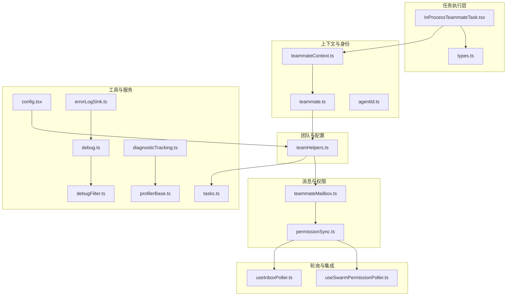
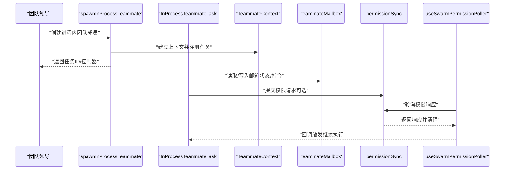
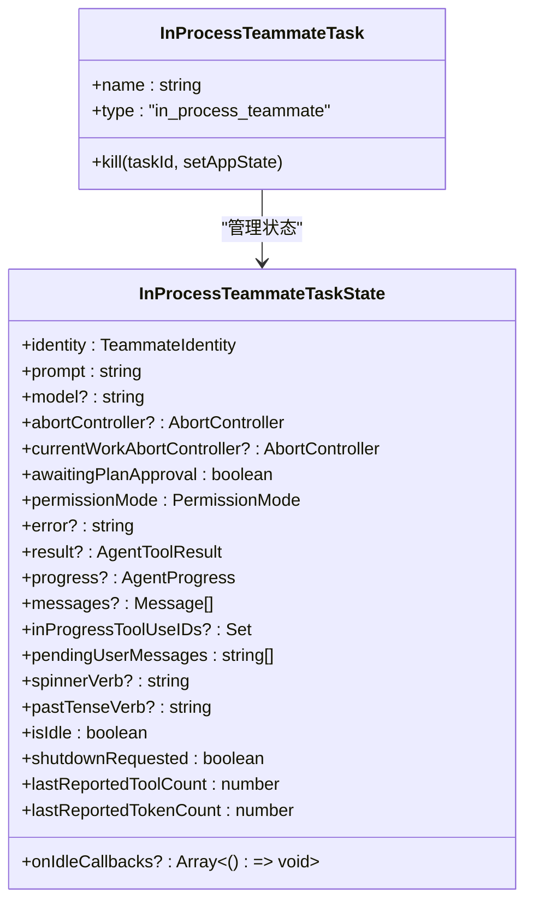
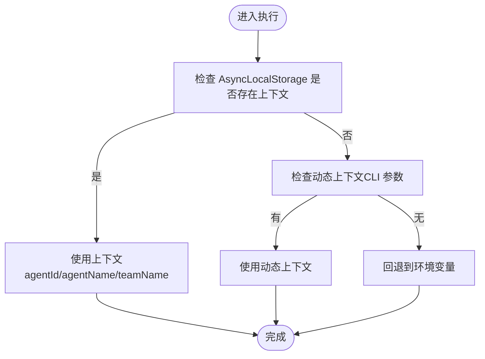
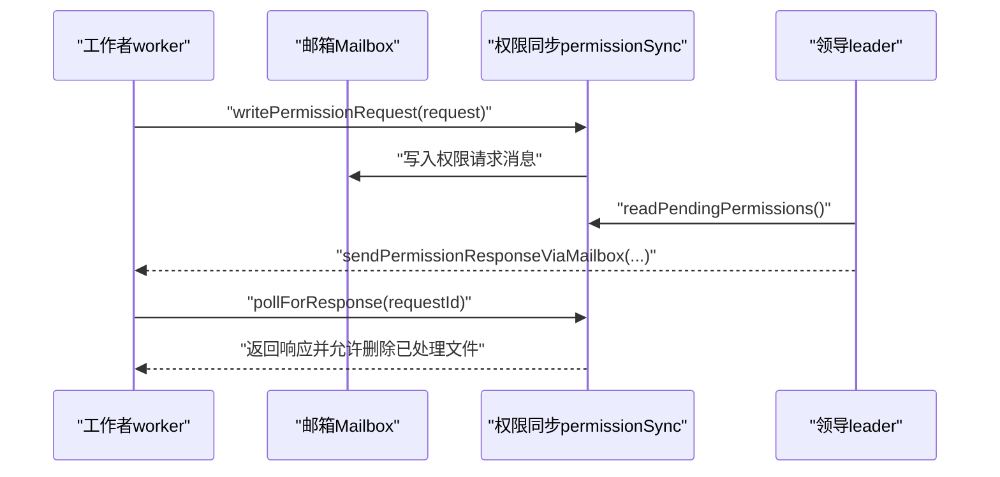
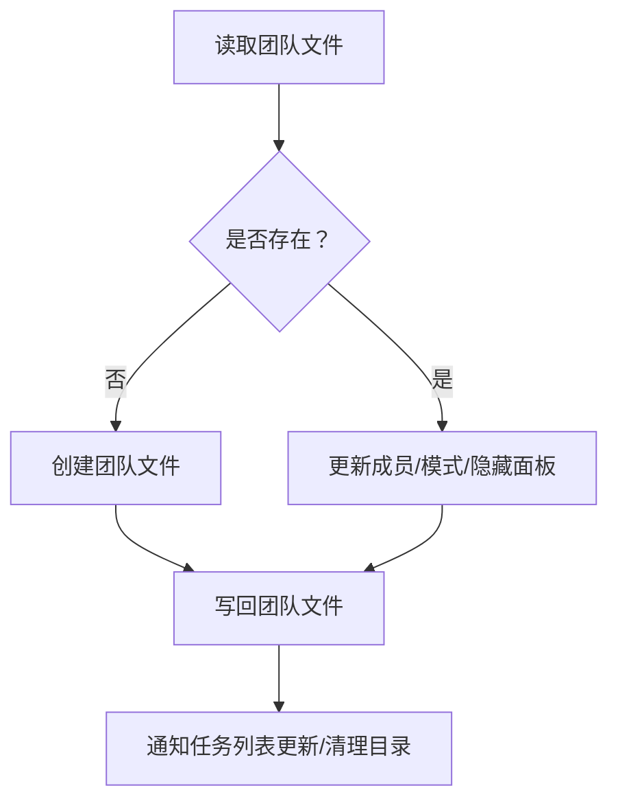
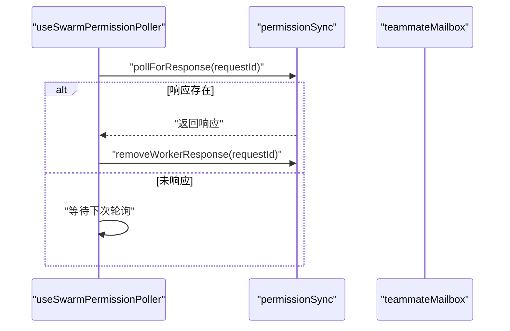
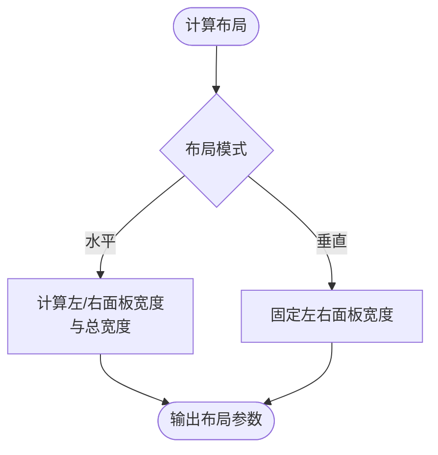
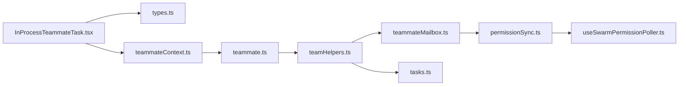

# 团队成员任务协调

<cite>
**本文引用的文件**
- [src\tasks\InProcessTeammateTask\InProcessTeammateTask.tsx](file://src\tasks\InProcessTeammateTask\InProcessTeammateTask.tsx)
- [src\tasks\InProcessTeammateTask\types.ts](file://src\tasks\InProcessTeammateTask\types.ts)
- [src\utils\swarm\spawnInProcess.ts](file://src\utils\swarm\spawnInProcess.ts)
- [src\utils\swarm\permissionSync.ts](file://src\utils\swarm\permissionSync.ts)
- [src\utils\teammateMailbox.ts](file://src\utils\teammateMailbox.ts)
- [src\utils\teammate.ts](file://src\utils\teammate.ts)
- [src\utils\teammateContext.ts](file://src\utils\teammateContext.ts)
- [src\utils\swarm\teamHelpers.ts](file://src\utils\swarm\teamHelpers.ts)
- [src\hooks\useSwarmPermissionPoller.ts](file://src\hooks\useSwarmPermissionPoller.ts)
- [src\hooks\useInboxPoller.ts](file://src\hooks\useInboxPoller.ts)
- [src\utils\tasks.ts](file://src\utils\tasks.ts)
- [src\utils\agentId.ts](file://src\utils\agentId.ts)
- [src\utils\logoV2Utils.ts](file://src\utils\logoV2Utils.ts)
- [src\commands\config\config.tsx](file://src\commands\config\config.tsx)
- [src\utils\debug.ts](file://src\utils\debug.ts)
- [src\utils\debugFilter.ts](file://src\utils\debugFilter.ts)
- [src\utils\errorLogSink.ts](file://src\utils\errorLogSink.ts)
- [src\utils\profilerBase.ts](file://src\utils\profilerBase.ts)
- [src\services\diagnosticTracking.ts](file://src\services\diagnosticTracking.ts)
</cite>

## 目录
1. [简介](#简介)
2. [项目结构](#项目结构)
3. [核心组件](#核心组件)
4. [架构总览](#架构总览)
5. [详细组件分析](#详细组件分析)
6. [依赖关系分析](#依赖关系分析)
7. [性能考量](#性能考量)
8. [故障排查指南](#故障排查指南)
9. [结论](#结论)
10. [附录](#附录)

## 简介
本技术文档围绕 Claude Code 的“团队成员任务协调”体系，系统阐述进程内团队成员任务的生命周期与协作机制，涵盖以下关键主题：
- 进程内团队成员任务的创建、初始化与任务分配
- Swarm 协作框架：领导者权限桥接、权限同步与响应轮询、重新连接与容错
- 团队成员间通信协议、状态共享与冲突解决策略
- 任务布局管理、视图切换与用户体验优化
- 团队协作配置项、角色分工与工作流示例
- 监控、调试与性能调优指南

## 项目结构
该系统由“任务执行层（InProcessTeammateTask）+ 上下文隔离（AsyncLocalStorage）+ 消息与权限同步（Mailbox/PermissionSync）+ 配置与发现（TeamHelpers/teammate）+ 轮询与集成（useSwarmPermissionPoller/useInboxPoller）”构成。

**图表来源**
- [src\tasks\InProcessTeammateTask\InProcessTeammateTask.tsx:1-126](file://src\tasks\InProcessTeammateTask\InProcessTeammateTask.tsx#L1-L126)
- [src\tasks\InProcessTeammateTask\types.ts:1-122](file://src\tasks\InProcessTeammateTask\types.ts#L1-L122)
- [src\utils\swarm\spawnInProcess.ts:1-329](file://src\utils\swarm\spawnInProcess.ts#L1-L329)
- [src\utils\teammateContext.ts:1-97](file://src\utils\teammateContext.ts#L1-L97)
- [src\utils\teammate.ts:1-293](file://src\utils\teammate.ts#L1-L293)
- [src\utils\agentId.ts:1-40](file://src\utils\agentId.ts#L1-L40)
- [src\utils\teammateMailbox.ts:1-800](file://src\utils\teammateMailbox.ts#L1-L800)
- [src\utils\swarm\permissionSync.ts:1-929](file://src\utils\swarm\permissionSync.ts#L1-L929)
- [src\utils\swarm\teamHelpers.ts:1-684](file://src\utils\swarm\teamHelpers.ts#L1-L684)
- [src\hooks\useSwarmPermissionPoller.ts:1-330](file://src\hooks\useSwarmPermissionPoller.ts#L1-L330)
- [src\hooks\useInboxPoller.ts:514-591](file://src\hooks\useInboxPoller.ts#L514-L591)
- [src\utils\tasks.ts:805-845](file://src\utils\tasks.ts#L805-L845)
- [src\commands\config\config.tsx:1-7](file://src\commands\config\config.tsx#L1-L7)
- [src\utils\debug.ts:163-207](file://src\utils\debug.ts#L163-L207)
- [src\utils\debugFilter.ts:113-157](file://src\utils\debugFilter.ts#L113-L157)
- [src\utils\errorLogSink.ts:133-178](file://src\utils\errorLogSink.ts#L133-L178)
- [src\utils\profilerBase.ts:1-46](file://src\utils\profilerBase.ts#L1-L46)
- [src\services\diagnosticTracking.ts:318-355](file://src\services\diagnosticTracking.ts#L318-L355)

**章节来源**
- [src\tasks\InProcessTeammateTask\InProcessTeammateTask.tsx:1-126](file://src\tasks\InProcessTeammateTask\InProcessTeammateTask.tsx#L1-L126)
- [src\utils\swarm\spawnInProcess.ts:104-216](file://src\utils\swarm\spawnInProcess.ts#L104-L216)

## 核心组件
- 进程内团队成员任务（InProcessTeammateTask）
  - 提供任务生命周期管理（启动、注入用户消息、追加对话、请求关闭等）
  - 通过 AsyncLocalStorage 与 TeammateContext 实现并发隔离
- 上下文与身份（teammateContext、teammate、agentId）
  - AsyncLocalStorage 存储运行时上下文；teammate 提供跨环境变量/动态上下文解析；agentId 提供确定性 ID 格式
- 消息与权限（teammateMailbox、permissionSync）
  - 基于文件锁的邮箱系统；权限请求/响应的消息协议；轮询与清理机制
- 团队与配置（teamHelpers）
  - 团队文件读写、成员模式同步、会话清理、工作树销毁
- 轮询与集成（useSwarmPermissionPoller、useInboxPoller）
  - 权限响应轮询钩子；收件箱轮询处理（权限更新、模式变更等）

**章节来源**
- [src\tasks\InProcessTeammateTask\InProcessTeammateTask.tsx:24-126](file://src\tasks\InProcessTeammateTask\InProcessTeammateTask.tsx#L24-L126)
- [src\tasks\InProcessTeammateTask\types.ts:22-76](file://src\tasks\InProcessTeammateTask\types.ts#L22-L76)
- [src\utils\teammateContext.ts:22-39](file://src\utils\teammateContext.ts#L22-L39)
- [src\utils\teammate.ts:88-198](file://src\utils\teammate.ts#L88-L198)
- [src\utils\agentId.ts:35-40](file://src\utils\agentId.ts#L35-L40)
- [src\utils\teammateMailbox.ts:134-192](file://src\utils\teammateMailbox.ts#L134-L192)
- [src\utils\swarm\permissionSync.ts:215-250](file://src\utils\swarm\permissionSync.ts#L215-L250)
- [src\utils\swarm\teamHelpers.ts:147-182](file://src\utils\swarm\teamHelpers.ts#L147-L182)

## 架构总览
下图展示从“创建/初始化”到“权限轮询与消息传递”的端到端流程。

**图表来源**
- [src\utils\swarm\spawnInProcess.ts:104-216](file://src\utils\swarm\spawnInProcess.ts#L104-L216)
- [src\tasks\InProcessTeammateTask\InProcessTeammateTask.tsx:24-61](file://src\tasks\InProcessTeammateTask\InProcessTeammateTask.tsx#L24-L61)
- [src\utils\teammateMailbox.ts:134-192](file://src\utils\teammateMailbox.ts#L134-L192)
- [src\utils\swarm\permissionSync.ts:544-564](file://src\utils\swarm\permissionSync.ts#L544-L564)
- [src\hooks\useSwarmPermissionPoller.ts:320-330](file://src\hooks\useSwarmPermissionPoller.ts#L320-L330)

## 详细组件分析

### 进程内团队成员任务（InProcessTeammateTask）
- 角色与职责
  - 生命周期管理：启动、注入用户消息、追加对话、请求关闭、查找/筛选运行中成员
  - 并发隔离：通过 TeammateContext 与 AsyncLocalStorage 隔离不同成员的运行时上下文
- 关键接口
  - 任务定义与终止：提供 Task 接口实现与 kill 方法
  - 用户消息注入：支持在查看对话时向成员注入消息
  - 成员检索：按 agentId 查找任务，或获取所有运行中的成员

**图表来源**
- [src\tasks\InProcessTeammateTask\InProcessTeammateTask.tsx:24-61](file://src\tasks\InProcessTeammateTask\InProcessTeammateTask.tsx#L24-L61)
- [src\tasks\InProcessTeammateTask\types.ts:22-76](file://src\tasks\InProcessTeammateTask\types.ts#L22-L76)

**章节来源**
- [src\tasks\InProcessTeammateTask\InProcessTeammateTask.tsx:24-126](file://src\tasks\InProcessTeammateTask\InProcessTeammateTask.tsx#L24-L126)
- [src\tasks\InProcessTeammateTask\types.ts:78-122](file://src\tasks\InProcessTeammateTask\types.ts#L78-L122)

### 上下文与身份（AsyncLocalStorage 与 TeammateContext）
- AsyncLocalStorage 用于在同进程内隔离不同成员的上下文，避免全局状态冲突
- teammate.ts 提供统一的身份解析优先级：AsyncLocalStorage > 动态上下文 > 环境变量
- agentId.ts 提供确定性 agentId 格式（agentName@teamName），便于重连与路由

**图表来源**
- [src\utils\teammateContext.ts:47-72](file://src\utils\teammateContext.ts#L47-L72)
- [src\utils\teammate.ts:88-118](file://src\utils\teammate.ts#L88-L118)
- [src\utils\agentId.ts:35-40](file://src\utils\agentId.ts#L35-L40)

**章节来源**
- [src\utils\teammateContext.ts:1-97](file://src\utils\teammateContext.ts#L1-L97)
- [src\utils\teammate.ts:1-131](file://src\utils\teammate.ts#L1-L131)
- [src\utils\agentId.ts:1-40](file://src\utils\agentId.ts#L1-L40)

### 消息与权限（teammateMailbox 与 permissionSync）
- 邮箱系统
  - 每个成员拥有独立的 inbox 文件，基于文件锁保证并发安全
  - 支持权限请求/响应、沙箱网络访问请求/响应、空闲通知、计划审批请求/响应等消息类型
- 权限同步
  - 工作者侧发起请求，领导侧轮询响应；支持文件目录与邮箱两种路径
  - 提供清理过期响应、删除已处理响应、生成唯一请求ID等能力

**图表来源**
- [src\utils\swarm\permissionSync.ts:215-250](file://src\utils\swarm\permissionSync.ts#L215-L250)
- [src\utils\swarm\permissionSync.ts:676-722](file://src\utils\swarm\permissionSync.ts#L676-L722)
- [src\utils\swarm\permissionSync.ts:734-783](file://src\utils\swarm\permissionSync.ts#L734-L783)
- [src\utils\teammateMailbox.ts:488-536](file://src\utils\teammateMailbox.ts#L488-L536)
- [src\utils\swarm\permissionSync.ts:544-564](file://src\utils\swarm\permissionSync.ts#L544-L564)

**章节来源**
- [src\utils\teammateMailbox.ts:134-192](file://src\utils\teammateMailbox.ts#L134-L192)
- [src\utils\swarm\permissionSync.ts:520-576](file://src\utils\swarm\permissionSync.ts#L520-L576)

### 团队与配置（teamHelpers）
- 团队文件读写：提供同步/异步读写、清理、工作树销毁等
- 成员模式同步：支持设置/批量设置成员权限模式，并写回 config.json
- 会话清理：记录会话创建的团队，退出时统一清理

**图表来源**
- [src\utils\swarm\teamHelpers.ts:147-182](file://src\utils\swarm\teamHelpers.ts#L147-L182)
- [src\utils\swarm\teamHelpers.ts:357-407](file://src\utils\swarm\teamHelpers.ts#L357-L407)
- [src\utils\swarm\teamHelpers.ts:576-590](file://src\utils\swarm\teamHelpers.ts#L576-L590)

**章节来源**
- [src\utils\swarm\teamHelpers.ts:1-684](file://src\utils\swarm\teamHelpers.ts#L1-L684)

### 轮询与集成（useSwarmPermissionPoller 与 useInboxPoller）
- 权限轮询钩子
  - 定期轮询权限响应，处理合法的响应并清理；支持注册/注销回调、清理全部挂起回调
- 收件箱轮询
  - 处理权限更新、模式变更请求等；仅接受来自团队领导的消息

**图表来源**
- [src\hooks\useSwarmPermissionPoller.ts:295-318](file://src\hooks\useSwarmPermissionPoller.ts#L295-L318)
- [src\utils\swarm\permissionSync.ts:544-564](file://src\utils\swarm\permissionSync.ts#L544-L564)

**章节来源**
- [src\hooks\useSwarmPermissionPoller.ts:1-330](file://src\hooks\useSwarmPermissionPoller.ts#L1-L330)
- [src\hooks\useInboxPoller.ts:514-591](file://src\hooks\useInboxPoller.ts#L514-L591)

### 任务布局管理、视图切换与用户体验优化
- UI 维度计算与布局
  - 计算左右面板宽度、总宽度，确保内容不溢出
- 设置入口
  - 打开配置面板，默认定位到“配置”标签页
- 对话历史容量控制
  - 限制 UI 层对话数组长度，避免内存膨胀

**图表来源**
- [src\utils\logoV2Utils.ts:43-75](file://src\utils\logoV2Utils.ts#L43-L75)
- [src\commands\config\config.tsx:1-7](file://src\commands\config\config.tsx#L1-L7)
- [src\tasks\InProcessTeammateTask\types.ts:108-121](file://src\tasks\InProcessTeammateTask\types.ts#L108-L121)

**章节来源**
- [src\utils\logoV2Utils.ts:43-90](file://src\utils\logoV2Utils.ts#L43-L90)
- [src\commands\config\config.tsx:1-7](file://src\commands\config\config.tsx#L1-L7)
- [src\tasks\InProcessTeammateTask\types.ts:89-121](file://src\tasks\InProcessTeammateTask\types.ts#L89-L121)

### 团队协作配置选项、角色分工与工作流示例
- 角色与分工
  - 团队领导：负责权限审批、模式变更、成员状态同步、计划审批
  - 团队成员：执行具体任务、请求权限、上报空闲状态、接收指令
- 配置与发现
  - 通过 teamHelpers 读写团队文件，同步成员模式至 config.json
  - 通过 teammateMailbox 发送/接收消息，支持多种消息类型
- 工作流示例
  - 成员请求权限：工作者发送请求 -> 领导轮询 -> 领导审批 -> 返回响应
  - 成员空闲通知：成员停止后发送空闲通知 -> 领导处理并可能重新分配任务
  - 任务回收：当成员被终止/关闭时，系统自动取消其未完成任务并广播通知

**章节来源**
- [src\utils\swarm\teamHelpers.ts:357-407](file://src\utils\swarm\teamHelpers.ts#L357-L407)
- [src\utils\teammateMailbox.ts:407-447](file://src\utils\teammateMailbox.ts#L407-L447)
- [src\utils\tasks.ts:818-845](file://src\utils\tasks.ts#L818-L845)

## 依赖关系分析
- 组件耦合
  - InProcessTeammateTask 依赖 TeammateContext 与任务类型定义
  - permissionSync 依赖 teammateMailbox 与 teamHelpers
  - useSwarmPermissionPoller 依赖 permissionSync 与 teammate 工具
- 外部依赖
  - 文件系统（fs/promises）用于邮箱与团队文件
  - 锁文件（lockfile）保证并发安全
  - Zod Schema 用于消息与团队文件的结构校验

**图表来源**
- [src\tasks\InProcessTeammateTask\InProcessTeammateTask.tsx:12-19](file://src\tasks\InProcessTeammateTask\InProcessTeammateTask.tsx#L12-L19)
- [src\tasks\InProcessTeammateTask\types.ts:1-7](file://src\tasks\InProcessTeammateTask\types.ts#L1-L7)
- [src\utils\swarm\spawnInProcess.ts:37-43](file://src\utils\swarm\spawnInProcess.ts#L37-L43)
- [src\utils\teammateContext.ts:16-41](file://src\utils\teammateContext.ts#L16-L41)
- [src\utils\teammate.ts:25-28](file://src\utils\teammate.ts#L25-L28)
- [src\utils\swarm\teamHelpers.ts:5-17](file://src\utils\swarm\teamHelpers.ts#L5-L17)
- [src\utils\teammateMailbox.ts:10-29](file://src\utils\teammateMailbox.ts#L10-L29)
- [src\utils\swarm\permissionSync.ts:21-44](file://src\utils\swarm\permissionSync.ts#L21-L44)
- [src\hooks\useSwarmPermissionPoller.ts:12-26](file://src\hooks\useSwarmPermissionPoller.ts#L12-L26)
- [src\utils\tasks.ts:1-10](file://src\utils\tasks.ts#L1-L10)

**章节来源**
- [src\utils\swarm\permissionSync.ts:1-90](file://src\utils\swarm\permissionSync.ts#L1-L90)
- [src\utils\teammateMailbox.ts:1-50](file://src\utils\teammateMailbox.ts#L1-L50)

## 性能考量
- 内存与容量控制
  - UI 对话数组上限（TEAMMATE_MESSAGES_UI_CAP）避免内存膨胀
  - 任务输出缓存清理与终端任务回收，减少磁盘占用
- 并发与锁
  - 邮箱写入采用文件锁与指数退避，降低竞争冲突
  - 权限响应轮询间隔可控，避免频繁 IO
- 可观测性
  - 调试日志缓冲与过滤，支持分类显示
  - 错误日志落盘与 MCP 错误追踪
  - 性能剖析基座（profilerBase）支持时间线格式化与内存统计

**章节来源**
- [src\tasks\InProcessTeammateTask\types.ts:89-121](file://src\tasks\InProcessTeammateTask\types.ts#L89-L121)
- [src\utils\teammateMailbox.ts:134-192](file://src\utils\teammateMailbox.ts#L134-L192)
- [src\utils\debug.ts:163-207](file://src\utils\debug.ts#L163-L207)
- [src\utils\debugFilter.ts:113-157](file://src\utils\debugFilter.ts#L113-L157)
- [src\utils\errorLogSink.ts:133-178](file://src\utils\errorLogSink.ts#L133-L178)
- [src\utils\profilerBase.ts:1-46](file://src\utils\profilerBase.ts#L1-L46)

## 故障排查指南
- 权限轮询问题
  - 确认 isSwarmWorker 判定正确；检查轮询间隔与回调注册
  - 使用 clearAllPendingCallbacks 清理挂起回调
- 邮箱读写异常
  - 检查文件锁是否释放；确认 inbox 目录存在且可写
  - 使用 readUnreadMessages/readMailbox 辅助诊断
- 日志与诊断
  - 启用调试模式，使用 shouldShowDebugMessage 过滤日志类别
  - 错误日志写入专用文件，提取服务器返回信息辅助定位
  - 诊断跟踪服务可格式化诊断摘要，便于展示与归档

**章节来源**
- [src\hooks\useSwarmPermissionPoller.ts:82-116](file://src\hooks\useSwarmPermissionPoller.ts#L82-L116)
- [src\utils\teammateMailbox.ts:84-108](file://src\utils\teammateMailbox.ts#L84-L108)
- [src\utils\debugFilter.ts:113-157](file://src\utils\debugFilter.ts#L113-L157)
- [src\utils\errorLogSink.ts:133-178](file://src\utils\errorLogSink.ts#L133-L178)
- [src\services\diagnosticTracking.ts:318-355](file://src\services\diagnosticTracking.ts#L318-L355)

## 结论
该团队成员任务协调系统以“进程内任务 + AsyncLocalStorage 上下文隔离 + 文件锁邮箱 + 权限轮询”为核心，实现了高并发、低耦合、可扩展的多智能体协作。通过确定性 ID、消息协议与轮询机制，系统在复杂交互场景下保持一致性与可观测性。建议在生产环境中结合容量控制、日志过滤与性能剖析工具，持续优化内存与 IO 行为。

## 附录
- 相关命令入口：打开配置面板（默认“配置”标签）
- 任务回收：当成员被终止/关闭时，系统自动取消其未完成任务并广播通知

**章节来源**
- [src\commands\config\config.tsx:1-7](file://src\commands\config\config.tsx#L1-L7)
- [src\utils\tasks.ts:818-845](file://src\utils\tasks.ts#L818-L845)