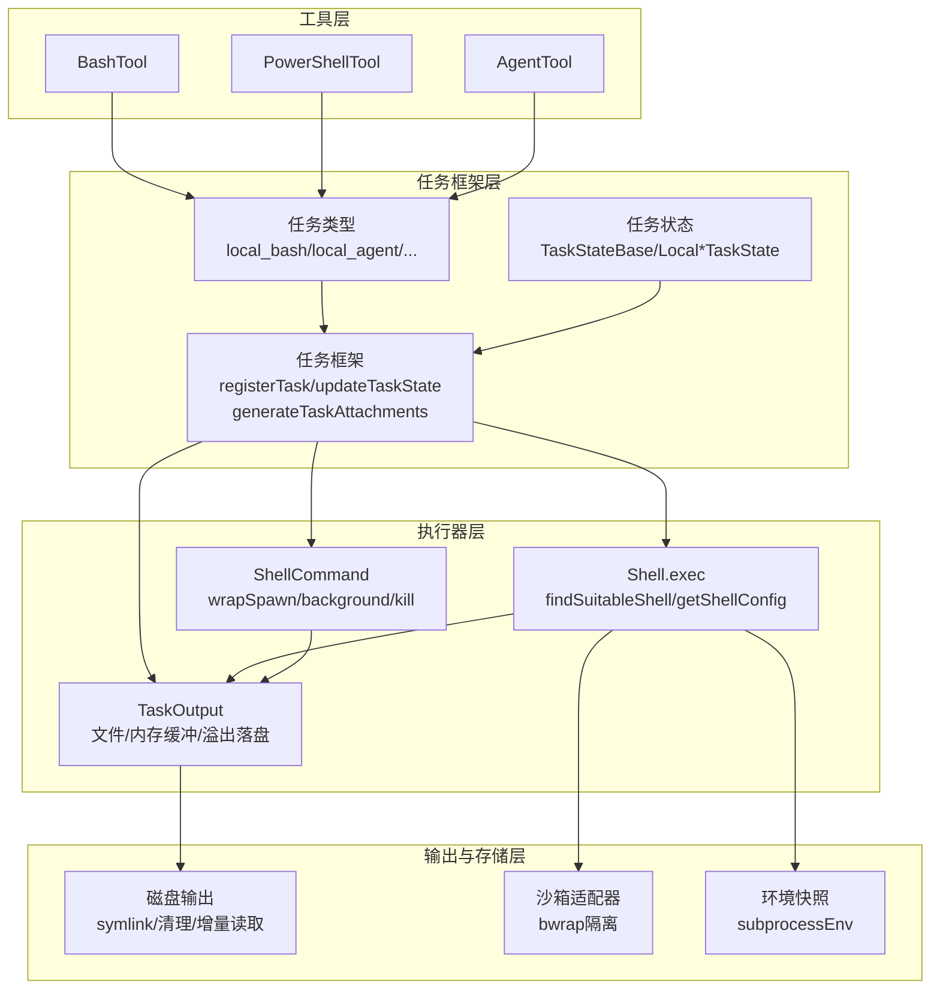
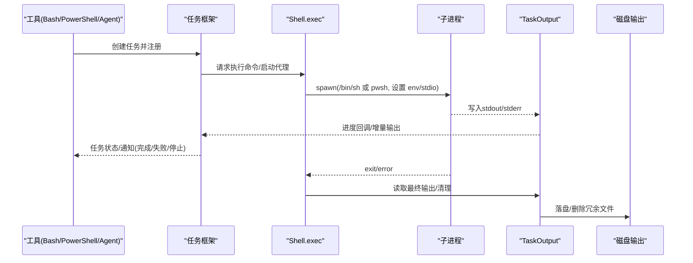
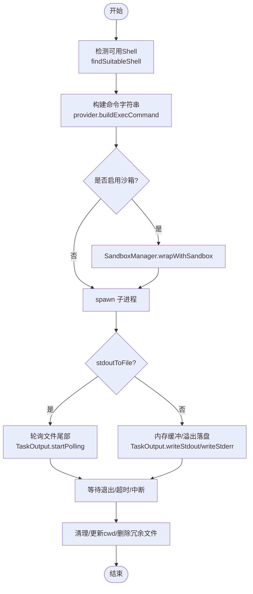
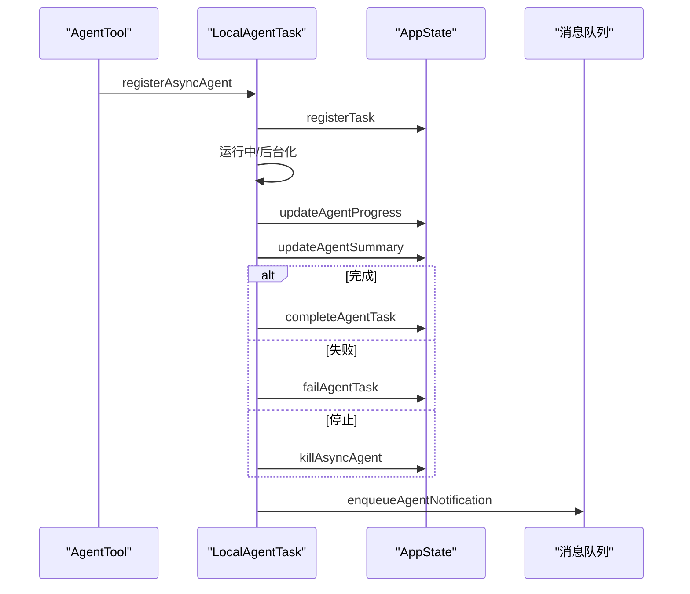
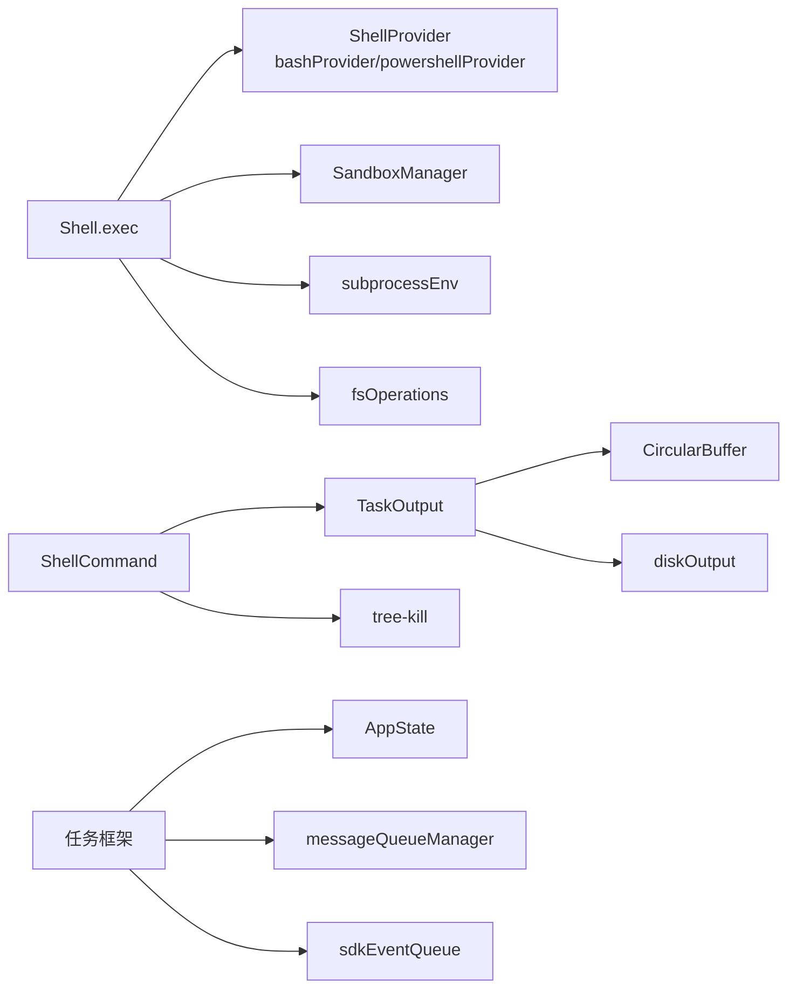

# 本地任务执行

<cite>
**本文引用的文件**
- [src/Task.ts](file://src/Task.ts)
- [src/tabs/本地任务/本地任务执行.md](file://src/tabs/本地任务/本地任务执行.md)
- [src/utils/Shell.ts](file://src/utils/Shell.ts)
- [src/utils/ShellCommand.ts](file://src/utils/ShellCommand.ts)
- [src/utils/task/TaskOutput.ts](file://src/utils/task/TaskOutput.ts)
- [src/utils/task/framework.ts](file://src/utils/task/framework.ts)
- [src/tasks/LocalShellTask/LocalShellTask.tsx](file://src/tasks/LocalShellTask/LocalShellTask.tsx)
- [src/tasks/LocalAgentTask/LocalAgentTask.tsx](file://src/tasks/LocalAgentTask/LocalAgentTask.tsx)
- [src/tasks/LocalMainSessionTask.ts](file://src/tasks/LocalMainSessionTask.ts)
- [src/utils/Shell.ts](file://src/utils/Shell.ts)
- [src/utils/task/diskOutput.ts](file://src/utils/task/diskOutput.ts)
- [src/utils/task/sdkProgress.ts](file://src/utils/task/sdkProgress.ts)
- [src/utils/task/sdkEventQueue.ts](file://src/utils/task/sdkEventQueue.ts)
- [src/utils/messageQueueManager.ts](file://src/utils/messageQueueManager.ts)
- [src/utils/sessionStorage.ts](file://src/utils/sessionStorage.ts)
- [src/utils/platform.ts](file://src/utils/platform.ts)
- [src/utils/subprocessEnv.ts](file://src/utils/subprocessEnv.ts)
- [src/utils/fsOperations.ts](file://src/utils/fsOperations.ts)
- [src/utils/circularBuffer.ts](file://src/utils/CircularBuffer.ts)
- [src/utils/stringUtils.ts](file://src/utils/stringUtils.ts)
- [src/utils/format.ts](file://src/utils/format.ts)
- [src/utils/errors.ts](file://src/utils/errors.ts)
- [src/utils/log.ts](file://src/utils/log.ts)
- [src/utils/debug.ts](file://src/utils/debug.ts)
- [src/utils/abortController.ts](file://src/utils/abortController.ts)
- [src/utils/cleanupRegistry.ts](file://src/utils/cleanupRegistry.ts)
- [src/utils/sandbox/sandbox-adapter.ts](file://src/utils/sandbox/sandbox-adapter.ts)
- [src/utils/sessionEnvironment.ts](file://src/utils/sessionEnvironment.ts)
- [src/utils/shell/bashProvider.ts](file://src/utils/shell/bashProvider.ts)
- [src/utils/shell/powershellProvider.ts](file://src/utils/shell/powershellProvider.ts)
- [src/utils/shell/powershellDetection.ts](file://src/utils/shell/powershellDetection.ts)
- [src/utils/shell/shellProvider.ts](file://src/utils/shell/shellProvider.ts)
- [src/utils/which.ts](file://src/utils/which.ts)
- [src/utils/windowsPaths.ts](file://src/utils/windowsPaths.ts)
- [src/bootstrap/state.ts](file://src/bootstrap/state.ts)
- [src/constants/xml.ts](file://src/constants/xml.ts)
- [src/tools/BashTool/BashTool.tsx](file://src/tools/BashTool/BashTool.tsx)
- [src/tools/PowerShellTool/PowerShellTool.tsx](file://src/tools/PowerShellTool/PowerShellTool.tsx)
- [src/tools/AgentTool/AgentTool.tsx](file://src/tools/AgentTool/AgentTool.tsx)
- [src/hooks/useInboxPoller.ts](file://src/hooks/useInboxPoller.ts)
- [src/services/PromptSuggestion/speculation.ts](file://src/services/PromptSuggestion/speculation.ts)
- [src/utils/teleport.tsx](file://src/utils/teleport.tsx)
</cite>

## 目录
1. [简介](#简介)
2. [项目结构](#项目结构)
3. [核心组件](#核心组件)
4. [架构总览](#架构总览)
5. [详细组件分析](#详细组件分析)
6. [依赖关系分析](#依赖关系分析)
7. [性能考虑](#性能考虑)
8. [故障排查指南](#故障排查指南)
9. [结论](#结论)
10. [附录](#附录)

## 简介
本技术文档面向 Claude Code 的本地任务执行系统，聚焦于本地 Shell 任务（Bash/PowerShell）与本地代理任务的实现机制。内容涵盖：
- 执行环境配置：Shell 检测、环境变量注入、工作目录变更、沙箱隔离
- 命令安全验证：可执行性检查、路径解析、权限与隔离策略
- 输出处理：文件模式与管道模式、进度回调、溢出落盘、截断策略
- 本地代理任务：生命周期管理、状态同步、资源隔离与中断处理
- 本地主会话任务：会话管理、状态维护与前台/后台切换
- 安全策略、权限控制与错误处理
- 实际代码示例与配置选项，指导如何创建与管理各类本地任务

## 项目结构
本地任务执行系统由“工具层”“任务框架层”“执行器层”“输出与存储层”四部分组成，通过统一的任务类型与状态机协同工作。

图表来源
- [src/utils/Shell.ts:181-442](file://src/utils/Shell.ts#L181-L442)
- [src/utils/ShellCommand.ts:114-382](file://src/utils/ShellCommand.ts#L114-L382)
- [src/utils/task/TaskOutput.ts:32-391](file://src/utils/task/TaskOutput.ts#L32-L391)
- [src/utils/task/framework.ts:48-117](file://src/utils/task/framework.ts#L48-L117)
- [src/utils/task/diskOutput.ts:1-391](file://src/utils/task/diskOutput.ts#L1-L391)

章节来源
- [src/utils/Shell.ts:1-475](file://src/utils/Shell.ts#L1-L475)
- [src/utils/ShellCommand.ts:1-466](file://src/utils/ShellCommand.ts#L1-L466)
- [src/utils/task/TaskOutput.ts:1-391](file://src/utils/task/TaskOutput.ts#L1-L391)
- [src/utils/task/framework.ts:1-309](file://src/utils/task/framework.ts#L1-L309)

## 核心组件
- 任务类型与状态
  - 任务类型：local_bash、local_agent、remote_agent、in_process_teammate、local_workflow、monitor_mcp、dream
  - 终止状态：completed、failed、killed；用于回收与通知去重
  - 任务句柄：TaskHandle 提供清理回调
- Shell 执行器
  - Shell.exec：选择合适的 Shell（Bash/Zsh 或 PowerShell），构建命令字符串，设置超时、沙箱、输出文件等
  - 环境注入：SHELL、GIT_EDITOR、CLAUDECODE、会话 ID 等
  - 工作目录变更：命令结束后读取临时文件更新当前工作目录
- ShellCommand
  - 包装子进程，支持超时、中断、后台化、清理监听器
  - 文件模式与管道模式：前者直接写文件，后者通过 TaskOutput 内存缓冲
- TaskOutput
  - 单一输出源：统一 stdout/stderr 存储与进度回调
  - 文件模式：共享轮询提取进度；管道模式：实时缓冲与溢出落盘
- 任务框架
  - 注册/更新任务状态、生成附件、轮询增量输出、延迟回收终止任务
  - 通知格式：XML 标签封装任务 ID、类型、状态、输出路径、摘要等

章节来源
- [src/Task.ts:6-95](file://src/Task.ts#L6-L95)
- [src/utils/Shell.ts:181-442](file://src/utils/Shell.ts#L181-L442)
- [src/utils/ShellCommand.ts:114-382](file://src/utils/ShellCommand.ts#L114-L382)
- [src/utils/task/TaskOutput.ts:32-391](file://src/utils/task/TaskOutput.ts#L32-L391)
- [src/utils/task/framework.ts:48-117](file://src/utils/task/framework.ts#L48-L117)

## 架构总览
本地任务执行的关键流程如下：

图表来源
- [src/utils/Shell.ts:181-442](file://src/utils/Shell.ts#L181-L442)
- [src/utils/ShellCommand.ts:114-382](file://src/utils/ShellCommand.ts#L114-L382)
- [src/utils/task/TaskOutput.ts:282-326](file://src/utils/task/TaskOutput.ts#L282-L326)
- [src/utils/task/framework.ts:158-206](file://src/utils/task/framework.ts#L158-L206)

## 详细组件分析

### 本地 Shell 任务（Bash/PowerShell）
- 执行环境配置
  - 自动检测：优先 CLAUDE_CODE_SHELL/SHELL，回退到 which('bash'/'zsh')，确保可执行性
  - PowerShell 支持：缓存 PowerShell 路径，使用编码命令在沙箱中运行
  - 环境注入：SHELL、GIT_EDITOR、CLAUDECODE、会话 ID（蚂蚁用户）
  - 工作目录：命令结束后读取临时文件，NFC 规范化后更新当前工作目录
- 命令安全验证
  - 可执行性检查：X_OK 或 --version 快速探测
  - 路径解析：POSIX/Windows 路径转换，避免符号链接攻击（O_NOFOLLOW）
  - 沙箱隔离：bwrap 隔离，限制写入，清理挂载点文件
- 输出处理
  - 文件模式：stdout/stderr 同写文件 fd，通过轮询提取进度
  - 管道模式：数据经 StreamWrapper 进入 TaskOutput 内存缓冲，超过阈值溢出至磁盘
  - 截断策略：超过最大输出长度时返回文件路径而非内联内容
- 错误处理
  - 预执行错误：工作目录不存在、spawn 失败等，返回预执行错误信息
  - 超时与中断：SIGTERM/SIGKILL，自动后台化或强制终止
  - 进程树清理：tree-kill 清理子进程树

图表来源
- [src/utils/Shell.ts:73-137](file://src/utils/Shell.ts#L73-L137)
- [src/utils/Shell.ts:209-286](file://src/utils/Shell.ts#L209-L286)
- [src/utils/ShellCommand.ts:114-180](file://src/utils/ShellCommand.ts#L114-L180)
- [src/utils/task/TaskOutput.ts:81-103](file://src/utils/task/TaskOutput.ts#L81-L103)

章节来源
- [src/utils/Shell.ts:73-137](file://src/utils/Shell.ts#L73-L137)
- [src/utils/Shell.ts:209-286](file://src/utils/Shell.ts#L209-L286)
- [src/utils/ShellCommand.ts:114-180](file://src/utils/ShellCommand.ts#L114-L180)
- [src/utils/task/TaskOutput.ts:81-103](file://src/utils/task/TaskOutput.ts#L81-L103)

### 本地代理任务（LocalAgentTask）
- 生命周期与状态同步
  - 注册：initTaskOutputAsSymlink + registerTask，创建/注册任务状态
  - 后台化：backgroundAgentTask，标记 isBackgrounded 并触发信号中断
  - 完成/失败：completeAgentTask/failAgentTask 更新状态与结果
  - 终止：killAsyncAgent 中断并清理
- 进度与摘要
  - updateAgentProgress：记录工具使用数、token 数、最近活动
  - updateAgentSummary：周期性汇总进度摘要，向 SDK 消费者推送
- 通知机制
  - enqueueAgentNotification：XML 标签封装任务摘要、结果、用量、工作树信息

图表来源
- [src/tasks/LocalAgentTask/LocalAgentTask.tsx:466-515](file://src/tasks/LocalAgentTask/LocalAgentTask.tsx#L466-L515)
- [src/tasks/LocalAgentTask/LocalAgentTask.tsx:620-652](file://src/tasks/LocalAgentTask/LocalAgentTask.tsx#L620-L652)
- [src/tasks/LocalAgentTask/LocalAgentTask.tsx:412-456](file://src/tasks/LocalAgentTask/LocalAgentTask.tsx#L412-L456)
- [src/tasks/LocalAgentTask/LocalAgentTask.tsx:197-262](file://src/tasks/LocalAgentTask/LocalAgentTask.tsx#L197-L262)

章节来源
- [src/tasks/LocalAgentTask/LocalAgentTask.tsx:466-515](file://src/tasks/LocalAgentTask/LocalAgentTask.tsx#L466-L515)
- [src/tasks/LocalAgentTask/LocalAgentTask.tsx:620-652](file://src/tasks/LocalAgentTask/LocalAgentTask.tsx#L620-L652)
- [src/tasks/LocalAgentTask/LocalAgentTask.tsx:412-456](file://src/tasks/LocalAgentTask/LocalAgentTask.tsx#L412-L456)
- [src/tasks/LocalAgentTask/LocalAgentTask.tsx:197-262](file://src/tasks/LocalAgentTask/LocalAgentTask.tsx#L197-L262)

### 本地主会话任务（LocalMainSessionTask）
- 任务标识与输出
  - 使用 's' 前缀区分于普通 agent 任务（'a'）
  - 输出初始化为指向会话转录路径的符号链接
- 前台/后台切换
  - foregroundMainSessionTask：标记前台显示，恢复上一个前台任务为后台
  - isMainSessionTask：类型判断
- 会话管理
  - 与会话存储交互，记录侧链转录，支持会话背景化与恢复

章节来源
- [src/tasks/LocalMainSessionTask.ts:55-145](file://src/tasks/LocalMainSessionTask.ts#L55-L145)
- [src/tasks/LocalMainSessionTask.ts:265-302](file://src/tasks/LocalMainSessionTask.ts#L265-L302)

### 任务框架与通知
- 注册与更新
  - registerTask：合并 UI 持有状态，避免重复事件
  - updateTaskState：类型安全的状态更新，避免不必要渲染
- 轮询与增量输出
  - generateTaskAttachments：计算增量输出偏移，生成附件
  - applyTaskOffsetsAndEvictions：应用偏移与回收终止任务
- 通知格式
  - XML 标签封装：任务 ID、类型、状态、输出路径、摘要等
  - 特殊状态：监控脚本流结束、后台命令等待输入提示

章节来源
- [src/utils/task/framework.ts:48-117](file://src/utils/task/framework.ts#L48-L117)
- [src/utils/task/framework.ts:158-206](file://src/utils/task/framework.ts#L158-L206)
- [src/utils/task/framework.ts:255-269](file://src/utils/task/framework.ts#L255-L269)
- [src/tasks/LocalShellTask/LocalShellTask.tsx:105-172](file://src/tasks/LocalShellTask/LocalShellTask.tsx#L105-L172)

## 依赖关系分析
- 组件耦合
  - Shell.exec 依赖 ShellProvider、SandboxManager、subprocessEnv、fsOperations
  - ShellCommand 依赖 TaskOutput、AbortSignal、tree-kill
  - TaskOutput 依赖 CircularBuffer、fsOperations、diskOutput
  - 任务框架依赖 AppState、messageQueueManager、sdkEventQueue
- 关键外部依赖
  - tree-kill：进程树终止
  - lodash-es.memoize：Shell 配置缓存
  - bun:bundle.feature：条件加载工作流/监控任务

图表来源
- [src/utils/Shell.ts:37-42](file://src/utils/Shell.ts#L37-L42)
- [src/utils/ShellCommand.ts:4-4](file://src/utils/ShellCommand.ts#L4-L4)
- [src/utils/task/TaskOutput.ts:2-7](file://src/utils/task/TaskOutput.ts#L2-L7)
- [src/utils/task/framework.ts:11-19](file://src/utils/task/framework.ts#L11-L19)

章节来源
- [src/utils/Shell.ts:37-42](file://src/utils/Shell.ts#L37-L42)
- [src/utils/ShellCommand.ts:4-4](file://src/utils/ShellCommand.ts#L4-L4)
- [src/utils/task/TaskOutput.ts:2-7](file://src/utils/task/TaskOutput.ts#L2-L7)
- [src/utils/task/framework.ts:11-19](file://src/utils/task/framework.ts#L11-L19)

## 性能考虑
- I/O 模式选择
  - 文件模式：避免 JS 处理 stdout/stderr，降低内存占用，适合长输出命令
  - 管道模式：内存缓冲+溢出落盘，适合需要实时进度的场景
- 进度轮询
  - 共享轮询器，按需激活/停用，减少不必要的 I/O
  - 尾部采样与行计数外推，保证进度估算准确
- 超时与后台化
  - 超时回调可触发自动后台化，避免长时间阻塞
  - 后台化时启动大小看门狗，防止磁盘被写满
- 缓存与复用
  - Shell 配置与 PowerShell 路径缓存，减少重复探测
  - 任务输出文件冗余检测，及时删除冗余文件

## 故障排查指南
- 常见问题与定位
  - 无可用 Shell：检查 CLAUDE_CODE_SHELL/SHELL 是否有效，确认 bash/zsh 可执行
  - 工作目录异常：命令结束后无法恢复，检查 pwd -P 输出与路径规范化
  - 输出过大：查看是否触发溢出落盘，关注 outputFilePath 与 outputFileSize
  - 超时/中断：确认 SIGTERM/SIGKILL 来源，检查 shouldAutoBackground 配置
  - 沙箱失败：bwrap 隔离导致写入受限，检查权限与挂载点清理
- 日志与调试
  - logForDebugging/logError：输出底层错误与诊断信息
  - 任务通知：XML 标签便于模型与消费者识别任务状态
- 回收与清理
  - 终止任务延迟回收：STOPPED_DISPLAY_MS/PANEL_GRACE_MS 控制面板可见时间
  - 清理回调：registerCleanup 与 TaskOutput.clear，避免资源泄漏

章节来源
- [src/utils/Shell.ts:234-421](file://src/utils/Shell.ts#L234-L421)
- [src/utils/ShellCommand.ts:239-261](file://src/utils/ShellCommand.ts#L239-L261)
- [src/utils/task/TaskOutput.ts:368-379](file://src/utils/task/TaskOutput.ts#L368-L379)
- [src/utils/task/framework.ts:25-29](file://src/utils/task/framework.ts#L25-L29)

## 结论
本地任务执行系统通过清晰的分层设计与严格的资源管理，实现了对 Bash/PowerShell 命令与本地代理任务的高效、安全与可观测执行。文件模式与管道模式的灵活切换、沙箱隔离与输出截断策略，确保了在复杂工程场景下的稳定性与安全性。任务框架提供的统一状态机与通知机制，使得前台/后台切换、进度汇总与错误处理具备一致的用户体验。

## 附录

### 任务类型与状态定义
- 任务类型：local_bash、local_agent、remote_agent、in_process_teammate、local_workflow、monitor_mcp、dream
- 任务状态：pending、running、completed、failed、killed
- 终止判定：isTerminalTaskStatus 用于回收与通知去重

章节来源
- [src/Task.ts:6-29](file://src/Task.ts#L6-L29)

### Shell 执行参数与选项
- ExecOptions
  - timeout：默认 30 分钟
  - onProgress：进度回调（lastLines/allLines/totalLines/totalBytes/isIncomplete）
  - preventCwdChanges：阻止更新当前工作目录
  - shouldUseSandbox：启用沙箱
  - shouldAutoBackground：超时自动后台化
  - onStdout：管道模式下实时回调 stdout 数据块

章节来源
- [src/utils/Shell.ts:161-175](file://src/utils/Shell.ts#L161-L175)

### 本地 Shell 任务创建与管理
- spawnShellTask：注册任务、后台化、完成通知、输出清理
- registerForeground/backgroundAll/backgroundTask：前台/后台切换与批量后台化
- markTaskNotified/unregisterForeground：抑制重复通知与清理未后台化的前台任务

章节来源
- [src/tasks/LocalShellTask/LocalShellTask.tsx:180-252](file://src/tasks/LocalShellTask/LocalShellTask.tsx#L180-L252)
- [src/tasks/LocalShellTask/LocalShellTask.tsx:259-287](file://src/tasks/LocalShellTask/LocalShellTask.tsx#L259-L287)
- [src/tasks/LocalShellTask/LocalShellTask.tsx:390-410](file://src/tasks/LocalShellTask/LocalShellTask.tsx#L390-L410)
- [src/tasks/LocalShellTask/LocalShellTask.tsx:481-514](file://src/tasks/LocalShellTask/LocalShellTask.tsx#L481-L514)

### 本地代理任务创建与管理
- registerAsyncAgent/registerAgentForeground：注册后台/前台代理任务
- backgroundAgentTask：后台化指定任务
- completeAgentTask/failAgentTask/killAsyncAgent：完成/失败/终止
- updateAgentProgress/updateAgentSummary：进度与摘要更新

章节来源
- [src/tasks/LocalAgentTask/LocalAgentTask.tsx:466-515](file://src/tasks/LocalAgentTask/LocalAgentTask.tsx#L466-L515)
- [src/tasks/LocalAgentTask/LocalAgentTask.tsx:526-614](file://src/tasks/LocalAgentTask/LocalAgentTask.tsx#L526-L614)
- [src/tasks/LocalAgentTask/LocalAgentTask.tsx:620-652](file://src/tasks/LocalAgentTask/LocalAgentTask.tsx#L620-L652)
- [src/tasks/LocalAgentTask/LocalAgentTask.tsx:412-456](file://src/tasks/LocalAgentTask/LocalAgentTask.tsx#L412-L456)
- [src/tasks/LocalAgentTask/LocalAgentTask.tsx:339-407](file://src/tasks/LocalAgentTask/LocalAgentTask.tsx#L339-L407)

### 主会话任务管理
- 任务 ID 前缀：'s'
- 输出符号链接：initTaskOutputAsSymlink
- 前台切换：foregroundMainSessionTask
- 类型判断：isMainSessionTask

章节来源
- [src/tasks/LocalMainSessionTask.ts:73-110](file://src/tasks/LocalMainSessionTask.ts#L73-L110)
- [src/tasks/LocalMainSessionTask.ts:265-302](file://src/tasks/LocalMainSessionTask.ts#L265-L302)

### 安全策略与权限控制
- Shell 可执行性检查与快速探测
- O_NOFOLLOW 防止符号链接攻击
- 沙箱隔离与挂载点清理
- 会话环境缓存失效与工作目录变更校验
- 进程树终止与大小看门狗

章节来源
- [src/utils/Shell.ts:50-68](file://src/utils/Shell.ts#L50-L68)
- [src/utils/Shell.ts:292-301](file://src/utils/Shell.ts#L292-L301)
- [src/utils/Shell.ts:391-393](file://src/utils/Shell.ts#L391-L393)
- [src/utils/Shell.ts:406-421](file://src/utils/Shell.ts#L406-L421)
- [src/utils/ShellCommand.ts:239-261](file://src/utils/ShellCommand.ts#L239-L261)
- [src/utils/ShellCommand.ts:337-343](file://src/utils/ShellCommand.ts#L337-L343)