# 远程任务管理

<cite>
**本文引用的文件**
- [RemoteSessionManager.ts](file://src/remote/RemoteSessionManager.ts)
- [SessionsWebSocket.ts](file://src/remote/SessionsWebSocket.ts)
- [sdkMessageAdapter.ts](file://src/remote/sdkMessageAdapter.ts)
- [remotePermissionBridge.ts](file://src/remote/remotePermissionBridge.ts)
- [remoteIO.ts](file://src/cli/remoteIO.ts)
- [bridgeCore.ts](file://src/bridge/remoteBridgeCore.ts)
- [replBridgeTransport.ts](file://src/bridge/replBridgeTransport.ts)
- [bridgeMessaging.ts](file://src/bridge/bridgeMessaging.ts)
- [jwtUtils.ts](file://src/bridge/jwtUtils.ts)
- [envLessBridgeConfig.ts](file://src/bridge/envLessBridgeConfig.ts)
- [api.ts](file://src/utils/teleport/api.ts)
- [index.ts](file://src/commands/remote-setup/index.ts)
</cite>

## 目录
1. [引言](#引言)
2. [项目结构](#项目结构)
3. [核心组件](#核心组件)
4. [架构总览](#架构总览)
5. [详细组件分析](#详细组件分析)
6. [依赖关系分析](#依赖关系分析)
7. [性能考量](#性能考量)
8. [故障排查指南](#故障排查指南)
9. [结论](#结论)
10. [附录](#附录)

## 引言
本技术文档系统性阐述 Claude Code 的远程任务管理能力，聚焦于“远程代理任务”的架构设计与实现细节，覆盖以下主题：
- 远程会话的建立、维护与销毁流程
- 远程任务的通信机制：WebSocket 连接管理、消息传递协议与状态同步
- 权限验证、安全传输与数据加密机制
- 远程任务与本地任务的协同：任务分发、进度跟踪与结果聚合
- 实际配置、连接管理与故障恢复示例
- 系统扩展性与性能优化策略

## 项目结构
远程任务相关代码主要分布在以下模块：
- 远程会话与消息适配：src/remote
- 桥接层（REPL/远程控制）：src/bridge
- 命令入口与远程设置：src/commands/remote-setup
- CLI 与远端 IO：src/cli
- 通用 Teleport API 工具：src/utils/teleport

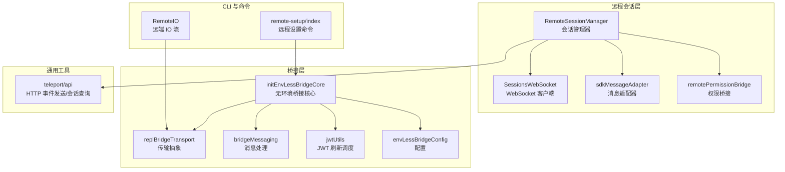

图表来源
- [RemoteSessionManager.ts:95-324](file://src/remote/RemoteSessionManager.ts#L95-L324)
- [SessionsWebSocket.ts:82-404](file://src/remote/SessionsWebSocket.ts#L82-L404)
- [sdkMessageAdapter.ts:168-278](file://src/remote/sdkMessageAdapter.ts#L168-L278)
- [remotePermissionBridge.ts:12-79](file://src/remote/remotePermissionBridge.ts#L12-L79)
- [remoteIO.ts:35-256](file://src/cli/remoteIO.ts#L35-L256)
- [bridgeCore.ts:140-761](file://src/bridge/remoteBridgeCore.ts#L140-L761)
- [replBridgeTransport.ts:119-371](file://src/bridge/replBridgeTransport.ts#L119-L371)
- [bridgeMessaging.ts:132-391](file://src/bridge/bridgeMessaging.ts#L132-L391)
- [jwtUtils.ts:72-256](file://src/bridge/jwtUtils.ts#L72-L256)
- [envLessBridgeConfig.ts:130-166](file://src/bridge/envLessBridgeConfig.ts#L130-L166)
- [api.ts:361-417](file://src/utils/teleport/api.ts#L361-L417)
- [index.ts:1-21](file://src/commands/remote-setup/index.ts#L1-L21)

章节来源
- [RemoteSessionManager.ts:1-344](file://src/remote/RemoteSessionManager.ts#L1-L344)
- [SessionsWebSocket.ts:1-405](file://src/remote/SessionsWebSocket.ts#L1-L405)
- [sdkMessageAdapter.ts:1-303](file://src/remote/sdkMessageAdapter.ts#L1-L303)
- [remotePermissionBridge.ts:1-79](file://src/remote/remotePermissionBridge.ts#L1-L79)
- [remoteIO.ts:1-256](file://src/cli/remoteIO.ts#L1-L256)
- [bridgeCore.ts:1-1009](file://src/bridge/remoteBridgeCore.ts#L1-L1009)
- [replBridgeTransport.ts:1-371](file://src/bridge/replBridgeTransport.ts#L1-L371)
- [bridgeMessaging.ts:1-462](file://src/bridge/bridgeMessaging.ts#L1-L462)
- [jwtUtils.ts:1-257](file://src/bridge/jwtUtils.ts#L1-L257)
- [envLessBridgeConfig.ts:1-166](file://src/bridge/envLessBridgeConfig.ts#L1-L166)
- [api.ts:1-467](file://src/utils/teleport/api.ts#L1-L467)
- [index.ts:1-21](file://src/commands/remote-setup/index.ts#L1-L21)

## 核心组件
- RemoteSessionManager：负责远程会话的建立、消息转发、权限请求处理、中断与断开重连等生命周期管理。
- SessionsWebSocket：封装 WebSocket 连接、认证、心跳、重连与错误处理。
- sdkMessageAdapter：将 SDK 消息转换为 REPL 内部消息类型，支持流式事件与状态消息映射。
- remotePermissionBridge：在远程模式下生成合成消息与工具桩，以支持权限确认流程。
- initEnvLessBridgeCore：无环境桥接核心，直接通过 /v1/sessions 与 /v1/code/sessions/{id}/bridge 与后端交互，管理 SSE + CCR v2 传输。
- replBridgeTransport：统一 v1/v2 传输接口，屏蔽底层差异；v2 使用 SSETransport 读取、CCRClient 写入。
- bridgeMessaging：桥接层消息解析、去重、控制请求处理与回执。
- jwtUtils：JWT 刷新调度器，确保会话长期稳定。
- envLessBridgeConfig：远程桥接配置项，含重试、超时、心跳、版本门槛等。
- teleport/api：HTTP 事件发送、会话查询与标题更新，用于远程会话的消息写入与状态管理。

章节来源
- [RemoteSessionManager.ts:95-324](file://src/remote/RemoteSessionManager.ts#L95-L324)
- [SessionsWebSocket.ts:82-404](file://src/remote/SessionsWebSocket.ts#L82-L404)
- [sdkMessageAdapter.ts:168-278](file://src/remote/sdkMessageAdapter.ts#L168-L278)
- [remotePermissionBridge.ts:12-79](file://src/remote/remotePermissionBridge.ts#L12-L79)
- [bridgeCore.ts:140-761](file://src/bridge/remoteBridgeCore.ts#L140-L761)
- [replBridgeTransport.ts:119-371](file://src/bridge/replBridgeTransport.ts#L119-L371)
- [bridgeMessaging.ts:132-391](file://src/bridge/bridgeMessaging.ts#L132-L391)
- [jwtUtils.ts:72-256](file://src/bridge/jwtUtils.ts#L72-L256)
- [envLessBridgeConfig.ts:130-166](file://src/bridge/envLessBridgeConfig.ts#L130-L166)
- [api.ts:361-417](file://src/utils/teleport/api.ts#L361-L417)

## 架构总览
远程任务系统采用“无环境桥接”路径，直接对接后端会话入口，避免传统工作调度层的复杂性。整体流程如下：
- 通过 OAuth 获取访问令牌，创建远程会话并获取 worker JWT 与 API 基址
- 建立 SSE 读流与 CCRClient 写通道，实现双向事件流
- 通过 SDKMessage 协议在客户端与远程代理之间传递消息
- 使用 JWT 刷新调度器维持长时会话
- 通过权限桥接与消息适配器实现权限提示、状态同步与 UI 渲染

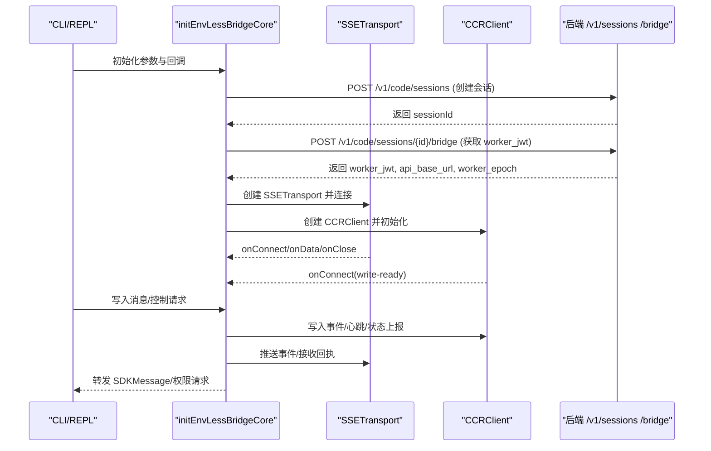

图表来源
- [bridgeCore.ts:173-256](file://src/bridge/remoteBridgeCore.ts#L173-L256)
- [replBridgeTransport.ts:193-371](file://src/bridge/replBridgeTransport.ts#L193-L371)
- [bridgeMessaging.ts:422-448](file://src/bridge/bridgeMessaging.ts#L422-L448)

## 详细组件分析

### RemoteSessionManager 组件分析
职责与行为：
- 通过 SessionsWebSocket 订阅远程会话事件流
- 将 SDKMessage 转发给上层回调
- 处理权限请求（can_use_tool），维护待决请求映射
- 支持中断、重连与断开
- 通过 HTTP POST 向远程会话发送用户消息

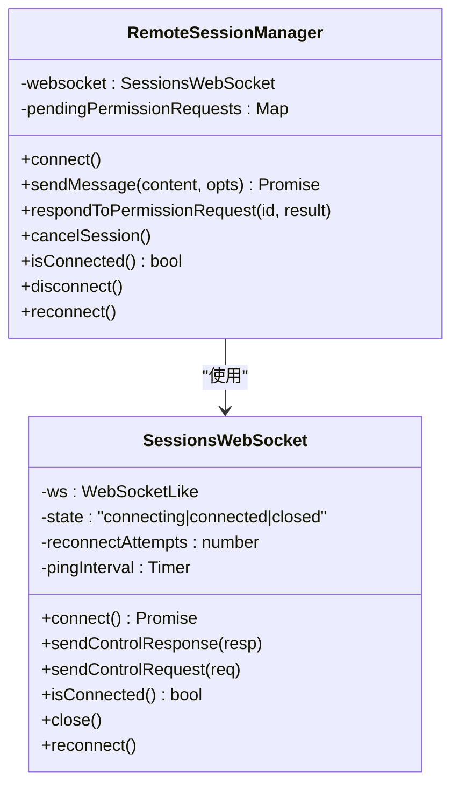

图表来源
- [RemoteSessionManager.ts:95-324](file://src/remote/RemoteSessionManager.ts#L95-L324)
- [SessionsWebSocket.ts:82-404](file://src/remote/SessionsWebSocket.ts#L82-L404)

章节来源
- [RemoteSessionManager.ts:95-324](file://src/remote/RemoteSessionManager.ts#L95-L324)
- [SessionsWebSocket.ts:82-404](file://src/remote/SessionsWebSocket.ts#L82-L404)

### SessionsWebSocket 组件分析
特性与策略：
- 连接建立：基于 OAuth 头部进行认证，支持代理与 mTLS 配置
- 心跳与保活：周期性 ping，避免代理/网关超时
- 重连策略：指数退避与有限尝试；对特定关闭码（如 4001、4003）采用特殊处理
- 控制消息：支持 control_request/control_response 的发送与解析

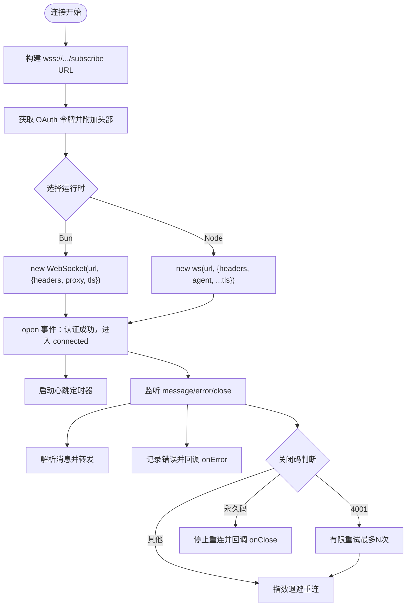

图表来源
- [SessionsWebSocket.ts:100-288](file://src/remote/SessionsWebSocket.ts#L100-L288)

章节来源
- [SessionsWebSocket.ts:82-404](file://src/remote/SessionsWebSocket.ts#L82-L404)

### sdkMessageAdapter 组件分析
职责与映射：
- 将 SDKMessage 转换为 REPL 内部消息类型（助手、系统、流事件等）
- 支持工具进度、压缩边界、结果消息等子类型映射
- 提供会话结束检测与结果文本提取

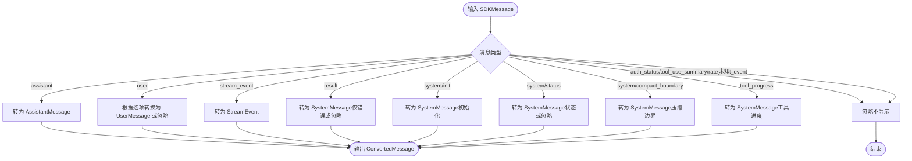

图表来源
- [sdkMessageAdapter.ts:168-278](file://src/remote/sdkMessageAdapter.ts#L168-L278)

章节来源
- [sdkMessageAdapter.ts:1-303](file://src/remote/sdkMessageAdapter.ts#L1-L303)

### remotePermissionBridge 组件分析
作用与实现：
- 在远程模式下生成合成的 AssistantMessage，以便权限确认 UI 正常显示
- 对本地缺失的工具创建最小化工具桩，路由到回退权限请求

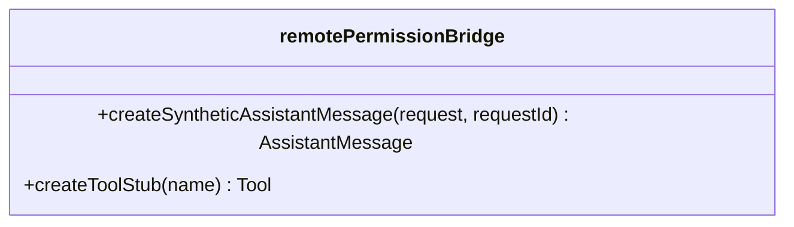

图表来源
- [remotePermissionBridge.ts:12-79](file://src/remote/remotePermissionBridge.ts#L12-L79)

章节来源
- [remotePermissionBridge.ts:1-79](file://src/remote/remotePermissionBridge.ts#L1-L79)

### initEnvLessBridgeCore 组件分析
核心流程与要点：
- 会话创建与凭据获取：POST /v1/code/sessions 与 /v1/code/sessions/{id}/bridge
- 传输层创建：SSETransport 读取 + CCRClient 写入
- 令牌刷新：基于 expires_in 的预刷新调度，防止 401
- 传输重建：支持主动刷新与 401 恢复，保证 epoch 一致性
- 历史刷新与去重：使用 BoundedUUIDSet 防止回声与重复
- 关闭归档：优雅关闭前写入结果事件并归档会话

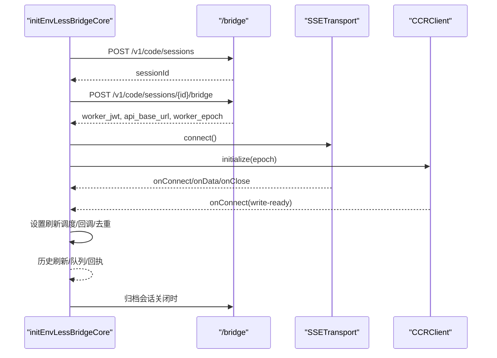

图表来源
- [bridgeCore.ts:173-256](file://src/bridge/remoteBridgeCore.ts#L173-L256)
- [replBridgeTransport.ts:193-371](file://src/bridge/replBridgeTransport.ts#L193-L371)
- [bridgeMessaging.ts:132-208](file://src/bridge/bridgeMessaging.ts#L132-L208)

章节来源
- [bridgeCore.ts:140-761](file://src/bridge/remoteBridgeCore.ts#L140-L761)
- [replBridgeTransport.ts:119-371](file://src/bridge/replBridgeTransport.ts#L119-L371)
- [bridgeMessaging.ts:132-391](file://src/bridge/bridgeMessaging.ts#L132-L391)

### replBridgeTransport 组件分析
抽象与适配：
- v1：HybridTransport（WS 读 + HTTP 写）
- v2：SSETransport（读）+ CCRClient（写/心跳/状态/交付跟踪）
- 提供统一接口：write/writeBatch/close/isConnected/getStateLabel/setOnData/setOnClose/setOnConnect/connect/flush 等
- v2 特有：reportState/reportMetadata/reportDelivery/lastSequenceNum/droppedBatchCount

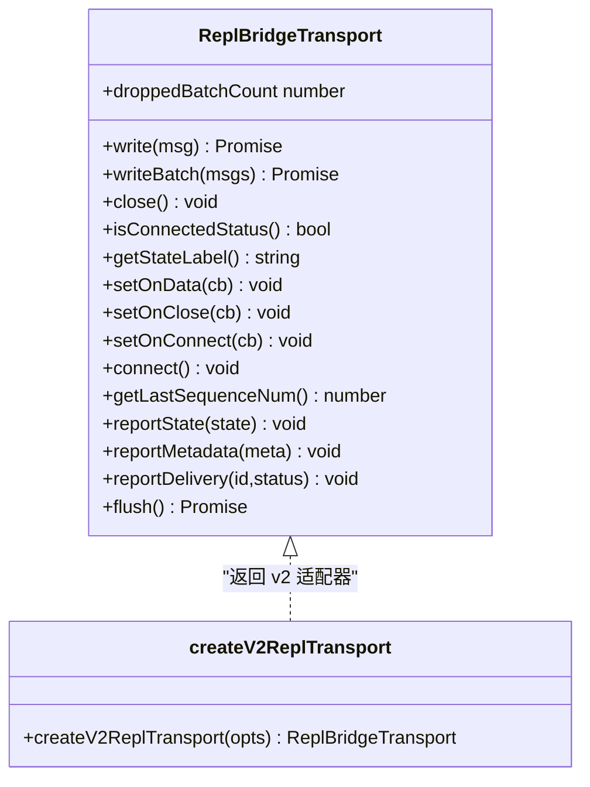

图表来源
- [replBridgeTransport.ts:23-70](file://src/bridge/replBridgeTransport.ts#L23-L70)
- [replBridgeTransport.ts:119-371](file://src/bridge/replBridgeTransport.ts#L119-L371)

章节来源
- [replBridgeTransport.ts:1-371](file://src/bridge/replBridgeTransport.ts#L1-L371)

### bridgeMessaging 组件分析
功能与机制：
- 入站消息解析与类型判定（SDKMessage、control_request、control_response）
- 去重：基于 recentPostedUUIDs 与 recentInboundUUIDs 的环形集合
- 控制请求处理：initialize、set_model、set_max_thinking_tokens、set_permission_mode、interrupt 等
- 结果消息构造：用于会话归档

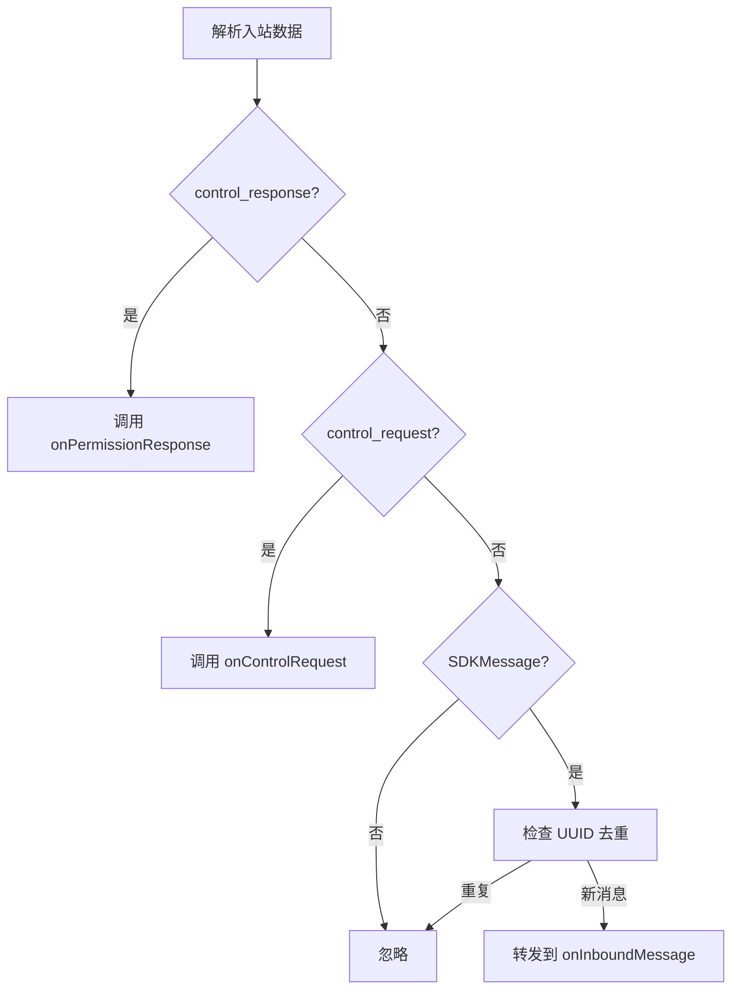

图表来源
- [bridgeMessaging.ts:132-208](file://src/bridge/bridgeMessaging.ts#L132-L208)

章节来源
- [bridgeMessaging.ts:1-462](file://src/bridge/bridgeMessaging.ts#L1-L462)

### jwtUtils 组件分析
机制与策略：
- 解析 JWT 的 exp 时间，计算到期前的刷新时间
- 基于生成计数器的刷新链路，避免过期任务被旧计时器触发
- 支持失败重试与上限控制，防止无限循环
- 提供一次性与基于 expires_in 的两种调度方式

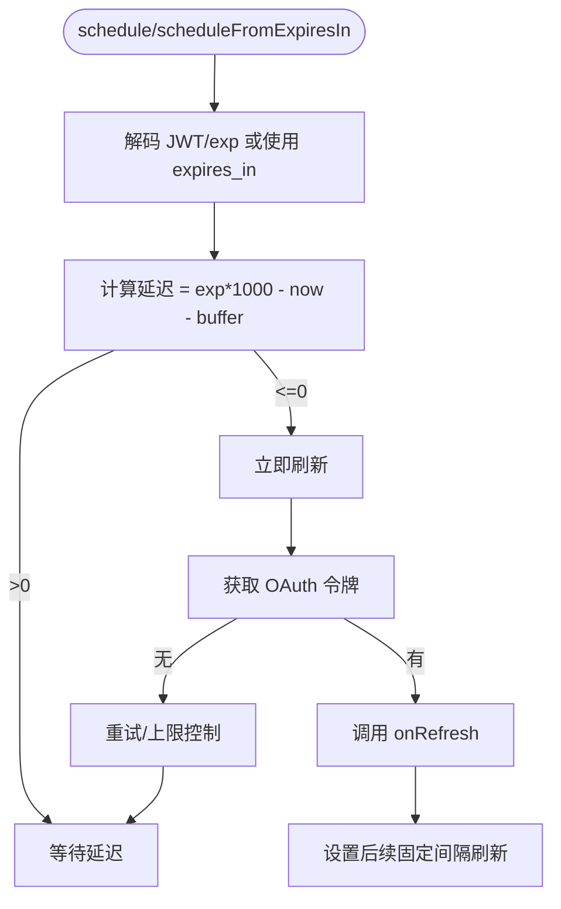

图表来源
- [jwtUtils.ts:102-230](file://src/bridge/jwtUtils.ts#L102-L230)

章节来源
- [jwtUtils.ts:1-257](file://src/bridge/jwtUtils.ts#L1-L257)

### envLessBridgeConfig 组件分析
配置项与约束：
- 初始化重试次数、基础延迟、抖动、最大延迟
- HTTP 超时、UUID 去重缓冲大小、心跳间隔与抖动
- JWT 刷新缓冲、归档超时、连接超时、版本门槛、应用升级提示

章节来源
- [envLessBridgeConfig.ts:130-166](file://src/bridge/envLessBridgeConfig.ts#L130-L166)

### Teleport API 组件分析
能力与用途：
- 发送用户事件到远程会话（/v1/sessions/{id}/events）
- 查询与更新会话信息（标题等）
- 提供网络瞬时错误的指数回退重试

章节来源
- [api.ts:361-417](file://src/utils/teleport/api.ts#L361-L417)

### 远程设置命令分析
- 通过 GrowthBook 与策略限制启用远程会话功能
- 作为 CLI 入口，引导用户完成远程设置

章节来源
- [index.ts:1-21](file://src/commands/remote-setup/index.ts#L1-L21)

## 依赖关系分析

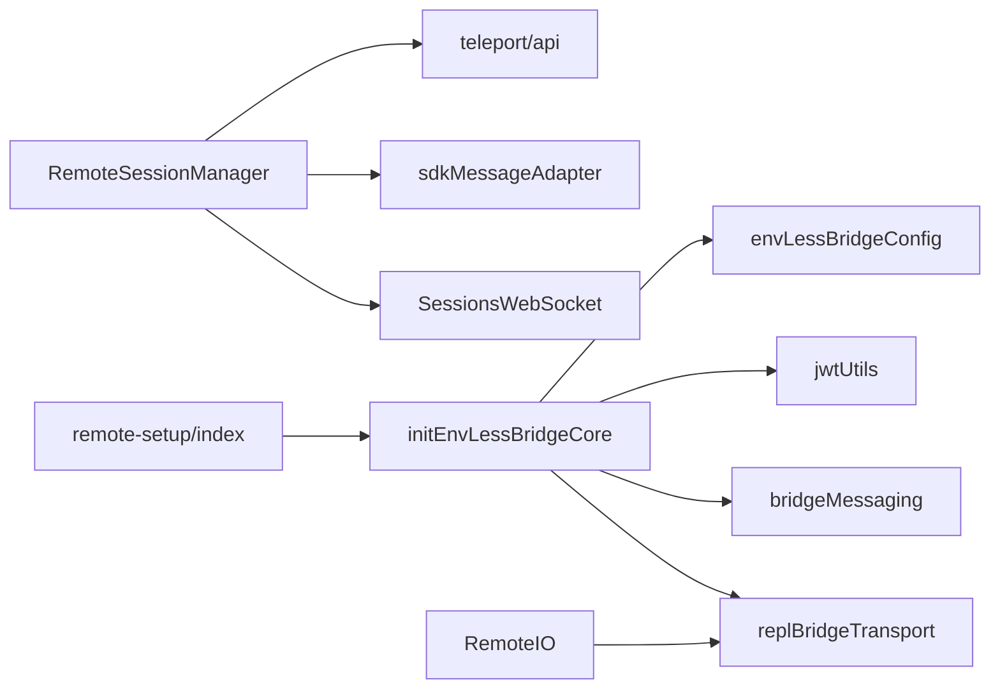

图表来源
- [RemoteSessionManager.ts:10-17](file://src/remote/RemoteSessionManager.ts#L10-L17)
- [bridgeCore.ts:33-53](file://src/bridge/remoteBridgeCore.ts#L33-L53)
- [remoteIO.ts:26-29](file://src/cli/remoteIO.ts#L26-L29)

章节来源
- [RemoteSessionManager.ts:1-344](file://src/remote/RemoteSessionManager.ts#L1-L344)
- [bridgeCore.ts:1-1009](file://src/bridge/remoteBridgeCore.ts#L1-L1009)
- [remoteIO.ts:1-256](file://src/cli/remoteIO.ts#L1-L256)
- [index.ts:1-21](file://src/commands/remote-setup/index.ts#L1-L21)

## 性能考量
- 连接与保活
  - SessionsWebSocket 使用心跳定时器维持长连接，避免代理/网关超时
  - RemoteIO 在桥接模式下定期发送 keep_alive，降低空闲会话被回收的风险
- 重试与退避
  - Teleport API 对瞬时网络错误与 5xx 采用指数回退重试
  - initEnvLessBridgeCore 对关键步骤（创建会话、获取凭据、恢复）采用带抖动的重试策略
- 去重与顺序
  - 使用 BoundedUUIDSet 保证消息去重，减少回声与重复处理
  - 历史刷新与写入队列（FlushGate）确保历史与实时消息的有序到达
- 心跳与刷新
  - CCRClient 心跳与 JWT 刷新调度共同保障长时会话稳定性，避免 401 与 epoch 不一致导致的重连风暴

## 故障排查指南
常见问题与定位建议：
- WebSocket 连接失败
  - 检查 OAuth 令牌有效性与代理/证书配置
  - 观察关闭码：4001（短暂会话未找到）、4003（未授权）等
  - 查看重连日志与 ping 响应
- 权限请求未响应
  - 确认 RemoteSessionManager 是否正确转发 control_request 至 UI
  - 检查权限响应是否及时发送（respondToPermissionRequest）
- 401/409 错误
  - initEnvLessBridgeCore 会自动触发 JWT 刷新与传输重建
  - 若频繁出现，检查刷新调度与令牌来源
- 消息丢失或重复
  - 检查 BoundedUUIDSet 是否正确添加/查询
  - 确认 FlushGate 在重建传输后已正确出队
- 会话归档失败
  - 确认 OAuth 令牌可用，并在必要时进行二次刷新
  - 检查归档超时配置与网络状况

章节来源
- [SessionsWebSocket.ts:234-288](file://src/remote/SessionsWebSocket.ts#L234-L288)
- [bridgeCore.ts:530-590](file://src/bridge/remoteBridgeCore.ts#L530-L590)
- [bridgeMessaging.ts:132-208](file://src/bridge/bridgeMessaging.ts#L132-L208)
- [jwtUtils.ts:165-230](file://src/bridge/jwtUtils.ts#L165-L230)

## 结论
该远程任务管理系统通过“无环境桥接”路径，实现了从 CLI 到远程代理的高效、稳定与可扩展的通信链路。其关键优势包括：
- 直接对接后端会话入口，简化工作调度层
- 健壮的连接管理与重连策略，结合心跳与刷新机制保障长时会话
- 完整的权限与消息处理流水线，支持权限提示、状态同步与 UI 渲染
- 可观测与可诊断的设计，便于问题定位与性能优化

## 附录
- 实际配置示例
  - 远程会话配置：包含会话 ID、组织 UUID、访问令牌获取器、初始提示标记与只读模式
  - 桥接配置：重试、超时、心跳、版本门槛等参数
- 连接管理与故障恢复
  - 通过 SessionsWebSocket 的重连策略与 initEnvLessBridgeCore 的传输重建机制，实现自动恢复
- 扩展性与性能优化
  - 传输抽象（replBridgeTransport）隔离 v1/v2 差异
  - 去重与顺序保证（BoundedUUIDSet、FlushGate）提升吞吐与稳定性
  - JWT 刷新与心跳策略降低会话中断概率