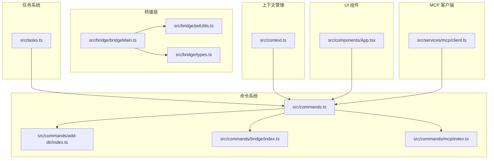
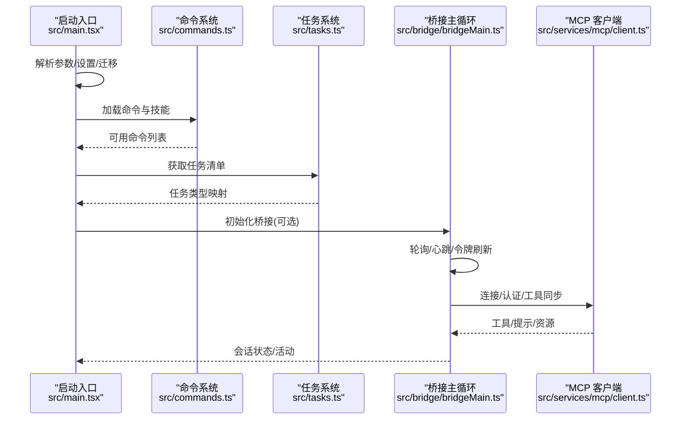
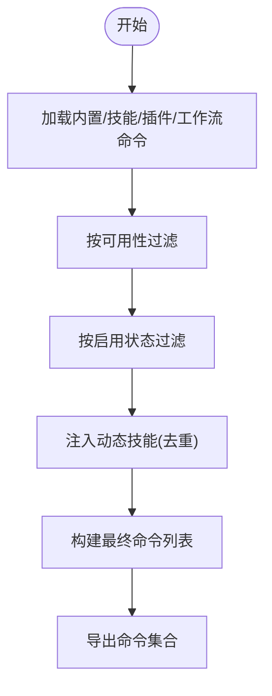
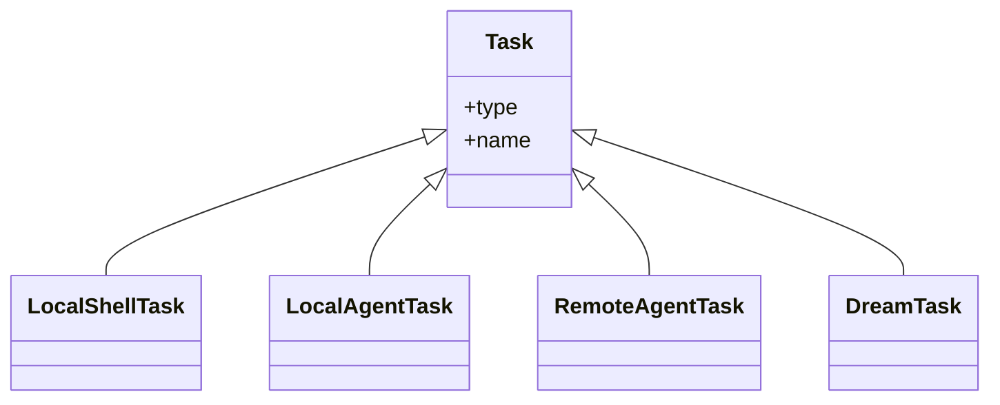
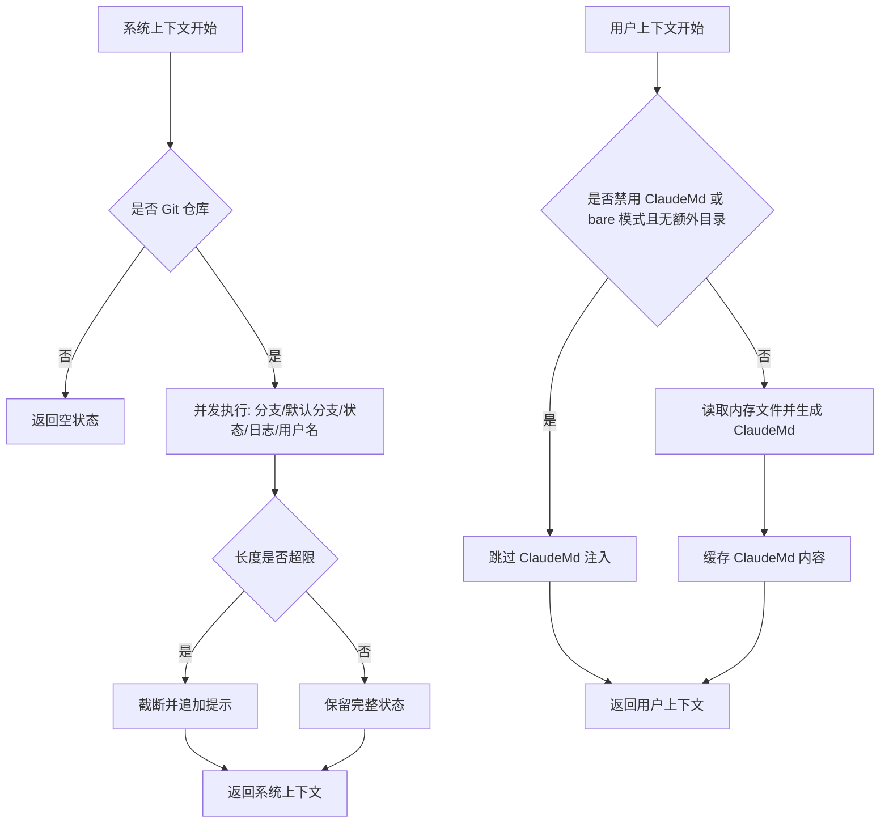
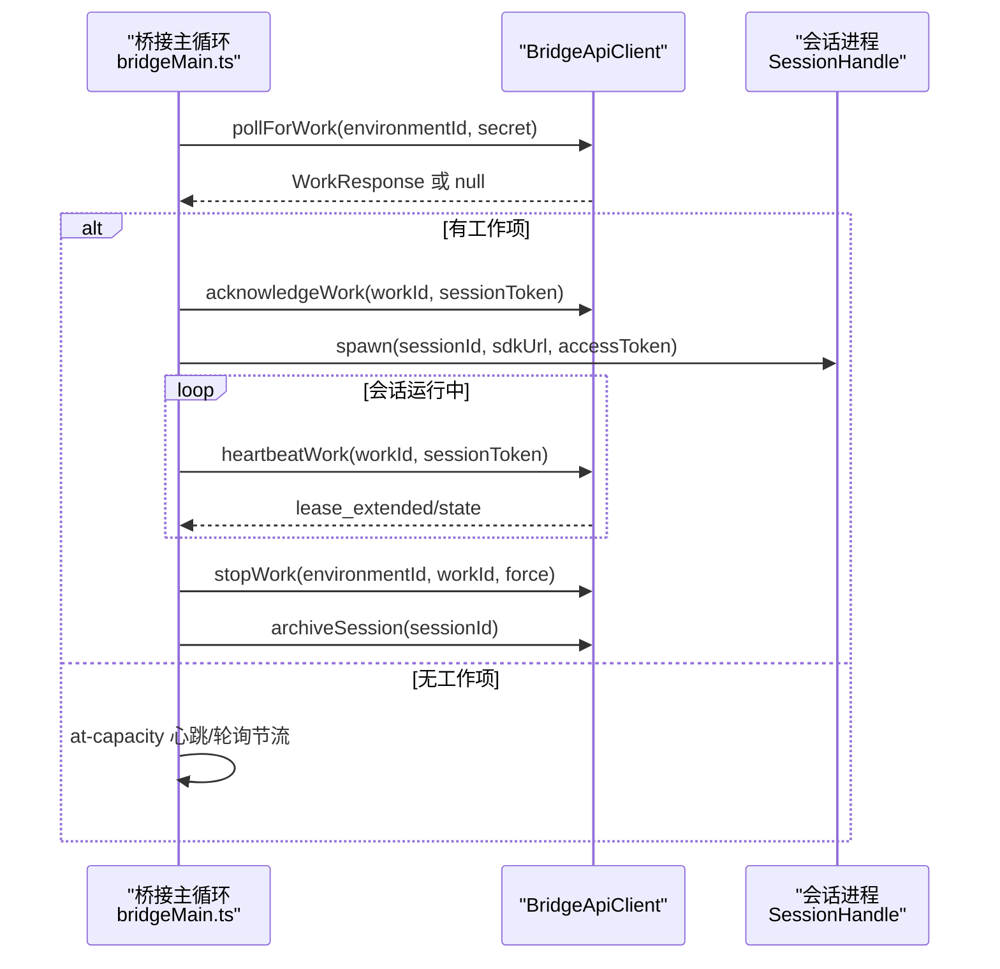
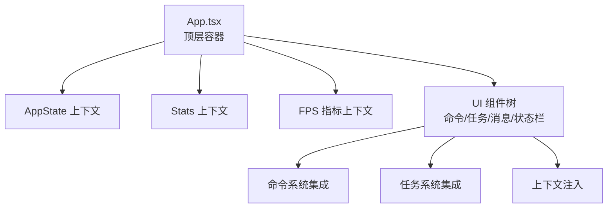
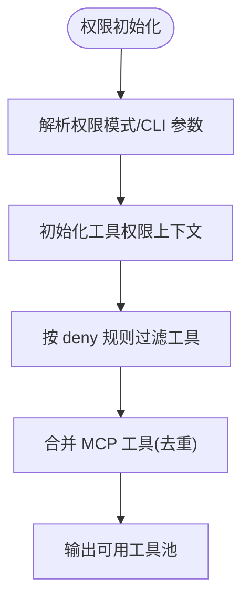
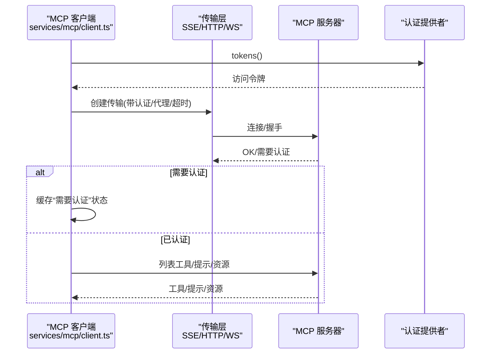
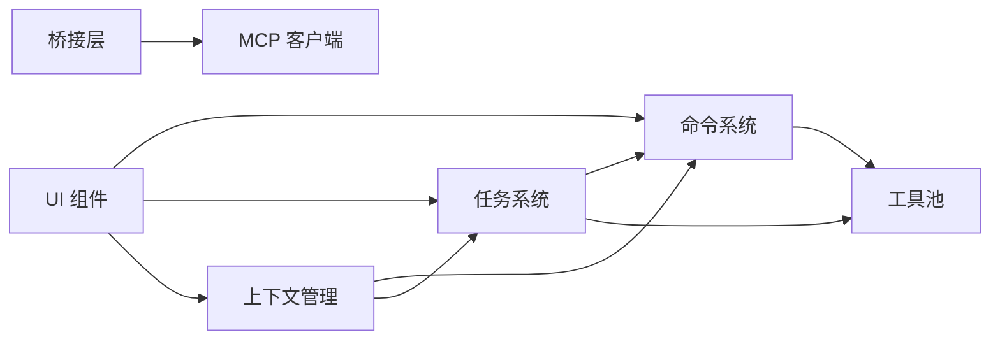

# 功能特性详解

<cite>
**本文引用的文件**
- [src/main.tsx](file://src/main.tsx)
- [src/commands.ts](file://src/commands.ts)
- [src/commands/add-dir/index.ts](file://src/commands/add-dir/index.ts)
- [src/commands/bridge/index.ts](file://src/commands/bridge/index.ts)
- [src/commands/mcp/index.ts](file://src/commands/mcp/index.ts)
- [src/tasks.ts](file://src/tasks.ts)
- [src/context.ts](file://src/context.ts)
- [src/bridge/bridgeMain.ts](file://src/bridge/bridgeMain.ts)
- [src/bridge/jwtUtils.ts](file://src/bridge/jwtUtils.ts)
- [src/bridge/types.ts](file://src/bridge/types.ts)
- [src/components/App.tsx](file://src/components/App.tsx)
- [src/services/mcp/client.ts](file://src/services/mcp/client.ts)
- [src/tools.ts](file://src/tools.ts)
</cite>

## 目录
1. [简介](#简介)
2. [项目结构](#项目结构)
3. [核心组件](#核心组件)
4. [架构总览](#架构总览)
5. [详细组件分析](#详细组件分析)
6. [依赖关系分析](#依赖关系分析)
7. [性能考量](#性能考量)
8. [故障排查指南](#故障排查指南)
9. [结论](#结论)
10. [附录](#附录)

## 简介
本文件面向 Claude Code 的功能特性，围绕命令系统、任务系统、上下文管理、桥接层（含 Claude Desktop 集成与远程会话）、UI 组件体系、权限控制以及 MCP 协议支持进行系统化说明。文档在保持技术深度的同时，尽量以循序渐进的方式呈现，帮助不同背景的读者理解架构设计与实现要点。

## 项目结构
- 命令系统：集中于 src/commands.ts，统一加载内置命令、技能、插件技能与工作流，并提供可用性过滤、远程安全命令白名单等能力。
- 任务系统：src/tasks.ts 汇聚本地/远程代理任务与 Dream 任务，按特性开关动态装配。
- 上下文管理：src/context.ts 提供系统与用户上下文缓存，支持 Git 状态注入、ClaudeMd 内容注入与日期注入。
- 桥接层：src/bridge 下包含桥接主循环、JWT 刷新调度、类型定义与远程控制集成。
- UI 组件：src/components/App.tsx 作为顶层应用容器，提供状态、统计与帧率指标上下文。
- MCP 客户端：src/services/mcp/client.ts 实现 MCP 协议客户端、传输适配、认证与错误处理。
- 工具池：src/tools.ts 聚合内置工具与 MCP 工具，提供权限过滤与去重策略。

**图表来源**
- [src/commands.ts:1-755](file://src/commands.ts#L1-L755)
- [src/commands/add-dir/index.ts:1-12](file://src/commands/add-dir/index.ts#L1-L12)
- [src/commands/bridge/index.ts:1-27](file://src/commands/bridge/index.ts#L1-L27)
- [src/commands/mcp/index.ts:1-13](file://src/commands/mcp/index.ts#L1-L13)
- [src/tasks.ts:1-40](file://src/tasks.ts#L1-L40)
- [src/context.ts:1-190](file://src/context.ts#L1-L190)
- [src/bridge/bridgeMain.ts:1-800](file://src/bridge/bridgeMain.ts#L1-L800)
- [src/bridge/jwtUtils.ts:1-257](file://src/bridge/jwtUtils.ts#L1-L257)
- [src/bridge/types.ts:1-263](file://src/bridge/types.ts#L1-L263)
- [src/components/App.tsx:1-56](file://src/components/App.tsx#L1-L56)
- [src/services/mcp/client.ts:1-800](file://src/services/mcp/client.ts#L1-L800)

**章节来源**
- [src/commands.ts:1-755](file://src/commands.ts#L1-L755)
- [src/tasks.ts:1-40](file://src/tasks.ts#L1-L40)
- [src/context.ts:1-190](file://src/context.ts#L1-L190)
- [src/bridge/bridgeMain.ts:1-800](file://src/bridge/bridgeMain.ts#L1-L800)
- [src/bridge/jwtUtils.ts:1-257](file://src/bridge/jwtUtils.ts#L1-L257)
- [src/bridge/types.ts:1-263](file://src/bridge/types.ts#L1-L263)
- [src/components/App.tsx:1-56](file://src/components/App.tsx#L1-L56)
- [src/services/mcp/client.ts:1-800](file://src/services/mcp/client.ts#L1-L800)

## 核心组件
- 命令系统：统一注册、可用性过滤、动态技能注入、远程安全命令白名单、MCP 技能筛选。
- 任务系统：本地/远程代理任务、Dream 任务、可选工作流与监控任务。
- 上下文管理：系统上下文（Git 状态、缓存破坏注入）与用户上下文（ClaudeMd、日期）。
- 桥接层：多会话轮询、心跳保活、令牌刷新、环境与会话生命周期管理。
- UI 组件：顶层容器提供状态、统计与帧率上下文，支撑交互式 TUI。
- 权限控制：工具黑名单规则、自动模式与权限模式初始化、远程安全命令判定。
- MCP 客户端：SSE/HTTP/WebSocket 传输、认证与授权、连接批处理、超时与代理支持。

**章节来源**
- [src/commands.ts:476-755](file://src/commands.ts#L476-L755)
- [src/tasks.ts:22-40](file://src/tasks.ts#L22-L40)
- [src/context.ts:116-190](file://src/context.ts#L116-L190)
- [src/bridge/bridgeMain.ts:141-800](file://src/bridge/bridgeMain.ts#L141-L800)
- [src/bridge/jwtUtils.ts:72-257](file://src/bridge/jwtUtils.ts#L72-L257)
- [src/bridge/types.ts:133-263](file://src/bridge/types.ts#L133-L263)
- [src/components/App.tsx:19-56](file://src/components/App.tsx#L19-L56)
- [src/services/mcp/client.ts:595-800](file://src/services/mcp/client.ts#L595-L800)

## 架构总览
从启动到运行的关键路径：
- 启动入口解析 CLI 参数、早期设置与环境准备，随后初始化遥测、设置源、迁移版本、预取系统与用户上下文。
- 加载命令与工具池，结合权限上下文与可用性要求生成最终可用集合。
- 进入 REPL 或远程控制桥接循环，维持会话、心跳与令牌刷新，处理工作项分配与完成归档。
- UI 层通过顶层容器提供状态与统计上下文，渲染交互界面。

**图表来源**
- [src/main.tsx:585-800](file://src/main.tsx#L585-L800)
- [src/commands.ts:476-755](file://src/commands.ts#L476-L755)
- [src/tasks.ts:22-40](file://src/tasks.ts#L22-L40)
- [src/bridge/bridgeMain.ts:141-800](file://src/bridge/bridgeMain.ts#L141-L800)
- [src/services/mcp/client.ts:595-800](file://src/services/mcp/client.ts#L595-L800)

## 详细组件分析

### 命令系统：架构、注册与自定义
- 设计理念
  - 命令统一注册与动态加载，支持内置命令、技能目录、插件技能、工作流脚本与 MCP 技能。
  - 可用性过滤基于订阅/提供商状态；启用状态按特性开关与配置决定。
  - 远程安全命令白名单用于限制仅能在远程/移动端安全执行的命令类型。
- 注册机制
  - 全量命令列表由 memoized 加载器聚合，动态技能在去重后插入到合适位置。
  - 命令可用性检查与启用检查在每次获取时重新评估，确保登录态变化即时生效。
- 自定义命令开发
  - 新增命令可通过技能目录或插件扩展；MCP 技能通过协议自动发现并注入。
  - 命令描述与来源标注用于 UI 展示与模型提示，支持工作流标记与插件来源标识。
- 关键接口与数据流
  - getCommands/clearCommandsCache：命令聚合与缓存清理。
  - getSlashCommandToolSkills/getSkillToolCommands：模型可调用技能筛选。
  - REMOTE_SAFE_COMMANDS/BRIDGE_SAFE_COMMANDS：远程/移动端安全命令白名单。

**图表来源**
- [src/commands.ts:449-517](file://src/commands.ts#L449-L517)

**章节来源**
- [src/commands.ts:258-517](file://src/commands.ts#L258-L517)
- [src/commands/add-dir/index.ts:1-12](file://src/commands/add-dir/index.ts#L1-L12)
- [src/commands/bridge/index.ts:1-27](file://src/commands/bridge/index.ts#L1-L27)
- [src/commands/mcp/index.ts:1-13](file://src/commands/mcp/index.ts#L1-L13)

### 任务系统：本地执行、远程管理与子代理协作
- 任务类型
  - 本地 Shell/Agent 任务、远程 Agent 任务、Dream 任务；可选工作流与监控任务。
- 任务装配
  - 通过 getAllTasks/getTaskByType 提供统一的任务类型映射与查找。
- 子代理协作
  - 通过团队工具与计划模式工具实现跨任务协调与状态同步（受特性开关控制）。

**图表来源**
- [src/tasks.ts:22-40](file://src/tasks.ts#L22-L40)

**章节来源**
- [src/tasks.ts:22-40](file://src/tasks.ts#L22-L40)

### 上下文管理：智能压缩、会话持久化与历史恢复
- 系统上下文
  - 缓存机制：getSystemContext/getUserContext 使用 memoize，避免重复 I/O。
  - Git 状态注入：在安全条件下获取分支、提交日志与状态摘要，超过字符上限自动截断。
  - 缓存破坏注入：调试态下可注入系统提示片段以强制缓存失效。
- 用户上下文
  - ClaudeMd 文件内容自动发现与注入，支持 bare 模式下的显式目录添加。
  - 当前日期注入，便于模型生成与时效相关的内容。
- 会话持久化与历史恢复
  - 会话标题缓存、会话 ID 恢复、转录文件加载与会话切换；与 Teleport/Resume 流程配合实现远程会话恢复。

**图表来源**
- [src/context.ts:36-190](file://src/context.ts#L36-L190)

**章节来源**
- [src/context.ts:36-190](file://src/context.ts#L36-L190)

### 桥接层：Claude Desktop 集成、远程会话与 JWT 认证
- 多会话与容量管理
  - 支持单会话、worktree 与同目录三种 spawn 模式；容量唤醒机制在会话结束时立即触发轮询。
  - 心跳保活与回退策略：连接/常规回退时间线、睡眠检测阈值、致命错误处理。
- 令牌刷新与认证
  - 基于 JWT 的会话令牌与 OAuth 令牌双轨刷新；到期前 5 分钟触发刷新，失败重试最多 3 次。
  - v2 会话通过 reconnectSession 触发服务端重新派发工作，避免静默过期。
- 类型与协议
  - WorkResponse/WorkSecret 定义工作项与密钥解码；SessionHandle 提供进程生命周期与活动追踪。
  - BridgeApiClient 封装环境注册、轮询、确认、停止、归档、权限响应与心跳等接口。

**图表来源**
- [src/bridge/bridgeMain.ts:141-800](file://src/bridge/bridgeMain.ts#L141-L800)
- [src/bridge/types.ts:133-176](file://src/bridge/types.ts#L133-L176)

**章节来源**
- [src/bridge/bridgeMain.ts:141-800](file://src/bridge/bridgeMain.ts#L141-L800)
- [src/bridge/jwtUtils.ts:72-257](file://src/bridge/jwtUtils.ts#L72-L257)
- [src/bridge/types.ts:133-263](file://src/bridge/types.ts#L133-L263)

### UI 组件系统：React/Ink 架构、设计系统与主题
- 顶层容器
  - App.tsx 提供 AppState、Stats 与 FPS 指标上下文，作为交互式会话的根节点。
- 设计系统与主题
  - 组件库位于 src/components/design-system 与各类 UI 组件，主题选择与切换由主题选择器组件提供。
- 与命令/任务/上下文的集成
  - 命令面板、消息列表、状态栏、主题切换等 UI 组件与命令系统、任务系统、上下文管理协同工作。

**图表来源**
- [src/components/App.tsx:19-56](file://src/components/App.tsx#L19-L56)

**章节来源**
- [src/components/App.tsx:19-56](file://src/components/App.tsx#L19-L56)

### 权限控制系统：规则引擎与用户交互
- 工具黑名单规则
  - 通过 deny 规则对工具进行全局屏蔽；与 MCP 服务器前缀规则配合，在模型可见前即剔除。
- 自动模式与权限模式
  - 初始化时根据 CLI 与配置确定权限模式；在自动模式下对危险权限进行剥离。
- 远程安全命令判定
  - isBridgeSafeCommand 基于命令类型与白名单判定是否允许从移动端/网页端触发。

**图表来源**
- [src/tools.ts:262-367](file://src/tools.ts#L262-L367)

**章节来源**
- [src/tools.ts:262-367](file://src/tools.ts#L262-L367)

### MCP 协议支持：实现细节与第三方工具集成
- 传输与连接
  - 支持 SSE、HTTP、WebSocket、IDE 特定传输；连接批处理、超时包装、代理与 TLS 选项。
- 认证与授权
  - ClaudeAuthProvider、OAuth 令牌刷新、401 错误处理与“需要认证”状态缓存。
- 工具与资源
  - 自动发现工具与提示/资源，按大小截断与格式化，支持二进制内容持久化与图像缩放。
- 与命令系统的集成
  - MCP 技能通过命令系统注入，形成统一的模型可调用技能集合。

**图表来源**
- [src/services/mcp/client.ts:595-800](file://src/services/mcp/client.ts#L595-L800)

**章节来源**
- [src/services/mcp/client.ts:595-800](file://src/services/mcp/client.ts#L595-L800)

## 依赖关系分析
- 命令系统依赖工具池与权限上下文，同时受可用性与启用状态影响。
- 任务系统依赖命令系统提供的技能与工具，用于具体任务执行。
- 上下文管理为命令与任务提供输入，减少重复 I/O 并提升稳定性。
- 桥接层依赖 MCP 客户端进行远程工作项分发与工具同步。
- UI 组件依赖顶层容器与状态上下文，承载用户交互。

**图表来源**
- [src/commands.ts:476-755](file://src/commands.ts#L476-L755)
- [src/tools.ts:345-390](file://src/tools.ts#L345-L390)
- [src/context.ts:116-190](file://src/context.ts#L116-L190)
- [src/bridge/bridgeMain.ts:141-800](file://src/bridge/bridgeMain.ts#L141-L800)
- [src/services/mcp/client.ts:595-800](file://src/services/mcp/client.ts#L595-L800)
- [src/components/App.tsx:19-56](file://src/components/App.tsx#L19-L56)

**章节来源**
- [src/commands.ts:476-755](file://src/commands.ts#L476-L755)
- [src/tools.ts:345-390](file://src/tools.ts#L345-L390)
- [src/context.ts:116-190](file://src/context.ts#L116-L190)
- [src/bridge/bridgeMain.ts:141-800](file://src/bridge/bridgeMain.ts#L141-L800)
- [src/services/mcp/client.ts:595-800](file://src/services/mcp/client.ts#L595-L800)
- [src/components/App.tsx:19-56](file://src/components/App.tsx#L19-L56)

## 性能考量
- 启动阶段
  - 早期设置与环境准备、延迟预取与变更检测分离，避免阻塞首屏渲染。
  - 迁移版本与设置缓存重置在早期完成，减少后续初始化成本。
- 命令与工具加载
  - 命令与技能加载采用 memoize，结合动态技能去重与插入策略，降低重复计算。
- 上下文缓存
  - 系统与用户上下文均使用 memoize，Git 状态截断与 ClaudeMd 内容缓存减少 I/O。
- 桥接层
  - at-capacity 心跳与轮询节流、令牌刷新链路与失败重试，平衡吞吐与稳定性。
- MCP
  - 连接批处理、超时包装与代理支持，避免长尾请求与网络抖动影响。

[本节为通用指导，无需特定文件引用]

## 故障排查指南
- 命令不可用或未显示
  - 检查可用性要求与启用状态；登录态变化需重新加载命令列表。
  - 清理命令缓存后重试：clearCommandsCache。
- 远程控制无工作项
  - 查看桥接日志与心跳状态；确认 at-capacity 心跳与轮询间隔配置。
  - 检查会话令牌刷新与 401/403 处理。
- MCP 连接失败
  - 检查认证提供者与 OAuth 令牌；查看“需要认证”缓存条目。
  - 核对传输类型（SSE/HTTP/WS）、代理与 TLS 设置。
- UI 交互异常
  - 确认顶层容器上下文已正确提供；检查主题与状态变更钩子。

**章节来源**
- [src/commands.ts:534-540](file://src/commands.ts#L534-L540)
- [src/bridge/bridgeMain.ts:202-270](file://src/bridge/bridgeMain.ts#L202-L270)
- [src/bridge/jwtUtils.ts:165-230](file://src/bridge/jwtUtils.ts#L165-L230)
- [src/services/mcp/client.ts:340-362](file://src/services/mcp/client.ts#L340-L362)

## 结论
Claude Code 在命令系统、任务系统、上下文管理、桥接层与 MCP 协议支持方面形成了高内聚、低耦合的模块化架构。通过严格的可用性与权限过滤、缓存与预取优化、多会话与心跳保活机制，系统在保证安全性的同时兼顾了性能与可扩展性。UI 组件体系与顶层容器为交互提供了稳定基础，便于进一步扩展与定制。

[本节为总结，无需特定文件引用]

## 附录
- 实际使用示例与配置选项
  - 命令系统：通过命令面板或斜杠命令触发；支持别名与描述来源标注。
  - 任务系统：创建/列出/更新/停止任务；与计划模式与团队工具协同。
  - 上下文管理：bare 模式下显式添加目录；禁用 ClaudeMd 时跳过自动发现。
  - 桥接层：远程控制桥接支持多会话与工作树模式；令牌刷新与心跳保活。
  - MCP：SSE/HTTP/WS 传输、认证与授权、工具与资源同步、二进制内容处理。

[本节为概览，无需特定文件引用]