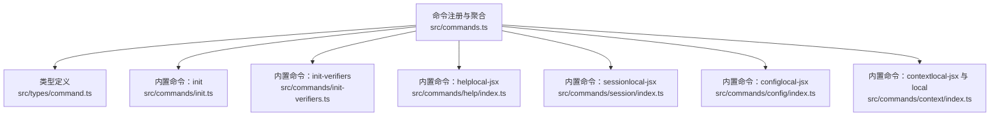
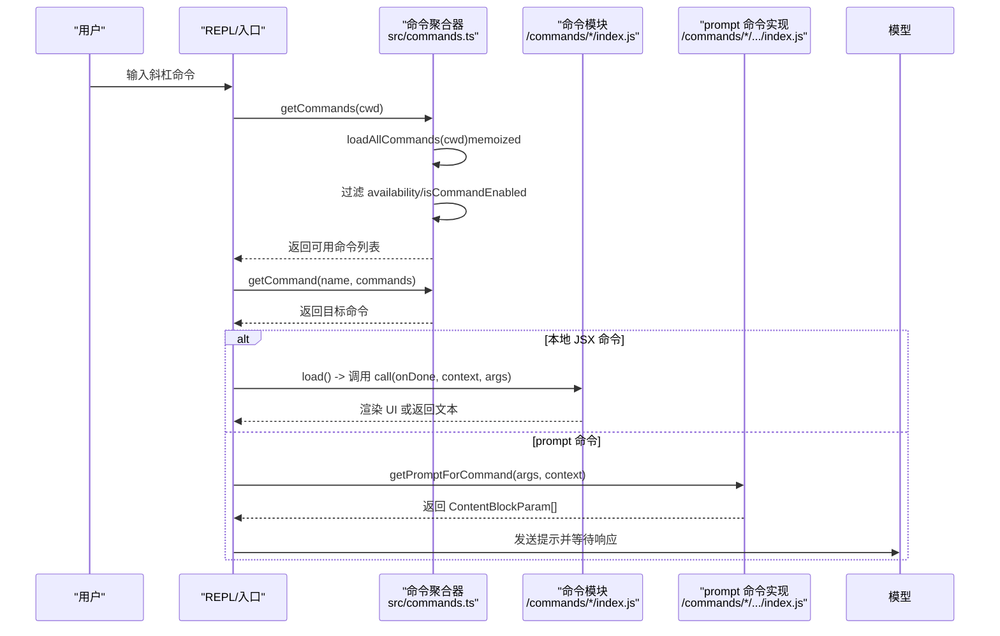
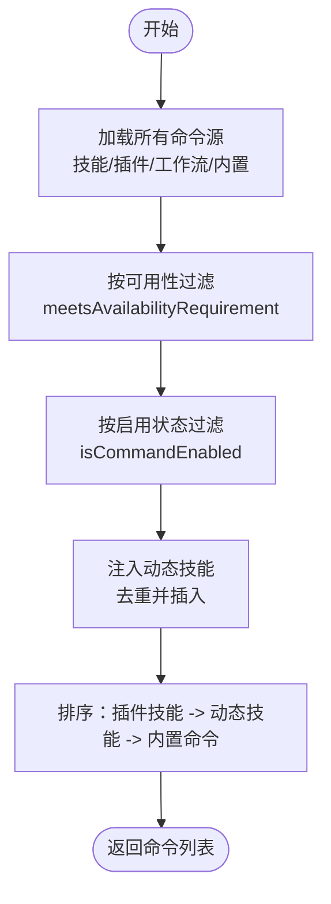
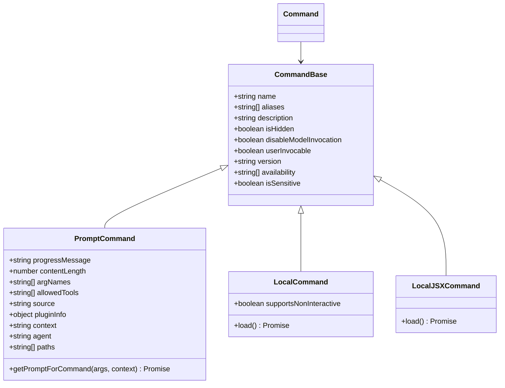
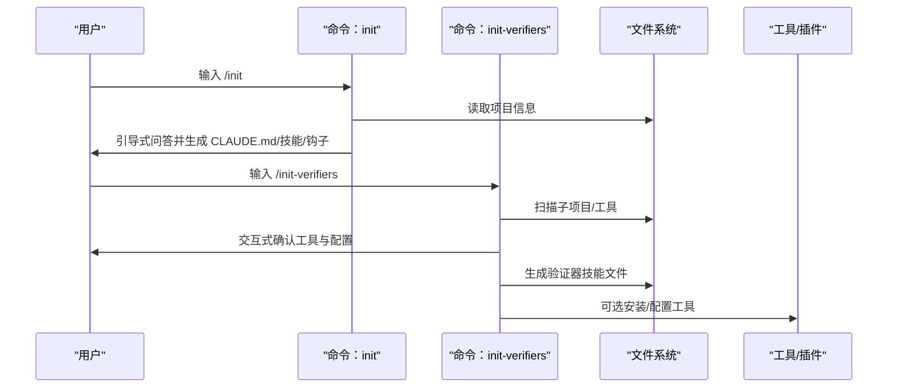
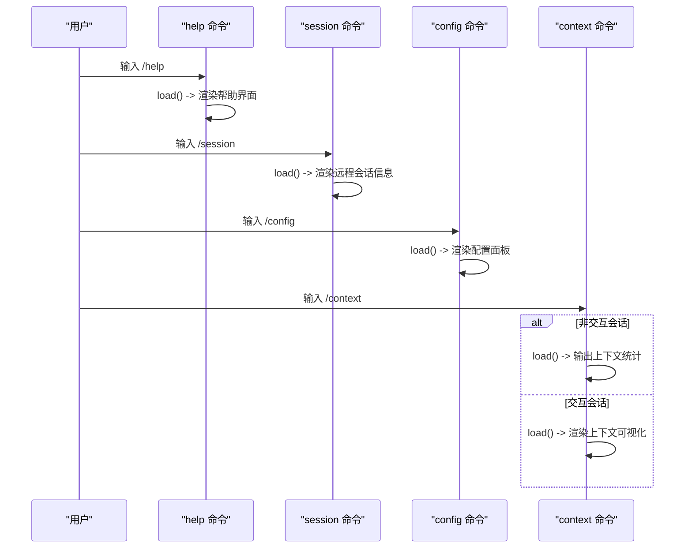
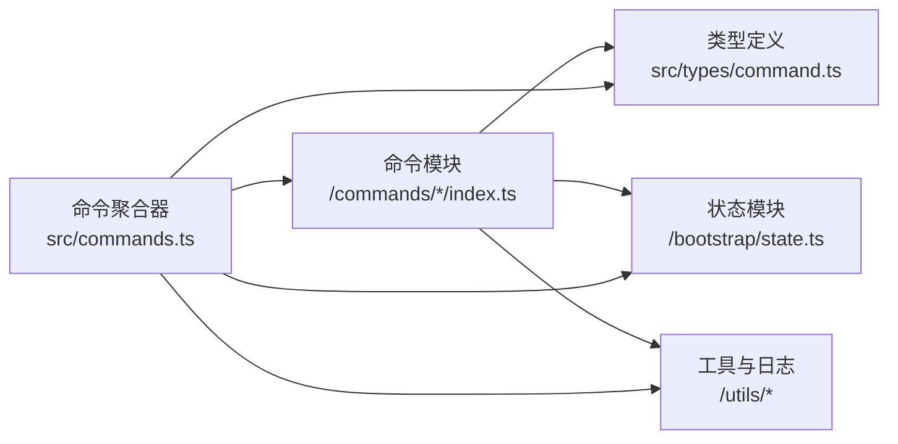

# 命令系统

<cite>
**本文引用的文件**   
- [commands.ts](file://src/commands.ts)
- [command 类型定义](file://src/types/command.ts)
- [init 命令](file://src/commands/init.ts)
- [init-verifiers 命令](file://src/commands/init-verifiers.ts)
- [help 命令（本地 JSX）](file://src/commands/help/index.ts)
- [session 命令（本地 JSX）](file://src/commands/session/index.ts)
- [config 命令（本地 JSX）](file://src/commands/config/index.ts)
- [context 命令（本地 JSX 与本地）](file://src/commands/context/index.ts)
</cite>

## 目录
1. [简介](#简介)
2. [项目结构](#项目结构)
3. [核心组件](#核心组件)
4. [架构总览](#架构总览)
5. [详细组件分析](#详细组件分析)
6. [依赖分析](#依赖分析)
7. [性能考虑](#性能考虑)
8. [故障排查指南](#故障排查指南)
9. [结论](#结论)
10. [附录](#附录)

## 简介
本文件面向 Claude Code 的斜杠命令系统，系统性阐述其设计理念、命令注册机制、参数解析与执行流程、内置命令分类与功能、扩展机制（自定义命令开发、命令验证与错误处理）、命令使用示例、命令与工具系统的集成关系、不同执行环境下的行为差异，以及性能优化与最佳实践。

## 项目结构
命令系统的核心由“命令注册与聚合”“类型定义”“内置命令实现”三部分构成：
- 命令注册与聚合：集中导出所有命令，按来源与可用性过滤，并支持动态技能注入与缓存。
- 类型定义：统一描述命令的结构、类型（prompt/local/local-jsx）、上下文与结果格式。
- 内置命令：覆盖会话管理、配置面板、上下文可视化、初始化引导、帮助等常用场景。

**图表来源**
- [commands.ts:258-346](file://src/commands.ts#L258-L346)
- [command 类型定义:16-206](file://src/types/command.ts#L16-L206)
- [init 命令:226-254](file://src/commands/init.ts#L226-L254)
- [init-verifiers 命令:3-260](file://src/commands/init-verifiers.ts#L3-L260)
- [help 命令（本地 JSX）:3-8](file://src/commands/help/index.ts#L3-L8)
- [session 命令（本地 JSX）:4-13](file://src/commands/session/index.ts#L4-L13)
- [config 命令（本地 JSX）:3-8](file://src/commands/config/index.ts#L3-L8)
- [context 命令（本地 JSX 与本地）:4-24](file://src/commands/context/index.ts#L4-L24)

**章节来源**
- [commands.ts:258-346](file://src/commands.ts#L258-L346)
- [command 类型定义:16-206](file://src/types/command.ts#L16-L206)

## 核心组件
- 命令注册与聚合
  - 统一从各子目录导入命令模块，按条件特性进行动态导入，构建命令数组并进行去重与排序。
  - 提供能力过滤（按认证/提供商要求）、启用状态检查、动态技能注入、远程/桥接安全命令集合。
- 类型系统
  - 定义 CommandBase/PromptCommand/LocalCommand/LocalJSXCommand 的结构与字段，统一命令元数据、来源、可见性、别名、版本、是否可被模型调用等。
  - 定义本地命令返回值 LocalCommandResult 与 JSX 命令回调 LocalJSXCommandOnDone 的显示策略。
- 内置命令
  - init：引导式生成 CLAUDE.md、个人偏好文件、技能与钩子。
  - init-verifiers：自动检测项目类型并生成前端/CLI/API 验证器技能。
  - help/session/config/context：本地交互命令，分别负责帮助展示、远程会话信息、配置面板、上下文可视化。

**章节来源**
- [commands.ts:258-517](file://src/commands.ts#L258-L517)
- [command 类型定义:16-216](file://src/types/command.ts#L16-L216)
- [init 命令:226-254](file://src/commands/init.ts#L226-L254)
- [init-verifiers 命令:3-260](file://src/commands/init-verifiers.ts#L3-L260)
- [help 命令（本地 JSX）:3-8](file://src/commands/help/index.ts#L3-L8)
- [session 命令（本地 JSX）:4-13](file://src/commands/session/index.ts#L4-L13)
- [config 命令（本地 JSX）:3-8](file://src/commands/config/index.ts#L3-L8)
- [context 命令（本地 JSX 与本地）:4-24](file://src/commands/context/index.ts#L4-L24)

## 架构总览
命令系统采用“声明式 + 动态加载 + 缓存”的架构：
- 声明式：每个命令模块导出一个 Command 对象，包含名称、描述、类型、来源、可用性、别名、是否启用等元信息。
- 动态加载：本地 JSX 命令通过 load() 按需懒加载，降低启动开销；prompt 命令通过 getPromptForCommand 动态生成提示内容。
- 缓存：对昂贵操作（加载技能、插件、工作流、命令列表）进行 memoize，避免重复 IO 与动态导入。

**图表来源**
- [commands.ts:476-517](file://src/commands.ts#L476-L517)
- [command 类型定义:53-56](file://src/types/command.ts#L53-L56)
- [help 命令（本地 JSX）:3-8](file://src/commands/help/index.ts#L3-L8)
- [session 命令（本地 JSX）:4-13](file://src/commands/session/index.ts#L4-L13)
- [config 命令（本地 JSX）:3-8](file://src/commands/config/index.ts#L3-L8)
- [context 命令（本地 JSX 与本地）:4-24](file://src/commands/context/index.ts#L4-L24)

## 详细组件分析

### 命令注册与聚合（commands.ts）
- 命令来源与合并
  - 同步导入内置命令，条件导入特性命令，异步加载技能、插件、工作流命令，最终合并为统一命令数组。
  - 对外部构建剔除内部命令，按用户类型与环境变量过滤。
- 可用性与启用
  - meetsAvailabilityRequirement：根据订阅/提供商环境（claude.ai/console）决定命令是否可见。
  - isCommandEnabled：基于命令自身 isEnabled 回调或默认启用。
- 动态技能注入
  - 在基础命令之外插入动态技能，按名称去重，保持插件技能在内置命令之前、内置命令在最前的顺序。
- 缓存与失效
  - loadAllCommands、getSkillToolCommands、getSlashCommandToolSkills 使用 memoize 缓存；提供 clearCommandMemoizationCaches 与 clearCommandsCache 用于失效。
- 远程/桥接安全命令
  - REMOTE_SAFE_COMMANDS：仅限远程模式使用的本地命令集合。
  - BRIDGE_SAFE_COMMANDS：通过远程桥接收输入时允许执行的本地命令集合。
  - isBridgeSafeCommand：综合判断命令类型与白名单，阻止 local-jsx 与未显式允许的 local 命令。

**图表来源**
- [commands.ts:449-517](file://src/commands.ts#L449-L517)

**章节来源**
- [commands.ts:224-254](file://src/commands.ts#L224-L254)
- [commands.ts:417-443](file://src/commands.ts#L417-L443)
- [commands.ts:449-517](file://src/commands.ts#L449-L517)
- [commands.ts:619-686](file://src/commands.ts#L619-L686)
- [commands.ts:688-719](file://src/commands.ts#L688-L719)

### 类型系统（command.ts）
- 命令类型
  - PromptCommand：面向模型的提示型命令，包含进度消息、内容长度、来源、插件信息、上下文/代理设置、路径匹配、工具限制等。
  - LocalCommand：本地命令，支持非交互执行，通过 load() 懒加载实现。
  - LocalJSXCommand：本地 JSX 命令，通过 load() 懒加载渲染组件。
- 上下文与结果
  - LocalJSXCommandOnDone：命令完成后的回调，支持显示策略（跳过/系统/用户）、是否继续向模型提问、附加元消息、后续输入等。
  - LocalCommandResult：本地命令返回值，支持纯文本、紧凑化结果、跳过消息。
- 元信息与可用性
  - CommandBase：名称、别名、描述、来源、版本、是否隐藏、是否禁用模型调用、是否用户可触发、是否敏感参数等。
  - CommandAvailability：按 claude.ai 订阅者或 console 直连用户划分可用性。

**图表来源**
- [command 类型定义:16-206](file://src/types/command.ts#L16-L206)

**章节来源**
- [command 类型定义:16-216](file://src/types/command.ts#L16-L216)

### 内置命令：init 与 init-verifiers
- init
  - 角色：引导式生成 CLAUDE.md、个人偏好文件、技能与钩子，支持新旧两种流程。
  - 行为：根据特性开关与用户类型动态选择提示模板；标记项目引导完成状态。
  - 输出：生成项目级与个人级 CLAUDE.md，建议技能与钩子清单，必要时安装工具（如 GitHub CLI、Playwright）。
- init-verifiers
  - 角色：为多子项目/多区域自动检测并生成前端/CLI/API 验证器技能。
  - 行为：扫描项目结构，识别应用类型与现有工具，交互式确认工具与配置，生成对应技能文件。
  - 工具集：Playwright、Chrome DevTools MCP、Claude Chrome 扩展、Tmux、HTTP 工具等。

**图表来源**
- [init 命令:226-254](file://src/commands/init.ts#L226-L254)
- [init-verifiers 命令:3-260](file://src/commands/init-verifiers.ts#L3-L260)

**章节来源**
- [init 命令:226-254](file://src/commands/init.ts#L226-L254)
- [init-verifiers 命令:3-260](file://src/commands/init-verifiers.ts#L3-L260)

### 内置命令：help、session、config、context
- help（本地 JSX）
  - 类型：local-jsx，通过 load() 懒加载帮助界面组件。
  - 作用：展示可用命令列表与帮助信息。
- session（本地 JSX）
  - 类型：local-jsx，仅在远程模式启用且不隐藏。
  - 作用：展示远程会话 URL 与二维码，便于移动端/网页端接入。
- config（本地 JSX）
  - 类型：local-jsx，通过 load() 懒加载配置面板组件。
  - 作用：打开配置面板，统一管理设置项。
- context（本地 JSX 与本地）
  - 两份实现：
    - 交互式可视化：在图形界面中以彩色网格展示上下文占用情况。
    - 非交互式输出：在非交互会话中输出当前上下文使用统计。
  - 可见性：交互式在非非交互会话启用；非交互式在非交互会话启用。

**图表来源**
- [help 命令（本地 JSX）:3-8](file://src/commands/help/index.ts#L3-L8)
- [session 命令（本地 JSX）:4-13](file://src/commands/session/index.ts#L4-L13)
- [config 命令（本地 JSX）:3-8](file://src/commands/config/index.ts#L3-L8)
- [context 命令（本地 JSX 与本地）:4-24](file://src/commands/context/index.ts#L4-L24)

**章节来源**
- [help 命令（本地 JSX）:3-8](file://src/commands/help/index.ts#L3-L8)
- [session 命令（本地 JSX）:4-13](file://src/commands/session/index.ts#L4-L13)
- [config 命令（本地 JSX）:3-8](file://src/commands/config/index.ts#L3-L8)
- [context 命令（本地 JSX 与本地）:4-24](file://src/commands/context/index.ts#L4-L24)

## 依赖分析
- 命令到类型的依赖
  - 所有命令模块均遵循 CommandBase/PromptCommand/LocalCommand/LocalJSXCommand 的结构，确保统一的元数据与执行接口。
- 命令到运行时的依赖
  - 命令聚合器依赖状态模块（如远程模式、非交互会话）来决定命令可见性与启用状态。
  - prompt 命令依赖工具上下文与模型调用接口，本地命令依赖 UI 上下文与消息更新回调。
- 外部特性与环境
  - 通过 Bun 特性开关与环境变量控制命令的可用性与行为（如 init 新旧流程、远程/桥接安全命令集合）。

**图表来源**
- [commands.ts:258-346](file://src/commands.ts#L258-L346)
- [command 类型定义:16-216](file://src/types/command.ts#L16-L216)
- [session 命令（本地 JSX）:1-1](file://src/commands/session/index.ts#L1-L1)
- [context 命令（本地 JSX 与本地）:1-1](file://src/commands/context/index.ts#L1-L1)

**章节来源**
- [commands.ts:258-346](file://src/commands.ts#L258-L346)
- [command 类型定义:16-216](file://src/types/command.ts#L16-L216)
- [session 命令（本地 JSX）:1-1](file://src/commands/session/index.ts#L1-L1)
- [context 命令（本地 JSX 与本地）:1-1](file://src/commands/context/index.ts#L1-L1)

## 性能考虑
- 懒加载与按需渲染
  - 本地 JSX 命令通过 load() 懒加载，减少初始包体与启动时间。
- 缓存策略
  - 对命令加载、技能与插件加载、技能索引等进行 memoize，避免重复 IO 与动态导入。
  - 提供 clearCommandMemoizationCaches 与 clearCommandsCache 以在动态技能变更后主动失效缓存。
- 远程/桥接优化
  - 通过 REMOTE_SAFE_COMMANDS 与 BRIDGE_SAFE_COMMANDS 白名单预过滤，减少 UI 渲染与输入处理负担。
- 参数解析与提示生成
  - prompt 命令的 getPromptForCommand 仅在命中时生成，避免不必要的提示构造。

**章节来源**
- [commands.ts:449-469](file://src/commands.ts#L449-L469)
- [commands.ts:523-539](file://src/commands.ts#L523-L539)
- [commands.ts:619-686](file://src/commands.ts#L619-L686)
- [command 类型定义:53-56](file://src/types/command.ts#L53-L56)

## 故障排查指南
- 命令未出现或不可用
  - 检查 availability 与 isEnabled：确认用户类型与特性开关满足要求。
  - 检查 isHidden：某些命令在特定模式下默认隐藏。
- 命令执行异常
  - 对于本地 JSX 命令：确认 load() 是否成功导入；检查 onDone 回调的显示策略与后续输入。
  - 对于 prompt 命令：确认 getPromptForCommand 是否返回合法的 ContentBlockParam[]。
- 动态技能未生效
  - 调用 clearCommandMemoizationCaches 或 clearCommandsCache 使缓存失效，重新加载命令列表。
- 远程/桥接不可用
  - 确认命令是否在 BRIDGE_SAFE_COMMANDS 或 REMOTE_SAFE_COMMANDS 中；local-jsx 命令默认不允许通过桥执行。

**章节来源**
- [commands.ts:417-443](file://src/commands.ts#L417-L443)
- [commands.ts:672-676](file://src/commands.ts#L672-L676)
- [commands.ts:523-539](file://src/commands.ts#L523-L539)
- [command 类型定义:117-126](file://src/types/command.ts#L117-L126)

## 结论
命令系统通过声明式定义、动态加载与缓存机制，实现了高扩展性与高性能的斜杠命令体验。内置命令覆盖了引导、配置、上下文与远程接入等关键场景；通过特性开关与可用性过滤，适配多类用户与执行环境。开发者可通过实现 Command 接口扩展命令，结合工具系统与插件生态，构建强大的自动化工作流。

## 附录
- 命令使用示例（概念性说明）
  - 基本用法：输入 /help 查看可用命令；输入 /init 引导生成 CLAUDE.md 与技能；输入 /config 打开配置面板。
  - 高级配置：在 /init 流程中选择生成技能与钩子；在 /init-verifiers 中为多区域生成验证器技能；通过 /session 获取远程会话二维码。
- 命令与工具系统的集成
  - prompt 命令通过 getPromptForCommand 与工具上下文协作；本地命令通过 LocalJSXCommandOnDone 与消息系统集成；动态技能与插件命令共同构成可被模型调用的技能库。
- 不同执行环境的行为差异
  - 远程模式：仅显示 REMOTE_SAFE_COMMANDS；非交互会话：context 切换为非交互输出；桥接输入：通过 isBridgeSafeCommand 白名单控制。