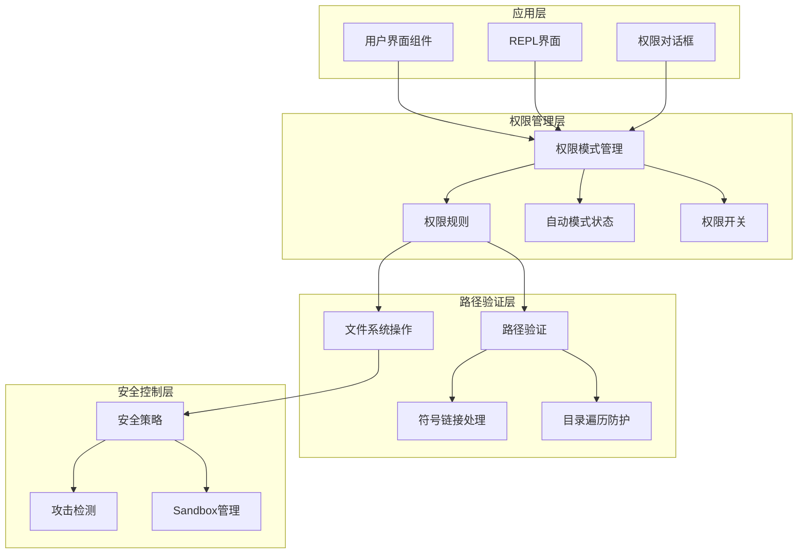
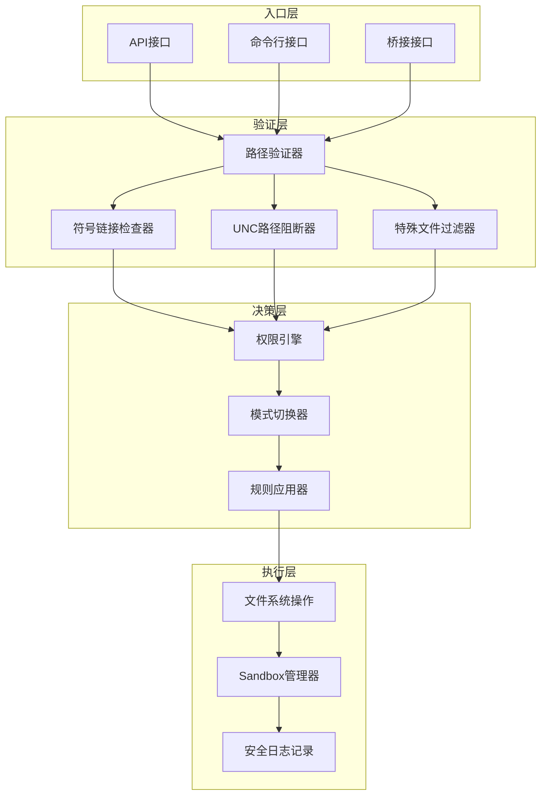
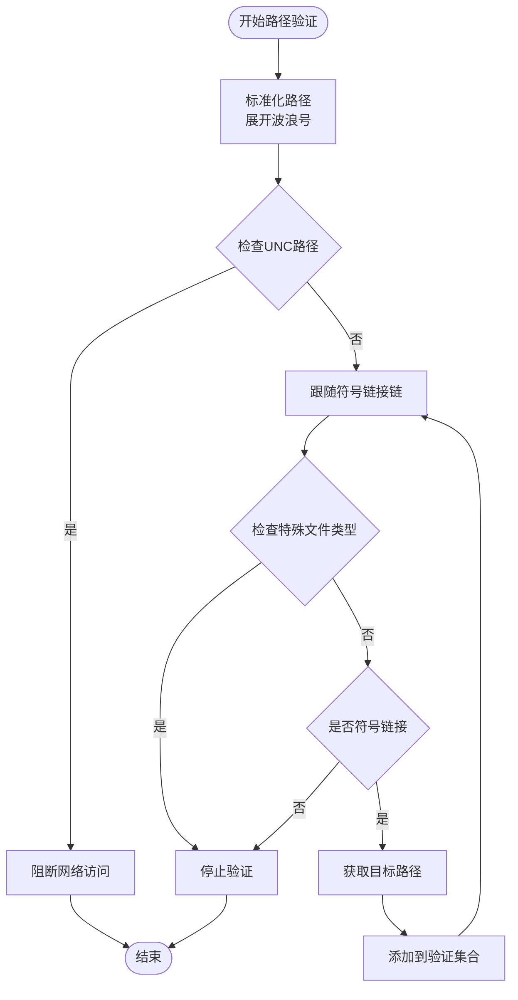
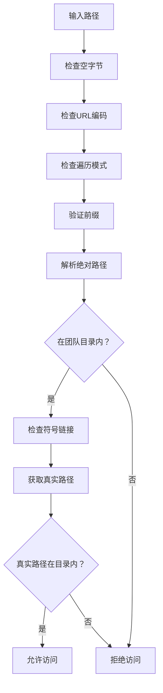
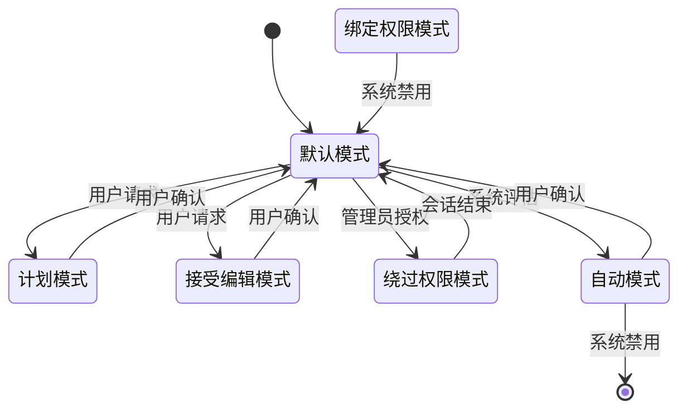
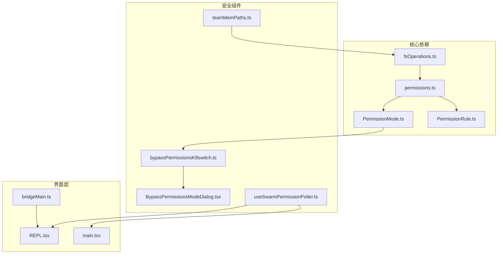

# 安全路径控制系统

<cite>
**本文档引用的文件**
- [fsOperations.ts](file://src/utils/fsOperations.ts)
- [permissions.ts](file://src/types/permissions.ts)
- [PermissionMode.ts](file://src/utils/permissions/PermissionMode.ts)
- [PermissionRule.ts](file://src/utils/permissions/PermissionRule.ts)
- [autoModeState.ts](file://src/utils/permissions/autoModeState.ts)
- [bypassPermissionsKillswitch.ts](file://src/utils/permissions/bypassPermissionsKillswitch.ts)
- [BypassPermissionsModeDialog.tsx](file://src/components/BypassPermissionsModeDialog.tsx)
- [useSwarmPermissionPoller.ts](file://src/hooks/useSwarmPermissionPoller.ts)
- [teamMemPaths.ts](file://src/memdir/teamMemPaths.ts)
- [path.ts](file://src/utils/path.ts)
- [imagePaste.ts](file://src/utils/imagePaste.ts)
- [REPL.tsx](file://src/screens/REPL.tsx)
- [main.tsx](file://src/main.tsx)
- [setup.ts](file://src/setup.ts)
- [bridgeMain.ts](file://src/bridge/bridgeMain.ts)
- [sanitization.ts](file://src/utils/sanitization.ts)
</cite>

## 目录
1. [简介](#简介)
2. [项目结构](#项目结构)
3. [核心组件](#核心组件)
4. [架构概览](#架构概览)
5. [详细组件分析](#详细组件分析)
6. [依赖关系分析](#依赖关系分析)
7. [性能考量](#性能考量)
8. [故障排除指南](#故障排除指南)
9. [结论](#结论)
10. [附录](#附录)

## 简介
本文件为安全路径控制系统的技术文档，深入解释路径验证机制的实现原理，包括路径解析、安全检查和白名单过滤。详细说明文件系统权限控制，包括读写权限验证、目录遍历防护和符号链接处理。阐述权限绕过机制的安全考虑，包括紧急权限提升、管理员模式和安全边界。解释权限模式切换的实现，包括自动模式、交互模式和严格模式的转换逻辑。提供安全路径控制的最佳实践和配置指南。包含安全漏洞防护和攻击检测机制。讨论安全控制与工具执行、系统调用的集成方式。

## 项目结构
安全路径控制系统由多个层次组成，从底层文件系统操作到上层权限决策，再到用户界面交互：

**图表来源**
- [permissions.ts:16-38](file://src/types/permissions.ts#L16-L38)
- [fsOperations.ts:1-123](file://src/utils/fsOperations.ts#L1-L123)
- [teamMemPaths.ts:1-258](file://src/memdir/teamMemPaths.ts#L1-L258)

**章节来源**
- [permissions.ts:1-442](file://src/types/permissions.ts#L1-L442)
- [fsOperations.ts:1-771](file://src/utils/fsOperations.ts#L1-L771)

## 核心组件
安全路径控制系统的核心组件包括：

### 权限模式管理
系统支持多种权限模式，包括默认模式、计划模式、接受编辑模式、绕过权限模式和禁止询问模式。每种模式都有特定的安全级别和行为特征。

### 路径验证引擎
提供全面的路径验证功能，包括符号链接链跟踪、UNC路径阻断和特殊文件类型过滤。

### 符号链接处理
实现深度符号链接解析，确保所有中间目标都被正确识别和验证。

### 目录遍历防护
通过路径规范化和前缀匹配来防止目录遍历攻击。

**章节来源**
- [PermissionMode.ts:44-91](file://src/utils/permissions/PermissionMode.ts#L44-L91)
- [fsOperations.ts:288-382](file://src/utils/fsOperations.ts#L288-L382)
- [teamMemPaths.ts:22-206](file://src/memdir/teamMemPaths.ts#L22-L206)

## 架构概览
安全路径控制系统的整体架构采用分层设计，确保每个组件职责明确且相互独立：

**图表来源**
- [fsOperations.ts:288-382](file://src/utils/fsOperations.ts#L288-L382)
- [useSwarmPermissionPoller.ts:82-116](file://src/hooks/useSwarmPermissionPoller.ts#L82-L116)
- [REPL.tsx:2313-2344](file://src/screens/REPL.tsx#L2313-L2344)

## 详细组件分析

### 路径验证机制
路径验证机制是安全系统的核心，提供了多层次的保护措施：

#### 符号链接链跟踪
系统会跟踪完整的符号链接链，确保所有中间目标都被验证：

**图表来源**
- [fsOperations.ts:313-382](file://src/utils/fsOperations.ts#L313-L382)

#### 目录遍历防护
系统使用多种技术防止目录遍历攻击：

**图表来源**
- [teamMemPaths.ts:22-256](file://src/memdir/teamMemPaths.ts#L22-L256)

**章节来源**
- [fsOperations.ts:288-382](file://src/utils/fsOperations.ts#L288-L382)
- [teamMemPaths.ts:1-258](file://src/memdir/teamMemPaths.ts#L1-L258)

### 文件系统权限控制
文件系统权限控制通过以下机制实现：

#### 读写权限验证
系统在执行任何文件操作前都会进行权限验证，确保操作符合当前权限模式和规则设置。

#### 目录遍历防护
使用路径规范化技术防止通过`../`等模式访问父目录。

#### 符号链接处理
深度解析符号链接链，确保不会通过符号链接访问受限区域。

**章节来源**
- [fsOperations.ts:138-178](file://src/utils/fsOperations.ts#L138-L178)
- [path.ts:109-135](file://src/utils/path.ts#L109-L135)

### 权限绕过机制
系统提供了受控的权限绕过机制：

#### 绕过权限模式
在沙箱容器中提供绕过权限检查的能力，但仅限于受信任环境。

#### 紧急权限提升
通过专门的开关和对话框实现紧急情况下的权限提升。

#### 安全边界
绕过权限模式只能在特定条件下启用，并有严格的使用限制。

**章节来源**
- [BypassPermissionsModeDialog.tsx:12-86](file://src/components/BypassPermissionsModeDialog.tsx#L12-L86)
- [bypassPermissionsKillswitch.ts:19-47](file://src/utils/permissions/bypassPermissionsKillswitch.ts#L19-L47)
- [setup.ts:416-443](file://src/setup.ts#L416-L443)

### 权限模式切换
权限模式切换机制确保系统能够在不同安全级别间安全转换：

**图表来源**
- [PermissionMode.ts:44-91](file://src/utils/permissions/PermissionMode.ts#L44-L91)
- [useSwarmPermissionPoller.ts:427-449](file://src/hooks/useSwarmPermissionPoller.ts#L427-L449)

**章节来源**
- [PermissionMode.ts:1-142](file://src/utils/permissions/PermissionMode.ts#L1-L142)
- [useSwarmPermissionPoller.ts:425-449](file://src/hooks/useSwarmPermissionPoller.ts#L425-L449)

### 安全路径控制最佳实践
基于代码分析，以下是安全路径控制的最佳实践：

#### 路径处理
1. 始终使用绝对路径进行验证
2. 在验证前展开波浪号和相对路径
3. 阻断UNC网络路径以防止网络访问

#### 符号链接处理
1. 深度解析符号链接链
2. 追踪所有中间目标路径
3. 设置最大递归深度防止循环

#### 目录遍历防护
1. 使用路径规范化消除`..`段
2. 实施前缀攻击防护
3. 验证真实路径而非仅验证逻辑路径

**章节来源**
- [fsOperations.ts:288-382](file://src/utils/fsOperations.ts#L288-L382)
- [teamMemPaths.ts:228-256](file://src/memdir/teamMemPaths.ts#L228-L256)

## 依赖关系分析

**图表来源**
- [fsOperations.ts:1-123](file://src/utils/fsOperations.ts#L1-L123)
- [permissions.ts:1-442](file://src/types/permissions.ts#L1-L442)
- [teamMemPaths.ts:1-258](file://src/memdir/teamMemPaths.ts#L1-L258)

**章节来源**
- [fsOperations.ts:1-771](file://src/utils/fsOperations.ts#L1-L771)
- [permissions.ts:1-442](file://src/types/permissions.ts#L1-L442)

## 性能考量
安全路径控制系统在保证安全性的同时，也考虑了性能影响：

### 缓存策略
- 文件系统操作使用慢操作日志记录，避免频繁I/O
- 路径解析结果可以缓存以减少重复计算

### 异步处理
- 权限检查采用异步模式，避免阻塞主线程
- 支持并行处理多个权限请求

### 内存优化
- 使用生成器处理大文件，避免内存溢出
- 及时清理临时数据和缓存

## 故障排除指南

### 常见问题诊断
1. **权限拒绝错误**：检查权限模式设置和规则配置
2. **路径解析失败**：验证路径格式和符号链接状态
3. **Sandbox禁用**：检查系统环境和配置设置

### 调试方法
- 启用详细日志记录
- 使用测试模式验证路径处理
- 检查系统权限和文件系统状态

**章节来源**
- [useSwarmPermissionPoller.ts:82-116](file://src/hooks/useSwarmPermissionPoller.ts#L82-L116)
- [REPL.tsx:2313-2344](file://src/screens/REPL.tsx#L2313-L2344)

## 结论
安全路径控制系统通过多层次的验证机制和严格的权限控制，为文件系统操作提供了全面的安全保障。系统的设计充分考虑了性能、可用性和安全性之间的平衡，既能够有效防止各种攻击，又不会对用户体验造成过大影响。通过合理的配置和使用，该系统能够适应各种复杂的使用场景，为用户提供安全可靠的文件操作环境。

## 附录

### 配置选项
- 权限模式：默认、计划、接受编辑、绕过权限、禁止询问
- 自动模式：基于AI的智能权限决策
- 绕过权限模式：仅限受信任环境使用

### 安全建议
1. 在生产环境中始终使用默认或更严格的权限模式
2. 定期审查和更新权限规则
3. 监控异常的权限使用模式
4. 及时更新安全补丁和配置