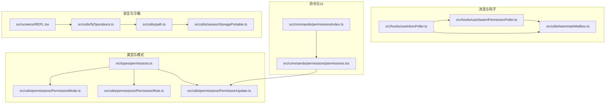
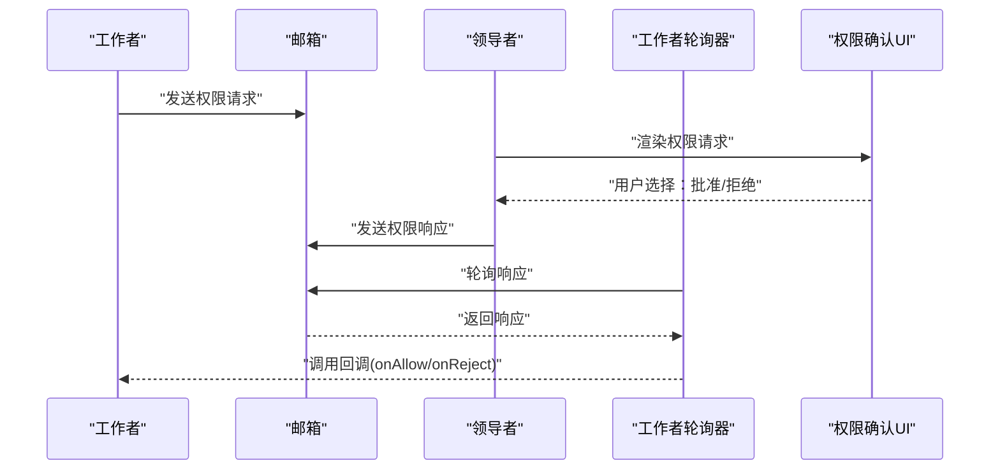
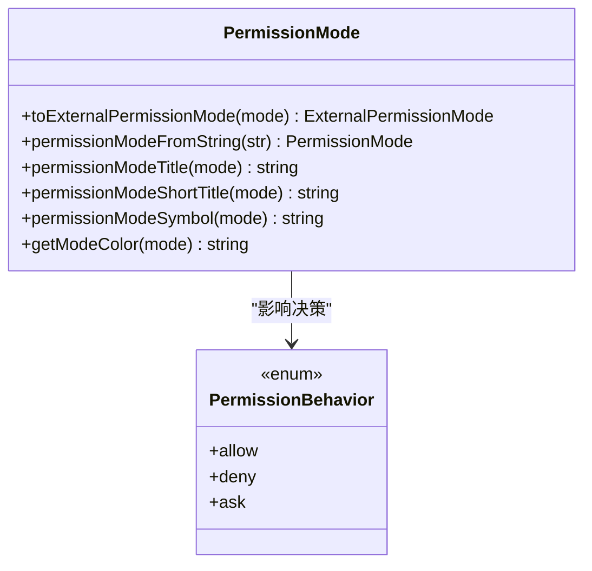
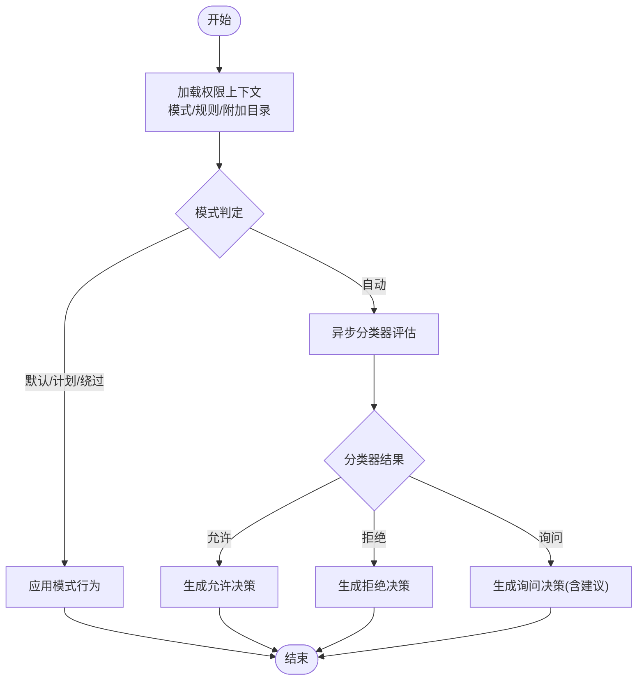
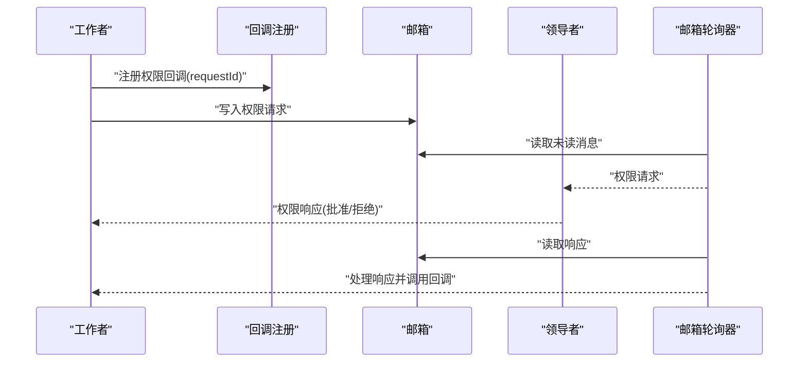
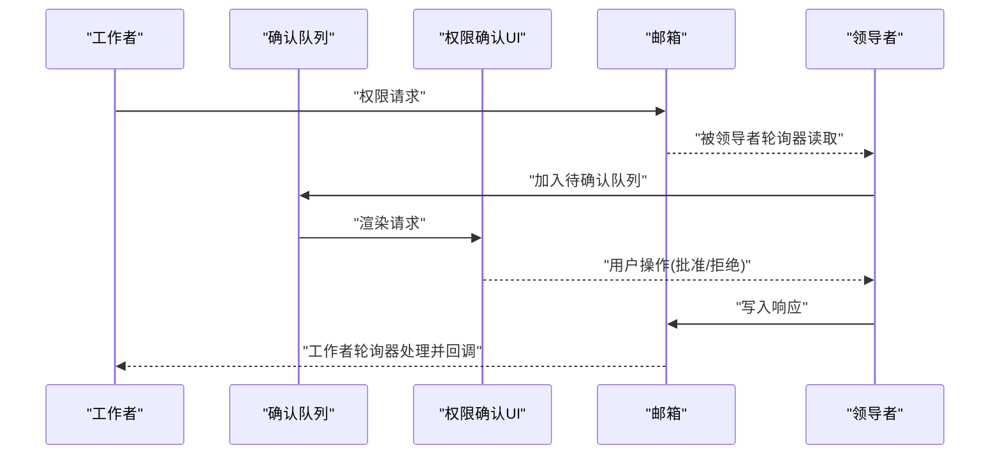
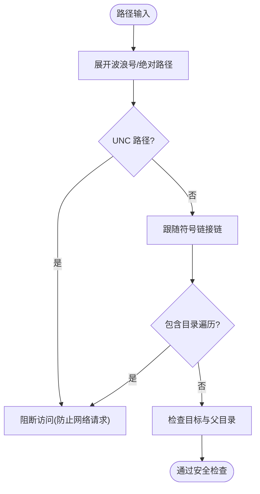
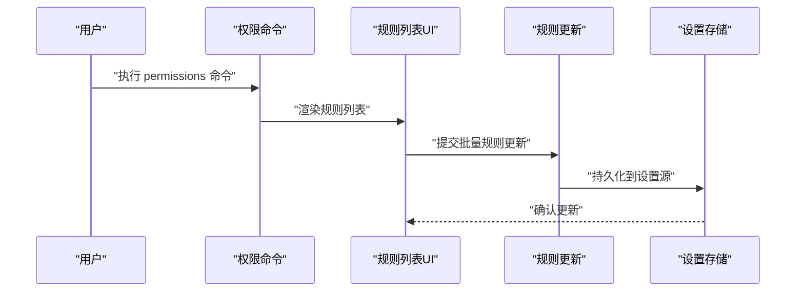
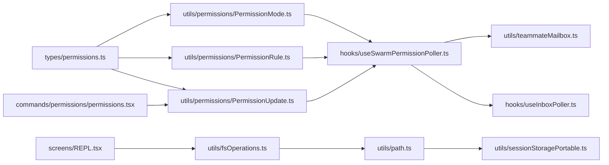

# 权限控制系统

<cite>
**本文档引用的文件**
- [permissions.ts](file://src/types/permissions.ts)
- [PermissionMode.ts](file://src/utils/permissions/PermissionMode.ts)
- [PermissionRule.ts](file://src/utils/permissions/PermissionRule.ts)
- [PermissionUpdate.ts](file://src/utils/permissions/PermissionUpdate.ts)
- [useSwarmPermissionPoller.ts](file://src/hooks/useSwarmPermissionPoller.ts)
- [useInboxPoller.ts](file://src/hooks/useInboxPoller.ts)
- [teammateMailbox.ts](file://src/utils/teammateMailbox.ts)
- [permissions.tsx](file://src/commands/permissions/permissions.tsx)
- [index.ts](file://src/commands/permissions/index.ts)
- [fsOperations.ts](file://src/utils/fsOperations.ts)
- [path.ts](file://src/utils/path.ts)
- [sessionStoragePortable.ts](file://src/utils/sessionStoragePortable.ts)
- [REPL.tsx](file://src/screens/REPL.tsx)
</cite>

## 目录
1. [简介](#简介)
2. [项目结构](#项目结构)
3. [核心组件](#核心组件)
4. [架构总览](#架构总览)
5. [详细组件分析](#详细组件分析)
6. [依赖关系分析](#依赖关系分析)
7. [性能考量](#性能考量)
8. [故障排查指南](#故障排查指南)
9. [结论](#结论)
10. [附录](#附录)

## 简介
本文件面向 Claude Code 的权限控制系统，系统性阐述权限检查机制、规则引擎设计、决策流程、缓存策略、用户交互流程（权限请求、审批与历史）、安全路径限制（路径验证、沙箱隔离、权限提升控制）、权限配置管理（规则编辑、批量操作、审计日志）、扩展机制与自定义规则开发，以及与工具系统、任务系统的集成关系。

## 项目结构
权限控制涉及类型定义、规则与模式、消息传递、UI 组件与命令入口、沙箱与路径安全等模块。下图展示关键文件之间的关系：

**图表来源**
- [permissions.ts:1-442](file://src/types/permissions.ts#L1-L442)
- [PermissionMode.ts:1-142](file://src/utils/permissions/PermissionMode.ts#L1-L142)
- [PermissionRule.ts:1-41](file://src/utils/permissions/PermissionRule.ts#L1-L41)
- [PermissionUpdate.ts:1-390](file://src/utils/permissions/PermissionUpdate.ts#L1-L390)
- [useSwarmPermissionPoller.ts:1-331](file://src/hooks/useSwarmPermissionPoller.ts#L1-L331)
- [useInboxPoller.ts:1-970](file://src/hooks/useInboxPoller.ts#L1-L970)
- [teammateMailbox.ts:613-664](file://src/utils/teammateMailbox.ts#L613-L664)
- [permissions.tsx:1-9](file://src/commands/permissions/permissions.tsx#L1-L9)
- [index.ts:1-12](file://src/commands/permissions/index.ts#L1-L12)
- [fsOperations.ts:283-317](file://src/utils/fsOperations.ts#L283-L317)
- [path.ts:104-142](file://src/utils/path.ts#L104-L142)
- [sessionStoragePortable.ts:276-316](file://src/utils/sessionStoragePortable.ts#L276-L316)
- [REPL.tsx:2313-2344](file://src/screens/REPL.tsx#L2313-L2344)

**章节来源**
- [permissions.ts:1-442](file://src/types/permissions.ts#L1-L442)
- [useSwarmPermissionPoller.ts:1-331](file://src/hooks/useSwarmPermissionPoller.ts#L1-L331)
- [useInboxPoller.ts:1-970](file://src/hooks/useInboxPoller.ts#L1-L970)
- [teammateMailbox.ts:613-664](file://src/utils/teammateMailbox.ts#L613-L664)
- [permissions.tsx:1-9](file://src/commands/permissions/permissions.tsx#L1-L9)
- [index.ts:1-12](file://src/commands/permissions/index.ts#L1-L12)
- [fsOperations.ts:283-317](file://src/utils/fsOperations.ts#L283-L317)
- [path.ts:104-142](file://src/utils/path.ts#L104-L142)
- [sessionStoragePortable.ts:276-316](file://src/utils/sessionStoragePortable.ts#L276-L316)
- [REPL.tsx:2313-2344](file://src/screens/REPL.tsx#L2313-L2344)

## 核心组件
- 权限模式与行为：定义外部可感知的模式集合、内部模式扩展、权限行为（允许/拒绝/询问）。
- 规则引擎：规则值、规则来源、规则更新操作、工作目录附加范围。
- 决策结果：允许、询问、拒绝、透传等结果类型及决策原因。
- 消息与回调：跨进程/团队成员的消息传递、权限响应回调注册与轮询。
- 命令与UI：权限规则列表命令入口、规则编辑界面。
- 路径与沙箱：路径解析与安全检查、沙箱可用性检测与初始化。

**章节来源**
- [permissions.ts:14-324](file://src/types/permissions.ts#L14-L324)
- [PermissionMode.ts:21-142](file://src/utils/permissions/PermissionMode.ts#L21-L142)
- [PermissionRule.ts:25-41](file://src/utils/permissions/PermissionRule.ts#L25-L41)
- [PermissionUpdate.ts:55-206](file://src/utils/permissions/PermissionUpdate.ts#L55-L206)
- [useSwarmPermissionPoller.ts:58-116](file://src/hooks/useSwarmPermissionPoller.ts#L58-L116)
- [useInboxPoller.ts:250-364](file://src/hooks/useInboxPoller.ts#L250-L364)
- [permissions.tsx:1-9](file://src/commands/permissions/permissions.tsx#L1-L9)

## 架构总览
权限系统采用“模式+规则+决策”的分层架构，并通过消息总线在团队成员间同步权限状态。核心流程包括：
- 工作者侧触发权限请求，封装为消息写入邮箱；
- 领导者侧轮询邮箱并渲染统一的权限确认UI；
- 用户批准或拒绝后，领导者将响应写回邮箱；
- 工作者侧轮询到响应后，执行回调（允许时应用规则更新与输入变更）。

**图表来源**
- [useInboxPoller.ts:250-364](file://src/hooks/useInboxPoller.ts#L250-L364)
- [useSwarmPermissionPoller.ts:268-331](file://src/hooks/useSwarmPermissionPoller.ts#L268-L331)
- [teammateMailbox.ts:613-664](file://src/utils/teammateMailbox.ts#L613-L664)

## 详细组件分析

### 权限模式与行为
- 外部模式集合包含默认、计划、接受编辑、绕过权限、不询问等；内部模式额外支持自动与气泡模式。
- 模式到外部模式映射用于对外显示与传输；提供模式标题、符号、颜色等元信息。
- 行为枚举为 allow/deny/ask，分别对应直接放行、直接拒绝、弹窗确认。

**图表来源**
- [PermissionMode.ts:111-142](file://src/utils/permissions/PermissionMode.ts#L111-L142)
- [permissions.ts:44-44](file://src/types/permissions.ts#L44-L44)

**章节来源**
- [PermissionMode.ts:21-142](file://src/utils/permissions/PermissionMode.ts#L21-L142)
- [permissions.ts:16-44](file://src/types/permissions.ts#L16-L44)

### 规则引擎与决策流程
- 规则值包含工具名与可选内容，规则来源覆盖用户设置、项目设置、本地设置、标志设置、策略设置、命令、会话等。
- 规则更新支持添加、替换、删除规则，以及设置模式、增删工作目录。
- 决策结果包含允许、询问（含建议更新、阻断路径、元数据、异步分类器检查）、拒绝、透传等，并带有决策原因类型（规则、模式、子命令结果、钩子、沙箱覆盖、分类器、工作目录、安全检查等）。

**图表来源**
- [permissions.ts:152-324](file://src/types/permissions.ts#L152-L324)
- [PermissionUpdate.ts:55-206](file://src/utils/permissions/PermissionUpdate.ts#L55-L206)

**章节来源**
- [permissions.ts:54-324](file://src/types/permissions.ts#L54-L324)
- [PermissionUpdate.ts:55-206](file://src/utils/permissions/PermissionUpdate.ts#L55-L206)

### 消息与回调机制
- 工作者侧使用轮询器注册回调，等待领导者响应；响应成功时解析权限更新并应用，失败时走拒绝路径。
- 领导者侧通过邮箱轮询器识别权限请求/响应、沙箱请求/响应、团队权限更新、模式设置请求等，分别路由到队列或直接应用。
- 消息格式包含请求ID、决策、反馈、更新输入、权限更新等字段，具备强健的校验与错误处理。

**图表来源**
- [useSwarmPermissionPoller.ts:82-156](file://src/hooks/useSwarmPermissionPoller.ts#L82-L156)
- [useInboxPoller.ts:366-397](file://src/hooks/useInboxPoller.ts#L366-L397)
- [teammateMailbox.ts:613-664](file://src/utils/teammateMailbox.ts#L613-L664)

**章节来源**
- [useSwarmPermissionPoller.ts:82-257](file://src/hooks/useSwarmPermissionPoller.ts#L82-L257)
- [useInboxPoller.ts:250-397](file://src/hooks/useInboxPoller.ts#L250-L397)
- [teammateMailbox.ts:613-664](file://src/utils/teammateMailbox.ts#L613-L664)

### 用户交互流程（请求、审批、历史）
- 请求：工作者在工具使用前发起权限请求，包含工具名、描述、输入、工具使用ID等。
- 审批：领导者侧统一渲染权限确认UI，支持允许（可附带更新输入与权限更新）、拒绝、中止。
- 历史：邮箱轮询器对各类消息进行分类处理，定期清理响应文件，保证状态一致性。

**图表来源**
- [useInboxPoller.ts:250-364](file://src/hooks/useInboxPoller.ts#L250-L364)
- [useSwarmPermissionPoller.ts:268-331](file://src/hooks/useSwarmPermissionPoller.ts#L268-L331)

**章节来源**
- [useInboxPoller.ts:250-364](file://src/hooks/useInboxPoller.ts#L250-L364)
- [useSwarmPermissionPoller.ts:268-331](file://src/hooks/useSwarmPermissionPoller.ts#L268-L331)

### 安全路径限制与沙箱隔离
- 路径验证：对输入路径进行展开、UNC 路径阻断、符号链接链跟踪、目录遍历检测等，确保只检查实际可达路径。
- 沙箱隔离：REPL 屏幕在启动时检测沙箱可用性，不可用时根据配置决定是否退出或发出警告；沙箱请求/响应通过邮箱消息传递。
- 权限提升控制：模式与规则共同决定是否允许高风险操作，必要时强制弹窗确认。

**图表来源**
- [fsOperations.ts:288-317](file://src/utils/fsOperations.ts#L288-L317)
- [path.ts:104-142](file://src/utils/path.ts#L104-L142)
- [REPL.tsx:2313-2344](file://src/screens/REPL.tsx#L2313-L2344)
- [teammateMailbox.ts:613-664](file://src/utils/teammateMailbox.ts#L613-L664)

**章节来源**
- [fsOperations.ts:288-317](file://src/utils/fsOperations.ts#L288-L317)
- [path.ts:104-142](file://src/utils/path.ts#L104-L142)
- [REPL.tsx:2313-2344](file://src/screens/REPL.tsx#L2313-L2344)
- [teammateMailbox.ts:613-664](file://src/utils/teammateMailbox.ts#L613-L664)

### 权限配置管理与审计
- 规则编辑：通过命令入口打开权限规则列表，支持查看、编辑、重试拒绝等。
- 批量操作：规则更新支持批量添加、替换、删除；工作目录支持批量增删。
- 审计日志：消息轮询器对各类消息进行日志记录与清理，便于问题定位。

**图表来源**
- [permissions.tsx:1-9](file://src/commands/permissions/permissions.tsx#L1-L9)
- [index.ts:1-12](file://src/commands/permissions/index.ts#L1-L12)
- [PermissionUpdate.ts:222-353](file://src/utils/permissions/PermissionUpdate.ts#L222-L353)

**章节来源**
- [permissions.tsx:1-9](file://src/commands/permissions/permissions.tsx#L1-L9)
- [index.ts:1-12](file://src/commands/permissions/index.ts#L1-L12)
- [PermissionUpdate.ts:222-353](file://src/utils/permissions/PermissionUpdate.ts#L222-L353)

### 扩展机制与自定义规则开发
- 规则来源：支持用户设置、项目设置、本地设置、标志设置、策略设置、命令、会话等多源聚合。
- 自定义规则：工具侧可在自身权限检查中解析 ruleContent，实现特定规则语义。
- 模式扩展：新增模式需在模式配置中注册标题、符号、颜色与外部映射。

**章节来源**
- [permissions.ts:54-146](file://src/types/permissions.ts#L54-L146)
- [PermissionMode.ts:42-91](file://src/utils/permissions/PermissionMode.ts#L42-L91)

### 与工具系统、任务系统的集成
- 工具系统：权限上下文贯穿工具执行，依据模式与规则动态生成允许/询问/拒绝决策；支持异步分类器评估与建议更新。
- 任务系统：团队任务与权限状态联动，领导者可向工作者下发权限更新与模式变更请求，工作者侧应用后继续执行。

**章节来源**
- [useInboxPoller.ts:497-597](file://src/hooks/useInboxPoller.ts#L497-L597)
- [useSwarmPermissionPoller.ts:268-331](file://src/hooks/useSwarmPermissionPoller.ts#L268-L331)

## 依赖关系分析
- 类型层：权限类型与常量集中于 types/permissions.ts，避免循环依赖。
- 实现层：模式、规则、更新分别位于 utils/permissions 下，相互协作。
- 通信层：hooks 中的轮询器与邮箱工具形成稳定的 IPC 通道。
- UI 层：命令入口与规则列表组件提供用户交互。
- 安全层：路径与沙箱工具保障系统安全边界。

**图表来源**
- [permissions.ts:1-442](file://src/types/permissions.ts#L1-L442)
- [PermissionMode.ts:1-142](file://src/utils/permissions/PermissionMode.ts#L1-L142)
- [PermissionRule.ts:1-41](file://src/utils/permissions/PermissionRule.ts#L1-L41)
- [PermissionUpdate.ts:1-390](file://src/utils/permissions/PermissionUpdate.ts#L1-L390)
- [useSwarmPermissionPoller.ts:1-331](file://src/hooks/useSwarmPermissionPoller.ts#L1-L331)
- [useInboxPoller.ts:1-970](file://src/hooks/useInboxPoller.ts#L1-L970)
- [teammateMailbox.ts:613-664](file://src/utils/teammateMailbox.ts#L613-L664)
- [permissions.tsx:1-9](file://src/commands/permissions/permissions.tsx#L1-L9)
- [fsOperations.ts:283-317](file://src/utils/fsOperations.ts#L283-L317)
- [path.ts:104-142](file://src/utils/path.ts#L104-L142)
- [sessionStoragePortable.ts:276-316](file://src/utils/sessionStoragePortable.ts#L276-L316)
- [REPL.tsx:2313-2344](file://src/screens/REPL.tsx#L2313-L2344)

**章节来源**
- [permissions.ts:1-442](file://src/types/permissions.ts#L1-L442)
- [PermissionUpdate.ts:1-390](file://src/utils/permissions/PermissionUpdate.ts#L1-L390)
- [useSwarmPermissionPoller.ts:1-331](file://src/hooks/useSwarmPermissionPoller.ts#L1-L331)
- [useInboxPoller.ts:1-970](file://src/hooks/useInboxPoller.ts#L1-L970)
- [teammateMailbox.ts:613-664](file://src/utils/teammateMailbox.ts#L613-L664)
- [permissions.tsx:1-9](file://src/commands/permissions/permissions.tsx#L1-L9)
- [fsOperations.ts:283-317](file://src/utils/fsOperations.ts#L283-L317)
- [path.ts:104-142](file://src/utils/path.ts#L104-L142)
- [sessionStoragePortable.ts:276-316](file://src/utils/sessionStoragePortable.ts#L276-L316)
- [REPL.tsx:2313-2344](file://src/screens/REPL.tsx#L2313-L2344)

## 性能考量
- 轮询频率：工作者轮询间隔为毫秒级，领导者轮询为秒级，兼顾实时性与资源消耗。
- 回调去重：邮箱轮询器对重复消息进行去重处理，避免重复排队与渲染。
- 异步分类器：允许异步运行分类器以减少阻塞，支持自动批准或进一步提示。
- 路径检查：符号链接跟踪与 UNC 路径阻断减少无效 IO 与潜在安全风险。

[本节为通用指导，无需具体文件分析]

## 故障排查指南
- 沙箱不可用：REPL 启动时检测沙箱可用性，不可用且要求强制启用时直接退出；否则发出通知并记录调试日志。
- 消息解析失败：邮箱轮询器对非法/缺失字段的消息进行过滤与告警，避免崩溃传播。
- 回调未注册：工作者轮询器对无回调的响应进行日志记录，便于定位请求丢失或超时问题。
- 路径异常：UNC 路径与目录遍历会被阻断；符号链接链过深会终止以防止死循环。

**章节来源**
- [REPL.tsx:2313-2344](file://src/screens/REPL.tsx#L2313-L2344)
- [useInboxPoller.ts:417-437](file://src/hooks/useInboxPoller.ts#L417-L437)
- [useSwarmPermissionPoller.ts:133-138](file://src/hooks/useSwarmPermissionPoller.ts#L133-L138)
- [fsOperations.ts:306-317](file://src/utils/fsOperations.ts#L306-L317)

## 结论
该权限控制系统通过清晰的模式与规则体系、稳健的消息传递与回调机制、严格的路径与沙箱安全策略，实现了在团队协作场景下的细粒度权限控制与良好用户体验。其模块化设计便于扩展与维护，同时提供了完善的审计与故障排查能力。

## 附录
- 命令入口：/permissions 命令打开规则列表，支持批量编辑与重试拒绝。
- 设置持久化：规则与模式变更可持久化至用户/项目/本地设置源。
- 模式配置：新增模式需在模式配置表中注册，确保标题、符号、颜色与外部映射一致。

**章节来源**
- [index.ts:1-12](file://src/commands/permissions/index.ts#L1-L12)
- [permissions.tsx:1-9](file://src/commands/permissions/permissions.tsx#L1-L9)
- [PermissionUpdate.ts:222-353](file://src/utils/permissions/PermissionUpdate.ts#L222-L353)
- [PermissionMode.ts:42-91](file://src/utils/permissions/PermissionMode.ts#L42-L91)