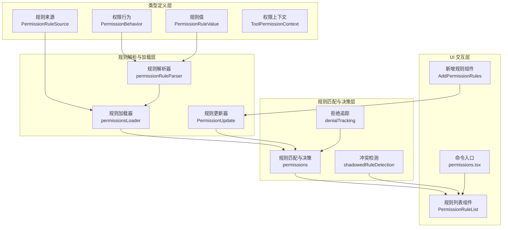
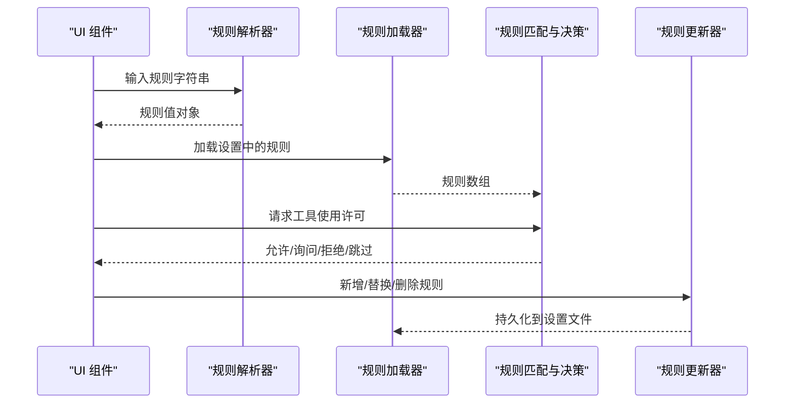
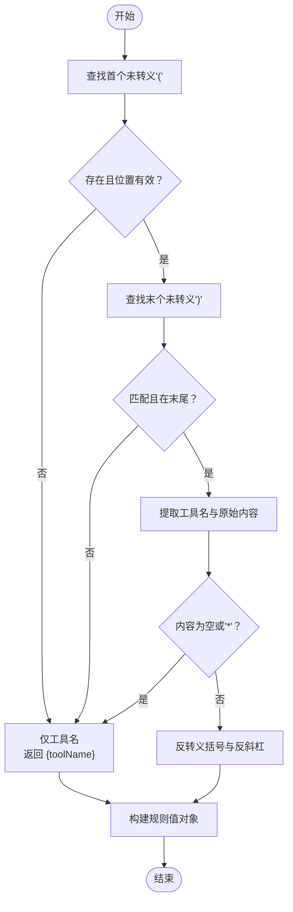
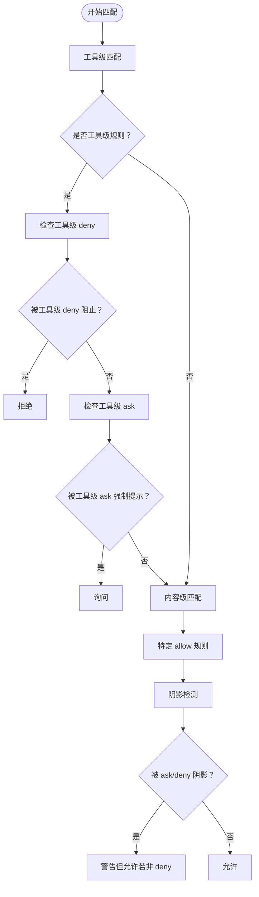
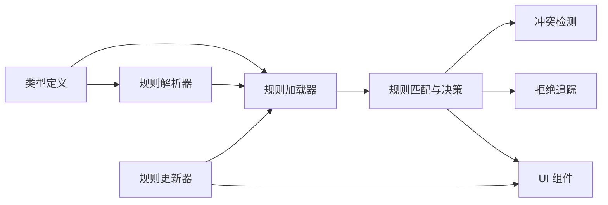

# 权限规则引擎

<cite>
**本文档引用的文件**
- [src\types\permissions.ts](file://src\types\permissions.ts)
- [src\utils\permissions\PermissionRule.ts](file://src\utils\permissions\PermissionRule.ts)
- [src\utils\permissions\permissionRuleParser.ts](file://src\utils\permissions\permissionRuleParser.ts)
- [src\utils\permissions\permissions.ts](file://src\utils\permissions\permissions.ts)
- [src\utils\permissions\PermissionUpdate.ts](file://src\utils\permissions\PermissionUpdate.ts)
- [src\utils\permissions\permissionsLoader.ts](file://src\utils\permissions\permissionsLoader.ts)
- [src\utils\permissions\shadowedRuleDetection.ts](file://src\utils\permissions\shadowedRuleDetection.ts)
- [src\utils\permissions\denialTracking.ts](file://src\utils\permissions\denialTracking.ts)
- [src\components\permissions\rules\PermissionRuleList.tsx](file://src\components\permissions\rules\PermissionRuleList.tsx)
- [src\components\permissions\rules\AddPermissionRules.tsx](file://src\components\permissions\rules\AddPermissionRules.tsx)
- [src\commands\permissions\permissions.tsx](file://src\commands\permissions\permissions.tsx)
</cite>

## 目录
1. [简介](#简介)
2. [项目结构](#项目结构)
3. [核心组件](#核心组件)
4. [架构总览](#架构总览)
5. [详细组件分析](#详细组件分析)
6. [依赖关系分析](#依赖关系分析)
7. [性能考虑](#性能考虑)
8. [故障排除指南](#故障排除指南)
9. [结论](#结论)

## 简介
本文件为权限规则引擎的详细技术文档，面向开发者与高级用户，系统性阐述规则引擎的架构设计、规则语法、匹配算法、优先级与冲突处理、数据结构、UI 集成以及性能优化策略。文档基于仓库中实际实现进行分析，并通过图表与来源标注帮助读者快速定位到具体实现。

## 项目结构
权限规则引擎由“类型定义层”、“规则解析与加载层”、“规则匹配与决策层”、“UI 交互层”四部分组成：
- 类型定义层：统一定义权限行为、规则值、规则来源、更新操作等核心类型，避免循环依赖并保证跨模块一致性。
- 规则解析与加载层：负责将设置文件中的规则字符串解析为规则对象，支持转义与兼容旧版工具名；支持从多源设置加载规则。
- 规则匹配与决策层：实现工具级规则匹配（含 MCP 服务器级匹配）、模式转换（如 dontAsk）、自动模式分类器替代提示、拒绝追踪与回退策略。
- UI 交互层：提供规则列表、新增规则对话框、工作区目录管理等交互组件，支持规则冲突检测与可视化提示。

**图表来源**
- [src\types\permissions.ts:44-170](file://src\types\permissions.ts#L44-L170)
- [src\utils\permissions\permissionRuleParser.ts:93-152](file://src\utils\permissions\permissionRuleParser.ts#L93-L152)
- [src\utils\permissions\permissionsLoader.ts:120-145](file://src\utils\permissions\permissionsLoader.ts#L120-L145)
- [src\utils\permissions\PermissionUpdate.ts:55-188](file://src\utils\permissions\PermissionUpdate.ts#L55-L188)
- [src\utils\permissions\permissions.ts:473-800](file://src\utils\permissions\permissions.ts#L473-L800)
- [src\utils\permissions\shadowedRuleDetection.ts:193-234](file://src\utils\permissions\shadowedRuleDetection.ts#L193-L234)
- [src\utils\permissions\denialTracking.ts:7-45](file://src\utils\permissions\denialTracking.ts#L7-L45)
- [src\components\permissions\rules\PermissionRuleList.tsx:473-800](file://src\components\permissions\rules\PermissionRuleList.tsx#L473-L800)
- [src\components\permissions\rules\AddPermissionRules.tsx:48-176](file://src\components\permissions\rules\AddPermissionRules.tsx#L48-L176)
- [src\commands\permissions\permissions.tsx:1-10](file://src\commands\permissions\permissions.tsx#L1-L10)

**章节来源**
- [src\types\permissions.ts:1-442](file://src\types\permissions.ts#L1-L442)
- [src\utils\permissions\permissions.ts:1-800](file://src\utils\permissions\permissions.ts#L1-L800)

## 核心组件
- 权限行为与规则值
  - 行为：allow/deny/ask
  - 规则值：包含工具名与可选内容，内容支持转义括号
- 规则来源
  - 用户设置、项目设置、本地设置、策略设置、命令行参数、会话、标志位等
- 权限上下文
  - 包含当前模式、额外工作目录、各来源的规则集合等
- 决策结果
  - allow/ask/deny/passthrough，附带原因与建议

**章节来源**
- [src\types\permissions.ts:44-170](file://src\types\permissions.ts#L44-L170)
- [src\utils\permissions\PermissionRule.ts:25-41](file://src\utils\permissions\PermissionRule.ts#L25-L41)
- [src\utils\permissions\permissionRuleParser.ts:93-152](file://src\utils\permissions\permissionRuleParser.ts#L93-L152)

## 架构总览
规则引擎采用“声明式规则 + 运行时匹配”的架构：
- 规则以字符串形式存储于设置文件，解析后映射为规则对象
- 匹配阶段按来源与行为聚合规则，执行工具级匹配与内容级匹配
- 决策阶段综合模式、安全检查、分类器与历史拒绝状态，生成最终决策
- UI 层提供规则增删改查与冲突可视化

**图表来源**
- [src\utils\permissions\permissionRuleParser.ts:93-152](file://src\utils\permissions\permissionRuleParser.ts#L93-L152)
- [src\utils\permissions\permissionsLoader.ts:120-145](file://src\utils\permissions\permissionsLoader.ts#L120-L145)
- [src\utils\permissions\permissions.ts:473-800](file://src\utils\permissions\permissions.ts#L473-L800)
- [src\utils\permissions\PermissionUpdate.ts:222-342](file://src\utils\permissions\PermissionUpdate.ts#L222-L342)

## 详细组件分析

### 规则定义语法与解析
- 语法格式
  - 工具名或 工具名(内容)，内容中括号需转义
  - 支持通配符“*”表示工具级规则
  - 旧版工具名映射为规范名
- 解析流程
  - 查找首个未被转义的“(”，末个未被转义的“)”
  - 若内容为空或为“*”，视为工具级规则
  - 反转义内容后生成规则值对象
- 转义规则
  - 存储前先转义“\”再转义“(”“)”
  - 读取后按相反顺序反转义

**图表来源**
- [src\utils\permissions\permissionRuleParser.ts:93-152](file://src\utils\permissions\permissionRuleParser.ts#L93-L152)
- [src\utils\permissions\permissionRuleParser.ts:158-198](file://src\utils\permissions\permissionRuleParser.ts#L158-L198)

**章节来源**
- [src\utils\permissions\permissionRuleParser.ts:1-199](file://src\utils\permissions\permissionRuleParser.ts#L1-L199)

### 规则匹配与优先级
- 工具级匹配
  - 规则内容为空时匹配整个工具
  - 支持 MCP 服务器级规则与通配符
- 内容级匹配
  - 规则内容非空时，按工具名与内容进行匹配
  - 提供按内容分组的映射以加速查找
- 优先级与冲突
  - deny 优先于 ask，ask 优先于 allow
  - 工具级 deny 完全阻止特定内容的 allow
  - 工具级 ask 使特定 allow 变为“总是提示”
  - 特殊：当 ask 规则来自个人设置且沙箱自动放行启用时，不视为阴影
- 模式转换
  - dontAsk 模式将 ask 强制转为 deny
  - auto/plan 模式下可使用分类器替代提示

**图表来源**
- [src\utils\permissions\permissions.ts:238-302](file://src\utils\permissions\permissions.ts#L238-L302)
- [src\utils\permissions\permissions.ts:349-390](file://src\utils\permissions\permissions.ts#L349-L390)
- [src\utils\permissions\shadowedRuleDetection.ts:111-147](file://src\utils\permissions\shadowedRuleDetection.ts#L111-L147)
- [src\utils\permissions\permissions.ts:503-518](file://src\utils\permissions\permissions.ts#L503-L518)

**章节来源**
- [src\utils\permissions\permissions.ts:233-390](file://src\utils\permissions\permissions.ts#L233-L390)
- [src\utils\permissions\shadowedRuleDetection.ts:1-235](file://src\utils\permissions\shadowedRuleDetection.ts#L1-L235)

### 冲突检测与可视化
- 阴影类型
  - ask 阴影：ask 规则使特定 allow 变得“不可达”（总是提示）
  - deny 阴影：deny 规则完全阻止 allow（真正被阻断）
- 检测逻辑
  - 先检查 deny 阴影（更严重），再检查 ask 阴影
  - 对 Bash 在个人设置来源且沙箱自动放行时豁免 ask 阴影
- UI 呈现
  - 新增规则成功后检测并提示“被阴影/被阻止”的规则，提供修复建议

**章节来源**
- [src\utils\permissions\shadowedRuleDetection.ts:1-235](file://src\utils\permissions\shadowedRuleDetection.ts#L1-L235)
- [src\components\permissions\rules\AddPermissionRules.tsx:94-98](file://src\components\permissions\rules\AddPermissionRules.tsx#L94-L98)

### 权限更新与持久化
- 更新类型
  - 添加/替换/删除规则
  - 设置模式（如 dontAsk/auto）
  - 添加/删除额外工作目录
- 应用与持久化
  - applyPermissionUpdate：在内存上下文中应用单条或多条更新
  - persistPermissionUpdate：将更新写入对应设置源（用户/项目/本地）
- 去重与兼容
  - 规则去重基于规范化后的字符串
  - 旧版工具名映射为规范名

**章节来源**
- [src\utils\permissions\PermissionUpdate.ts:55-342](file://src\utils\permissions\PermissionUpdate.ts#L55-L342)
- [src\utils\permissions\permissionsLoader.ts:229-296](file://src\utils\permissions\permissionsLoader.ts#L229-L296)

### 自动模式与分类器替代
- 自动模式（auto/plan）
  - 使用分类器对工具调用进行风险评估，决定是否自动放行
- 快速路径
  - acceptEdits 模式下某些安全操作直接放行
  - 安全工具白名单跳过分类器
- 拒绝追踪与回退
  - 连续拒绝次数与总数超过阈值时回退到人工确认
  - 成功放行会清零连续拒绝计数

**章节来源**
- [src\utils\permissions\permissions.ts:518-800](file://src\utils\permissions\permissions.ts#L518-L800)
- [src\utils\permissions\denialTracking.ts:1-46](file://src\utils\permissions\denialTracking.ts#L1-L46)

### UI 与交互
- 规则列表
  - 支持 allow/ask/deny 三类规则浏览与搜索
  - 显示规则来源、描述与删除流程
- 新增规则
  - 选择保存目标（用户/项目/本地）
  - 检测并提示潜在阴影规则
- 命令入口
  - 通过命令触发规则管理界面

**章节来源**
- [src\components\permissions\rules\PermissionRuleList.tsx:473-800](file://src\components\permissions\rules\PermissionRuleList.tsx#L473-L800)
- [src\components\permissions\rules\AddPermissionRules.tsx:48-176](file://src\components\permissions\rules\AddPermissionRules.tsx#L48-L176)
- [src\commands\permissions\permissions.tsx:1-10](file://src\commands\permissions\permissions.tsx#L1-L10)

## 依赖关系分析
- 类型层
  - 所有模块共享权限类型定义，避免循环依赖
- 解析与加载
  - 解析器为加载器提供规则值构造能力
  - 加载器将设置文件转换为规则数组
- 匹配与决策
  - 决策函数依赖解析结果与上下文
  - 冲突检测与拒绝追踪作为辅助模块
- 更新与持久化
  - 更新器同时维护内存上下文与磁盘设置
- UI
  - UI 组件依赖解析器与更新器，调用决策函数展示结果

**图表来源**
- [src\types\permissions.ts:44-170](file://src\types\permissions.ts#L44-L170)
- [src\utils\permissions\permissionRuleParser.ts:93-152](file://src\utils\permissions\permissionRuleParser.ts#L93-L152)
- [src\utils\permissions\permissionsLoader.ts:120-145](file://src\utils\permissions\permissionsLoader.ts#L120-L145)
- [src\utils\permissions\permissions.ts:473-800](file://src\utils\permissions\permissions.ts#L473-L800)
- [src\utils\permissions\shadowedRuleDetection.ts:193-234](file://src\utils\permissions\shadowedRuleDetection.ts#L193-L234)
- [src\utils\permissions\denialTracking.ts:1-46](file://src\utils\permissions\denialTracking.ts#L1-L46)
- [src\utils\permissions\PermissionUpdate.ts:222-342](file://src\utils\permissions\PermissionUpdate.ts#L222-L342)
- [src\components\permissions\rules\PermissionRuleList.tsx:473-800](file://src\components\permissions\rules\PermissionRuleList.tsx#L473-L800)

**章节来源**
- [src\types\permissions.ts:1-442](file://src\types\permissions.ts#L1-L442)
- [src\utils\permissions\permissions.ts:1-800](file://src\utils\permissions\permissions.ts#L1-L800)

## 性能考虑
- 字符串解析与去重
  - 规则去重采用规范化字符串集合并过滤重复项，避免多次 IO 与解析
- 内容级映射
  - 通过按内容分组的 Map 加速查找，减少线性扫描
- 分类器短路
  - acceptEdits 快速路径与安全工具白名单减少不必要的分类器调用
- 拒绝追踪
  - 连续拒绝计数用于及时回退，避免大量失败尝试
- UI 交互
  - 列表渲染采用虚拟化与最小化重渲染策略（组件内部已优化）

[本节为通用性能建议，无需特定文件来源]

## 故障排除指南
- 规则不生效
  - 检查规则是否被更高优先级的 deny/ask 规则阴影
  - 确认规则内容是否正确转义括号
  - 确认规则来源是否被“仅允许受管规则”限制
- 自动模式误判
  - 检查分类器可用性与错误日志
  - 关注拒绝追踪状态，必要时回退到人工确认
- UI 无法保存
  - 确认设置源可编辑（非策略设置）
  - 检查设置文件是否损坏，必要时使用 lenient 加载恢复

**章节来源**
- [src\utils\permissions\shadowedRuleDetection.ts:193-234](file://src\utils\permissions\shadowedRuleDetection.ts#L193-L234)
- [src\utils\permissions\permissionRuleParser.ts:55-79](file://src\utils\permissions\permissionRuleParser.ts#L55-L79)
- [src\utils\permissions\permissionsLoader.ts:31-36](file://src\utils\permissions\permissionsLoader.ts#L31-L36)
- [src\utils\permissions\permissions.ts:518-800](file://src\utils\permissions\permissions.ts#L518-L800)

## 结论
该权限规则引擎以清晰的类型体系、严谨的解析与加载流程、灵活的匹配与优先级策略、完善的冲突检测与 UI 交互，构建了可扩展、可审计、可自动化的权限控制系统。通过分类器替代与拒绝追踪机制，系统在保证安全的同时提升了用户体验。建议在团队环境中配合策略设置与自动化规则，持续优化规则集与性能表现。