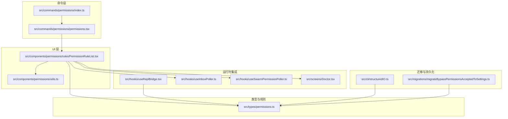
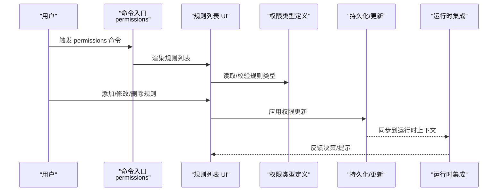
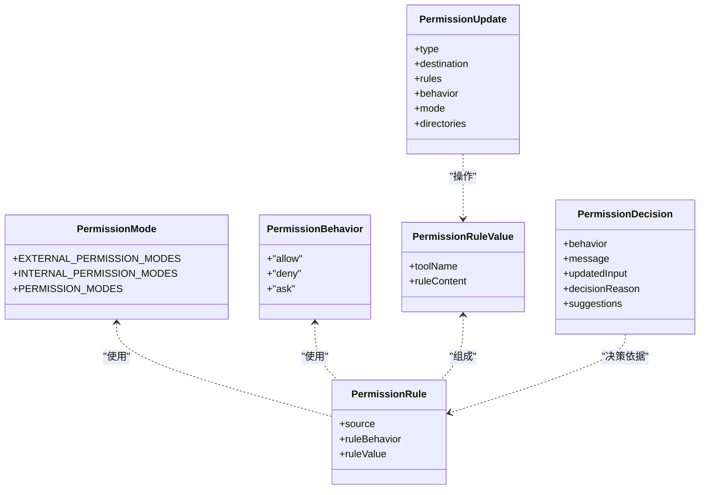
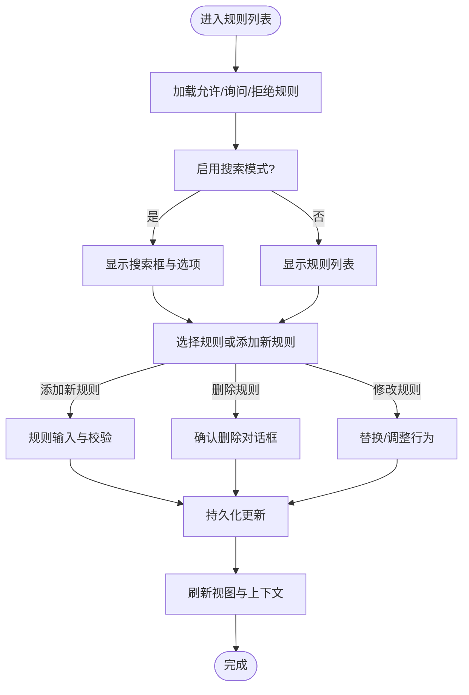
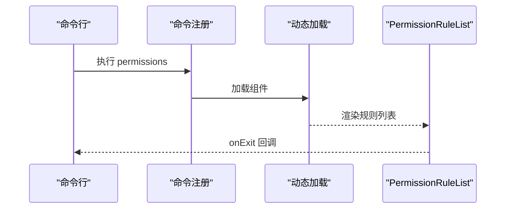
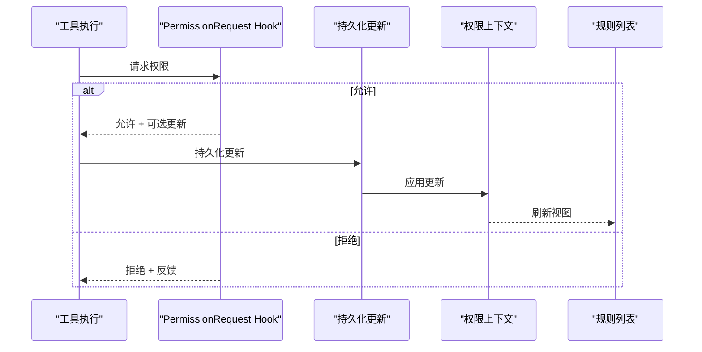
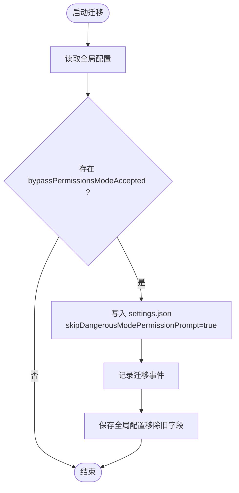
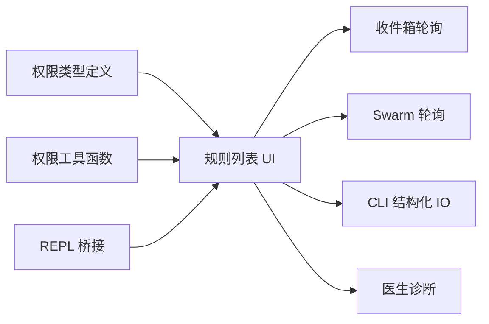

# 权限配置管理

<cite>
**本文引用的文件**
- [src/types/permissions.ts](file://src/types/permissions.ts)
- [src/commands/permissions/index.ts](file://src/commands/permissions/index.ts)
- [src/commands/permissions/permissions.tsx](file://src/commands/permissions/permissions.tsx)
- [src/components/permissions/rules/PermissionRuleList.tsx](file://src/components/permissions/rules/PermissionRuleList.tsx)
- [src/components/permissions/utils.ts](file://src/components/permissions/utils.ts)
- [src/hooks/useReplBridge.tsx](file://src/hooks/useReplBridge.tsx)
- [src/hooks/useInboxPoller.ts](file://src/hooks/useInboxPoller.ts)
- [src/hooks/useSwarmPermissionPoller.ts](file://src/hooks/useSwarmPermissionPoller.ts)
- [src/migrations/migrateBypassPermissionsAcceptedToSettings.ts](file://src/migrations/migrateBypassPermissionsAcceptedToSettings.ts)
- [src/cli/structuredIO.ts](file://src/cli/structuredIO.ts)
- [src/screens/Doctor.tsx](file://src/screens/Doctor.tsx)
</cite>

## 目录
1. [简介](#简介)
2. [项目结构](#项目结构)
3. [核心组件](#核心组件)
4. [架构总览](#架构总览)
5. [详细组件分析](#详细组件分析)
6. [依赖分析](#依赖分析)
7. [性能考虑](#性能考虑)
8. [故障排除指南](#故障排除指南)
9. [结论](#结论)
10. [附录](#附录)

## 简介
本技术文档围绕权限配置管理系统进行深入解析，覆盖以下主题：
- 权限配置的加载机制：配置文件解析、规则导入与初始化流程
- 权限规则的编辑界面：规则添加、修改、删除、排序与搜索
- 批量权限操作：规则复制、模板应用与批量更新
- 版本管理与备份恢复：迁移策略与数据一致性保障
- 迁移与同步策略：跨环境与团队间的一致性
- 验证与错误处理：决策流、异常捕获与用户反馈
- 与设置系统、同步服务的集成关系
- 故障排除与调试方法

## 项目结构
权限配置管理涉及类型定义、命令入口、UI 规则列表、工具函数以及与设置系统、同步钩子的集成点。

**图表来源**
- [src/commands/permissions/index.ts:1-12](file://src/commands/permissions/index.ts#L1-L12)
- [src/commands/permissions/permissions.tsx:1-10](file://src/commands/permissions/permissions.tsx#L1-L10)
- [src/components/permissions/rules/PermissionRuleList.tsx:1-120](file://src/components/permissions/rules/PermissionRuleList.tsx#L1-L120)
- [src/components/permissions/utils.ts:1-26](file://src/components/permissions/utils.ts#L1-L26)
- [src/types/permissions.ts:1-120](file://src/types/permissions.ts#L1-L120)
- [src/hooks/useReplBridge.tsx:425-449](file://src/hooks/useReplBridge.tsx#L425-L449)
- [src/hooks/useInboxPoller.ts:368-407](file://src/hooks/useInboxPoller.ts#L368-L407)
- [src/hooks/useSwarmPermissionPoller.ts:268-298](file://src/hooks/useSwarmPermissionPoller.ts#L268-L298)
- [src/migrations/migrateBypassPermissionsAcceptedToSettings.ts:1-40](file://src/migrations/migrateBypassPermissionsAcceptedToSettings.ts#L1-L40)
- [src/cli/structuredIO.ts:811-859](file://src/cli/structuredIO.ts#L811-L859)
- [src/screens/Doctor.tsx:459-473](file://src/screens/Doctor.tsx#L459-L473)

**章节来源**
- [src/commands/permissions/index.ts:1-12](file://src/commands/permissions/index.ts#L1-L12)
- [src/commands/permissions/permissions.tsx:1-10](file://src/commands/permissions/permissions.tsx#L1-L10)
- [src/components/permissions/rules/PermissionRuleList.tsx:1-120](file://src/components/permissions/rules/PermissionRuleList.tsx#L1-L120)
- [src/types/permissions.ts:1-120](file://src/types/permissions.ts#L1-L120)

## 核心组件
- 类型与规则定义：统一描述权限模式、行为、规则值、更新操作与决策结果等，避免循环依赖并集中管理。
- 命令入口：提供“permissions”命令，加载规则列表 UI。
- 规则列表 UI：支持按允许/询问/拒绝分类展示、搜索、添加、删除、工作区目录管理与最近拒绝记录。
- 工具函数：日志上报与事件记录，便于审计与问题定位。
- 运行时集成：REPL 桥接、收件箱轮询、Swarm 轮询、医生诊断等模块与权限系统交互。

**章节来源**
- [src/types/permissions.ts:1-120](file://src/types/permissions.ts#L1-L120)
- [src/commands/permissions/index.ts:1-12](file://src/commands/permissions/index.ts#L1-L12)
- [src/commands/permissions/permissions.tsx:1-10](file://src/commands/permissions/permissions.tsx#L1-L10)
- [src/components/permissions/rules/PermissionRuleList.tsx:1-120](file://src/components/permissions/rules/PermissionRuleList.tsx#L1-L120)
- [src/components/permissions/utils.ts:1-26](file://src/components/permissions/utils.ts#L1-L26)

## 架构总览
权限配置管理采用“命令驱动 + UI 编辑 + 类型约束 + 运行时集成”的分层架构。命令层负责入口与上下文注入；UI 层负责规则的可视化与交互；类型层提供强一致的数据结构；运行时集成负责在不同场景（REPL、收件箱、Swarm）中应用与持久化权限决策。

**图表来源**
- [src/commands/permissions/permissions.tsx:1-10](file://src/commands/permissions/permissions.tsx#L1-L10)
- [src/components/permissions/rules/PermissionRuleList.tsx:1-120](file://src/components/permissions/rules/PermissionRuleList.tsx#L1-L120)
- [src/types/permissions.ts:75-132](file://src/types/permissions.ts#L75-L132)
- [src/cli/structuredIO.ts:811-859](file://src/cli/structuredIO.ts#L811-L859)

## 详细组件分析

### 权限类型与规则定义
- 权限模式：外部模式（如 acceptEdits、bypassPermissions、default、dontAsk、plan），内部模式扩展 auto/bubble，并受特性开关控制。
- 权限行为：allow/deny/ask。
- 规则值：包含工具名与可选内容块，用于精确匹配。
- 规则来源：用户设置、项目设置、本地设置、标志设置、策略设置、命令、会话等。
- 更新操作：添加/替换/删除规则、设置模式、增删工作区目录。
- 决策结果：允许、询问（含建议）、拒绝、透传等，并附带决策原因与元数据。

**图表来源**
- [src/types/permissions.ts:16-38](file://src/types/permissions.ts#L16-L38)
- [src/types/permissions.ts:44-79](file://src/types/permissions.ts#L44-L79)
- [src/types/permissions.ts:67-70](file://src/types/permissions.ts#L67-L70)
- [src/types/permissions.ts:75-79](file://src/types/permissions.ts#L75-L79)
- [src/types/permissions.ts:98-131](file://src/types/permissions.ts#L98-L131)
- [src/types/permissions.ts:174-246](file://src/types/permissions.ts#L174-L246)

**章节来源**
- [src/types/permissions.ts:16-38](file://src/types/permissions.ts#L16-L38)
- [src/types/permissions.ts:44-79](file://src/types/permissions.ts#L44-L79)
- [src/types/permissions.ts:98-131](file://src/types/permissions.ts#L98-L131)
- [src/types/permissions.ts:174-246](file://src/types/permissions.ts#L174-L246)

### 权限规则编辑界面（规则列表）
- 分类与展示：按允许/询问/拒绝三类规则展示，支持搜索与排序。
- 交互能力：
  - 添加规则：进入输入流程，校验后提交，支持批量添加与不可达规则警告。
  - 删除规则：确认对话框，来源为策略设置时禁止修改。
  - 修改规则：通过替换或重新设定行为实现。
  - 排序：按规则字符串排序。
  - 搜索：支持快捷键触发与字符输入。
  - 工作区目录：增删额外工作目录，限定来源类型。
  - 最近拒绝：展示自动模式拒绝记录，支持重试。
- 上下文集成：与自动模式、不可达规则检测、设置系统联动。

**图表来源**
- [src/components/permissions/rules/PermissionRuleList.tsx:576-800](file://src/components/permissions/rules/PermissionRuleList.tsx#L576-L800)

**章节来源**
- [src/components/permissions/rules/PermissionRuleList.tsx:1-120](file://src/components/permissions/rules/PermissionRuleList.tsx#L1-L120)
- [src/components/permissions/rules/PermissionRuleList.tsx:576-800](file://src/components/permissions/rules/PermissionRuleList.tsx#L576-L800)

### 命令入口与 UI 组合
- 命令注册：permissions 命令别名为 allowed-tools，加载本地 JSX 组件。
- UI 渲染：渲染 PermissionRuleList，支持退出回调与重试拒绝命令的消息注入。

**图表来源**
- [src/commands/permissions/index.ts:1-12](file://src/commands/permissions/index.ts#L1-L12)
- [src/commands/permissions/permissions.tsx:1-10](file://src/commands/permissions/permissions.tsx#L1-L10)

**章节来源**
- [src/commands/permissions/index.ts:1-12](file://src/commands/permissions/index.ts#L1-L12)
- [src/commands/permissions/permissions.tsx:1-10](file://src/commands/permissions/permissions.tsx#L1-L10)

### 运行时集成与权限决策
- REPL 桥接：限制危险模式切换条件，确保仅在满足可用性与配置前提下变更模式。
- 收件箱轮询：处理权限响应（批准/拒绝），应用更新并清理响应文件。
- Swarm 轮询：在工作组场景下轮询响应，处理批准与拒绝分支。
- Hook 决策：在工具执行前通过 Hook 返回允许/拒绝，必要时持久化更新并同步上下文。

**图表来源**
- [src/cli/structuredIO.ts:811-859](file://src/cli/structuredIO.ts#L811-L859)

**章节来源**
- [src/hooks/useReplBridge.tsx:425-449](file://src/hooks/useReplBridge.tsx#L425-L449)
- [src/hooks/useInboxPoller.ts:368-407](file://src/hooks/useInboxPoller.ts#L368-L407)
- [src/hooks/useSwarmPermissionPoller.ts:268-298](file://src/hooks/useSwarmPermissionPoller.ts#L268-L298)
- [src/cli/structuredIO.ts:811-859](file://src/cli/structuredIO.ts#L811-L859)

### 版本管理与迁移
- 迁移策略：将全局配置中的 bypassPermissionsModeAccepted 迁移到 settings.json 的 skipDangerousModePermissionPrompt，保证用户可配置项集中管理。
- 日志与回退：迁移过程记录事件并安全保存，异常时记录错误日志。

**图表来源**
- [src/migrations/migrateBypassPermissionsAcceptedToSettings.ts:1-40](file://src/migrations/migrateBypassPermissionsAcceptedToSettings.ts#L1-L40)

**章节来源**
- [src/migrations/migrateBypassPermissionsAcceptedToSettings.ts:1-40](file://src/migrations/migrateBypassPermissionsAcceptedToSettings.ts#L1-L40)

### 与设置系统、同步服务的集成
- 设置来源：用户设置、项目设置、本地设置、标志设置、策略设置、命令、会话等。
- 同步与诊断：医生界面可检测不可达规则并给出警告，帮助识别配置冲突与失效规则。

**章节来源**
- [src/types/permissions.ts:54-63](file://src/types/permissions.ts#L54-L63)
- [src/screens/Doctor.tsx:459-473](file://src/screens/Doctor.tsx#L459-L473)

## 依赖分析
- 组件耦合：
  - 规则列表依赖类型定义与工具函数，同时与运行时钩子、设置系统交互。
  - 命令入口仅负责加载 UI，降低耦合度。
- 外部依赖：
  - REPL 桥接、收件箱轮询、Swarm 轮询等钩子提供跨模块的权限决策通道。
- 循环依赖规避：类型定义独立于实现，避免导入循环。

**图表来源**
- [src/types/permissions.ts:1-120](file://src/types/permissions.ts#L1-L120)
- [src/components/permissions/rules/PermissionRuleList.tsx:1-120](file://src/components/permissions/rules/PermissionRuleList.tsx#L1-L120)
- [src/components/permissions/utils.ts:1-26](file://src/components/permissions/utils.ts#L1-L26)
- [src/hooks/useInboxPoller.ts:368-407](file://src/hooks/useInboxPoller.ts#L368-L407)
- [src/hooks/useSwarmPermissionPoller.ts:268-298](file://src/hooks/useSwarmPermissionPoller.ts#L268-L298)
- [src/hooks/useReplBridge.tsx:425-449](file://src/hooks/useReplBridge.tsx#L425-L449)
- [src/cli/structuredIO.ts:811-859](file://src/cli/structuredIO.ts#L811-L859)
- [src/screens/Doctor.tsx:459-473](file://src/screens/Doctor.tsx#L459-L473)

**章节来源**
- [src/types/permissions.ts:1-120](file://src/types/permissions.ts#L1-L120)
- [src/components/permissions/rules/PermissionRuleList.tsx:1-120](file://src/components/permissions/rules/PermissionRuleList.tsx#L1-L120)

## 性能考虑
- UI 渲染优化：规则列表使用记忆化与键值映射，减少重复计算与重绘。
- 搜索与排序：对规则字符串进行小写化与本地比较，避免昂贵的正则匹配。
- 轮询策略：收件箱与 Swarm 轮询设置防并发与空回调检查，降低无效请求。
- 决策路径：Hook 决策优先返回，减少后续持久化与上下文更新成本。

[本节为通用指导，无需列出具体文件来源]

## 故障排除指南
- 不可达规则警告：医生界面可检测并提示不可达规则，建议根据修复建议调整规则顺序或行为。
- 模式切换失败：REPL 桥接对 bypassPermissions/auto 模式切换有严格前置条件，检查配置与可用性后再尝试。
- 权限响应未处理：确认收件箱轮询与 Swarm 轮询是否正常运行，检查回调注册与响应文件清理。
- Hook 决策异常：检查 PermissionRequest Hook 返回值与持久化逻辑，确保更新成功并同步到上下文。

**章节来源**
- [src/screens/Doctor.tsx:459-473](file://src/screens/Doctor.tsx#L459-L473)
- [src/hooks/useReplBridge.tsx:425-449](file://src/hooks/useReplBridge.tsx#L425-L449)
- [src/hooks/useInboxPoller.ts:368-407](file://src/hooks/useInboxPoller.ts#L368-L407)
- [src/hooks/useSwarmPermissionPoller.ts:268-298](file://src/hooks/useSwarmPermissionPoller.ts#L268-L298)
- [src/cli/structuredIO.ts:811-859](file://src/cli/structuredIO.ts#L811-L859)

## 结论
权限配置管理系统以类型定义为核心，结合命令入口与规则列表 UI 实现了从配置到执行的全链路管理。通过迁移策略、运行时集成与诊断工具，系统在复杂场景下保持一致性与可观测性。建议在团队协作中遵循统一的规则来源与更新流程，配合医生诊断与日志上报，持续优化权限策略的可维护性与安全性。

[本节为总结性内容，无需列出具体文件来源]

## 附录
- 关键术语
  - 权限模式：控制权限检查的整体策略（如 bypassPermissions、auto、plan 等）
  - 权限行为：allow/deny/ask
  - 规则来源：用户设置、项目设置、本地设置、策略设置、命令、会话等
  - 决策原因：规则、模式、子命令结果、Hook、分类器、工作区等
- 建议实践
  - 使用“最近拒绝”标签快速定位问题
  - 对敏感规则进行排序与注释，避免被更高优先级规则遮蔽
  - 在多环境部署中统一迁移策略，确保配置一致性

[本节为补充信息，无需列出具体文件来源]