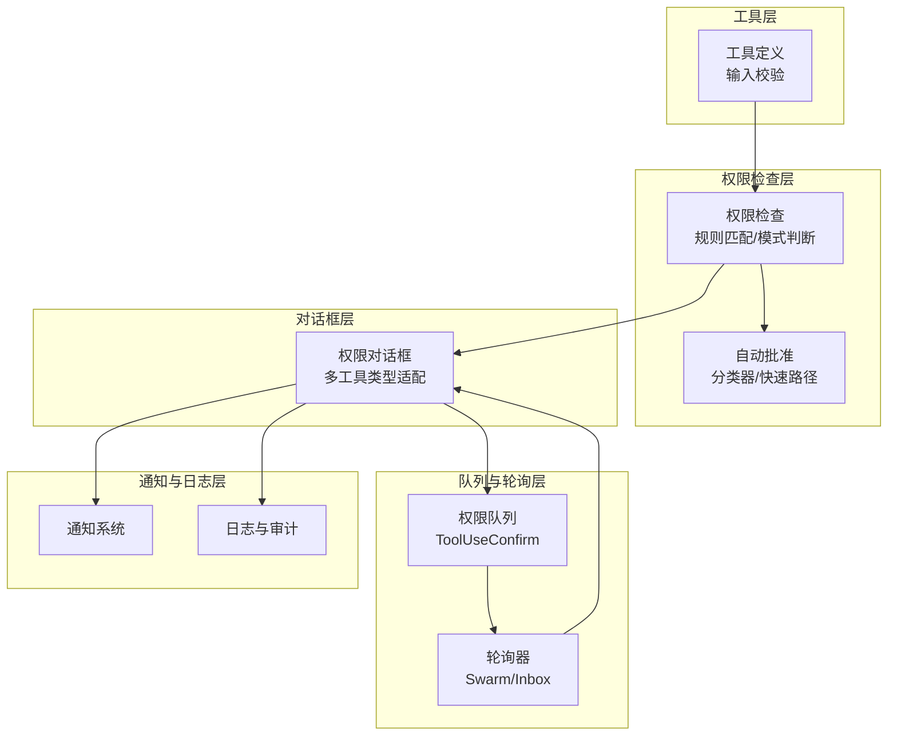
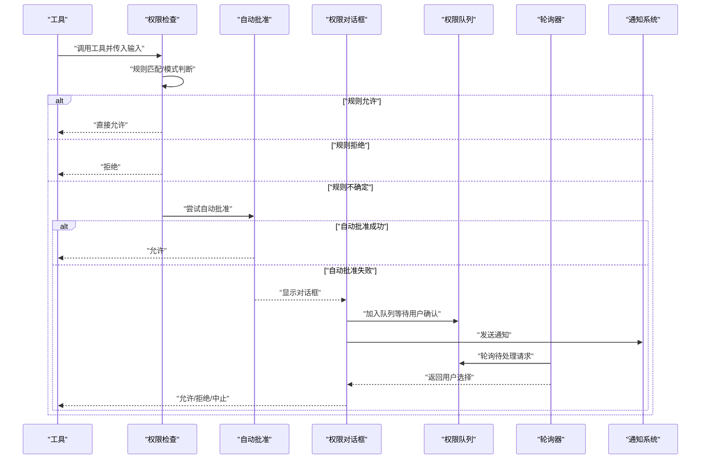
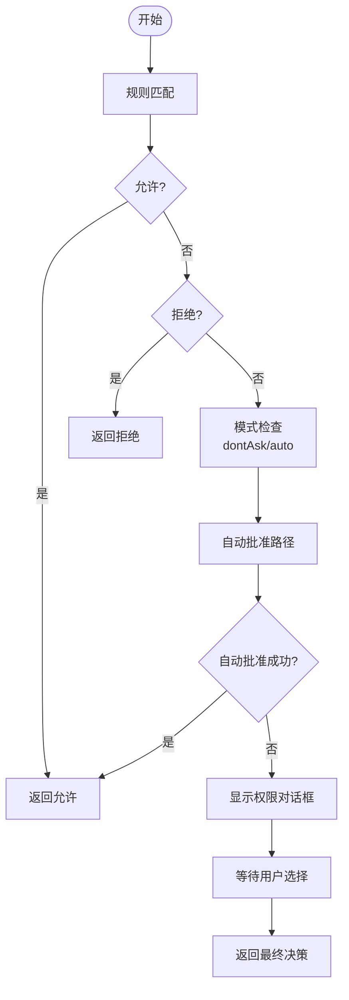
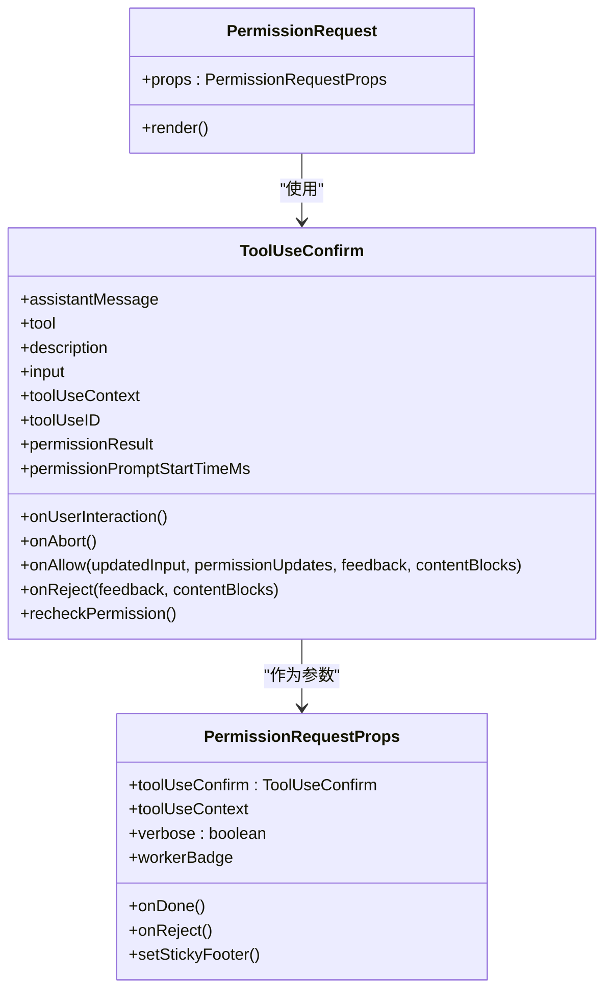
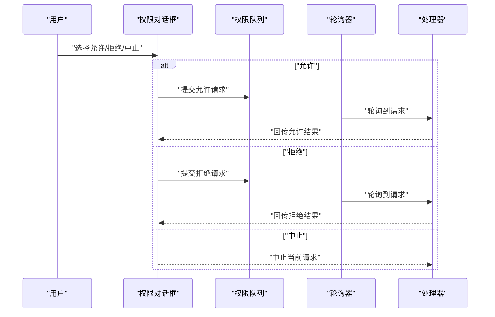
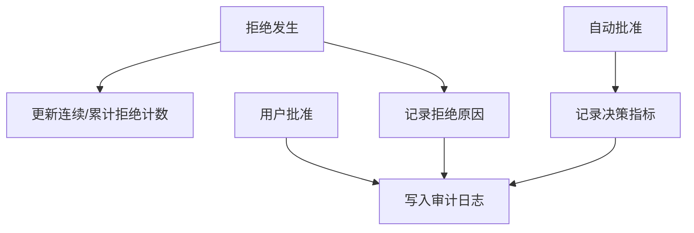
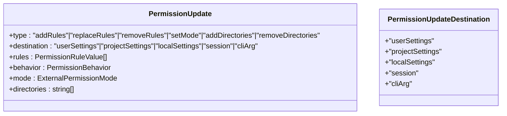
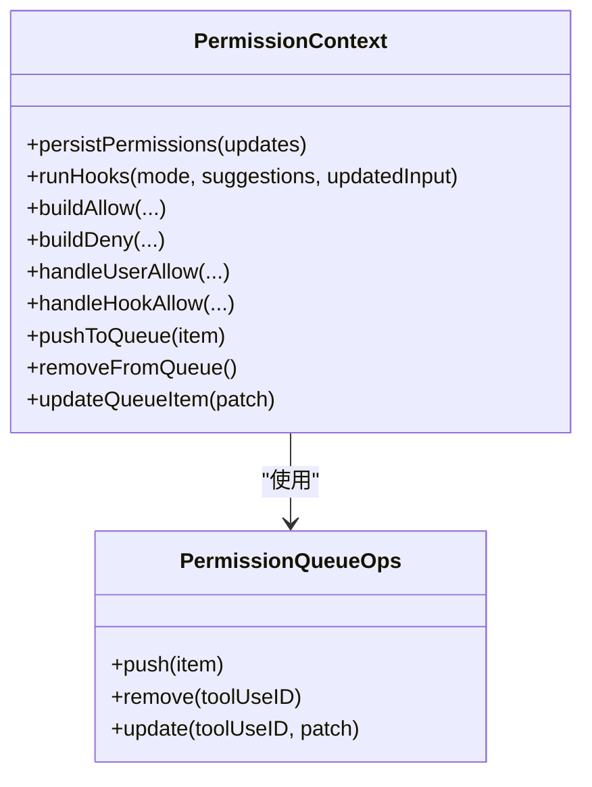
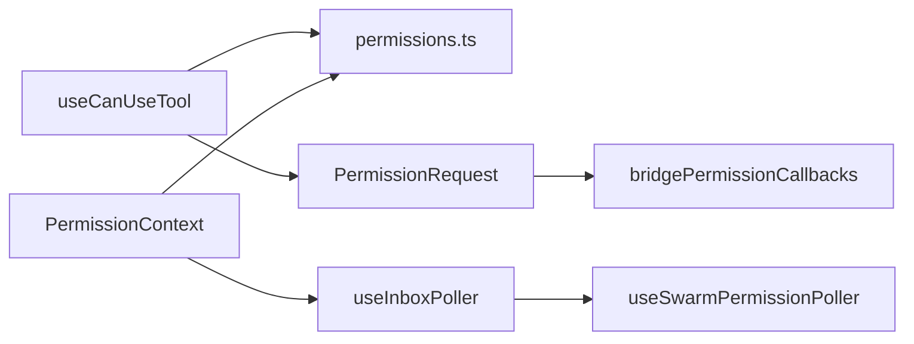

# 用户交互流程

<cite>
**本文档引用的文件**
- [useSwarmPermissionPoller.ts](file://src/hooks/useSwarmPermissionPoller.ts)
- [useInboxPoller.ts](file://src/hooks/useInboxPoller.ts)
- [useDirectConnect.ts](file://src/hooks/useDirectConnect.ts)
- [useCanUseTool.tsx](file://src/hooks/useCanUseTool.tsx)
- [PermissionRequest.tsx](file://src/components/permissions/PermissionRequest.tsx)
- [PermissionUpdateSchema.ts](file://src/utils/permissions/PermissionUpdateSchema.ts)
- [permissions.ts](file://src/utils/permissions/permissions.ts)
- [PermissionContext.ts](file://src/hooks/toolPermission/PermissionContext.ts)
- [bridgePermissionCallbacks.ts](file://src/bridge/bridgePermissionCallbacks.ts)
- [messages.ts](file://src/utils/messages.ts)
- [permissions.tsx](file://src/commands/permissions/permissions.tsx)
- [hooks.ts](file://src/types/hooks.ts)
</cite>

## 目录
1. [简介](#简介)
2. [项目结构](#项目结构)
3. [核心组件](#核心组件)
4. [架构总览](#架构总览)
5. [详细组件分析](#详细组件分析)
6. [依赖关系分析](#依赖关系分析)
7. [性能考虑](#性能考虑)
8. [故障排除指南](#故障排除指南)
9. [结论](#结论)

## 简介
本文件面向权限用户交互流程的技术文档，围绕以下目标展开：权限请求的触发机制（工具调用检测、权限检查时机、请求生成）、权限对话框实现（UI组件设计、交互逻辑、用户体验优化）、权限审批流程（用户选择处理、自动批准机制、批量操作支持）、权限历史记录（拒绝记录、统计信息、审计追踪）、权限交互的定制化选项与配置、权限请求的异步处理与状态管理，以及与通知系统、日志系统的集成关系。

## 项目结构
权限交互涉及多个层次的模块协同：
- 工具层：工具定义与输入校验，决定是否需要权限检查
- 权限检查层：规则匹配、模式判断、分类器决策
- 对话框层：针对不同工具类型的专用UI组件
- 队列与轮询层：跨进程/跨会话的权限请求与响应传递
- 通知与日志层：事件记录、消息生成、审计追踪

**图表来源**
- [useCanUseTool.tsx:28-191](file://src/hooks/useCanUseTool.tsx#L28-L191)
- [PermissionRequest.tsx:146-216](file://src/components/permissions/PermissionRequest.tsx#L146-L216)
- [useSwarmPermissionPoller.ts:268-331](file://src/hooks/useSwarmPermissionPoller.ts#L268-L331)
- [useInboxPoller.ts:126-800](file://src/hooks/useInboxPoller.ts#L126-L800)

**章节来源**
- [useCanUseTool.tsx:28-191](file://src/hooks/useCanUseTool.tsx#L28-L191)
- [PermissionRequest.tsx:146-216](file://src/components/permissions/PermissionRequest.tsx#L146-L216)
- [useSwarmPermissionPoller.ts:268-331](file://src/hooks/useSwarmPermissionPoller.ts#L268-L331)
- [useInboxPoller.ts:126-800](file://src/hooks/useInboxPoller.ts#L126-L800)

## 核心组件
- 权限检查入口：useCanUseTool 负责综合规则、模式、分类器与交互式对话框，返回最终决策
- 权限对话框：PermissionRequest 根据工具类型动态选择具体组件，统一处理允许/拒绝/中止回调
- 轮询与队列：useSwarmPermissionPoller 和 useInboxPoller 实现跨进程/跨会话的请求-响应传递
- 权限上下文：PermissionContext 封装持久化、日志、钩子执行等通用能力
- 权限更新：PermissionUpdateSchema 定义可持久化的权限变更类型

**章节来源**
- [useCanUseTool.tsx:28-191](file://src/hooks/useCanUseTool.tsx#L28-L191)
- [PermissionRequest.tsx:146-216](file://src/components/permissions/PermissionRequest.tsx#L146-L216)
- [useSwarmPermissionPoller.ts:268-331](file://src/hooks/useSwarmPermissionPoller.ts#L268-L331)
- [PermissionContext.ts:96-348](file://src/hooks/toolPermission/PermissionContext.ts#L96-L348)
- [PermissionUpdateSchema.ts:42-78](file://src/utils/permissions/PermissionUpdateSchema.ts#L42-L78)

## 架构总览
权限交互采用“规则驱动 + 自动批准 + 交互确认”的分层架构。工具调用触发权限检查，若规则无法直接判定，则进入自动批准阶段（如分类器），仍无法判定则弹出权限对话框，用户确认后通过队列/轮询回传结果。

**图表来源**
- [useCanUseTool.tsx:32-182](file://src/hooks/useCanUseTool.tsx#L32-L182)
- [PermissionRequest.tsx:146-216](file://src/components/permissions/PermissionRequest.tsx#L146-L216)
- [useSwarmPermissionPoller.ts:268-331](file://src/hooks/useSwarmPermissionPoller.ts#L268-L331)
- [useInboxPoller.ts:250-397](file://src/hooks/useInboxPoller.ts#L250-L397)

## 详细组件分析

### 权限请求触发机制
- 触发点：工具调用时由 hasPermissionsToUseTool 进行检查
- 检查顺序：规则匹配 → 模式转换（如 dontAsk/auto）→ 自动批准（分类器/快速路径）→ 交互式对话框
- 异常处理：对中断、错误进行捕获并转为拒绝或中止

**图表来源**
- [permissions.ts:473-800](file://src/utils/permissions/permissions.ts#L473-L800)
- [useCanUseTool.tsx:32-182](file://src/hooks/useCanUseTool.tsx#L32-L182)

**章节来源**
- [permissions.ts:473-800](file://src/utils/permissions/permissions.ts#L473-L800)
- [useCanUseTool.tsx:32-182](file://src/hooks/useCanUseTool.tsx#L32-L182)

### 权限对话框实现
- 动态组件映射：根据工具类型选择专用对话框组件（如 Bash、文件编辑、Web 访问等）
- 统一接口：ToolUseConfirm 提供 onAllow/onReject/onAbort 回调，支持反馈与内容块
- 交互优化：键盘绑定、通知提示、粘性页脚（长计划场景）

**图表来源**
- [PermissionRequest.tsx:103-127](file://src/components/permissions/PermissionRequest.tsx#L103-L127)
- [PermissionRequest.tsx:146-216](file://src/components/permissions/PermissionRequest.tsx#L146-L216)

**章节来源**
- [PermissionRequest.tsx:103-127](file://src/components/permissions/PermissionRequest.tsx#L103-L127)
- [PermissionRequest.tsx:146-216](file://src/components/permissions/PermissionRequest.tsx#L146-L216)

### 权限审批流程
- 用户选择处理：onAllow/onReject/onAbort 分别对应允许、拒绝、中止
- 自动批准机制：acceptEdits 快速路径、安全工具白名单、YOLO 分类器
- 批量操作支持：通过队列与轮询器支持多请求并发处理

**图表来源**
- [PermissionRequest.tsx:121-127](file://src/components/permissions/PermissionRequest.tsx#L121-L127)
- [useSwarmPermissionPoller.ts:297-310](file://src/hooks/useSwarmPermissionPoller.ts#L297-L310)
- [useInboxPoller.ts:297-332](file://src/hooks/useInboxPoller.ts#L297-L332)

**章节来源**
- [PermissionRequest.tsx:121-127](file://src/components/permissions/PermissionRequest.tsx#L121-L127)
- [useSwarmPermissionPoller.ts:297-310](file://src/hooks/useSwarmPermissionPoller.ts#L297-L310)
- [useInboxPoller.ts:297-332](file://src/hooks/useInboxPoller.ts#L297-L332)

### 权限历史记录与审计
- 拒绝记录：连续拒绝计数、累计拒绝计数、拒绝原因归因
- 统计信息：自动模式决策统计、分类器成本与延迟、阶段化指标
- 审计追踪：决策来源（规则/钩子/分类器/用户）、消息关联、会话令牌

**图表来源**
- [permissions.ts:486-501](file://src/utils/permissions/permissions.ts#L486-L501)
- [permissions.ts:555-800](file://src/utils/permissions/permissions.ts#L555-L800)

**章节来源**
- [permissions.ts:486-501](file://src/utils/permissions/permissions.ts#L486-L501)
- [permissions.ts:555-800](file://src/utils/permissions/permissions.ts#L555-L800)

### 权限交互定制化与配置
- 权限更新类型：添加/替换/移除规则、设置模式、增删目录
- 更新目标：用户设置、项目设置、本地设置、会话内存、命令行参数
- 命令入口：/permissions 列表与重试拒绝命令

**图表来源**
- [PermissionUpdateSchema.ts:42-78](file://src/utils/permissions/PermissionUpdateSchema.ts#L42-L78)

**章节来源**
- [PermissionUpdateSchema.ts:42-78](file://src/utils/permissions/PermissionUpdateSchema.ts#L42-L78)
- [permissions.tsx:1-10](file://src/commands/permissions/permissions.tsx#L1-L10)

### 异步处理与状态管理
- 权限上下文：封装持久化、日志、钩子执行、队列操作
- 队列操作：push/remove/update，支持 React 状态桥接
- 解决器：原子性标记已解决，避免竞态

**图表来源**
- [PermissionContext.ts:96-348](file://src/hooks/toolPermission/PermissionContext.ts#L96-L348)
- [PermissionContext.ts:357-379](file://src/hooks/toolPermission/PermissionContext.ts#L357-L379)

**章节来源**
- [PermissionContext.ts:96-348](file://src/hooks/toolPermission/PermissionContext.ts#L96-L348)
- [PermissionContext.ts:357-379](file://src/hooks/toolPermission/PermissionContext.ts#L357-L379)

### 与通知系统、日志系统的集成
- 通知：权限提示消息在对话框渲染前发送；终端通知与桌面通知结合
- 日志：决策日志、取消日志、错误日志、分类器指标日志
- 消息：系统消息用于记录权限重试、桥接状态等

**章节来源**
- [PermissionRequest.tsx:189-190](file://src/components/permissions/PermissionRequest.tsx#L189-L190)
- [PermissionContext.ts:113-131](file://src/hooks/toolPermission/PermissionContext.ts#L113-L131)
- [messages.ts:4354-4367](file://src/utils/messages.ts#L4354-L4367)

## 依赖关系分析
- useCanUseTool 依赖权限检查、自动批准、对话框与钩子
- PermissionRequest 依赖工具类型映射与通知系统
- 轮询器依赖队列与消息总线，负责跨进程通信
- 权限上下文为各模块提供统一的状态与持久化能力

**图表来源**
- [useCanUseTool.tsx:28-191](file://src/hooks/useCanUseTool.tsx#L28-L191)
- [PermissionRequest.tsx:146-216](file://src/components/permissions/PermissionRequest.tsx#L146-L216)
- [useInboxPoller.ts:126-800](file://src/hooks/useInboxPoller.ts#L126-L800)
- [useSwarmPermissionPoller.ts:268-331](file://src/hooks/useSwarmPermissionPoller.ts#L268-L331)
- [PermissionContext.ts:96-348](file://src/hooks/toolPermission/PermissionContext.ts#L96-L348)

**章节来源**
- [useCanUseTool.tsx:28-191](file://src/hooks/useCanUseTool.tsx#L28-L191)
- [PermissionRequest.tsx:146-216](file://src/components/permissions/PermissionRequest.tsx#L146-L216)
- [useInboxPoller.ts:126-800](file://src/hooks/useInboxPoller.ts#L126-L800)
- [useSwarmPermissionPoller.ts:268-331](file://src/hooks/useSwarmPermissionPoller.ts#L268-L331)
- [PermissionContext.ts:96-348](file://src/hooks/toolPermission/PermissionContext.ts#L96-L348)

## 性能考虑
- 自动批准快速路径：acceptEdits 与安全工具白名单减少分类器调用
- 分类器成本控制：记录 token 使用与延迟，计算成本，避免不必要的 API 调用
- 轮询节流：固定轮询间隔，避免频繁 IO；并发处理防止阻塞
- UI 响应：对话框暂停滚动与焦点管理，确保交互体验

## 故障排除指南
- 请求未显示：检查轮询器是否激活、队列是否为空、消息是否被标记为已读
- 决策异常：查看权限钩子执行结果、分类器可用性、模式配置
- 通知缺失：确认通知系统初始化、消息格式正确、终端/桌面通知启用
- 日志审计：核对决策来源、消息 ID 关联、会话状态一致性

**章节来源**
- [useInboxPoller.ts:139-202](file://src/hooks/useInboxPoller.ts#L139-L202)
- [permissions.ts:688-800](file://src/utils/permissions/permissions.ts#L688-L800)
- [PermissionContext.ts:113-131](file://src/hooks/toolPermission/PermissionContext.ts#L113-L131)

## 结论
该权限交互体系以规则为基础、自动批准为补充、交互确认为兜底，配合完善的队列/轮询、通知与日志系统，实现了跨进程/跨会话的一致性权限管理。通过可配置的权限更新与命令入口，用户可以灵活定制策略并进行批量操作。异步处理与状态管理保证了高并发下的稳定性与可观测性。