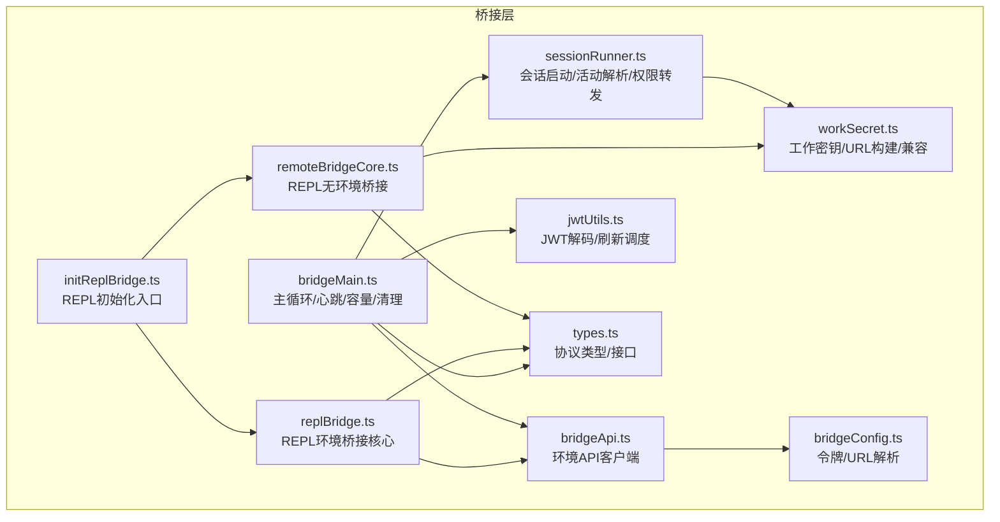
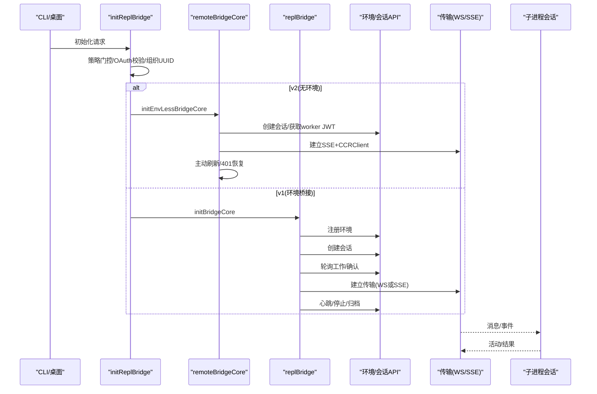
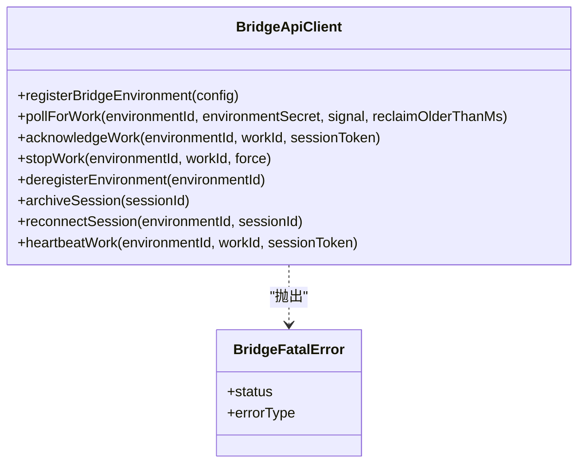
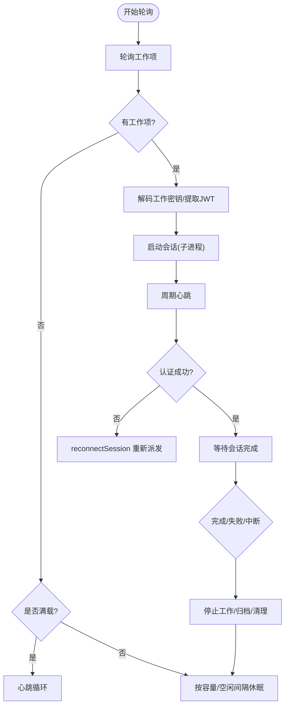
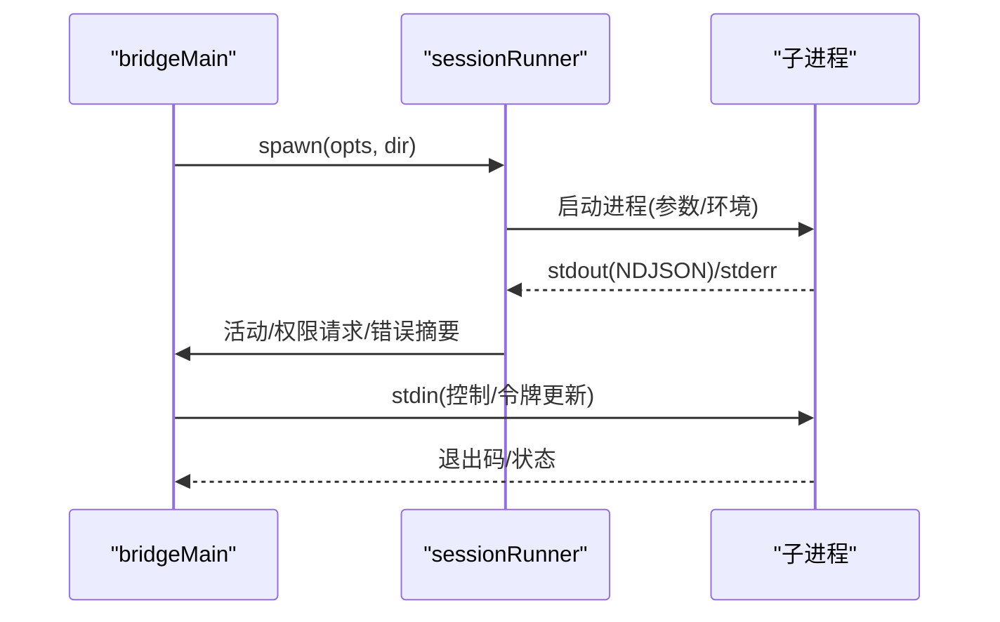
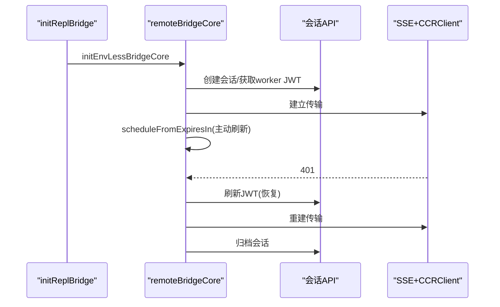
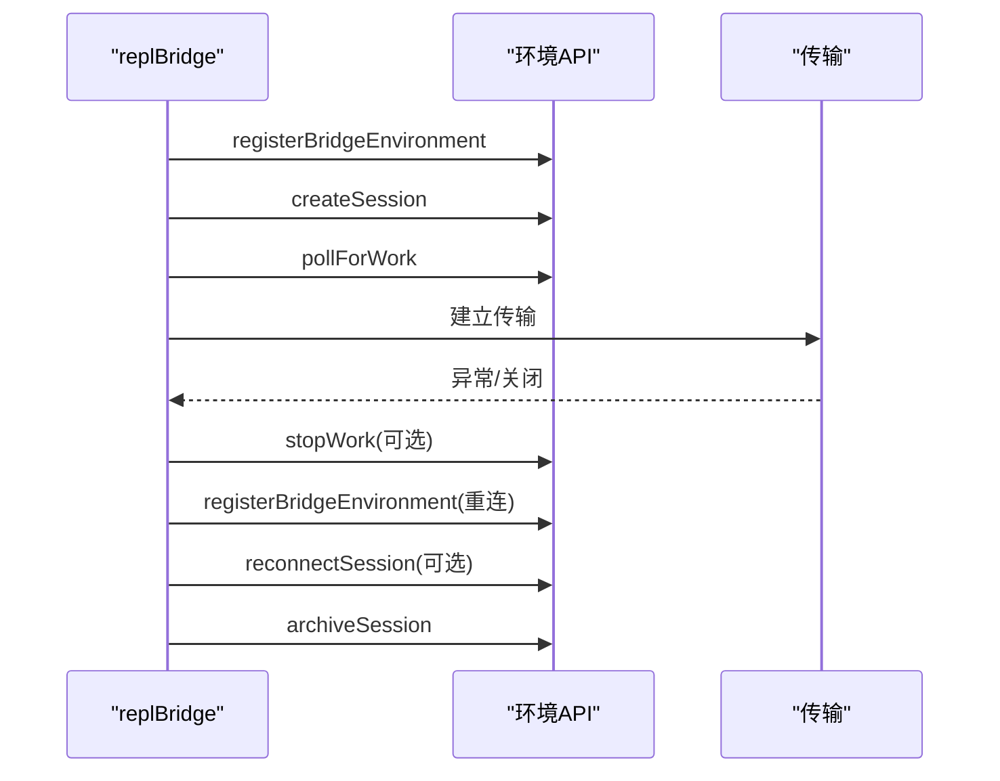
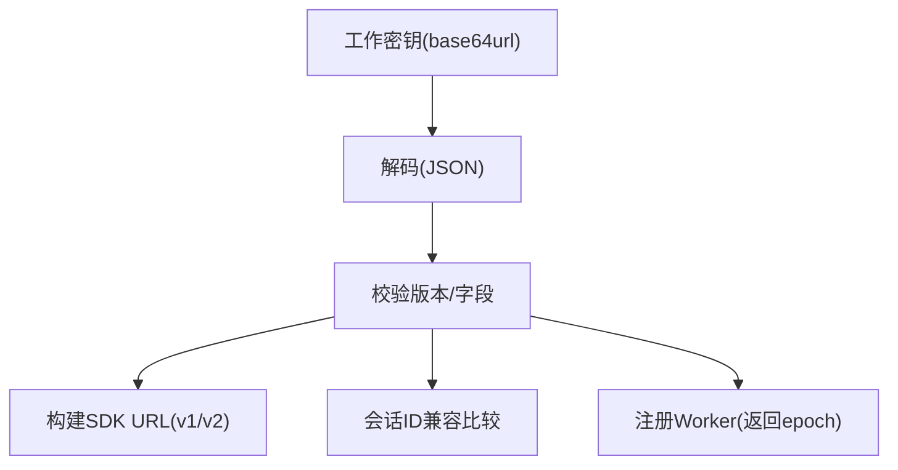
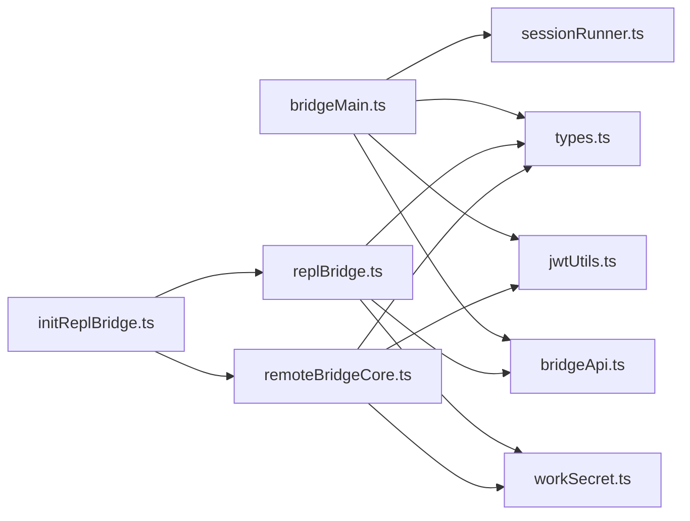

# 桥接层

<cite>
**本文引用的文件**
- [bridgeMain.ts](file://src/bridge/bridgeMain.ts)
- [bridgeApi.ts](file://src/bridge/bridgeApi.ts)
- [bridgeConfig.ts](file://src/bridge/bridgeConfig.ts)
- [sessionRunner.ts](file://src/bridge/sessionRunner.ts)
- [jwtUtils.ts](file://src/bridge/jwtUtils.ts)
- [types.ts](file://src/bridge/types.ts)
- [remoteBridgeCore.ts](file://src/bridge/remoteBridgeCore.ts)
- [initReplBridge.ts](file://src/bridge/initReplBridge.ts)
- [replBridge.ts](file://src/bridge/replBridge.ts)
- [workSecret.ts](file://src/bridge/workSecret.ts)
</cite>

## 目录
1. [简介](#简介)
2. [项目结构](#项目结构)
3. [核心组件](#核心组件)
4. [架构总览](#架构总览)
5. [详细组件分析](#详细组件分析)
6. [依赖关系分析](#依赖关系分析)
7. [性能考量](#性能考量)
8. [故障排除指南](#故障排除指南)
9. [结论](#结论)
10. [附录](#附录)

## 简介
本技术文档面向 Claude Code 的桥接层（Bridge），系统性阐述其在 Claude Desktop 与 Web 应用中的集成机制，包括桥接协议、通信通道与数据传输格式；远程会话管理的架构设计（创建、状态同步、生命周期）；JWT 认证机制（令牌生成、验证与刷新策略）；会话运行器的任务调度、资源分配与错误恢复；以及桥接层的配置选项与部署指南，并提供与桌面应用、Web 应用的集成示例与性能优化、故障排除建议。

## 项目结构
桥接层位于 src/bridge 目录，围绕“环境注册—工作轮询—会话创建—传输连接—心跳与清理”的主流程展开，同时提供 REPL 路径的“无环境”桥接能力。关键模块职责如下：
- bridgeMain.ts：桥接主循环与多会话管理、心跳、容量唤醒、超时与清理、日志与状态展示
- bridgeApi.ts：环境 API 客户端封装（注册、轮询、确认、停止、归档、重连、心跳）
- bridgeConfig.ts：桥接访问令牌与基础 URL 解析（支持开发覆盖）
- sessionRunner.ts：子进程会话启动、活动解析、权限请求转发、调试日志与转录
- jwtUtils.ts：JWT 解码、过期时间提取、主动刷新调度（含缓冲与回退）
- types.ts：桥接协议类型定义（工作项、工作密钥、会话句柄、客户端接口等）
- remoteBridgeCore.ts：REPL 无环境桥接核心（直接创建会话、拉取 worker JWT、建立 v2 传输、刷新与重建）
- initReplBridge.ts：REPL 初始化入口（策略门控、OAuth 校验、标题派生、组织 UUID、路径选择）
- replBridge.ts：REPL 环境桥接核心（环境注册、会话创建、轮询、传输适配、重连策略、清理）
- workSecret.ts：工作密钥解码、SDK URL 构建、会话 ID 兼容比较、CCR v2 注册



图表来源
- [bridgeMain.ts:141-900](file://src/bridge/bridgeMain.ts#L141-L900)
- [bridgeApi.ts:68-452](file://src/bridge/bridgeApi.ts#L68-L452)
- [bridgeConfig.ts:1-49](file://src/bridge/bridgeConfig.ts#L1-L49)
- [sessionRunner.ts:248-551](file://src/bridge/sessionRunner.ts#L248-L551)
- [jwtUtils.ts:72-256](file://src/bridge/jwtUtils.ts#L72-L256)
- [types.ts:16-263](file://src/bridge/types.ts#L16-L263)
- [remoteBridgeCore.ts:140-760](file://src/bridge/remoteBridgeCore.ts#L140-L760)
- [initReplBridge.ts:110-545](file://src/bridge/initReplBridge.ts#L110-L545)
- [replBridge.ts:260-800](file://src/bridge/replBridge.ts#L260-L800)
- [workSecret.ts:1-128](file://src/bridge/workSecret.ts#L1-L128)

章节来源
- [bridgeMain.ts:141-900](file://src/bridge/bridgeMain.ts#L141-L900)
- [bridgeApi.ts:68-452](file://src/bridge/bridgeApi.ts#L68-L452)
- [bridgeConfig.ts:1-49](file://src/bridge/bridgeConfig.ts#L1-L49)
- [sessionRunner.ts:248-551](file://src/bridge/sessionRunner.ts#L248-L551)
- [jwtUtils.ts:72-256](file://src/bridge/jwtUtils.ts#L72-L256)
- [types.ts:16-263](file://src/bridge/types.ts#L16-L263)
- [remoteBridgeCore.ts:140-760](file://src/bridge/remoteBridgeCore.ts#L140-L760)
- [initReplBridge.ts:110-545](file://src/bridge/initReplBridge.ts#L110-L545)
- [replBridge.ts:260-800](file://src/bridge/replBridge.ts#L260-L800)
- [workSecret.ts:1-128](file://src/bridge/workSecret.ts#L1-L128)

## 核心组件
- 环境 API 客户端：封装注册、轮询、确认、停止、归档、重连、心跳等环境层操作，统一处理 401/403/404/410 等错误并区分致命错误
- 主循环与会话管理：负责工作轮询、心跳、容量唤醒、会话超时、清理与状态展示
- 会话运行器：以子进程方式启动会话，解析活动、转发权限请求、写入调试日志与转录
- JWT 刷新调度：基于会话 ingress JWT 过期时间主动刷新，支持 v1（OAuth 直传）与 v2（通过重连触发服务端重新派发）
- REPL 桥接：提供两种路径
  - 环境桥接（v1）：注册环境、轮询工作、建立会话传输、心跳与重连
  - 无环境桥接（v2）：直接创建会话、拉取 worker JWT、建立 SSE + CCRClient 传输、主动刷新与重建

章节来源
- [bridgeApi.ts:68-452](file://src/bridge/bridgeApi.ts#L68-L452)
- [bridgeMain.ts:141-900](file://src/bridge/bridgeMain.ts#L141-L900)
- [sessionRunner.ts:248-551](file://src/bridge/sessionRunner.ts#L248-L551)
- [jwtUtils.ts:72-256](file://src/bridge/jwtUtils.ts#L72-L256)
- [remoteBridgeCore.ts:140-760](file://src/bridge/remoteBridgeCore.ts#L140-L760)
- [replBridge.ts:260-800](file://src/bridge/replBridge.ts#L260-L800)

## 架构总览
桥接层在不同场景下采用不同的工作流：
- 桌面/CLI 场景（daemon/print）：使用环境桥接（v1），通过环境 API 注册、轮询、确认、心跳与停止
- REPL 场景（桌面/浏览器）：可选 v1（环境桥接）或 v2（无环境桥接）
  - v1：注册环境 → 创建会话 → 轮询工作 → 建立传输 → 心跳与重连
  - v2：创建会话 → 拉取 worker JWT → 建立 SSE + CCRClient 传输 → 主动刷新与重建



图表来源
- [initReplBridge.ts:110-545](file://src/bridge/initReplBridge.ts#L110-L545)
- [remoteBridgeCore.ts:140-760](file://src/bridge/remoteBridgeCore.ts#L140-L760)
- [replBridge.ts:260-800](file://src/bridge/replBridge.ts#L260-L800)
- [bridgeApi.ts:68-452](file://src/bridge/bridgeApi.ts#L68-L452)

## 详细组件分析

### 组件A：环境 API 客户端（bridgeApi）
- 功能要点
  - 统一请求头（Authorization、Anthropic 版本、Beta 头、runner 版本、可信设备令牌）
  - OAuth 401 自动重试与刷新回调
  - 环境注册、工作轮询、确认、停止、注销、归档、重连、心跳
  - 错误分类：致命错误（401/403/404/410）、速率限制、其他错误
- 关键接口
  - registerBridgeEnvironment、pollForWork、acknowledgeWork、stopWork、deregisterEnvironment、archiveSession、reconnectSession、heartbeatWork
- 安全与健壮性
  - validateBridgeId 对路径段 ID 进行安全校验，防止注入
  - BridgeFatalError 区分致命错误类型，避免无限重试



图表来源
- [bridgeApi.ts:68-452](file://src/bridge/bridgeApi.ts#L68-L452)
- [types.ts:133-176](file://src/bridge/types.ts#L133-L176)

章节来源
- [bridgeApi.ts:68-452](file://src/bridge/bridgeApi.ts#L68-L452)
- [types.ts:133-176](file://src/bridge/types.ts#L133-L176)

### 组件B：主循环与会话管理（bridgeMain）
- 功能要点
  - 工作轮询与空闲节流、容量模式下的心跳与轮询组合
  - 会话生命周期管理：创建、完成、失败、中断、超时、清理
  - 令牌刷新：v1 直接更新子进程环境变量；v2 通过 reconnectSession 触发服务端重新派发
  - 心跳：对活跃工作项进行心跳，处理认证失败与致命错误
  - 日志与状态：实时状态显示、调试日志路径、会话标题与活动追踪
- 关键流程
  - 轮询 → 解码工作密钥 → 解析会话 ingress JWT → 启动会话 → 心跳/刷新 → 结束清理



图表来源
- [bridgeMain.ts:600-800](file://src/bridge/bridgeMain.ts#L600-L800)
- [bridgeApi.ts:358-385](file://src/bridge/bridgeApi.ts#L358-L385)

章节来源
- [bridgeMain.ts:141-900](file://src/bridge/bridgeMain.ts#L141-L900)
- [bridgeApi.ts:199-417](file://src/bridge/bridgeApi.ts#L199-L417)

### 组件C：会话运行器（sessionRunner）
- 功能要点
  - 子进程启动参数与环境变量设置（支持 v1/v2 传输）
  - 标准输出 NDJSON 解析，提取工具调用与文本活动
  - 权限请求转发（control_request）至服务器
  - 调试日志与转录文件写入
  - 令牌更新：向子进程 stdin 发送 update_environment_variables 消息
- 关键接口
  - createSessionSpawner、SessionHandle（kill/forceKill/writeStdin/updateAccessToken）



图表来源
- [sessionRunner.ts:248-551](file://src/bridge/sessionRunner.ts#L248-L551)
- [bridgeMain.ts:126-139](file://src/bridge/bridgeMain.ts#L126-L139)

章节来源
- [sessionRunner.ts:248-551](file://src/bridge/sessionRunner.ts#L248-L551)
- [bridgeMain.ts:126-139](file://src/bridge/bridgeMain.ts#L126-L139)

### 组件D：JWT 认证与刷新（jwtUtils）
- 功能要点
  - JWT 载荷解码（去除前缀 sk-ant-si-），提取 exp
  - 主动刷新调度：基于过期时间提前刷新（默认 5 分钟缓冲），失败重试上限与回退间隔
  - 支持从 expires_in 直接调度（opaque JWT 场景）
- 关键接口
  - decodeJwtPayload、decodeJwtExpiry、createTokenRefreshScheduler（schedule/scheduleFromExpiresIn/cancel/cancelAll）

```mermaid
flowchart TD
Start(["收到JWT"]) --> Exp["解析exp(秒)"]
Exp --> Calc["计算剩余时间-缓冲"]
Calc --> <=0?{"<=0?"}
<=0? --> |是| Refresh["立即刷新"]
<=0? --> |否| Sleep["等待到刷新点"]
Refresh --> Update["通知调用方更新令牌"]
Update --> Next["设置回退刷新(30分钟)"]
Sleep --> Next
```

图表来源
- [jwtUtils.ts:72-256](file://src/bridge/jwtUtils.ts#L72-L256)

章节来源
- [jwtUtils.ts:72-256](file://src/bridge/jwtUtils.ts#L72-L256)

### 组件E：REPL 无环境桥接（remoteBridgeCore）
- 功能要点
  - 直接创建会话（无需环境层），拉取 worker JWT 与有效期
  - 建立 v2 传输（SSE + CCRClient），维护序列号与去重
  - 主动刷新：在 expires_in 到期前重新获取 JWT 并重建传输
  - 401 恢复：刷新 OAuth 后重建传输
  - 清理：发送结果消息后归档会话，必要时二次刷新 OAuth
- 关键接口
  - initEnvLessBridgeCore、rebuildTransport、recoverFromAuthFailure、teardown



图表来源
- [remoteBridgeCore.ts:140-760](file://src/bridge/remoteBridgeCore.ts#L140-L760)
- [initReplBridge.ts:410-452](file://src/bridge/initReplBridge.ts#L410-L452)

章节来源
- [remoteBridgeCore.ts:140-760](file://src/bridge/remoteBridgeCore.ts#L140-L760)
- [initReplBridge.ts:410-452](file://src/bridge/initReplBridge.ts#L410-L452)

### 组件F：REPL 环境桥接（replBridge）
- 功能要点
  - 环境注册、会话创建、轮询工作、确认与心跳
  - 传输适配：HybridTransport（v1）或 SSETransport + CCRClient（v2）
  - 环境丢失重连：尝试原地重连（reconnectSession）或创建新会话
  - 清理：停止工作、注销环境、归档会话
- 关键接口
  - initBridgeCore、tryReconnectInPlace、doReconnect、teardown



图表来源
- [replBridge.ts:260-800](file://src/bridge/replBridge.ts#L260-L800)
- [bridgeApi.ts:199-417](file://src/bridge/bridgeApi.ts#L199-L417)

章节来源
- [replBridge.ts:260-800](file://src/bridge/replBridge.ts#L260-L800)
- [bridgeApi.ts:199-417](file://src/bridge/bridgeApi.ts#L199-L417)

### 组件G：工作密钥与 SDK URL（workSecret）
- 功能要点
  - 工作密钥解码（base64url → JSON），校验版本与字段完整性
  - 构建 SDK WebSocket URL（本地/生产差异化）
  - 会话 ID 兼容比较（支持 cse_* 与 session_*）
  - CCR v2 注册（/worker/register），返回 worker_epoch



图表来源
- [workSecret.ts:1-128](file://src/bridge/workSecret.ts#L1-L128)

章节来源
- [workSecret.ts:1-128](file://src/bridge/workSecret.ts#L1-L128)

## 依赖关系分析
- 模块耦合
  - bridgeMain 依赖 bridgeApi、sessionRunner、jwtUtils、types
  - replBridge 依赖 bridgeApi、workSecret、types、replBridgeTransport、bridgeMessaging
  - remoteBridgeCore 依赖 workSecret、jwtUtils、replBridgeTransport、bridgeMessaging
  - initReplBridge 作为入口，协调 gate、OAuth、组织 UUID、路径选择
- 外部依赖
  - axios 用于 HTTP 请求
  - child_process 用于子进程会话
  - 传输层：HybridTransport（v1）、SSETransport + CCRClient（v2）



图表来源
- [bridgeMain.ts:1-120](file://src/bridge/bridgeMain.ts#L1-L120)
- [replBridge.ts:1-100](file://src/bridge/replBridge.ts#L1-L100)
- [remoteBridgeCore.ts:1-80](file://src/bridge/remoteBridgeCore.ts#L1-L80)
- [initReplBridge.ts:1-80](file://src/bridge/initReplBridge.ts#L1-L80)

章节来源
- [bridgeMain.ts:1-120](file://src/bridge/bridgeMain.ts#L1-L120)
- [replBridge.ts:1-100](file://src/bridge/replBridge.ts#L1-L100)
- [remoteBridgeCore.ts:1-80](file://src/bridge/remoteBridgeCore.ts#L1-L80)
- [initReplBridge.ts:1-80](file://src/bridge/initReplBridge.ts#L1-L80)

## 性能考量
- 轮询与心跳
  - 空闲/满载模式下采用不同轮询间隔，避免过度轮询
  - 心跳仅在满载或启用心跳模式时进行，减少网络压力
- 刷新策略
  - JWT 主动刷新（5 分钟缓冲）与回退刷新（30 分钟），降低长时间会话的认证风险
  - v2 使用 reconnectSession 触发服务端重新派发，避免静默死亡
- 资源管理
  - 会话超时与清理（停止工作、移除工作树、取消定时器）
  - 调试日志与转录文件按需开启，避免 IO 抖动
- 传输优化
  - v2 SSE 传输保持高水位序列号，减少历史重放
  - FlushGate 在初始刷新期间排队写入，保证顺序一致性

[本节为通用指导，不直接分析具体文件]

## 故障排除指南
- 认证相关
  - 401：检查 OAuth 刷新回调是否正确执行；若失败，确认令牌有效性与过期时间
  - 403：检查组织权限与作用域；部分 403 可抑制（如外部轮询会话权限）
  - 404/410：环境过期或不存在，需重新注册或重启桥接
- 会话与传输
  - 会话中断：区分用户中断（SIGTERM/SIGINT）与异常失败，分别记录与处理
  - v2 401：触发主动刷新或 401 恢复，重建传输并重放队列
  - 传输重建：确保 epoch 正确递增，避免旧 epoch 导致 409
- 日志与诊断
  - 开启调试日志与转录文件，定位 NDJSON 解析与活动提取问题
  - 使用状态显示与会话计数，快速判断空闲/活跃/失败状态

章节来源
- [bridgeApi.ts:454-524](file://src/bridge/bridgeApi.ts#L454-L524)
- [remoteBridgeCore.ts:529-590](file://src/bridge/remoteBridgeCore.ts#L529-L590)
- [replBridge.ts:587-760](file://src/bridge/replBridge.ts#L587-L760)

## 结论
桥接层通过清晰的模块划分与稳健的错误处理，实现了从桌面到 Web 的多场景集成。环境 API 与 v2 无环境路径并存，满足不同部署与性能需求。JWT 主动刷新与传输重建保障了长时会话的稳定性；主循环与会话运行器提供了高效的资源管理与可观测性。结合本文的配置与部署建议，可进一步提升桥接层的可靠性与可维护性。

[本节为总结性内容，不直接分析具体文件]

## 附录

### 配置选项与部署指南
- 访问令牌与基础 URL
  - getBridgeAccessToken/getBridgeBaseUrl 支持开发覆盖（ANT 专用）
- 环境注册参数
  - dir、machineName、branch、gitRepoUrl、maxSessions、spawnMode、workerType、reuseEnvironmentId、apiBaseUrl、sessionIngressUrl
- REPL 初始化参数
  - 初始消息、标题派生策略、权限模式、标签、出站模式（镜像模式）
- 部署建议
  - 生产环境使用受信任设备令牌头（当启用强制时）
  - 启用调试日志与转录文件以便问题排查
  - 在长时间运行场景下，合理设置会话超时与刷新缓冲

章节来源
- [bridgeConfig.ts:1-49](file://src/bridge/bridgeConfig.ts#L1-L49)
- [types.ts:81-115](file://src/bridge/types.ts#L81-L115)
- [initReplBridge.ts:75-108](file://src/bridge/initReplBridge.ts#L75-L108)

### 与桌面应用、Web 应用的集成示例
- 桌面应用（CLI/daemon）
  - 使用环境桥接（v1）：注册环境 → 轮询工作 → 建立传输 → 心跳与清理
  - 使用会话运行器：spawn 会话 → 解析活动 → 转发权限请求 → 写入调试日志
- Web 应用（REPL）
  - v2 无环境桥接：创建会话 → 获取 worker JWT → 建立 SSE + CCRClient → 主动刷新/401 恢复
  - v1 环境桥接：注册环境 → 创建会话 → 轮询工作 → 传输适配与重连

章节来源
- [remoteBridgeCore.ts:140-760](file://src/bridge/remoteBridgeCore.ts#L140-L760)
- [replBridge.ts:260-800](file://src/bridge/replBridge.ts#L260-L800)
- [sessionRunner.ts:248-551](file://src/bridge/sessionRunner.ts#L248-L551)