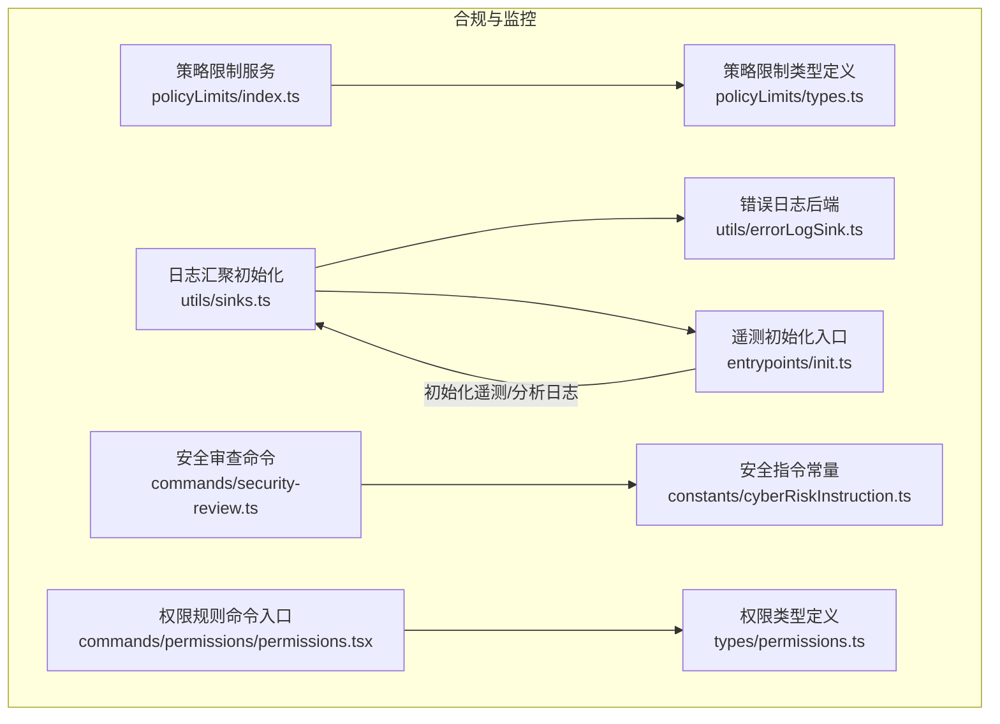
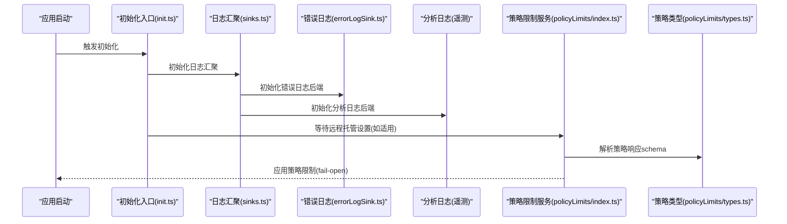
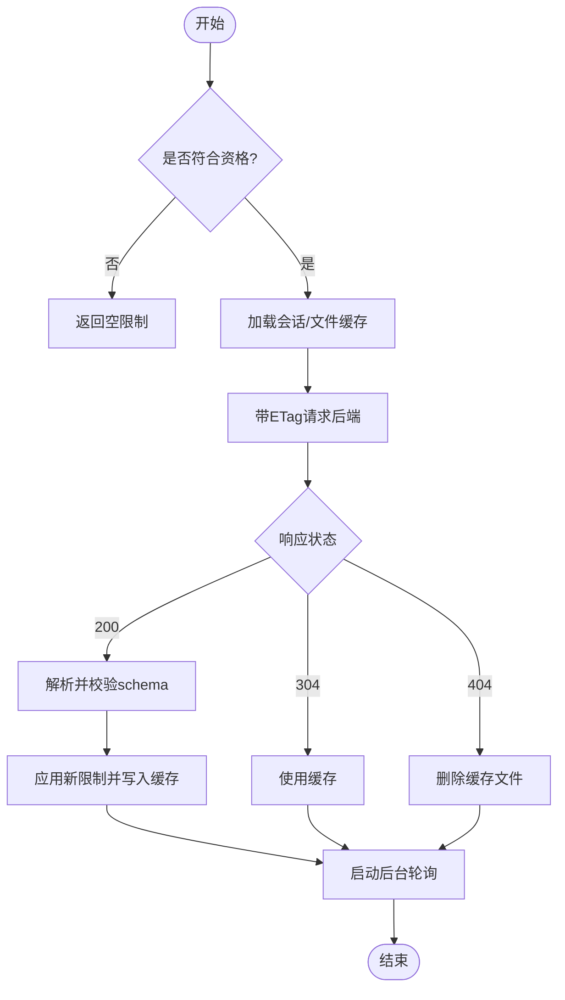
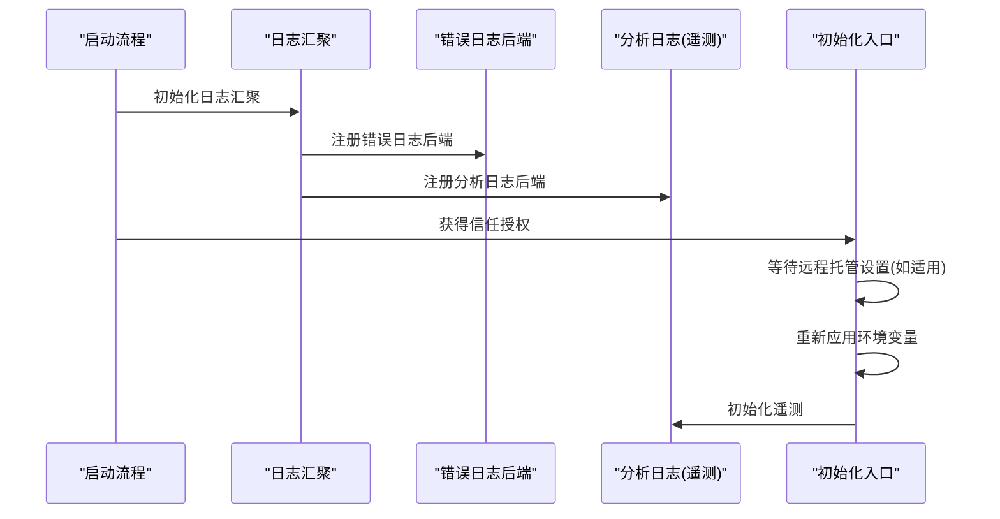
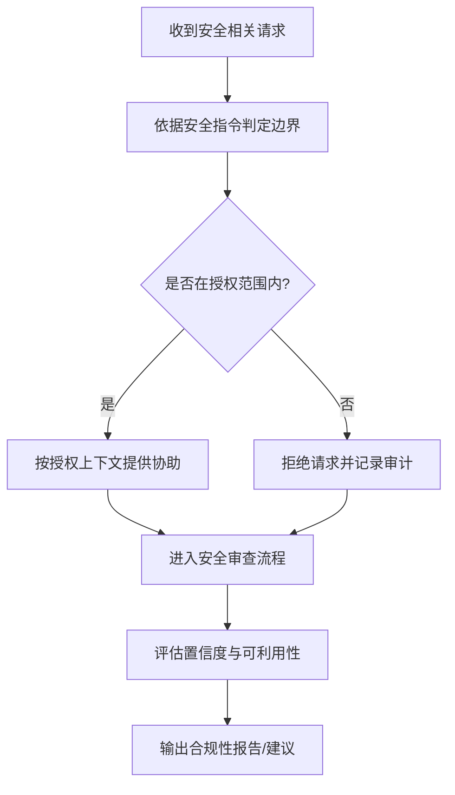
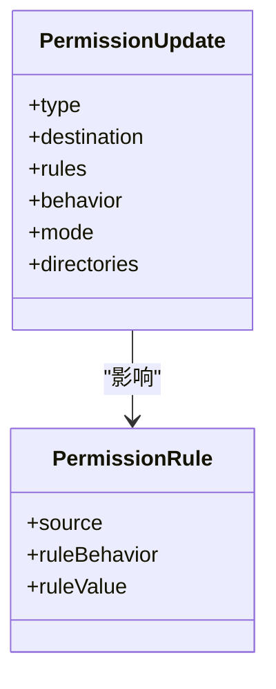
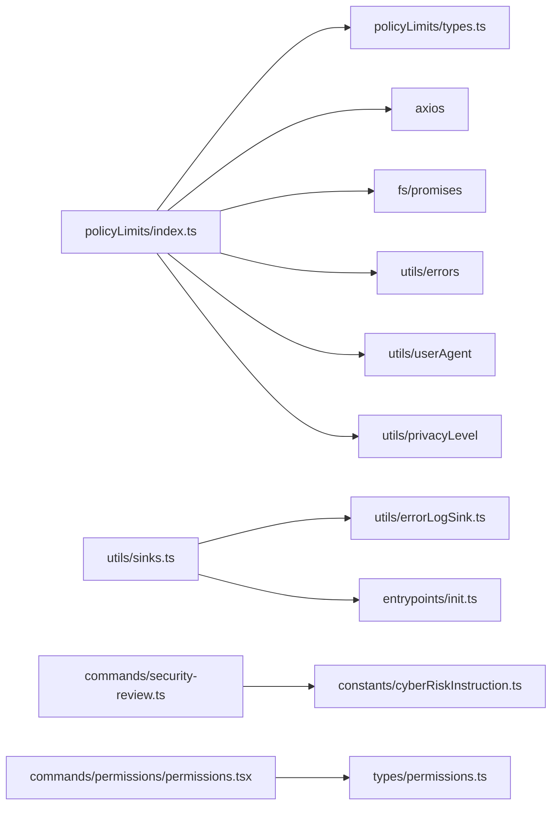

# 合规性监控

<cite>
**本文引用的文件**
- [cyberRiskInstruction.ts](file://src/constants/cyberRiskInstruction.ts)
- [policyLimits/index.ts](file://src/services/policyLimits/index.ts)
- [policyLimits/types.ts](file://src/services/policyLimits/types.ts)
- [sinks.ts](file://src/utils/sinks.ts)
- [errorLogSink.ts](file://src/utils/errorLogSink.ts)
- [init.ts](file://src/entrypoints/init.ts)
- [01-telemetry-and-privacy.md](file://docs/en/01-telemetry-and-privacy.md)
- [security-review.ts](file://src/commands/security-review.ts)
- [permissions.tsx](file://src/commands/permissions/permissions.tsx)
- [permissions.ts](file://src/types/permissions.ts)
</cite>

## 目录
1. [简介](#简介)
2. [项目结构](#项目结构)
3. [核心组件](#核心组件)
4. [架构总览](#架构总览)
5. [详细组件分析](#详细组件分析)
6. [依赖关系分析](#依赖关系分析)
7. [性能考量](#性能考量)
8. [故障排查指南](#故障排查指南)
9. [结论](#结论)
10. [附录](#附录)

## 简介
本技术文档聚焦 Claude Code 的合规性监控体系，围绕“监控指标定义、数据采集机制、异常检测算法、安全审计、风险评估与威胁检测、合规性检查工具、合规性报告与仪表板、配置与实践示例”等维度进行系统化解析。基于仓库中已公开的遥测与隐私分析文档、策略限制服务、错误日志与分析日志汇聚、以及安全审查命令等实现，本文给出可落地的合规性设计与实施建议，并提供面向监管要求的满足路径。

## 项目结构
从合规视角看，关键模块包括：
- 策略限制服务：从后端拉取组织级策略限制，用于本地功能开关与合规约束
- 遥测与日志：第一方与第三方日志导出、调试过滤、错误日志汇聚
- 安全指令与安全审查：对安全相关请求的行为边界与漏洞评估流程
- 权限规则与合规检查：权限规则列表、不可达规则警告、合规性校验入口

图表来源
- [policyLimits/index.ts:1-664](file://src/services/policyLimits/index.ts#L1-L664)
- [policyLimits/types.ts:1-28](file://src/services/policyLimits/types.ts#L1-L28)
- [sinks.ts:1-16](file://src/utils/sinks.ts#L1-L16)
- [errorLogSink.ts:218-235](file://src/utils/errorLogSink.ts#L218-L235)
- [init.ts:240-307](file://src/entrypoints/init.ts#L240-L307)
- [cyberRiskInstruction.ts:1-25](file://src/constants/cyberRiskInstruction.ts#L1-L25)
- [security-review.ts:172-189](file://src/commands/security-review.ts#L172-L189)
- [permissions.tsx:1-9](file://src/commands/permissions/permissions.tsx#L1-L9)
- [permissions.ts:75-128](file://src/types/permissions.ts#L75-L128)

章节来源
- [policyLimits/index.ts:1-664](file://src/services/policyLimits/index.ts#L1-L664)
- [policyLimits/types.ts:1-28](file://src/services/policyLimits/types.ts#L1-L28)
- [sinks.ts:1-16](file://src/utils/sinks.ts#L1-L16)
- [errorLogSink.ts:218-235](file://src/utils/errorLogSink.ts#L218-L235)
- [init.ts:240-307](file://src/entrypoints/init.ts#L240-L307)
- [cyberRiskInstruction.ts:1-25](file://src/constants/cyberRiskInstruction.ts#L1-L25)
- [security-review.ts:172-189](file://src/commands/security-review.ts#L172-L189)
- [permissions.tsx:1-9](file://src/commands/permissions/permissions.tsx#L1-L9)
- [permissions.ts:75-128](file://src/types/permissions.ts#L75-L128)

## 核心组件
- 策略限制服务：负责获取组织级策略限制、缓存与轮询、失败开路（fail-open）策略、ETag 缓存与幂等加载；支持会话级缓存与持久化缓存，保障在网络波动下的可用性与一致性。
- 日志与遥测：通过 sinks 初始化错误日志与分析日志后端；遥测初始化在获得信任授权后按条件等待远程托管设置加载，再应用环境变量并初始化。
- 安全指令与安全审查：安全指令常量定义安全相关请求的行为边界；安全审查命令提供信号质量标准与置信度评估准则。
- 权限规则与合规检查：权限规则类型与更新操作定义；权限规则命令入口用于展示与重试拒绝提示；Doctor 屏幕可提示不可达规则警告，辅助合规性检查。

章节来源
- [policyLimits/index.ts:1-664](file://src/services/policyLimits/index.ts#L1-L664)
- [policyLimits/types.ts:1-28](file://src/services/policyLimits/types.ts#L1-L28)
- [sinks.ts:1-16](file://src/utils/sinks.ts#L1-L16)
- [errorLogSink.ts:218-235](file://src/utils/errorLogSink.ts#L218-L235)
- [init.ts:240-307](file://src/entrypoints/init.ts#L240-L307)
- [cyberRiskInstruction.ts:1-25](file://src/constants/cyberRiskInstruction.ts#L1-L25)
- [security-review.ts:172-189](file://src/commands/security-review.ts#L172-L189)
- [permissions.tsx:1-9](file://src/commands/permissions/permissions.tsx#L1-L9)
- [permissions.ts:75-128](file://src/types/permissions.ts#L75-L128)

## 架构总览
下图展示了合规性监控的关键交互：策略限制服务从后端获取限制并缓存；日志与遥测在启动阶段完成初始化；安全指令与安全审查为安全相关请求提供边界与评估标准；权限规则与 Doctor 提供合规性检查入口。

图表来源
- [init.ts:240-307](file://src/entrypoints/init.ts#L240-L307)
- [sinks.ts:1-16](file://src/utils/sinks.ts#L1-L16)
- [errorLogSink.ts:218-235](file://src/utils/errorLogSink.ts#L218-L235)
- [policyLimits/index.ts:1-664](file://src/services/policyLimits/index.ts#L1-L664)
- [policyLimits/types.ts:1-28](file://src/services/policyLimits/types.ts#L1-L28)

## 详细组件分析

### 策略限制服务（Policy Limits）
- 设计目标：从后端获取组织级策略限制，以本地化方式控制功能开关，遵循 fail-open、ETag 缓存、后台轮询与重试逻辑。
- 关键能力
  - 身份与资格校验：区分 Console API Key 与 OAuth 用户，限定 Team/Enterprise 订阅类型。
  - 缓存与一致性：会话级缓存 + 文件缓存，ETag 校验，304 保持缓存，404 清理缓存。
  - 失败处理：网络/认证错误时优先使用缓存，避免阻塞；超时/错误有明确分类与日志。
  - 轮询与清理：定时轮询策略变更，进程退出时清理轮询与缓存。
- 合规意义
  - 将组织级合规策略下沉至客户端，减少后端压力并提升可用性。
  - fail-open 在缓存缺失时默认允许，避免业务中断；对特定“关键流量”策略在 essential-traffic-only 模式下可 fail-closed，强化合规基线。

图表来源
- [policyLimits/index.ts:167-211](file://src/services/policyLimits/index.ts#L167-L211)
- [policyLimits/index.ts:432-495](file://src/services/policyLimits/index.ts#L432-L495)
- [policyLimits/index.ts:613-630](file://src/services/policyLimits/index.ts#L613-L630)
- [policyLimits/types.ts:8-12](file://src/services/policyLimits/types.ts#L8-L12)

章节来源
- [policyLimits/index.ts:1-664](file://src/services/policyLimits/index.ts#L1-L664)
- [policyLimits/types.ts:1-28](file://src/services/policyLimits/types.ts#L1-L28)

### 日志与遥测初始化（Sinks 与 Init）
- 日志汇聚初始化：统一挂载错误日志与分析日志后端，支持队列事件在后端就绪后自动冲刷。
- 遥测初始化：在获得信任授权后，按需等待远程托管设置加载，重新应用环境变量后再初始化遥测，确保合规与配置一致性。
- 隐私与合规要点：遥测与日志的初始化顺序与条件触发，有助于在用户授权后才开始数据采集，降低合规风险。

图表来源
- [sinks.ts:1-16](file://src/utils/sinks.ts#L1-L16)
- [errorLogSink.ts:218-235](file://src/utils/errorLogSink.ts#L218-L235)
- [init.ts:240-307](file://src/entrypoints/init.ts#L240-L307)

章节来源
- [sinks.ts:1-16](file://src/utils/sinks.ts#L1-L16)
- [errorLogSink.ts:218-235](file://src/utils/errorLogSink.ts#L218-L235)
- [init.ts:240-307](file://src/entrypoints/init.ts#L240-L307)

### 安全指令与安全审查
- 安全指令常量：定义安全相关请求的行为边界，明确可协助的场景与禁止的活动，强调双重用途工具需要清晰授权上下文。
- 安全审查命令：提供信号质量标准与置信度评估准则，指导漏洞验证与报告质量。

图表来源
- [cyberRiskInstruction.ts:1-25](file://src/constants/cyberRiskInstruction.ts#L1-L25)
- [security-review.ts:172-189](file://src/commands/security-review.ts#L172-L189)

章节来源
- [cyberRiskInstruction.ts:1-25](file://src/constants/cyberRiskInstruction.ts#L1-L25)
- [security-review.ts:172-189](file://src/commands/security-review.ts#L172-L189)

### 权限规则与合规检查
- 权限规则类型：定义规则来源、行为、值与更新操作（增删改、模式切换、目录增删等），支持多种持久化目的地。
- 权限规则命令：以 UI 列表形式展示规则，支持重试拒绝提示，便于合规性检查与修复。
- Doctor 屏幕：可提示不可达规则警告，帮助识别配置问题与潜在合规风险。

图表来源
- [permissions.ts:75-128](file://src/types/permissions.ts#L75-L128)

章节来源
- [permissions.tsx:1-9](file://src/commands/permissions/permissions.tsx#L1-L9)
- [permissions.ts:75-128](file://src/types/permissions.ts#L75-L128)
- [Doctor.tsx:459-473](file://src/screens/Doctor.tsx#L459-L473)

## 依赖关系分析
- 策略限制服务依赖身份与令牌管理、HTTP 请求库、文件系统与缓存、错误分类与重试工具、用户代理与隐私级别判断。
- 日志与遥测初始化依赖环境变量应用、远程托管设置加载、延迟初始化以减少冷启动成本。
- 安全指令与安全审查命令依赖安全指令常量与内置评估标准。
- 权限规则与 Doctor 屏幕依赖权限类型定义与上下文警告。

图表来源
- [policyLimits/index.ts:15-48](file://src/services/policyLimits/index.ts#L15-L48)
- [policyLimits/types.ts:1-28](file://src/services/policyLimits/types.ts#L1-L28)
- [sinks.ts:1-16](file://src/utils/sinks.ts#L1-L16)
- [errorLogSink.ts:218-235](file://src/utils/errorLogSink.ts#L218-L235)
- [init.ts:240-307](file://src/entrypoints/init.ts#L240-L307)
- [security-review.ts:172-189](file://src/commands/security-review.ts#L172-L189)
- [cyberRiskInstruction.ts:1-25](file://src/constants/cyberRiskInstruction.ts#L1-L25)
- [permissions.tsx:1-9](file://src/commands/permissions/permissions.tsx#L1-L9)
- [permissions.ts:75-128](file://src/types/permissions.ts#L75-L128)

章节来源
- [policyLimits/index.ts:15-48](file://src/services/policyLimits/index.ts#L15-L48)
- [policyLimits/types.ts:1-28](file://src/services/policyLimits/types.ts#L1-L28)
- [sinks.ts:1-16](file://src/utils/sinks.ts#L1-L16)
- [errorLogSink.ts:218-235](file://src/utils/errorLogSink.ts#L218-L235)
- [init.ts:240-307](file://src/entrypoints/init.ts#L240-L307)
- [security-review.ts:172-189](file://src/commands/security-review.ts#L172-L189)
- [cyberRiskInstruction.ts:1-25](file://src/constants/cyberRiskInstruction.ts#L1-L25)
- [permissions.tsx:1-9](file://src/commands/permissions/permissions.tsx#L1-L9)
- [permissions.ts:75-128](file://src/types/permissions.ts#L75-L128)

## 性能考量
- 策略限制服务采用 ETag 缓存与 304 保持缓存，显著降低网络负载；失败时使用缓存（fail-open），避免阻塞。
- 遥测与日志延迟初始化与懒加载（OpenTelemetry、protobuf、gRPC 导出器），减少冷启动开销。
- Doctor 屏幕的不可达规则警告有助于提前发现配置问题，降低后续运行期异常带来的性能与合规成本。

## 故障排查指南
- 策略限制加载失败
  - 现象：网络错误或认证失败导致限制未生效。
  - 排查：检查身份凭据、订阅类型、网络连通性；确认是否命中 fail-open 逻辑；查看缓存文件是否存在。
  - 参考路径：[policyLimits/index.ts:267-386](file://src/services/policyLimits/index.ts#L267-L386)，[policyLimits/index.ts:432-495](file://src/services/policyLimits/index.ts#L432-L495)
- 遥测初始化异常
  - 现象：初始化失败或未按预期应用远程托管设置。
  - 排查：确认信任授权流程已完成；检查远程托管设置加载是否成功；重新应用环境变量后重试初始化。
  - 参考路径：[init.ts:240-307](file://src/entrypoints/init.ts#L240-L307)
- 日志后端未就绪
  - 现象：错误或分析日志未输出。
  - 排查：确认 sinks 初始化顺序；检查错误日志后端初始化是否成功；查看队列事件是否在后端就绪后冲刷。
  - 参考路径：[sinks.ts:13-16](file://src/utils/sinks.ts#L13-L16)，[errorLogSink.ts:218-235](file://src/utils/errorLogSink.ts#L218-L235)
- 权限规则不可达
  - 现象：规则未生效或出现不可达警告。
  - 排查：检查规则来源与行为；确认更新操作是否正确持久化；在 Doctor 屏幕中查看具体警告信息。
  - 参考路径：[permissions.tsx:1-9](file://src/commands/permissions/permissions.tsx#L1-L9)，[Doctor.tsx:459-473](file://src/screens/Doctor.tsx#L459-L473)

章节来源
- [policyLimits/index.ts:267-386](file://src/services/policyLimits/index.ts#L267-L386)
- [policyLimits/index.ts:432-495](file://src/services/policyLimits/index.ts#L432-L495)
- [init.ts:240-307](file://src/entrypoints/init.ts#L240-L307)
- [sinks.ts:13-16](file://src/utils/sinks.ts#L13-L16)
- [errorLogSink.ts:218-235](file://src/utils/errorLogSink.ts#L218-L235)
- [permissions.tsx:1-9](file://src/commands/permissions/permissions.tsx#L1-L9)
- [Doctor.tsx:459-473](file://src/screens/Doctor.tsx#L459-L473)

## 结论
本合规性监控体系以“策略限制服务 + 日志与遥测 + 安全指令与审查 + 权限规则与 Doctor”为核心，形成从“策略下发—数据采集—行为边界—规则校验”的闭环。通过 fail-open 与缓存机制保障可用性，通过延迟初始化与懒加载优化性能，通过 Doctor 与权限规则 UI 辅助合规性检查与修复。结合遥测与隐私分析文档中的数据范围与传输路径，可在满足监管要求的前提下实现可观测与可追溯的合规治理。

## 附录

### 合规性监控指标定义（建议）
- 策略限制
  - 策略拉取成功率、失败次数、缓存命中率、304 占比、404 清理次数
  - 策略变更频率、应用延迟、轮询间隔偏差
- 日志与遥测
  - 错误日志后端初始化耗时、事件队列长度、冲刷延迟
  - 分析日志批次大小、重试次数、失败事件持久化比例
- 安全与权限
  - 不可达规则数量、权限拒绝次数、安全审查置信度分布
  - 安全指令命中率、授权上下文覆盖率

### 数据采集机制（建议）
- 策略限制：ETag 缓存 + 后台轮询；失败时使用缓存（fail-open）；支持显式清理缓存。
- 遥测与日志：按需延迟初始化；在信任授权后等待远程托管设置加载；重新应用环境变量后初始化。
- 安全与权限：权限规则变更后立即 Doctor 检查；安全审查命令输出标准化报告模板。

### 异常检测算法（建议）
- 策略限制
  - 拉取失败率突增、缓存命中率骤降、304 占比异常、404 频繁发生
- 日志与遥测
  - 事件积压、冲刷延迟超阈、批次失败率上升、持久化失败
- 安全与权限
  - 不可达规则占比上升、权限拒绝次数异常、安全审查低置信度集中

### 安全审计与合规报告（建议）
- 操作日志记录：错误日志与分析日志统一归档；支持按时间窗口检索与聚合。
- 访问审计：权限规则变更记录、Doctor 警告记录、安全审查报告归档。
- 合规性报告：策略限制执行摘要、日志健康度、权限规则合规性、安全审查质量统计。

### 合规性配置示例（建议）
- 策略限制
  - 企业订阅用户启用策略限制服务；定期轮询与缓存校验；fail-open 与 fail-closed 的边界策略明确。
- 遥测与日志
  - 在信任授权后初始化；远程托管设置加载完成后应用；错误日志后端优先初始化。
- 安全与权限
  - 权限规则来源与行为清晰；Doctor 屏幕持续监控不可达规则；安全审查命令作为固定流程纳入合规检查。

### 监管要求满足方法（建议）
- 遥测与隐私
  - 参考遥测与隐私分析文档中的数据范围、传输路径与持久化策略，确保数据最小化与可追溯；提供用户可控的退出路径与透明度。
- 安全边界
  - 严格遵守安全指令常量中的行为边界；对双重用途工具要求明确授权上下文；安全审查命令提供可复现的评估流程。
- 权限与规则
  - 权限规则类型与更新操作规范化；Doctor 屏幕预警不可达规则；合规检查流程化、可审计。