# 安全和隐私

<cite>
**本文引用的文件**
- [01-遥测与隐私分析.md](file://docs/zh/01-遥测与隐私分析.md)
- [02-隐藏功能与模型代号.md](file://docs/zh/02-隐藏功能与模型代号.md)
- [04-远程控制与紧急开关.md](file://docs/zh/04-远程控制与紧急开关.md)
- [05-未来路线图.md](file://docs/zh/05-未来路线图.md)
- [privacy-settings.tsx](file://src/commands/privacy-settings/privacy-settings.tsx)
- [index.ts](file://src/commands/privacy-settings/index.ts)
- [privacyLevel.ts](file://src/utils/privacyLevel.ts)
- [security-review.ts](file://src/commands/security-review.ts)
- [securityCheck.tsx](file://src/services/remoteManagedSettings/securityCheck.tsx)
- [bridgeApi.ts](file://src/bridge/bridgeApi.ts)
- [bridgePermissionCallbacks.ts](file://src/bridge/bridgePermissionCallbacks.ts)
- [replBridge.ts](file://src/bridge/replBridge.ts)
- [replBridgeTransport.ts](file://src/bridge/replBridgeTransport.ts)
- [workSecret.ts](file://src/bridge/workSecret.ts)
- [envLessBridgeConfig.ts](file://src/bridge/envLessBridgeConfig.ts)
- [pollConfig.ts](file://src/bridge/pollConfig.ts)
- [pollConfigDefaults.ts](file://src/bridge/pollConfigDefaults.ts)
- [trustedDevice.ts](file://src/bridge/trustedDevice.ts)
- [sessionIdCompat.ts](file://src/bridge/sessionIdCompat.ts)
- [remoteBridgeCore.ts](file://src/bridge/remoteBridgeCore.ts)
- [bridgeStatusUtil.ts](file://src/bridge/bridgeStatusUtil.ts)
- [bridgeUI.ts](file://src/bridge/bridgeUI.ts)
- [bridgeEnabled.ts](file://src/bridge/bridgeEnabled.ts)
- [bridgeMain.ts](file://src/bridge/bridgeMain.ts)
- [bridgeMessaging.ts](file://src/bridge/bridgeMessaging.ts)
- [bridgePointer.ts](file://src/bridge/bridgePointer.ts)
- [codeSessionApi.ts](file://src/bridge/codeSessionApi.ts)
- [createSession.ts](file://src/bridge/createSession.ts)
- [sessionRunner.ts](file://src/bridge/sessionRunner.ts)
- [inboundMessages.ts](file://src/bridge/inboundMessages.ts)
- [inboundAttachments.ts](file://src/bridge/inboundAttachments.ts)
- [flushGate.ts](file://src/bridge/flushGate.ts)
- [capacityWake.ts](file://src/bridge/capacityWake.ts)
- [initReplBridge.ts](file://src/bridge/initReplBridge.ts)
- [jwtUtils.ts](file://src/bridge/jwtUtils.ts)
- [firstPartyEventLoggingExporter.ts](file://src/services/analytics/firstPartyEventLoggingExporter.ts)
- [datadog.ts](file://src/services/analytics/datadog.ts)
- [metadata.ts](file://src/services/analytics/metadata.ts)
- [sinkKillswitch.ts](file://src/services/analytics/sinkKillswitch.ts)
- [voiceModeEnabled.ts](file://src/voice/voiceModeEnabled.ts)
- [undercover.ts](file://src/utils/undercover.ts)
- [fastMode.ts](file://src/utils/fastMode.ts)
- [autoModeState.ts](file://src/utils/permissions/autoModeState.ts)
- [bypassPermissionsKillswitch.ts](file://src/utils/permissions/bypassPermissionsKillswitch.ts)
- [antModels.ts](file://src/utils/model/antModels.ts)
- [gracefulShutdown.ts](file://src/utils/gracefulShutdown.ts)
- [ManagedSettingsSecurityDialog.tsx](file://src/components/ManagedSettingsSecurityDialog/ManagedSettingsSecurityDialog.tsx)
- [ManagedSettingsSecurityDialog_utils.ts](file://src/components/ManagedSettingsSecurityDialog/utils.ts)
- [remoteManagedSettings_index.ts](file://src/services/remoteManagedSettings/index.ts)
- [remoteManagedSettings_securityCheck.tsx](file://src/services/remoteManagedSettings/securityCheck.tsx)
</cite>

## 目录
1. [引言](#引言)
2. [项目结构](#项目结构)
3. [核心组件](#核心组件)
4. [架构总览](#架构总览)
5. [详细组件分析](#详细组件分析)
6. [依赖关系分析](#依赖关系分析)
7. [性能考量](#性能考量)
8. [故障排查指南](#故障排查指南)
9. [结论](#结论)
10. [附录](#附录)

## 引言
本文件围绕 Claude Code 的安全与隐私保护进行系统化技术文档梳理，重点覆盖以下方面：
- 安全架构设计：权限控制机制、数据保护策略、访问控制实现
- 隐私保护措施：数据收集政策、隐私设置、数据匿名化与最小化
- 权限控制：规则引擎实现、用户交互流程、安全路径限制
- 数据加密与存储安全：密钥管理、安全存储、传输加密
- 安全审计与合规：日志记录、合规检查、风险评估
- 安全最佳实践：安全配置、漏洞防护、安全更新策略
- 威胁建模与风险缓解：远程控制、紧急开关、模型覆盖
- 用户隐私控制与数据删除机制
- 安全事件响应与应急处理流程

## 项目结构
本项目采用模块化分层组织，安全与隐私相关内容主要分布在如下区域：
- 文档层：中文文档对遥测与隐私、远程控制与紧急开关、隐藏功能与模型代号、未来路线图进行系统化披露
- 命令层：隐私设置命令、安全审查命令
- 服务层：遥测与分析服务、远程托管设置与安全检查
- 桥接层：桥接通信、权限回调、会话与传输安全
- 工具与通用层：隐私级别判定、优雅关停、密钥与会话标识管理

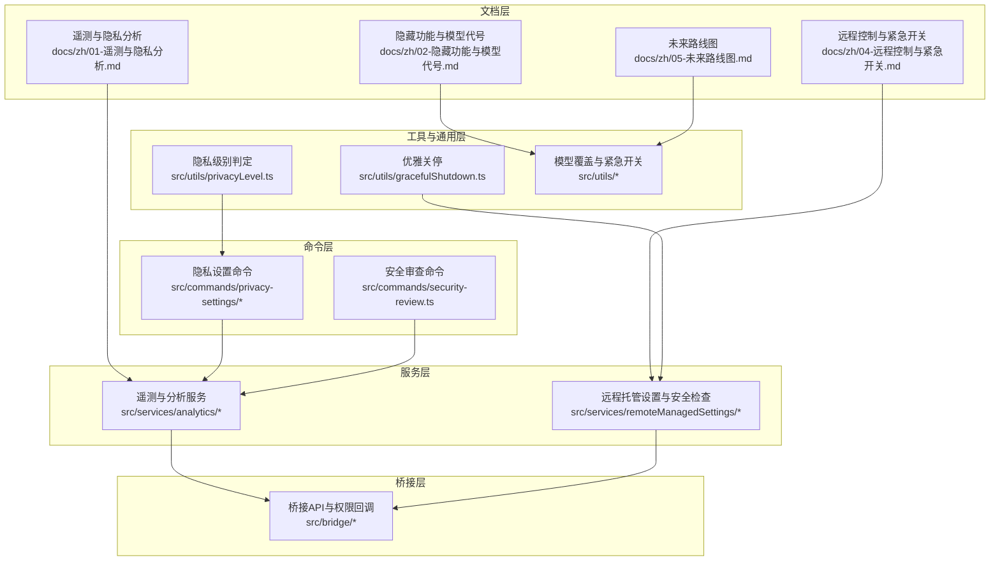

**图表来源**
- [01-遥测与隐私分析.md:1-110](file://docs/zh/01-遥测与隐私分析.md#L1-L110)
- [04-远程控制与紧急开关.md:1-121](file://docs/zh/04-远程控制与紧急开关.md#L1-L121)
- [privacy-settings.tsx:1-58](file://src/commands/privacy-settings/privacy-settings.tsx#L1-L58)
- [security-review.ts:1-244](file://src/commands/security-review.ts#L1-L244)
- [firstPartyEventLoggingExporter.ts](file://src/services/analytics/firstPartyEventLoggingExporter.ts)
- [datadog.ts](file://src/services/analytics/datadog.ts)
- [remoteManagedSettings_index.ts](file://src/services/remoteManagedSettings/index.ts)
- [remoteManagedSettings_securityCheck.tsx:1-74](file://src/services/remoteManagedSettings/securityCheck.tsx#L1-L74)
- [privacyLevel.ts:1-56](file://src/utils/privacyLevel.ts#L1-L56)
- [gracefulShutdown.ts](file://src/utils/gracefulShutdown.ts)

**章节来源**
- [01-遥测与隐私分析.md:1-110](file://docs/zh/01-遥测与隐私分析.md#L1-L110)
- [04-远程控制与紧急开关.md:1-121](file://docs/zh/04-远程控制与紧急开关.md#L1-L121)
- [privacy-settings.tsx:1-58](file://src/commands/privacy-settings/privacy-settings.tsx#L1-L58)
- [security-review.ts:1-244](file://src/commands/security-review.ts#L1-L244)
- [privacyLevel.ts:1-56](file://src/utils/privacyLevel.ts#L1-L56)

## 核心组件
- 隐私级别判定与最小化网络流量：通过环境变量决定是否禁用遥测与非必要网络流量，提供“essential-traffic”和“no-telemetry”两级限制
- 隐私设置命令与对话框：提供用户可见的隐私设置入口，支持“帮助改进 Claude”开关，并记录切换事件
- 安全审查命令：基于固定提示模板与受限工具集合，进行安全审查，强调高置信度漏洞识别
- 远程托管设置与安全检查：从远端拉取设置，检测“危险变更”，阻塞式对话框要求用户接受或退出
- 遥测与分析服务：第一方事件日志与第三方 Datadog 管道，支持批量、重试与失败持久化
- 桥接与权限：桥接通信、权限回调、会话与传输安全、可信设备与会话兼容

**章节来源**
- [privacyLevel.ts:1-56](file://src/utils/privacyLevel.ts#L1-L56)
- [privacy-settings.tsx:1-58](file://src/commands/privacy-settings/privacy-settings.tsx#L1-L58)
- [index.ts:1-15](file://src/commands/privacy-settings/index.ts#L1-L15)
- [security-review.ts:1-244](file://src/commands/security-review.ts#L1-L244)
- [securityCheck.tsx:1-74](file://src/services/remoteManagedSettings/securityCheck.tsx#L1-L74)
- [firstPartyEventLoggingExporter.ts](file://src/services/analytics/firstPartyEventLoggingExporter.ts)
- [datadog.ts](file://src/services/analytics/datadog.ts)
- [bridgeApi.ts](file://src/bridge/bridgeApi.ts)
- [bridgePermissionCallbacks.ts](file://src/bridge/bridgePermissionCallbacks.ts)
- [replBridge.ts](file://src/bridge/replBridge.ts)
- [replBridgeTransport.ts](file://src/bridge/replBridgeTransport.ts)
- [workSecret.ts](file://src/bridge/workSecret.ts)
- [trustedDevice.ts](file://src/bridge/trustedDevice.ts)
- [sessionIdCompat.ts](file://src/bridge/sessionIdCompat.ts)
- [remoteBridgeCore.ts](file://src/bridge/remoteBridgeCore.ts)
- [bridgeStatusUtil.ts](file://src/bridge/bridgeStatusUtil.ts)
- [bridgeUI.ts](file://src/bridge/bridgeUI.ts)
- [bridgeEnabled.ts](file://src/bridge/bridgeEnabled.ts)
- [bridgeMain.ts](file://src/bridge/bridgeMain.ts)
- [bridgeMessaging.ts](file://src/bridge/bridgeMessaging.ts)
- [bridgePointer.ts](file://src/bridge/bridgePointer.ts)
- [codeSessionApi.ts](file://src/bridge/codeSessionApi.ts)
- [createSession.ts](file://src/bridge/createSession.ts)
- [sessionRunner.ts](file://src/bridge/sessionRunner.ts)
- [inboundMessages.ts](file://src/bridge/inboundMessages.ts)
- [inboundAttachments.ts](file://src/bridge/inboundAttachments.ts)
- [flushGate.ts](file://src/bridge/flushGate.ts)
- [capacityWake.ts](file://src/bridge/capacityWake.ts)
- [initReplBridge.ts](file://src/bridge/initReplBridge.ts)
- [jwtUtils.ts](file://src/bridge/jwtUtils.ts)

## 架构总览
下图展示了隐私与安全相关的关键组件及其交互关系。

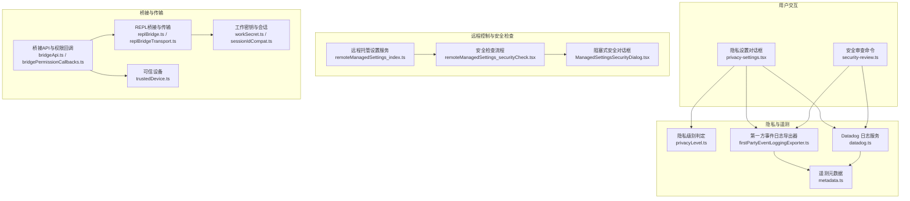

**图表来源**
- [privacy-settings.tsx:1-58](file://src/commands/privacy-settings/privacy-settings.tsx#L1-L58)
- [security-review.ts:1-244](file://src/commands/security-review.ts#L1-L244)
- [privacyLevel.ts:1-56](file://src/utils/privacyLevel.ts#L1-L56)
- [firstPartyEventLoggingExporter.ts](file://src/services/analytics/firstPartyEventLoggingExporter.ts)
- [datadog.ts](file://src/services/analytics/datadog.ts)
- [metadata.ts](file://src/services/analytics/metadata.ts)
- [remoteManagedSettings_index.ts](file://src/services/remoteManagedSettings/index.ts)
- [remoteManagedSettings_securityCheck.tsx:1-74](file://src/services/remoteManagedSettings/securityCheck.tsx#L1-L74)
- [ManagedSettingsSecurityDialog.tsx](file://src/components/ManagedSettingsSecurityDialog/ManagedSettingsSecurityDialog.tsx)
- [bridgeApi.ts](file://src/bridge/bridgeApi.ts)
- [bridgePermissionCallbacks.ts](file://src/bridge/bridgePermissionCallbacks.ts)
- [replBridge.ts](file://src/bridge/replBridge.ts)
- [replBridgeTransport.ts](file://src/bridge/replBridgeTransport.ts)
- [workSecret.ts](file://src/bridge/workSecret.ts)
- [sessionIdCompat.ts](file://src/bridge/sessionIdCompat.ts)
- [trustedDevice.ts](file://src/bridge/trustedDevice.ts)

## 详细组件分析

### 隐私级别与最小化网络流量
- 隐私级别来源：优先级顺序为“essential-traffic” > “no-telemetry” > “default”
- 环境变量控制：
  - essential-traffic：禁止一切非必要网络流量（遥测、自动更新、Grove、发布说明、模型能力等）
  - no-telemetry：禁用分析/遥测（Datadog、1P 事件、反馈调查）
- 适用场景：企业或个人对隐私敏感的部署，可通过环境变量实现全局最小化

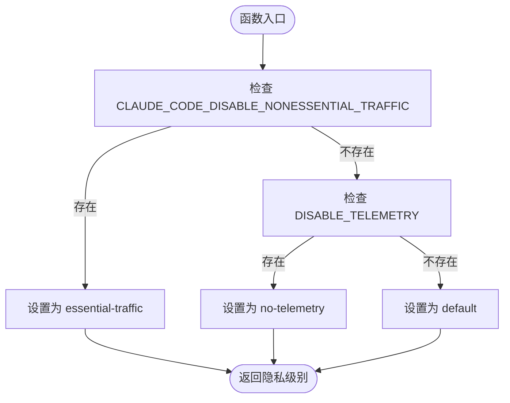

**图表来源**
- [privacyLevel.ts:20-28](file://src/utils/privacyLevel.ts#L20-L28)

**章节来源**
- [privacyLevel.ts:1-56](file://src/utils/privacyLevel.ts#L1-L56)

### 隐私设置命令与用户交互
- 命令入口：仅面向消费者订阅用户开放
- 功能流程：
  - 检查资格，若未达标则引导至网页设置
  - 并行获取隐私设置与公告配置；任一失败则回退到网页
  - 若已接受条款，直接显示隐私设置对话框；否则显示条款对话框
  - 切换后记录事件并提示用户最新状态
- 隐私设置包括“帮助改进 Claude”开关，切换时记录遥测事件

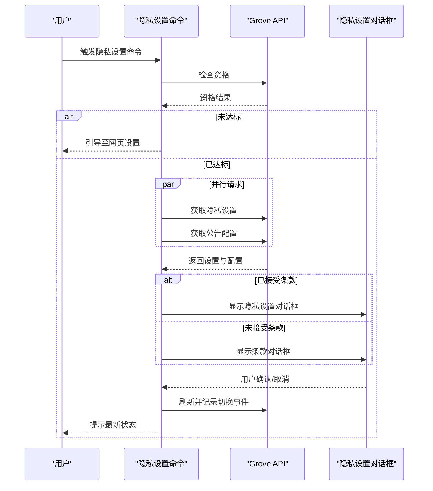

**图表来源**
- [privacy-settings.tsx:7-57](file://src/commands/privacy-settings/privacy-settings.tsx#L7-L57)
- [index.ts:4-12](file://src/commands/privacy-settings/index.ts#L4-L12)

**章节来源**
- [privacy-settings.tsx:1-58](file://src/commands/privacy-settings/privacy-settings.tsx#L1-L58)
- [index.ts:1-15](file://src/commands/privacy-settings/index.ts#L1-L15)

### 安全审查命令
- 目标：聚焦高置信度安全漏洞，避免噪声与理论问题
- 工具限制：通过 frontmatter 中的 allowed-tools 限定可用工具
- 方法论：三阶段分析（上下文研究、对比分析、脆弱性评估），并应用严格的“否决过滤”规则
- 输出：Markdown 报告，包含文件、行号、严重性、类别、描述、利用场景与修复建议

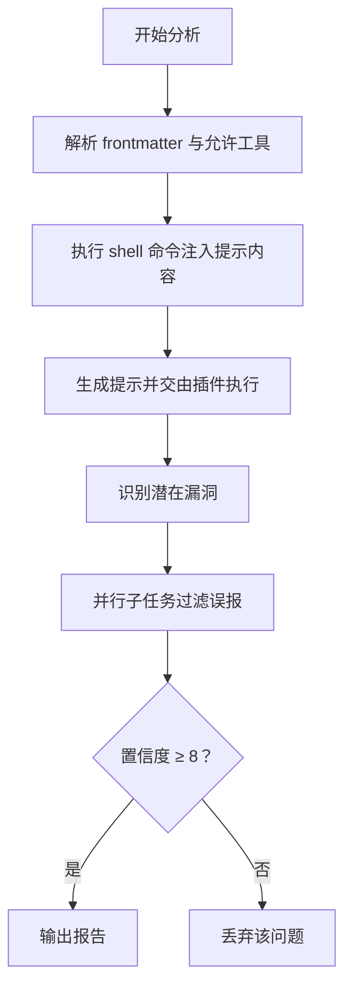

**图表来源**
- [security-review.ts:6-243](file://src/commands/security-review.ts#L6-L243)

**章节来源**
- [security-review.ts:1-244](file://src/commands/security-review.ts#L1-L244)

### 远程托管设置与安全检查
- 远程设置来源：定时轮询远端设置端点，最多重试若干次
- 资格：Console 用户全部满足；OAuth 用户需 Enterprise/C4E 或 Team 订阅
- 危险变更检测：若新设置包含危险项且发生变更，则弹出阻塞式对话框
- 结果处理：用户接受则继续，拒绝则调用优雅关停

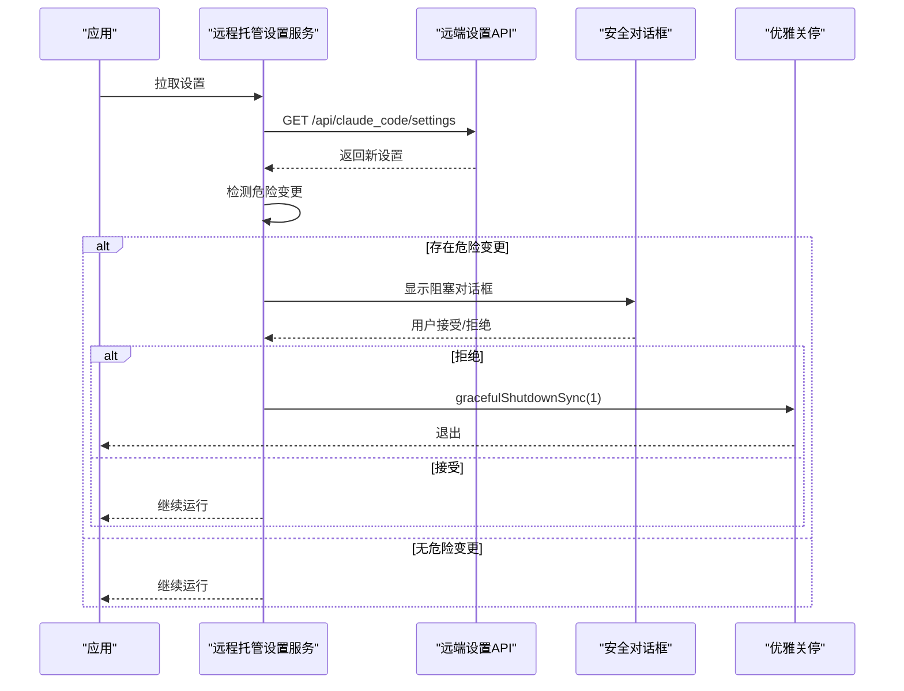

**图表来源**
- [remoteManagedSettings_securityCheck.tsx:22-61](file://src/services/remoteManagedSettings/securityCheck.tsx#L22-L61)
- [ManagedSettingsSecurityDialog.tsx](file://src/components/ManagedSettingsSecurityDialog/ManagedSettingsSecurityDialog.tsx)
- [gracefulShutdown.ts](file://src/utils/gracefulShutdown.ts)

**章节来源**
- [remoteManagedSettings_securityCheck.tsx:1-74](file://src/services/remoteManagedSettings/securityCheck.tsx#L1-L74)

### 遥测与隐私数据管道
- 第一方日志（1P）：
  - 端点与协议：OpenTelemetry + Protocol Buffers
  - 批量与重试：每批最多 200 个事件，10 秒刷新；二次方退避最多 8 次；失败事件持久化到磁盘
  - 存储位置：用户目录下的遥测数据文件夹
- 第三方日志（Datadog）：
  - 端点：特定 intake 地址
  - 事件范围：仅限预批准事件类型
  - Token：公开常量（注意：不应在生产中硬编码）
- 元数据与最小化：
  - 环境指纹、进程指标、用户追踪、工具输入截断
  - OTEL_LOG_TOOL_DETAILS=1 时记录完整工具输入（存在风险）

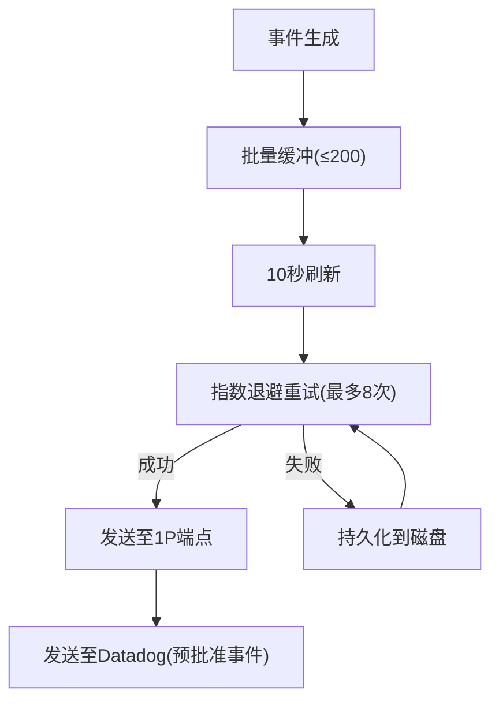

**图表来源**
- [firstPartyEventLoggingExporter.ts](file://src/services/analytics/firstPartyEventLoggingExporter.ts)
- [datadog.ts](file://src/services/analytics/datadog.ts)
- [metadata.ts:33-74](file://src/services/analytics/metadata.ts#L33-L74)

**章节来源**
- [01-遥测与隐私分析.md:11-109](file://docs/zh/01-遥测与隐私分析.md#L11-L109)

### 权限控制与规则引擎
- 规则来源：命令提示中的 allowed-tools 与工具权限上下文
- 交互流程：命令加载时解析 frontmatter，注入 alwaysAllowRules，确保仅在受控范围内执行
- 安全路径限制：通过工具白名单与权限回调，限制高危操作

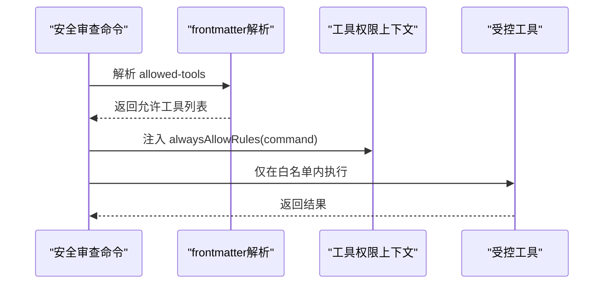

**图表来源**
- [security-review.ts:205-234](file://src/commands/security-review.ts#L205-L234)

**章节来源**
- [security-review.ts:1-244](file://src/commands/security-review.ts#L1-L244)

### 传输加密与密钥管理
- mTLS/WebSocket：语音模式连接使用专用端点与 mTLS
- 会话与令牌：会话 ID 兼容、工作密钥、JWT 工具等
- 传输安全：REPL 桥接与传输层、桥接消息与附件处理

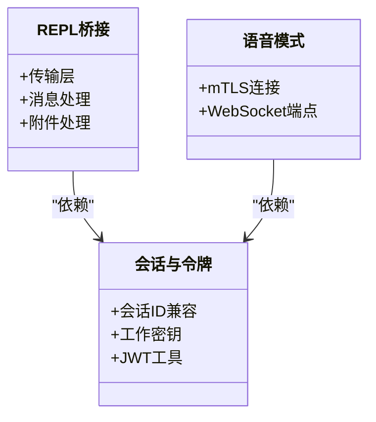

**图表来源**
- [replBridgeTransport.ts](file://src/bridge/replBridgeTransport.ts)
- [replBridge.ts](file://src/bridge/replBridge.ts)
- [sessionIdCompat.ts](file://src/bridge/sessionIdCompat.ts)
- [workSecret.ts](file://src/bridge/workSecret.ts)
- [jwtUtils.ts](file://src/bridge/jwtUtils.ts)
- [voiceModeEnabled.ts](file://src/voice/voiceModeEnabled.ts)

**章节来源**
- [replBridgeTransport.ts](file://src/bridge/replBridgeTransport.ts)
- [replBridge.ts](file://src/bridge/replBridge.ts)
- [sessionIdCompat.ts](file://src/bridge/sessionIdCompat.ts)
- [workSecret.ts](file://src/bridge/workSecret.ts)
- [jwtUtils.ts](file://src/bridge/jwtUtils.ts)
- [voiceModeEnabled.ts](file://src/voice/voiceModeEnabled.ts)

### 紧急开关与远程控制
- GrowthBook Feature Flags：多种功能可通过远程禁用（如绕过权限、自动模式断路器、语音模式等）
- Kill Switch：分析管道、语音模式、快速模式等可被远程关闭
- 模型覆盖：内部员工模型覆盖标志可远程设定默认模型、effort level、系统提示词与别名
- 企业与内部差异：内部用户（ant）享有更多保护与补丁

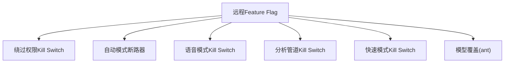

**图表来源**
- [bypassPermissionsKillswitch.ts](file://src/utils/permissions/bypassPermissionsKillswitch.ts)
- [autoModeState.ts](file://src/utils/permissions/autoModeState.ts)
- [fastMode.ts](file://src/utils/fastMode.ts)
- [sinkKillswitch.ts](file://src/services/analytics/sinkKillswitch.ts)
- [voiceModeEnabled.ts](file://src/voice/voiceModeEnabled.ts)
- [antModels.ts](file://src/utils/model/antModels.ts)

**章节来源**
- [04-远程控制与紧急开关.md:55-120](file://docs/zh/04-远程控制与紧急开关.md#L55-L120)

### 隐私保护与数据匿名化
- 工具输入截断：字符串、JSON、数组、嵌套对象均有上限与层级限制
- OTEL_LOG_TOOL_DETAILS：开启后记录完整输入，存在隐私风险
- 仓库指纹：仓库 URL 哈希用于服务端关联
- 代号与模型信息保护：内部模型代号与未发布版本号受保护，构建扫描与运行时构造规避泄露

**章节来源**
- [01-遥测与隐私分析.md:65-109](file://docs/zh/01-遥测与隐私分析.md#L65-L109)
- [undercover.ts:18-37](file://src/utils/undercover.ts#L18-L37)

## 依赖关系分析
- 命令层依赖服务层与工具层，确保隐私设置与安全审查具备统一的遥测与权限控制
- 服务层依赖桥接层实现跨进程通信与安全传输
- 远程托管设置与安全检查依赖 UI 组件与分析服务

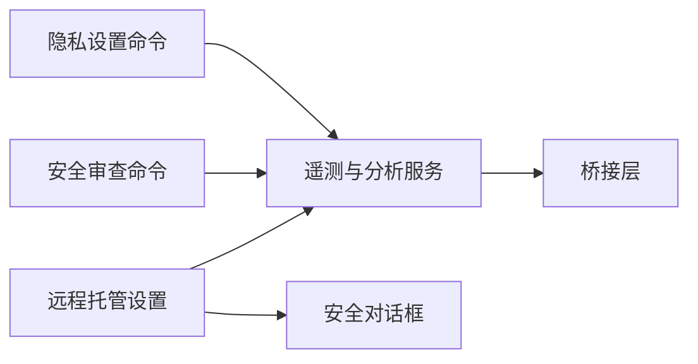

**图表来源**
- [privacy-settings.tsx:1-58](file://src/commands/privacy-settings/privacy-settings.tsx#L1-L58)
- [security-review.ts:1-244](file://src/commands/security-review.ts#L1-L244)
- [firstPartyEventLoggingExporter.ts](file://src/services/analytics/firstPartyEventLoggingExporter.ts)
- [remoteManagedSettings_securityCheck.tsx:1-74](file://src/services/remoteManagedSettings/securityCheck.tsx#L1-L74)
- [ManagedSettingsSecurityDialog.tsx](file://src/components/ManagedSettingsSecurityDialog/ManagedSettingsSecurityDialog.tsx)

**章节来源**
- [privacy-settings.tsx:1-58](file://src/commands/privacy-settings/privacy-settings.tsx#L1-L58)
- [security-review.ts:1-244](file://src/commands/security-review.ts#L1-L244)
- [remoteManagedSettings_securityCheck.tsx:1-74](file://src/services/remoteManagedSettings/securityCheck.tsx#L1-L74)

## 性能考量
- 遥测批量与重试：批量大小与刷新周期降低网络抖动影响；二次方退避避免雪崩
- 非必要流量抑制：essential-traffic 级别可显著减少网络与 CPU 占用
- 远程设置轮询：按小时静默轮询，降低对用户体验的影响

[本节为通用指导，无需特定文件引用]

## 故障排查指南
- 隐私设置无法打开：
  - 检查是否为消费者订阅用户
  - 确认网络可达性与 API 返回状态
  - 若 API 失败，命令会回退到网页设置指引
- 遥测未生效：
  - 检查环境变量是否设置为 no-telemetry 或 essential-traffic
  - 查看失败事件持久化与重试日志
- 远程设置导致退出：
  - 拒绝危险变更将触发优雅关停
  - 检查安全对话框日志与远程设置变更记录

**章节来源**
- [privacy-settings.tsx:13-18](file://src/commands/privacy-settings/privacy-settings.tsx#L13-L18)
- [privacyLevel.ts:20-28](file://src/utils/privacyLevel.ts#L20-L28)
- [securityCheck.tsx:67-73](file://src/services/remoteManagedSettings/securityCheck.tsx#L67-L73)

## 结论
Claude Code 在隐私与安全方面采取了多层次的设计：
- 通过隐私级别与环境变量实现最小化网络与遥测
- 提供用户可见的隐私设置与安全审查命令
- 采用阻塞式安全检查与远程托管设置，保障企业与内部用户的可控性
- 遥测与分析服务遵循批量、重试与持久化的稳健策略
- 远程控制与紧急开关覆盖多类功能，便于在极端情况下快速收敛风险

建议在生产环境中：
- 默认启用 essential-traffic，仅在必要时解除限制
- 严格管理 OTEL_LOG_TOOL_DETAILS 环境变量
- 定期审查远程设置与 Feature Flags，确保最小权限原则
- 对语音与桥接传输实施 mTLS 与会话密钥管理

[本节为总结，无需特定文件引用]

## 附录

### 安全配置示例（正确做法）
- 禁用非必要网络流量：设置环境变量以启用 essential-traffic
- 禁用遥测：设置环境变量以启用 no-telemetry
- 语音模式：仅在 OAuth 用户且满足条件时启用
- 远程设置：企业管理员应谨慎引入危险变更，确保用户知情与接受

**章节来源**
- [privacyLevel.ts:18-28](file://src/utils/privacyLevel.ts#L18-L28)
- [voiceModeEnabled.ts:82-93](file://src/voice/voiceModeEnabled.ts#L82-L93)

### 威胁建模与风险缓解
- 远程控制滥用：通过阻塞式安全检查与优雅关停限制不可逆变更
- 遥测数据泄露：启用最小化隐私级别，避免完整工具输入记录
- 模型覆盖风险：仅对内部用户开放，严格审计变更

**章节来源**
- [securityCheck.tsx:22-61](file://src/services/remoteManagedSettings/securityCheck.tsx#L22-L61)
- [01-遥测与隐私分析.md:76-77](file://docs/zh/01-遥测与隐私分析.md#L76-L77)
- [antModels.ts:98-108](file://src/utils/model/antModels.ts#L98-L108)

### 安全事件响应与应急处理
- 远程设置拒绝：立即触发优雅关停，避免继续运行
- 遥测异常：检查批量、重试与持久化日志，必要时临时禁用遥测
- 语音与桥接异常：核查 mTLS 与会话密钥，重建安全通道

**章节来源**
- [securityCheck.tsx:67-73](file://src/services/remoteManagedSettings/securityCheck.tsx#L67-L73)
- [gracefulShutdown.ts](file://src/utils/gracefulShutdown.ts)
- [voiceModeEnabled.ts:82-93](file://src/voice/voiceModeEnabled.ts#L82-L93)