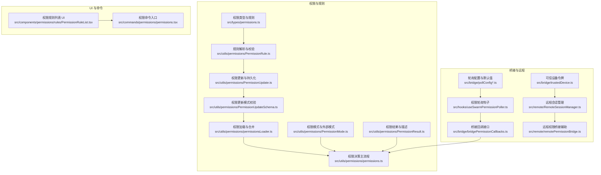
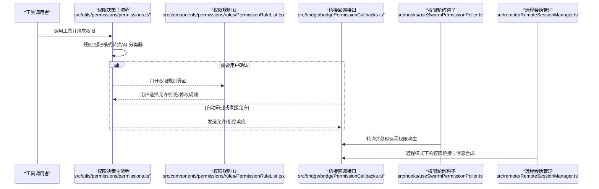
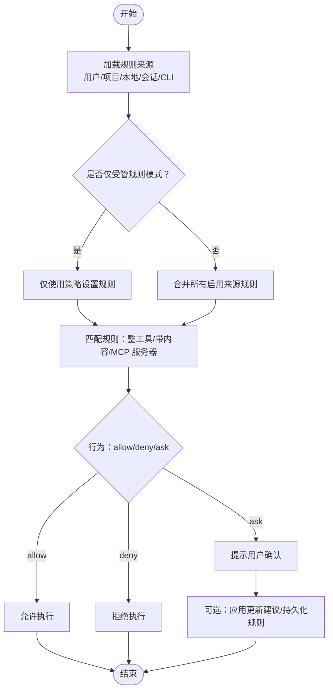
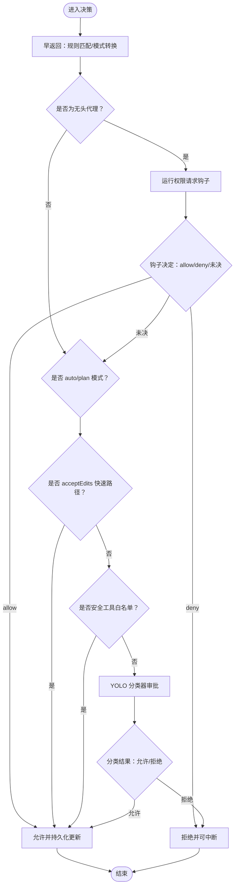
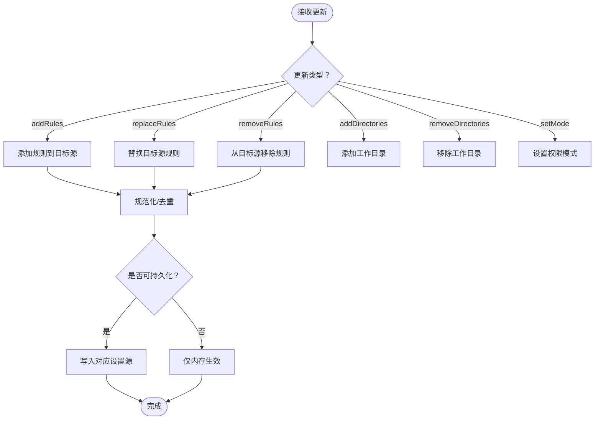
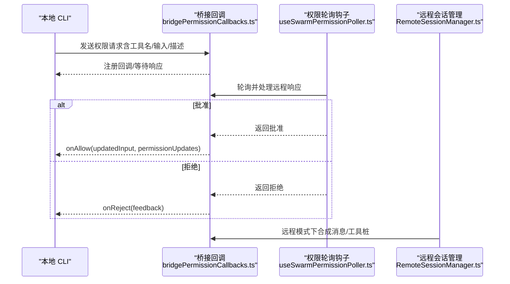
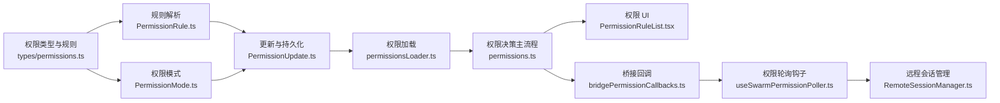

# 安全架构设计

<cite>
**本文引用的文件**
- [src/commands/permissions/permissions.tsx](file://src/commands/permissions/permissions.tsx)
- [src/components/permissions/rules/PermissionRuleList.tsx](file://src/components/permissions/rules/PermissionRuleList.tsx)
- [src/types/permissions.ts](file://src/types/permissions.ts)
- [src/utils/permissions/PermissionRule.ts](file://src/utils/permissions/PermissionRule.ts)
- [src/utils/permissions/PermissionMode.ts](file://src/utils/permissions/PermissionMode.ts)
- [src/utils/permissions/PermissionResult.ts](file://src/utils/permissions/PermissionResult.ts)
- [src/utils/permissions/PermissionUpdate.ts](file://src/utils/permissions/PermissionUpdate.ts)
- [src/utils/permissions/PermissionUpdateSchema.ts](file://src/utils/permissions/PermissionUpdateSchema.ts)
- [src/utils/permissions/permissions.ts](file://src/utils/permissions/permissions.ts)
- [src/utils/permissions/permissionsLoader.ts](file://src/utils/permissions/permissionsLoader.ts)
- [src/bridge/bridgePermissionCallbacks.ts](file://src/bridge/bridgePermissionCallbacks.ts)
- [src/remote/RemoteSessionManager.ts](file://src/remote/RemoteSessionManager.ts)
- [src/remote/remotePermissionBridge.ts](file://src/remote/remotePermissionBridge.ts)
- [src/hooks/useSwarmPermissionPoller.ts](file://src/hooks/useSwarmPermissionPoller.ts)
- [src/bridge/pollConfig.ts](file://src/bridge/pollConfig.ts)
- [src/bridge/pollConfigDefaults.ts](file://src/bridge/pollConfigDefaults.ts)
- [src/bridge/trustedDevice.ts](file://src/bridge/trustedDevice.ts)
- [docs/en/01-telemetry-and-privacy.md](file://docs/en/01-telemetry-and-privacy.md)
- [docs/ko/01-텔레메트리와-프라이버시.md](file://docs/ko/01-텔레메트리와-프라이버시.md)
</cite>

## 目录
1. [引言](#引言)
2. [项目结构](#项目结构)
3. [核心组件](#核心组件)
4. [架构总览](#架构总览)
5. [详细组件分析](#详细组件分析)
6. [依赖关系分析](#依赖关系分析)
7. [性能考量](#性能考量)
8. [故障排查指南](#故障排查指南)
9. [结论](#结论)
10. [附录](#附录)

## 引言
本文件面向 Claude Code 的安全架构设计，系统化阐述其多层安全防护机制、威胁建模与安全边界定义，以及权限控制架构（规则引擎、权限分类与访问控制矩阵）。文档同时解释安全策略的实施方式（默认拒绝、最小权限、纵深防御），并梳理安全组件间的交互关系（权限检查器、安全网关、审计系统）。最后给出安全配置最佳实践与常见风险的防护建议，并通过图示与“章节来源”帮助读者快速定位到具体实现。

## 项目结构
围绕安全主题，关键目录与文件分布如下：
- 权限规则与模式：src/utils/permissions/* 与 src/types/permissions.ts
- 权限 UI 与命令入口：src/components/permissions/* 与 src/commands/permissions/*
- 桥接与远程会话：src/bridge/* 与 src/remote/*
- 策略轮询与可信设备：src/hooks/useSwarmPermissionPoller.ts、src/bridge/pollConfig*、src/bridge/trustedDevice.ts
- 隐私与遥测：docs/en/01-telemetry-and-privacy.md、docs/ko/01-텔레메트리와-프라이버시.md

图表来源
- [src/types/permissions.ts:75-171](file://src/types/permissions.ts#L75-L171)
- [src/utils/permissions/PermissionRule.ts:1-41](file://src/utils/permissions/PermissionRule.ts#L1-L41)
- [src/utils/permissions/PermissionMode.ts:1-142](file://src/utils/permissions/PermissionMode.ts#L1-L142)
- [src/utils/permissions/PermissionResult.ts:1-36](file://src/utils/permissions/PermissionResult.ts#L1-L36)
- [src/utils/permissions/PermissionUpdate.ts:1-390](file://src/utils/permissions/PermissionUpdate.ts#L1-L390)
- [src/utils/permissions/PermissionUpdateSchema.ts:1-79](file://src/utils/permissions/PermissionUpdateSchema.ts#L1-L79)
- [src/utils/permissions/permissionsLoader.ts:1-297](file://src/utils/permissions/permissionsLoader.ts#L1-L297)
- [src/utils/permissions/permissions.ts:1-800](file://src/utils/permissions/permissions.ts#L1-L800)
- [src/components/permissions/rules/PermissionRuleList.tsx:1-800](file://src/components/permissions/rules/PermissionRuleList.tsx#L1-L800)
- [src/commands/permissions/permissions.tsx:1-9](file://src/commands/permissions/permissions.tsx#L1-L9)
- [src/bridge/bridgePermissionCallbacks.ts:1-44](file://src/bridge/bridgePermissionCallbacks.ts#L1-L44)
- [src/remote/RemoteSessionManager.ts:1-53](file://src/remote/RemoteSessionManager.ts#L1-L53)
- [src/remote/remotePermissionBridge.ts:1-79](file://src/remote/remotePermissionBridge.ts#L1-L79)
- [src/hooks/useSwarmPermissionPoller.ts:81-298](file://src/hooks/useSwarmPermissionPoller.ts#L81-L298)
- [src/bridge/pollConfig.ts:1-111](file://src/bridge/pollConfig.ts#L1-L111)
- [src/bridge/pollConfigDefaults.ts:1-83](file://src/bridge/pollConfigDefaults.ts#L1-L83)
- [src/bridge/trustedDevice.ts:28-210](file://src/bridge/trustedDevice.ts#L28-L210)

章节来源
- [src/commands/permissions/permissions.tsx:1-9](file://src/commands/permissions/permissions.tsx#L1-L9)
- [src/components/permissions/rules/PermissionRuleList.tsx:1-800](file://src/components/permissions/rules/PermissionRuleList.tsx#L1-L800)
- [src/types/permissions.ts:75-171](file://src/types/permissions.ts#L75-L171)
- [src/utils/permissions/PermissionRule.ts:1-41](file://src/utils/permissions/PermissionRule.ts#L1-L41)
- [src/utils/permissions/PermissionMode.ts:1-142](file://src/utils/permissions/PermissionMode.ts#L1-L142)
- [src/utils/permissions/PermissionResult.ts:1-36](file://src/utils/permissions/PermissionResult.ts#L1-L36)
- [src/utils/permissions/PermissionUpdate.ts:1-390](file://src/utils/permissions/PermissionUpdate.ts#L1-L390)
- [src/utils/permissions/PermissionUpdateSchema.ts:1-79](file://src/utils/permissions/PermissionUpdateSchema.ts#L1-L79)
- [src/utils/permissions/permissions.ts:1-800](file://src/utils/permissions/permissions.ts#L1-L800)
- [src/utils/permissions/permissionsLoader.ts:1-297](file://src/utils/permissions/permissionsLoader.ts#L1-L297)
- [src/bridge/bridgePermissionCallbacks.ts:1-44](file://src/bridge/bridgePermissionCallbacks.ts#L1-L44)
- [src/remote/RemoteSessionManager.ts:1-53](file://src/remote/RemoteSessionManager.ts#L1-L53)
- [src/remote/remotePermissionBridge.ts:1-79](file://src/remote/remotePermissionBridge.ts#L1-L79)
- [src/hooks/useSwarmPermissionPoller.ts:81-298](file://src/hooks/useSwarmPermissionPoller.ts#L81-L298)
- [src/bridge/pollConfig.ts:1-111](file://src/bridge/pollConfig.ts#L1-L111)
- [src/bridge/pollConfigDefaults.ts:1-83](file://src/bridge/pollConfigDefaults.ts#L1-L83)
- [src/bridge/trustedDevice.ts:28-210](file://src/bridge/trustedDevice.ts#L28-L210)

## 核心组件
- 权限规则与模式
  - 规则行为：允许（allow）、拒绝（deny）、询问（ask）
  - 规则值：工具名与可选内容（如 Bash(prefix:*)、MCP 服务器级规则）
  - 外部模式：default、plan、acceptEdits、bypassPermissions、dontAsk、auto（ant-only）
- 权限上下文与决策
  - 工具权限上下文包含各源的规则集合、工作目录扩展、当前模式等
  - 决策主流程负责规则匹配、模式转换、AI 分类器自动审批、拒绝计数与提示
- 更新与持久化
  - 支持添加/替换/移除规则、增删工作目录、设置模式
  - 可持久化至用户/项目/本地设置或仅会话内生效
- UI 与命令
  - 提供交互式规则列表、搜索、新增、删除与工作区管理
  - 命令入口用于打开权限规则界面并处理重试拒绝

章节来源
- [src/types/permissions.ts:75-171](file://src/types/permissions.ts#L75-L171)
- [src/utils/permissions/PermissionRule.ts:19-41](file://src/utils/permissions/PermissionRule.ts#L19-L41)
- [src/utils/permissions/PermissionMode.ts:21-142](file://src/utils/permissions/PermissionMode.ts#L21-L142)
- [src/utils/permissions/PermissionUpdate.ts:55-188](file://src/utils/permissions/PermissionUpdate.ts#L55-L188)
- [src/utils/permissions/permissions.ts:473-800](file://src/utils/permissions/permissions.ts#L473-L800)
- [src/components/permissions/rules/PermissionRuleList.tsx:464-800](file://src/components/permissions/rules/PermissionRuleList.tsx#L464-L800)
- [src/commands/permissions/permissions.tsx:1-9](file://src/commands/permissions/permissions.tsx#L1-L9)

## 架构总览
下图展示了从工具调用到权限决策、桥接通信与远程会话的整体流程，以及可信设备与轮询策略在其中的作用。

图表来源
- [src/utils/permissions/permissions.ts:473-800](file://src/utils/permissions/permissions.ts#L473-L800)
- [src/components/permissions/rules/PermissionRuleList.tsx:464-800](file://src/components/permissions/rules/PermissionRuleList.tsx#L464-L800)
- [src/bridge/bridgePermissionCallbacks.ts:10-27](file://src/bridge/bridgePermissionCallbacks.ts#L10-L27)
- [src/hooks/useSwarmPermissionPoller.ts:268-298](file://src/hooks/useSwarmPermissionPoller.ts#L268-L298)
- [src/remote/RemoteSessionManager.ts:19-53](file://src/remote/RemoteSessionManager.ts#L19-L53)

## 详细组件分析

### 权限规则引擎与访问控制矩阵
- 规则来源与优先级
  - 规则来源包括用户设置、项目设置、本地设置、会话、命令行参数等
  - 加载时支持“仅受管规则”模式，强制只接受策略设置中的规则
- 匹配逻辑
  - 整体工具匹配（如 Bash）与带内容的规则匹配（如 Bash(prefix:*)）
  - MCP 工具按服务器级别匹配，支持通配符
- 访问控制矩阵
  - 行为：allow/deny/ask
  - 维度：工具名、规则内容、来源、模式
  - 结果：允许、拒绝、提示用户、自动审批（auto 模式）

图表来源
- [src/utils/permissions/permissionsLoader.ts:120-133](file://src/utils/permissions/permissionsLoader.ts#L120-L133)
- [src/utils/permissions/permissions.ts:238-302](file://src/utils/permissions/permissions.ts#L238-L302)
- [src/utils/permissions/permissions.ts:122-231](file://src/utils/permissions/permissions.ts#L122-L231)

章节来源
- [src/utils/permissions/permissionsLoader.ts:120-133](file://src/utils/permissions/permissionsLoader.ts#L120-L133)
- [src/utils/permissions/permissions.ts:122-302](file://src/utils/permissions/permissions.ts#L122-L302)

### 权限决策主流程与自动模式
- 决策步骤
  - 规则匹配与早返回
  - 模式转换（如 dontAsk 将 ask 转为 deny）
  - 自动模式（auto/plan）：acceptEdits 快速路径、安全工具白名单、YOLO 分类器
  - 拒绝计数与提示（连续拒绝统计）
- 头脑/异步代理支持
  - 为无法显示提示的异步代理运行权限请求钩子，允许/拒绝或中断

图表来源
- [src/utils/permissions/permissions.ts:473-800](file://src/utils/permissions/permissions.ts#L473-L800)

章节来源
- [src/utils/permissions/permissions.ts:473-800](file://src/utils/permissions/permissions.ts#L473-L800)

### 权限更新与持久化
- 更新类型
  - 添加/替换/移除规则；增删工作目录；设置模式
- 持久化目标
  - 用户设置、项目设置、本地设置（gitignore）、会话内、命令行参数
- 去重与规范化
  - 规则字符串规范化以避免重复（如 Bash(*) 与 Bash 等价）

图表来源
- [src/utils/permissions/PermissionUpdate.ts:55-342](file://src/utils/permissions/PermissionUpdate.ts#L55-L342)
- [src/utils/permissions/PermissionUpdateSchema.ts:42-79](file://src/utils/permissions/PermissionUpdateSchema.ts#L42-L79)
- [src/utils/permissions/permissionsLoader.ts:229-297](file://src/utils/permissions/permissionsLoader.ts#L229-L297)

章节来源
- [src/utils/permissions/PermissionUpdate.ts:55-342](file://src/utils/permissions/PermissionUpdate.ts#L55-L342)
- [src/utils/permissions/PermissionUpdateSchema.ts:42-79](file://src/utils/permissions/PermissionUpdateSchema.ts#L42-L79)
- [src/utils/permissions/permissionsLoader.ts:229-297](file://src/utils/permissions/permissionsLoader.ts#L229-L297)

### 桥接与远程会话的安全交互
- 桥接回调
  - 定义请求/响应格式（允许/拒绝、更新输入、更新权限建议）
  - 类型守卫确保响应结构安全
- 远程会话
  - 合成助理消息与工具桩，适配远程容器中的工具
  - 允许在本地不存在的远程工具进行降级处理
- 权限轮询
  - 在集群工作节点中轮询权限响应，处理批准/拒绝与反馈
- 轮询配置
  - 生效于单会话与多会话场景，含心跳与容量态轮询间隔、回收窗口、保活间隔等
- 可信设备
  - 设备注册与令牌缓存，登录后清理旧令牌，发送时按门控开关启用

图表来源
- [src/bridge/bridgePermissionCallbacks.ts:10-27](file://src/bridge/bridgePermissionCallbacks.ts#L10-L27)
- [src/hooks/useSwarmPermissionPoller.ts:124-156](file://src/hooks/useSwarmPermissionPoller.ts#L124-L156)
- [src/remote/RemoteSessionManager.ts:19-53](file://src/remote/RemoteSessionManager.ts#L19-L53)

章节来源
- [src/bridge/bridgePermissionCallbacks.ts:1-44](file://src/bridge/bridgePermissionCallbacks.ts#L1-L44)
- [src/hooks/useSwarmPermissionPoller.ts:124-298](file://src/hooks/useSwarmPermissionPoller.ts#L124-L298)
- [src/remote/RemoteSessionManager.ts:1-53](file://src/remote/RemoteSessionManager.ts#L1-L53)
- [src/remote/remotePermissionBridge.ts:12-79](file://src/remote/remotePermissionBridge.ts#L12-L79)
- [src/bridge/pollConfig.ts:102-111](file://src/bridge/pollConfig.ts#L102-L111)
- [src/bridge/pollConfigDefaults.ts:55-83](file://src/bridge/pollConfigDefaults.ts#L55-L83)
- [src/bridge/trustedDevice.ts:98-210](file://src/bridge/trustedDevice.ts#L98-L210)

### 隐私与遥测边界
- 遥测数据范围与限制
  - 工具输入默认截断（字符串、JSON、数组、嵌套对象深度）
  - 特殊开关可开启完整输入记录
  - 仓库指纹（URL 哈希）用于服务端关联
- 事件日志与禁用
  - 第三方事件流向 Datadog
  - 对直接使用者，第一方日志不可直接关闭
  - 失败事件持久化磁盘并重试

章节来源
- [docs/en/01-telemetry-and-privacy.md:117-125](file://docs/en/01-telemetry-and-privacy.md#L117-L125)
- [docs/ko/01-텔레메트리와-프라이버시.md:54-104](file://docs/ko/01-텔레메트리와-프라이버시.md#L54-L104)

## 依赖关系分析
- 松耦合与高内聚
  - 权限类型与规则定义集中在 types/permissions.ts，避免循环依赖
  - 决策主流程独立于 UI，通过回调与钩子解耦
- 关键依赖链
  - 规则解析 → 权限上下文 → 决策主流程 → 更新与持久化 → UI/命令
  - 桥接回调 → 权限轮询钩子 → 远程会话管理
- 循环依赖规避
  - 使用延迟 Schema 与模块懒加载，避免导入环

图表来源
- [src/types/permissions.ts:75-171](file://src/types/permissions.ts#L75-L171)
- [src/utils/permissions/PermissionRule.ts:1-41](file://src/utils/permissions/PermissionRule.ts#L1-L41)
- [src/utils/permissions/PermissionMode.ts:1-142](file://src/utils/permissions/PermissionMode.ts#L1-L142)
- [src/utils/permissions/PermissionUpdate.ts:1-390](file://src/utils/permissions/PermissionUpdate.ts#L1-L390)
- [src/utils/permissions/permissionsLoader.ts:1-297](file://src/utils/permissions/permissionsLoader.ts#L1-L297)
- [src/utils/permissions/permissions.ts:1-800](file://src/utils/permissions/permissions.ts#L1-L800)
- [src/components/permissions/rules/PermissionRuleList.tsx:1-800](file://src/components/permissions/rules/PermissionRuleList.tsx#L1-L800)
- [src/bridge/bridgePermissionCallbacks.ts:1-44](file://src/bridge/bridgePermissionCallbacks.ts#L1-L44)
- [src/hooks/useSwarmPermissionPoller.ts:81-298](file://src/hooks/useSwarmPermissionPoller.ts#L81-L298)
- [src/remote/RemoteSessionManager.ts:1-53](file://src/remote/RemoteSessionManager.ts#L1-L53)

章节来源
- [src/types/permissions.ts:75-171](file://src/types/permissions.ts#L75-L171)
- [src/utils/permissions/permissions.ts:1-800](file://src/utils/permissions/permissions.ts#L1-L800)

## 性能考量
- 决策路径优化
  - acceptEdits 快速路径与安全工具白名单减少分类器调用
  - 连续拒绝计数与成功重置降低误判成本
- 轮询与心跳
  - 单/多会话轮询间隔与心跳独立配置，避免过密轮询导致的资源消耗
  - 容量态轮询与心跳共同维持连接活性
- 存储与序列化
  - 规则字符串规范化与去重，减少设置文件膨胀
  - 懒加载与延迟 Schema 减少启动时依赖链开销

## 故障排查指南
- 权限被拒
  - 检查规则来源与行为（allow/deny/ask），确认是否命中 MCP 服务器规则或工具内容规则
  - 查看拒绝计数与提示，必要时调整规则或切换模式
- 自动模式不生效
  - 确认当前模式为 auto/plan，且工具不在安全白名单或 acceptEdits 快速路径
  - 检查分类器可用性与错误输出（在特定用户类型下会通知错误转储位置）
- 远程权限响应未达
  - 检查轮询钩子是否注册回调、轮询间隔配置是否合理、远程会话是否正常
- 可信设备问题
  - 登录后清理旧令牌，确认门控开关已启用，环境变量覆盖优先级

章节来源
- [src/utils/permissions/permissions.ts:473-800](file://src/utils/permissions/permissions.ts#L473-L800)
- [src/hooks/useSwarmPermissionPoller.ts:124-298](file://src/hooks/useSwarmPermissionPoller.ts#L124-L298)
- [src/bridge/pollConfig.ts:102-111](file://src/bridge/pollConfig.ts#L102-L111)
- [src/bridge/trustedDevice.ts:98-210](file://src/bridge/trustedDevice.ts#L98-L210)

## 结论
Claude Code 的安全架构以“默认拒绝+最小权限+纵深防御”为核心，通过可组合的规则引擎、灵活的权限模式与严格的更新持久化，实现了对工具调用的细粒度控制。桥接与远程会话的安全交互配合轮询与可信设备机制，保障了跨环境的一致性与可审计性。隐私与遥测策略明确了数据边界与限制，配合可观测性指标与错误回退，形成闭环的安全体系。

## 附录
- 最佳实践
  - 采用“先规则后模式”的策略：优先通过 allow/deny 规则明确边界，再用模式提升效率
  - 使用工作目录扩展与读取规则建议，遵循最小权限原则
  - 在 auto/plan 模式下结合 acceptEdits 白名单与安全工具清单，减少分类器负担
  - 定期审查规则来源与受管规则模式，确保合规与一致性
- 常见风险与缓解
  - 规则冲突：利用 UI 的冲突检测与修复建议，避免阴影规则
  - 远程工具未知：通过工具桩与降级处理，保证远程会话可用性
  - 遥测敏感信息：依赖默认截断与开关控制，避免无意泄露